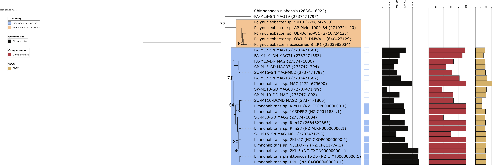

```{r setup, include = FALSE, warning = FALSE}
knitr::opts_chunk$set(eval = TRUE, 
                      echo = TRUE, 
                      cache = TRUE,
                      include = TRUE,
                      collapse = FALSE,
                      dependson = NULL,
                      engine = "R", # Chunks will always have R code, unless noted
                      error = TRUE,
                      fig.path="Figures/cached/",  # Set the figure options
                      fig.align = "center"
                      )
# Load libraries
library('tidyr')
library('dplyr')
library('ggplot2')
library("grid")
library("gridExtra")
library("easyGgplot2")
source("functions.R")

col_limno <- "#060670"
col_bac1 <- "#720000"
col_bac2 <- "#D46A6A"
```

```{r read-format data, warning = FALSE}
# Read data
mean_coverage <- read.table("./SAMPLES-SUMMARY/bins_across_samples/mean_coverage.txt", header = TRUE)
std_coverage <- read.table("./SAMPLES-SUMMARY/bins_across_samples/std_coverage.txt", header = TRUE)
bin_size <- read.table("./SAMPLES-SUMMARY/general_bins_summary.txt", header = TRUE)[, c(1,3)]
total_reads <- read.table("./sample_reads.tsv", header = TRUE)
read_length <- 300

# From wide to long format
mean_coverage_long <- gather(mean_coverage, Sample_ID, coverage, 
                             SAMPLE_16:SAMPLE_65, factor_key=TRUE)

std_coverage_long <- gather(std_coverage, Sample_ID, std_coverage, 
                            SAMPLE_16:SAMPLE_65, 
                            factor_key=TRUE)

coverage_data <- data.frame(mean_coverage_long, 
                            std_coverage = std_coverage_long[,3])

# Read and add metadata
# meta <- read.csv2("metadata.csv")
# meta$Sample_ID <- gsub(meta$Sample_ID, pattern = ".", replacement = "_", fixed = TRUE)
data_total <- left_join(coverage_data, total_reads, by = "Sample_ID")
data_total <- left_join(data_total, bin_size, by = "bins")
# data_total <- left_join(data_total, meta, by =  "Sample_ID")
data_total$bins <- plyr::revalue(data_total$bins, c("BetIa_bin"="Limnohabitans_bin", "bacIa_vizbin1"="Bacteroidetes_bin1",
                                              "bacIa_vizbin2"="Bacteroidetes_bin2"))
# Calculate relative abundance of the bins
data_total$mean_rel_abundance <- 100*(data_total$coverage*data_total$bin_size)/(read_length*data_total$Total_reads)
data_total$upper_rel_abundance <- 100*((data_total$coverage+data_total$std_coverage)*data_total$bin_size)/(read_length*data_total$Total_reads)
data_total$lower_rel_abundance <- 100*((data_total$coverage-data_total$std_coverage)*data_total$bin_size)/(read_length*data_total$Total_reads)

data_total$mean_rel_abundance_map <- 100*(data_total$coverage*data_total$bin_size)/(read_length*data_total$Mapped_reads)
data_total$upper_rel_abundance_map <- 100*((data_total$coverage+data_total$std_coverage)*data_total$bin_size)/(read_length*data_total$Mapped_reads)
data_total$lower_rel_abundance_map <- 100*((data_total$coverage-data_total$std_coverage)*data_total$bin_size)/(read_length*data_total$Mapped_reads)
```

# 1. Phylogenetic tree
## Limnohabitans
  


## Bacteroidetes

# *2. Investigate MAG- and 16S-based abundances*
It is clear that there is significant %GC coverage bias present. The estimated relative abundances
from metagenomics do not quantitatively match with the V3-V4 16S rRNA gene amplicon data.
$$Relative\ abundance =100*(\frac{mean\ coverage * bin\ size}{read\ length*total\ sample\ reads })$$
Another option is to calculate relative to mapped number of reads:
$$Relative\ abundance =100*(\frac{mean\ coverage * bin\ size}{read\ length*total\ sample\ reads * \%mapped\ reads})$$


Import reference relative abundances from 16S data set in order to directly compare with metagenomic data set.
```{r import-reference, warning = FALSE}
df_16S <- read.table("relative_abundance_16S.tsv", header = TRUE)
df_16S_long <- gather(df_16S, Sample_ID, relative_abundance_16S, 
                             SAMPLE_16:SAMPLE_65, factor_key=TRUE)
```


```{r plot-data, warning = FALSE, fig.width = 7.5, fig.height = 22.5,  dpi=500}
# Subset for only the three complete genomes (not PNCs).
data_total_sb <- data_total[data_total$bins %in% c("Limnohabitans_bin", "Bacteroidetes_bin1", "Bacteroidetes_bin2"),]

p_meta <- ggplot(data = data_total_sb, aes(x = bins, y = mean_rel_abundance, fill = bins))+
  geom_point(size = 4, shape = 21, alpha = 0.7)+
  scale_fill_manual(values = c(col_bac1, col_bac2, col_limno))+
  theme_bw()+
  geom_errorbar(aes(ymin=lower_rel_abundance, 
                    ymax=upper_rel_abundance, 
                    width=.1))+
  facet_grid(.~Sample_ID)+
  # ylim(0,1)+ 
  theme(axis.text=element_text(size=14), axis.title=element_text(size=20),
        title=element_text(size=20), legend.text=element_text(size=14),
        legend.background = element_rect(fill="transparent"),
        axis.text.x = element_text(angle = 45, hjust = 1),
        strip.text.x=element_text(size=18))+
  ylab("Mean relative abundance (%)")+
  ylim(-1,100)+
  ggtitle("Metagenomic - total reads")

# Corrected for mapped N° of reads
p_meta_mapped <- ggplot(data = data_total_sb, aes(x = bins, y = mean_rel_abundance_map, fill = bins))+
  geom_point(size = 4, shape = 21, alpha = 0.7)+
  scale_fill_manual(values = c(col_bac1, col_bac2, col_limno))+
  theme_bw()+
  geom_errorbar(aes(ymin=lower_rel_abundance_map, 
                    ymax=upper_rel_abundance_map, 
                    width=.1))+
  facet_grid(.~Sample_ID)+
  # ylim(0,1)+ 
  theme(axis.text=element_text(size=14), axis.title=element_text(size=20),
        title=element_text(size=20), legend.text=element_text(size=14),
        legend.background = element_rect(fill="transparent"),
        axis.text.x = element_text(angle = 45, hjust = 1),
        strip.text.x=element_text(size=18))+
  ylab("Mean relative abundance (%)")+
  ylim(-1,100)+
  ggtitle("Metagenomic - mapped reads")

p_16S <- ggplot(data = df_16S_long, aes(x = bins, y = relative_abundance_16S, fill = bins))+
  geom_point(size = 4, shape = 21, alpha = 0.7)+
  scale_fill_manual(values = c(col_bac1, col_bac2, col_limno))+
  theme_bw()+
  facet_grid(.~Sample_ID)+
  theme(axis.text=element_text(size=14), axis.title=element_text(size=20),
        title=element_text(size=20), legend.text=element_text(size=14),
        legend.background = element_rect(fill="transparent"),
        axis.text.x = element_text(angle = 45, hjust = 1),
        strip.text.x=element_text(size=18))+
  ylab("Mean relative abundance (%)")+
  ylim(-1,100)+
  ggtitle("V3-V4 16S")

grid_arrange_shared_legend(p_meta, p_meta_mapped, p_16S, ncol = 1, nrow = 3)
```

# *3. Investigate sequence characteristics within coding DNA sequences (CDS)*

```{r %GC-gene-analysis_v1, warning = FALSE, fig.width = 22.5, fig.height = 7.5,  dpi=500}
# First we need the files that map the gene ID to the sequence ID (linux cmd: https://github.com/rprops/MetaG_lakeMI/wiki/11.-Genome-annotation)
# These are stored in the IMG_annotation data for each genome bin

# Next, extract the %GC of each gene from the gff file
extract_gc_from_gff("./IMG_annotation/IMG_2724679690_Limnohabitans/121950.assembled.gff", outputFolder = "GC_analysis")
extract_gc_from_gff("./IMG_annotation/IMG_2724679691_Bacteroidetes_bin1/121951.assembled.gff", outputFolder = "GC_analysis")
extract_gc_from_gff("./IMG_annotation/IMG_2724679698_Bacteroidetes_bin2/121960.assembled.gff", outputFolder = "GC_analysis")

# Use these files to make dataframes mapping function (COGs) and %GC
LIMNO_gc_cog <- gc2function(seq_id_gc = "GC_analysis/seqid_GC_121950.assembled.gff.tsv", gene_id_seq_id ="./IMG_annotation/IMG_2724679690_Limnohabitans/Annotation/2724679690_gene_oid_2_seq_id.txt", 
                             functions = "./IMG_annotation/IMG_2724679690_Limnohabitans/Annotation/2724679690.cog.tab.txt", gc_thresh = 0.1, output = FALSE)

BAC1_gc_cog <- gc2function(seq_id_gc = "GC_analysis/seqid_GC_121951.assembled.gff.tsv", gene_id_seq_id ="./IMG_annotation/IMG_2724679691_Bacteroidetes_bin1/Annotation/2724679691_gene_oid_2_seq_id.txt", 
                             functions = "./IMG_annotation/IMG_2724679691_Bacteroidetes_bin1//Annotation/2724679691.cog.tab.txt", gc_thresh = 0.1, output = FALSE)

BAC2_gc_cog <- gc2function(seq_id_gc = "GC_analysis/seqid_GC_121960.assembled.gff.tsv", gene_id_seq_id ="./IMG_annotation/IMG_2724679698_Bacteroidetes_bin2/Annotation/2724679698_gene_oid_2_seq_id.txt", 
                             functions = "./IMG_annotation/IMG_2724679698_Bacteroidetes_bin2/Annotation/2724679698.cog.tab.txt", gc_thresh = 0.1, output = FALSE)

LIMNO_gc_pfam <- gc2function(seq_id_gc = "GC_analysis/seqid_GC_121950.assembled.gff.tsv", gene_id_seq_id ="./IMG_annotation/IMG_2724679690_Limnohabitans/Annotation/2724679690_gene_oid_2_seq_id.txt", 
                             functions = "./IMG_annotation/IMG_2724679690_Limnohabitans/Annotation/2724679690.pfam.tab.txt", gc_thresh = 0.1, output = FALSE)

BAC1_gc_pfam <- gc2function(seq_id_gc = "GC_analysis/seqid_GC_121951.assembled.gff.tsv", gene_id_seq_id ="./IMG_annotation/IMG_2724679691_Bacteroidetes_bin1/Annotation/2724679691_gene_oid_2_seq_id.txt", 
                             functions = "./IMG_annotation/IMG_2724679691_Bacteroidetes_bin1//Annotation/2724679691.pfam.tab.txt", gc_thresh = 0.1, output = FALSE)

BAC2_gc_pfam <- gc2function(seq_id_gc = "GC_analysis/seqid_GC_121960.assembled.gff.tsv", gene_id_seq_id ="./IMG_annotation/IMG_2724679698_Bacteroidetes_bin2/Annotation/2724679698_gene_oid_2_seq_id.txt", 
                             functions = "./IMG_annotation/IMG_2724679698_Bacteroidetes_bin2/Annotation/2724679698.pfam.tab.txt", gc_thresh = 0.1, output = FALSE)
```

Motivation: For COGs there exists a hierarchy allowing us to investigate whether there is a conservation of high/low %GC in certain functional gene groups. In order to do this we need to incorporate this hierarchy into the genome dataframes we have now.
  

```{r %GC-gene-analysis_2, warning = FALSE, fig.width = 22.5, fig.height = 7.5,  dpi=500}
```


# *4. Analysis of gene length distribution*
Here we use the dataframe made in the previous section to see if there is a significant difference in the gene length of the COGs within these three consensus genomes.  

Observation: They have very small genes: on average < 500bp.

```{r gene-length-analysis_COG, warning = FALSE, fig.width = 10, fig.height = 3.5,  dpi=500}
# Limnohabitans MAG gene length distribution 
p_LIMNO_length <- easyGgplot2::ggplot2.histogram(data = LIMNO_gc_cog, xName = 'gene_length',
                  groupName = 'Genome', alpha = 0.5,
                  legendPosition = "top", binwidth = 0.15,
                  groupColors = col_limno,addMeanLine=TRUE, meanLineColor="black",
                  meanLineType="dashed")+ theme_bw()+ ylim(0,15)+
  labs(x = "Gene length (bp)", y = "Count")+ theme(legend.position="none")+
  ggtitle("Limnohabitans MAG")+ xlim(0,2000)

# Bacteroidetes MAG1 gene length distribution 
p_BAC1_length <- easyGgplot2::ggplot2.histogram(data = BAC1_gc_cog, xName = 'gene_length',
                  groupName = 'Genome', alpha = 0.5,
                  legendPosition = "top", binwidth = 0.15, 
                  groupColors = col_bac1,addMeanLine=TRUE, meanLineColor="black",
                  meanLineType="dashed")+ theme_bw()+ ylim(0,15)+
  labs(x = "Gene length (bp)", y = "Count")+ theme(legend.position="none")+
  ggtitle("Bacteroidetes MAG1")+ xlim(0,2000)

# Bacteroidetes MAG2 gene length distribution 
p_BAC2_length <- easyGgplot2::ggplot2.histogram(data = BAC2_gc_cog, xName = 'gene_length',
                  groupName = 'Genome', alpha = 0.5,
                  legendPosition = "top", binwidth = 0.15,
                  groupColors = col_bac2,addMeanLine=TRUE, meanLineColor="black",
                  meanLineType="dashed")+ theme_bw()+ ylim(0,15)+
  labs(x = "Gene length (bp)", y = "Count")+ theme(legend.position="none")+
  ggtitle("Bacteroidetes MAG2")+ xlim(0,2000)

grid.arrange(p_LIMNO_length, p_BAC1_length, p_BAC2_length, ncol = 3)
```

We can do the same for the Pfams.
```{r gene-length-analysis_Pfam, warning = FALSE, fig.width = 10, fig.height = 3.5,  dpi=500}
# Limnohabitans MAG gene length distribution 
p_LIMNO_length <- easyGgplot2::ggplot2.histogram(data = LIMNO_gc_pfam, xName = 'gene_length',
                  groupName = 'Genome', alpha = 0.5,
                  legendPosition = "top", binwidth = 0.15,
                  groupColors = col_limno,addMeanLine=TRUE, meanLineColor="black",
                  meanLineType="dashed")+ theme_bw()+ ylim(0,25)+
  labs(x = "Gene length (bp)", y = "Count")+ theme(legend.position="none")+
  ggtitle("Limnohabitans MAG")+ xlim(0,3000)

# Bacteroidetes MAG1 gene length distribution 
p_BAC1_length <- easyGgplot2::ggplot2.histogram(data = BAC1_gc_pfam, xName = 'gene_length',
                  groupName = 'Genome', alpha = 0.5,
                  legendPosition = "top", binwidth = 0.15, 
                  groupColors = col_bac1,addMeanLine=TRUE, meanLineColor="black",
                  meanLineType="dashed")+ theme_bw()+ ylim(0,25)+
  labs(x = "Gene length (bp)", y = "Count")+ theme(legend.position="none")+
  ggtitle("Bacteroidetes MAG1")+ xlim(0,3000)

# Bacteroidetes MAG2 gene length distribution 
p_BAC2_length <- easyGgplot2::ggplot2.histogram(data = BAC2_gc_pfam, xName = 'gene_length',
                  groupName = 'Genome', alpha = 0.5,
                  legendPosition = "top", binwidth = 0.15,
                  groupColors = col_bac2,addMeanLine=TRUE, meanLineColor="black",
                  meanLineType="dashed")+ theme_bw()+ ylim(0,25)+
  labs(x = "Gene length (bp)", y = "Count")+ theme(legend.position="none")+
  ggtitle("Bacteroidetes MAG2")+ xlim(0,3000)

grid.arrange(p_LIMNO_length, p_BAC1_length, p_BAC2_length, ncol = 3)
```

# 5. Identify unique functional genes (COG/Pfams)
```{r identify-unique-cog}
# Find unique functions in Limnohabitans MAG vs Bacteroidetes MAG1
unique_LIMNO_BAC1 <- dplyr::anti_join(LIMNO_gc_cog, BAC1_gc_cog, by = "cog_id")
cat("There are", paste(nrow(unique_LIMNO_BAC1)), "unique COGs in Limnohabitans MAG vs Bacteroidetes MAG1")

# Find unique functions in Limnohabitans MAG vs Bacteroidetes MAG2
unique_LIMNO_BAC2 <- dplyr::anti_join(LIMNO_gc_cog, BAC2_gc_cog, by = "cog_id")
cat("There are", paste(nrow(unique_LIMNO_BAC2)), "unique COGs in Limnohabitans MAG vs Bacteroidetes MAG2")

# Find unique functions in Bacteroidetes MAG1 vs Bacteroidetes MAG2
unique_BAC1_BAC2 <- dplyr::anti_join(BAC1_gc_cog, BAC2_gc_cog, by = "cog_id")
cat("There are", paste(nrow(unique_BAC1_BAC2)), "unique COGs in Bacteroidetes MAG1 vs Bacteroidetes MAG2")

# Find unique functions in Bacteroidetes MAG1 vs Bacteroidetes MAG2
unique_BAC2_BAC1 <- dplyr::anti_join(BAC2_gc_cog, BAC1_gc_cog, by = "cog_id")
cat("There are", paste(nrow(unique_BAC2_BAC1)), "unique COGs in Bacteroidetes MAG2 vs Bacteroidetes MAG1")
```

```{r identify-unique-pfam}
# Find unique functions in Limnohabitans MAG vs Bacteroidetes MAG1
unique_pfam_LIMNO_BAC1 <- dplyr::anti_join(LIMNO_gc_pfam, BAC1_gc_pfam, by = "pfam_id")
cat("There are", paste(nrow(unique_pfam_LIMNO_BAC1)), "unique Pfams in Limnohabitans MAG vs Bacteroidetes MAG1")

# Find unique functions in Limnohabitans MAG vs Bacteroidetes MAG2
unique_pfam_LIMNO_BAC2 <- dplyr::anti_join(LIMNO_gc_pfam, BAC2_gc_pfam, by = "pfam_id")
cat("There are", paste(nrow(unique_pfam_LIMNO_BAC2)), "unique Pfams in Limnohabitans MAG vs Bacteroidetes MAG2")

# Find unique functions in Bacteroidetes MAG1 vs Bacteroidetes MAG2
unique_pfam_BAC1_BAC2 <- dplyr::anti_join(BAC1_gc_pfam, BAC2_gc_pfam, by = "pfam_id")
cat("There are", paste(nrow(unique_pfam_BAC1_BAC2)), "unique Pfams in Bacteroidetes MAG1 vs Bacteroidetes MAG2")

# Find unique functions in Bacteroidetes MAG1 vs Bacteroidetes MAG2
unique_pfam_BAC2_BAC1 <- dplyr::anti_join(BAC2_gc_pfam, BAC1_gc_pfam, by = "pfam_id")
cat("There are", paste(nrow(unique_pfam_BAC2_BAC1)), "unique Pfams in Bacteroidetes MAG2 vs Bacteroidetes MAG1")
```


# 6. COG functional categories
Get COG ID to COG functional category mapping file here: ftp://ftp.ncbi.nih.gov/pub/wolf/COGs/COG0303/cogs.csv    

The exact statistical analysis to compare genomes based on these profiles should be performed in STAMP.

```{r COG functional categories, dpi = 300, warning = FALSE, fig.width = 5, fig.height = 15}
# Import COG mapping file
cogid_2_cogcat <- read.csv("./Mapping_files/cogid_2_cogcat.csv", sep = ",", header = FALSE, fill = TRUE,col.names = c("COG_ID", "COG_class", "function"))[, 1:2]
cogid_2_cogcat <- cogid_2_cogcat[(cogid_2_cogcat$COG_class)!="", ]
cogid_2_cogcat <- droplevels(cogid_2_cogcat)

# Read COG category file
cog_categories <- read.table("./Mapping_files/cog_categories.tsv", header = TRUE, sep = "\t")

# Merge COG metadata
cog_meta <- dplyr::left_join(cog_categories, cogid_2_cogcat, by = c("COG_class" = "COG_class"))
cog_meta <- droplevels(cog_meta)

# Merge genome information of all genome bins
merged_gc_cog <- rbind(LIMNO_gc_cog, BAC1_gc_cog, BAC2_gc_cog)
merged_gc_cog <- data.frame(merged_gc_cog, genome_id = c(rep("Limnohabitans MAG", nrow(LIMNO_gc_cog)), 
                                             rep("Bacteroidetes MAG1", nrow(BAC1_gc_cog)),
                                             rep("Bacteroidetes MAG2", nrow(BAC2_gc_cog)))
                            )

# Merge this metadata with the genome data from before
# COGs with multiple classifications are currently still NA - work on this.
merged_gc_cog <- dplyr::left_join(merged_gc_cog, cog_meta, by = c("cog_id" = "COG_ID"))
merged_gc_cog <- merged_gc_cog[!is.na(merged_gc_cog$COG_functional_category),]

# Visualize distribution across major metabolism functional COG groups per genome.
p_cog_func_group <- ggplot(data = merged_gc_cog, aes(x=COG_functional_category, fill = COG_functional_cluster))+
  geom_bar(stat="count", width=0.7, color = "black", size = 0.75)+
  theme_bw()+
  facet_grid(genome_id~.)+
  scale_fill_brewer(palette = "Accent")+
  labs(x = "Gene length (bp)", y = "Count")+ theme(legend.position="bottom", axis.text.x = element_text(angle = 90, hjust = 1),
                                                   legend.text = element_text(size = 5))+
  guides(fill=guide_legend(nrow=2,byrow=TRUE))

print(p_cog_func_group)

p_cog_func_clust <- ggplot(data = merged_gc_cog, aes(x=COG_functional_cluster, fill = COG_functional_cluster))+
  geom_bar(stat="count", width=0.7, color = "black", size = 0.75)+
  theme_bw()+
  facet_grid(genome_id~.)+
  scale_fill_brewer(palette = "Accent")+
  labs(x = "Gene length (bp)", y = "Count")+ theme(legend.position="bottom",axis.text.x = element_text(angle = 90, hjust = 1),
                                                   legend.text = element_text(size = 5))+
  guides(fill=guide_legend(nrow=2,byrow=TRUE))

print(p_cog_func_clust)
```

# 7.  Synonymous Codon Usage Bias analysis using CodonO

* Get CodonO for linux here: http://sysbio.cvm.msstate.edu/software/CodonO/download

* Run `CU.linux input.fasta`  
* Output from CodonO:  
  inputfile.ok  ---- the SCUO units for each input sequence based on its order  
	inputfile.fik ---- the composition ratio of the i-th amino acid in the k-th sequence  
	inputfile.hijk ---- the frequency of the j-th degenerate codon for amino acid i in each sequence  


```{r Codon bias, dpi = 300, warning = FALSE, fig.width = 5, fig.height = 15}


```