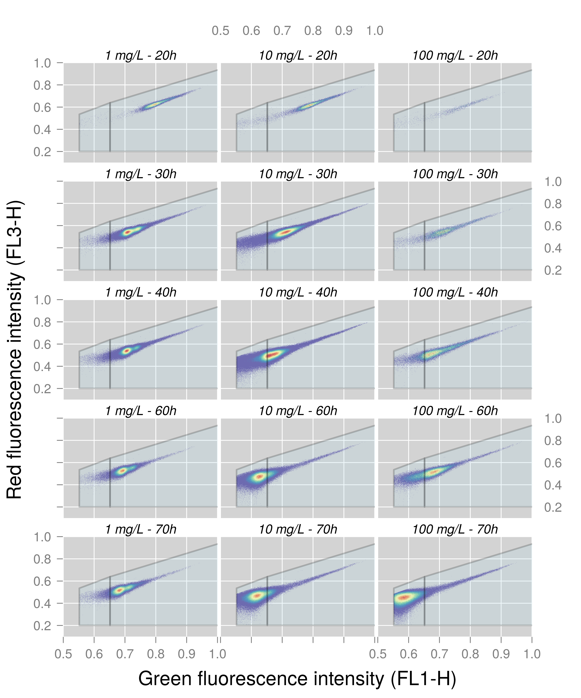
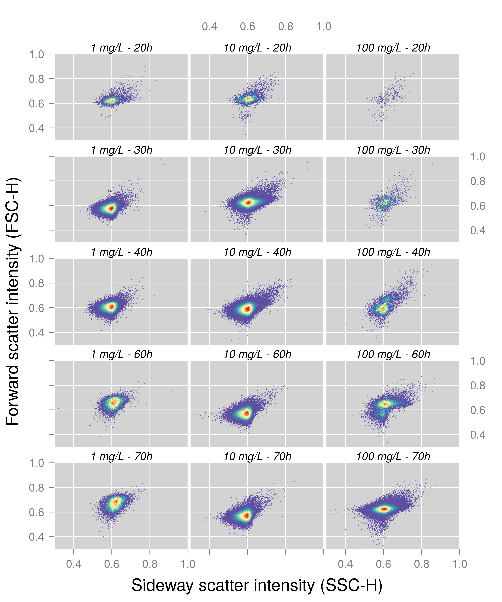

# Cell density 


```r
summary <- fsApply(x=flowData_transformed,FUN=function(x) apply(x,2,max), use.exprs=TRUE)
max = max(summary[,"FL1-H"])
flowData_transformed_sb <- flowData_transformed[which(flowCore::sampleNames(flowData_transformed) 
                                                   %in% c("R1_41.fcs","R2_41.fcs","R3_41.fcs",
                                                          "R1_56.fcs","R2_56.fcs","R3_56.fcs",
                                                          "R1_64.fcs","R2_64.fcs","R3_64.fcs",
                                                         "R1_81.fcs","R2_81.fcs","R3_81.fcs",
                                                         "R1_90.fcs","R2_90.fcs","R3_90.fcs"))]
mytrans <- function(x) x/max
flowData_transformed_sb <- transform(flowData_transformed_sb,`FL1-H`=mytrans(`FL1-H`),
                                  `FL3-H`=mytrans(`FL3-H`), 
                                  `SSC-H`=mytrans(`SSC-H`),
                                  `FSC-H`=mytrans(`FSC-H`))

MyText <- c("1 mg/L - 20h", "1 mg/L - 30h", "1 mg/L - 40h", "1 mg/L - 60h", "1 mg/L - 70h",
            "10 mg/L - 20h", "10 mg/L - 30h", "10 mg/L - 40h", "10 mg/L - 60h", "10 mg/L - 70h",
            "100 mg/L - 20h", "100 mg/L - 30h", "100 mg/L - 40h", "100 mg/L - 60h", "100 mg/L - 70h")

sqrcut1 <- matrix(c(asinh(8500),asinh(8500),15,15,3,9.55,14,3)/max,ncol=2, nrow=4)
colnames(sqrcut1) <- c("FL1-H","FL3-H")
rGate_HNA <- polygonGate(.gate=sqrcut1, filterId = "HNA")
sqrcut1 <- matrix(c(8.25,8.25,asinh(8500),asinh(8500),3,8,9.55,3)/max,ncol=2, nrow=4)
colnames(sqrcut1) <- c("FL1-H","FL3-H")
rGate_LNA <- polygonGate(.gate=sqrcut1, filterId = "LNA")

filters <- filters(list(rGate_LNA, rGate_HNA))
flist <- list(filters , filters, filters, 
              filters, filters, filters,
              filters, filters, filters,
              filters, filters, filters,
              filters, filters, filters)
names(flist) <- flowCore::sampleNames(flowData_transformed_sb)

# Print fluorescence scatter plots
print(xyplot(`FL3-H`~`FL1-H`, data=flowData_transformed_sb,
             index.cond=list(c(1,6,11,
                               2,7,12,
                               3,8,13,
                               4,9,14,
                               5,10,15)),
             filter=flist,
             xbins=400,nbin=128, par.strip.text=list(col="black", font=3,cex=1), 
             smooth=FALSE, xlim=c(0.5,1),ylim=c(0.1,1),xlab=list(label="Green fluorescence intensity (FL1-H)",cex=1.5),
             ylab=list(label="Red fluorescence intensity (FL3-H)", cex=1.5),
             par.settings=my.settings,
             scales=list(x=list(at=seq(from=0, to=1, by=.1), cex=1),
                         y=list(at=seq(from=0, to=1, by=.2), cex=1)), layout=c(3,5),
             strip=strip.custom(factor.levels=MyText),
             margin=TRUE,
             binTrans="log"
      )
)
```



```r
# Print scatters scatter plots
print(xyplot(`FSC-H`~`SSC-H`, data=flowData_transformed_sb,
             index.cond=list(c(1,6,11,
                               2,7,12,
                               3,8,13,
                               4,9,14,
                               5,10,15)),
             xbins=400,nbin=128, par.strip.text=list(col="black", font=3,cex=1), 
             smooth=FALSE, xlim=c(0.3,1),ylim=c(0.3,1),xlab=list(label="Sideway scatter intensity (SSC-H)",cex=1.5),
             ylab=list(label="Forward scatter intensity (FSC-H)", cex=1.5),
             par.settings=my.settings,
             scales=list(x=list(at=seq(from=0, to=1, by=.2), cex=1),
                         y=list(at=seq(from=0, to=1, by=.2), cex=1)), layout=c(3,5),
             strip=strip.custom(factor.levels=MyText),
             margin=TRUE,
             binTrans="log"
      )
)
```




```r
p_counts <- ggplot(counts, aes(x = ExactTime, y = Total.cells, fill = NutrientCondition))+
  geom_line(aes(color = NutrientCondition))+
  geom_point(shape = 21, size = 4)+
  theme_bw()+
  scale_fill_brewer("Nutrient condition", palette = "Accent")+
  scale_color_brewer(palette = "Accent")+
  theme(axis.text=element_text(size=16), axis.title=element_text(size=20),
        title=element_text(size=20), legend.text=element_text(size=14),
        legend.direction = "horizontal",legend.position = "bottom")+
  ylab("Cell density (cells/µL)")+
  xlab("Time (h)")+
  labs(title="Total population")+
  guides(color = FALSE)

p_counts_log <- ggplot(counts, aes(x = ExactTime, y = Total.cells, fill = NutrientCondition))+
  geom_line(aes(color = NutrientCondition))+
  geom_point(shape = 21, size = 4)+
  theme_bw()+
  scale_fill_brewer("Nutrient condition", palette = "Accent")+
  scale_color_brewer(palette = "Accent")+
  theme(axis.text=element_text(size=16), axis.title=element_text(size=20),
        title=element_text(size=20), legend.text=element_text(size=14),
        legend.direction = "horizontal",legend.position = "bottom")+
  ylab(expression("Cell density - cells µL"^"-1"))+
  xlab("Time (h)")+
  labs(title="Total population")+
  guides(color = FALSE)+
  scale_y_continuous(trans='log2', breaks = c(10, 100,1000,5000,1e4, 1.5e4), limits = c(1,1.6e4))

p_HNA <- ggplot(counts, aes(x = ExactTime, y = HNA.cells, fill = NutrientCondition))+
  geom_line(aes(color = NutrientCondition))+
  geom_point(shape = 21, size = 4)+
  theme_bw()+
  scale_fill_brewer("Nutrient condition", palette = "Accent")+
  scale_color_brewer(palette = "Accent")+
  theme(axis.text=element_text(size=16), axis.title=element_text(size=20),
        title=element_text(size=20), legend.text=element_text(size=14),
        legend.direction = "horizontal",legend.position = "bottom")+
  ylab(expression("Cell density - cells µL"^"-1"))+
  xlab("Time (h)")+
  labs(title="HNA population")+
  guides(color = FALSE)


p_LNA <- ggplot(counts, aes(x = ExactTime, y = LNA.cells, fill = NutrientCondition))+
    geom_line(aes(color = NutrientCondition))+
  geom_point(shape = 21, size = 4)+
  theme_bw()+
  scale_fill_brewer("Nutrient condition", palette = "Accent")+
  scale_color_brewer(palette = "Accent")+
  theme(axis.text=element_text(size=16), axis.title=element_text(size=20),
        title=element_text(size=20), legend.text=element_text(size=14),
        legend.direction = "horizontal",legend.position = "bottom")+
  ylab(expression("Cell density - cells µL"^"-1"))+
  xlab("Time (h)")+
  labs(title="LNA population")+
  guides(color = FALSE)

grid_arrange_shared_legend(p_counts, p_HNA, p_LNA, ncol = 3)
```


```r
p_HNA_pct <- ggplot(counts, aes(x = ExactTime, y = 100*pct_HNA.cells, fill = NutrientCondition))+
  geom_line(aes(color = NutrientCondition))+
  geom_point(shape = 21, size = 4)+
  theme_bw()+
  scale_fill_brewer("Nutrient condition", palette = "Accent")+
  scale_color_brewer(palette = "Accent")+
  theme(axis.text=element_text(size=16), axis.title=element_text(size=20),
        title=element_text(size=20), legend.text=element_text(size=14),
        legend.direction = "horizontal",legend.position = "bottom")+
  ylab("%HNA cells")+
  xlab("Time (h)")+
  labs(title="HNA population")+
  guides(color = FALSE)
```


```r
plot_grid(p_counts_log, p_HNA_pct,nrow = 2, align = 'v')
```


```r
plot_grid(p_HNA, p_HNA_pct, nrow = 2, align = 'v')
```


<!-- # Diversity dynamics -->

<!-- ```{r diversity-fcm-1, warning = FALSE, dpi = 500, fig.width = 7, fig.height = 6} -->
<!-- # Resample to atleast 10,000 cells for diversity assay -->
<!-- # flowData_transformed_subs <- FCS_resample(flowData_transformed, sample = 10000, replace = TRUE) -->

<!-- # Calculate phenotypic alpha diversity -->
<!-- diversity_fcm <- Diversity_rf(flowData_transformed, param = param, cleanFCS = FALSE, parallel = TRUE, -->
<!--                               ncores = 10) -->

<!-- ``` -->


<!-- ```{r diversity-fcm-2, warning = FALSE, dpi = 500, fig.width = 10, fig.height = 6, dev = c("png", "svg")} -->
<!-- # Add metadata to phenotypic diversity estimate -->
<!-- diversity_fcm <- dplyr::left_join(diversity_fcm, counts, by = c("Sample_names" =  "Samples")) -->
<!-- diversity_fcm <- diversity_fcm %>% dplyr::filter(Timepoint > 5) # Only consider after first 5 samples due to bleaching of tubing -->

<!-- # Plot results -->
<!-- p_div <- ggplot(diversity_fcm, aes(x = ExactTime, y = D2, fill = NutrientCondition))+ -->
<!--     geom_line(aes(color = NutrientCondition))+ -->
<!--     geom_point(shape = 21, size = 4)+ -->
<!--     theme_bw()+ -->
<!--     scale_fill_brewer("Nutrient condition", palette = "Accent")+ -->
<!--     scale_color_brewer("Nutrient condition", palette = "Accent")+ -->
<!--     theme(axis.text=element_text(size=16), axis.title=element_text(size=20), -->
<!--         title=element_text(size=20), legend.text=element_text(size=16), -->
<!--         legend.direction = "horizontal",legend.position = "bottom", -->
<!--         strip.text = element_text(size = 16))+ -->
<!--     ylab(expression("Phenotypic diversity - D"[2]))+ -->
<!--     facet_grid(~NutrientCondition)+ -->
<!--     xlab("Time (h)")+ -->
<!--     guides(fill = FALSE, color = FALSE)+ -->
<!--   geom_ribbon(aes(ymin = D2 - sd.D2, ymax = D2 + sd.D2), alpha = 0.3) -->

<!-- print(p_div) -->
<!-- ``` -->

<!-- ```{r count-diversity-fcm, warning = FALSE, dpi = 500, fig.width = 14, fig.height = 11, dev = c("png", "svg")} -->
<!-- # Reshape combined data -->
<!-- diversity_fcm_long <- tidyr::gather(diversity_fcm, population, Density, Total.cells, LNA.cells, HNA.cells, D2) -->
<!-- diversity_fcm_long$population <- plyr::revalue(diversity_fcm_long$population,  c("Total.cells"="Whole population", "HNA.cells"="HNA population", "LNA.cells"="LNA population", "D2" = "Phenotypic diversity")) -->

<!-- # Combine diversity and count plot -->
<!-- p_count2 <- ggplot(counts, aes(x = ExactTime, y = Total.cells, fill = NutrientCondition))+ -->
<!--   geom_line(aes(color = NutrientCondition))+ -->
<!--   geom_point(shape = 21, size = 4)+ -->
<!--   theme_bw()+ -->
<!--   scale_fill_brewer("Nutrient condition", palette = "Accent")+ -->
<!--   scale_color_brewer(palette = "Accent")+ -->
<!--     theme(axis.text=element_text(size=16), axis.title=element_text(size=20), -->
<!--         title=element_text(size=20), legend.text=element_text(size=16), -->
<!--         legend.direction = "horizontal",legend.position = "bottom", -->
<!--         strip.text = element_text(size = 16))+ -->
<!--   ylab("Cell density (cells/µL)")+ -->
<!--   xlab("Time (h)")+ -->
<!--   facet_grid(~NutrientCondition)+ -->
<!--   guides(color = FALSE, fill = FALSE) -->

<!-- p_HNA2 <- ggplot(counts, aes(x = ExactTime, y = HNA.cells, fill = NutrientCondition))+ -->
<!--   geom_line(aes(color = NutrientCondition))+ -->
<!--   geom_point(shape = 21, size = 4)+ -->
<!--   theme_bw()+ -->
<!--   scale_fill_brewer("Nutrient condition", palette = "Accent")+ -->
<!--   scale_color_brewer(palette = "Accent")+ -->
<!--     theme(axis.text=element_text(size=16), axis.title=element_text(size=20), -->
<!--         title=element_text(size=20), legend.text=element_text(size=16), -->
<!--         legend.direction = "horizontal",legend.position = "bottom", -->
<!--         strip.text = element_text(size = 16))+ -->
<!--   ylab("Cell density (cells/µL)")+ -->
<!--   xlab("Time (h)")+ -->
<!--   facet_grid(~NutrientCondition)+ -->
<!--   guides(color = FALSE, fill = FALSE) -->

<!-- p_LNA2 <- ggplot(counts, aes(x = ExactTime, y = LNA.cells, fill = NutrientCondition))+ -->
<!--   geom_line(aes(color = NutrientCondition))+ -->
<!--   geom_point(shape = 21, size = 4)+ -->
<!--   theme_bw()+ -->
<!--   scale_fill_brewer("Nutrient condition", palette = "Accent")+ -->
<!--   scale_color_brewer(palette = "Accent")+ -->
<!--     theme(axis.text=element_text(size=16), axis.title=element_text(size=20), -->
<!--         title=element_text(size=20), legend.text=element_text(size=16), -->
<!--         legend.direction = "horizontal",legend.position = "bottom", -->
<!--         strip.text = element_text(size = 16))+ -->
<!--   ylab("Cell density (cells/µL)")+ -->
<!--   xlab("Time (h)")+ -->
<!--   facet_grid(~NutrientCondition)+ -->
<!--   guides(color = FALSE, fill = FALSE) -->

<!-- grid.arrange(p_count2, p_div, nrow = 2) -->

<!-- grid.arrange(p_HNA2, p_div, nrow = 2) -->

<!-- grid.arrange(p_LNA2, p_div, nrow = 2) -->
<!-- ``` -->

# Growth rate estimation

## Grofit


```r
# Format data for grofit
counts <- counts %>% group_by(NutrientCondition) %>% 
  dplyr::mutate(ratio_TotalCells = log(Total.cells/min(Total.cells)))

## Samples as rows and timepoints as columns
counts_tmp <- counts %>% dplyr::filter(Timepoint > 5) # Only consider after first 5 samples due to bleaching of tubing
count_wide <- spread(counts_tmp[, c(6,2,8)], ExactTime, Total.cells)
count_wide2 <- spread(counts_tmp[, c(6,9,8)], ExactTime, ratio_TotalCells)
time_wide <- as.matrix(spread(counts_tmp[, c(6,8)], ExactTime, ExactTime)[,-1])

## Add two additional columns (mandatory for grofit to run properly)
count_wide <- data.frame(ReactorName = c("R1", "R2","R3"), 
                         NutrientLevel = c("Low", "Medium", "High"), count_wide)
count_wide2 <- data.frame(ReactorName = c("R1", "R2","R3"), 
                         NutrientLevel = c("Low", "Medium", "High"), count_wide2)

## Fit grofit models
Fit <- grofit::gcFit(time_wide, count_wide, grofit.control(nboot.gc = 1000, smooth.gc=0.5, interactive = FALSE))
```

```
## 
## 
## = 1. growth curve =================================
## ----------------------------------------------------
## --> Try to fit model logistic--> Try to fit model richards--> Try to fit model gompertz--> Try to fit model gompertz.exp
## 
## 
## = 2. growth curve =================================
## ----------------------------------------------------
## --> Try to fit model logistic--> Try to fit model richards--> Try to fit model gompertz--> Try to fit model gompertz.exp
## 
## 
## = 3. growth curve =================================
## ----------------------------------------------------
## --> Try to fit model logistic--> Try to fit model richards--> Try to fit model gompertz--> Try to fit model gompertz.exp
```

```r
Fit2 <- grofit::gcFit(time_wide, count_wide2, grofit.control(nboot.gc = 1000, smooth.gc=0.5, interactive = FALSE))
```

```
## 
## 
## = 1. growth curve =================================
## ----------------------------------------------------
## --> Try to fit model logistic--> Try to fit model richards--> Try to fit model gompertz--> Try to fit model gompertz.exp
## 
## 
## = 2. growth curve =================================
## ----------------------------------------------------
## --> Try to fit model logistic--> Try to fit model richards--> Try to fit model gompertz--> Try to fit model gompertz.exp
## 
## 
## = 3. growth curve =================================
## ----------------------------------------------------
## --> Try to fit model logistic--> Try to fit model richards--> Try to fit model gompertz--> Try to fit model gompertz.exp
```

```r
sum <- summary(Fit)
par(mfrow=c(3,1))
plot(Fit, opt = "s", slope = TRUE, colSpline = 4, cex = 2, title = "Spline fit") # show spline fits
par(mfrow=c(1,1))

# We continue to work with the spline fits as they seem to be the best
growth_results <- summary(Fit)[, c("concentration","mu.bt", "lambda.bt", "A.bt",
                          "ci95.mu.bt.up", "ci95.mu.bt.lo",
                          "ci95.lambda.bt.up", "ci95.lambda.bt.lo",
                          "ci95.A.bt.up", "ci95.A.bt.lo")]
```


```r
# Plot lag-phase length, maximum growth rate, etc etc.
growth_results <- growth_results %>% dplyr::mutate(concentration_value = as.numeric(gsub("mg/L R2A", "", concentration)))

# Lag phase
p_lambda <- ggplot(growth_results, aes(x = concentration_value, y = lambda.bt, fill = concentration))+
  geom_point(shape = 21, size = 5)+
  theme_bw()+
  scale_fill_brewer("Nutrient condition", palette = "Accent")+
  theme(axis.text=element_text(size=16), axis.title=element_text(size=16),
        title=element_text(size=20), legend.text=element_text(size=16),
        legend.direction = "horizontal",legend.position = "bottom",
        strip.text = element_text(size = 16),
        axis.text.x = element_text(size = 16))+
  ylab(expression(lambda ~ "(h)"))+
  xlab(expression("Medium concentration - mg L"^"-1"))+
  guides(color = FALSE, fill = FALSE)+
  geom_errorbar(aes(ymax = ci95.lambda.bt.up, ymin = ci95.lambda.bt.lo), width = 0.025)+
  scale_y_continuous(trans='log10', breaks = seq(0, 80, 20), minor_breaks = seq(0, 80, 10), limits = c(NA,80))+
  scale_x_continuous(trans='log10', breaks = c(1, 10, 100), minor_breaks = c(1,seq(10, 100, 10)), limits = c(NA, 100))+
  ggtitle("C.")

# print(p_lambda)

# maximum growth rate
p_mu <- ggplot(growth_results, aes(x = concentration_value, y = mu.bt, fill = concentration))+
  geom_point(shape = 21, size = 5)+
  theme_bw()+
  scale_fill_brewer("Nutrient condition", palette = "Accent")+
    theme(axis.text=element_text(size=16), axis.title=element_text(size=16),
        title=element_text(size=20), legend.text=element_text(size=16),
        legend.direction = "horizontal",legend.position = "bottom",
        strip.text = element_text(size = 16),
        axis.text.x = element_text(size = 16))+
  ylab(expression(mu["max"] ~ "- cells" ~ "mL"^"-1"~"h"^"-1"))+
  xlab(expression("Medium concentration - mg L"^"-1"))+
  guides(color = FALSE, fill = FALSE)+
  geom_errorbar(aes(ymax = ci95.mu.bt.up, ymin = ci95.mu.bt.lo), width = 0.025)+
  scale_y_continuous(trans='log10', breaks = seq(0,1800, 250), minor_breaks = seq(0,1800, 125), limits = c(250,1800))+
  scale_x_continuous(trans='log10', breaks = c(1, 10, 100), minor_breaks = c(1,seq(10, 100, 10)), limits = c(NA, 100))+
  ggtitle("A.")

# print(p_mu)

# Carrying capacity
p_A <- ggplot(growth_results, aes(x = concentration_value, y = A.bt, fill = concentration))+
  geom_point(shape = 21, size = 5)+
  theme_bw()+
  scale_fill_brewer("Nutrient condition", palette = "Accent")+
  theme(axis.text=element_text(size=16), axis.title=element_text(size=16),
        title=element_text(size=20), legend.text=element_text(size=16),
        legend.direction = "horizontal",legend.position = "bottom",
        strip.text = element_text(size = 16),
        axis.text.x = element_text(size = 16))+
  ylab(expression("Carrying capacity" ~ "- cells µL"^"-1"))+
  xlab(expression("Medium concentration - mg L"^"-1"))+
  guides(color = FALSE, fill = FALSE)+
  geom_errorbar(aes(ymax = ci95.A.bt.up, ymin = ci95.A.bt.lo), width = 0.025)+
  scale_y_continuous(trans='log10', breaks = seq(0,16000, 2000),minor_breaks = seq(0,16000, 1000), limits = c(NA, 16000)) +
  scale_x_continuous(trans='log10', breaks = c(1, 10, 100),minor_breaks = c(1,seq(10, 100, 10)), limits = c(NA, 100))+
  ggtitle("D.")

# print(p_A)
```

## Growthcurver


```r
# Create wide format
count_gc_wide <- spread(counts[, c(6,2,8)], NutrientCondition, Total.cells)

# Run growthcurver
gc_fit <- list()
gc_fit[[1]] <- SummarizeGrowth(count_gc_wide$ExactTime[!is.na(count_gc_wide$`1 mg/L R2A`)], count_gc_wide$`1 mg/L R2A`[!is.na(count_gc_wide$`1 mg/L R2A`)])
gc_fit[[2]] <- SummarizeGrowth(count_gc_wide$ExactTime[!is.na(count_gc_wide$`10 mg/L R2A`)], count_gc_wide$`10 mg/L R2A`[!is.na(count_gc_wide$`10 mg/L R2A`)])
gc_fit[[3]] <- SummarizeGrowth(count_gc_wide$ExactTime[!is.na(count_gc_wide$`100 mg/L R2A`)], count_gc_wide$`100 mg/L R2A`[!is.na(count_gc_wide$`100 mg/L R2A`)])

gc_results <- data.frame(concentration = colnames(count_gc_wide)[-1], 
                         rbind(gc_fit[[1]]$vals, gc_fit[[2]]$vals, gc_fit[[3]]$vals)) 

# Upper error on tgen
round(log(2)/(do.call(rbind, gc_results$r)+do.call(rbind, gc_results$r_se)),2)
```

```
##      [,1]
## [1,] 1.73
## [2,] 2.46
## [3,] 1.88
```

```r
# Lower error on tgen
round(log(2)/(do.call(rbind, gc_results$r)-do.call(rbind, gc_results$r_se)),2)
```

```
##      [,1]
## [1,] 1.85
## [2,] 2.62
## [3,] 2.13
```

```r
# Store in grofit dataframe
growth_results$mu_spec <- do.call(rbind, gc_results$r)
growth_results$mu_se <- do.call(rbind, gc_results$r_se)

# specific growth rate
p_mu_spec <- ggplot(growth_results, aes(x = concentration_value, y = mu_spec, fill = concentration))+
  geom_point(shape = 21, size = 5)+
  theme_bw()+
  scale_fill_brewer("Nutrient condition", palette = "Accent")+
    theme(axis.text=element_text(size=16), axis.title=element_text(size=16),
        title=element_text(size=20), legend.text=element_text(size=16),
        legend.direction = "horizontal",legend.position = "bottom",
        strip.text = element_text(size = 16),
        axis.text.x = element_text(size = 16))+
  ylab(expression(mu["spec"] ~ "- h"^"-1"))+
  xlab(expression("Medium concentration - mg L"^"-1"))+
  guides(color = FALSE, fill = FALSE)+
  geom_errorbar(aes(ymax = mu_spec+mu_se, ymin = mu_spec-mu_se), width = 0.025)+
  scale_y_continuous(trans='log10', breaks = seq(0, 0.45, 0.1), minor_breaks = seq(0, 0.45, 0.05), limits = c(0.2,0.45))+
  scale_x_continuous(trans='log10', breaks = c(1, 10, 100), minor_breaks = c(1,seq(10, 100, 10)), limits = c(NA, 100))+
  ggtitle("B.")

# Plot all 4 parameters
plot_grid(p_mu, p_mu_spec, 
             p_lambda, p_A, ncol = 2, align = 'hv')
```


```r
# Plot only three main ones
plot_grid(p_lambda,  p_mu_spec, p_A, ncol = 3, align = 'h')
```


