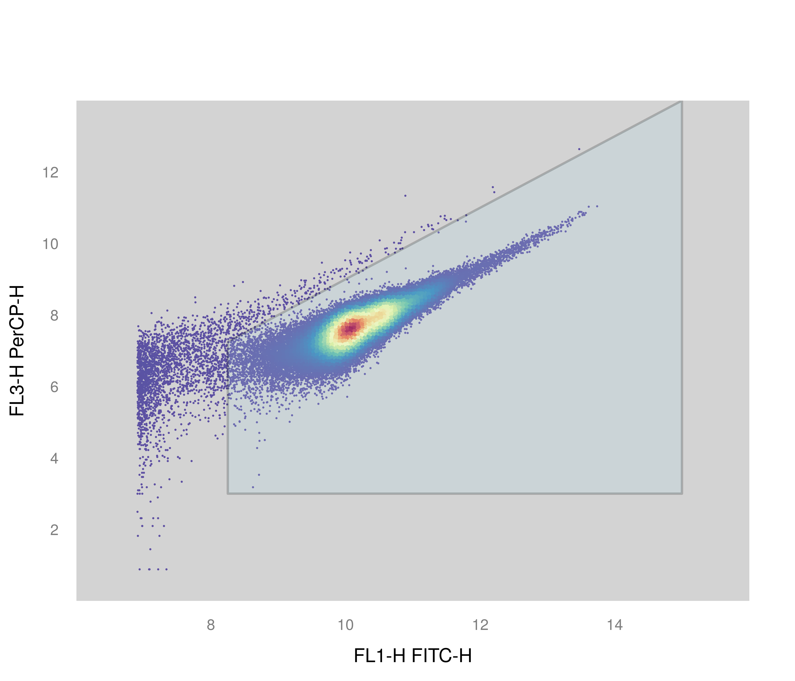
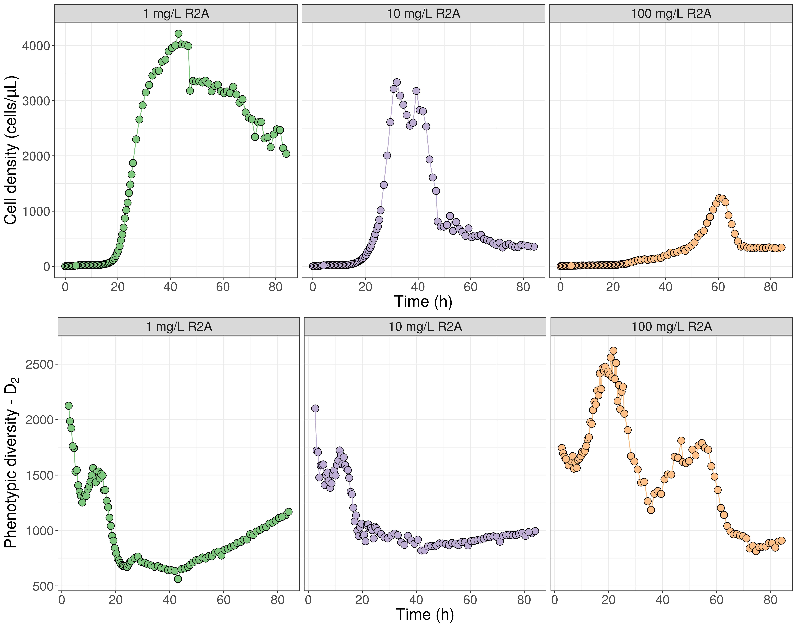

# Cell density 


```r
# Start beta diversity analysis on FCM data
path = "/media/projects1/Ruben/Ramlibacter--CW/isolation/online-growth/"
flowData_transformed  <- read.flowSet(path = path, transformation = FALSE, pattern = ".fcs")

flowData_transformed <- transform(flowData_transformed,`FL1-H`=asinh(`FL1-H`), 
                                  `SSC-H`=asinh(`SSC-H`), 
                                  `FL3-H`=asinh(`FL3-H`), 
                                  `FSC-H`=asinh(`FSC-H`))
param=c("FL1-H", "FL3-H","SSC-H","FSC-H")
# flowData_transformed = flowData_transformed[,param]

# Create a PolygonGate for denoising the dataset
# Define coordinates for gate in sqrcut1 in format: c(x,x,x,x,y,y,y,y)
sqrcut1 <- matrix(c(8.25,8.25,15,15,3,7.25,14,3),ncol=2, nrow=4)
colnames(sqrcut1) <- c("FL1-H","FL3-H")
polyGate1 <- polygonGate(.gate=sqrcut1, filterId = "Total Cells")

#  Gating quality check
xyplot(`FL3-H` ~ `FL1-H`, data=flowData_transformed[2], filter=polyGate1,
       scales=list(y=list(limits=c(0,14)),
                   x=list(limits=c(6,16))),
       par.settings = my.settings,
       axis = axis.default, nbin=125, 
       par.strip.text=list(col="white", font=2, cex=2), smooth=FALSE)
```



```r
# Isolate only the cellular information based on the polyGate1
flowData_transformed <- Subset(flowData_transformed, polyGate1)


# Reformat gates
sqrcut1 <- matrix(c(8.25,8.25,15,15,3,7.25,14,3),ncol=2, nrow=4)
colnames(sqrcut1) <- c("FL1-H","FL3-H")
polyGate1 <- polygonGate(.gate=sqrcut1, filterId = "Total Cells")
sqrcut1 <- matrix(c(asinh(12500),asinh(12500),15,15,3,9.55,14,3),ncol=2, nrow=4)
colnames(sqrcut1) <- c("FL1-H","FL3-H")
rGate_HNA <- polygonGate(.gate=sqrcut1, filterId = "HNA")
sqrcut1 <- matrix(c(8.5,8.5,asinh(12500),asinh(12500),3,8,9.55,3),ncol=2, nrow=4)
colnames(sqrcut1) <- c("FL1-H","FL3-H")
rGate_LNA <- polygonGate(.gate=sqrcut1, filterId = "LNA")

# Check if rectangle gate is correct, if not, adjust rGate_HNA
xyplot(`FL3-H` ~ `FL1-H`, data=flowData_transformed[200], filter=rGate_HNA,
       scales=list(y=list(limits=c(0,14)),
                   x=list(limits=c(6,16))),
       par.settings = my.settings,
       axis = axis.default, nbin=125, par.strip.text=list(col="white", font=2, 
                                                          cex=2), smooth=FALSE)
```


```r
# Extract the cell counts
a <- flowCore::filter(flowData_transformed, rGate_HNA) 
HNACount <- flowCore::summary(a);HNACount <- toTable(HNACount)
```

```
## filter summary for frame 'R1_100.fcs'
##  HNA+: 69618 of 126521 events (55.02%)
## 
## filter summary for frame 'R1_101.fcs'
##  HNA+: 66978 of 129588 events (51.69%)
## 
## filter summary for frame 'R1_10.fcs'
##  HNA+: 1459 of 2228 events (65.48%)
## 
## filter summary for frame 'R1_11.fcs'
##  HNA+: 1936 of 2314 events (83.66%)
## 
## filter summary for frame 'R1_12.fcs'
##  HNA+: 1942 of 2300 events (84.43%)
## 
## filter summary for frame 'R1_13.fcs'
##  HNA+: 2237 of 2402 events (93.13%)
## 
## filter summary for frame 'R1_14.fcs'
##  HNA+: 2130 of 2257 events (94.37%)
## 
## filter summary for frame 'R1_15.fcs'
##  HNA+: 2156 of 2281 events (94.52%)
## 
## filter summary for frame 'R1_16.fcs'
##  HNA+: 2173 of 2280 events (95.31%)
## 
## filter summary for frame 'R1_17.fcs'
##  HNA+: 2171 of 2256 events (96.23%)
## 
## filter summary for frame 'R1_18.fcs'
##  HNA+: 2228 of 2317 events (96.16%)
## 
## filter summary for frame 'R1_19.fcs'
##  HNA+: 2267 of 2342 events (96.80%)
## 
## filter summary for frame 'R1_1.fcs'
##  HNA+: 75 of 554 events (13.54%)
## 
## filter summary for frame 'R1_20.fcs'
##  HNA+: 2265 of 2353 events (96.26%)
## 
## filter summary for frame 'R1_21.fcs'
##  HNA+: 2295 of 2374 events (96.67%)
## 
## filter summary for frame 'R1_22.fcs'
##  HNA+: 2343 of 2415 events (97.02%)
## 
## filter summary for frame 'R1_23.fcs'
##  HNA+: 2301 of 2401 events (95.84%)
## 
## filter summary for frame 'R1_24.fcs'
##  HNA+: 2467 of 2560 events (96.37%)
## 
## filter summary for frame 'R1_25.fcs'
##  HNA+: 2459 of 2546 events (96.58%)
## 
## filter summary for frame 'R1_26.fcs'
##  HNA+: 2703 of 2780 events (97.23%)
## 
## filter summary for frame 'R1_27.fcs'
##  HNA+: 2856 of 2941 events (97.11%)
## 
## filter summary for frame 'R1_28.fcs'
##  HNA+: 3060 of 3149 events (97.17%)
## 
## filter summary for frame 'R1_29.fcs'
##  HNA+: 3376 of 3493 events (96.65%)
## 
## filter summary for frame 'R1_2.fcs'
##  HNA+: 114 of 643 events (17.73%)
## 
## filter summary for frame 'R1_30.fcs'
##  HNA+: 3764 of 3902 events (96.46%)
## 
## filter summary for frame 'R1_31.fcs'
##  HNA+: 4338 of 4483 events (96.77%)
## 
## filter summary for frame 'R1_32.fcs'
##  HNA+: 4858 of 5020 events (96.77%)
## 
## filter summary for frame 'R1_33.fcs'
##  HNA+: 5751 of 5969 events (96.35%)
## 
## filter summary for frame 'R1_34.fcs'
##  HNA+: 6559 of 6748 events (97.20%)
## 
## filter summary for frame 'R1_35.fcs'
##  HNA+: 8077 of 8280 events (97.55%)
## 
## filter summary for frame 'R1_36.fcs'
##  HNA+: 9636 of 9821 events (98.12%)
## 
## filter summary for frame 'R1_37.fcs'
##  HNA+: 11855 of 12045 events (98.42%)
## 
## filter summary for frame 'R1_38.fcs'
##  HNA+: 15131 of 15327 events (98.72%)
## 
## filter summary for frame 'R1_39.fcs'
##  HNA+: 19166 of 19428 events (98.65%)
## 
## filter summary for frame 'R1_3.fcs'
##  HNA+: 376 of 896 events (41.96%)
## 
## filter summary for frame 'R1_40.fcs'
##  HNA+: 24151 of 24416 events (98.91%)
## 
## filter summary for frame 'R1_41.fcs'
##  HNA+: 30092 of 30360 events (99.12%)
## 
## filter summary for frame 'R1_42.fcs'
##  HNA+: 38602 of 38956 events (99.09%)
## 
## filter summary for frame 'R1_43.fcs'
##  HNA+: 49230 of 49631 events (99.19%)
## 
## filter summary for frame 'R1_44.fcs'
##  HNA+: 60263 of 60705 events (99.27%)
## 
## filter summary for frame 'R1_45.fcs'
##  HNA+: 73202 of 73753 events (99.25%)
## 
## filter summary for frame 'R1_46.fcs'
##  HNA+: 90301 of 90931 events (99.31%)
## 
## filter summary for frame 'R1_47.fcs'
##  HNA+: 105958 of 106948 events (99.07%)
## 
## filter summary for frame 'R1_48.fcs'
##  HNA+: 119628 of 120772 events (99.05%)
## 
## filter summary for frame 'R1_49.fcs'
##  HNA+: 138135 of 139537 events (99.00%)
## 
## filter summary for frame 'R1_4.fcs'
##  HNA+: 547 of 1409 events (38.82%)
## 
## filter summary for frame 'R1_50.fcs'
##  HNA+: 154005 of 155332 events (99.15%)
## 
## filter summary for frame 'R1_51.fcs'
##  HNA+: 172226 of 173995 events (98.98%)
## 
## filter summary for frame 'R1_52.fcs'
##  HNA+: 196021 of 198513 events (98.74%)
## 
## filter summary for frame 'R1_53.fcs'
##  HNA+: 241747 of 246310 events (98.15%)
## 
## filter summary for frame 'R1_54.fcs'
##  HNA+: 279004 of 288112 events (96.84%)
## 
## filter summary for frame 'R1_55.fcs'
##  HNA+: 305743 of 315018 events (97.06%)
## 
## filter summary for frame 'R1_56.fcs'
##  HNA+: 327791 of 340229 events (96.34%)
## 
## filter summary for frame 'R1_57.fcs'
##  HNA+: 344102 of 357866 events (96.15%)
## 
## filter summary for frame 'R1_58.fcs'
##  HNA+: 360401 of 374778 events (96.16%)
## 
## filter summary for frame 'R1_59.fcs'
##  HNA+: 369112 of 385719 events (95.69%)
## 
## filter summary for frame 'R1_5.fcs'
##  HNA+: 612 of 1864 events (32.83%)
## 
## filter summary for frame 'R1_60.fcs'
##  HNA+: 371028 of 396929 events (93.47%)
## 
## filter summary for frame 'R1_61.fcs'
##  HNA+: 387694 of 409865 events (94.59%)
## 
## filter summary for frame 'R1_62.fcs'
##  HNA+: 390282 of 412813 events (94.54%)
## 
## filter summary for frame 'R1_63.fcs'
##  HNA+: 405710 of 426103 events (95.21%)
## 
## filter summary for frame 'R1_64.fcs'
##  HNA+: 413046 of 433324 events (95.32%)
## 
## filter summary for frame 'R1_65.fcs'
##  HNA+: 416907 of 434922 events (95.86%)
## 
## filter summary for frame 'R1_66.fcs'
##  HNA+: 438201 of 459823 events (95.30%)
## 
## filter summary for frame 'R1_67.fcs'
##  HNA+: 417588 of 440766 events (94.74%)
## 
## filter summary for frame 'R1_68.fcs'
##  HNA+: 418015 of 443131 events (94.33%)
## 
## filter summary for frame 'R1_69.fcs'
##  HNA+: 415228 of 447318 events (92.83%)
## 
## filter summary for frame 'R1_6.fcs'
##  HNA+: 681 of 2052 events (33.19%)
## 
## filter summary for frame 'R1_70.fcs'
##  HNA+: 103517 of 122803 events (84.30%)
## 
## filter summary for frame 'R1_71.fcs'
##  HNA+: 111447 of 129829 events (85.84%)
## 
## filter summary for frame 'R1_72.fcs'
##  HNA+: 111065 of 128659 events (86.33%)
## 
## filter summary for frame 'R1_73.fcs'
##  HNA+: 111117 of 127460 events (87.18%)
## 
## filter summary for frame 'R1_74.fcs'
##  HNA+: 108232 of 125337 events (86.35%)
## 
## filter summary for frame 'R1_75.fcs'
##  HNA+: 110056 of 128979 events (85.33%)
## 
## filter summary for frame 'R1_76.fcs'
##  HNA+: 108344 of 126628 events (85.56%)
## 
## filter summary for frame 'R1_77.fcs'
##  HNA+: 102400 of 125405 events (81.66%)
## 
## filter summary for frame 'R1_78.fcs'
##  HNA+: 105495 of 122433 events (86.17%)
## 
## filter summary for frame 'R1_79.fcs'
##  HNA+: 107720 of 125527 events (85.81%)
## 
## filter summary for frame 'R1_7.fcs'
##  HNA+: 818 of 2288 events (35.75%)
## 
## filter summary for frame 'R1_80.fcs'
##  HNA+: 103742 of 124071 events (83.62%)
## 
## filter summary for frame 'R1_81.fcs'
##  HNA+: 102652 of 123692 events (82.99%)
## 
## filter summary for frame 'R1_82.fcs'
##  HNA+: 102410 of 123766 events (82.74%)
## 
## filter summary for frame 'R1_83.fcs'
##  HNA+: 102683 of 125100 events (82.08%)
## 
## filter summary for frame 'R1_84.fcs'
##  HNA+: 105751 of 123894 events (85.36%)
## 
## filter summary for frame 'R1_85.fcs'
##  HNA+: 101936 of 124046 events (82.18%)
## 
## filter summary for frame 'R1_86.fcs'
##  HNA+: 97127 of 125456 events (77.42%)
## 
## filter summary for frame 'R1_87.fcs'
##  HNA+: 99726 of 124769 events (79.93%)
## 
## filter summary for frame 'R1_88.fcs'
##  HNA+: 90621 of 125300 events (72.32%)
## 
## filter summary for frame 'R1_89.fcs'
##  HNA+: 88093 of 125990 events (69.92%)
## 
## filter summary for frame 'R1_8.fcs'
##  HNA+: 1027 of 2265 events (45.34%)
## 
## filter summary for frame 'R1_90.fcs'
##  HNA+: 87169 of 127725 events (68.25%)
## 
## filter summary for frame 'R1_91.fcs'
##  HNA+: 75792 of 125411 events (60.43%)
## 
## filter summary for frame 'R1_92.fcs'
##  HNA+: 83049 of 123923 events (67.02%)
## 
## filter summary for frame 'R1_93.fcs'
##  HNA+: 85070 of 126800 events (67.09%)
## 
## filter summary for frame 'R1_94.fcs'
##  HNA+: 76300 of 130331 events (58.54%)
## 
## filter summary for frame 'R1_95.fcs'
##  HNA+: 76590 of 127388 events (60.12%)
## 
## filter summary for frame 'R1_96.fcs'
##  HNA+: 70655 of 127030 events (55.62%)
## 
## filter summary for frame 'R1_97.fcs'
##  HNA+: 77044 of 125476 events (61.40%)
## 
## filter summary for frame 'R1_98.fcs'
##  HNA+: 81736 of 128727 events (63.50%)
## 
## filter summary for frame 'R1_99.fcs'
##  HNA+: 80216 of 127437 events (62.95%)
## 
## filter summary for frame 'R1_9.fcs'
##  HNA+: 1529 of 2327 events (65.71%)
## 
## filter summary for frame 'R2_100.fcs'
##  HNA+: 11538 of 383845 events (3.01%)
## 
## filter summary for frame 'R2_101.fcs'
##  HNA+: 11538 of 381355 events (3.03%)
## 
## filter summary for frame 'R2_10.fcs'
##  HNA+: 1657 of 1944 events (85.24%)
## 
## filter summary for frame 'R2_11.fcs'
##  HNA+: 1762 of 2011 events (87.62%)
## 
## filter summary for frame 'R2_12.fcs'
##  HNA+: 1987 of 2220 events (89.50%)
## 
## filter summary for frame 'R2_13.fcs'
##  HNA+: 1805 of 2006 events (89.98%)
## 
## filter summary for frame 'R2_14.fcs'
##  HNA+: 1923 of 2144 events (89.69%)
## 
## filter summary for frame 'R2_15.fcs'
##  HNA+: 1801 of 2037 events (88.41%)
## 
## filter summary for frame 'R2_16.fcs'
##  HNA+: 1855 of 2052 events (90.40%)
## 
## filter summary for frame 'R2_17.fcs'
##  HNA+: 1910 of 2027 events (94.23%)
## 
## filter summary for frame 'R2_18.fcs'
##  HNA+: 2021 of 2132 events (94.79%)
## 
## filter summary for frame 'R2_19.fcs'
##  HNA+: 1962 of 2123 events (92.42%)
## 
## filter summary for frame 'R2_1.fcs'
##  HNA+: 75 of 567 events (13.23%)
## 
## filter summary for frame 'R2_20.fcs'
##  HNA+: 2001 of 2151 events (93.03%)
## 
## filter summary for frame 'R2_21.fcs'
##  HNA+: 2064 of 2170 events (95.12%)
## 
## filter summary for frame 'R2_22.fcs'
##  HNA+: 1991 of 2128 events (93.56%)
## 
## filter summary for frame 'R2_23.fcs'
##  HNA+: 2205 of 2352 events (93.75%)
## 
## filter summary for frame 'R2_24.fcs'
##  HNA+: 2222 of 2409 events (92.24%)
## 
## filter summary for frame 'R2_25.fcs'
##  HNA+: 2429 of 2608 events (93.14%)
## 
## filter summary for frame 'R2_26.fcs'
##  HNA+: 2604 of 2792 events (93.27%)
## 
## filter summary for frame 'R2_27.fcs'
##  HNA+: 2765 of 2956 events (93.54%)
## 
## filter summary for frame 'R2_28.fcs'
##  HNA+: 3207 of 3411 events (94.02%)
## 
## filter summary for frame 'R2_29.fcs'
##  HNA+: 3448 of 3749 events (91.97%)
## 
## filter summary for frame 'R2_2.fcs'
##  HNA+: 293 of 1161 events (25.24%)
## 
## filter summary for frame 'R2_30.fcs'
##  HNA+: 4084 of 4407 events (92.67%)
## 
## filter summary for frame 'R2_31.fcs'
##  HNA+: 4576 of 4901 events (93.37%)
## 
## filter summary for frame 'R2_32.fcs'
##  HNA+: 5328 of 5748 events (92.69%)
## 
## filter summary for frame 'R2_33.fcs'
##  HNA+: 6261 of 6763 events (92.58%)
## 
## filter summary for frame 'R2_34.fcs'
##  HNA+: 7307 of 7759 events (94.17%)
## 
## filter summary for frame 'R2_35.fcs'
##  HNA+: 8722 of 9114 events (95.70%)
## 
## filter summary for frame 'R2_36.fcs'
##  HNA+: 10104 of 10705 events (94.39%)
## 
## filter summary for frame 'R2_37.fcs'
##  HNA+: 12040 of 12613 events (95.46%)
## 
## filter summary for frame 'R2_38.fcs'
##  HNA+: 13856 of 14721 events (94.12%)
## 
## filter summary for frame 'R2_39.fcs'
##  HNA+: 15992 of 17079 events (93.64%)
## 
## filter summary for frame 'R2_3.fcs'
##  HNA+: 499 of 1783 events (27.99%)
## 
## filter summary for frame 'R2_40.fcs'
##  HNA+: 18881 of 20359 events (92.74%)
## 
## filter summary for frame 'R2_41.fcs'
##  HNA+: 21949 of 23062 events (95.17%)
## 
## filter summary for frame 'R2_42.fcs'
##  HNA+: 26734 of 28042 events (95.34%)
## 
## filter summary for frame 'R2_43.fcs'
##  HNA+: 30664 of 32113 events (95.49%)
## 
## filter summary for frame 'R2_44.fcs'
##  HNA+: 34866 of 37853 events (92.11%)
## 
## filter summary for frame 'R2_45.fcs'
##  HNA+: 39732 of 43282 events (91.80%)
## 
## filter summary for frame 'R2_46.fcs'
##  HNA+: 47086 of 50783 events (92.72%)
## 
## filter summary for frame 'R2_47.fcs'
##  HNA+: 52239 of 57103 events (91.48%)
## 
## filter summary for frame 'R2_48.fcs'
##  HNA+: 61163 of 66559 events (91.89%)
## 
## filter summary for frame 'R2_49.fcs'
##  HNA+: 69785 of 73584 events (94.84%)
## 
## filter summary for frame 'R2_4.fcs'
##  HNA+: 724 of 1916 events (37.79%)
## 
## filter summary for frame 'R2_50.fcs'
##  HNA+: 75161 of 81881 events (91.79%)
## 
## filter summary for frame 'R2_51.fcs'
##  HNA+: 87438 of 95295 events (91.76%)
## 
## filter summary for frame 'R2_52.fcs'
##  HNA+: 106958 of 113523 events (94.22%)
## 
## filter summary for frame 'R2_53.fcs'
##  HNA+: 154574 of 164444 events (94.00%)
## 
## filter summary for frame 'R2_54.fcs'
##  HNA+: 211103 of 227088 events (92.96%)
## 
## filter summary for frame 'R2_55.fcs'
##  HNA+: 273792 of 309458 events (88.47%)
## 
## filter summary for frame 'R2_56.fcs'
##  HNA+: 336381 of 397047 events (84.72%)
## 
## filter summary for frame 'R2_57.fcs'
##  HNA+: 348155 of 492686 events (70.66%)
## 
## filter summary for frame 'R2_58.fcs'
##  HNA+: 323846 of 577541 events (56.07%)
## 
## filter summary for frame 'R2_59.fcs'
##  HNA+: 305202 of 690291 events (44.21%)
## 
## filter summary for frame 'R2_5.fcs'
##  HNA+: 963 of 1936 events (49.74%)
## 
## filter summary for frame 'R2_60.fcs'
##  HNA+: 286105 of 759230 events (37.68%)
## 
## filter summary for frame 'R2_61.fcs'
##  HNA+: 266198 of 834699 events (31.89%)
## 
## filter summary for frame 'R2_62.fcs'
##  HNA+: 269525 of 909923 events (29.62%)
## 
## filter summary for frame 'R2_63.fcs'
##  HNA+: 330210 of 970288 events (34.03%)
## 
## filter summary for frame 'R2_64.fcs'
##  HNA+: 278967 of 975260 events (28.60%)
## 
## filter summary for frame 'R2_65.fcs'
##  HNA+: 274854 of 969821 events (28.34%)
## 
## filter summary for frame 'R2_66.fcs'
##  HNA+: 227882 of 980771 events (23.23%)
## 
## filter summary for frame 'R2_67.fcs'
##  HNA+: 171351 of 980576 events (17.47%)
## 
## filter summary for frame 'R2_68.fcs'
##  HNA+: 136303 of 981399 events (13.89%)
## 
## filter summary for frame 'R2_69.fcs'
##  HNA+: 114010 of 981065 events (11.62%)
## 
## filter summary for frame 'R2_6.fcs'
##  HNA+: 876 of 1908 events (45.91%)
## 
## filter summary for frame 'R2_70.fcs'
##  HNA+: 26344 of 321662 events (8.19%)
## 
## filter summary for frame 'R2_71.fcs'
##  HNA+: 23602 of 333635 events (7.07%)
## 
## filter summary for frame 'R2_72.fcs'
##  HNA+: 23985 of 339479 events (7.07%)
## 
## filter summary for frame 'R2_73.fcs'
##  HNA+: 24451 of 347622 events (7.03%)
## 
## filter summary for frame 'R2_74.fcs'
##  HNA+: 29831 of 343773 events (8.68%)
## 
## filter summary for frame 'R2_75.fcs'
##  HNA+: 20842 of 355041 events (5.87%)
## 
## filter summary for frame 'R2_76.fcs'
##  HNA+: 26054 of 344692 events (7.56%)
## 
## filter summary for frame 'R2_77.fcs'
##  HNA+: 22303 of 354747 events (6.29%)
## 
## filter summary for frame 'R2_78.fcs'
##  HNA+: 20400 of 372581 events (5.48%)
## 
## filter summary for frame 'R2_79.fcs'
##  HNA+: 18030 of 360000 events (5.01%)
## 
## filter summary for frame 'R2_7.fcs'
##  HNA+: 1429 of 1986 events (71.95%)
## 
## filter summary for frame 'R2_80.fcs'
##  HNA+: 22156 of 355907 events (6.23%)
## 
## filter summary for frame 'R2_81.fcs'
##  HNA+: 17175 of 364019 events (4.72%)
## 
## filter summary for frame 'R2_82.fcs'
##  HNA+: 18111 of 365670 events (4.95%)
## 
## filter summary for frame 'R2_83.fcs'
##  HNA+: 18089 of 366802 events (4.93%)
## 
## filter summary for frame 'R2_84.fcs'
##  HNA+: 18451 of 375791 events (4.91%)
## 
## filter summary for frame 'R2_85.fcs'
##  HNA+: 16081 of 375695 events (4.28%)
## 
## filter summary for frame 'R2_86.fcs'
##  HNA+: 15211 of 364526 events (4.17%)
## 
## filter summary for frame 'R2_87.fcs'
##  HNA+: 15046 of 369895 events (4.07%)
## 
## filter summary for frame 'R2_88.fcs'
##  HNA+: 13576 of 371905 events (3.65%)
## 
## filter summary for frame 'R2_89.fcs'
##  HNA+: 12481 of 375175 events (3.33%)
## 
## filter summary for frame 'R2_8.fcs'
##  HNA+: 1613 of 2047 events (78.80%)
## 
## filter summary for frame 'R2_90.fcs'
##  HNA+: 13925 of 369840 events (3.77%)
## 
## filter summary for frame 'R2_91.fcs'
##  HNA+: 11159 of 380021 events (2.94%)
## 
## filter summary for frame 'R2_92.fcs'
##  HNA+: 12514 of 383743 events (3.26%)
## 
## filter summary for frame 'R2_93.fcs'
##  HNA+: 13274 of 381574 events (3.48%)
## 
## filter summary for frame 'R2_94.fcs'
##  HNA+: 12300 of 381175 events (3.23%)
## 
## filter summary for frame 'R2_95.fcs'
##  HNA+: 11232 of 383749 events (2.93%)
## 
## filter summary for frame 'R2_96.fcs'
##  HNA+: 11269 of 381463 events (2.95%)
## 
## filter summary for frame 'R2_97.fcs'
##  HNA+: 12670 of 383110 events (3.31%)
## 
## filter summary for frame 'R2_98.fcs'
##  HNA+: 12142 of 381560 events (3.18%)
## 
## filter summary for frame 'R2_99.fcs'
##  HNA+: 11982 of 375010 events (3.20%)
## 
## filter summary for frame 'R2_9.fcs'
##  HNA+: 1838 of 2081 events (88.32%)
## 
## filter summary for frame 'R3_100.fcs'
##  HNA+: 10533 of 406419 events (2.59%)
## 
## filter summary for frame 'R3_101.fcs'
##  HNA+: 10894 of 445040 events (2.45%)
## 
## filter summary for frame 'R3_10.fcs'
##  HNA+: 1157 of 1757 events (65.85%)
## 
## filter summary for frame 'R3_11.fcs'
##  HNA+: 1315 of 1855 events (70.89%)
## 
## filter summary for frame 'R3_12.fcs'
##  HNA+: 1333 of 1784 events (74.72%)
## 
## filter summary for frame 'R3_13.fcs'
##  HNA+: 1414 of 1817 events (77.82%)
## 
## filter summary for frame 'R3_14.fcs'
##  HNA+: 1466 of 1888 events (77.65%)
## 
## filter summary for frame 'R3_15.fcs'
##  HNA+: 1501 of 1850 events (81.14%)
## 
## filter summary for frame 'R3_16.fcs'
##  HNA+: 1498 of 1798 events (83.31%)
## 
## filter summary for frame 'R3_17.fcs'
##  HNA+: 1664 of 1940 events (85.77%)
## 
## filter summary for frame 'R3_18.fcs'
##  HNA+: 1668 of 1982 events (84.16%)
## 
## filter summary for frame 'R3_19.fcs'
##  HNA+: 1566 of 1850 events (84.65%)
## 
## filter summary for frame 'R3_1.fcs'
##  HNA+: 198 of 1618 events (12.24%)
## 
## filter summary for frame 'R3_20.fcs'
##  HNA+: 1581 of 1850 events (85.46%)
## 
## filter summary for frame 'R3_21.fcs'
##  HNA+: 1546 of 1793 events (86.22%)
## 
## filter summary for frame 'R3_22.fcs'
##  HNA+: 1647 of 1898 events (86.78%)
## 
## filter summary for frame 'R3_23.fcs'
##  HNA+: 1693 of 1911 events (88.59%)
## 
## filter summary for frame 'R3_24.fcs'
##  HNA+: 1633 of 1900 events (85.95%)
## 
## filter summary for frame 'R3_25.fcs'
##  HNA+: 1695 of 1926 events (88.01%)
## 
## filter summary for frame 'R3_26.fcs'
##  HNA+: 1657 of 1902 events (87.12%)
## 
## filter summary for frame 'R3_27.fcs'
##  HNA+: 1636 of 1899 events (86.15%)
## 
## filter summary for frame 'R3_28.fcs'
##  HNA+: 1641 of 1876 events (87.47%)
## 
## filter summary for frame 'R3_29.fcs'
##  HNA+: 1764 of 2005 events (87.98%)
## 
## filter summary for frame 'R3_2.fcs'
##  HNA+: 412 of 1661 events (24.80%)
## 
## filter summary for frame 'R3_30.fcs'
##  HNA+: 1746 of 2001 events (87.26%)
## 
## filter summary for frame 'R3_31.fcs'
##  HNA+: 1795 of 2057 events (87.26%)
## 
## filter summary for frame 'R3_32.fcs'
##  HNA+: 1785 of 2052 events (86.99%)
## 
## filter summary for frame 'R3_33.fcs'
##  HNA+: 1933 of 2279 events (84.82%)
## 
## filter summary for frame 'R3_34.fcs'
##  HNA+: 2011 of 2356 events (85.36%)
## 
## filter summary for frame 'R3_35.fcs'
##  HNA+: 2135 of 2472 events (86.37%)
## 
## filter summary for frame 'R3_36.fcs'
##  HNA+: 2117 of 2505 events (84.51%)
## 
## filter summary for frame 'R3_37.fcs'
##  HNA+: 2127 of 2494 events (85.28%)
## 
## filter summary for frame 'R3_38.fcs'
##  HNA+: 2277 of 2724 events (83.59%)
## 
## filter summary for frame 'R3_39.fcs'
##  HNA+: 2378 of 2800 events (84.93%)
## 
## filter summary for frame 'R3_3.fcs'
##  HNA+: 500 of 1720 events (29.07%)
## 
## filter summary for frame 'R3_40.fcs'
##  HNA+: 2464 of 2968 events (83.02%)
## 
## filter summary for frame 'R3_41.fcs'
##  HNA+: 2597 of 3132 events (82.92%)
## 
## filter summary for frame 'R3_42.fcs'
##  HNA+: 2554 of 3125 events (81.73%)
## 
## filter summary for frame 'R3_43.fcs'
##  HNA+: 3087 of 3704 events (83.34%)
## 
## filter summary for frame 'R3_44.fcs'
##  HNA+: 3021 of 3747 events (80.62%)
## 
## filter summary for frame 'R3_45.fcs'
##  HNA+: 3475 of 4216 events (82.42%)
## 
## filter summary for frame 'R3_46.fcs'
##  HNA+: 3510 of 4280 events (82.01%)
## 
## filter summary for frame 'R3_47.fcs'
##  HNA+: 4218 of 5067 events (83.24%)
## 
## filter summary for frame 'R3_48.fcs'
##  HNA+: 3960 of 4872 events (81.28%)
## 
## filter summary for frame 'R3_49.fcs'
##  HNA+: 4587 of 5474 events (83.80%)
## 
## filter summary for frame 'R3_4.fcs'
##  HNA+: 659 of 1811 events (36.39%)
## 
## filter summary for frame 'R3_50.fcs'
##  HNA+: 4848 of 5866 events (82.65%)
## 
## filter summary for frame 'R3_51.fcs'
##  HNA+: 5135 of 6252 events (82.13%)
## 
## filter summary for frame 'R3_52.fcs'
##  HNA+: 6316 of 7709 events (81.93%)
## 
## filter summary for frame 'R3_53.fcs'
##  HNA+: 7624 of 9422 events (80.92%)
## 
## filter summary for frame 'R3_54.fcs'
##  HNA+: 9727 of 12149 events (80.06%)
## 
## filter summary for frame 'R3_55.fcs'
##  HNA+: 11592 of 14871 events (77.95%)
## 
## filter summary for frame 'R3_56.fcs'
##  HNA+: 11668 of 15070 events (77.43%)
## 
## filter summary for frame 'R3_57.fcs'
##  HNA+: 13295 of 19488 events (68.22%)
## 
## filter summary for frame 'R3_58.fcs'
##  HNA+: 12022 of 19882 events (60.47%)
## 
## filter summary for frame 'R3_59.fcs'
##  HNA+: 13471 of 26054 events (51.70%)
## 
## filter summary for frame 'R3_5.fcs'
##  HNA+: 715 of 1774 events (40.30%)
## 
## filter summary for frame 'R3_60.fcs'
##  HNA+: 14302 of 30286 events (47.22%)
## 
## filter summary for frame 'R3_61.fcs'
##  HNA+: 14943 of 32526 events (45.94%)
## 
## filter summary for frame 'R3_62.fcs'
##  HNA+: 15924 of 34157 events (46.62%)
## 
## filter summary for frame 'R3_63.fcs'
##  HNA+: 20138 of 39683 events (50.75%)
## 
## filter summary for frame 'R3_64.fcs'
##  HNA+: 20842 of 40733 events (51.17%)
## 
## filter summary for frame 'R3_65.fcs'
##  HNA+: 25644 of 49323 events (51.99%)
## 
## filter summary for frame 'R3_66.fcs'
##  HNA+: 25290 of 50984 events (49.60%)
## 
## filter summary for frame 'R3_67.fcs'
##  HNA+: 26613 of 52190 events (50.99%)
## 
## filter summary for frame 'R3_68.fcs'
##  HNA+: 29896 of 62171 events (48.09%)
## 
## filter summary for frame 'R3_69.fcs'
##  HNA+: 32184 of 64446 events (49.94%)
## 
## filter summary for frame 'R3_6.fcs'
##  HNA+: 782 of 1749 events (44.71%)
## 
## filter summary for frame 'R3_70.fcs'
##  HNA+: 9189 of 23958 events (38.35%)
## 
## filter summary for frame 'R3_71.fcs'
##  HNA+: 10988 of 28746 events (38.22%)
## 
## filter summary for frame 'R3_72.fcs'
##  HNA+: 12495 of 32510 events (38.43%)
## 
## filter summary for frame 'R3_73.fcs'
##  HNA+: 14363 of 33677 events (42.65%)
## 
## filter summary for frame 'R3_74.fcs'
##  HNA+: 17491 of 36280 events (48.21%)
## 
## filter summary for frame 'R3_75.fcs'
##  HNA+: 19398 of 39464 events (49.15%)
## 
## filter summary for frame 'R3_76.fcs'
##  HNA+: 21147 of 41581 events (50.86%)
## 
## filter summary for frame 'R3_77.fcs'
##  HNA+: 25339 of 50484 events (50.19%)
## 
## filter summary for frame 'R3_78.fcs'
##  HNA+: 28998 of 56127 events (51.66%)
## 
## filter summary for frame 'R3_79.fcs'
##  HNA+: 33532 of 63890 events (52.48%)
## 
## filter summary for frame 'R3_7.fcs'
##  HNA+: 880 of 1729 events (50.90%)
## 
## filter summary for frame 'R3_80.fcs'
##  HNA+: 37414 of 75337 events (49.66%)
## 
## filter summary for frame 'R3_81.fcs'
##  HNA+: 39998 of 88941 events (44.97%)
## 
## filter summary for frame 'R3_82.fcs'
##  HNA+: 39536 of 109458 events (36.12%)
## 
## filter summary for frame 'R3_83.fcs'
##  HNA+: 37759 of 134816 events (28.01%)
## 
## filter summary for frame 'R3_84.fcs'
##  HNA+: 30234 of 163277 events (18.52%)
## 
## filter summary for frame 'R3_85.fcs'
##  HNA+: 24586 of 200677 events (12.25%)
## 
## filter summary for frame 'R3_86.fcs'
##  HNA+: 19167 of 238124 events (8.05%)
## 
## filter summary for frame 'R3_87.fcs'
##  HNA+: 14715 of 305295 events (4.82%)
## 
## filter summary for frame 'R3_88.fcs'
##  HNA+: 11651 of 367137 events (3.17%)
## 
## filter summary for frame 'R3_89.fcs'
##  HNA+: 11917 of 437118 events (2.73%)
## 
## filter summary for frame 'R3_8.fcs'
##  HNA+: 1019 of 1819 events (56.02%)
## 
## filter summary for frame 'R3_90.fcs'
##  HNA+: 11163 of 473690 events (2.36%)
## 
## filter summary for frame 'R3_91.fcs'
##  HNA+: 11017 of 496181 events (2.22%)
## 
## filter summary for frame 'R3_92.fcs'
##  HNA+: 10612 of 491608 events (2.16%)
## 
## filter summary for frame 'R3_93.fcs'
##  HNA+: 11106 of 495210 events (2.24%)
## 
## filter summary for frame 'R3_94.fcs'
##  HNA+: 10883 of 477597 events (2.28%)
## 
## filter summary for frame 'R3_95.fcs'
##  HNA+: 10687 of 470284 events (2.27%)
## 
## filter summary for frame 'R3_96.fcs'
##  HNA+: 10859 of 417998 events (2.60%)
## 
## filter summary for frame 'R3_97.fcs'
##  HNA+: 11173 of 508618 events (2.20%)
## 
## filter summary for frame 'R3_98.fcs'
##  HNA+: 10900 of 467255 events (2.33%)
## 
## filter summary for frame 'R3_99.fcs'
##  HNA+: 10537 of 468812 events (2.25%)
## 
## filter summary for frame 'R3_9.fcs'
##  HNA+: 1166 of 1886 events (61.82%)
```

```r
s <- flowCore::filter(flowData_transformed, polyGate1)
TotalCount <- flowCore::summary(s);TotalCount <- flowCore::toTable(TotalCount)
```

```
## filter summary for frame 'R1_100.fcs'
##  Total Cells+: 126521 of 126521 events (100.00%)
## 
## filter summary for frame 'R1_101.fcs'
##  Total Cells+: 129588 of 129588 events (100.00%)
## 
## filter summary for frame 'R1_10.fcs'
##  Total Cells+: 2228 of 2228 events (100.00%)
## 
## filter summary for frame 'R1_11.fcs'
##  Total Cells+: 2314 of 2314 events (100.00%)
## 
## filter summary for frame 'R1_12.fcs'
##  Total Cells+: 2300 of 2300 events (100.00%)
## 
## filter summary for frame 'R1_13.fcs'
##  Total Cells+: 2402 of 2402 events (100.00%)
## 
## filter summary for frame 'R1_14.fcs'
##  Total Cells+: 2257 of 2257 events (100.00%)
## 
## filter summary for frame 'R1_15.fcs'
##  Total Cells+: 2281 of 2281 events (100.00%)
## 
## filter summary for frame 'R1_16.fcs'
##  Total Cells+: 2280 of 2280 events (100.00%)
## 
## filter summary for frame 'R1_17.fcs'
##  Total Cells+: 2256 of 2256 events (100.00%)
## 
## filter summary for frame 'R1_18.fcs'
##  Total Cells+: 2317 of 2317 events (100.00%)
## 
## filter summary for frame 'R1_19.fcs'
##  Total Cells+: 2342 of 2342 events (100.00%)
## 
## filter summary for frame 'R1_1.fcs'
##  Total Cells+: 554 of 554 events (100.00%)
## 
## filter summary for frame 'R1_20.fcs'
##  Total Cells+: 2353 of 2353 events (100.00%)
## 
## filter summary for frame 'R1_21.fcs'
##  Total Cells+: 2374 of 2374 events (100.00%)
## 
## filter summary for frame 'R1_22.fcs'
##  Total Cells+: 2415 of 2415 events (100.00%)
## 
## filter summary for frame 'R1_23.fcs'
##  Total Cells+: 2401 of 2401 events (100.00%)
## 
## filter summary for frame 'R1_24.fcs'
##  Total Cells+: 2560 of 2560 events (100.00%)
## 
## filter summary for frame 'R1_25.fcs'
##  Total Cells+: 2546 of 2546 events (100.00%)
## 
## filter summary for frame 'R1_26.fcs'
##  Total Cells+: 2780 of 2780 events (100.00%)
## 
## filter summary for frame 'R1_27.fcs'
##  Total Cells+: 2941 of 2941 events (100.00%)
## 
## filter summary for frame 'R1_28.fcs'
##  Total Cells+: 3149 of 3149 events (100.00%)
## 
## filter summary for frame 'R1_29.fcs'
##  Total Cells+: 3493 of 3493 events (100.00%)
## 
## filter summary for frame 'R1_2.fcs'
##  Total Cells+: 643 of 643 events (100.00%)
## 
## filter summary for frame 'R1_30.fcs'
##  Total Cells+: 3902 of 3902 events (100.00%)
## 
## filter summary for frame 'R1_31.fcs'
##  Total Cells+: 4483 of 4483 events (100.00%)
## 
## filter summary for frame 'R1_32.fcs'
##  Total Cells+: 5020 of 5020 events (100.00%)
## 
## filter summary for frame 'R1_33.fcs'
##  Total Cells+: 5969 of 5969 events (100.00%)
## 
## filter summary for frame 'R1_34.fcs'
##  Total Cells+: 6748 of 6748 events (100.00%)
## 
## filter summary for frame 'R1_35.fcs'
##  Total Cells+: 8280 of 8280 events (100.00%)
## 
## filter summary for frame 'R1_36.fcs'
##  Total Cells+: 9821 of 9821 events (100.00%)
## 
## filter summary for frame 'R1_37.fcs'
##  Total Cells+: 12045 of 12045 events (100.00%)
## 
## filter summary for frame 'R1_38.fcs'
##  Total Cells+: 15327 of 15327 events (100.00%)
## 
## filter summary for frame 'R1_39.fcs'
##  Total Cells+: 19428 of 19428 events (100.00%)
## 
## filter summary for frame 'R1_3.fcs'
##  Total Cells+: 896 of 896 events (100.00%)
## 
## filter summary for frame 'R1_40.fcs'
##  Total Cells+: 24416 of 24416 events (100.00%)
## 
## filter summary for frame 'R1_41.fcs'
##  Total Cells+: 30360 of 30360 events (100.00%)
## 
## filter summary for frame 'R1_42.fcs'
##  Total Cells+: 38956 of 38956 events (100.00%)
## 
## filter summary for frame 'R1_43.fcs'
##  Total Cells+: 49631 of 49631 events (100.00%)
## 
## filter summary for frame 'R1_44.fcs'
##  Total Cells+: 60705 of 60705 events (100.00%)
## 
## filter summary for frame 'R1_45.fcs'
##  Total Cells+: 73753 of 73753 events (100.00%)
## 
## filter summary for frame 'R1_46.fcs'
##  Total Cells+: 90931 of 90931 events (100.00%)
## 
## filter summary for frame 'R1_47.fcs'
##  Total Cells+: 106948 of 106948 events (100.00%)
## 
## filter summary for frame 'R1_48.fcs'
##  Total Cells+: 120772 of 120772 events (100.00%)
## 
## filter summary for frame 'R1_49.fcs'
##  Total Cells+: 139537 of 139537 events (100.00%)
## 
## filter summary for frame 'R1_4.fcs'
##  Total Cells+: 1409 of 1409 events (100.00%)
## 
## filter summary for frame 'R1_50.fcs'
##  Total Cells+: 155332 of 155332 events (100.00%)
## 
## filter summary for frame 'R1_51.fcs'
##  Total Cells+: 173995 of 173995 events (100.00%)
## 
## filter summary for frame 'R1_52.fcs'
##  Total Cells+: 198513 of 198513 events (100.00%)
## 
## filter summary for frame 'R1_53.fcs'
##  Total Cells+: 246310 of 246310 events (100.00%)
## 
## filter summary for frame 'R1_54.fcs'
##  Total Cells+: 288112 of 288112 events (100.00%)
## 
## filter summary for frame 'R1_55.fcs'
##  Total Cells+: 315018 of 315018 events (100.00%)
## 
## filter summary for frame 'R1_56.fcs'
##  Total Cells+: 340229 of 340229 events (100.00%)
## 
## filter summary for frame 'R1_57.fcs'
##  Total Cells+: 357866 of 357866 events (100.00%)
## 
## filter summary for frame 'R1_58.fcs'
##  Total Cells+: 374778 of 374778 events (100.00%)
## 
## filter summary for frame 'R1_59.fcs'
##  Total Cells+: 385719 of 385719 events (100.00%)
## 
## filter summary for frame 'R1_5.fcs'
##  Total Cells+: 1864 of 1864 events (100.00%)
## 
## filter summary for frame 'R1_60.fcs'
##  Total Cells+: 396929 of 396929 events (100.00%)
## 
## filter summary for frame 'R1_61.fcs'
##  Total Cells+: 409865 of 409865 events (100.00%)
## 
## filter summary for frame 'R1_62.fcs'
##  Total Cells+: 412813 of 412813 events (100.00%)
## 
## filter summary for frame 'R1_63.fcs'
##  Total Cells+: 426103 of 426103 events (100.00%)
## 
## filter summary for frame 'R1_64.fcs'
##  Total Cells+: 433324 of 433324 events (100.00%)
## 
## filter summary for frame 'R1_65.fcs'
##  Total Cells+: 434922 of 434922 events (100.00%)
## 
## filter summary for frame 'R1_66.fcs'
##  Total Cells+: 459823 of 459823 events (100.00%)
## 
## filter summary for frame 'R1_67.fcs'
##  Total Cells+: 440766 of 440766 events (100.00%)
## 
## filter summary for frame 'R1_68.fcs'
##  Total Cells+: 443131 of 443131 events (100.00%)
## 
## filter summary for frame 'R1_69.fcs'
##  Total Cells+: 447318 of 447318 events (100.00%)
## 
## filter summary for frame 'R1_6.fcs'
##  Total Cells+: 2052 of 2052 events (100.00%)
## 
## filter summary for frame 'R1_70.fcs'
##  Total Cells+: 122803 of 122803 events (100.00%)
## 
## filter summary for frame 'R1_71.fcs'
##  Total Cells+: 129829 of 129829 events (100.00%)
## 
## filter summary for frame 'R1_72.fcs'
##  Total Cells+: 128659 of 128659 events (100.00%)
## 
## filter summary for frame 'R1_73.fcs'
##  Total Cells+: 127460 of 127460 events (100.00%)
## 
## filter summary for frame 'R1_74.fcs'
##  Total Cells+: 125337 of 125337 events (100.00%)
## 
## filter summary for frame 'R1_75.fcs'
##  Total Cells+: 128979 of 128979 events (100.00%)
## 
## filter summary for frame 'R1_76.fcs'
##  Total Cells+: 126628 of 126628 events (100.00%)
## 
## filter summary for frame 'R1_77.fcs'
##  Total Cells+: 125405 of 125405 events (100.00%)
## 
## filter summary for frame 'R1_78.fcs'
##  Total Cells+: 122433 of 122433 events (100.00%)
## 
## filter summary for frame 'R1_79.fcs'
##  Total Cells+: 125527 of 125527 events (100.00%)
## 
## filter summary for frame 'R1_7.fcs'
##  Total Cells+: 2288 of 2288 events (100.00%)
## 
## filter summary for frame 'R1_80.fcs'
##  Total Cells+: 124071 of 124071 events (100.00%)
## 
## filter summary for frame 'R1_81.fcs'
##  Total Cells+: 123692 of 123692 events (100.00%)
## 
## filter summary for frame 'R1_82.fcs'
##  Total Cells+: 123766 of 123766 events (100.00%)
## 
## filter summary for frame 'R1_83.fcs'
##  Total Cells+: 125100 of 125100 events (100.00%)
## 
## filter summary for frame 'R1_84.fcs'
##  Total Cells+: 123894 of 123894 events (100.00%)
## 
## filter summary for frame 'R1_85.fcs'
##  Total Cells+: 124046 of 124046 events (100.00%)
## 
## filter summary for frame 'R1_86.fcs'
##  Total Cells+: 125456 of 125456 events (100.00%)
## 
## filter summary for frame 'R1_87.fcs'
##  Total Cells+: 124769 of 124769 events (100.00%)
## 
## filter summary for frame 'R1_88.fcs'
##  Total Cells+: 125300 of 125300 events (100.00%)
## 
## filter summary for frame 'R1_89.fcs'
##  Total Cells+: 125990 of 125990 events (100.00%)
## 
## filter summary for frame 'R1_8.fcs'
##  Total Cells+: 2265 of 2265 events (100.00%)
## 
## filter summary for frame 'R1_90.fcs'
##  Total Cells+: 127725 of 127725 events (100.00%)
## 
## filter summary for frame 'R1_91.fcs'
##  Total Cells+: 125411 of 125411 events (100.00%)
## 
## filter summary for frame 'R1_92.fcs'
##  Total Cells+: 123923 of 123923 events (100.00%)
## 
## filter summary for frame 'R1_93.fcs'
##  Total Cells+: 126800 of 126800 events (100.00%)
## 
## filter summary for frame 'R1_94.fcs'
##  Total Cells+: 130331 of 130331 events (100.00%)
## 
## filter summary for frame 'R1_95.fcs'
##  Total Cells+: 127388 of 127388 events (100.00%)
## 
## filter summary for frame 'R1_96.fcs'
##  Total Cells+: 127030 of 127030 events (100.00%)
## 
## filter summary for frame 'R1_97.fcs'
##  Total Cells+: 125476 of 125476 events (100.00%)
## 
## filter summary for frame 'R1_98.fcs'
##  Total Cells+: 128727 of 128727 events (100.00%)
## 
## filter summary for frame 'R1_99.fcs'
##  Total Cells+: 127437 of 127437 events (100.00%)
## 
## filter summary for frame 'R1_9.fcs'
##  Total Cells+: 2327 of 2327 events (100.00%)
## 
## filter summary for frame 'R2_100.fcs'
##  Total Cells+: 383845 of 383845 events (100.00%)
## 
## filter summary for frame 'R2_101.fcs'
##  Total Cells+: 381355 of 381355 events (100.00%)
## 
## filter summary for frame 'R2_10.fcs'
##  Total Cells+: 1944 of 1944 events (100.00%)
## 
## filter summary for frame 'R2_11.fcs'
##  Total Cells+: 2011 of 2011 events (100.00%)
## 
## filter summary for frame 'R2_12.fcs'
##  Total Cells+: 2220 of 2220 events (100.00%)
## 
## filter summary for frame 'R2_13.fcs'
##  Total Cells+: 2006 of 2006 events (100.00%)
## 
## filter summary for frame 'R2_14.fcs'
##  Total Cells+: 2144 of 2144 events (100.00%)
## 
## filter summary for frame 'R2_15.fcs'
##  Total Cells+: 2037 of 2037 events (100.00%)
## 
## filter summary for frame 'R2_16.fcs'
##  Total Cells+: 2052 of 2052 events (100.00%)
## 
## filter summary for frame 'R2_17.fcs'
##  Total Cells+: 2027 of 2027 events (100.00%)
## 
## filter summary for frame 'R2_18.fcs'
##  Total Cells+: 2132 of 2132 events (100.00%)
## 
## filter summary for frame 'R2_19.fcs'
##  Total Cells+: 2123 of 2123 events (100.00%)
## 
## filter summary for frame 'R2_1.fcs'
##  Total Cells+: 567 of 567 events (100.00%)
## 
## filter summary for frame 'R2_20.fcs'
##  Total Cells+: 2151 of 2151 events (100.00%)
## 
## filter summary for frame 'R2_21.fcs'
##  Total Cells+: 2170 of 2170 events (100.00%)
## 
## filter summary for frame 'R2_22.fcs'
##  Total Cells+: 2128 of 2128 events (100.00%)
## 
## filter summary for frame 'R2_23.fcs'
##  Total Cells+: 2352 of 2352 events (100.00%)
## 
## filter summary for frame 'R2_24.fcs'
##  Total Cells+: 2409 of 2409 events (100.00%)
## 
## filter summary for frame 'R2_25.fcs'
##  Total Cells+: 2608 of 2608 events (100.00%)
## 
## filter summary for frame 'R2_26.fcs'
##  Total Cells+: 2792 of 2792 events (100.00%)
## 
## filter summary for frame 'R2_27.fcs'
##  Total Cells+: 2956 of 2956 events (100.00%)
## 
## filter summary for frame 'R2_28.fcs'
##  Total Cells+: 3411 of 3411 events (100.00%)
## 
## filter summary for frame 'R2_29.fcs'
##  Total Cells+: 3749 of 3749 events (100.00%)
## 
## filter summary for frame 'R2_2.fcs'
##  Total Cells+: 1161 of 1161 events (100.00%)
## 
## filter summary for frame 'R2_30.fcs'
##  Total Cells+: 4407 of 4407 events (100.00%)
## 
## filter summary for frame 'R2_31.fcs'
##  Total Cells+: 4901 of 4901 events (100.00%)
## 
## filter summary for frame 'R2_32.fcs'
##  Total Cells+: 5748 of 5748 events (100.00%)
## 
## filter summary for frame 'R2_33.fcs'
##  Total Cells+: 6763 of 6763 events (100.00%)
## 
## filter summary for frame 'R2_34.fcs'
##  Total Cells+: 7759 of 7759 events (100.00%)
## 
## filter summary for frame 'R2_35.fcs'
##  Total Cells+: 9114 of 9114 events (100.00%)
## 
## filter summary for frame 'R2_36.fcs'
##  Total Cells+: 10705 of 10705 events (100.00%)
## 
## filter summary for frame 'R2_37.fcs'
##  Total Cells+: 12613 of 12613 events (100.00%)
## 
## filter summary for frame 'R2_38.fcs'
##  Total Cells+: 14721 of 14721 events (100.00%)
## 
## filter summary for frame 'R2_39.fcs'
##  Total Cells+: 17079 of 17079 events (100.00%)
## 
## filter summary for frame 'R2_3.fcs'
##  Total Cells+: 1783 of 1783 events (100.00%)
## 
## filter summary for frame 'R2_40.fcs'
##  Total Cells+: 20359 of 20359 events (100.00%)
## 
## filter summary for frame 'R2_41.fcs'
##  Total Cells+: 23062 of 23062 events (100.00%)
## 
## filter summary for frame 'R2_42.fcs'
##  Total Cells+: 28042 of 28042 events (100.00%)
## 
## filter summary for frame 'R2_43.fcs'
##  Total Cells+: 32113 of 32113 events (100.00%)
## 
## filter summary for frame 'R2_44.fcs'
##  Total Cells+: 37853 of 37853 events (100.00%)
## 
## filter summary for frame 'R2_45.fcs'
##  Total Cells+: 43282 of 43282 events (100.00%)
## 
## filter summary for frame 'R2_46.fcs'
##  Total Cells+: 50783 of 50783 events (100.00%)
## 
## filter summary for frame 'R2_47.fcs'
##  Total Cells+: 57103 of 57103 events (100.00%)
## 
## filter summary for frame 'R2_48.fcs'
##  Total Cells+: 66559 of 66559 events (100.00%)
## 
## filter summary for frame 'R2_49.fcs'
##  Total Cells+: 73584 of 73584 events (100.00%)
## 
## filter summary for frame 'R2_4.fcs'
##  Total Cells+: 1916 of 1916 events (100.00%)
## 
## filter summary for frame 'R2_50.fcs'
##  Total Cells+: 81881 of 81881 events (100.00%)
## 
## filter summary for frame 'R2_51.fcs'
##  Total Cells+: 95295 of 95295 events (100.00%)
## 
## filter summary for frame 'R2_52.fcs'
##  Total Cells+: 113523 of 113523 events (100.00%)
## 
## filter summary for frame 'R2_53.fcs'
##  Total Cells+: 164444 of 164444 events (100.00%)
## 
## filter summary for frame 'R2_54.fcs'
##  Total Cells+: 227088 of 227088 events (100.00%)
## 
## filter summary for frame 'R2_55.fcs'
##  Total Cells+: 309458 of 309458 events (100.00%)
## 
## filter summary for frame 'R2_56.fcs'
##  Total Cells+: 397047 of 397047 events (100.00%)
## 
## filter summary for frame 'R2_57.fcs'
##  Total Cells+: 492686 of 492686 events (100.00%)
## 
## filter summary for frame 'R2_58.fcs'
##  Total Cells+: 577541 of 577541 events (100.00%)
## 
## filter summary for frame 'R2_59.fcs'
##  Total Cells+: 690291 of 690291 events (100.00%)
## 
## filter summary for frame 'R2_5.fcs'
##  Total Cells+: 1936 of 1936 events (100.00%)
## 
## filter summary for frame 'R2_60.fcs'
##  Total Cells+: 759230 of 759230 events (100.00%)
## 
## filter summary for frame 'R2_61.fcs'
##  Total Cells+: 834699 of 834699 events (100.00%)
## 
## filter summary for frame 'R2_62.fcs'
##  Total Cells+: 909923 of 909923 events (100.00%)
## 
## filter summary for frame 'R2_63.fcs'
##  Total Cells+: 970288 of 970288 events (100.00%)
## 
## filter summary for frame 'R2_64.fcs'
##  Total Cells+: 975260 of 975260 events (100.00%)
## 
## filter summary for frame 'R2_65.fcs'
##  Total Cells+: 969821 of 969821 events (100.00%)
## 
## filter summary for frame 'R2_66.fcs'
##  Total Cells+: 980771 of 980771 events (100.00%)
## 
## filter summary for frame 'R2_67.fcs'
##  Total Cells+: 980576 of 980576 events (100.00%)
## 
## filter summary for frame 'R2_68.fcs'
##  Total Cells+: 981399 of 981399 events (100.00%)
## 
## filter summary for frame 'R2_69.fcs'
##  Total Cells+: 981065 of 981065 events (100.00%)
## 
## filter summary for frame 'R2_6.fcs'
##  Total Cells+: 1908 of 1908 events (100.00%)
## 
## filter summary for frame 'R2_70.fcs'
##  Total Cells+: 321662 of 321662 events (100.00%)
## 
## filter summary for frame 'R2_71.fcs'
##  Total Cells+: 333635 of 333635 events (100.00%)
## 
## filter summary for frame 'R2_72.fcs'
##  Total Cells+: 339479 of 339479 events (100.00%)
## 
## filter summary for frame 'R2_73.fcs'
##  Total Cells+: 347622 of 347622 events (100.00%)
## 
## filter summary for frame 'R2_74.fcs'
##  Total Cells+: 343773 of 343773 events (100.00%)
## 
## filter summary for frame 'R2_75.fcs'
##  Total Cells+: 355041 of 355041 events (100.00%)
## 
## filter summary for frame 'R2_76.fcs'
##  Total Cells+: 344692 of 344692 events (100.00%)
## 
## filter summary for frame 'R2_77.fcs'
##  Total Cells+: 354747 of 354747 events (100.00%)
## 
## filter summary for frame 'R2_78.fcs'
##  Total Cells+: 372581 of 372581 events (100.00%)
## 
## filter summary for frame 'R2_79.fcs'
##  Total Cells+: 360000 of 360000 events (100.00%)
## 
## filter summary for frame 'R2_7.fcs'
##  Total Cells+: 1986 of 1986 events (100.00%)
## 
## filter summary for frame 'R2_80.fcs'
##  Total Cells+: 355907 of 355907 events (100.00%)
## 
## filter summary for frame 'R2_81.fcs'
##  Total Cells+: 364019 of 364019 events (100.00%)
## 
## filter summary for frame 'R2_82.fcs'
##  Total Cells+: 365670 of 365670 events (100.00%)
## 
## filter summary for frame 'R2_83.fcs'
##  Total Cells+: 366802 of 366802 events (100.00%)
## 
## filter summary for frame 'R2_84.fcs'
##  Total Cells+: 375791 of 375791 events (100.00%)
## 
## filter summary for frame 'R2_85.fcs'
##  Total Cells+: 375695 of 375695 events (100.00%)
## 
## filter summary for frame 'R2_86.fcs'
##  Total Cells+: 364526 of 364526 events (100.00%)
## 
## filter summary for frame 'R2_87.fcs'
##  Total Cells+: 369895 of 369895 events (100.00%)
## 
## filter summary for frame 'R2_88.fcs'
##  Total Cells+: 371905 of 371905 events (100.00%)
## 
## filter summary for frame 'R2_89.fcs'
##  Total Cells+: 375175 of 375175 events (100.00%)
## 
## filter summary for frame 'R2_8.fcs'
##  Total Cells+: 2047 of 2047 events (100.00%)
## 
## filter summary for frame 'R2_90.fcs'
##  Total Cells+: 369840 of 369840 events (100.00%)
## 
## filter summary for frame 'R2_91.fcs'
##  Total Cells+: 380021 of 380021 events (100.00%)
## 
## filter summary for frame 'R2_92.fcs'
##  Total Cells+: 383743 of 383743 events (100.00%)
## 
## filter summary for frame 'R2_93.fcs'
##  Total Cells+: 381574 of 381574 events (100.00%)
## 
## filter summary for frame 'R2_94.fcs'
##  Total Cells+: 381175 of 381175 events (100.00%)
## 
## filter summary for frame 'R2_95.fcs'
##  Total Cells+: 383749 of 383749 events (100.00%)
## 
## filter summary for frame 'R2_96.fcs'
##  Total Cells+: 381463 of 381463 events (100.00%)
## 
## filter summary for frame 'R2_97.fcs'
##  Total Cells+: 383110 of 383110 events (100.00%)
## 
## filter summary for frame 'R2_98.fcs'
##  Total Cells+: 381560 of 381560 events (100.00%)
## 
## filter summary for frame 'R2_99.fcs'
##  Total Cells+: 375010 of 375010 events (100.00%)
## 
## filter summary for frame 'R2_9.fcs'
##  Total Cells+: 2081 of 2081 events (100.00%)
## 
## filter summary for frame 'R3_100.fcs'
##  Total Cells+: 406419 of 406419 events (100.00%)
## 
## filter summary for frame 'R3_101.fcs'
##  Total Cells+: 445040 of 445040 events (100.00%)
## 
## filter summary for frame 'R3_10.fcs'
##  Total Cells+: 1757 of 1757 events (100.00%)
## 
## filter summary for frame 'R3_11.fcs'
##  Total Cells+: 1855 of 1855 events (100.00%)
## 
## filter summary for frame 'R3_12.fcs'
##  Total Cells+: 1784 of 1784 events (100.00%)
## 
## filter summary for frame 'R3_13.fcs'
##  Total Cells+: 1817 of 1817 events (100.00%)
## 
## filter summary for frame 'R3_14.fcs'
##  Total Cells+: 1888 of 1888 events (100.00%)
## 
## filter summary for frame 'R3_15.fcs'
##  Total Cells+: 1850 of 1850 events (100.00%)
## 
## filter summary for frame 'R3_16.fcs'
##  Total Cells+: 1798 of 1798 events (100.00%)
## 
## filter summary for frame 'R3_17.fcs'
##  Total Cells+: 1940 of 1940 events (100.00%)
## 
## filter summary for frame 'R3_18.fcs'
##  Total Cells+: 1982 of 1982 events (100.00%)
## 
## filter summary for frame 'R3_19.fcs'
##  Total Cells+: 1850 of 1850 events (100.00%)
## 
## filter summary for frame 'R3_1.fcs'
##  Total Cells+: 1618 of 1618 events (100.00%)
## 
## filter summary for frame 'R3_20.fcs'
##  Total Cells+: 1850 of 1850 events (100.00%)
## 
## filter summary for frame 'R3_21.fcs'
##  Total Cells+: 1793 of 1793 events (100.00%)
## 
## filter summary for frame 'R3_22.fcs'
##  Total Cells+: 1898 of 1898 events (100.00%)
## 
## filter summary for frame 'R3_23.fcs'
##  Total Cells+: 1911 of 1911 events (100.00%)
## 
## filter summary for frame 'R3_24.fcs'
##  Total Cells+: 1900 of 1900 events (100.00%)
## 
## filter summary for frame 'R3_25.fcs'
##  Total Cells+: 1926 of 1926 events (100.00%)
## 
## filter summary for frame 'R3_26.fcs'
##  Total Cells+: 1902 of 1902 events (100.00%)
## 
## filter summary for frame 'R3_27.fcs'
##  Total Cells+: 1899 of 1899 events (100.00%)
## 
## filter summary for frame 'R3_28.fcs'
##  Total Cells+: 1876 of 1876 events (100.00%)
## 
## filter summary for frame 'R3_29.fcs'
##  Total Cells+: 2005 of 2005 events (100.00%)
## 
## filter summary for frame 'R3_2.fcs'
##  Total Cells+: 1661 of 1661 events (100.00%)
## 
## filter summary for frame 'R3_30.fcs'
##  Total Cells+: 2001 of 2001 events (100.00%)
## 
## filter summary for frame 'R3_31.fcs'
##  Total Cells+: 2057 of 2057 events (100.00%)
## 
## filter summary for frame 'R3_32.fcs'
##  Total Cells+: 2052 of 2052 events (100.00%)
## 
## filter summary for frame 'R3_33.fcs'
##  Total Cells+: 2279 of 2279 events (100.00%)
## 
## filter summary for frame 'R3_34.fcs'
##  Total Cells+: 2356 of 2356 events (100.00%)
## 
## filter summary for frame 'R3_35.fcs'
##  Total Cells+: 2472 of 2472 events (100.00%)
## 
## filter summary for frame 'R3_36.fcs'
##  Total Cells+: 2505 of 2505 events (100.00%)
## 
## filter summary for frame 'R3_37.fcs'
##  Total Cells+: 2494 of 2494 events (100.00%)
## 
## filter summary for frame 'R3_38.fcs'
##  Total Cells+: 2724 of 2724 events (100.00%)
## 
## filter summary for frame 'R3_39.fcs'
##  Total Cells+: 2800 of 2800 events (100.00%)
## 
## filter summary for frame 'R3_3.fcs'
##  Total Cells+: 1720 of 1720 events (100.00%)
## 
## filter summary for frame 'R3_40.fcs'
##  Total Cells+: 2968 of 2968 events (100.00%)
## 
## filter summary for frame 'R3_41.fcs'
##  Total Cells+: 3132 of 3132 events (100.00%)
## 
## filter summary for frame 'R3_42.fcs'
##  Total Cells+: 3125 of 3125 events (100.00%)
## 
## filter summary for frame 'R3_43.fcs'
##  Total Cells+: 3704 of 3704 events (100.00%)
## 
## filter summary for frame 'R3_44.fcs'
##  Total Cells+: 3747 of 3747 events (100.00%)
## 
## filter summary for frame 'R3_45.fcs'
##  Total Cells+: 4216 of 4216 events (100.00%)
## 
## filter summary for frame 'R3_46.fcs'
##  Total Cells+: 4280 of 4280 events (100.00%)
## 
## filter summary for frame 'R3_47.fcs'
##  Total Cells+: 5067 of 5067 events (100.00%)
## 
## filter summary for frame 'R3_48.fcs'
##  Total Cells+: 4872 of 4872 events (100.00%)
## 
## filter summary for frame 'R3_49.fcs'
##  Total Cells+: 5474 of 5474 events (100.00%)
## 
## filter summary for frame 'R3_4.fcs'
##  Total Cells+: 1811 of 1811 events (100.00%)
## 
## filter summary for frame 'R3_50.fcs'
##  Total Cells+: 5866 of 5866 events (100.00%)
## 
## filter summary for frame 'R3_51.fcs'
##  Total Cells+: 6252 of 6252 events (100.00%)
## 
## filter summary for frame 'R3_52.fcs'
##  Total Cells+: 7709 of 7709 events (100.00%)
## 
## filter summary for frame 'R3_53.fcs'
##  Total Cells+: 9422 of 9422 events (100.00%)
## 
## filter summary for frame 'R3_54.fcs'
##  Total Cells+: 12149 of 12149 events (100.00%)
## 
## filter summary for frame 'R3_55.fcs'
##  Total Cells+: 14871 of 14871 events (100.00%)
## 
## filter summary for frame 'R3_56.fcs'
##  Total Cells+: 15070 of 15070 events (100.00%)
## 
## filter summary for frame 'R3_57.fcs'
##  Total Cells+: 19488 of 19488 events (100.00%)
## 
## filter summary for frame 'R3_58.fcs'
##  Total Cells+: 19882 of 19882 events (100.00%)
## 
## filter summary for frame 'R3_59.fcs'
##  Total Cells+: 26054 of 26054 events (100.00%)
## 
## filter summary for frame 'R3_5.fcs'
##  Total Cells+: 1774 of 1774 events (100.00%)
## 
## filter summary for frame 'R3_60.fcs'
##  Total Cells+: 30286 of 30286 events (100.00%)
## 
## filter summary for frame 'R3_61.fcs'
##  Total Cells+: 32526 of 32526 events (100.00%)
## 
## filter summary for frame 'R3_62.fcs'
##  Total Cells+: 34157 of 34157 events (100.00%)
## 
## filter summary for frame 'R3_63.fcs'
##  Total Cells+: 39683 of 39683 events (100.00%)
## 
## filter summary for frame 'R3_64.fcs'
##  Total Cells+: 40733 of 40733 events (100.00%)
## 
## filter summary for frame 'R3_65.fcs'
##  Total Cells+: 49323 of 49323 events (100.00%)
## 
## filter summary for frame 'R3_66.fcs'
##  Total Cells+: 50984 of 50984 events (100.00%)
## 
## filter summary for frame 'R3_67.fcs'
##  Total Cells+: 52190 of 52190 events (100.00%)
## 
## filter summary for frame 'R3_68.fcs'
##  Total Cells+: 62171 of 62171 events (100.00%)
## 
## filter summary for frame 'R3_69.fcs'
##  Total Cells+: 64446 of 64446 events (100.00%)
## 
## filter summary for frame 'R3_6.fcs'
##  Total Cells+: 1749 of 1749 events (100.00%)
## 
## filter summary for frame 'R3_70.fcs'
##  Total Cells+: 23958 of 23958 events (100.00%)
## 
## filter summary for frame 'R3_71.fcs'
##  Total Cells+: 28746 of 28746 events (100.00%)
## 
## filter summary for frame 'R3_72.fcs'
##  Total Cells+: 32510 of 32510 events (100.00%)
## 
## filter summary for frame 'R3_73.fcs'
##  Total Cells+: 33677 of 33677 events (100.00%)
## 
## filter summary for frame 'R3_74.fcs'
##  Total Cells+: 36280 of 36280 events (100.00%)
## 
## filter summary for frame 'R3_75.fcs'
##  Total Cells+: 39464 of 39464 events (100.00%)
## 
## filter summary for frame 'R3_76.fcs'
##  Total Cells+: 41581 of 41581 events (100.00%)
## 
## filter summary for frame 'R3_77.fcs'
##  Total Cells+: 50484 of 50484 events (100.00%)
## 
## filter summary for frame 'R3_78.fcs'
##  Total Cells+: 56127 of 56127 events (100.00%)
## 
## filter summary for frame 'R3_79.fcs'
##  Total Cells+: 63890 of 63890 events (100.00%)
## 
## filter summary for frame 'R3_7.fcs'
##  Total Cells+: 1729 of 1729 events (100.00%)
## 
## filter summary for frame 'R3_80.fcs'
##  Total Cells+: 75337 of 75337 events (100.00%)
## 
## filter summary for frame 'R3_81.fcs'
##  Total Cells+: 88941 of 88941 events (100.00%)
## 
## filter summary for frame 'R3_82.fcs'
##  Total Cells+: 109458 of 109458 events (100.00%)
## 
## filter summary for frame 'R3_83.fcs'
##  Total Cells+: 134816 of 134816 events (100.00%)
## 
## filter summary for frame 'R3_84.fcs'
##  Total Cells+: 163277 of 163277 events (100.00%)
## 
## filter summary for frame 'R3_85.fcs'
##  Total Cells+: 200677 of 200677 events (100.00%)
## 
## filter summary for frame 'R3_86.fcs'
##  Total Cells+: 238124 of 238124 events (100.00%)
## 
## filter summary for frame 'R3_87.fcs'
##  Total Cells+: 305295 of 305295 events (100.00%)
## 
## filter summary for frame 'R3_88.fcs'
##  Total Cells+: 367137 of 367137 events (100.00%)
## 
## filter summary for frame 'R3_89.fcs'
##  Total Cells+: 437118 of 437118 events (100.00%)
## 
## filter summary for frame 'R3_8.fcs'
##  Total Cells+: 1819 of 1819 events (100.00%)
## 
## filter summary for frame 'R3_90.fcs'
##  Total Cells+: 473690 of 473690 events (100.00%)
## 
## filter summary for frame 'R3_91.fcs'
##  Total Cells+: 496181 of 496181 events (100.00%)
## 
## filter summary for frame 'R3_92.fcs'
##  Total Cells+: 491608 of 491608 events (100.00%)
## 
## filter summary for frame 'R3_93.fcs'
##  Total Cells+: 495210 of 495210 events (100.00%)
## 
## filter summary for frame 'R3_94.fcs'
##  Total Cells+: 477597 of 477597 events (100.00%)
## 
## filter summary for frame 'R3_95.fcs'
##  Total Cells+: 470284 of 470284 events (100.00%)
## 
## filter summary for frame 'R3_96.fcs'
##  Total Cells+: 417998 of 417998 events (100.00%)
## 
## filter summary for frame 'R3_97.fcs'
##  Total Cells+: 508618 of 508618 events (100.00%)
## 
## filter summary for frame 'R3_98.fcs'
##  Total Cells+: 467255 of 467255 events (100.00%)
## 
## filter summary for frame 'R3_99.fcs'
##  Total Cells+: 468812 of 468812 events (100.00%)
## 
## filter summary for frame 'R3_9.fcs'
##  Total Cells+: 1886 of 1886 events (100.00%)
```

```r
# Extract the volume
vol <- as.numeric(flowCore::fsApply(flowData_transformed, FUN = function(x) x@description$`$VOL`))/1000

# Save counts
counts <- data.frame(Samples = flowCore::sampleNames(flowData_transformed), 
                     Total.cells = TotalCount$true/vol, HNA.cells = HNACount$true/vol,
                     LNA.cells = (TotalCount$true-HNACount$true)/vol)

# Extract metadata from sampleNames
counts$NutrientCondition <- do.call(rbind, strsplit(as.character(counts$Samples), "_"))[,1]
counts$NutrientCondition <- plyr::revalue(counts$NutrientCondition,  c("R1"="1 mg/L R2A", "R2"="10 mg/L R2A", "R3"="100 mg/L R2A" ))
counts$NutrientCondition <- factor(counts$NutrientCondition, levels = c("1 mg/L R2A", "10 mg/L R2A", "100 mg/L R2A"))
counts$Timepoint <- as.numeric(gsub(".fcs", "", do.call(rbind, strsplit(as.character(counts$Samples), "_"))[,2]))
counts$ExactTime <- as.numeric(flowCore::fsApply(flowData_transformed, FUN = function(x) x@description$`#BDACCURICAPTUREDDATE`))
counts$ExactTime <- (counts$ExactTime - min(counts$ExactTime))/(60*60*1000) # To go from default ms to hours
```


```r
p_counts <- ggplot(counts, aes(x = ExactTime, y = Total.cells, fill = NutrientCondition))+
  geom_line(aes(color = NutrientCondition))+
  geom_point(shape = 21, size = 4)+
  theme_bw()+
  scale_fill_brewer("Nutrient condition", palette = "Accent")+
  scale_color_brewer(palette = "Accent")+
  theme(axis.text=element_text(size=16), axis.title=element_text(size=20),
        title=element_text(size=20), legend.text=element_text(size=16),
        legend.direction = "horizontal",legend.position = "bottom")+
  ylab("Cell density (cells/L)")+
  xlab("Time (h)")+
  labs(title="Total population")+
  guides(color = FALSE)


p_HNA <- ggplot(counts, aes(x = ExactTime, y = HNA.cells, fill = NutrientCondition))+
  geom_line(aes(color = NutrientCondition))+
  geom_point(shape = 21, size = 4)+
  theme_bw()+
  scale_fill_brewer("Nutrient condition", palette = "Accent")+
  scale_color_brewer(palette = "Accent")+
  theme(axis.text=element_text(size=16), axis.title=element_text(size=20),
        title=element_text(size=20), legend.text=element_text(size=16),
        legend.direction = "horizontal",legend.position = "bottom")+
  ylab("Cell density (cells/L)")+
  xlab("Time (h)")+
  labs(title="HNA population")+
  guides(color = FALSE)


p_LNA <- ggplot(counts, aes(x = ExactTime, y = LNA.cells, fill = NutrientCondition))+
    geom_line(aes(color = NutrientCondition))+
  geom_point(shape = 21, size = 4)+
  theme_bw()+
  scale_fill_brewer("Nutrient condition", palette = "Accent")+
  scale_color_brewer(palette = "Accent")+
  theme(axis.text=element_text(size=16), axis.title=element_text(size=20),
        title=element_text(size=20), legend.text=element_text(size=16),
        legend.direction = "horizontal",legend.position = "bottom")+
  ylab("Cell density (cells/L)")+
  xlab("Time (h)")+
  labs(title="LNA population")+
  guides(color = FALSE)

grid_arrange_shared_legend(p_counts, p_HNA, p_LNA, ncol = 3)
```


# Diversity dynamics


```r
# Calculate phenotypic alpha diversity
diversity_fcm <- Diversity_rf(flowData_transformed, param = param, cleanFCS = FALSE, parallel = TRUE,
                              ncores = 10)
```

```
## -------------------------------------------------------------------------------------------------
## Tue Dec 26 12:46:50 2017 --- Normalizing your FCS data based on maximum FL1-H value
## --- Maximum FL1-H before normalizing: 14.95
## --- Maximum FL3-H before normalizing: 13.27
## --- Maximum SSC-H before normalizing: 17.33
## --- Maximum FSC-H before normalizing: 16.96
## -------------------------------------------------------------------------------------------------
## --- Maximum FL1-H after normalizing: 1
## --- Maximum FL3-H after normalizing: 0.89
## --- Maximum SSC-H after normalizing: 1.16
## --- Maximum FSC-H after normalizing: 1.13
## -------------------------------------------------------------------------------------------------
##  
## Tue Dec 26 12:47:34 2017 --- Using 10 cores for calculations
## Tue Dec 26 13:14:17 2017 --- Closing workers
## Tue Dec 26 13:14:17 2017 --- Alpha diversity metrics (D0,D1,D2) have been computed after 100 bootstraps
## -----------------------------------------------------------------------------------------------------
## 
```


```r
# Add metadata to phenotypic diversity estimate
diversity_fcm <- dplyr::left_join(diversity_fcm, counts, by = c("Sample_names" =  "Samples"))
diversity_fcm <- diversity_fcm %>% dplyr::filter(Timepoint > 5) # Only consider after first 5 samples due to bleaching of tubing

# Plot results
p_div <- ggplot(diversity_fcm, aes(x = ExactTime, y = D2, fill = NutrientCondition))+
    geom_line(aes(color = NutrientCondition))+
    geom_point(shape = 21, size = 4)+
    theme_bw()+
    scale_fill_brewer("Nutrient condition", palette = "Accent")+
    scale_color_brewer("Nutrient condition", palette = "Accent")+
    theme(axis.text=element_text(size=16), axis.title=element_text(size=20),
        title=element_text(size=20), legend.text=element_text(size=16),
        legend.direction = "horizontal",legend.position = "bottom",
        strip.text = element_text(size = 16))+
    ylab(expression("Phenotypic diversity - D"[2]))+
    facet_grid(~NutrientCondition)+
    xlab("Time (h)")+
    guides(fill = FALSE, color = FALSE)


print(p_div)
```


```r
# Reshape combined data
diversity_fcm_long <- tidyr::gather(diversity_fcm, population, Density, Total.cells, LNA.cells, HNA.cells, D2)
diversity_fcm_long$population <- plyr::revalue(diversity_fcm_long$population,  c("Total.cells"="Whole population", "HNA.cells"="HNA population", "LNA.cells"="LNA population", "D2" = "Phenotypic diversity"))

# Combine diversity and count plot
p_count2 <- ggplot(counts, aes(x = ExactTime, y = Total.cells, fill = NutrientCondition))+
  geom_line(aes(color = NutrientCondition))+
  geom_point(shape = 21, size = 4)+
  theme_bw()+
  scale_fill_brewer("Nutrient condition", palette = "Accent")+
  scale_color_brewer(palette = "Accent")+
    theme(axis.text=element_text(size=16), axis.title=element_text(size=20),
        title=element_text(size=20), legend.text=element_text(size=16),
        legend.direction = "horizontal",legend.position = "bottom",
        strip.text = element_text(size = 16))+
  ylab("Cell density (cells/L)")+
  xlab("Time (h)")+
  facet_grid(~NutrientCondition)+
  guides(color = FALSE, fill = FALSE)

p_HNA2 <- ggplot(counts, aes(x = ExactTime, y = HNA.cells, fill = NutrientCondition))+
  geom_line(aes(color = NutrientCondition))+
  geom_point(shape = 21, size = 4)+
  theme_bw()+
  scale_fill_brewer("Nutrient condition", palette = "Accent")+
  scale_color_brewer(palette = "Accent")+
    theme(axis.text=element_text(size=16), axis.title=element_text(size=20),
        title=element_text(size=20), legend.text=element_text(size=16),
        legend.direction = "horizontal",legend.position = "bottom",
        strip.text = element_text(size = 16))+
  ylab("Cell density (cells/L)")+
  xlab("Time (h)")+
  facet_grid(~NutrientCondition)+
  guides(color = FALSE, fill = FALSE)

p_LNA2 <- ggplot(counts, aes(x = ExactTime, y = LNA.cells, fill = NutrientCondition))+
  geom_line(aes(color = NutrientCondition))+
  geom_point(shape = 21, size = 4)+
  theme_bw()+
  scale_fill_brewer("Nutrient condition", palette = "Accent")+
  scale_color_brewer(palette = "Accent")+
    theme(axis.text=element_text(size=16), axis.title=element_text(size=20),
        title=element_text(size=20), legend.text=element_text(size=16),
        legend.direction = "horizontal",legend.position = "bottom",
        strip.text = element_text(size = 16))+
  ylab("Cell density (cells/L)")+
  xlab("Time (h)")+
  facet_grid(~NutrientCondition)+
  guides(color = FALSE, fill = FALSE)

grid.arrange(p_count2, p_div, nrow = 2)
```


```r
grid.arrange(p_HNA2, p_div, nrow = 2)
```



```r
grid.arrange(p_LNA2, p_div, nrow = 2)
```


# Growth rate estimation

## Grofit


```r
# Format data for grofit
## Samples as rows and timepoints as columns
counts_tmp <- counts %>% dplyr::filter(Timepoint > 5) # Only consider after first 5 samples due to bleaching of tubing
count_wide <- spread(counts_tmp[, c(5,2,7)], ExactTime, Total.cells)
time_wide <- as.matrix(spread(counts_tmp[, c(5,7)], ExactTime, ExactTime)[,-1])

## Add two additional columns (mandatory for grofit to run properly)
count_wide <- data.frame(ReactorName = c("R1", "R2","R3"), 
                         NutrientLevel = c("Low", "Medium", "High"), count_wide)

## Fit grofit models
Fit <- grofit::gcFit(time_wide, count_wide, grofit.control(nboot.gc = 1000, smooth.gc=0.5, interactive = FALSE))
```

```
## 
## 
## = 1. growth curve =================================
## ----------------------------------------------------
## --> Try to fit model logistic--> Try to fit model richards--> Try to fit model gompertz--> Try to fit model gompertz.exp
## 
## 
## = 2. growth curve =================================
## ----------------------------------------------------
## --> Try to fit model logistic--> Try to fit model richards--> Try to fit model gompertz--> Try to fit model gompertz.exp
## 
## 
## = 3. growth curve =================================
## ----------------------------------------------------
## --> Try to fit model logistic--> Try to fit model richards--> Try to fit model gompertz--> Try to fit model gompertz.exp
```

```r
sum <- summary(Fit)
par(mfrow=c(3,1))
plot(Fit, opt = "s", slope = TRUE, colSpline = 4, cex = 2, title = "Spline fit") # show spline fits
par(mfrow=c(1,1))

# We continue to work with the spline fits as they seem to be the best
growth_results <- sum[, c("concentration","mu.bt", "lambda.bt", "A.bt",
                          "ci95.mu.bt.up", "ci95.mu.bt.lo",
                          "ci95.lambda.bt.up", "ci95.lambda.bt.lo",
                          "ci95.A.bt.up", "ci95.A.bt.lo")]
```


```r
# Plot lag-phase length, maximum growth rate, etc etc.

# maximum growth rate
p_mu <- ggplot(growth_results, aes(x = concentration, y = mu.bt, fill = concentration))+
  geom_point(shape = 21, size = 5)+
  theme_bw()+
  scale_fill_brewer("Nutrient condition", palette = "Accent")+
    theme(axis.text=element_text(size=16), axis.title=element_text(size=20),
        title=element_text(size=20), legend.text=element_text(size=16),
        legend.direction = "horizontal",legend.position = "bottom",
        strip.text = element_text(size = 16))+
  ylab(expression(mu["max"] ~ "- cells h"^"-1"))+
  xlab("")+
  guides(color = FALSE, fill = FALSE)+
  geom_errorbar(aes(ymax = ci95.mu.bt.up, ymin = ci95.mu.bt.lo), width = 0.025)

# print(p_mu)

# Lag phase
p_lambda <- ggplot(growth_results, aes(x = concentration, y = lambda.bt, fill = concentration))+
  geom_point(shape = 21, size = 5)+
  theme_bw()+
  scale_fill_brewer("Nutrient condition", palette = "Accent")+
    theme(axis.text=element_text(size=16), axis.title=element_text(size=20),
        title=element_text(size=20), legend.text=element_text(size=16),
        legend.direction = "horizontal",legend.position = "bottom",
        strip.text = element_text(size = 16))+
  ylab(expression(lambda ~ "(h)"))+
  xlab("")+
  guides(color = FALSE, fill = FALSE)+
  geom_errorbar(aes(ymax = ci95.lambda.bt.up, ymin = ci95.lambda.bt.lo), width = 0.025)

# print(p_lambda)

# Carrying capacity
p_A <- ggplot(growth_results, aes(x = concentration, y = A.bt, fill = concentration))+
  geom_point(shape = 21, size = 5)+
  theme_bw()+
  scale_fill_brewer("Nutrient condition", palette = "Accent")+
    theme(axis.text=element_text(size=16), axis.title=element_text(size=20),
        title=element_text(size=20), legend.text=element_text(size=16),
        legend.direction = "horizontal",legend.position = "bottom",
        strip.text = element_text(size = 16))+
  ylab(expression("Carrying capacity" ~ "- cells L"^"-1"))+
  xlab("")+
  guides(color = FALSE, fill = FALSE)+
  geom_errorbar(aes(ymax = ci95.A.bt.up, ymin = ci95.A.bt.lo), width = 0.025)
# 
# print(p_A)

grid.arrange(p_lambda, p_mu, p_A, nrow = 3)
```


## Growthcurver


```r
# Create wide format
count_gc_wide <- spread(counts[, c(5,2,7)], NutrientCondition, Total.cells)

# Run growthcurver
gc_fit <- list()
gc_fit[[1]] <- SummarizeGrowth(count_gc_wide$ExactTime[!is.na(count_gc_wide$`1 mg/L R2A`)], count_gc_wide$`1 mg/L R2A`[!is.na(count_gc_wide$`1 mg/L R2A`)])
gc_fit[[2]] <- SummarizeGrowth(count_gc_wide$ExactTime[!is.na(count_gc_wide$`10 mg/L R2A`)], count_gc_wide$`10 mg/L R2A`[!is.na(count_gc_wide$`10 mg/L R2A`)])
gc_fit[[3]] <- SummarizeGrowth(count_gc_wide$ExactTime[!is.na(count_gc_wide$`100 mg/L R2A`)], count_gc_wide$`100 mg/L R2A`[!is.na(count_gc_wide$`100 mg/L R2A`)], t_trim = 79)

gc_results <- data.frame(concentration = colnames(count_gc_wide)[-1], 
                         rbind(gc_fit[[1]]$vals, gc_fit[[2]]$vals, gc_fit[[3]]$vals)) 
```
