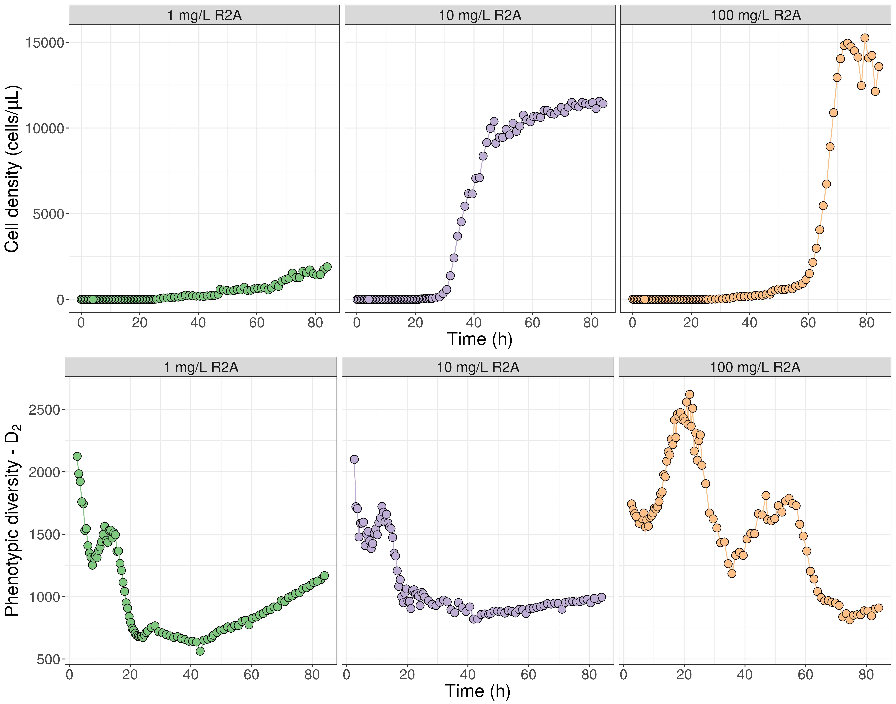

# Cell density 


```r
p_counts <- ggplot(counts, aes(x = ExactTime, y = Total.cells, fill = NutrientCondition))+
  geom_line(aes(color = NutrientCondition))+
  geom_point(shape = 21, size = 4)+
  theme_bw()+
  scale_fill_brewer("Nutrient condition", palette = "Accent")+
  scale_color_brewer(palette = "Accent")+
  theme(axis.text=element_text(size=16), axis.title=element_text(size=20),
        title=element_text(size=20), legend.text=element_text(size=16),
        legend.direction = "horizontal",legend.position = "bottom")+
  ylab("Cell density (cells/µL)")+
  xlab("Time (h)")+
  labs(title="Total population")+
  guides(color = FALSE)


p_HNA <- ggplot(counts, aes(x = ExactTime, y = HNA.cells, fill = NutrientCondition))+
  geom_line(aes(color = NutrientCondition))+
  geom_point(shape = 21, size = 4)+
  theme_bw()+
  scale_fill_brewer("Nutrient condition", palette = "Accent")+
  scale_color_brewer(palette = "Accent")+
  theme(axis.text=element_text(size=16), axis.title=element_text(size=20),
        title=element_text(size=20), legend.text=element_text(size=16),
        legend.direction = "horizontal",legend.position = "bottom")+
  ylab("Cell density (cells/µL)")+
  xlab("Time (h)")+
  labs(title="HNA population")+
  guides(color = FALSE)


p_LNA <- ggplot(counts, aes(x = ExactTime, y = LNA.cells, fill = NutrientCondition))+
    geom_line(aes(color = NutrientCondition))+
  geom_point(shape = 21, size = 4)+
  theme_bw()+
  scale_fill_brewer("Nutrient condition", palette = "Accent")+
  scale_color_brewer(palette = "Accent")+
  theme(axis.text=element_text(size=16), axis.title=element_text(size=20),
        title=element_text(size=20), legend.text=element_text(size=16),
        legend.direction = "horizontal",legend.position = "bottom")+
  ylab("Cell density (cells/µL)")+
  xlab("Time (h)")+
  labs(title="LNA population")+
  guides(color = FALSE)

grid_arrange_shared_legend(p_counts, p_HNA, p_LNA, ncol = 3)
```


# Diversity dynamics


```r
# Calculate phenotypic alpha diversity
diversity_fcm <- Diversity_rf(flowData_transformed, param = param, cleanFCS = FALSE, parallel = TRUE,
                              ncores = 10)
```

```
## -------------------------------------------------------------------------------------------------
## Tue Jan  2 10:27:05 2018 --- Normalizing your FCS data based on maximum FL1-H value
## --- Maximum FL1-H before normalizing: 14.95
## --- Maximum FL3-H before normalizing: 13.27
## --- Maximum SSC-H before normalizing: 17.33
## --- Maximum FSC-H before normalizing: 16.96
## -------------------------------------------------------------------------------------------------
## --- Maximum FL1-H after normalizing: 1
## --- Maximum FL3-H after normalizing: 0.89
## --- Maximum SSC-H after normalizing: 1.16
## --- Maximum FSC-H after normalizing: 1.13
## -------------------------------------------------------------------------------------------------
##  
## Tue Jan  2 10:27:46 2018 --- Using 10 cores for calculations
## Tue Jan  2 10:53:17 2018 --- Closing workers
## Tue Jan  2 10:53:17 2018 --- Alpha diversity metrics (D0,D1,D2) have been computed after 100 bootstraps
## -----------------------------------------------------------------------------------------------------
## 
```


```r
# Add metadata to phenotypic diversity estimate
diversity_fcm <- dplyr::left_join(diversity_fcm, counts, by = c("Sample_names" =  "Samples"))
diversity_fcm <- diversity_fcm %>% dplyr::filter(Timepoint > 5) # Only consider after first 5 samples due to bleaching of tubing

# Plot results
p_div <- ggplot(diversity_fcm, aes(x = ExactTime, y = D2, fill = NutrientCondition))+
    geom_line(aes(color = NutrientCondition))+
    geom_point(shape = 21, size = 4)+
    theme_bw()+
    scale_fill_brewer("Nutrient condition", palette = "Accent")+
    scale_color_brewer("Nutrient condition", palette = "Accent")+
    theme(axis.text=element_text(size=16), axis.title=element_text(size=20),
        title=element_text(size=20), legend.text=element_text(size=16),
        legend.direction = "horizontal",legend.position = "bottom",
        strip.text = element_text(size = 16))+
    ylab(expression("Phenotypic diversity - D"[2]))+
    facet_grid(~NutrientCondition)+
    xlab("Time (h)")+
    guides(fill = FALSE, color = FALSE)


print(p_div)
```


```r
# Reshape combined data
diversity_fcm_long <- tidyr::gather(diversity_fcm, population, Density, Total.cells, LNA.cells, HNA.cells, D2)
diversity_fcm_long$population <- plyr::revalue(diversity_fcm_long$population,  c("Total.cells"="Whole population", "HNA.cells"="HNA population", "LNA.cells"="LNA population", "D2" = "Phenotypic diversity"))

# Combine diversity and count plot
p_count2 <- ggplot(counts, aes(x = ExactTime, y = Total.cells, fill = NutrientCondition))+
  geom_line(aes(color = NutrientCondition))+
  geom_point(shape = 21, size = 4)+
  theme_bw()+
  scale_fill_brewer("Nutrient condition", palette = "Accent")+
  scale_color_brewer(palette = "Accent")+
    theme(axis.text=element_text(size=16), axis.title=element_text(size=20),
        title=element_text(size=20), legend.text=element_text(size=16),
        legend.direction = "horizontal",legend.position = "bottom",
        strip.text = element_text(size = 16))+
  ylab("Cell density (cells/µL)")+
  xlab("Time (h)")+
  facet_grid(~NutrientCondition)+
  guides(color = FALSE, fill = FALSE)

p_HNA2 <- ggplot(counts, aes(x = ExactTime, y = HNA.cells, fill = NutrientCondition))+
  geom_line(aes(color = NutrientCondition))+
  geom_point(shape = 21, size = 4)+
  theme_bw()+
  scale_fill_brewer("Nutrient condition", palette = "Accent")+
  scale_color_brewer(palette = "Accent")+
    theme(axis.text=element_text(size=16), axis.title=element_text(size=20),
        title=element_text(size=20), legend.text=element_text(size=16),
        legend.direction = "horizontal",legend.position = "bottom",
        strip.text = element_text(size = 16))+
  ylab("Cell density (cells/µL)")+
  xlab("Time (h)")+
  facet_grid(~NutrientCondition)+
  guides(color = FALSE, fill = FALSE)

p_LNA2 <- ggplot(counts, aes(x = ExactTime, y = LNA.cells, fill = NutrientCondition))+
  geom_line(aes(color = NutrientCondition))+
  geom_point(shape = 21, size = 4)+
  theme_bw()+
  scale_fill_brewer("Nutrient condition", palette = "Accent")+
  scale_color_brewer(palette = "Accent")+
    theme(axis.text=element_text(size=16), axis.title=element_text(size=20),
        title=element_text(size=20), legend.text=element_text(size=16),
        legend.direction = "horizontal",legend.position = "bottom",
        strip.text = element_text(size = 16))+
  ylab("Cell density (cells/µL)")+
  xlab("Time (h)")+
  facet_grid(~NutrientCondition)+
  guides(color = FALSE, fill = FALSE)

grid.arrange(p_count2, p_div, nrow = 2)
```


```r
grid.arrange(p_HNA2, p_div, nrow = 2)
```


```r
grid.arrange(p_LNA2, p_div, nrow = 2)
```



# Growth rate estimation

## Grofit


```r
# Format data for grofit
## Samples as rows and timepoints as columns
counts_tmp <- counts %>% dplyr::filter(Timepoint > 5) # Only consider after first 5 samples due to bleaching of tubing
count_wide <- spread(counts_tmp[, c(5,2,7)], ExactTime, Total.cells)
time_wide <- as.matrix(spread(counts_tmp[, c(5,7)], ExactTime, ExactTime)[,-1])

## Add two additional columns (mandatory for grofit to run properly)
count_wide <- data.frame(ReactorName = c("R1", "R2","R3"), 
                         NutrientLevel = c("Low", "Medium", "High"), count_wide)

## Fit grofit models
Fit <- grofit::gcFit(time_wide, count_wide, grofit.control(nboot.gc = 1000, smooth.gc=0.5, interactive = FALSE))
```

```
## 
## 
## = 1. growth curve =================================
## ----------------------------------------------------
## --> Try to fit model logistic--> Try to fit model richards--> Try to fit model gompertz--> Try to fit model gompertz.exp
## 
## 
## = 2. growth curve =================================
## ----------------------------------------------------
## --> Try to fit model logistic--> Try to fit model richards--> Try to fit model gompertz--> Try to fit model gompertz.exp
## 
## 
## = 3. growth curve =================================
## ----------------------------------------------------
## --> Try to fit model logistic--> Try to fit model richards--> Try to fit model gompertz--> Try to fit model gompertz.exp
```

```r
sum <- summary(Fit)
par(mfrow=c(3,1))
plot(Fit, opt = "s", slope = TRUE, colSpline = 4, cex = 2, title = "Spline fit") # show spline fits
par(mfrow=c(1,1))

# We continue to work with the spline fits as they seem to be the best
growth_results <- sum[, c("concentration","mu.bt", "lambda.bt", "A.bt",
                          "ci95.mu.bt.up", "ci95.mu.bt.lo",
                          "ci95.lambda.bt.up", "ci95.lambda.bt.lo",
                          "ci95.A.bt.up", "ci95.A.bt.lo")]
```


```r
# Plot lag-phase length, maximum growth rate, etc etc.

# maximum growth rate
p_mu <- ggplot(growth_results, aes(x = concentration, y = mu.bt, fill = concentration))+
  geom_point(shape = 21, size = 5)+
  theme_bw()+
  scale_fill_brewer("Nutrient condition", palette = "Accent")+
    theme(axis.text=element_text(size=16), axis.title=element_text(size=20),
        title=element_text(size=20), legend.text=element_text(size=16),
        legend.direction = "horizontal",legend.position = "bottom",
        strip.text = element_text(size = 16))+
  ylab(expression(mu["max"] ~ "- cells h"^"-1"))+
  xlab("")+
  guides(color = FALSE, fill = FALSE)+
  geom_errorbar(aes(ymax = ci95.mu.bt.up, ymin = ci95.mu.bt.lo), width = 0.025)

# print(p_mu)

# Lag phase
p_lambda <- ggplot(growth_results, aes(x = concentration, y = lambda.bt, fill = concentration))+
  geom_point(shape = 21, size = 5)+
  theme_bw()+
  scale_fill_brewer("Nutrient condition", palette = "Accent")+
    theme(axis.text=element_text(size=16), axis.title=element_text(size=20),
        title=element_text(size=20), legend.text=element_text(size=16),
        legend.direction = "horizontal",legend.position = "bottom",
        strip.text = element_text(size = 16))+
  ylab(expression(lambda ~ "(h)"))+
  xlab("")+
  guides(color = FALSE, fill = FALSE)+
  geom_errorbar(aes(ymax = ci95.lambda.bt.up, ymin = ci95.lambda.bt.lo), width = 0.025)

# print(p_lambda)

# Carrying capacity
p_A <- ggplot(growth_results, aes(x = concentration, y = A.bt, fill = concentration))+
  geom_point(shape = 21, size = 5)+
  theme_bw()+
  scale_fill_brewer("Nutrient condition", palette = "Accent")+
    theme(axis.text=element_text(size=16), axis.title=element_text(size=20),
        title=element_text(size=20), legend.text=element_text(size=16),
        legend.direction = "horizontal",legend.position = "bottom",
        strip.text = element_text(size = 16))+
  ylab(expression("Carrying capacity" ~ "- cells µL"^"-1"))+
  xlab("")+
  guides(color = FALSE, fill = FALSE)+
  geom_errorbar(aes(ymax = ci95.A.bt.up, ymin = ci95.A.bt.lo), width = 0.025)

# print(p_A)

grid.arrange(p_lambda, p_mu, p_A, nrow = 3)
```


## Growthcurver


```r
# Create wide format
count_gc_wide <- spread(counts[, c(5,2,7)], NutrientCondition, Total.cells)

# Run growthcurver
gc_fit <- list()
gc_fit[[1]] <- SummarizeGrowth(count_gc_wide$ExactTime[!is.na(count_gc_wide$`1 mg/L R2A`)], count_gc_wide$`1 mg/L R2A`[!is.na(count_gc_wide$`1 mg/L R2A`)])
gc_fit[[2]] <- SummarizeGrowth(count_gc_wide$ExactTime[!is.na(count_gc_wide$`10 mg/L R2A`)], count_gc_wide$`10 mg/L R2A`[!is.na(count_gc_wide$`10 mg/L R2A`)])
gc_fit[[3]] <- SummarizeGrowth(count_gc_wide$ExactTime[!is.na(count_gc_wide$`100 mg/L R2A`)], count_gc_wide$`100 mg/L R2A`[!is.na(count_gc_wide$`100 mg/L R2A`)])

gc_results <- data.frame(concentration = colnames(count_gc_wide)[-1], 
                         rbind(gc_fit[[1]]$vals, gc_fit[[2]]$vals, gc_fit[[3]]$vals)) 
```
