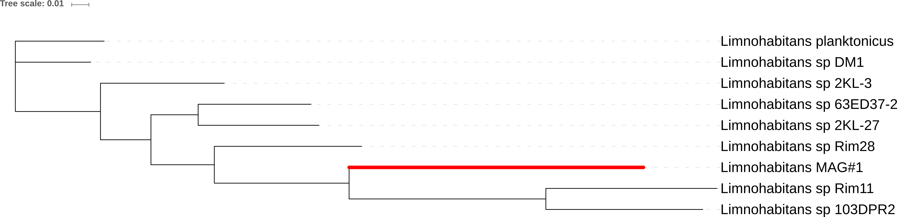

```{r setup, include = FALSE, warning = FALSE}
knitr::opts_chunk$set(eval = TRUE, 
                      echo = TRUE, 
                      cache = TRUE,
                      include = TRUE,
                      collapse = FALSE,
                      dependson = NULL,
                      engine = "R", # Chunks will always have R code, unless noted
                      error = TRUE,
                      fig.path="Figures/cached/",  # Set the figure options
                      fig.align = "center"
                      )
# Load libraries
library('tidyr')
library('dplyr')
library('ggplot2')
library("grid")
library("gridExtra")
library("easyGgplot2")
library("KEGGREST")
source("functions.R")
library("phyloseq")
library("SpiecEasi")
library("seqtime")
library("ggrepel")

col_limno <- "#060670"
col_bac1 <- "#720000"
col_bac2 <- "#D46A6A"
```

# A. 16S analysis
## Network analysis on relative abundances  

In the first analysis we utilize the raw counts. As such this network will be built using relative abundance data.
```{r network-analysis-relative, warning = FALSE, dpi = 500, fig.width = 8, fig.height = 8}
# Set seed
set.seed(777)

# Import data
otus <- as.matrix(read.csv2("16S_data/OTU_table_raw.csv", fill = TRUE, header = TRUE,
                    row.names = 1))

taxa <- tax_table(as.matrix(read.csv2("16S_data/tax_table_raw.csv", fill = TRUE, header = TRUE,
                    row.names = 1))
)

phy_df <- phyloseq(otu_table(otus, taxa_are_rows = FALSE), taxa)

# filterobj <- filterTaxonMatrix(otus, minocc = 20,
#                               keepSum = TRUE, return.filtered.indices = TRUE)
# otus.f <- filterobj$mat
# taxa.f <- taxa[setdiff(1:nrow(taxa), filterobj$filtered.indices),]
# dummyTaxonomy <- colnames(tax_df); dummyTaxonomy[1] <- "Kingdom_dummy"
# taxa.f <- rbind(taxa.f, dummyTaxonomy)
# rownames(taxa.f)[nrow(taxa.f)] <- "0"
# rownames(otus.f)[nrow(otus.f)] <- "0"
# 
# # Next, we assemble a new phyloseq object with the filtered OTU and taxonomy tables.
# updatedotus <- otu_table(otus.f, taxa_are_rows = TRUE)
# updatedtaxa <- tax_table(taxa.f)
# phyloseqobj.f <- phyloseq(updatedotus, updatedtaxa)

# Prevalence filtering
phy_df_filtered <- filter_taxa(phy_df, function(x) sum(x > 30) > (0.25*length(x)), TRUE)

sp_easi <- spiec.easi(phy_df_filtered, method='mb', lambda.min.ratio=1e-2,
                           nlambda=20, icov.select.params=list(rep.num=50))

ig.mb <- adj2igraph(sp_easi$refit,  vertex.attr = list(name=taxa_names(phy_df_filtered)))
vsize <- Biobase::rowMax(clr(otu_table(phy_df_filtered), 1))+15
Lineage_rel <- tax_table(phy_df_filtered)[,"Lineage"]
Lineage_rel <- factor(Lineage_rel, levels = unique(Lineage_rel))
vweights <- summary(symBeta(getOptBeta(sp_easi), mode='maxabs'))
MAGs <- c(); MAGs[taxa_names(phy_df_filtered)=="Otu00001"]  <- "Limnohabitans MAG"
MAGs[taxa_names(phy_df_filtered)=="Otu00002"]  <- "Bacteroidetes MAG1"
MAGs[taxa_names(phy_df_filtered)=="Otu00003"]  <- "Bacteroidetes MAG2"
MAGs[is.na(MAGs)] <-""

# png(file = "./Figures/Figures_network/NETWORK-REL-CX-C30-A25.png", width = 9, height = 9, res = 500, units = "in")
plot_network_custom(ig.mb, phy_df_filtered, type='taxa',
             line_weight = 2, hjust = 0.5,
             point_size = 0.1, alpha = 0.01, label_size = 3.95)+
  scale_fill_brewer(palette = "Paired")+
  scale_color_brewer(palette = "Paired")+
  geom_point(aes(size = vsize, fill = Lineage_rel), alpha = 0.5,
             colour="black", shape=21)+
  guides(size = FALSE,
    fill  = guide_legend(title = "Lineage", override.aes = list(size = 5),
                         nrow = 4),
    color = FALSE)+
  theme(legend.position="bottom", legend.text=element_text(size=12),
        text = element_text(size = 12),
        plot.margin = unit(c(1,1,1,1), "cm"))+
  scale_size(range = c(5, 15))+
  geom_label_repel(aes(label = MAGs), fontface = 'bold', color = 'black',
                   box.padding = 0.35, point.padding = 0.5,
                   segment.color = 'black',
                   size = 4,
                       # Width of the line segments.
                   segment.size = 1.5,
                   # Draw an arrow from the label to the data point.
                   arrow = arrow(length = unit(0.015, 'npc')),
                   nudge_x = -0.1,
                   nudge_y = 0.6
  )
# dev.off()
```
## Network analysis on absolute abundances  

The second network will be built using absolute abundance data by multiplying the relative taxon abundances by the total cell density. The final obtained counts will expressed as nr. of cells measured in 50 µL samples. We also only consider the OTUs that were left after the prevalence filtering conducted in the network construction with relative abundance data.
```{r network-analysis-absolute, warning = FALSE, dpi = 500, fig.width = 8, fig.height = 8}
# Import cell count data
cell_counts <- read.csv("16S_data/cell_counts.csv")
cell_counts$sample_title <- as.factor(cell_counts$sample_title)
# Calculate proportions
phy_df_rel <- transform_sample_counts(phy_df, function(x) x/sum(x))

# Select samples for which corresponding counts are available
cell_counts <- cell_counts[cell_counts$sample_title %in% sample_names(phy_df_rel), ]
cell_counts <- droplevels(cell_counts)
phy_df_rel <- prune_samples(sample_names(phy_df_rel) %in% cell_counts$sample_title, phy_df_rel)

# Multiply with cell counts in 50 µL of sample
otu_table(phy_df_rel) <- otu_table(phy_df_rel) * cell_counts$Number_of_cells

# Select taxa that were selected based on prevalence in previous chunk
phy_df_abs <- prune_taxa(taxa_names(phy_df_filtered), phy_df_rel)

# Round absolute abundances to integers
otu_table(phy_df_abs) <- round(otu_table(phy_df_abs), 0)

# Construct network
sp_easi_abs <- spiec.easi(phy_df_abs, method='mb', lambda.min.ratio=1e-2,
                           nlambda=20, icov.select.params=list(rep.num=50))

ig.mb_abs <- adj2igraph(sp_easi_abs$refit,  vertex.attr = list(name=taxa_names(phy_df_abs)))
vsize_abs <- Biobase::rowMax(clr(otu_table(phy_df_abs), 1))+15
Lineage_abs <- tax_table(phy_df_abs)[,"Lineage"]
Lineage_abs <- factor(Lineage_abs, levels = unique(Lineage_abs))
vweights_abs <- summary(symBeta(getOptBeta(sp_easi_abs), mode='maxabs'))
MAGs <- c(); MAGs[taxa_names(phy_df_abs)=="Otu00001"]  <- "Limnohabitans MAG"
MAGs[taxa_names(phy_df_abs)=="Otu00002"]  <- "Bacteroidetes MAG1"
MAGs[taxa_names(phy_df_abs)=="Otu00003"]  <- "Bacteroidetes MAG2"
MAGs[is.na(MAGs)] <-""

# Plot network inferred from absolute abundances
# png(file = "./Figures/Figures_network/NETWORK-ABS-CX-C30-A25.png", width = 9, height = 9, res = 500, units = "in")
plot_network_custom(ig.mb_abs, phy_df_abs, type='taxa',
             line_weight = 2, hjust = 0.5,
             point_size = 0.1, alpha = 0.01, label_size = 3.95)+
  scale_fill_brewer(palette = "Paired")+
  scale_color_brewer(palette = "Paired")+
  geom_point(aes(size = vsize_abs, fill = Lineage_abs), alpha = 0.5,
             colour="black", shape=21)+
  guides(size = FALSE,
    fill  = guide_legend(title = "Lineage", override.aes = list(size = 5),
                         nrow = 4),
    color = FALSE)+
  theme(legend.position="bottom", legend.text=element_text(size=12),
        text = element_text(size = 12),
        plot.margin = unit(c(1,1,1,1), "cm"))+
  scale_size(range = c(5, 15))+
  geom_label_repel(aes(label = MAGs), fontface = 'bold', color = 'black',
                   box.padding = 0.35, point.padding = 0.5,
                   segment.color = 'black',
                   size = 4,
                       # Width of the line segments.
                   segment.size = 1.5,
                   # Draw an arrow from the label to the data point.
                   arrow = arrow(length = unit(0.015, 'npc')),
                   nudge_x = -0.1,
                   nudge_y = 0.6
  )
# dev.off()
```

# B. MetaG analysis
```{r read-format data, warning = FALSE, dpi = 500, fig.width = 7, fig.height = 6}
# Read data
mean_coverage <- read.table("./SAMPLES-SUMMARY/bins_across_samples/mean_coverage.txt", header = TRUE)
std_coverage <- read.table("./SAMPLES-SUMMARY/bins_across_samples/std_coverage.txt", header = TRUE)
bin_size <- read.table("./SAMPLES-SUMMARY/general_bins_summary.txt", header = TRUE)[, c(1, 3, 6, 9)]
total_reads <- read.table("./sample_reads.tsv", header = TRUE)
read_length <- 300

# From wide to long format
mean_coverage_long <- gather(mean_coverage, Sample_ID, coverage, 
                             SAMPLE_16:SAMPLE_65, factor_key=TRUE)

std_coverage_long <- gather(std_coverage, Sample_ID, std_coverage, 
                            SAMPLE_16:SAMPLE_65, 
                            factor_key=TRUE)

coverage_data <- data.frame(mean_coverage_long, 
                            std_coverage = std_coverage_long[,3])

# Read and add metadata
# meta <- read.csv2("metadata.csv")
# meta$Sample_ID <- gsub(meta$Sample_ID, pattern = ".", replacement = "_", fixed = TRUE)
data_total <- left_join(coverage_data, total_reads, by = "Sample_ID")
data_total <- left_join(data_total, bin_size, by = "bins")
# data_total <- left_join(data_total, meta, by =  "Sample_ID")
data_total$bins <- plyr::revalue(data_total$bins, c("BetIa_bin"="Limnohabitans_bin", "bacIa_vizbin1"="Bacteroidetes_bin1",
                                              "bacIa_vizbin2"="Bacteroidetes_bin2"))
# Calculate relative abundance of the bins
data_total$mean_rel_abundance <- 100*(data_total$coverage*data_total$bin_size)/(read_length*data_total$Total_reads)
data_total$upper_rel_abundance <- 100*((data_total$coverage+data_total$std_coverage)*data_total$bin_size)/(read_length*data_total$Total_reads)
data_total$lower_rel_abundance <- 100*((data_total$coverage-data_total$std_coverage)*data_total$bin_size)/(read_length*data_total$Total_reads)

data_total$mean_rel_abundance_map <- 100*(data_total$coverage*data_total$bin_size)/(read_length*data_total$Mapped_reads)
data_total$upper_rel_abundance_map <- 100*((data_total$coverage+data_total$std_coverage)*data_total$bin_size)/(read_length*data_total$Mapped_reads)
data_total$lower_rel_abundance_map <- 100*((data_total$coverage-data_total$std_coverage)*data_total$bin_size)/(read_length*data_total$Mapped_reads)

# Add additional column that assigns PNCs to correct MAG
data_total$Genome_id <- factor(rep(c("Limnohabitans", "Limnohabitans", "Limnohabitans", "Bacteroidetes MAG2", "Bacteroidetes MAG1", "Bacteroidetes MAG2"), 4))

# Plot genome size for all three genomes
data_total[data_total$bins %in% c("Bacteroidetes_bin1",
                                "Bacteroidetes_bin2","Limnohabitans_bin"), ] %>% 
  ggplot(aes(x = bins, y = bin_size/(4*1e6), fill = Genome_id))+
  theme_bw()+
  geom_bar(width = 0.5, stat="identity", alpha = 0.7)+
  coord_flip()+
  scale_fill_manual(values = c(col_bac1, col_bac2, col_limno))+
  theme(axis.text.x = element_text(angle = 0, size = 16),
        axis.text.y = element_text(size = 16),
        axis.title.x = element_text(size = 18),
        legend.title = element_text("Genome bin"), legend.position = "top")+
  xlab("")+
  ylab("Genome size (Mbp)")+
  guides(fill = FALSE)+
  geom_hline(yintercept = 1, size = 2, linetype="dotted")

# Plot irep for all 3 genomes
data_total[data_total$bins %in% c("Bacteroidetes_bin1",
                                "Bacteroidetes_bin2","Limnohabitans_bin"), ] %>% 
  ggplot(aes(x = bins, y = mean_irep/4, fill = Genome_id))+
  theme_bw()+
  geom_bar(width = 0.5, stat="identity", alpha = 0.7)+
  coord_flip()+
  scale_fill_manual(values = c(col_bac1, col_bac2, col_limno))+
  theme(axis.text.x = element_text(angle = 0, size = 16),
        axis.text.y = element_text(size = 16),
        axis.title.x = element_text(size = 18),
        legend.title = element_text(""), legend.position = "top")+
  xlab("")+
  ylab("Index of Replication (iRep)")+
  guides(fill = FALSE)+
  geom_hline(yintercept = 1.34, size = 2, linetype="dotted")
```

# 1. Phylogenetic tree
## Limnohabitans
  


## Bacteroidetes

# *2. Investigate MAG- and 16S-based abundances*
It is clear that there is significant %GC coverage bias present. The estimated relative abundances
from metagenomics do not quantitatively match with the V3-V4 16S rRNA gene amplicon data.
$$Relative\ abundance =100*(\frac{mean\ coverage * bin\ size}{read\ length*total\ sample\ reads })$$
Another option is to calculate relative to mapped number of reads:
$$Relative\ abundance =100*(\frac{mean\ coverage * bin\ size}{read\ length*total\ sample\ reads * \%mapped\ reads})$$


Import reference relative abundances from 16S data set in order to directly compare with metagenomic data set.
```{r import-reference, warning = FALSE}
df_16S <- read.table("relative_abundance_16S.tsv", header = TRUE)
df_16S_long <- gather(df_16S, Sample_ID, relative_abundance_16S, 
                             SAMPLE_16:SAMPLE_65, factor_key=TRUE)
```


```{r plot-data, warning = FALSE, fig.width = 7.5, fig.height = 22.5,  dpi=500}
# Subset for only the three complete genomes (not PNCs).
data_total_sb <- data_total[data_total$bins %in% c("Limnohabitans_bin", "Bacteroidetes_bin1", "Bacteroidetes_bin2"),]

p_meta <- ggplot(data = data_total_sb, aes(x = bins, y = mean_rel_abundance, fill = bins))+
  geom_point(size = 4, shape = 21, alpha = 0.7)+
  scale_fill_manual(values = c(col_bac1, col_bac2, col_limno))+
  theme_bw()+
  geom_errorbar(aes(ymin=lower_rel_abundance, 
                    ymax=upper_rel_abundance, 
                    width=.1))+
  facet_grid(.~Sample_ID)+
  # ylim(0,1)+ 
  theme(axis.text=element_text(size=14), axis.title=element_text(size=20),
        title=element_text(size=20), legend.text=element_text(size=14),
        legend.background = element_rect(fill="transparent"),
        axis.text.x = element_text(angle = 45, hjust = 1),
        strip.text.x=element_text(size=18))+
  ylab("Mean relative abundance (%)")+
  ylim(-1,100)+
  ggtitle("Metagenomic - total reads")

# Corrected for mapped N° of reads
p_meta_mapped <- ggplot(data = data_total_sb, aes(x = bins, y = mean_rel_abundance_map, fill = bins))+
  geom_point(size = 4, shape = 21, alpha = 0.7)+
  scale_fill_manual(values = c(col_bac1, col_bac2, col_limno))+
  theme_bw()+
  geom_errorbar(aes(ymin=lower_rel_abundance_map, 
                    ymax=upper_rel_abundance_map, 
                    width=.1))+
  facet_grid(.~Sample_ID)+
  # ylim(0,1)+ 
  theme(axis.text=element_text(size=14), axis.title=element_text(size=20),
        title=element_text(size=20), legend.text=element_text(size=14),
        legend.background = element_rect(fill="transparent"),
        axis.text.x = element_text(angle = 45, hjust = 1),
        strip.text.x=element_text(size=18))+
  ylab("Mean relative abundance (%)")+
  ylim(-1,100)+
  ggtitle("Metagenomic - mapped reads")

p_16S <- ggplot(data = df_16S_long, aes(x = bins, y = relative_abundance_16S, fill = bins))+
  geom_point(size = 4, shape = 21, alpha = 0.7)+
  scale_fill_manual(values = c(col_bac1, col_bac2, col_limno))+
  theme_bw()+
  facet_grid(.~Sample_ID)+
  theme(axis.text=element_text(size=14), axis.title=element_text(size=20),
        title=element_text(size=20), legend.text=element_text(size=14),
        legend.background = element_rect(fill="transparent"),
        axis.text.x = element_text(angle = 45, hjust = 1),
        strip.text.x=element_text(size=18))+
  ylab("Mean relative abundance (%)")+
  ylim(-1,100)+
  ggtitle("V3-V4 16S")

grid_arrange_shared_legend(p_meta, p_meta_mapped, p_16S, ncol = 1, nrow = 3)
```

# *3. Investigate sequence characteristics within coding DNA sequences (CDS)*

```{r %GC-gene-analysis_v1, warning = FALSE, fig.width = 22.5, fig.height = 7.5,  dpi=500}
# First we need the files that map the gene ID to the sequence ID (linux cmd: https://github.com/rprops/MetaG_lakeMI/wiki/11.-Genome-annotation)
# These are stored in the IMG_annotation data for each genome bin

# Next, extract the %GC of each gene from the gff file
extract_gc_from_gff("./IMG_annotation/IMG_2724679690_Limnohabitans/121950.assembled.gff", outputFolder = "GC_analysis")
extract_gc_from_gff("./IMG_annotation/IMG_2724679691_Bacteroidetes_bin1/121951.assembled.gff", outputFolder = "GC_analysis")
extract_gc_from_gff("./IMG_annotation/IMG_2724679698_Bacteroidetes_bin2/121960.assembled.gff", outputFolder = "GC_analysis")

# Use these files to make dataframes mapping function (COGs/Pfams/KO) and %GC
LIMNO_gc_cog <- gc2function(seq_id_gc = "GC_analysis/seqid_GC_121950.assembled.gff.tsv", gene_id_seq_id ="./IMG_annotation/IMG_2724679690_Limnohabitans/Annotation/2724679690_gene_oid_2_seq_id.txt", 
                             functions = "./IMG_annotation/IMG_2724679690_Limnohabitans/Annotation/2724679690.cog.tab.txt", gc_thresh = 0.1, output = FALSE)

BAC1_gc_cog <- gc2function(seq_id_gc = "GC_analysis/seqid_GC_121951.assembled.gff.tsv", gene_id_seq_id ="./IMG_annotation/IMG_2724679691_Bacteroidetes_bin1/Annotation/2724679691_gene_oid_2_seq_id.txt", 
                             functions = "./IMG_annotation/IMG_2724679691_Bacteroidetes_bin1//Annotation/2724679691.cog.tab.txt", gc_thresh = 0.1, output = FALSE)

BAC2_gc_cog <- gc2function(seq_id_gc = "GC_analysis/seqid_GC_121960.assembled.gff.tsv", gene_id_seq_id ="./IMG_annotation/IMG_2724679698_Bacteroidetes_bin2/Annotation/2724679698_gene_oid_2_seq_id.txt", 
                             functions = "./IMG_annotation/IMG_2724679698_Bacteroidetes_bin2/Annotation/2724679698.cog.tab.txt", gc_thresh = 0.1, output = FALSE)

LIMNO_gc_pfam <- gc2function(seq_id_gc = "GC_analysis/seqid_GC_121950.assembled.gff.tsv", gene_id_seq_id ="./IMG_annotation/IMG_2724679690_Limnohabitans/Annotation/2724679690_gene_oid_2_seq_id.txt", 
                             functions = "./IMG_annotation/IMG_2724679690_Limnohabitans/Annotation/2724679690.pfam.tab.txt", gc_thresh = 0.1, output = FALSE)

BAC1_gc_pfam <- gc2function(seq_id_gc = "GC_analysis/seqid_GC_121951.assembled.gff.tsv", gene_id_seq_id ="./IMG_annotation/IMG_2724679691_Bacteroidetes_bin1/Annotation/2724679691_gene_oid_2_seq_id.txt", 
                             functions = "./IMG_annotation/IMG_2724679691_Bacteroidetes_bin1//Annotation/2724679691.pfam.tab.txt", gc_thresh = 0.1, output = FALSE)

BAC2_gc_pfam <- gc2function(seq_id_gc = "GC_analysis/seqid_GC_121960.assembled.gff.tsv", gene_id_seq_id ="./IMG_annotation/IMG_2724679698_Bacteroidetes_bin2/Annotation/2724679698_gene_oid_2_seq_id.txt", 
                             functions = "./IMG_annotation/IMG_2724679698_Bacteroidetes_bin2/Annotation/2724679698.pfam.tab.txt", gc_thresh = 0.1, output = FALSE)

LIMNO_gc_KO <- gc2function(seq_id_gc = "GC_analysis/seqid_GC_121950.assembled.gff.tsv", gene_id_seq_id ="./IMG_annotation/IMG_2724679690_Limnohabitans/Annotation/2724679690_gene_oid_2_seq_id.txt", 
                             functions = "./IMG_annotation/IMG_2724679690_Limnohabitans/Annotation/2724679690.ko.tab.txt", gc_thresh = 0.1, output = FALSE)

BAC1_gc_KO <- gc2function(seq_id_gc = "GC_analysis/seqid_GC_121951.assembled.gff.tsv", gene_id_seq_id ="./IMG_annotation/IMG_2724679691_Bacteroidetes_bin1/Annotation/2724679691_gene_oid_2_seq_id.txt", 
                             functions = "./IMG_annotation/IMG_2724679691_Bacteroidetes_bin1//Annotation/2724679691.ko.tab.txt", gc_thresh = 0.1, output = FALSE)

BAC2_gc_KO <- gc2function(seq_id_gc = "GC_analysis/seqid_GC_121960.assembled.gff.tsv", gene_id_seq_id ="./IMG_annotation/IMG_2724679698_Bacteroidetes_bin2/Annotation/2724679698_gene_oid_2_seq_id.txt", 
                             functions = "./IMG_annotation/IMG_2724679698_Bacteroidetes_bin2/Annotation/2724679698.ko.tab.txt", gc_thresh = 0.1, output = FALSE)
```

Motivation: For COGs there exists a hierarchy allowing us to investigate whether there is a conservation of high/low %GC in certain functional gene groups. In order to do this we need to incorporate this hierarchy into the genome dataframes we have now.  

```{r %GC-gene-analysis_2, warning = FALSE, fig.width = 22.5, fig.height = 7.5,  dpi=500}
```


# *4. Analysis of gene length distribution*
Here we use the dataframe made in the previous section to see if there is a significant difference in the gene length of the COGs within these three consensus genomes.  

Observation: They have very small genes: on average < 500bp.

```{r gene-length-analysis_COG, warning = FALSE, fig.width = 10, fig.height = 3.5,  dpi=500}
# Limnohabitans MAG gene length distribution 
p_LIMNO_length <- easyGgplot2::ggplot2.histogram(data = LIMNO_gc_cog, xName = 'gene_length',
                  groupName = 'Genome', alpha = 0.5,
                  legendPosition = "top", binwidth = 0.15,
                  groupColors = col_limno,addMeanLine=TRUE, meanLineColor="black",
                  meanLineType="dashed")+ theme_bw()+ ylim(0,15)+
  labs(x = "Gene length (bp)", y = "Count")+ theme(legend.position="none")+
  ggtitle("Limnohabitans MAG")+ xlim(0,2000)

# Bacteroidetes MAG1 gene length distribution 
p_BAC1_length <- easyGgplot2::ggplot2.histogram(data = BAC1_gc_cog, xName = 'gene_length',
                  groupName = 'Genome', alpha = 0.5,
                  legendPosition = "top", binwidth = 0.15, 
                  groupColors = col_bac1,addMeanLine=TRUE, meanLineColor="black",
                  meanLineType="dashed")+ theme_bw()+ ylim(0,15)+
  labs(x = "Gene length (bp)", y = "Count")+ theme(legend.position="none")+
  ggtitle("Bacteroidetes MAG1")+ xlim(0,2000)

# Bacteroidetes MAG2 gene length distribution 
p_BAC2_length <- easyGgplot2::ggplot2.histogram(data = BAC2_gc_cog, xName = 'gene_length',
                  groupName = 'Genome', alpha = 0.5,
                  legendPosition = "top", binwidth = 0.15,
                  groupColors = col_bac2,addMeanLine=TRUE, meanLineColor="black",
                  meanLineType="dashed")+ theme_bw()+ ylim(0,15)+
  labs(x = "Gene length (bp)", y = "Count")+ theme(legend.position="none")+
  ggtitle("Bacteroidetes MAG2")+ xlim(0,2000)

grid.arrange(p_LIMNO_length, p_BAC1_length, p_BAC2_length, ncol = 3)
```

We can do the same for the Pfams.
```{r gene-length-analysis_Pfam, warning = FALSE, fig.width = 10, fig.height = 3.5,  dpi=500}
# Limnohabitans MAG gene length distribution 
p_LIMNO_length <- easyGgplot2::ggplot2.histogram(data = LIMNO_gc_pfam, xName = 'gene_length',
                  groupName = 'Genome', alpha = 0.5,
                  legendPosition = "top", binwidth = 0.15,
                  groupColors = col_limno,addMeanLine=TRUE, meanLineColor="black",
                  meanLineType="dashed")+ theme_bw()+ ylim(0,25)+
  labs(x = "Gene length (bp)", y = "Count")+ theme(legend.position="none")+
  ggtitle("Limnohabitans MAG")+ xlim(0,3000)

# Bacteroidetes MAG1 gene length distribution 
p_BAC1_length <- easyGgplot2::ggplot2.histogram(data = BAC1_gc_pfam, xName = 'gene_length',
                  groupName = 'Genome', alpha = 0.5,
                  legendPosition = "top", binwidth = 0.15, 
                  groupColors = col_bac1,addMeanLine=TRUE, meanLineColor="black",
                  meanLineType="dashed")+ theme_bw()+ ylim(0,25)+
  labs(x = "Gene length (bp)", y = "Count")+ theme(legend.position="none")+
  ggtitle("Bacteroidetes MAG1")+ xlim(0,3000)

# Bacteroidetes MAG2 gene length distribution 
p_BAC2_length <- easyGgplot2::ggplot2.histogram(data = BAC2_gc_pfam, xName = 'gene_length',
                  groupName = 'Genome', alpha = 0.5,
                  legendPosition = "top", binwidth = 0.15,
                  groupColors = col_bac2,addMeanLine=TRUE, meanLineColor="black",
                  meanLineType="dashed")+ theme_bw()+ ylim(0,25)+
  labs(x = "Gene length (bp)", y = "Count")+ theme(legend.position="none")+
  ggtitle("Bacteroidetes MAG2")+ xlim(0,3000)

grid.arrange(p_LIMNO_length, p_BAC1_length, p_BAC2_length, ncol = 3)
```

# 5. Identify unique functional genes (COG/Pfams)
```{r identify-unique-cog}
# Find unique functions in Limnohabitans MAG vs Bacteroidetes MAG1
unique_LIMNO_BAC1 <- dplyr::anti_join(LIMNO_gc_cog, BAC1_gc_cog, by = "cog_id")
cat("There are", paste(nrow(unique_LIMNO_BAC1)), "unique COGs in Limnohabitans MAG vs Bacteroidetes MAG1")

# Find unique functions in Limnohabitans MAG vs Bacteroidetes MAG2
unique_LIMNO_BAC2 <- dplyr::anti_join(LIMNO_gc_cog, BAC2_gc_cog, by = "cog_id")
cat("There are", paste(nrow(unique_LIMNO_BAC2)), "unique COGs in Limnohabitans MAG vs Bacteroidetes MAG2")

# Find unique functions in Bacteroidetes MAG1 vs Bacteroidetes MAG2
unique_BAC1_BAC2 <- dplyr::anti_join(BAC1_gc_cog, BAC2_gc_cog, by = "cog_id")
cat("There are", paste(nrow(unique_BAC1_BAC2)), "unique COGs in Bacteroidetes MAG1 vs Bacteroidetes MAG2")

# Find unique functions in Bacteroidetes MAG1 vs Bacteroidetes MAG2
unique_BAC2_BAC1 <- dplyr::anti_join(BAC2_gc_cog, BAC1_gc_cog, by = "cog_id")
cat("There are", paste(nrow(unique_BAC2_BAC1)), "unique COGs in Bacteroidetes MAG2 vs Bacteroidetes MAG1")
```

```{r identify-unique-pfam}
# Find unique functions in Limnohabitans MAG vs Bacteroidetes MAG1
unique_pfam_LIMNO_BAC1 <- dplyr::anti_join(LIMNO_gc_pfam, BAC1_gc_pfam, by = "pfam_id")
cat("There are", paste(nrow(unique_pfam_LIMNO_BAC1)), "unique Pfams in Limnohabitans MAG vs Bacteroidetes MAG1")

# Find unique functions in Limnohabitans MAG vs Bacteroidetes MAG2
unique_pfam_LIMNO_BAC2 <- dplyr::anti_join(LIMNO_gc_pfam, BAC2_gc_pfam, by = "pfam_id")
cat("There are", paste(nrow(unique_pfam_LIMNO_BAC2)), "unique Pfams in Limnohabitans MAG vs Bacteroidetes MAG2")

# Find unique functions in Bacteroidetes MAG1 vs Bacteroidetes MAG2
unique_pfam_BAC1_BAC2 <- dplyr::anti_join(BAC1_gc_pfam, BAC2_gc_pfam, by = "pfam_id")
cat("There are", paste(nrow(unique_pfam_BAC1_BAC2)), "unique Pfams in Bacteroidetes MAG1 vs Bacteroidetes MAG2")

# Find unique functions in Bacteroidetes MAG1 vs Bacteroidetes MAG2
unique_pfam_BAC2_BAC1 <- dplyr::anti_join(BAC2_gc_pfam, BAC1_gc_pfam, by = "pfam_id")
cat("There are", paste(nrow(unique_pfam_BAC2_BAC1)), "unique Pfams in Bacteroidetes MAG2 vs Bacteroidetes MAG1")
```


# 6. COG functional categories
Get COG ID to COG functional category mapping file here: ftp://ftp.ncbi.nih.gov/pub/wolf/COGs/COG0303/cogs.csv    

The exact statistical analysis to compare genomes based on these profiles should be performed in STAMP.

```{r COG functional categories, dpi = 300, warning = FALSE, fig.width = 5, fig.height = 15}
# Import COG mapping file
cogid_2_cogcat <- read.csv("./Mapping_files/cogid_2_cogcat.csv", sep = ",", header = FALSE, fill = TRUE,col.names = c("COG_ID", "COG_class", "function"))[, 1:2]
cogid_2_cogcat <- cogid_2_cogcat[(cogid_2_cogcat$COG_class)!="", ]
cogid_2_cogcat <- droplevels(cogid_2_cogcat)

# Read COG category file
cog_categories <- read.table("./Mapping_files/cog_categories.tsv", header = TRUE, sep = "\t")

# Merge COG metadata
cog_meta <- dplyr::left_join(cog_categories, cogid_2_cogcat, by = c("COG_class" = "COG_class"))
cog_meta <- droplevels(cog_meta)

# Merge genome information of all genome bins
merged_gc_cog <- rbind(LIMNO_gc_cog, BAC1_gc_cog, BAC2_gc_cog)
merged_gc_cog <- data.frame(merged_gc_cog, genome_id = c(rep("Limnohabitans MAG", nrow(LIMNO_gc_cog)), 
                                             rep("Bacteroidetes MAG1", nrow(BAC1_gc_cog)),
                                             rep("Bacteroidetes MAG2", nrow(BAC2_gc_cog)))
                            )

# Merge this metadata with the genome data from before
# COGs with multiple classifications are currently still NA - work on this.
merged_gc_cog <- dplyr::left_join(merged_gc_cog, cog_meta, by = c("cog_id" = "COG_ID"))
merged_gc_cog <- merged_gc_cog[!is.na(merged_gc_cog$COG_functional_category),]

# Visualize distribution across major metabolism functional COG groups per genome.
p_cog_func_group <- ggplot(data = merged_gc_cog, 
                           aes(x=COG_functional_category, fill = COG_functional_cluster))+
  geom_bar(stat="count", width=0.7, color = "black", size = 0.75)+
  theme_bw()+
  facet_grid(genome_id~.)+
  scale_fill_brewer(palette = "Accent")+
  labs(x = "Gene length (bp)", y = "Count")+ 
  theme(legend.position="bottom", axis.text.x = element_text(angle = 90, hjust = 1),
                                                   legend.text = element_text(size = 5))+
  guides(fill=guide_legend(nrow=2,byrow=TRUE))

print(p_cog_func_group)

p_cog_func_clust <- ggplot(data = merged_gc_cog, 
                           aes(x=COG_functional_cluster, fill = COG_functional_cluster))+
  geom_bar(stat="count", width=0.7, color = "black", size = 0.75)+
  theme_bw()+
  facet_grid(genome_id~.)+
  scale_fill_brewer(palette = "Accent")+
  labs(x = "Gene length (bp)", y = "Count")+ 
  theme(legend.position="bottom",axis.text.x = element_text(angle = 90, hjust = 1),
                                                   legend.text = element_text(size = 5))+
  guides(fill=guide_legend(nrow=2,byrow=TRUE))

print(p_cog_func_clust)
```

# 7. KO pathways

* Get reference file that maps KO ids to pathways here: http://www.genome.jp/kegg-bin/get_htext?ko00001.keg (download htext).

```{r KO pathways, dpi = 300, warning = FALSE, fig.width = 12, fig.height = 13}
# Import data
ko_path_df <- read.table("./Mapping_files/ko00001.keg", header = FALSE, sep = ";",
                      skip = 8, quote = "", fill = TRUE, 
                      col.names = c("Level", "KO", "Function_abbrev", "Function_spec"))
ko_path_df <- ko_path_df[1:(nrow(ko_path_df)-1), ] # remove tailing "!" at the end of file

# Remove empty rows
ko_path_df <- ko_path_df[!ko_path_df$KO == "", ]

# Extract pathways from dataframe and add them as new factor column
# pathw_hier <- data.frame(Level = ko_path_df$Level[ko_path_df$Level %in% c("A","B","C")], 
#                     Name = ko_path_df$KO[ko_path_df$Level %in% c("A","B","C")]
#                     )
# pathw_hier$Name <- as.character(pathw_hier$Name)
ko_path_df <- data.frame(ko_path_df, level_A = "A", level_B = "B", level_C = "C",
                         stringsAsFactors = FALSE)
ko_path_df$KO <- as.character(ko_path_df$KO)

# Get positions where to replicate higher hierarichcal level
pos_A <- c(c(1:nrow(ko_path_df))[ko_path_df$Level %in% "A"], nrow(ko_path_df)+1)
pos_B <- c(c(1:nrow(ko_path_df))[ko_path_df$Level %in% "B"], nrow(ko_path_df)+1)
pos_C <- c(c(1:nrow(ko_path_df))[ko_path_df$Level %in% "C"], nrow(ko_path_df)+1)


for(i in 1:(length(pos_A)-1)){
  ko_path_df$level_A[pos_A[i]:(pos_A[i+1]-1)] <- ko_path_df$KO[pos_A[i]]
}

for(i in 1:(length(pos_B)-1)){
  ko_path_df$level_B[pos_B[i]:(pos_B[i+1]-1)] <- ko_path_df$KO[pos_B[i]]
}

for(i in 1:(length(pos_C)-1)){
  ko_path_df$level_C[pos_C[i]:(pos_C[i+1]-1)] <- ko_path_df$KO[pos_C[i]]
}

# Remove all rows with level A, B, C - and level column
ko_path_df <- ko_path_df[!ko_path_df$Level %in% c("A", "B", "C"), ]
ko_path_df$level_A <- gsub(ko_path_df$level_A, pattern = "<b>|</b>", replacement = "")
ko_path_df$level_B <- gsub(ko_path_df$level_B, pattern = "<b>|</b>", replacement = "")
ko_path_df <- ko_path_df[, -1]

# Annotate merged ko file
merged_gc_ko <- rbind(LIMNO_gc_KO, BAC1_gc_KO, BAC2_gc_KO)
merged_gc_ko <- data.frame(merged_gc_ko, 
                           genome_id = c(rep("Limnohabitans MAG", nrow(LIMNO_gc_KO)),
                                         rep("Bacteroidetes MAG1", nrow(BAC1_gc_KO)),
                                         rep("Bacteroidetes MAG2", nrow(BAC2_gc_KO)))
                            )
merged_gc_ko$ko_id <- gsub(merged_gc_ko$ko_id, pattern = "KO:", replacement = "")
merged_gc_ko <- dplyr::left_join(merged_gc_ko, ko_path_df[, c(1, 4:6)], by = c("ko_id" = "KO"))

# Fill up NA slots with "Unknown" pathway
merged_gc_ko$level_A[is.na(merged_gc_ko$level_A)] <- "Unknown"
merged_gc_ko$level_B[is.na(merged_gc_ko$level_B)] <- "Unknown"
merged_gc_ko$level_C[is.na(merged_gc_ko$level_C)] <- "Unknown"
```

# 8.  Synonymous Codon Usage Bias analysis using CodonO

* Get CodonO for linux here: http://sysbio.cvm.msstate.edu/software/CodonO/download

* Run `CU.linux input.genes.fna`  
* Output from CodonO:  
  inputfile.ok  ---- the SCUO units for each input sequence based on its order  
	inputfile.fik ---- the composition ratio of the i-th amino acid in the k-th sequence  
	inputfile.hijk ---- the frequency of the j-th degenerate codon for amino acid i in each sequence  

* This output was not sufficient to perform any analysis. Therefore I used the web browser to calculate the synonymous codon bias in the genes of the three genomes.

** Codon bias is proportional to mRNA production! (Wan et al 2004)  

** However, strong correlation between SCUO and %GC has been reported, thereby
confounding possible "biological" effects.. Beware..


```{r Codon bias, dpi = 300, warning = FALSE, fig.width = 7, fig.height = 8}
# Import and format data for Limnohabitans MAG
SCUO_LIMNO <- read.table("./IMG_annotation/IMG_2724679690_Limnohabitans/Annotation/2724679690.genes.fna.codonO.output",
                         sep = ",", blank.lines.skip = TRUE, allowEscapes = FALSE, skipNul = TRUE
                         )
SCUO_LIMNO$V1 <- gsub(SCUO_LIMNO$V1, pattern = "\t", replacement = "")
Gene_LIMNO <- do.call(rbind, strsplit(SCUO_LIMNO$V1[grep("Ga0*", SCUO_LIMNO$V1)], " "))[,2]
SCUO_LIMNO$V1 <- gsub(SCUO_LIMNO$V1, pattern = " ", replacement = "")
SCUO_LIMNO <- data.frame(GC = SCUO_LIMNO$V1[grep(x = SCUO_LIMNO$V1, pattern = "GC*.*=")], 
                         SCUO = rep(SCUO_LIMNO$V1[grep(x = SCUO_LIMNO$V1, pattern = "SCUO*")], each = 4),
                         Gene = rep(Gene_LIMNO, each = 4)
)
SCUO_LIMNO$GC <- as.numeric(gsub(SCUO_LIMNO$GC, pattern = ".*=", replacement = ""))
SCUO_LIMNO$SCUO <- as.numeric(gsub(SCUO_LIMNO$SCUO, pattern = ".*=", replacement = ""))

# Import and format data for Bacteroidetes MAG1
SCUO_BAC1 <- read.table("./IMG_annotation/IMG_2724679691_Bacteroidetes_bin1/Annotation/2724679691.genes.fna.codonO.output",
                         sep = ",", blank.lines.skip = TRUE, allowEscapes = FALSE, skipNul = TRUE)
SCUO_BAC1$V1 <- gsub(SCUO_BAC1$V1, pattern = "\t", replacement = "")
Gene_BAC1 <- do.call(rbind, strsplit(SCUO_BAC1$V1[grep("Ga0*", SCUO_BAC1$V1)], " "))[,2]
SCUO_BAC1$V1 <- gsub(SCUO_BAC1$V1, pattern = " ", replacement = "")
SCUO_BAC1 <- data.frame(GC = SCUO_BAC1$V1[grep(x = SCUO_BAC1$V1, pattern = "GC*.*=")], 
                         SCUO = rep(SCUO_BAC1$V1[grep(x = SCUO_BAC1$V1, pattern = "SCUO*")], each = 4),
                         Gene = rep(Gene_BAC1, each = 4)
)
SCUO_BAC1$GC <- as.numeric(gsub(SCUO_BAC1$GC, pattern = ".*=", replacement = ""))
SCUO_BAC1$SCUO <- as.numeric(gsub(SCUO_BAC1$SCUO, pattern = ".*=", replacement = ""))


# Import and format data for Bacteroidetes MAG2
SCUO_BAC2 <- read.table("./IMG_annotation/IMG_2724679698_Bacteroidetes_bin2/Annotation/2724679698.genes.fna.codonO.output",
                         sep = ",", blank.lines.skip = TRUE, allowEscapes = FALSE, skipNul = TRUE)
SCUO_BAC2$V1 <- gsub(SCUO_BAC2$V1, pattern = "\t", replacement = "")
Gene_BAC2 <- do.call(rbind, strsplit(SCUO_BAC2$V1[grep("Ga0*", SCUO_BAC2$V1)], " "))[,2]
SCUO_BAC2$V1 <- gsub(SCUO_BAC2$V1, pattern = " ", replacement = "")
SCUO_BAC2 <- data.frame(GC = SCUO_BAC2$V1[grep(x = SCUO_BAC2$V1, pattern = "GC*.*=")], 
                         SCUO = rep(SCUO_BAC2$V1[grep(x = SCUO_BAC2$V1, pattern = "SCUO*")], each = 4),
                         Gene = rep(Gene_BAC2, each = 4)
)
SCUO_BAC2$GC <- as.numeric(gsub(SCUO_BAC2$GC, pattern = ".*=", replacement = ""))
SCUO_BAC2$SCUO <- as.numeric(gsub(SCUO_BAC2$SCUO, pattern = ".*=", replacement = ""))

# Merge data to one dataframe
SCUO_merged_gen <- data.frame(rbind(SCUO_LIMNO, SCUO_BAC1, SCUO_BAC2),
           Genome_ID = c(rep("Limnohabitans MAG", nrow(SCUO_LIMNO)), rep("Bacteroidetes MAG1", nrow(SCUO_BAC1)), 
           rep("Bacteroidetes MAG2", nrow(SCUO_BAC2))),
            GCx = rep(c("GC_mean", "GC1", "GC2", "GC3"), 
                     (nrow(SCUO_LIMNO) + nrow(SCUO_BAC1) + nrow(SCUO_BAC2))/4
            )
)

# Merge codon bias data with KO pathway annotation
SCUO_merged <- dplyr::left_join(SCUO_merged_gen, merged_gc_ko[, c(1:2,4 ,14:21)], by = c("Gene" = "contig_geneID"))
          
# Visualize differences in codon bias
p_SCUO.1 <- ggplot(data = SCUO_merged, aes (x = 100*GC, y = SCUO, fill = Genome_ID))+
  geom_point(size = 4, shape = 21, alpha = 0.7)+
  scale_fill_manual(values = c(col_bac1, col_bac2, col_limno))+
  theme_bw()+
  facet_wrap(~GCx, ncol = 2)+
  theme(axis.text=element_text(size=14), axis.title=element_text(size=20),
        title=element_text(size=20), legend.text=element_text(size=14),
        legend.background = element_rect(fill="transparent"),
        axis.text.x = element_text(angle = 0, hjust = 1),
        strip.text.x=element_text(size=18))+
  ylab("SCUO")+
  xlab("%GC")+
  ylim(0,1)

print(p_SCUO.1)

# Subset to genes for which ko annotation is available
SCUO_merged_sb <- SCUO_merged[!is.na(SCUO_merged$level_A), ]
SCUO_merged_sb <- SCUO_merged_sb[SCUO_merged_sb$GCx == "GC_mean", ]
# Look at pathways enriched in high %GC
# SCUO_merged_sb[]


SCUO_merged_gen_gcmean <- SCUO_merged_gen %>% dplyr::filter(GCx == "GC_mean")

p_SCUO.2 <- ggplot(data = SCUO_merged_gen_gcmean, aes (x = Genome_ID, y = SCUO))+
  geom_jitter(size = 3, alpha = 0.3, shape = 21, aes(fill = Genome_ID))+
  geom_boxplot(alpha=0, size =1.5, color = "darkorange")+
  # scale_fill_brewer(palette = "Accent")+
  scale_fill_manual(values = c(col_bac1, col_bac2, col_limno))+
  theme_bw()+
  # facet_wrap(Genome_ID~GCx)+
  theme(axis.text=element_text(size=14), axis.title=element_text(size=20),
        title=element_text(size=20), legend.text=element_text(size=14),
        legend.background = element_rect(fill="transparent"),
        axis.text.x = element_text(angle = 45, hjust = 1),
        strip.text.x=element_text(size=18))+
  ylab("Codon bias - SCUO")+
  xlab("")+
  ylim(0,1)+ 
  guides(fill=FALSE)+ 
  scale_x_discrete(labels=c("Bacteroidetes MAG1" = paste("Bacteroidetes MAG1 (n=",table(SCUO_merged_gen_gcmean$Genome_ID)[1],")", sep = ""),
                            "Bacteroidetes MAG2" = paste("Bacteroidetes MAG2 (n=",table(SCUO_merged_gen_gcmean$Genome_ID)[2],")", sep = ""),
                            "Limnohabitans MAG" = paste("Limnohabitans MAG (n=",table(SCUO_merged_gen_gcmean$Genome_ID)[3],")", sep = ""))
  )
# 
print(p_SCUO.2)
tmp <- SCUO_merged_sb$genome_id
tmp2 <- cbind(SCUO_merged_sb$ko_id, 
      c(rep(col_limno, table(tmp)[3]), rep(col_bac1, table(tmp)[1]), rep(col_bac2, table(tmp)[2]))
)

write.table(tmp2, file = "All_KO.tsv", quote = FALSE,
            col.names = FALSE, row.names = FALSE)
```

# 9.  PosiGene analysis for identifying genes under positive selection in the Limnohabitans MAG

Phylogenetic tree used in PosiGene analysis. Red branch indicates the genome for which PSG were tested.
 

```{r posigene-selection, dpi = 500, fig.width = 8, fig.height = 7, warning = FALSE}
# Import results_short file
data_posi <- read.table("./posigene_analysis/result_tables/Limnohabitans_MAG_results_short.tsv", header = TRUE, fill = TRUE)
data_posi$Gene <- as.character(data_posi$Gene)

# Import mapping file to link gene IDs from PosiGene to 
# those used by the IMG annotation (both are in headers from .genes.fna)
map_posi <- read.table("./Mapping_files/posiG_mapping.tsv")
colnames(map_posi) <- c("posi_geneID", "IMG_geneID")
map_posi$posi_geneID <- as.character(map_posi$posi_geneID)

# Filter out the genes that are under positive selection
# Taking threshold of adjusted p.value of 0.05 and FDR < 0.05
data_posi <- data_posi %>% filter(P.Value < 0.05 & 
                                    FDR < 0.05)
# Report summary
cat(paste("There are ", nrow(data_posi), " genes under positive selection in this MAG (P<0.05). This is ",round(100*nrow(data_posi)/nrow(map_posi),1), "% of all genes",  sep = "")
)

# Merge this data with the functional annotation (e.g. KO) of these genes
data_posi <- left_join(data_posi, map_posi, by = c("Gene" = "posi_geneID"))
data_posi_KO <- left_join(data_posi, merged_gc_ko, by = c("IMG_geneID" = "contig_geneID"))

# Optional: write tabel for quick view in iPath v2
# write.table(file = "KO_posiG.tsv", unique(data_posi_KO$ko_id), quote = FALSE,
            # row.names = FALSE, col.names = FALSE)
cat("Genes under positive selection with KO annotation")
data_posi_KO[, c(1:6, 9:12, 20:29)]


# Focus on C-metabolism
data_posi_KO[data_posi_KO$ko_id %in% data_posi_KO$ko_id[data_posi_KO$level_B == "Carbohydrate metabolism"], ] %>% 
 ggplot(aes(x = ko_id, fill = level_C))+
  geom_bar(stat="count", width=0.7, color = "black", size = 0.75)+
  theme_bw()+
  # facet_wrap(~level_B, ncol = 2)+
  scale_fill_brewer(palette = "Paired")+
  labs(x = "", y = "Count")+ 
  theme(legend.position="bottom", axis.text.x = element_text(angle = 60, hjust = 1),
                                                   legend.text = element_text(size = 5))+
  guides(fill=guide_legend(nrow=6,byrow=TRUE))

# Focus on energy metabolism
data_posi_KO %>% dplyr::filter(level_B == "Energy metabolism") %>% 
 ggplot(aes(x = ko_id, fill = level_C))+
  geom_bar(stat="count", width=0.7, color = "black", size = 0.75)+
  theme_bw()+
  # facet_wrap(~level_B, ncol = 2)+
  scale_fill_brewer(palette = "Paired")+
  labs(x = "", y = "Count")+ 
  theme(legend.position="bottom", axis.text.x = element_text(angle = 60, hjust = 1),
                                                   legend.text = element_text(size = 5))+
  guides(fill=guide_legend(nrow=6,byrow=TRUE))


# Focus on translation
data_posi_KO %>% dplyr::filter(level_B == "Translation") %>% 
 ggplot(aes(x = ko_id, fill = level_C))+
  geom_bar(stat="count", width=0.7, color = "black", size = 0.75)+
  theme_bw()+
  # facet_wrap(~level_B, ncol = 2)+
  scale_fill_brewer(palette = "Paired")+
  labs(x = "", y = "Count")+ 
  theme(legend.position="bottom", axis.text.x = element_text(angle = 60, hjust = 1),
                                                   legend.text = element_text(size = 5))+
  guides(fill=guide_legend(nrow=6,byrow=TRUE))

# Focus on secondary metabolite production
data_posi_KO %>% dplyr::filter(level_B == "Metabolism of cofactors and vitamins") %>% 
 ggplot(aes(x = ko_id, fill = level_C))+
  geom_bar(stat="count", width=0.7, color = "black", size = 0.75)+
  theme_bw()+
  # facet_wrap(~level_B, ncol = 2)+
  scale_fill_brewer(palette = "Paired")+
  labs(x = "", y = "Count")+ 
  theme(legend.position="bottom", axis.text.x = element_text(angle = 60, hjust = 1),
                                                   legend.text = element_text(size = 5))+
  guides(fill=guide_legend(nrow=6,byrow=TRUE))

# Count number of unique genes involved in biosynthesis
```

```{r posigene-scuo, dpi = 500, fig.width = 8, fig.height = 7, warning = FALSE}
# Correlate genes under positive selection with their GC content
data_SCUO_posi <- SCUO_merged_gen_gcmean %>% filter(Genome_ID == "Limnohabitans MAG")
data_SCUO_posi <- droplevels(data_SCUO_posi)
data_SCUO_posi$posi_select <- data_SCUO_posi$Gene %in% data_posi$IMG_geneID
data_SCUO_posi$posi_select <- factor(data_SCUO_posi$posi_select, levels = c("FALSE", "TRUE"))

# Evaluate correlation between codon bias and selection pressure
p_SCUO_posi <- ggplot(data = data_SCUO_posi, aes (x = GC, y = SCUO))+
  geom_point(shape = 21, size = 3, fill = adjustcolor(col_limno, 0.1))+
  geom_point(shape = 21, size = 4, fill = "red",
             data = subset(data_SCUO_posi, posi_select == TRUE))+
  # geom_boxplot(alpha=0, size =1.5, color = "darkorange")+
  # scale_fill_brewer(palette = "Accent")+
  # scale_fill_manual(values = c(adjustcolor(col_limno, 0.1),  "darkorange"))+
  # scale_size_manual(values = c(2.5,4))+
  theme_bw()+
  # facet_wrap(Genome_ID~GCx)+
  theme(axis.text=element_text(size=14), axis.title=element_text(size=20),
        title=element_text(size=20), legend.text=element_text(size=14),
        legend.background = element_rect(fill="transparent"),
        axis.text.x = element_text(angle = 45, hjust = 1),
        strip.text.x=element_text(size=18))+
  ylab("Codon bias - SCUO")+ 
  xlab("%GC")+
  ylim(0,1)+ 
  guides(fill=FALSE, size = FALSE)

p_SCUO_posi

p_SCUO_posi2 <- ggplot(data = data_SCUO_posi, aes (x = posi_select, y = SCUO,
                                                   fill = posi_select))+
  # geom_jitter(shape = 21, aes(fill = posi_select, size = posi_select), width = 0.2)+
  geom_jitter(shape = 21, size = 3, width = 0.2, alpha = 0.5)+
  geom_boxplot(alpha=0.5, size =1.5, color = "darkgrey", width = 0.35)+
  # scale_fill_brewer(palette = "Accent")+
  scale_fill_manual(values = c(adjustcolor(col_limno, 0.1), adjustcolor("red", 0.5)))+
  # scale_size_manual(values = c(2.5,4))+
  theme_bw()+
  # facet_wrap(Genome_ID~GCx)+
  theme(axis.text=element_text(size=14), axis.title=element_text(size=20),
        title=element_text(size=20), legend.text=element_text(size=14),
        legend.background = element_rect(fill="transparent"),
        axis.text.x = element_text(angle = 45, hjust = 1),
        strip.text.x=element_text(size=18))+
  ylab("Codon bias - SCUO")+ 
  xlab("")+
  ylim(0,1)+ 
  guides(size = FALSE)

p_SCUO_posi2

p_SCUO_posi3 <- ggplot(data = data_SCUO_posi, aes (x = posi_select, y = GC,
                                                   fill = posi_select))+
  # geom_jitter(shape = 21, aes(fill = posi_select, size = posi_select), width = 0.2)+
  geom_jitter(shape = 21, size = 3, width = 0.2, alpha = 0.5)+
  geom_boxplot(alpha=0.5, size =1.5, color = "darkgrey", width = 0.35)+
  # scale_fill_brewer(palette = "Accent")+
  scale_fill_manual(values = c(adjustcolor(col_limno, 0.1), adjustcolor("red", 0.5)))+
  # scale_size_manual(values = c(2.5,4))+
  theme_bw()+
  # facet_wrap(Genome_ID~GCx)+
  theme(axis.text=element_text(size=14), axis.title=element_text(size=20),
        title=element_text(size=20), legend.text=element_text(size=14),
        legend.background = element_rect(fill="transparent"),
        axis.text.x = element_text(angle = 45, hjust = 1),
        strip.text.x=element_text(size=18))+
  ylab("%GC")+ 
  xlab("")+
  ylim(0.5,0.9)+ 
  guides(size = FALSE)

p_SCUO_posi3
```