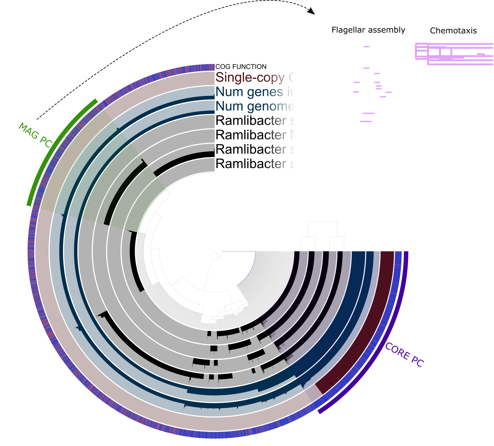

```{r setup, include = FALSE, warning = FALSE}
knitr::opts_chunk$set(eval = TRUE, 
                      echo = TRUE, 
                      cache = TRUE,
                      include = TRUE,
                      collapse = FALSE,
                      dependson = NULL,
                      engine = "R", # Chunks will always have R code, unless noted
                      error = TRUE,
                      fig.path="Figures/cached/",  # Set the figure options
                      fig.align = "center"
                      )
# Load libraries
library('tidyr')
library('dplyr')
library('ggplot2')
library("grid")
library("gridExtra")
library("janitor")
library("reshape2")
library("easyGgplot2")
library("KEGGREST")
source("functions.R")
library("phyloseq")
library("SpiecEasi")
library("seqtime")
library("ggrepel")
library("scales")
library("MetQy")
library("RColorBrewer")

col_RAMLI <- "#887CAF"
# col_RAMLI <- "#e2a2fd"
col_bac1 <- "#720000"
col_bac2 <- "#D46A6A"
```

# A. 16S analysis
## Network analysis on relative abundances  

In the first analysis we utilize the raw counts. As such this network will be built using relative abundance data.
```{r network-analysis-relative, warning = FALSE, dpi = 500, fig.width = 8, fig.height = 8, dev = c("png","pdf")}
# Set seed
set.seed(777)

# Import data
otus <- as.matrix(read.csv2("16S_data/OTU_table_raw.csv", fill = TRUE, header = TRUE,
                    row.names = 1))

taxa <- tax_table(as.matrix(read.csv2("16S_data/tax_table_raw.csv", fill = TRUE, header = TRUE,row.names = 1))
)

phy_df <- phyloseq(otu_table(otus, taxa_are_rows = FALSE), taxa)

# filterobj <- filterTaxonMatrix(otus, minocc = 20,
#                               keepSum = TRUE, return.filtered.indices = TRUE)
# otus.f <- filterobj$mat
# taxa.f <- taxa[setdiff(1:nrow(taxa), filterobj$filtered.indices),]
# dummyTaxonomy <- colnames(tax_df); dummyTaxonomy[1] <- "Kingdom_dummy"
# taxa.f <- rbind(taxa.f, dummyTaxonomy)
# rownames(taxa.f)[nrow(taxa.f)] <- "0"
# rownames(otus.f)[nrow(otus.f)] <- "0"
# 
# # Next, we assemble a new phyloseq object with the filtered OTU and taxonomy tables.
# updatedotus <- otu_table(otus.f, taxa_are_rows = TRUE)
# updatedtaxa <- tax_table(taxa.f)
# phyloseqobj.f <- phyloseq(updatedotus, updatedtaxa)

# Prevalence filtering
phy_df_filtered <- filter_taxa(phy_df, function(x) sum(x > 30) > (0.25*length(x)), TRUE)

sp_easi <- spiec.easi(phy_df_filtered, method='mb', lambda.min.ratio=1e-2,
                           nlambda=20, icov.select.params=list(rep.num=50))

ig.mb <- adj2igraph(sp_easi$refit,  vertex.attr = list(name=taxa_names(phy_df_filtered)))
vsize <- Biobase::rowMedians(clr(otu_table(phy_df_filtered), 1))+15
Lineage_rel <- tax_table(phy_df_filtered)[,"Lineage"]
Lineage_rel <- factor(Lineage_rel, levels = unique(Lineage_rel))
vweights <- summary(symBeta(getOptBeta(sp_easi), mode='maxabs'))
MAGs <- c(); MAGs[taxa_names(phy_df_filtered)=="Otu00001"]  <- "Ramlibacter sp. MAG"
MAGs[taxa_names(phy_df_filtered)=="Otu00002"]  <- "Bacteroidetes sp. MAG1"
MAGs[taxa_names(phy_df_filtered)=="Otu00003"]  <- "Bacteroidetes sp. MAG2"
MAGs[is.na(MAGs)] <- ""

# png(file = "./Figures/Figures_network/NETWORK-REL-CX-C30-A25.png", width = 9, height = 9, res = 500, units = "in")
plot_network_custom(ig.mb, phy_df_filtered, type='taxa',
             line_weight = 2, hjust = 0.5,
             point_size = 0.1, alpha = 0.01, label_size = 3.95)+
  # scale_fill_brewer(palette = "Paired")+
  # scale_color_brewer(palette = "Paired")+
  scale_fill_manual(values = c("#e2a2fd", brewer.pal(n = 12, "Paired")[c(3:8,1:2,11,12)]) )+
  geom_point(aes(size = vsize, fill = Lineage_rel), alpha = 0.5,
             colour="black", shape=21)+
  guides(size = FALSE,
    fill  = guide_legend(title = "Lineage", override.aes = list(size = 5),
                         nrow = 4),
    color = FALSE)+
  theme(legend.position="bottom", legend.text=element_text(size=12),
        text = element_text(size = 12),
        plot.margin = unit(c(1,1,1,1), "cm"))+
  scale_size(range = c(5, 15))+
  geom_label_repel(aes(label = MAGs), fontface = 'bold', color = 'black',
                   box.padding = 0.35, point.padding = 0.5,
                   segment.color = 'black',
                   size = 4,
                       # Width of the line segments.
                   segment.size = 1.5,
                   # Draw an arrow from the label to the data point.
                   arrow = arrow(length = unit(0.015, 'npc')),
                   nudge_x = -0.1,
                   nudge_y = 0.6
  )
# dev.off()
```

## Network analysis on absolute abundances  

The second network will be built using absolute abundance data by multiplying the relative taxon abundances by the total cell density. The final obtained counts will expressed as nr. of cells measured in 50 µL samples. We also only consider the OTUs that were left after the prevalence filtering conducted in the network construction with relative abundance data.  

```{r network-analysis-absolute, warning = FALSE, dpi = 500, fig.width = 8, fig.height = 8, dev = c("png","pdf")}
# Import cell count data
cell_counts <- read.csv("16S_data/cell_counts.csv")
cell_counts$sample_title <- as.factor(cell_counts$sample_title)

# Import metadata
meta_16S <- read.csv("16s_data/Metadata.csv")[1:77,]; rownames(meta_16S) <- meta_16S$sample_title

# Calculate proportions
phy_df_rel <- transform_sample_counts(phy_df, function(x) x/sum(x))

# Add metadata
sample_data(phy_df_rel) <- sample_data(meta_16S)

# Select samples for which corresponding counts are available
cell_counts <- cell_counts[cell_counts$sample_title %in% sample_names(phy_df_rel), ]
cell_counts <- droplevels(cell_counts)
phy_df_abs <- prune_samples(sample_names(phy_df_rel) %in% cell_counts$sample_title, phy_df_rel)

# Multiply with cell counts in 50 µL of sample
otu_table(phy_df_abs) <- otu_table(phy_df_abs) * cell_counts$Number_of_cells

# Select taxa that were selected based on prevalence in previous chunk
phy_df_abs <- prune_taxa(taxa_names(phy_df_filtered), phy_df_abs)

# Round absolute abundances to integers
otu_table(phy_df_abs) <- round(otu_table(phy_df_abs), 0)

# Construct network
sp_easi_abs <- spiec.easi(phy_df_abs, method='mb', lambda.min.ratio=1e-2,
                           nlambda=20, icov.select.params=list(rep.num=50))

ig.mb_abs <- adj2igraph(sp_easi_abs$refit,  vertex.attr = list(name=taxa_names(phy_df_abs)))
vsize_abs <- Biobase::rowMedians(clr(otu_table(phy_df_abs), 1))+15
Lineage_abs <- tax_table(phy_df_abs)[,"Lineage"]
Lineage_abs <- factor(Lineage_abs, levels = unique(Lineage_abs))
vweights_abs <- summary(symBeta(getOptBeta(sp_easi_abs), mode='maxabs'))
MAGs <- c(); MAGs[taxa_names(phy_df_abs)=="Otu00001"]  <- "Ramlibacter sp. MAG"
MAGs[taxa_names(phy_df_abs)=="Otu00002"]  <- "Bacteroidetes sp. MAG1"
MAGs[taxa_names(phy_df_abs)=="Otu00003"]  <- "Bacteroidetes sp. MAG2"
MAGs[is.na(MAGs)] <-""
```


```{r network-analysis-absolute-plot, warning = FALSE, dpi = 500, fig.width = 8, fig.height = 8, dev = c("png","pdf")}
# Plot network inferred from absolute abundances
# png(file = "./Figures/Figures_network/NETWORK-ABS-CX-C30-A25.png", width = 9, height = 9, res = 500, units = "in")
plot_network_custom(ig.mb_abs, phy_df_abs, type='taxa',
             line_weight = 2, hjust = 0.5,
             point_size = 0.1, alpha = 0.01, label_size = 3.95)+
  # scale_fill_brewer(palette = "Paired")+
  # scale_color_brewer(palette = "Paired")+
  # scale_fill_manual(values = c("#e2a2fd", brewer.pal(n = 12, "Paired")[c(3:8,1:2,11,12)]) )+
    scale_fill_manual(values = c(col_RAMLI, brewer.pal(n = 12, "Paired")[c(6,3,4,4,7,8,1:2,11,12)]) )+
  geom_point(aes(size = vsize_abs, fill = Lineage_abs), alpha = 0.5,
             colour="black", shape=21)+
  guides(size = FALSE,
    fill  = guide_legend(title = "Lineage", override.aes = list(size = 5),
                         nrow = 4),
    color = FALSE)+
  theme(legend.position="bottom", legend.text=element_text(size=12),
        text = element_text(size = 12),
        plot.margin = unit(c(1,1,1,1), "cm"))+
  scale_size(range = c(5, 15))+
  geom_label_repel(aes(label = MAGs), fontface = 'bold', color = 'black',
                   box.padding = 0.35, point.padding = 0.5,
                   segment.color = 'black',
                   size = 4,
                       # Width of the line segments.
                   segment.size = 1.5,
                   # Draw an arrow from the label to the data point.
                   arrow = arrow(length = unit(0.015, 'npc')),
                   nudge_x = -0.1,
                   nudge_y = 0.6
  )
# dev.off()
```

## Plots  

```{r OTU1-dynamics, warning = FALSE, dpi = 500, fig.width = 9, fig.height = 5.5, dev = c("png")}
# Plot absolute OTU dynamics of OTU1
df_abs <- psmelt(phy_df_abs)
col_RAMLI <- "#887CAF"

# Need to account for dilution factor of 2 and 50 µL volume measured
p_abs_otu1 <- df_abs %>% dplyr::filter(OTU == "Otu00001") %>% 
  ggplot(aes(x = Timepoint, y = 2*Abundance/50))+
  facet_grid(.~Reactor.cycle, scales = "free")+
  scale_shape_manual(values = c(21,24))+
  geom_line(size = 1.5, linetype = 2, color = adjustcolor("#000000", 0.5))+
  geom_point(size = 4, fill = col_RAMLI, aes(shape = Reactor_status, 
                                            alpha = Reactor_status),
             color = "black")+
  scale_alpha_manual(values = c(0.5,1))+
  theme_bw()+
  ylab(expression("Otu00001 abundance - cells µL"^"-1"))+
  xlab("Time relative to reactor start - days")+
  scale_y_continuous(breaks = seq(0,50e3,5e3)*2/50, limits = c(0,30e3)*2/50)+
  theme(axis.text=element_text(size=14), axis.title=element_text(size=20),
        title=element_text(size=20), legend.text=element_text(size=14),
        legend.background = element_rect(fill="transparent"),
        strip.text.x=element_text(size=18),
        legend.position = "top")+
  guides(shape = guide_legend(title="Reactor status", ncol =1),
         alpha = FALSE)
print(p_abs_otu1)
```

```{r OTU1-box-abs, warning = FALSE, dpi = 500, fig.width = 6.5, fig.height = 5, dev = c("png", "pdf")}

# Boxplot of absolute abundances
col_RAMLI <- "#887CAF"

p_abs_box <- df_abs %>% 
  dplyr::filter(OTU %in% c("Otu00001","Otu00002","Otu00003")) %>% 
  ggplot(aes(x = OTU, y = 2*Abundance/50, fill = OTU))+
  geom_jitter(size = 2,
             color = "black", shape = 21, width = 0.1, alpha = 0.5)+
  geom_violin(alpha = 0.4, adjust = 1, draw_quantiles = TRUE,
              trim = TRUE)+
  stat_summary(fun.data=mean_sdl, fun.args = list(mult = 1), 
                 geom="pointrange", color="black")+
  # geom_boxplot(width = 0.5, alpha = 0.4, outlier.shape = NA)+
  scale_fill_manual(values = c(col_RAMLI, col_bac1, col_bac2))+
  theme_bw()+
  ylab(expression("Cells µL"^"-1"))+
  xlab("")+
  # ylab("")+
  scale_y_continuous(breaks = seq(0,50e3,10e3)*2/50, limits = c(-5e3,40e3)*2/50)+
  theme(axis.text=element_text(size=14), axis.title=element_text(size=20),
        axis.text.x=element_text(size=14),
        title=element_text(size=16), legend.text=element_text(size=14),
        legend.background = element_rect(fill="transparent"),
        strip.text.x=element_text(size=18),
        legend.position = "sqrt")+
  guides(shape = guide_legend(title="Reactor status", ncol =1),
         fill = FALSE)+
    theme(axis.line = element_line(size = 1, colour = "grey80"),
        panel.border = element_blank())
  # ggtitle(expression("Cells mL"^"-1"))
  # ggtitle(expression("Absolute abundance (cells mL"^"-1)"))


print(p_abs_box)
```

```{r OTU1-box-rel, dpi = 500, fig.width = 6.5, fig.height = 5, dev = c("png", "pdf")}
# psmelt relative abundance data
df_rel <- psmelt(phy_df_rel)
col_RAMLI <- "#887CAF"

# Boxplot of relative abundances
p_rel_box <- df_rel %>% 
  dplyr::filter(OTU %in% c("Otu00001","Otu00002","Otu00003")) %>% 
  ggplot(aes(x = OTU, y = 100*Abundance, fill = OTU))+
  geom_jitter(size = 2,
             color = "black", shape = 21, width = 0.1, alpha = 0.5)+
  geom_violin(alpha = 0.4, adjust = 1, draw_quantiles = TRUE)+
  stat_summary(fun.data=mean_sdl, fun.args = list(mult = 1), 
                 geom="pointrange", color="black")+
  # geom_boxplot(width = 0.5, alpha = 0.4, outlier.shape = NA)+
  scale_fill_manual(values = c(col_RAMLI, col_bac1, col_bac2))+
  theme_bw()+
  # ylab(expression("Relative abundance - %"))+
  xlab("")+
  ylab("")+
  scale_y_continuous(breaks = 100*seq(0,1,0.2), limits = 100*c(-0.05,1))+
  theme(axis.text=element_text(size=14), axis.title=element_text(size=20),
        axis.text.x=element_text(size=14, angle = 0),
        title=element_text(size=16), legend.text=element_text(size=14),
        legend.background = element_rect(fill="transparent"),
        strip.text.x=element_text(size=18),
        legend.position = "top")+
  guides(shape = guide_legend(title="Reactor status", ncol =1),
         fill = FALSE)+
    theme(axis.line = element_line(size = 1, colour = "grey80"),
        panel.border = element_blank())+
  ggtitle("Relative abundance (%)")


print(p_rel_box)
```

## Physicochemistry

```{r physico-data, warning = FALSE, dpi = 500, fig.width = 6, fig.height = 6, dev = c("png", "svg")}
  # Assess correlations
  Physico_df_trim_abs_OTU1 <- df_abs[, c("OTU", "Timepoint","Dilution_factor", 
                              "Formate", "Acetate", "Sulfate", 
                              "Nitrate", "Chloride", "Temperature", 
                              "Conductivity", "pH", "Sample", "Abundance")] %>%
  dplyr::filter(!is.na(Formate), OTU == "Otu00001")
  
  colnames(Physico_df_trim_abs_OTU1)[13] <- "OTU1 - abundance"
  
  Physico_df_trim_abs_OTU2 <- df_abs[,  c("OTU", "Sample", "Abundance")] %>%
  dplyr::filter(OTU == "Otu00002")
  colnames(Physico_df_trim_abs_OTU2)[3] <- "OTU2 - abundance"
  
  Physico_df_trim_abs_OTU3 <- df_abs[, c("OTU", "Sample", "Abundance")]%>%
  dplyr::filter(OTU == "Otu00003")
  colnames(Physico_df_trim_abs_OTU3)[3] <- "OTU3 - abundance"
  
  Physico_df_trim_abs_merged <- left_join(Physico_df_trim_abs_OTU1, 
                                            Physico_df_trim_abs_OTU2,
                                            by = "Sample")
  
  Physico_df_trim_abs_merged <- left_join(Physico_df_trim_abs_merged, 
                                            Physico_df_trim_abs_OTU3,
                                            by = "Sample")
  # Same for relative abundances
  Physico_df_trim_rel_OTU1 <- df_rel[, c("OTU", "Timepoint","Dilution_factor", 
                              "Formate", "Acetate", "Sulfate", 
                              "Nitrate", "Chloride", "Temperature", 
                              "Conductivity", "pH", "Sample", "Abundance")] %>%
  dplyr::filter(!is.na(Formate), OTU == "Otu00001")
  
  colnames(Physico_df_trim_rel_OTU1)[13] <- "OTU1 - abundance"
  
  Physico_df_trim_rel_OTU2 <- df_rel[,  c("OTU", "Sample", "Abundance")] %>%
  dplyr::filter(OTU == "Otu00002")
  colnames(Physico_df_trim_rel_OTU2)[3] <- "OTU2 - abundance"
  
  Physico_df_trim_rel_OTU3 <- df_rel[, c("OTU", "Sample", "Abundance")]%>%
  dplyr::filter(OTU == "Otu00003")
  colnames(Physico_df_trim_rel_OTU3)[3] <- "OTU3 - abundance"
  
  Physico_df_trim_rel_merged <- left_join(Physico_df_trim_rel_OTU1, 
                                            Physico_df_trim_rel_OTU2,
                                            by = "Sample")
  
  Physico_df_trim_rel_merged <- left_join(Physico_df_trim_rel_merged, 
                                            Physico_df_trim_rel_OTU3,
                                            by = "Sample")
  
  
  # Physico_df_trim_rel <- df_rel[, c("OTU", "Timepoint","Dilution_factor", 
  #                             "Formate", "Acetate", "Sulfate", 
  #                             "Nitrate", "Chloride", "Temperature", 
  #                             "Conductivity", "pH", "Abundance")] %>%
  # dplyr::filter(!is.na(Formate), OTU == otu)

  # Get P-values of correlations between OTUs and physicochemistry
  p.mat_abs <- cor.mtest(Physico_df_trim_abs_merged[, -c(1:3, 12,14,16)],
                                            method = "kendall")
  
  p.mat_rel <- cor.mtest(Physico_df_trim_rel_merged[, -c(1:3, 12,14,16)],
                                            method = "kendall")

  # Making correlation plots
  corrplot::corrplot(cor(Physico_df_trim_abs_merged[, -c(1:3, 12,14,16)],
                         method = "kendall"),
                     type="upper",
                     tl.col="black", tl.srt=45,
                     p.mat = p.mat_abs, sig.level = 0.05,
                     diag=FALSE, 
                     title = paste("Absolute abundances - ", otu))
  
  corrplot::corrplot(cor(Physico_df_trim_rel_merged[, -c(1:3, 12,14,16)],
                         method = "kendall"),
                     type="upper",
                     tl.col="black", tl.srt=45,
                     p.mat = p.mat_rel, sig.level = 0.05,
                     diag=FALSE, 
                     title = paste("Relative abundances - ", otu))
  

# Calculate element-wise N/P ratio assuming 1 µg/L of PO4
molP <- (1/94.9714)/1000 # in mmol/L of upper detection limit
mean((Physico_df_trim_rel_OTU1$Nitrate/62.0049)/molP) # in mmol/L
sd((Physico_df_trim_rel_OTU1$Nitrate/62.0049)/molP)
# mean((14*Physico_df_trim_rel_OTU1$Nitrate/62.0049))
# sd((14*Physico_df_trim_rel_OTU1$Nitrate/62.0049))

```

# B. MetaG analysis
```{r read-format data, warning = FALSE, dpi = 500, fig.width = 7, fig.height = 6}
# Read data
mean_coverage <- read.table("./SAMPLES-SUMMARY/bins_across_samples/mean_coverage.txt", header = TRUE)
std_coverage <- read.table("./SAMPLES-SUMMARY/bins_across_samples/std_coverage.txt", header = TRUE)
bin_size <- read.table("./SAMPLES-SUMMARY/general_bins_summary.txt", header = TRUE)[, c(1, 3, 6, 9)]
total_reads <- read.table("./sample_reads.tsv", header = TRUE)
read_length <- 300

# From wide to long format
mean_coverage_long <- gather(mean_coverage, Sample_ID, coverage, 
                             SAMPLE_16:SAMPLE_65, factor_key=TRUE)

std_coverage_long <- gather(std_coverage, Sample_ID, std_coverage, 
                            SAMPLE_16:SAMPLE_65, 
                            factor_key=TRUE)

coverage_data <- data.frame(mean_coverage_long, 
                            std_coverage = std_coverage_long[,3])

# Read and add metadata
# meta <- read.csv2("metadata.csv")
# meta$Sample_ID <- gsub(meta$Sample_ID, pattern = ".", replacement = "_", fixed = TRUE)
data_total <- left_join(coverage_data, total_reads, by = "Sample_ID")
data_total <- left_join(data_total, bin_size, by = "bins")
# data_total <- left_join(data_total, meta, by =  "Sample_ID")
data_total$bins <- plyr::revalue(data_total$bins, c("BetIa_bin"="Ramlibacter sp. MAG",
                                                    "bacIa_vizbin1"="Bacteroidetes sp. MAG1",
                                                    "bacIa_vizbin2"="Bacteroidetes sp. MAG2"))
# Calculate relative abundance of the bins
data_total$mean_rel_abundance <- 100*(data_total$coverage*data_total$bin_size)/(read_length*data_total$Total_reads)
data_total$upper_rel_abundance <- 100*((data_total$coverage+data_total$std_coverage)*data_total$bin_size)/(read_length*data_total$Total_reads)
data_total$lower_rel_abundance <- 100*((data_total$coverage-data_total$std_coverage)*data_total$bin_size)/(read_length*data_total$Total_reads)

data_total$mean_rel_abundance_map <- 100*(data_total$coverage*data_total$bin_size)/(read_length*data_total$Mapped_reads)
data_total$upper_rel_abundance_map <- 100*((data_total$coverage+data_total$std_coverage)*data_total$bin_size)/(read_length*data_total$Mapped_reads)
data_total$lower_rel_abundance_map <- 100*((data_total$coverage-data_total$std_coverage)*data_total$bin_size)/(read_length*data_total$Mapped_reads)

# Add additional column that assigns PNCs to correct MAG
data_total$Genome_id <- factor(rep(c("Ramlibacter sp. MAG", "Ramlibacter sp. MAG", "Ramlibacter sp. MAG", "Bacteroidetes sp. MAG2", "Bacteroidetes sp. MAG1", "Bacteroidetes sp. MAG2"), 4))

# Plot genome size for all three genomes
data_total[data_total$bins %in% c("Bacteroidetes sp. MAG1",
                                "Bacteroidetes sp. MAG2","Ramlibacter sp. MAG"), ] %>% 
  ggplot(aes(x = bins, y = bin_size/(4*1e6), fill = Genome_id))+
  theme_bw()+
  geom_bar(width = 0.5, stat="identity", alpha = 0.7)+
  coord_flip()+
  scale_fill_manual(values = c(col_bac1, col_bac2, col_RAMLI))+
  theme(axis.text.x = element_text(angle = 0, size = 16),
        axis.text.y = element_text(size = 16),
        axis.title.x = element_text(size = 18),
        legend.title = element_text("Genome bin"), legend.position = "top")+
  xlab("")+
  ylab("Genome size (Mbp)")+
  guides(fill = FALSE)+
  geom_hline(yintercept = 1, size = 2, linetype="dotted")

# Plot irep for all 3 genomes
data_total[data_total$bins %in% c("Bacteroidetes sp. MAG1",
                                "Bacteroidetes sp. MAG2","Ramlibacter sp. MAG"), ] %>% 
  ggplot(aes(x = bins, y = mean_irep/4, fill = Genome_id))+
  theme_bw()+
  geom_bar(width = 0.5, stat="identity", alpha = 0.7)+
  coord_flip()+
  scale_fill_manual(values = c(col_bac1, col_bac2, col_RAMLI))+
  theme(axis.text.x = element_text(angle = 0, size = 16),
        axis.text.y = element_text(size = 16),
        axis.title.x = element_text(size = 18),
        legend.title = element_text(""), legend.position = "top")+
  xlab("")+
  ylab("Index of Replication (iRep)")+
  guides(fill = FALSE)+
  geom_hline(yintercept = 1.34, size = 2, linetype="dotted")
```

# 1. Phylogenetic tree
## Ramlibacter sp.


# *2. Investigate MAG- and 16S-based abundances*
It is clear that there is significant %GC coverage bias present. The estimated relative abundances
from metagenomics do not quantitatively match with the V3-V4 16S rRNA gene amplicon data. This is probably due to the significant %GC bias that is associate with the MAG-based assessment.  

$$Relative\ abundance =100*(\frac{mean\ coverage * bin\ size}{read\ length*total\ sample\ reads })$$
Another option is to calculate relative to mapped number of reads:
$$Relative\ abundance =100*(\frac{mean\ coverage * bin\ size}{read\ length*total\ sample\ reads * \%mapped\ reads})$$


Import reference relative abundances from 16S data set in order to directly compare with metagenomic data set.
```{r import-reference, warning = FALSE}
df_16S <- read.delim("relative_abundance_16S.tsv", header = TRUE, sep = "\t")
df_16S_long <- gather(df_16S, Sample_ID, relative_abundance_16S, 
                             SAMPLE_16:SAMPLE_65, factor_key=TRUE)
```


```{r plot-data, warning = FALSE, fig.width = 7.5, fig.height = 22.5,  dpi=500}
# Subset for only the three complete genomes (not PNCs).
data_total_sb <- data_total[data_total$bins %in% c("Ramlibacter sp. MAG", "Bacteroidetes sp. MAG1", "Bacteroidetes sp. MAG2"),]

p_meta <- ggplot(data = data_total_sb, aes(x = bins, y = mean_rel_abundance, fill = bins))+
  geom_point(size = 4, shape = 21, alpha = 0.7)+
  scale_fill_manual(values = c(col_bac1, col_bac2, col_RAMLI))+
  theme_bw()+
  geom_errorbar(aes(ymin=lower_rel_abundance, 
                    ymax=upper_rel_abundance, 
                    width=.1))+
  facet_grid(.~Sample_ID)+
  # ylim(0,1)+ 
  theme(axis.text=element_text(size=14), axis.title=element_text(size=20),
        title=element_text(size=20), legend.text=element_text(size=14),
        legend.background = element_rect(fill="transparent"),
        axis.text.x = element_text(angle = 45, hjust = 1),
        strip.text.x=element_text(size=18))+
  ylab("Mean relative abundance (%)")+
  ylim(-1,100)+
  ggtitle("Metagenomic - total reads")

# Corrected for mapped N° of reads
p_meta_mapped <- ggplot(data = data_total_sb, aes(x = bins, y = mean_rel_abundance_map, fill = bins))+
  geom_point(size = 4, shape = 21, alpha = 0.7)+
  scale_fill_manual(values = c(col_bac1, col_bac2, col_RAMLI))+
  theme_bw()+
  geom_errorbar(aes(ymin=lower_rel_abundance_map, 
                    ymax=upper_rel_abundance_map, 
                    width=.1))+
  facet_grid(.~Sample_ID)+
  # ylim(0,1)+ 
  theme(axis.text=element_text(size=14), axis.title=element_text(size=20),
        title=element_text(size=20), legend.text=element_text(size=14),
        legend.background = element_rect(fill="transparent"),
        axis.text.x = element_text(angle = 45, hjust = 1),
        strip.text.x=element_text(size=18))+
  ylab("Mean relative abundance (%)")+
  ylim(-1,100)+
  ggtitle("Metagenomic - mapped reads")

p_16S <- ggplot(data = df_16S_long, aes(x = bins, y = relative_abundance_16S, fill = bins))+
  geom_point(size = 4, shape = 21, alpha = 0.7)+
  scale_fill_manual(values = c(col_bac1, col_bac2, col_RAMLI))+
  theme_bw()+
  facet_grid(.~Sample_ID)+
  theme(axis.text=element_text(size=14), axis.title=element_text(size=20),
        title=element_text(size=20), legend.text=element_text(size=14),
        legend.background = element_rect(fill="transparent"),
        axis.text.x = element_text(angle = 45, hjust = 1),
        strip.text.x=element_text(size=18))+
  ylab("Mean relative abundance (%)")+
  ylim(-1,100)+
  ggtitle("V3-V4 16S")

grid_arrange_shared_legend(p_meta, p_meta_mapped, p_16S, ncol = 1, nrow = 3)
```

# *3. Investigate sequence characteristics within coding DNA sequences (CDS)*

```{r %GC-gene-analysis_v1, warning = FALSE, fig.width = 22.5, fig.height = 7.5,  dpi=500}
# First we need the files that map the gene ID to the sequence ID (linux cmd: https://github.com/rprops/MetaG_lakeMI/wiki/11.-Genome-annotation)
# These are stored in the IMG_annotation data for each genome bin

# Next, extract the %GC of each gene from the gff file
extract_gc_from_gff("./IMG_annotation/IMG_2724679690_Ramlibacter_bin/121950.assembled.gff", outputFolder = "GC_analysis")
extract_gc_from_gff("./IMG_annotation/IMG_2724679691_Bacteroidetes_bin1/121951.assembled.gff", outputFolder = "GC_analysis")
extract_gc_from_gff("./IMG_annotation/IMG_2724679698_Bacteroidetes_bin2/121960.assembled.gff", outputFolder = "GC_analysis")

# Use these files to make dataframes mapping function (COGs/Pfams/KO) and %GC
RAMLI_gc_cog <- gc2function(seq_id_gc = "GC_analysis/seqid_GC_121950.assembled.gff.tsv", gene_id_seq_id ="./IMG_annotation/IMG_2724679690_Ramlibacter_bin/Annotation/2724679690_gene_oid_2_seq_id.txt", 
                             functions = "./IMG_annotation/IMG_2724679690_Ramlibacter_bin/Annotation/2724679690.cog.tab.txt", gc_thresh = 0.1, output = FALSE)

BAC1_gc_cog <- gc2function(seq_id_gc = "GC_analysis/seqid_GC_121951.assembled.gff.tsv", gene_id_seq_id ="./IMG_annotation/IMG_2724679691_Bacteroidetes_bin1/Annotation/2724679691_gene_oid_2_seq_id.txt", 
                             functions = "./IMG_annotation/IMG_2724679691_Bacteroidetes_bin1/Annotation/2724679691.cog.tab.txt", gc_thresh = 0.1, output = FALSE)

BAC2_gc_cog <- gc2function(seq_id_gc = "GC_analysis/seqid_GC_121960.assembled.gff.tsv", gene_id_seq_id ="./IMG_annotation/IMG_2724679698_Bacteroidetes_bin2/Annotation/2724679698_gene_oid_2_seq_id.txt", 
                             functions = "./IMG_annotation/IMG_2724679698_Bacteroidetes_bin2/Annotation/2724679698.cog.tab.txt", gc_thresh = 0.1, output = FALSE)

RAMLI_gc_pfam <- gc2function(seq_id_gc = "GC_analysis/seqid_GC_121950.assembled.gff.tsv", gene_id_seq_id ="./IMG_annotation/IMG_2724679690_Ramlibacter_bin/Annotation/2724679690_gene_oid_2_seq_id.txt", 
                             functions = "./IMG_annotation/IMG_2724679690_Ramlibacter_bin/Annotation/2724679690.pfam.tab.txt", gc_thresh = 0.1, output = FALSE)

BAC1_gc_pfam <- gc2function(seq_id_gc = "GC_analysis/seqid_GC_121951.assembled.gff.tsv", gene_id_seq_id ="./IMG_annotation/IMG_2724679691_Bacteroidetes_bin1/Annotation/2724679691_gene_oid_2_seq_id.txt", 
                             functions = "./IMG_annotation/IMG_2724679691_Bacteroidetes_bin1/Annotation/2724679691.pfam.tab.txt", gc_thresh = 0.1, output = FALSE)

BAC2_gc_pfam <- gc2function(seq_id_gc = "GC_analysis/seqid_GC_121960.assembled.gff.tsv", gene_id_seq_id ="./IMG_annotation/IMG_2724679698_Bacteroidetes_bin2/Annotation/2724679698_gene_oid_2_seq_id.txt", 
                             functions = "./IMG_annotation/IMG_2724679698_Bacteroidetes_bin2/Annotation/2724679698.pfam.tab.txt", gc_thresh = 0.1, output = FALSE)

RAMLI_gc_KO <- gc2function(seq_id_gc = "GC_analysis/seqid_GC_121950.assembled.gff.tsv", gene_id_seq_id ="./IMG_annotation/IMG_2724679690_Ramlibacter_bin/Annotation/2724679690_gene_oid_2_seq_id.txt", 
                             functions = "./IMG_annotation/IMG_2724679690_Ramlibacter_bin/Annotation/2724679690.ko.tab.txt", gc_thresh = 0.1, output = FALSE)

BAC1_gc_KO <- gc2function(seq_id_gc = "GC_analysis/seqid_GC_121951.assembled.gff.tsv", gene_id_seq_id ="./IMG_annotation/IMG_2724679691_Bacteroidetes_bin1/Annotation/2724679691_gene_oid_2_seq_id.txt", 
                             functions = "./IMG_annotation/IMG_2724679691_Bacteroidetes_bin1/Annotation/2724679691.ko.tab.txt", gc_thresh = 0.1, output = FALSE)

BAC2_gc_KO <- gc2function(seq_id_gc = "GC_analysis/seqid_GC_121960.assembled.gff.tsv", gene_id_seq_id ="./IMG_annotation/IMG_2724679698_Bacteroidetes_bin2/Annotation/2724679698_gene_oid_2_seq_id.txt", 
                             functions = "./IMG_annotation/IMG_2724679698_Bacteroidetes_bin2/Annotation/2724679698.ko.tab.txt", gc_thresh = 0.1, output = FALSE)
```

Motivation: For COGs there exists a hierarchy allowing us to investigate whether there is a conservation of high/low %GC in certain functional gene groups. In order to do this we need to incorporate this hierarchy into the genome dataframes we have now.  

```{r %GC-gene-analysis_2, warning = FALSE, fig.width = 22.5, fig.height = 7.5,  dpi=500}
```


# *4. Analysis of gene length distribution*
Here we use the dataframe made in the previous section to see if there is a significant difference in the gene length of the COGs within these three consensus genomes.  

Observation: They have very small genes: on average < 500bp.

```{r gene-length-analysis_COG, warning = FALSE, fig.width = 10, fig.height = 3.5,  dpi=500}
# Ramlibacter sp. MAG gene length distribution 
p_RAMLI_length <- easyGgplot2::ggplot2.histogram(data = RAMLI_gc_cog, xName = 'gene_length',
                  groupName = 'Genome', alpha = 0.5,
                  legendPosition = "top", binwidth = 0.15,
                  groupColors = col_RAMLI,addMeanLine=TRUE, meanLineColor="black",
                  meanLineType="dashed")+ theme_bw()+ ylim(0,15)+
  labs(x = "Gene length (bp)", y = "Count")+ theme(legend.position="none")+
  ggtitle("Ramlibacter sp. MAG")+ xlim(0,2000)

# Bacteroidetes MAG1 gene length distribution 
p_BAC1_length <- easyGgplot2::ggplot2.histogram(data = BAC1_gc_cog, xName = 'gene_length',
                  groupName = 'Genome', alpha = 0.5,
                  legendPosition = "top", binwidth = 0.15, 
                  groupColors = col_bac1,addMeanLine=TRUE, meanLineColor="black",
                  meanLineType="dashed")+ theme_bw()+ ylim(0,15)+
  labs(x = "Gene length (bp)", y = "Count")+ theme(legend.position="none")+
  ggtitle("Bacteroidetes MAG1")+ xlim(0,2000)

# Bacteroidetes MAG2 gene length distribution 
p_BAC2_length <- easyGgplot2::ggplot2.histogram(data = BAC2_gc_cog, xName = 'gene_length',
                  groupName = 'Genome', alpha = 0.5,
                  legendPosition = "top", binwidth = 0.15,
                  groupColors = col_bac2,addMeanLine=TRUE, meanLineColor="black",
                  meanLineType="dashed")+ theme_bw()+ ylim(0,15)+
  labs(x = "Gene length (bp)", y = "Count")+ theme(legend.position="none")+
  ggtitle("Bacteroidetes MAG2")+ xlim(0,2000)

grid.arrange(p_RAMLI_length, p_BAC1_length, p_BAC2_length, ncol = 3)
```

We can do the same for the Pfams.
```{r gene-length-analysis_Pfam, warning = FALSE, fig.width = 10, fig.height = 3.5,  dpi=500}
# Ramlibacter sp. MAG gene length distribution 
p_RAMLI_length <- easyGgplot2::ggplot2.histogram(data = RAMLI_gc_pfam, xName = 'gene_length',
                  groupName = 'Genome', alpha = 0.5,
                  legendPosition = "top", binwidth = 0.15,
                  groupColors = col_RAMLI,addMeanLine=TRUE, meanLineColor="black",
                  meanLineType="dashed")+ theme_bw()+ ylim(0,25)+
  labs(x = "Gene length (bp)", y = "Count")+ theme(legend.position="none")+
  ggtitle("Ramlibacter sp. MAG")+ xlim(0,3000)

# Bacteroidetes MAG1 gene length distribution 
p_BAC1_length <- easyGgplot2::ggplot2.histogram(data = BAC1_gc_pfam, xName = 'gene_length',
                  groupName = 'Genome', alpha = 0.5,
                  legendPosition = "top", binwidth = 0.15, 
                  groupColors = col_bac1,addMeanLine=TRUE, meanLineColor="black",
                  meanLineType="dashed")+ theme_bw()+ ylim(0,25)+
  labs(x = "Gene length (bp)", y = "Count")+ theme(legend.position="none")+
  ggtitle("Bacteroidetes MAG1")+ xlim(0,3000)

# Bacteroidetes MAG2 gene length distribution 
p_BAC2_length <- easyGgplot2::ggplot2.histogram(data = BAC2_gc_pfam, xName = 'gene_length',
                  groupName = 'Genome', alpha = 0.5,
                  legendPosition = "top", binwidth = 0.15,
                  groupColors = col_bac2,addMeanLine=TRUE, meanLineColor="black",
                  meanLineType="dashed")+ theme_bw()+ ylim(0,25)+
  labs(x = "Gene length (bp)", y = "Count")+ theme(legend.position="none")+
  ggtitle("Bacteroidetes MAG2")+ xlim(0,3000)

grid.arrange(p_RAMLI_length, p_BAC1_length, p_BAC2_length, ncol = 3)
```

# 5. Identify unique functional genes (COG/Pfams)
```{r identify-unique-cog}
# Find unique functions in Ramlibacter sp. MAG vs Bacteroidetes MAG1
unique_RAMLI_BAC1 <- dplyr::anti_join(RAMLI_gc_cog, BAC1_gc_cog, by = "cog_id")
cat("There are", paste(nrow(unique_RAMLI_BAC1)), "unique COGs in Ramlibacter sp. MAG vs Bacteroidetes MAG1")

# Find unique functions in Ramlibacter sp. MAG vs Bacteroidetes MAG2
unique_RAMLI_BAC2 <- dplyr::anti_join(RAMLI_gc_cog, BAC2_gc_cog, by = "cog_id")
cat("There are", paste(nrow(unique_RAMLI_BAC2)), "unique COGs in Ramlibacter sp. MAG vs Bacteroidetes MAG2")

# Find unique functions in Bacteroidetes MAG1 vs Bacteroidetes MAG2
unique_BAC1_BAC2 <- dplyr::anti_join(BAC1_gc_cog, BAC2_gc_cog, by = "cog_id")
cat("There are", paste(nrow(unique_BAC1_BAC2)), "unique COGs in Bacteroidetes MAG1 vs Bacteroidetes MAG2")

# Find unique functions in Bacteroidetes MAG1 vs Bacteroidetes MAG2
unique_BAC2_BAC1 <- dplyr::anti_join(BAC2_gc_cog, BAC1_gc_cog, by = "cog_id")
cat("There are", paste(nrow(unique_BAC2_BAC1)), "unique COGs in Bacteroidetes MAG2 vs Bacteroidetes MAG1")
```

```{r identify-unique-pfam}
# Find unique functions in Ramlibacter sp. MAG vs Bacteroidetes MAG1
unique_pfam_RAMLI_BAC1 <- dplyr::anti_join(RAMLI_gc_pfam, BAC1_gc_pfam, by = "pfam_id")
cat("There are", paste(nrow(unique_pfam_RAMLI_BAC1)), "unique Pfams in Ramlibacter sp. MAG vs Bacteroidetes MAG1")

# Find unique functions in Ramlibacter sp. MAG vs Bacteroidetes MAG2
unique_pfam_RAMLI_BAC2 <- dplyr::anti_join(RAMLI_gc_pfam, BAC2_gc_pfam, by = "pfam_id")
cat("There are", paste(nrow(unique_pfam_RAMLI_BAC2)), "unique Pfams in Ramlibacter sp. MAG vs Bacteroidetes MAG2")

# Find unique functions in Bacteroidetes MAG1 vs Bacteroidetes MAG2
unique_pfam_BAC1_BAC2 <- dplyr::anti_join(BAC1_gc_pfam, BAC2_gc_pfam, by = "pfam_id")
cat("There are", paste(nrow(unique_pfam_BAC1_BAC2)), "unique Pfams in Bacteroidetes MAG1 vs Bacteroidetes MAG2")

# Find unique functions in Bacteroidetes MAG1 vs Bacteroidetes MAG2
unique_pfam_BAC2_BAC1 <- dplyr::anti_join(BAC2_gc_pfam, BAC1_gc_pfam, by = "pfam_id")
cat("There are", paste(nrow(unique_pfam_BAC2_BAC1)), "unique Pfams in Bacteroidetes MAG2 vs Bacteroidetes MAG1")
```


# 6. COG functional categories
Get COG ID to COG functional category mapping file here: ftp://ftp.ncbi.nih.gov/pub/wolf/COGs/COG0303/cogs.csv    

The exact statistical analysis to compare genomes based on these profiles should be performed in STAMP.

```{r COG functional categories, dpi = 300, warning = FALSE, fig.width = 5, fig.height = 15}
# Import COG mapping file
cogid_2_cogcat <- read.csv("./Mapping_files/cogid_2_cogcat.csv", sep = ",", header = FALSE, fill = TRUE,col.names = c("COG_ID", "COG_class", "function"))[, 1:2]
cogid_2_cogcat <- cogid_2_cogcat[(cogid_2_cogcat$COG_class)!="", ]
cogid_2_cogcat <- droplevels(cogid_2_cogcat)

# Read COG category file
cog_categories <- read.table("./Mapping_files/cog_categories.tsv", header = TRUE, sep = "\t")

# Merge COG metadata
cog_meta <- dplyr::left_join(cog_categories, cogid_2_cogcat, by = c("COG_class" = "COG_class"))
cog_meta <- droplevels(cog_meta)

# Merge genome information of all genome bins
merged_gc_cog <- rbind(RAMLI_gc_cog, BAC1_gc_cog, BAC2_gc_cog)
merged_gc_cog <- data.frame(merged_gc_cog, genome_id = c(rep("Ramlibacter sp. MAG", nrow(RAMLI_gc_cog)), 
                                             rep("Bacteroidetes MAG1", nrow(BAC1_gc_cog)),
                                             rep("Bacteroidetes MAG2", nrow(BAC2_gc_cog)))
                            )

# Merge this metadata with the genome data from before
# COGs with multiple classifications are currently still NA - work on this.
merged_gc_cog <- dplyr::left_join(merged_gc_cog, cog_meta, by = c("cog_id" = "COG_ID"))
merged_gc_cog <- merged_gc_cog[!is.na(merged_gc_cog$COG_functional_category),]

# Visualize distribution across major metabolism functional COG groups per genome.
p_cog_func_group <- ggplot(data = merged_gc_cog, 
                           aes(x=COG_functional_category, fill = COG_functional_cluster))+
  geom_bar(stat="count", width=0.7, color = "black", size = 0.75)+
  theme_bw()+
  facet_grid(genome_id~.)+
  scale_fill_brewer(palette = "Accent")+
  labs(x = "Gene length (bp)", y = "Count")+ 
  theme(legend.position="bottom", axis.text.x = element_text(angle = 90, hjust = 1),
                                                   legend.text = element_text(size = 5))+
  guides(fill=guide_legend(nrow=2,byrow=TRUE))

print(p_cog_func_group)

p_cog_func_clust <- ggplot(data = merged_gc_cog, 
                           aes(x=COG_functional_cluster, fill = COG_functional_cluster))+
  geom_bar(stat="count", width=0.7, color = "black", size = 0.75)+
  theme_bw()+
  facet_grid(genome_id~.)+
  scale_fill_brewer(palette = "Accent")+
  labs(x = "Gene length (bp)", y = "Count")+ 
  theme(legend.position="bottom",axis.text.x = element_text(angle = 90, hjust = 1),
                                                   legend.text = element_text(size = 5))+
  guides(fill=guide_legend(nrow=2,byrow=TRUE))

print(p_cog_func_clust)
```

# 7. KO pathways

* Get reference file that maps KO ids to pathways here: http://www.genome.jp/kegg-bin/get_htext?ko00001.keg (download htext).

```{r KO pathways, dpi = 300, warning = FALSE, fig.width = 12, fig.height = 13}
# Import data
ko_path_df <- format_ko(path = "./Mapping_files/ko00000.keg")

# Annotate merged ko file
merged_gc_ko <- rbind(RAMLI_gc_KO, BAC1_gc_KO, BAC2_gc_KO)
merged_gc_ko <- data.frame(merged_gc_ko, 
                           genome_id = c(rep("Ramlibacter sp. MAG", nrow(RAMLI_gc_KO)),
                                         rep("Bacteroidetes MAG1", nrow(BAC1_gc_KO)),
                                         rep("Bacteroidetes MAG2", nrow(BAC2_gc_KO)))
                            )
merged_gc_ko$ko_id <- gsub(merged_gc_ko$ko_id, pattern = "KO:", replacement = "")
merged_gc_ko <- dplyr::left_join(merged_gc_ko, ko_path_df[, c(1, 4:6)], by = "ko_id")

# Fill up NA slots with "Unknown" pathway
merged_gc_ko$ko_level_A[is.na(merged_gc_ko$ko_level_A)] <- "Unknown"
merged_gc_ko$ko_level_B[is.na(merged_gc_ko$ko_level_B)] <- "Unknown"
merged_gc_ko$ko_level_C[is.na(merged_gc_ko$ko_level_C)] <- "Unknown"
```

# 8.  Synonymous Codon Usage Bias analysis using CodonO

* Get CodonO for linux here: http://sysbio.cvm.msstate.edu/software/CodonO/download

* Run `CU.linux input.genes.fna`  
* Output from CodonO:  
  inputfile.ok  ---- the SCUO units for each input sequence based on its order  
	inputfile.fik ---- the composition ratio of the i-th amino acid in the k-th sequence  
	inputfile.hijk ---- the frequency of the j-th degenerate codon for amino acid i in each sequence  

* This output was not sufficient to perform any analysis. Therefore I used the web browser to calculate the synonymous codon bias in the genes of the three genomes.

** Codon bias is proportional to mRNA production (Wan et al 2004)  

** However, strong correlation between SCUO and %GC has been reported, thereby
confounding possible "biological" effects.. Beware..


```{r Codon bias, dpi = 300, warning = FALSE, fig.width = 7, fig.height = 8}
# Import and format data for Ramlibacter sp. MAG
SCUO_RAMLI <- read.table("./IMG_annotation/IMG_2724679690_Ramlibacter_bin/Annotation/2724679690.genes.fna.codonO.output",
                         sep = ",", blank.lines.skip = TRUE, allowEscapes = FALSE, skipNul = TRUE
                         )
SCUO_RAMLI$V1 <- gsub(SCUO_RAMLI$V1, pattern = "\t", replacement = "")
Gene_RAMLI <- do.call(rbind, strsplit(SCUO_RAMLI$V1[grep("Ga0*", SCUO_RAMLI$V1)], " "))[,2]
SCUO_RAMLI$V1 <- gsub(SCUO_RAMLI$V1, pattern = " ", replacement = "")
SCUO_RAMLI <- data.frame(GC = SCUO_RAMLI$V1[grep(x = SCUO_RAMLI$V1, pattern = "GC*.*=")], 
                         SCUO = rep(SCUO_RAMLI$V1[grep(x = SCUO_RAMLI$V1, pattern = "SCUO*")], each = 4),
                         Gene = rep(Gene_RAMLI, each = 4)
)
SCUO_RAMLI$GC <- as.numeric(gsub(SCUO_RAMLI$GC, pattern = ".*=", replacement = ""))
SCUO_RAMLI$SCUO <- as.numeric(gsub(SCUO_RAMLI$SCUO, pattern = ".*=", replacement = ""))

# Import and format data for Bacteroidetes MAG1
SCUO_BAC1 <- read.table("./IMG_annotation/IMG_2724679691_Bacteroidetes_bin1/Annotation/2724679691.genes.fna.codonO.output",
                         sep = ",", blank.lines.skip = TRUE, allowEscapes = FALSE, skipNul = TRUE)
SCUO_BAC1$V1 <- gsub(SCUO_BAC1$V1, pattern = "\t", replacement = "")
Gene_BAC1 <- do.call(rbind, strsplit(SCUO_BAC1$V1[grep("Ga0*", SCUO_BAC1$V1)], " "))[,2]
SCUO_BAC1$V1 <- gsub(SCUO_BAC1$V1, pattern = " ", replacement = "")
SCUO_BAC1 <- data.frame(GC = SCUO_BAC1$V1[grep(x = SCUO_BAC1$V1, pattern = "GC*.*=")], 
                         SCUO = rep(SCUO_BAC1$V1[grep(x = SCUO_BAC1$V1, pattern = "SCUO*")], each = 4),
                         Gene = rep(Gene_BAC1, each = 4)
)
SCUO_BAC1$GC <- as.numeric(gsub(SCUO_BAC1$GC, pattern = ".*=", replacement = ""))
SCUO_BAC1$SCUO <- as.numeric(gsub(SCUO_BAC1$SCUO, pattern = ".*=", replacement = ""))


# Import and format data for Bacteroidetes MAG2
SCUO_BAC2 <- read.table("./IMG_annotation/IMG_2724679698_Bacteroidetes_bin2/Annotation/2724679698.genes.fna.codonO.output",
                         sep = ",", blank.lines.skip = TRUE, allowEscapes = FALSE, skipNul = TRUE)
SCUO_BAC2$V1 <- gsub(SCUO_BAC2$V1, pattern = "\t", replacement = "")
Gene_BAC2 <- do.call(rbind, strsplit(SCUO_BAC2$V1[grep("Ga0*", SCUO_BAC2$V1)], " "))[,2]
SCUO_BAC2$V1 <- gsub(SCUO_BAC2$V1, pattern = " ", replacement = "")
SCUO_BAC2 <- data.frame(GC = SCUO_BAC2$V1[grep(x = SCUO_BAC2$V1, pattern = "GC*.*=")], 
                         SCUO = rep(SCUO_BAC2$V1[grep(x = SCUO_BAC2$V1, pattern = "SCUO*")], each = 4),
                         Gene = rep(Gene_BAC2, each = 4)
)
SCUO_BAC2$GC <- as.numeric(gsub(SCUO_BAC2$GC, pattern = ".*=", replacement = ""))
SCUO_BAC2$SCUO <- as.numeric(gsub(SCUO_BAC2$SCUO, pattern = ".*=", replacement = ""))

# Merge data to one dataframe
SCUO_merged_gen <- data.frame(rbind(SCUO_RAMLI, SCUO_BAC1, SCUO_BAC2),
           Genome_ID = c(rep("Ramlibacter sp. MAG", nrow(SCUO_RAMLI)), rep("Bacteroidetes MAG1", nrow(SCUO_BAC1)), 
           rep("Bacteroidetes MAG2", nrow(SCUO_BAC2))),
            GCx = rep(c("GC_mean", "GC1", "GC2", "GC3"), 
                     (nrow(SCUO_RAMLI) + nrow(SCUO_BAC1) + nrow(SCUO_BAC2))/4
            )
)

# Merge codon bias data with KO pathway annotation
SCUO_merged <- dplyr::left_join(SCUO_merged_gen, merged_gc_ko[, c(1:2,4 ,14:21)], by = c("Gene" = "contig_geneID"))
          
# Visualize differences in codon bias
p_SCUO.1 <- ggplot(data = SCUO_merged, aes (x = 100*GC, y = SCUO, fill = Genome_ID))+
  geom_point(size = 4, shape = 21, alpha = 0.7)+
  scale_fill_manual(values = c(col_bac1, col_bac2, col_RAMLI))+
  theme_bw()+
  facet_wrap(~GCx, ncol = 2)+
  theme(axis.text=element_text(size=14), axis.title=element_text(size=20),
        title=element_text(size=20), legend.text=element_text(size=14),
        legend.background = element_rect(fill="transparent"),
        axis.text.x = element_text(angle = 0, hjust = 1),
        strip.text.x=element_text(size=18),
        legend.position = "bottom")+
  ylab("SCUO")+
  xlab("%GC")+
  ylim(0,1)

print(p_SCUO.1)

# Visualize differences in codon bias per codon position
p_SCUO.2 <- SCUO_merged %>% filter(GCx != "GC_mean") %>% 
  ggplot(aes (x = GCx, y = 100*GC, fill = Genome_ID))+
  geom_jitter(size = 4, shape = 21, alpha = 0.1, width = 0.2)+
  geom_boxplot(alpha = 0.2, size = 1.2, color = "darkorange")+
  scale_fill_manual("", values = c(col_bac1, col_bac2, col_RAMLI))+
  theme_bw()+
  facet_wrap(~Genome_ID, ncol = 2)+
  theme(axis.text=element_text(size=14), axis.title=element_text(size=20),
        title=element_text(size=20), legend.text=element_text(size=14),
        legend.background = element_rect(fill="transparent"),
        strip.text.x=element_text(size=18),
        legend.position = "bottom")+
  ylab("%GC")+
  xlab("Codon position")+
  guides(fill = FALSE)+
  ylim(0,100)

print(p_SCUO.2)

# Subset to genes for which ko annotation is available
SCUO_merged_sb <- SCUO_merged[!is.na(SCUO_merged$ko_level_A), ]
SCUO_merged_sb <- SCUO_merged_sb[SCUO_merged_sb$GCx == "GC_mean", ]
# Look at pathways enriched in high %GC
# SCUO_merged_sb[]


SCUO_merged_gen_gcmean <- SCUO_merged_gen %>% dplyr::filter(GCx == "GC_mean")

p_SCUO.3 <- ggplot(data = SCUO_merged_gen_gcmean, aes (x = Genome_ID, y = SCUO))+
  geom_jitter(size = 3, alpha = 0.3, shape = 21, aes(fill = Genome_ID))+
  geom_boxplot(alpha=0, size =1.5, color = "darkorange")+
  # scale_fill_brewer(palette = "Accent")+
  scale_fill_manual(values = c(col_bac1, col_bac2, col_RAMLI))+
  theme_bw()+
  # facet_wrap(Genome_ID~GCx)+
  theme(axis.text=element_text(size=14), axis.title=element_text(size=20),
        title=element_text(size=20), legend.text=element_text(size=14),
        legend.background = element_rect(fill="transparent"),
        axis.text.x = element_text(angle = 45, hjust = 1),
        strip.text.x=element_text(size=18))+
  ylab("Codon bias - SCUO")+
  xlab("")+
  ylim(0,1)+ 
  guides(fill=FALSE)+ 
  scale_x_discrete(labels=c("Bacteroidetes MAG1" = paste("Bacteroidetes MAG1 (n=",table(SCUO_merged_gen_gcmean$Genome_ID)[1],")", sep = ""),
                            "Bacteroidetes MAG2" = paste("Bacteroidetes MAG2 (n=",table(SCUO_merged_gen_gcmean$Genome_ID)[2],")", sep = ""),
                            "Ramlibacter sp. MAG" = paste("Ramlibacter sp. MAG (n=",table(SCUO_merged_gen_gcmean$Genome_ID)[3],")", sep = ""))
  )
# 
print(p_SCUO.3)

tmp <- SCUO_merged_sb$genome_id
tmp2 <- cbind(SCUO_merged_sb$ko_id, 
      c(rep(col_RAMLI, table(tmp)[3]), rep(col_bac1, table(tmp)[1]), rep(col_bac2, table(tmp)[2]))
)

write.table(tmp2, file = "All_KO.tsv", quote = FALSE,
            col.names = FALSE, row.names = FALSE)
```

```{r compare-ramli-CB, dpi = 500, warning = FALSE, fig.width = 10, fig.height = 4, dev = c("png","pdf")}
# Import codonO results of reference genomes
ref_SCUO <- codonO_2_df(pathx = "./IMG_annotation/References/codonO_output/")

# reimport codonO results of RAMLI genome
Ramli_SCUO <- codonO_2_df(pathx = "./IMG_annotation/IMG_2724679690_Ramlibacter_bin/Annotation/",
                          patternx = "codonO")

# Merge dataframes
ref_RAMLI_SCUO <- rbind(ref_SCUO, Ramli_SCUO)

# Replace genome names by better annotated names
map_scuo <- read.delim("./Mapping_files/codonO_ref_names.tsv", stringsAsFactors = FALSE)
ref_RAMLI_SCUO$Genome <- as.character(ref_RAMLI_SCUO$Genome)
for(i in 1:nrow(map_scuo)){
  ref_RAMLI_SCUO$Genome[ref_RAMLI_SCUO$Genome %in% map_scuo$codon_file[i]] <- map_scuo$ref_name[i]
}
ref_RAMLI_SCUO$Genome[ref_RAMLI_SCUO$Genome %in% "2724679690.genes.fna.codonO.output"] <- "Ramli. sp. MAG"

# order data according to mean SCUO
# sum_scuo <- ref_RAMLI_SCUO %>% group_by(Genome) %>% summarize(mean_scuo = mean(SCUO))
# ref_RAMLI_SCUO$Genome <- factor(ref_RAMLI_SCUO$Genome, levels = sum_scuo$Genome[order(sum_scuo$mean_scuo)])

ord_list_bin <- c("Lim. sp. Rim11", "Lim. sp. 103DPR2",
                  "Lim. sp. 2KL-27", "Lim. sp. Rim47",
                  "Lim. sp. II-D5", "Lim. sp. 2KL-3",
                  "Rhodo. sp. ED16","Rhodo. sp. T118",
                  "Curvi. sp. ATCC", "Curvi. sp. PAE-UM",
                  "Vario. sp. 110B", "Vario. sp. EPS",
                  "Ramli. sp. Leaf400", "Ramli. sp. TTB310",
                  "Ramli. sp. MAG", 
                  "Ramli. sp. 5-10"
                  )

# order rows and columns
ref_RAMLI_SCUO$Genome <- factor(ref_RAMLI_SCUO$Genome, levels = ord_list_bin)


# ref_RAMLI_SCUO$new <- ref_RAMLI_SCUO$Genome=="Lim. MAG (2724679690)"

# Plot SCUO profiles
p_ramli_SCUO <- ref_RAMLI_SCUO %>% dplyr::filter(GCx == "GC_mean") %>% 
  ggplot(aes(x = Genome, y = SCUO, fill = Genome))+
  theme_bw()+
    # geom_rect(data = tp, aes(fill = new), xmin = -Inf, xmax = Inf,
            # ymin = -Inf,ymax = Inf, alpha = 0.005, show.legend =FALSE, inherit.aes = FALSE)+
  geom_violin(alpha = 0.4, adjust = 1, draw_quantiles = TRUE)+
  scale_fill_manual(values = c(rep(adjustcolor("#c8c8ff",0.8),6), rep("#f8cf94",2), 
                               rep("#adf7ad",2), rep(adjustcolor("#000000",0.21),2),
                               rep("#e2a2fd",4)))+
  theme(axis.text=element_text(size=16), axis.title=element_text(size=20),
        title=element_text(size=20), legend.text=element_text(size=14),
        legend.background = element_rect(fill="transparent"),
        # axis.text.x = element_text(angle = 65, hjust = 1),
        strip.text.x=element_text(size=18),
        legend.position="bottom",
        axis.title.x=element_blank(),
        axis.text.x=element_blank(),
        axis.ticks.x=element_blank())+
  guides(fill=FALSE)+
  stat_summary(fun.data=mean_sdl, fun.args = list(mult = 1), 
                 geom="pointrange", color="black")+
  xlab("")+
  ylab("")+
  # geom_vline(xintercept = 9.5, col = 'black', lwd = 2, linetype = 1, alpha = 0.6)+
  ylim(0,1)

p_ramli_SCUO

p_ramli_GC <- ref_RAMLI_SCUO  %>% dplyr::filter(GCx == "GC_mean") %>% 
  ggplot(aes(x = Genome, y = GC, fill = Genome))+
  theme_bw()+
  # geom_hline(yintercept = 0.7, col = 'black', lwd = 1, linetype = 2, alpha = 0.6)+
    # geom_rect(data = tp, aes(fill = new), xmin = -Inf, xmax = Inf,
            # ymin = -Inf,ymax = Inf, alpha = 0.005, show.legend =FALSE, inherit.aes = FALSE)+
  geom_violin(alpha = 0.4, adjust = 1, draw_quantiles = TRUE)+
  scale_fill_manual(values = c(rep(adjustcolor("#c8c8ff",0.8),6), rep("#f8cf94",2), 
                               rep("#adf7ad",2), rep(adjustcolor("#000000",0.21),2),
                               rep("#e2a2fd",4)))+
  theme(axis.text=element_text(size=16), axis.title=element_text(size=20),
        title=element_text(size=20), legend.text=element_text(size=14),
        legend.background = element_rect(fill="transparent"),
        # axis.text.x = element_text(angle = 65, hjust = 1),
        strip.text.x=element_text(size=18),
        legend.position="bottom",
        axis.title.x=element_blank(),
        axis.text.x=element_blank(),
        axis.ticks.x=element_blank())+
  guides(fill=FALSE)+
  stat_summary(fun.data=mean_sdl, fun.args = list(mult = 1), 
                 geom="pointrange", color="black")+
  xlab("")+
  ylab("")+
  scale_y_continuous(labels = function(x) sprintf("%.2f", x), breaks = seq(0.20,0.90,0.10),
                     limits = c(0.2,0.9))
  # scale_y_continuous(breaks = seq(0.20,0.90,0.10), limits = c(0.2,0.9))

p_ramli_GC

# Plot number of gene distributions
ref_RAMLI_genes <- ref_RAMLI_SCUO  %>% dplyr::filter(GCx == "GC_mean") %>% group_by(Genome) %>% 
  summarise(Genes = n())

p_ramli_genes <- ref_RAMLI_genes  %>% 
  ggplot(aes(x = Genome, y = Genes, fill = Genome))+
  theme_bw()+
  # geom_hline(yintercept = 0.7, col = 'black', lwd = 1, linetype = 2, alpha = 0.6)+
    # geom_rect(data = tp, aes(fill = new), xmin = -Inf, xmax = Inf,
            # ymin = -Inf,ymax = Inf, alpha = 0.005, show.legend =FALSE, inherit.aes = FALSE)+
  geom_bar(stat = "identity", alpha = 0.4, color = "black", size = 1.1)+
  scale_fill_manual(values = c(rep(adjustcolor("#c8c8ff",0.8),6), rep("#f8cf94",2), 
                               rep("#adf7ad",2), rep(adjustcolor("#000000",0.21),2),
                               rep("#e2a2fd",4)))+
  theme(axis.text=element_text(size=16), axis.title=element_text(size=20),
        title=element_text(size=20), legend.text=element_text(size=14),
        legend.background = element_rect(fill="transparent"),
        # axis.text.x = element_text(angle = 65, hjust = 1),
        strip.text.x=element_text(size=18),
        legend.position="bottom",
        axis.title.x=element_blank(),
        axis.text.x=element_blank(),
        axis.ticks.x=element_blank())+
  guides(fill=FALSE)+
  stat_summary(fun.data=mean_sdl, fun.args = list(mult = 1), 
                 geom="pointrange", color="black")+
  xlab("")+
  ylab("")
  # scale_y_continuous(labels = function(x) sprintf("%.2f", x), breaks = seq(0.20,0.90,0.10),
                     # limits = c(0.2,0.9))
  # scale_y_continuous(breaks = seq(0.20,0.90,0.10), limits = c(0.2,0.9))

p_ramli_genes

```


# 9.  PosiGene analysis for identifying genes under positive selection in the Ramlibacter sp. MAG

Unrooted phylogenomic tree used in codeML analysis. Green branch indicates the genome for which PSG were tested.  


Alternatively, the entire Ramlibacter clade can be tested for PSGs:
Green branch indicates the clade for which the LCA was tested for PSGs.

PosiGene also tries to minimize false positives/negatives through additional filtering:  

**This filtering step can also be seen as an instrument to reduce false negatives. Few badly conserved sequences can force the first mentioned filter to delete large parts of the MSA reducing the power of the test and potentially removing positively selected sites. Third, entire MSAs can be discarded if they are considered unreliable for the following reasons, if: (i) a small absolute number or a small percentage of alignment columns or anchor species codons remain after the first filtering step, (ii) few sequences remain after the second filtering step, (iii) disproportional dN/dS ratios (e.g. ≥100 in foreground branch) were calculated by CODEML or (iv) an implausibly high fraction of positively selected sites was inferred. Additionally, MSAs will only be considered if at least one species from the sister taxon (i.e. the most closely-related species/clade) of the examined branch is represented in it. Without this condition it is not possible to say whether potentially observed selective pressure worked on the branch of interest or before in evolution .**


## 9.1. Controles  

In order to put our results into context, we performed PosiGene analysis on the following conditions:  

*  
*  
*  
*  

```{r posigene-controls, dpi = 300, fig.width = 12, fig.height = 8, warning = FALSE}
# Import posigene result files in batch
posi_controls <- read_posi("/Users/rprops/Documents/Ramlibacter--CW/posigene_analysis/controles")
posi_control_meta <- read.table("./Mapping_files/posiG_controle_mapping.tsv",
                                header = TRUE)

# Filter out non-PSGs
posi_controls <- posi_controls %>% filter(P.Value < 0.05 & 
                                    FDR < 0.05)

# merge with metadata
posi_controls <- left_join(posi_controls, posi_control_meta, 
                           by = c("sample_file"= "result_filename"))

# Plot dN/dS ratios for controls
# Make plot
p_dNdS_control <- posi_controls %>% dplyr::filter(group == "Ramli_only") %>% 
  ggplot(aes(x = sample_file, y = HA.foreground.omega,
                            fill = sample_file))+
  geom_jitter(size = 4, shape = 21, width = 0.2)+
  geom_boxplot(alpha = 0.4, outlier.shape = NA)+
  theme_bw()+
  scale_fill_brewer(palette="Paired")+
  # ylab("") + xlab("")+
  theme(axis.text=element_text(size=12.5), axis.title=element_text(18),
        title=element_text(size=18), legend.text=element_text(size=14),
        legend.background = element_rect(fill="transparent"),
        # axis.text.x = element_blank(),
        strip.text=element_text(size=18),
        plot.margin = unit(c(1,1,1,1), "cm"), legend.title = element_blank()
        # ,legend.position = c(0.87, 0.85)
        )+
  xlab("")+
  guides(fill=FALSE)
  # facet_grid(~target_species)

# print(p_dNdS_control)


p_N_control <- ggplot(posi_controls, aes(x = sample_file, fill = sample_file))+
  geom_bar(stat = "count", color = "black")+
  theme_bw()+
  scale_fill_brewer(palette="Paired")+
  # ylab("") + xlab("")+
  theme(axis.text=element_text(size=12.5), axis.title=element_text(18),
        title=element_text(size=18), legend.text=element_text(size=14),
        legend.background = element_rect(fill="transparent"),
        axis.text.x = element_blank(),
        strip.text=element_text(size=18),
        plot.margin = unit(c(1,1,1,1), "cm"), legend.title = element_blank()
        # ,legend.position = c(0.87, 0.85)
        )+
  ylab("Number of PSGs")+
  xlab("")+
  guides(fill=guide_legend(ncol=2))

# print(p_N_control)

# Print both panels
grid_arrange_shared_legend(p_N_control, p_dNdS_control, position = "bottom")

# Check similarity between PSG profiles
posi_control_wide <- posi_controls[, 1:2]
posi_control_wide$Presence <- 1
posi_control_wide <- tidyr::spread(posi_control_wide, Transcript, Presence)
posi_control_wide[is.na(posi_control_wide)] <- 0
rownames(posi_control_wide) <- posi_control_wide$sample_file; posi_control_wide <- posi_control_wide[, -1]

# Split dataset according to reference/anchor species because this will affect
# the gene labelling (anchor species label) and thus result in erronous gene labels.

# Calculate distance between posigene results
dist_hm <- dist(posi_control_wide, method = "binary")
row.order <- attr(dist_hm, "Labels")[hclust(dist_hm)$order] # clustering
col.order <- attr(dist_hm, "Labels")[hclust(t(dist_hm))$order]

# Fix order according to hierarchical clustering
df_hm <- melt(as.matrix(dist_hm))
df_hm$Var1 <- factor(as.character(df_hm$Var1), levels = row.order)
df_hm$Var2 <- factor(as.character(df_hm$Var2), levels = col.order)

hm_posi_c <- ggplot(df_hm, aes(Var1, Var2)) + # x and y axes => Var1 and Var2
  geom_tile(aes(fill = value)) + # background colours are mapped according to the value column
  geom_text(aes(fill = df_hm$value, label = round(df_hm$value, 2))) + # write the values
  scale_fill_gradient(low = "lightblue", high = "darkslategray") + 
  theme(panel.grid.major.x=element_blank(), #no gridlines
        panel.grid.minor.x=element_blank(), 
        panel.grid.major.y=element_blank(), 
        panel.grid.minor.y=element_blank(),
        panel.background=element_rect(fill="white"), # background=white
        axis.text.x = element_text(angle=45, hjust = 1,vjust=1,size = 12,face = "bold"),
        plot.title = element_text(size=20,face="bold"),
        axis.text.y = element_text(size = 12,face = "bold"))+
  theme(legend.title=element_text(face="bold", size=14)) + 
  scale_x_discrete(name="") +
  scale_y_discrete(name="") +
  labs(fill="Dissimilarity\n")

print(hm_posi_c) 

```

## 9.2. Analysis  

```{r posigene-selection, dpi = 300, fig.width = 13, fig.height = 10, warning = FALSE, dev = c("png","pdf")}
# Import results file of genome-specific PSGs only
data_posi <- read.table("./posigene_analysis/result_tables/Ramlibacter_MAG_results.tsv", header = TRUE, fill = TRUE, sep = "\t")[, c("Transcript", "P.Value","FDR", "HA.foreground.omega", "HA.kappa",                                                                            "Number.of.Sites.under.positive.Selection")]

# Import results file of Ramlibacter clade-specific PSGs
data_posi_clade <- read.table("./posigene_analysis/result_tables_clade/Ramlibacter_MAG_results.tsv",
                              header = TRUE, fill = TRUE, sep = "\t")[, c("Transcript",
                                                                          "P.Value","FDR",
                                                                          "HA.foreground.omega", 
                                                                          "HA.kappa",                                                                        "Number.of.Sites.under.positive.Selection")]

colnames(data_posi)[1] <- "Gene"; colnames(data_posi_clade)[1] <- "Gene"
data_posi$Gene <- as.character(data_posi$Gene)
data_posi_clade$Gene <- as.character(data_posi_clade$Gene)

# Import mapping file to link gene IDs from PosiGene to 
# those used by the IMG annotation (both are in headers from .genes.fna)
map_posi <- read.table("./Mapping_files/posiG_mapping.tsv")
colnames(map_posi) <- c("posi_geneID", "IMG_geneID")
map_posi$posi_geneID <- as.character(map_posi$posi_geneID)

# Filter out the genes that are under positive selection
# Taking threshold of adjusted p.value of 0.05 and FDR < 0.05
# Also remove dN/dS ratios of less than 15.
data_posi <- data_posi %>% filter(P.Value < 0.05 & 
                                    FDR < 0.05 & HA.foreground.omega < 30)
data_posi_clade <- data_posi_clade %>% filter(P.Value < 0.05 & 
                                    FDR < 0.05 & HA.foreground.omega < 30)

# Report summaries
cat(paste("There are ", nrow(data_posi), " genes under positive selection in this MAG (P<0.05). This is ",round(100*nrow(data_posi)/nrow(map_posi),1), "% of all genes",  sep = "")
)
cat(paste("There are ", nrow(data_posi_clade), 
          " genes under positive selection in the Ramlibacter clade (P<0.05). This is ",
          round(100*nrow(data_posi_clade)/nrow(map_posi),1), 
          "% of all genes in the Ramlibacter sp. MAG which was used as reference/anchor species",  
          sep = "")
    )
cat(paste("There are ", sum(!unique(data_posi$Gene)%in% unique(data_posi_clade$Gene)), 
          " genes unique to this MAG under positive selection (P<0.05). This is ",
          round(100*sum(!unique(data_posi$Gene)%in% unique(data_posi_clade$Gene))/nrow(map_posi),1),
          "% of all genes in this MAG",  sep = "")
    )
# Merge this data with the functional annotation (i.e. KO and COG) of these genes
data_posi <- left_join(data_posi, map_posi, by = c("Gene" = "posi_geneID"))
data_posi_clade <- left_join(data_posi_clade, map_posi, by = c("Gene" = "posi_geneID"))
data_posi_KO <- left_join(data_posi, merged_gc_ko, by = c("IMG_geneID" = "contig_geneID"))
data_posi_clade_KO <- left_join(data_posi_clade, merged_gc_ko, by = c("IMG_geneID" = "contig_geneID"))

# Also add COG annotation to both data sets
data_posi_COG <- left_join(data_posi, merged_gc_cog, 
                           by = c("IMG_geneID" = "contig_geneID"))

data_posi_clade_COG <- left_join(data_posi_clade, merged_gc_cog, 
                                 by = c("IMG_geneID" = "contig_geneID"))

# Also add Pfam annotation to both data sets

# Retain clade or MAG only genes in the respective dataframes
pos <- !data_posi_KO$Gene %in% data_posi_clade_KO$Gene
pos2 <- !data_posi_clade_KO$Gene %in% data_posi_KO$Gene
pos3 <- data_posi_clade_KO$Gene %in% data_posi_KO$Gene
data_posi_KO <- data_posi_KO[pos, ]
data_posi_clade_KO <- data_posi_clade_KO[pos2, ]
data_posi_clade_MAG_KO <- data_posi_clade_KO[pos3, ]

# Optional: write table for quick view in iPath v2
# write.table(file = "KO_posiG.tsv", unique(data_posi_KO$ko_id), quote = FALSE,
#             row.names = FALSE, col.names = FALSE)
# write.table(file = "KO_posiG_clade.tsv", unique(data_posi_clade_KO$ko_id), quote = FALSE,
#             row.names = FALSE, col.names = FALSE)

# Merge dataframes to plot
# Remove levels without "n_level" number of genes
n_level <- round(0.01*sum(table(data_posi_clade_KO$ko_level_C)),0)
posiG_p_df_clade  <- table(data_posi_clade_KO$ko_level_C)[table(data_posi_clade_KO$ko_level_C)>n_level]
posiG_p_df_clade <- data.frame(posiG_p_df_clade); posiG_p_df_clade$Var1 <- as.character(posiG_p_df_clade$Var1)

n_level <- round(0.01*sum(table(data_posi_KO$ko_level_C)),0)
posiG_p_df_MAG  <- table(data_posi_KO$ko_level_C)[table(data_posi_KO$ko_level_C)>n_level]
posiG_p_df_MAG <- data.frame(posiG_p_df_MAG); posiG_p_df_MAG$Var1 <- as.character(posiG_p_df_MAG$Var1)

n_level <- round(0.01*sum(table(data_posi_clade_MAG_KO$ko_level_C)),0)
posiG_p_df_MAG_clade  <- table(data_posi_clade_MAG_KO$ko_level_C)[table(data_posi_clade_MAG_KO$ko_level_C)>n_level]
posiG_p_df_MAG_clade <- data.frame(posiG_p_df_MAG_clade); posiG_p_df_MAG_clade$Var1 <- as.character(posiG_p_df_MAG_clade$Var1)

# Merge dataframes
posiG_p_df_merged <- data.frame(rbind(posiG_p_df_clade, posiG_p_df_MAG, 
                                      posiG_p_df_MAG_clade),
                                branch = factor(c(rep("clade", nrow(posiG_p_df_clade)), 
                                           rep("MAG", nrow(posiG_p_df_MAG)),
                                           rep("clade+MAG", nrow(posiG_p_df_MAG_clade))),
                                levels = c("MAG", "clade", "clade+MAG"))
)
data_posi_KO_merge <- rbind(data_posi_KO, data_posi_clade_KO, data_posi_clade_MAG_KO)

# Merge with level B annotation
posiG_p_df_merged <- left_join(posiG_p_df_merged, data_posi_KO_merge[, c("ko_level_A","ko_level_B","ko_level_C")],
                       by = c("Var1" = "ko_level_C")) %>% distinct()
posiG_p_df_merged$ko_level_B[posiG_p_df_merged$ko_level_B == "Cellular community - prokaryotes"] <- "Biofilm formation & quorum sensing"

# Sort according to frequency
posiG_p_df_merged$Var1 <- factor(posiG_p_df_merged$Var1, levels = unique(posiG_p_df_merged$Var1[rev(order(posiG_p_df_merged$Freq))]))

posiG_p_df_merged$ko_level_B <- factor(posiG_p_df_merged$ko_level_B, levels = unique(posiG_p_df_merged$ko_level_B[rev(order(posiG_p_df_merged$Freq))]))

# Add extra column to shorten number of labels in legend
# Only show 12 most frequent categories
posiG_p_df_merged <- posiG_p_df_merged %>% mutate(ko_level_C_short = 
                                                    Var1)
tmp <- levels(posiG_p_df_merged$Var1)[1:11]
posiG_p_df_merged$ko_level_C_short <- as.character(posiG_p_df_merged$ko_level_C_short)
posiG_p_df_merged$ko_level_C_short[!posiG_p_df_merged$ko_level_C_short %in% tmp] <- "Other"
posiG_p_df_merged$ko_level_C_short <- factor(posiG_p_df_merged$ko_level_C_short,
                                          levels = c(tmp,"Other"))

# selected_KO <- c("Membrane transport", "Amino acid metabolism",
#                  "Amino acid metabolism", "Translation",
#                  "Lipid metabolism", "Energy metabolism",
#                  "Metabolism of cofactors and vitamins")
# Make plot
posiG_p_df_merged$branch <- factor(as.character(posiG_p_df_merged$branch),
                                   levels = c("MAG","clade+MAG","clade"))
# Get order of ko_level_b correct based on summed frequencies
posiG_p_df_merged <- posiG_p_df_merged %>% 
  # dplyr::filter(branch == "MAG") %>% 
  # dplyr::filter(ko_level_B %in% selected_KO) %>%
  arrange(ko_level_B, Freq) %>%               # sort your dataframe
  mutate(Var1 = factor(Var1, unique(Var1))) # reset your factor-column based on that order

# order_var1 <- posiG_p_df_merged %>% group_by(Var1, ko_level_B) %>% summarise(sum(Freq))
# order_var1 <- as.character(order_var1[rev(order(order_var1$`sum(Freq)`)), ]$Var1)
# posiG_p_df_merged$Var1 <- factor(as.character(posiG_p_df_merged$Var1),
#                                  levels = order_var1)

# Only select the functions for which there has been selection in the MAG
relevant_Var1 <- posiG_p_df_merged %>% dplyr::filter(branch == "MAG")

# Order withing ko_level_b based on summed frequency (for visualization)
within_ko_order <- posiG_p_df_merged %>% 
  # dplyr::filter(Var1 %in% unique(relevant_Var1$Var1)) %>%
  group_by(Var1) %>% 
  mutate(sum_freq = sum(Freq))

# Make plot
p_KO_posi <- within_ko_order %>% 
  # dplyr::filter(Var1 %in% unique(relevant_Var1$Var1)) %>%
  droplevels() %>% 
  group_by(ko_level_B) %>% 
  dplyr::arrange(desc(sum_freq), .by_group = TRUE) %>% 
  ungroup() %>% 
  mutate(Var1 = as.character(Var1)) %>% 
  mutate(Var1 = factor(Var1, unique(Var1))) %>% 
  ggplot(aes(x = Var1, y = Freq, fill = branch, group = ko_level_B))+
  geom_bar(stat="identity", color = "black")+
  theme_bw()+
  scale_fill_manual(values=c(col_RAMLI, brewer.pal(11, "BrBG")[c(7,10)]))+
  ylab("PSG frequency") + xlab("")+
  theme(axis.text.y=element_text(size=12.5), axis.title=element_text(size = 18),
        legend.text=element_text(size=18),
        legend.background = element_rect(fill="transparent"),
        strip.text=element_text(size=18),
        plot.margin = unit(c(1,1,1,1), "cm"), legend.title = element_blank()
        ,legend.position = c(0.87, 0.9)
        )+
  scale_y_continuous(breaks = seq(0,100,20), limits = c(0,100))+
  # facet_grid(.~ko_level_B)+
  coord_flip()+
  theme(axis.text.x = element_text(size=18, angle = 0))+
  theme(axis.line = element_line(size = 1, colour = "grey80"),
        panel.border = element_blank())

print(p_KO_posi)

within_ko_order_sb <- posiG_p_df_merged %>% 
  dplyr::filter(Var1 %in% unique(relevant_Var1$Var1)) %>%
  group_by(Var1) %>% 
  mutate(sum_freq = sum(Freq))

# Make plot
p_KO_posi_subset <- within_ko_order_sb %>% 
  dplyr::filter(Var1 %in% unique(relevant_Var1$Var1)) %>%
  droplevels() %>% 
  group_by(ko_level_B) %>% 
  dplyr::arrange(desc(sum_freq), .by_group = TRUE) %>% 
  ungroup() %>% 
  mutate(Var1 = as.character(Var1)) %>% 
  mutate(Var1 = factor(Var1, unique(Var1))) %>% 
  ggplot(aes(x = Var1, y = Freq, fill = branch, group = ko_level_B))+
  geom_bar(stat="identity", color = "black")+
  theme_bw()+
  scale_fill_manual(values=c(col_RAMLI, brewer.pal(11, "BrBG")[c(7,10)]))+
  ylab("PSG frequency") + xlab("")+
  theme(axis.text.y=element_text(size=15), axis.title=element_text(size = 20),
        legend.text=element_text(size=18),
        legend.background = element_rect(fill="transparent"),
        strip.text=element_text(size=18),
        plot.margin = unit(c(1,1,1,1), "cm"), legend.title = element_blank()
        ,legend.position = c(0.87, 0.9)
        )+
  scale_y_continuous(breaks = seq(0,100,20), limits = c(0,100))+
  # facet_grid(.~ko_level_B)+
  coord_flip()+
  theme(axis.text.x = element_text(size=18, angle = 0))+
  theme(axis.line = element_line(size = 1, colour = "grey80"),
        panel.border = element_blank())

print(p_KO_posi_subset)
```


```{r posigene-selection-2, dpi = 300, fig.width = 13, fig.height = 10, warning = FALSE, dev = c("png","pdf")}

# Also add COG annotation to both data sets
data_posi_COG <- left_join(data_posi, merged_gc_cog, 
                           by = c("IMG_geneID" = "contig_geneID"))

data_posi_clade_COG <- left_join(data_posi_clade, merged_gc_cog, 
                                 by = c("IMG_geneID" = "contig_geneID"))


# Same analysis as above but for the COG annotated PSG dataset
# Retain clade or MAG only genes in the respective dataframes
pos <- !data_posi_COG$Gene %in% data_posi_clade_COG$Gene
pos2 <- !data_posi_clade_COG$Gene %in% data_posi_COG$Gene
pos3 <- data_posi_clade_COG$Gene %in% data_posi_COG$Gene
data_posi_COG <- data_posi_COG[pos, ]
data_posi_clade_COG <- data_posi_clade_COG[pos2, ]
data_posi_clade_MAG_COG <- data_posi_clade_COG[pos3, ]

# Optional: write table for quick view in iPath v2
# write.table(file = "KO_posiG.tsv", unique(data_posi_KO$ko_id), quote = FALSE,
#             row.names = FALSE, col.names = FALSE)
# write.table(file = "KO_posiG_clade.tsv", unique(data_posi_clade_KO$ko_id), quote = FALSE,
#             row.names = FALSE, col.names = FALSE)

# Merge dataframes to plot
# Remove levels without "n_level" number of genes
n_level <- round(0.01*sum(table(data_posi_clade_COG$COG_functional_category)),0)
posiG_p_df_clade  <- table(data_posi_clade_COG$COG_functional_category)[table(data_posi_clade_COG$COG_functional_category)>n_level]
posiG_p_df_clade <- data.frame(posiG_p_df_clade); posiG_p_df_clade$Var1 <- as.character(posiG_p_df_clade$Var1)

n_level <- round(0.01*sum(table(data_posi_COG$COG_functional_category)),0)
posiG_p_df_MAG  <- table(data_posi_COG$COG_functional_category)[table(data_posi_COG$COG_functional_category)>n_level]
posiG_p_df_MAG <- data.frame(posiG_p_df_MAG); posiG_p_df_MAG$Var1 <- as.character(posiG_p_df_MAG$Var1)

n_level <- round(0.01*sum(table(data_posi_clade_MAG_COG$COG_functional_category)),0)
posiG_p_df_MAG_clade  <- table(data_posi_clade_MAG_COG$COG_functional_category)[table(data_posi_clade_MAG_COG$COG_functional_category)>n_level]
posiG_p_df_MAG_clade <- data.frame(posiG_p_df_MAG_clade); posiG_p_df_MAG_clade$Var1 <- as.character(posiG_p_df_MAG_clade$Var1)

# Merge dataframes
posiG_p_df_merged <- data.frame(rbind(posiG_p_df_clade, posiG_p_df_MAG, 
                                      posiG_p_df_MAG_clade),
                                branch = factor(c(rep("clade", nrow(posiG_p_df_clade)), 
                                           rep("MAG", nrow(posiG_p_df_MAG)),
                                           rep("clade+MAG", nrow(posiG_p_df_MAG_clade))),
                                levels = c("MAG", "clade", "clade+MAG"))
)
data_posi_cog_merge <- rbind(data_posi_COG, data_posi_clade_COG, data_posi_clade_MAG_COG)

# Merge with level B annotation
posiG_p_df_merged <- left_join(posiG_p_df_merged, data_posi_cog_merge[, 
                                                                      c("COG_functional_category",
                                                                        "COG_functional_cluster",
                                                                        "COG_class")],
                       by = c("Var1" = "COG_functional_category")) %>% distinct()

# posiG_p_df_merged$ko_level_B[posiG_p_df_merged$ko_level_B == "Cellular community - prokaryotes"] <- "Biofilm formation & quorum sensing"

# Sort according to frequency
posiG_p_df_merged$Var1 <- factor(posiG_p_df_merged$Var1, levels = unique(posiG_p_df_merged$Var1[rev(order(posiG_p_df_merged$Freq))]))

# posiG_p_df_merged$ko_level_B <- factor(posiG_p_df_merged$COG_functional_cluster, levels = unique(posiG_p_df_merged$ko_level_B[rev(order(posiG_p_df_merged$Freq))]))

# Add extra column to shorten number of labels in legend
# Only show 12 most frequent categories
# posiG_p_df_merged <- posiG_p_df_merged %>% mutate(ko_level_C_short = 
#                                                     Var1)
# tmp <- levels(posiG_p_df_merged$Var1)[1:11]
# posiG_p_df_merged$ko_level_C_short <- as.character(posiG_p_df_merged$ko_level_C_short)
# posiG_p_df_merged$ko_level_C_short[!posiG_p_df_merged$ko_level_C_short %in% tmp] <- "Other"
# posiG_p_df_merged$ko_level_C_short <- factor(posiG_p_df_merged$ko_level_C_short,
#                                           levels = c(tmp,"Other"))

# selected_KO <- c("Membrane transport", "Amino acid metabolism",
#                  "Amino acid metabolism", "Translation",
#                  "Lipid metabolism", "Energy metabolism",
#                  "Metabolism of cofactors and vitamins")
# Make plot
p_cog_posi <- posiG_p_df_merged %>% 
  # dplyr::filter(ko_level_B %in% selected_KO) %>% 
  ggplot(aes(x = Var1, y = Freq, fill = COG_functional_cluster))+
  geom_bar(stat="identity", color = "black")+
  theme_bw()+
  scale_fill_brewer(palette="Paired")+
  ggtitle("Number of genes")+
  ylab("") + xlab("")+
  facet_grid(branch~.)+
  theme(axis.text=element_text(size=12.5), axis.title=element_text(18),
        title=element_text(size=18), legend.text=element_text(size=14),
        legend.background = element_rect(fill="transparent"),
        axis.text.x = element_text(angle = 65, hjust = 1),
        strip.text=element_text(size=18),
        plot.margin = unit(c(1,1,1,1), "cm"), legend.title = element_blank()
        # ,legend.position = c(0.87, 0.85)
        )

print(p_cog_posi)
```

As we had significant concerns related that there was a %GC dependency of dN/dS (`HA.foreground.omega`) and the associated `P.value` for the branch-site codon model we also checked this specifically for the branch- and clade-tests.   
**Conclusions: There was no strong pattern/correlation to be observed between** 
**%GC and dN/dS and the P-value** 

```{r posigene-test-GC, dpi = 500, fig.width = 8, fig.height = 7, warning = FALSE}
data_GC_posi <- SCUO_merged_gen
data_GC_posi$posi_select <- data_GC_posi$Gene %in% data_posi$IMG_geneID
data_GC_posi$posi_select <- factor(data_GC_posi$posi_select, levels = c("FALSE", "TRUE"))

data_GC_posi <- left_join(data_GC_posi,
                            data_posi, by = c("Gene" = "IMG_geneID"))

# Visualize differences in codon bias per codon position
p_SCUO_GC <- data_GC_posi %>% filter(GCx != "GC_mean", Genome_ID == "Ramlibacter sp. MAG") %>% 
  ggplot(aes(x = posi_select, y = 100*GC))+
  geom_jitter(size = 4, shape = 21, alpha = 0.1, width = 0.2, fill = col_RAMLI)+
  geom_boxplot(alpha = 0.2, size = 1.05, color = "darkorange")+
  scale_fill_manual("", values = c(col_RAMLI))+
  theme_bw()+
  facet_wrap(~GCx, ncol = 3)+
  theme(axis.text=element_text(size=14), axis.title=element_text(size=20),
        title=element_text(size=20), legend.text=element_text(size=14),
        legend.background = element_rect(fill="transparent"),
        strip.text.x=element_text(size=18),
        legend.position = "bottom")+
  ylab("%GC")+
  xlab("Gene under positive selection (PSG)")+
  guides(fill = FALSE)+
  ylim(0,100)+
  ggtitle("Ramlibacter sp. MAG")

print(p_SCUO_GC)
```

```{r posigene-scuo, dpi = 500, fig.width = 8, fig.height = 7, warning = FALSE}
# Correlate genes under positive selection with their GC content
data_SCUO_posi <- SCUO_merged_gen_gcmean %>% filter(Genome_ID == "Ramlibacter sp. MAG")
data_SCUO_posi <- droplevels(data_SCUO_posi)
data_SCUO_posi$posi_select <- data_SCUO_posi$Gene %in% data_posi$IMG_geneID
data_SCUO_posi$posi_select <- factor(data_SCUO_posi$posi_select, levels = c("FALSE", "TRUE"))

# merge with dN/dS ratio data
data_SCUO_posi <- left_join(data_SCUO_posi,
                            data_posi, by = c("Gene" = "IMG_geneID"))
data_SCUO_posi_only <- data_SCUO_posi %>% filter(posi_select == "TRUE")

# Selected annotation level (KO)
selected_KOlevels <- c("Signal transduction",
"Amino acid metabolism",
"Metabolism of other amino acids",
"Metabolism of cofactors and vitamins",
"Carbohydrate metabolism",
"Energy metabolism",
"Translation",
"Membrane transport",
"Biosynthesis of other secondary metabolites",
"Lipid metabolism",
"Membrane transport",
"Unknown"
)

# Extract ko_level_C labels of genes in top 5 dN/ds ratio
# First filter out the genes with multiple annotations by
# selecting the annotation with the highest identity.
# data_posi_KO_unique <- data_posi_KO %>% group_by(Gene) %>%
  # filter(percent_identity == max(percent_identity))


# Remove everything before first space
# data_posi_KO[, 24:26] <- apply(data_posi_KO[, 24:26], 2 ,  
#                                function(x) sub(".*? (.+)", "\\1", x))
# Remove everything between brackets ([*])
# data_posi_KO[, 24:26] <- apply(data_posi_KO[, 24:26], 2 ,  
#                                function(x) gsub(pattern = " *\\[.*?\\] *", 
#                                  replacement = "", x))

top <- 10
thresh <- sort(data_posi_KO[data_posi_KO$ko_level_B %in% selected_KOlevels, ]$HA.foreground.omega, decreasing = TRUE)[top+1]
selected_KOlevels_labels <- data_posi_KO[data_posi_KO$ko_level_B %in% selected_KOlevels, ]$ko_level_C
selected_KOlevels_labels[data_posi_KO[data_posi_KO$ko_level_B %in% selected_KOlevels, ]$HA.foreground.omega < thresh] <- ""

p_SCUO_posi1 <- data_posi_KO[data_posi_KO$ko_level_B %in% selected_KOlevels, ] %>% 
  ggplot(aes(x = ko_level_B, y = HA.foreground.omega,
                                                   fill = ko_level_B))+
  # geom_jitter(shape = 21, aes(fill = posi_select, size = posi_select), width = 0.2)+
  geom_jitter(shape = 21, size = 3, width = 0.2, alpha = 0.5)+
  geom_boxplot(alpha=0.5, size =1, color = "black", width = 0.35,
               outlier.shape = NA)+
  scale_fill_brewer(palette = "Set3")+
  # scale_fill_manual(values = c(adjustcolor(col_RAMLI, 0.1), adjustcolor("red", 0.5)))+
  # scale_size_manual(values = c(2.5,4))+
  theme_bw()+
  # facet_wrap(Genome_ID~GCx)+
  theme(axis.text=element_text(size=12.5), axis.title=element_text(size=20),
        title=element_text(size=20), legend.text=element_text(size=14),
        legend.background = element_rect(fill="transparent"),
        axis.text.x = element_text(angle = 60, hjust = 1),
        strip.text.x=element_text(size=18),
        legend.position = "bottom")+
  xlab("")+ 
  ylab(expression(dN/dS))+
  ylim(0,20)+
  guides(size = FALSE, fill = FALSE)+
  geom_label_repel(aes(label = selected_KOlevels_labels), fontface = 'bold', color = 'black',
                   box.padding = 0.35, point.padding = 0.5,
                   segment.color = "#3F4656",
                   size = 3,
                       # Width of the line segments.
                   segment.size = 1,
                   # Draw an arrow from the label to the data point.
                   arrow = arrow(length = unit(0.02, 'npc'), type = "closed"),
                   nudge_x = -0.1,
                   nudge_y = 0.6,
                   force = 10
                   
  )

p_SCUO_posi1


# Extract ko_level_C labels of genes in top 5 dN/ds ratio
top <- 10
thresh <- sort(data_posi_KO[data_posi_KO$ko_level_B %in% selected_KOlevels, ]$HA.foreground.omega, decreasing = TRUE)[top+1]
selected_KOlevels_labels <- data_posi_KO[data_posi_KO$ko_level_B %in% selected_KOlevels, ]$ko_name
selected_KOlevels_labels[data_posi_KO[data_posi_KO$ko_level_B %in% selected_KOlevels, ]$HA.foreground.omega < thresh] <- ""

p_SCUO_posi2 <- data_posi_KO[data_posi_KO$ko_level_B %in% selected_KOlevels, ] %>% 
  ggplot(aes(x = ko_level_B, y = HA.foreground.omega,
                                                   fill = ko_level_B))+
  # geom_jitter(shape = 21, aes(fill = posi_select, size = posi_select), width = 0.2)+
  geom_jitter(shape = 21, size = 3, width = 0.2, alpha = 0.5)+
  geom_boxplot(alpha=0.5, size =1, color = "black", width = 0.35,
               outlier.shape = NA)+
  scale_fill_brewer(palette = "Set3")+
  # scale_fill_manual(values = c(adjustcolor(col_RAMLI, 0.1), adjustcolor("red", 0.5)))+
  # scale_size_manual(values = c(2.5,4))+
  theme_bw()+
  # facet_wrap(Genome_ID~GCx)+
  theme(axis.text=element_text(size=12.5), axis.title=element_text(size=20),
        title=element_text(size=20), legend.text=element_text(size=14),
        legend.background = element_rect(fill="transparent"),
        axis.text.x = element_text(angle = 60, hjust = 1),
        strip.text.x=element_text(size=18),
        legend.position = "bottom")+
  xlab("")+ 
  ylab(expression(dN/dS))+
  ylim(0,20)+
  guides(size = FALSE, fill = FALSE)+
  geom_label_repel(aes(label = selected_KOlevels_labels), fontface = 'bold', color = 'black',
                   box.padding = 0.35, point.padding = 0.5,
                   segment.color = "#3F4656",
                   size = 3,
                       # Width of the line segments.
                   segment.size = 1,
                   # Draw an arrow from the label to the data point.
                   arrow = arrow(length = unit(0.02, 'npc'), type = "closed"),
                   nudge_x = -0.1,
                   nudge_y = 0.6,
                   force = 10
                   
  )

p_SCUO_posi2

# Test to see if there is correlation %GC and dN/dS
p_posi_test_GC <- ggplot(data_posi_KO, aes(x = GC, y = HA.foreground.omega))+
  # geom_jitter(shape = 21, aes(fill = posi_select, size = posi_select), width = 0.2)+
  geom_point(shape = 21, size = 3, alpha = 1, fill = "black")+
  scale_fill_brewer(palette = "Set3")+
  # scale_fill_manual(values = c(adjustcolor(col_RAMLI, 0.1), adjustcolor("red", 0.5)))+
  # scale_size_manual(values = c(2.5,4))+
  theme_bw()+
  # facet_wrap(Genome_ID~GCx)+
  theme(axis.text=element_text(size=12.5), axis.title=element_text(size=20),
        title=element_text(size=20), legend.text=element_text(size=14),
        legend.background = element_rect(fill="transparent"),
        axis.text.x = element_text(angle = 60, hjust = 1),
        strip.text.x=element_text(size=18),
        legend.position = "bottom")+
  xlab("%GC")+ 
  ylab(expression(dN/dS))+
  # ylim(0,20)+
  guides(size = FALSE, fill = FALSE)+
  geom_smooth(color = "black", size = 2)

p_posi_test_GC

# Do the same thing for the Ramlibacter clade-level PSGs
# Remove everything before first space
data_posi_clade_KO[, 24:26] <- apply(data_posi_clade_KO[, 24:26], 2 ,  
                               function(x) sub(".*? (.+)", "\\1", x))
# Remove everything between brackets ([*])
data_posi_clade_KO[, 24:26] <- apply(data_posi_clade_KO[, 24:26], 2 ,  
                               function(x) gsub(pattern = " *\\[.*?\\] *", 
                                 replacement = "", x))

# Test to see if there is correlation %GC and dN/dS
p_posi_test_GC_clade <- ggplot(data_posi_clade_KO, aes(x = GC, y = HA.foreground.omega))+
  # geom_jitter(shape = 21, aes(fill = posi_select, size = posi_select), width = 0.2)+
  geom_point(shape = 21, size = 3, alpha = 1, fill = "black")+
  scale_fill_brewer(palette = "Set3")+
  # scale_fill_manual(values = c(adjustcolor(col_RAMLI, 0.1), adjustcolor("red", 0.5)))+
  # scale_size_manual(values = c(2.5,4))+
  theme_bw()+
  # facet_wrap(Genome_ID~GCx)+
  theme(axis.text=element_text(size=12.5), axis.title=element_text(size=20),
        title=element_text(size=20), legend.text=element_text(size=14),
        legend.background = element_rect(fill="transparent"),
        axis.text.x = element_text(angle = 60, hjust = 1),
        strip.text.x=element_text(size=18),
        legend.position = "bottom")+
  xlab("%GC")+ 
  ylab(expression(dN/dS))+
  # ylim(0,20)+
  guides(size = FALSE, fill = FALSE)+
  geom_smooth(color = "black", size = 2)

print(p_posi_test_GC_clade)


top <- 10
thresh <- sort(data_posi_clade_KO[data_posi_clade_KO$ko_level_B %in% selected_KOlevels, ]$HA.foreground.omega, decreasing = TRUE)[top+1]
selected_KOlevels_labels <- data_posi_clade_KO[data_posi_clade_KO$ko_level_B %in% selected_KOlevels, ]$ko_level_C
selected_KOlevels_labels[data_posi_clade_KO[data_posi_clade_KO$ko_level_B %in% selected_KOlevels, ]$HA.foreground.omega < thresh] <- ""

p_SCUO_posi3 <- data_posi_clade_KO[data_posi_clade_KO$ko_level_B %in% selected_KOlevels, ] %>% 
  ggplot(aes(x = ko_level_B, y = HA.foreground.omega,
                                                   fill = ko_level_B))+
  # geom_jitter(shape = 21, aes(fill = posi_select, size = posi_select), width = 0.2)+
  geom_jitter(shape = 21, size = 3, width = 0.2, alpha = 0.5)+
  geom_boxplot(alpha=0.5, size =1, color = "black", width = 0.35,
               outlier.shape = NA)+
  scale_fill_brewer(palette = "Set3")+
  # scale_fill_manual(values = c(adjustcolor(col_RAMLI, 0.1), adjustcolor("red", 0.5)))+
  # scale_size_manual(values = c(2.5,4))+
  theme_bw()+
  # facet_wrap(Genome_ID~GCx)+
  theme(axis.text=element_text(size=12.5), axis.title=element_text(size=20),
        title=element_text(size=20), legend.text=element_text(size=14),
        legend.background = element_rect(fill="transparent"),
        axis.text.x = element_text(angle = 60, hjust = 1),
        strip.text.x=element_text(size=18),
        legend.position = "bottom")+
  xlab("")+ 
  ylab(expression(dN/dS))+
  ylim(0,20)+
  guides(size = FALSE, fill = FALSE)+
  geom_label_repel(aes(label = selected_KOlevels_labels), fontface = 'bold', color = 'black',
                   box.padding = 0.35, point.padding = 0.5,
                   segment.color = "#3F4656",
                   size = 3,
                       # Width of the line segments.
                   segment.size = 1,
                   # Draw an arrow from the label to the data point.
                   arrow = arrow(length = unit(0.02, 'npc'), type = "closed"),
                   nudge_x = -0.1,
                   nudge_y = 0.6,
                   force = 10
                   
  )

p_SCUO_posi3

# Extract ko_level_C labels of genes in top 5 dN/ds ratio
top <- 10
thresh <- sort(data_posi_clade_KO[data_posi_clade_KO$ko_level_B %in% selected_KOlevels, ]$HA.foreground.omega, decreasing = TRUE)[top+1]
selected_KOlevels_labels <- data_posi_clade_KO[data_posi_clade_KO$ko_level_B %in% selected_KOlevels, ]$ko_name
selected_KOlevels_labels[data_posi_clade_KO[data_posi_clade_KO$ko_level_B %in% selected_KOlevels, ]$HA.foreground.omega < thresh] <- ""

p_SCUO_posi4 <- data_posi_clade_KO[data_posi_clade_KO$ko_level_B %in% selected_KOlevels, ] %>% 
  ggplot(aes(x = ko_level_B, y = HA.foreground.omega,
                                                   fill = ko_level_B))+
  # geom_jitter(shape = 21, aes(fill = posi_select, size = posi_select), width = 0.2)+
  geom_jitter(shape = 21, size = 3, width = 0.2, alpha = 0.5)+
  geom_boxplot(alpha=0.5, size =1, color = "black", width = 0.35,
               outlier.shape = NA)+
  scale_fill_brewer(palette = "Set3")+
  # scale_fill_manual(values = c(adjustcolor(col_RAMLI, 0.1), adjustcolor("red", 0.5)))+
  # scale_size_manual(values = c(2.5,4))+
  theme_bw()+
  # facet_wrap(Genome_ID~GCx)+
  theme(axis.text=element_text(size=12.5), axis.title=element_text(size=20),
        title=element_text(size=20), legend.text=element_text(size=14),
        legend.background = element_rect(fill="transparent"),
        axis.text.x = element_text(angle = 60, hjust = 1),
        strip.text.x=element_text(size=18),
        legend.position = "bottom")+
  xlab("")+ 
  ylab(expression(dN/dS))+
  ylim(0,20)+
  guides(size = FALSE, fill = FALSE)+
  geom_label_repel(aes(label = selected_KOlevels_labels), fontface = 'bold', color = 'black',
                   box.padding = 0.35, point.padding = 0.5,
                   segment.color = "#3F4656",
                   size = 3,
                       # Width of the line segments.
                   segment.size = 1,
                   # Draw an arrow from the label to the data point.
                   arrow = arrow(length = unit(0.02, 'npc'), type = "closed"),
                   nudge_x = -0.1,
                   nudge_y = 0.6,
                   force = 10
                   
  )

p_SCUO_posi4
```

```{r posigene-aa, dpi = 500, fig.width = 8, fig.height = 6, warning = FALSE}
# Import results file of genome-specific PSGs
data_posi2 <- read.table("./posigene_analysis/result_tables/Ramlibacter_MAG_results.tsv", header = TRUE, fill = TRUE, sep = "\t")

data_posi2 <- data_posi2 %>% filter(P.Value < 0.05 & 
                                    FDR < 0.05,
                                    HA.foreground.omega < 10)

# Remove empty columns
data_posi2 <- data_posi2 %>%
    mutate_all(funs(na_if(., ""))) %>%
    remove_empty_cols()
  
# Reformat sites under positive selection
data_posi2 <- cbind(data_posi2[c("Transcript", "HA.foreground.omega", "HA.kappa")], 
                    apply(data_posi2[, 27:105], 2, FUN = function(x) extract_aa(x)))
colnames(data_posi2)[4] <- "Site.under.positve.Selection.1"

# Get this into long dataframe format
data_posi2_long <- gather(data_posi2, Site, AA-codon, 
                          Site.under.positve.Selection.1:Site.under.positve.Selection.79, factor_key=TRUE)
# Split codon and AA
data_posi2_long <- cbind(data_posi2_long[-4], do.call(rbind, strsplit(data_posi2_long$`AA - codon`, "-"))) 
colnames(data_posi2_long)[c(5,6)] <- c("AA", "codon")

# remove NA rows
data_posi2_long <- data_posi2_long[!data_posi2_long$AA %in% "NA", ]
data_posi2_long <- droplevels(data_posi2_long)

# order AA according to abundance
order_AA <- levels(data_posi2_long$AA)[order(table(data_posi2_long$AA), decreasing = TRUE)]
data_posi2_long$AA <- as.character(data_posi2_long$AA)
data_posi2_long$AA <- factor(data_posi2_long$AA, levels = order_AA)

# Ready to make plots
p_aa_summary <- ggplot(data_posi2_long, aes(x = AA))+
  geom_bar()+
    theme(axis.text=element_text(size=13), axis.title=element_text(size=20),
        title=element_text(size=20), legend.text=element_text(size=14),
        legend.background = element_rect(fill="transparent"),
        # axis.text.x = element_text(angle = 65, hjust = 1),
        strip.text.x=element_text(size=18),
        legend.position="bottom")+
  xlab("Amino acid")
print(p_aa_summary)

p_omega <- ggplot(data_posi2_long, aes(x = AA, y = HA.foreground.omega))+
  geom_violin(alpha = 0.4, adjust = 1, draw_quantiles = TRUE)+
  stat_summary(fun.data=mean_sdl, fun.args = list(mult = 1), 
                 geom="pointrange", color="black")+
    theme(axis.text=element_text(size=13), axis.title=element_text(size=20),
        title=element_text(size=20), legend.text=element_text(size=14),
        legend.background = element_rect(fill="transparent"),
        # axis.text.x = element_text(angle = 65, hjust = 1),
        strip.text.x=element_text(size=18),
        legend.position="bottom")+
  xlab("Amino acid")
print(p_omega)

p_aa_kappa <- ggplot(data_posi2_long, aes(x = AA, y = HA.kappa))+
  geom_violin(alpha = 0.4, adjust = 1, draw_quantiles = TRUE)+
  stat_summary(fun.data=mean_sdl, fun.args = list(mult = 1), 
                 geom="pointrange", color="black")+
    theme(axis.text=element_text(size=13), axis.title=element_text(size=20),
        title=element_text(size=20), legend.text=element_text(size=14),
        legend.background = element_rect(fill="transparent"),
        # axis.text.x = element_text(angle = 65, hjust = 1),
        strip.text.x=element_text(size=18),
        legend.position="bottom")+
  xlab("Amino acid")
print(p_aa_kappa)
```

## 9.3. Evaluate nucleotide transitions

```{r posigene-trans, dpi = 500, fig.width = 8, fig.height = 6, warning = FALSE}
# Read in global nucleotide alignment file

# Read in gene/PSG site information

# Search for nucleotide composition and location of PSGs

# Store in long dataframe

# Investigate specific transitions for the whole genome as well as each gene

```

# Pangenome analysis  

* Genomes were annotated with COG ids through `anvi-run-ncbi-cogs` by `blast` searches.  
* Pangenome was made using the `--use-ncbi-blast` flag as recommended by the developers.  
* Summary of panG protein clusters were manually selected in the interactive interface.  
* The amino acid sequences in the protein cluster of the *Ramlibacter* MAG were further annotated with the KEGG orthology.  

``` 
for gene in `cat gene_list_pan.tsv`; do
	anvi-get-dna-sequences-for-gene-calls -c 121950_assembled.db --gene-caller-ids $gene -o genes_tmp.fa
	cat genes_tmp.fa >> genes_pan.fa
done
```



```{r panG-analysis, dpi = 500, fig.width = 11, fig.height = 12, warning = FALSE}
# Import and format panG data
panG <- read.table("./panG/SUMMARY_Ramli_PCs/panG-ramli_protein_clusters_summary.txt", header = TRUE, fill = TRUE, sep = "\t")[ , c("bin_name",	"genome_name",	"gene_callers_id",	"COG_CATEGORY_ACC",	"COG_CATEGORY",	"COG_FUNCTION_ACC", "COG_FUNCTION", "aa_sequence")]
panG$aa_sequence <- gsub("-", "", panG$aa_sequence)
panG_MAG <- panG %>% filter(bin_name %in% c("MAG_PC", "Ramli_5-10_PC",
                                          "Ramli_Leaf400_PC", "Ramli_TTB310_PC"))
panG_MAG$gene_callers_id <- as.character(panG_MAG$gene_callers_id)

# Export Ramlibacter sp. auxillary genome COGF annotation 
# for visualization in ipath2
write.table(paste(panG_MAG$COG_FUNCTION_ACC, "W10", "#e2a2fd", panG_MAG$genome_name,
                  sep=" "), "./panG/cog_id_panG.txt", row.names = FALSE,
            quote = FALSE, col.names = FALSE)

write.table(paste(">", panG_MAG$gene_callers_id,
                  "\n", panG_MAG$aa_sequence, sep = ""), 
            "./panG/aaSeq_panG.fa", row.names = FALSE,
            quote = FALSE, col.names = FALSE)

# Import KEGG annotation through KAAS (http://www.genome.jp/tools/kaas/) of amino
# acid sequences
ko_files <- list.files(".", pattern = "KO-annotation.tsv",
                       recursive = TRUE)
panG_ko <- data.frame()
for(ko_file in ko_files){
  tmp <- read.delim(ko_file, header = FALSE)
  tmp <- data.frame(tmp, Genome = do.call(rbind, strsplit(ko_file, "_"))[,2])
  if(ko_file == ko_files[1]) panG_ko <- tmp else{
    panG_ko <- rbind(panG_ko, tmp)
  }
}
colnames(panG_ko)[1:2] <- c("gene_id", "ko_id")
panG_ko <- panG_ko[panG_ko$ko_id != "",]
panG_ko$ko_id <- gsub(" ","", panG_ko$ko_id)

# Annotate KO_IDs with hierarchy
panG_ko <- dplyr::left_join(panG_ko, ko_path_df, by = "ko_id")

# join with corresponding COG ids
panG_ko_cog <- dplyr::left_join(panG_MAG, panG_ko, by = c("gene_callers_id" = "gene_id"))

# Shorten/change ko_level_B annotation a bit
panG_ko_cog$ko_level_B[panG_ko_cog$ko_level_B == "Cellular community - prokaryotes"] <- "Biofilm formation & quorum sensing"
panG_ko_cog$ko_level_B[panG_ko_cog$ko_level_B == "Xenobiotics biodegradation and metabolism"] <- "Xenobiotics degradation"
panG_ko_cog$ko_level_C[panG_ko_cog$ko_level_C == "Biofilm formation - Escherichia coli "] <- "Biofilm formation"
panG_ko_cog$ko_level_C[panG_ko_cog$ko_level_C == "Biofilm formation - Pseudomonas aeruginosa "] <- "Xenobiotics degradation"

# Select some annotation levels of interest to visualize
tmp_names <- names(table(panG_ko_cog$ko_level_B)[rev(order(table(panG_ko_cog$ko_level_B)))][1:10])

write.table(unique(panG_ko_cog$gene_callers_id), 
            "./panG/gene_ids_pan.tsv", row.names = FALSE,
            quote = FALSE, col.names = FALSE)

# Plot distribution of panG annotation 
## Expressed as number of genes
p_panG1 <- panG_ko_cog %>% filter(ko_level_B %in% tmp_names) %>% 
  ggplot(aes(x = genome_name, fill = ko_level_B))+
  geom_bar(color = "black")+
  theme_bw()+
  scale_fill_brewer(palette="Paired")+
  ggtitle("Number of genes")+
  ylab("") + xlab("")+
  facet_grid(.~ko_level_A)+
  theme(axis.text=element_text(size=12.5), axis.title=element_text(18),
        title=element_text(size=18), legend.text=element_text(size=14),
        legend.background = element_rect(fill="transparent"),
        axis.text.x = element_text(angle = 45, hjust = 1),
        strip.text=element_text(size=18),
        plot.margin = unit(c(1,1,1,1), "cm"), legend.title = element_blank(),
        legend.position = "bottom"
        )+
  guides(fill = guide_legend(nrow = 4))
print(p_panG1)

# Get sizes of each protein cluster bin
sizes_panG <- data.frame(panG %>% group_by(bin_name) %>% 
  count(bin_name))
sizes_panG <- left_join(sizes_panG, distinct(panG[, 1:2]), by = "bin_name")

# Format table to include ko_level_A annotation
# as well as the protein cluster sizes so that we can normalize to 
# CORE genome as well as each accessory genome
panG_ko_table <- data.frame(panG_ko_cog %>% filter(ko_level_B %in% tmp_names) %>% 
  group_by(genome_name, ko_level_B) %>% 
  summarise(abund_ko = n()))
panG_ko_table <- left_join(panG_ko_table, sizes_panG, by = "genome_name")
panG_ko_table <- panG_ko_table %>% group_by(genome_name) %>% 
  mutate(abund_ko_prop = abund_ko/n)
panG_ko_table <- left_join(panG_ko_table, 
                           distinct(panG_ko_cog[, c("ko_level_A", "ko_level_B")]),
                           by = c("ko_level_B"))

# Plot distribution of panG annotation 
## Expressed as % of core genome gene set
p_panG2 <- panG_ko_table %>% 
  filter(bin_name %in% c("CORE_PC")) %>% 
  ggplot(aes(x = genome_name, y = 100*abund_ko_prop,  fill = ko_level_B))+
  geom_bar(color = "black", stat = "identity")+
  theme_bw()+
  scale_fill_brewer(palette="Paired")+
  ggtitle("Relative abundance (% - normalized vs. core genome)")+
  ylab("") + xlab("")+
  facet_grid(.~ko_level_A)+
  theme(axis.text=element_text(size=12.5), axis.title=element_text(18),
        title=element_text(size=18), legend.text=element_text(size=14),
        legend.background = element_rect(fill="transparent"),
        axis.text.x = element_text(angle = 45, hjust = 1),
        strip.text=element_text(size=18),
        plot.margin = unit(c(1,1,1,1), "cm"), legend.title = element_blank(),
        legend.position = "bottom"
        )+
  guides(fill = guide_legend(nrow = 4))

print(p_panG2)

# Plot distribution of panG annotation 
## Expressed as % of individual unique gene pool
p_panG3 <- panG_ko_table %>% 
  filter(bin_name %in% c("MAG_PC", 
                         "Ramli_5-10_PC",
                         "Ramli_Leaf400_PC", 
                         "Ramli_TTB310_PC")) %>% 
  ggplot(aes(x = genome_name, fill = ko_level_B, y = 100*abund_ko_prop))+
  geom_bar(color = "black", stat = "identity")+
  theme_bw()+
  scale_fill_brewer(palette="Paired")+
  ggtitle("Relative abundance (% - normalized vs. accessory genomes)")+
  ylab("") + xlab("")+
  facet_grid(.~ko_level_A)+
  theme(axis.text=element_text(size=12.5), axis.title=element_text(18),
        title=element_text(size=18), legend.text=element_text(size=14),
        legend.background = element_rect(fill="transparent"),
        axis.text.x = element_text(angle = 45, hjust = 1),
        strip.text=element_text(size=18),
        plot.margin = unit(c(1,1,1,1), "cm"), legend.title = element_blank(),
        legend.position = "bottom"
        )+
  guides(fill = guide_legend(nrow = 4))

print(p_panG3)

# Plot distribution of panG annotation 
## Expressed as % of individual genome gene pool


# Now select the genes that are PSGs
blast_panG <- read.delim("./panG/genes_pan.blast", header = FALSE)
colnames(blast_panG) <- c("qseqid", "sseqid", "pident", "length", "mismatch",
                          "gapopen", "qstart", "qend", "sstart", "send", 
                          "evalue", "bitscore")

blast_panG$qseqid <- do.call(rbind, strsplit(as.character(blast_panG$qseqid), split = "|", fixed = TRUE))[,1]


# Plot genes in pangenome that were under positive selection

```


# Module completeness analysis

**Using the R-package [MetQy](https://github.com/OSS-Lab/MetQy) we will assess**
**the Kegg Orthology module completeness across all Ramlibacter genomes**  

* This will require the KO annotation of the reference Ramlibacter sp. genomes
* We will do this based on the gene calling conducted in `anvi'o` and annotation of those genes using the `KAAS` webserver

***  

Citation:  
Andrea Martinez-Vernon, Fred Farrell, Orkun Soyer. _MetQy: an R package to query metabolic functions of genes and genomes._ bioRxiv 215525; doi:https://doi.org/10.1101/215525  

***  


```{r m-genome-completeness, dpi = 300, fig.width = 13, fig.height = 10, warning = FALSE}
# Get list of all KO annotated genes from IMG
KO_profiles <- read.table("./IMG_annotation/STAMP_profiles/abundance_ko_38065.tab.xls", header = TRUE, sep = "\t", quote = "")

# Remove zero rows
KO_profiles <- KO_profiles[rowSums(KO_profiles[, - c(1:2)])>0, ]

# Wide to long format
KO_profiles_long <- tidyr::gather(KO_profiles, Genome, 
                                       Counts, 
                          Curvibacter_sp._ATCC:Variovorax_sp._EPS,
                          factor_key = TRUE)

KO_profiles_long$Genome <- gsub("_", " ", KO_profiles_long$Genome)
KO_profiles_long$Genome <- gsub("5.10", "5-10", KO_profiles_long$Genome)

# Remove rows with 0 counts
KO_profiles_long <- KO_profiles_long %>% dplyr::filter(Counts > 0)

# Remove frequencies (not important for module completeness estimate)
KO_profiles_long <- KO_profiles_long[, c(1:3)] %>% distinct()

# Get module completeness
modules_table <- get_mq(KO_profiles_long, genome_label = "Genome", ko_label = "Func_id")

# Remove absent modules
# modules_table <- modules_table %>% dplyr::filter(module_completeness > 0)

# Specific modules
mod_spec1 <- c("Cell signaling", "Two-component regulatory system",
               "Mineral and organic ion transport system", "Nitrogen metabolism", 
               "Carbon fixation", "Cofactor and vitamin biosynthesis",
               "Other carbohydrate metabolism",
               "Central carbohydrate metabolism")

# Select subset of genomes for phosphate scavenging
selected_genomes <- c("Ramlibacter sp. TTB310",
                      "Ramlibacter sp. Leaf400",
                      "Ramlibacter sp. 5-10",
                      "Ramlibacter sp. MAG",
                      "Bacteroidetes sp. MAG1", 
                      "Bacteroidetes sp. MAG2")

# Visualize output statistics
p_mod1 <- modules_table %>% dplyr::filter(module_completeness > 0 & Genome %in% selected_genomes) %>% 
  ggplot(aes(x = MODULE_ID, y = module_completeness, fill = Genome))+
  geom_jitter(shape = 21, size = 4, width = 0.3)+ theme_bw()+
  scale_fill_brewer(palette = "Accent")+
  xlab("")+
  ylab("Module completeness")+
  ylim(0,1)+
  facet_grid(Genome~.)+
    theme(axis.title=element_text(size=16), strip.text.x=element_text(size=16),
        legend.title=element_text(size=15), legend.text=element_text(size=14),
        axis.text.y = element_text(size=16),
        axis.text.x = element_text(size=16, angle = 300, hjust = 0),
        title=element_text(size=20),
        panel.background = element_rect(fill = "transparent",colour = NA),
        plot.background = element_rect(fill = "transparent",colour = NA)
  )

print(p_mod1)

# Visualize output statistics
p_mod2 <- modules_table %>% dplyr::filter(module_completeness > 0 & Genome %in% selected_genomes
                                          & CLASS_III %in% mod_spec1) %>% 
  ggplot(aes(x = MODULE_ID, y = module_completeness, fill = Genome))+
  geom_jitter(shape = 21, size = 4, width = 0.3)+ theme_bw()+
  scale_fill_brewer(palette = "Accent")+
  xlab("")+
  ylab("Module completeness")+
  ylim(0,1)+
  facet_grid(Genome~.)+
    theme(axis.title=element_text(size=16), strip.text.x=element_text(size=16),
        legend.title=element_text(size=15), legend.text=element_text(size=14),
        axis.text.y = element_text(size=16),
        axis.text.x = element_text(size=16, angle = 300, hjust = 0),
        title=element_text(size=20),
        panel.background = element_rect(fill = "transparent",colour = NA),
        plot.background = element_rect(fill = "transparent",colour = NA)
  )


print(p_mod2)


# Heatmap
# make heatmap for all class_III levels

# for(class_i in unique(modules_table$CLASS_III)){
#   hm_mod <- modules_table %>% 
#   dplyr::filter(CLASS_III %in% 
#                   class_i) %>% 
#   ggplot(aes(y = Genome, x= MODULE_ID)) + # x and y axes => Var1 and Var2
#   geom_tile(aes(fill = module_completeness), col = "lightgrey") + # background colours are mapped according to the value column
#   # geom_text(aes(label = round(module_completeness, 1)), size = 3) + # write the values
#   # scale_fill_gradientn(colours = terrain.colors(10), trans = "log1p")+
#   # scale_fill_gradient(low = "lightblue", high = "darkslategray", na.value="white",
#                       # trans = "log1p", limits=c(1, 40)) +
#   scale_fill_distiller(palette="YlOrRd", na.value="lightgrey",
#                        direction = 1, limits = c(0,1)) +
#   theme(panel.grid.major.x=element_blank(), #no gridlines
#         panel.grid.minor.x=element_blank(), 
#         panel.grid.major.y=element_blank(), 
#         panel.grid.minor.y=element_blank(),
#         panel.background=element_rect(fill="white"), # background=white
#         axis.text.x = element_text(angle=45, hjust = 1, vjust=1, size = 12,face = "bold"),
#         plot.title = element_text(size=20,face="bold"),
#         axis.text.y = element_text(size = 12,face = "bold"))+
#   theme(legend.title=element_text(face="bold", size=14)) + 
#   scale_x_discrete(name="") +
#   scale_y_discrete(name="") +
#   facet_grid(CLASS_III~.)+
#   labs(fill="Module\ncompleteness\n")+
#   ggtitle(class_i)
# class_i <- gsub("/"," or ", class_i)
# png(paste("./Figures/cached/MetQ/metQ_", class_i, ".png", sep = ""), res = 500, width = 12, height = 10, unit = "in")
# print(hm_mod)
# dev.off()
# }


```

<!-- ### panG module completeness -->
<!-- ```{r m-panG-completeness, dpi = 400, fig.width = 13, fig.height = 10, warning = FALSE} -->
<!-- # Import KO annotated accessory genome for all other Ramlibacter genomes -->
<!-- panG_annot_files <- list.files("./panG/", pattern = "_KO-annotation.tsv") -->
<!-- for(i in 1:length(panG_annot_files)){ -->
<!--   tmp <- read.table(paste("./panG/", panG_annot_files[[i]], sep = ""), sep = "\t", -->
<!--              fill = TRUE, header = FALSE, stringsAsFactors = FALSE) -->
<!--   tmp <- cbind(tmp[,2], panG_annot_files[i]) -->
<!--   colnames(tmp) <- c("ko_id", "panG_genome_id") -->

<!--   cat(paste("KO annotated", round(100*sum(tmp[,1] != "")/nrow(tmp),0),"% of accessory genome", panG_annot_files[i],"\n", sep = " ")) -->

<!--   if(i == 1) {panG_annot <- tmp } else{ -->
<!--                                           panG_annot <- rbind(panG_annot, tmp) -->
<!--   } -->
<!-- } -->
<!-- panG_annot <- data.frame(panG_annot) -->
<!-- panG_annot$panG_genome_id <- gsub("_KO-annotation.tsv", "", -->
<!--                                   panG_annot$panG_genome_id) -->
<!-- panG_annot <- panG_annot[panG_annot$ko_id !="" , ] -->
<!-- panG_annot <- panG_annot %>% dplyr::filter(ko_id != "ko_id") -->

<!-- # Format imported data for MetQy -->
<!-- for(i in unique(panG_annot$panG_genome_id)){ -->
<!--   KO_tmp <- panG_annot %>% dplyr::filter(panG_genome_id == i) -->
<!--   KO_tmp <- droplevels(KO_tmp) -->
<!--   KO_tmp_metqy <- data.frame(genome_id = unique(KO_tmp$panG_genome_id), -->
<!--                              KOs = paste(KO_tmp$ko_id, collapse = ";"), -->
<!--                              stringsAsFactors = FALSE -->
<!--   ) -->
<!--   if(i == unique(panG_annot$panG_genome_id)[1]){ -->
<!--     KO_panG_metqy <- KO_tmp_metqy -->
<!--   } else{ KO_panG_metqy <- rbind(KO_panG_metqy, KO_tmp_metqy) -->
<!--   } -->
<!--   KO_panG_metqy$KOs <- gsub(" ", "", KO_panG_metqy$KOs) -->
<!-- } -->
<!-- remove(KO_tmp) -->

<!-- # Run query -->
<!-- query_output_panG <- MetQy::query_genomes_to_modules(KO_panG_metqy, splitBy='[;]', -->
<!--                                 GENOME_ID_COL = 1, GENES_COL = 2,  -->
<!--                                 META_OUT = TRUE) -->

<!-- # Visualize differences in module completeness across accessory genomes -->
<!-- panG_modules_table <- data.frame(genome_id = rownames(query_output_panG$MATRIX), -->
<!--                                  query_output_panG$MATRIX) -->

<!-- # now reshape so that panG id is also a column -->
<!-- panG_modules_table <- tidyr::gather(panG_modules_table, module,  -->
<!--                                     module_completeness, M00001:M00822,  -->
<!--                                     factor_key=TRUE) -->
<!-- panG_modules_table <- left_join(panG_modules_table, query_output_panG$METADATA, -->
<!--                                 by = c("module" = "MODULE_ID")) -->
<!-- panG_modules_table <- panG_modules_table[, -c(9, 10)] -->

<!-- # Visualize..  -->
<!-- p_mod3 <- panG_modules_table %>% dplyr::filter(CLASS_III %in% mod_spec1,  -->
<!--                                           module_completeness > 0) %>%  -->
<!--   ggplot(aes(x = CLASS_III, y = module_completeness, fill = CLASS_II))+ -->
<!--   geom_jitter(shape = 21, size = 4, width = 0.3)+ -->
<!--   theme_bw()+ -->
<!--   # geom_boxplot(alpha = 0.4)+ -->
<!--   scale_fill_brewer(palette = "Accent")+ -->
<!--   xlab("")+ -->
<!--   ylab("Module completeness")+ -->
<!--   ylim(0,1)+ -->
<!--   facet_grid(~genome_id)+ -->
<!--     theme(axis.title=element_text(size=16), strip.text.x=element_text(size=16), -->
<!--         legend.title=element_text(size=15), legend.text=element_text(size=14), -->
<!--         axis.text.y = element_text(size=16), -->
<!--         axis.text.x = element_text(size=16, angle = 300, hjust = 0), -->
<!--         title=element_text(size=20), -->
<!--         panel.background = element_rect(fill = "transparent", colour = NA), -->
<!--         plot.background = element_rect(fill = "transparent", colour = NA) -->
<!--   ) -->

<!-- print(p_mod3) -->

<!-- # Lets focus on the two-component regulatory systems (which are highly abundant -->
<!-- # in all Ramlibacter genome annotations) -->

<!-- p_mod4 <- panG_modules_table %>% dplyr::filter(CLASS_III == "Two-component regulatory system" & -->
<!--                                                  module_completeness >0) %>%  -->
<!--   ggplot(aes(x = NAME_SHORT, y = module_completeness))+ -->
<!--   # geom_jitter(shape = 21, size = 4, width = 0.3)+ -->
<!--   theme_bw()+ -->
<!--   geom_bar(alpha = 1, stat = "identity", color = "black", fill = brewer.pal(n = 8, "Accent")[1])+ -->
<!--   xlab("")+ -->
<!--   ylab("Module completeness")+ -->
<!--   ylim(0,1)+ -->
<!--   facet_grid(genome_id~.)+ -->
<!--     theme(axis.title=element_text(size=16), strip.text.x=element_text(size=16), -->
<!--         legend.title=element_text(size=15), -->
<!--         axis.text.y = element_text(size=16), -->
<!--         axis.text.x = element_text(size=16, angle = 65, hjust = 1), -->
<!--         title=element_text(size=20), -->
<!--         panel.background = element_rect(fill = "transparent",colour = NA), -->
<!--         plot.background = element_rect(fill = "transparent",colour = NA), -->
<!--         strip.text = element_text(size = 14) -->
<!--   )+ -->
<!--   ggtitle("Two-component regulatory system")+ -->
<!--   guides(fill = FALSE) -->

<!-- print(p_mod4) -->

<!-- ``` -->

# 10. ANI analysis using `pyani`

```{r ani-analysis, dpi = 500, fig.width = 8.5, fig.height = 9, warning = FALSE}
# read file
# data.ANI <- read.table("./ANI/ANIb_percentage_identity.tab")
data.ANI <- read.table("./ANI/ANIb_percentage_identity.tab")


# Replace genome names by better annotated names
map_ani <- read.delim("./Mapping_files/pyani_ref_names.tsv", stringsAsFactors = FALSE)
for(i in 1:nrow(map_ani)){
 colnames(data.ANI)[colnames(data.ANI) %in% map_ani$ani_file[i]] <- map_ani$ref_name[i]
 rownames(data.ANI)[rownames(data.ANI) %in% map_ani$ani_file[i]] <- map_ani$ref_name[i]
}

# Order y-axis according to phylogenetic tree order
ord_list_bin <- c("Lim. sp. Rim11", "Lim. sp. 103DPR2",
                  "Lim. sp. 2KL-27", "Lim. sp. Rim47",
                  "Lim. sp. II-D5", "Lim. sp. 2KL-3",
                  "Rhodo. sp. ED16","Rhodo. sp. T118",
                  "Curvi. sp. ATCC", "Curvi. sp. PAE-UM",
                  "Vario. sp. 110B", "Vario. sp. EPS",
                  "Ramli. sp. Leaf400", "Ramli. sp. TTB310",
                  "Ramli. sp. MAG", 
                  "Ramli. sp. 5-10"
                  )

# order rows and columns
data.ANI <- data.ANI[, order(match(colnames(data.ANI), ord_list_bin))]
data.ANI <- data.ANI[order(match(rownames(data.ANI), ord_list_bin)), ]

data.ANI <- get_upper_tri(data.ANI)

# melt to dataframe
df_pyani <- melt(as.matrix(data.ANI), na.rm = TRUE) # reshape into dataframe
names(df_pyani)[c(1:3)] <- c("bin1", "bin2", "ANI")
df_pyani[, 1] <- as.character(df_pyani[, 1]); df_pyani[, 2] <- as.character(df_pyani[, 2])
df_pyani$bin2 <- factor(df_pyani$bin2, levels = ord_list_bin)
df_pyani$bin1 <- factor(df_pyani$bin1, levels = rev(ord_list_bin))

# make plot
p_ani <- ggplot(data = df_pyani,
       aes(x = bin2, y = bin1, fill = ANI))+
  theme(axis.title=element_text(size=16), strip.text.x=element_text(size=16),
        legend.title=element_text(size=15), legend.text=element_text(size=14),
        axis.text.y = element_blank(),
        axis.text.x = element_text(size=16, angle = 55, hjust = 0),
        title=element_text(size=20),
        plot.margin = unit(c(1.1,1.1,1.1,1.1), "cm"),
        panel.grid.major = element_blank(), 
        panel.grid.minor = element_blank(),
        panel.background = element_rect(fill = "transparent",colour = NA),
        plot.background = element_rect(fill = "transparent",colour = NA)
  )+ 
  geom_raster()+
  scale_fill_distiller(palette = "RdBu", name = "Average\nNucleotide\nIdentity\n",
                       limits = c(0.75,1.0), oob=squish) +
  geom_text(aes(label = round(ANI, 2)), size = 4.5)+
  xlab("")+
  ylab("")+
  scale_x_discrete(position = "top") 

print(p_ani)
```


# Plasmid reconstruction using `Recycler`

```{r plasmid-reconstruction, dpi = 500, fig.width = 8, fig.height = 7, warning = FALSE}
files <- list.files("./recycler_plasmid/", pattern="*_length_cov")
files <- paste0("./recycler_plasmid/", files)
df_plasm_16 <- read.table(files[1], header = FALSE)
df_plasm_17 <- read.table(files[2], header = FALSE)
df_plasm_64 <- read.table(files[3], header = FALSE)
df_plasm_65 <- read.table(files[4], header = FALSE)
df_plasm <- rbind(df_plasm_16, df_plasm_17, df_plasm_64, df_plasm_65)

df_plasm <- as.character(df_plasm$V1); tmp <- df_plasm
df_plasm <- do.call(rbind, strsplit(df_plasm, "_"))
df_plasm <- df_plasm[, -c(1,3,5,7,8)]
colnames(df_plasm) <- c("NODE_ID", "Length", "avg_coverage")
df_plasm <- apply(df_plasm, 2, function(x) as.integer(x))
df_plasm <- data.frame(df_plasm, node_IDs = tmp)

# Filter out plasmid scaffolds lower than 1000 bp
p_plasm1 <- df_plasm %>% filter(Length > 1000) %>% 
  ggplot(aes(x = Length/1000, y = sqrt(avg_coverage), fill = Length))+
  geom_point(shape = 21, size = 4)+ theme_bw()+
  # scale_x_log10()+
  # scale_y_log10()+
  scale_fill_continuous()+
  ylab(expression(sqrt(Average_coverage)))+
  xlab("Length (kbp)")+
  ggtitle("Coverage-Length distribution of reconstructed plasmid fragments")

p_plasm1

```

# Sequence discrete population analysis 

This analysis was run in order to evaluate if there were different populations in the different operational cycles. A peak at <95 % nucleotide identity may indicate the presence of a second Ramlibacter population that is concealed in the current MAG.  

```{r seq-discrete-1, dpi = 500, fig.width = 8, fig.height = 7, warning = FALSE}
# Import contig_ids of each bin
contig_ids <- rbind(
  cbind(read.table("./IMG_annotation/IMG_2724679690_Ramlibacter_bin/121950.assembled.names_map", stringsAsFactors = FALSE)[,1], "Ramlibacter sp. MAG"),
  cbind(read.table("./IMG_annotation/IMG_2724679691_Bacteroidetes_bin1/121951.assembled.names_map", stringsAsFactors = FALSE)[,1], "Bacteroidetes sp. MAG1"),
  cbind(read.table("./IMG_annotation/IMG_2724679698_Bacteroidetes_bin2/121960.assembled.names_map", stringsAsFactors = FALSE)[,1], "Bacteroidetes sp. MAG2")
)
contig_ids <- data.frame(contig_ids)
colnames(contig_ids) <- c("contig_id", "bin")

# Import blast results
blast_df <- read.table("./SEQ_discrete/merged_blast.tsv", header = FALSE)
colnames(blast_df) <- c("Sample", "Contig", "Identity")

# Filter out blast hits not to MAGs of interest
blast_df <- blast_df %>% dplyr::filter(Contig %in% contig_ids$contig_id)
blast_df <- dplyr::left_join(blast_df, contig_ids, by = c("Contig" = "contig_id"))

# Bin into proportions
blast_df$Identity <- round(blast_df$Identity, 0)
blast_df_sum <- blast_df %>% group_by(Sample, bin) %>% dplyr::count(Identity)
blast_df_sum$Sample <- gsub("_blast.tsv", "", blast_df_sum$Sample)

# Normalize mapped reads per sample based on genome size
bin_sizes <- read.table("./SAMPLES-SUMMARY/general_bins_summary.txt", header = TRUE)[, c(1, 3)]
bin_sizes$bins <- plyr::revalue(bin_sizes$bins , 
                                c("BetIa_bin"="Ramlibacter sp. MAG",
                                  "bacIa_vizbin1"="Bacteroidetes sp. MAG1",
                                  "bacIa_vizbin2"="Bacteroidetes sp. MAG2")
                                )
blast_df_sum <- left_join(blast_df_sum, bin_sizes, by = c("bin" = "bins"))
blast_df_sum <- blast_df_sum %>% group_by(bin) %>%
  mutate(n_norm = 1e6*n/bin_size)

# Rename sample IDs
blast_df_sum$Sample <- plyr::revalue(blast_df_sum$Sample,
                                     c("DNA-Pieter-16"="Sample-16",
                                       "DNA-Pieter-17"="Sample-17",
                                       "DNA-Pieter-64"="Sample-64",
                                       "DNA-Pieter-65"="Sample-65")
)

# Plot sequence discrete populations
p_blast_sdisc <- blast_df_sum %>% 
     ggplot(aes(x = Identity, y = n_norm, color = bin))+
      theme_bw()+
      scale_color_manual(values = c(col_bac1, col_bac2, col_RAMLI))+
      facet_grid(bin~Sample)+
      geom_line(size = 1.5)+
      guides(color = FALSE)+
      theme(axis.text=element_text(size=14), axis.title=element_text(size=20),
        title=element_text(size=20), legend.text=element_text(size=14),
        legend.background = element_rect(fill="transparent"),
        axis.text.x = element_text(angle = 45, hjust = 1),
        strip.text=element_text(size=12))+
      ylab("Reads per Mbp")+
      xlab("Nucleotide identity (%)")+
    xlim(75,100)+
  coord_trans(y = "sqrt")

print(p_blast_sdisc)
```


# Predict MGT  

Compare the growth rate with the minimum generation time estimated from the MAG
using Growthpred. Dotted line in the graph of the predicted optimal growth temperature
indicates the mean +/- st.dev of the operational temperature in the cooling water system.  

```{r MGT-1, warning = FALSE, fig.width = 9, fig.height = 4, dpi = 500, dev = c("png","pdf")}
MGT_df <- read.table("./Growthpred/GP_results.tsv", header = TRUE,
                     stringsAsFactors = FALSE, sep = "\t")

MGT_df <- MGT_df[-c(4:5), ] %>% droplevels()

# Order genome_ids according to the phylogenetic clustering
ord_full_list_bin <- c("Limnohabitans sp. Rim11", "Limnohabitans sp. 103DPR2",
                  "Limnohabitans sp. 2KL-27", "Limnohabitans sp. Rim47",
                  "Limnohabitans sp. II-D5", "Limnohabitans sp. 2KL-3",
                  "Rhodoferax sp. ED16","Rhodoferax sp. T118",
                  "Curvibacter sp. ATCC", "Curvibacter sp. PAE-UM",
                  "Variovorax sp. 110B", "Variovorax sp. EPS",
                  "Ramlibacter sp. Leaf400", "Ramlibacter sp. TTB310",
                  "Ramlibacter sp. MAG", 
                  "Ramlibacter sp. 5-10",
                  "Bacteroidetes sp. MAG1",
                  "Bacteroidetes sp. MAG2"
                  )

MGT_df$Genome_ID <- factor(MGT_df$Genome_ID, levels = ord_full_list_bin)

# Make barplot with st.dev to visualize MGT and optimal temperature
selected_points <- data.frame(Genome_ID = MGT_df$Genome_ID, 
                              ypos = c(rep(7.5, 3), rep(NA,3)))
p_MGT_1 <- MGT_df[-c(2:3),] %>% 
  ggplot(aes(x = Genome_ID, y = MGT, fill = Genome_ID))+
  theme_bw()+
  geom_bar(alpha = 0.4, stat = "identity", color = "black",
           position = position_dodge(width = 1), width = 0.7)+
  scale_fill_manual(values = c(rep(adjustcolor("#c8c8ff",0.8),6), rep("#f8cf94",2), 
                               rep("#adf7ad",2), rep(adjustcolor("#000000",0.21),2),
                               rep("#e2a2fd",4), col_bac1, col_bac2))+
  theme(axis.text=element_text(size=13), axis.title=element_text(size=20),
        title=element_text(size=20), legend.text=element_text(size=14),
        legend.background = element_rect(fill="transparent"),
        # axis.text.x = element_text(angle = 65, hjust = 1),
        strip.text.x=element_text(size = 18),
        legend.position="bottom",
        axis.text.x=element_text(size = 9, angle =55, hjust= 1),
        axis.title.x=element_blank(),
        plot.title = element_text(hjust = 0, size=18))+
  guides(fill=FALSE)+
  geom_errorbar(aes(ymin = MGT - sd.MGT, ymax = MGT + sd.MGT), width = 0.15,
                position = position_dodge(width = 1))+
  ylab("")+
  xlab("")+
  ggtitle("Minimal Generation Time (h)")+
  ylim(0,6)

p_MGT_2 <- MGT_df[c(2:3),] %>% 
  ggplot(aes(x = Genome_ID, y = MGT, fill = Genome_ID))+
  theme_bw()+
  geom_bar(alpha = 0.4, stat = "identity", color = "black",
           position = position_dodge(width = 1), width = 0.7)+
  scale_fill_manual(values = c(col_bac1, col_bac2))+
  theme(axis.text=element_text(size=11), axis.title=element_text(size=20),
        title=element_text(size=20), legend.text=element_text(size=14),
        legend.background = element_rect(fill="transparent"),
        # axis.text.x = element_text(angle = 65, hjust = 1),
        strip.text.x=element_text(size = 18),
        legend.position="bottom",
        axis.text.x=element_text(size = 9, angle =55, hjust= 1),
        axis.title.x=element_blank(),
        plot.title = element_text(hjust = 0, size=18))+
  guides(fill=FALSE)+
  geom_errorbar(aes(ymin = MGT - sd.MGT, ymax = MGT + sd.MGT), width = 0.15,
                position = position_dodge(width = 1))+
  ylab("")+
  xlab("")+
  ggtitle("")+
  ylim(0,6)

cowplot::plot_grid(p_MGT_1, p_MGT_2, align = "hv", rel_widths = c(4,1))


selected_points <- data.frame(Genome_ID = MGT_df$Genome_ID, 
                              ypos = c(rep(35, 3), rep(NA,3)))
selected_band <- data.frame(Genome_ID = MGT_df$Genome_ID, 
                            Topt = MGT_df$Topt,
                            lwr = rep(26.89 - 1.26, 6),
                            upr = rep(26.89 + 1.26, 6),
                            y_val = 26.89)

p_Topt_1 <- MGT_df[-c(2:3),] %>% 
  ggplot(aes(x = Genome_ID, y = Topt, fill = Genome_ID))+
  theme_bw()+
  geom_bar(alpha = 0.4, stat = "identity", color = "black",
           position = position_dodge(width = 1), width = 0.7)+
  scale_fill_manual(values = c(rep(adjustcolor("#c8c8ff",0.8),6), rep("#f8cf94",2), 
                               rep("#adf7ad",2), rep(adjustcolor("#000000",0.21),2),
                               rep("#e2a2fd",4), col_bac1, col_bac2))+
  theme(axis.text=element_text(size=11), axis.title=element_text(size=20),
        title=element_text(size=20), legend.text=element_text(size=14),
        legend.background = element_rect(fill="transparent"),
        # axis.text.x = element_text(angle = 65, hjust = 1),
        strip.text.x=element_text(size = 18),
        legend.position="bottom",
        axis.text.x=element_text(size = 9, angle =55, hjust= 1),
        axis.title.x=element_blank(),
        plot.title = element_text(hjust = 0, size=18))+
  guides(fill=FALSE)+
  ylab("")+
  xlab("")+
  ggtitle("Optimal growth temperature (°C)")+
  ylim(0,35)
  # geom_point(data = selected_points, aes(x = Genome_ID, y = ypos),
             # shape = 25, fill = "black", col = "black", size = 3)+
  # geom_hline(yintercept = 26.89, linetype = 2, col = "black")+
  # geom_rect(data = selected_band, aes(ymin = lwr,
  #                                     ymax = upr,
  #                                     xmin = 0.5,
  #                                     xmax = 18.5), alpha=0.01, fill = "gray",
  #           col = NA)

p_Topt_2 <- MGT_df[c(2:3),] %>% 
  ggplot(aes(x = Genome_ID, y = Topt, fill = Genome_ID))+
  theme_bw()+
  geom_bar(alpha = 0.4, stat = "identity", color = "black",
           position = position_dodge(width = 1), width = 0.7)+
  scale_fill_manual(values = c(col_bac1, col_bac2))+
  theme(axis.text=element_text(size=11), axis.title=element_text(size=11),
        title=element_text(size=20), legend.text=element_text(size=14),
        legend.background = element_rect(fill="transparent"),
        # axis.text.x = element_text(angle = 65, hjust = 1),
        strip.text.x=element_text(size = 18),
        legend.position="bottom",
        axis.text.x=element_text(size = 9, angle =55, hjust= 1),
        axis.title.x=element_blank(),
        plot.title = element_text(hjust = 0, size=18))+
  guides(fill=FALSE)+
  ylab("")+
  xlab("")+
  ggtitle("")+
  ylim(0,35)

# Print plots
cowplot::plot_grid(p_Topt_1, p_Topt_2, align = "h", rel_widths = c(4,1))

```

# iRep

Estimate the population replication rate using the iRep tool.

```{r irep-1, warning = FALSE, fig.width = 5, fig.height = 5, dpi = 500, dev = c("png","pdf")}
df_irep <- read.table("./iRep/results_irep.tsv", header = TRUE, stringsAsFactors = FALSE,
                      sep = "\t") %>% 
  dplyr::filter(iRep_type == "iRep" & !is.na(iRep_value))

df_irep$Genome_bin <- factor(df_irep$Genome_bin, levels = unique(df_irep$Genome_bin)[c(3,1,2)])

p_iRep_1 <- df_irep %>% 
  ggplot(aes(x = Reactor_cycle, y = iRep_value, shape = Manual_exception))+
  geom_point(size = 5, color = "black", aes(fill = Genome_bin),
             alpha = 0.7)+
  scale_shape_manual(values = c(21, 25))+
  theme_bw()+
  scale_fill_manual(values = c(col_RAMLI, col_bac1, col_bac2))+
  theme(axis.text=element_text(size=14), axis.title=element_text(size=20),
        title=element_text(size=20), legend.text=element_text(size=14),
        legend.background = element_rect(fill="transparent"),
        # axis.text.x = element_text(angle = 65, hjust = 1),
        strip.text.x=element_text(size = 18),
        legend.position=c(0.75,0.9),
        axis.text.x=element_text(size = 14, angle =0, hjust= 0.5),
        axis.title.x=element_blank(),
        plot.title = element_text(hjust = 0, size=18))+
  ylim(1.0,1.70)+
  labs(y = "iRep", scales = "free")+
  guides(shape = FALSE,
    fill  = guide_legend(title = "", override.aes = list(size = 5, shape = 21),
                         nrow = 4)
   )
  
print(p_iRep_1)


p_iRep_2 <- df_irep %>% 
  ggplot(aes(x = Genome_bin, y = iRep_value,fill = Genome_bin))+
    geom_boxplot(width = 0.3, alpha = 0.2)+
  geom_point(size = 5, color = "black", alpha = 0.7, aes(shape = Manual_exception))+
  scale_shape_manual(values = c(21, 25))+
  theme_bw()+
  scale_fill_manual(values = c(col_RAMLI, col_bac1, col_bac2))+
  theme(axis.text=element_text(size=14), axis.title=element_text(size=20),
        title=element_text(size=20), legend.text=element_text(size=14),
        legend.background = element_rect(fill="transparent"),
        # axis.text.x = element_text(angle = 65, hjust = 1),
        strip.text.x=element_text(size = 18),
        legend.position=c(0.75,0.9),
        axis.text.x=element_text(size = 14, angle =45, hjust= 1),
        axis.title.x=element_blank(),
        plot.title = element_text(hjust = 0, size=18))+
  ylim(1.0,1.70)+
  labs(y = "iRep", scales = "free")+
  guides(shape = FALSE,
    fill  = FALSE
   )
  
print(p_iRep_2)
```

```{r irep-2, warning = FALSE, fig.width = 10, fig.height = 5, dpi = 500, dev = c("png","pdf")}
p_iRep_3 <- df_irep %>% 
  ggplot(aes(x = relative_abundance_16S, y = iRep_value, fill = Genome_bin))+
  geom_point(size = 5, color = "black", alpha = 0.7, aes(shape = Manual_exception))+
  scale_shape_manual(values = c(21, 25))+
  theme_bw()+
  scale_fill_manual(values = c(col_RAMLI, col_bac1, col_bac2))+
  theme(axis.text=element_text(size=14), axis.title=element_text(size=20),
        title=element_text(size=20), legend.text=element_text(size=12),
        legend.background = element_rect(fill="transparent"),
        # axis.text.x = element_text(angle = 65, hjust = 1),
        strip.text.x=element_text(size = 18),
        legend.position=c(0.7,0.1),
        axis.text.x=element_text(size = 14, angle =45, hjust= 1),
        plot.title = element_text(hjust = 0, size=18))+
  ylim(1.2,1.8)+ xlim(0,100)+
  labs(y = "iRep", x = "Relative abundance (%)")+
  guides(shape = FALSE,
    fill  = guide_legend(title = "", override.aes = list(size = 5, shape = 21),
                         nrow = 4)
   )+
  geom_smooth(method="lm", color="black", fill = "lightgray",
              alpha=0.2, formula = y ~ splines::ns(x,df=3))


p_iRep_4 <- df_irep %>% 
  ggplot(aes(x = absolute_abundance_16S, y = iRep_value, fill = Genome_bin))+
  geom_point(size = 5, color = "black", alpha = 0.7, aes(shape = Manual_exception))+
  scale_shape_manual(values = c(21, 25))+
  theme_bw()+
  scale_fill_manual(values = c(col_RAMLI, col_bac1, col_bac2))+
  theme(axis.text=element_text(size=14), axis.title=element_text(size=20),
        title=element_text(size=20), legend.text=element_text(size=12),
        legend.background = element_rect(fill="transparent"),
        # axis.text.x = element_text(angle = 65, hjust = 1),
        strip.text.x=element_text(size = 18),
        legend.position=c(0.7,0.1),
        axis.text.x=element_text(size = 14, angle =45, hjust= 1),
        plot.title = element_text(hjust = 0, size=18))+
  ylim(1.2,1.8)+ xlim(0,800)+
  labs(y = "iRep", x = "Absolute abundance (cells/mL)")+
  guides(shape = FALSE,
    fill  = guide_legend(title = "", override.aes = list(size = 5, shape = 21),
                         nrow = 4)
   )+
  geom_smooth(method = "lm",color="black", fill ="lightgray", formula=y~x)
  
cowplot::plot_grid(p_iRep_3, p_iRep_4, ncol = 2, align = "h")
```

# Trophic strategy markers  

Here we are searching the "core" and "accessory" genome for COGs/Pfams that were
shown to be important for Carbon-cycling in freshwater systems

```{r markers-1, warning = FALSE, fig.width = 6, fig.height = 12, dpi = 500}
Tstrategy_df <- read.csv("./IMG_annotation/markers.Tstrategy.csv")

merged_gc_cog <- merged_gc_cog %>% dplyr::group_by(Genome) %>% 
  mutate(Noligo = sum(cog_id %in% Tstrategy_df$COG_id[Tstrategy_df$Trophic_strategy == "Oligotroph"]),
         Ncopio = sum(cog_id %in% Tstrategy_df$COG_id[Tstrategy_df$Trophic_strategy == "Copiotroph"]))

merged_gc_cog <- merged_gc_cog %>% mutate(Nratio = Noligo/Ncopio)

toMatch_oligo <- Tstrategy_df$COG_id[Tstrategy_df$Trophic_strategy == "Oligotroph"]
toMatch_copio <- Tstrategy_df$COG_id[Tstrategy_df$Trophic_strategy == "Copiotroph"]

test <- panG %>% dplyr::group_by(genome_name) %>% 
  mutate(Noligo = length(grep(paste(toMatch_oligo, collapse="|"), 
                        COG_FUNCTION_ACC, value=TRUE)),
         Ncopio = length(grep(paste(toMatch_copio, collapse="|"), 
                        COG_FUNCTION_ACC, value=TRUE))) %>% 
  mutate(Nratio = Noligo/Ncopio)


p_markers1 <- ggplot(test, aes(x = genome_name, y = Noligo, fill = genome_name))+
  theme_bw()+
  geom_bar(alpha = 0.4, stat = "identity", color = "black",
           position = position_dodge(width = 1), width = 0.7)+
  scale_fill_brewer(palette = "Paired")+
  theme(axis.text=element_text(size=13), axis.title=element_text(size=20),
        title=element_text(size=20), legend.text=element_text(size=14),
        legend.background = element_rect(fill="transparent"),
        # axis.text.x = element_text(angle = 65, hjust = 1),
        strip.text.x=element_text(size = 18),
        legend.position="bottom",
        axis.text.x=element_text(size = 13, angle =45, hjust= 1),
        axis.title.x=element_blank(),
        plot.title = element_text(hjust = 0, size=18))+
  ylab("")+
  xlab("")+
  ggtitle("Noligo")

# print(p_markers1)

p_markers2 <- ggplot(test, aes(x = genome_name, y = Ncopio, fill = genome_name))+
  theme_bw()+
  geom_bar(alpha = 0.4, stat = "identity", color = "black",
           position = position_dodge(width = 1), width = 0.7)+
  scale_fill_brewer(palette = "Paired")+
  theme(axis.text=element_text(size=13), axis.title=element_text(size=20),
        title=element_text(size=20), legend.text=element_text(size=14),
        legend.background = element_rect(fill="transparent"),
        # axis.text.x = element_text(angle = 65, hjust = 1),
        strip.text.x=element_text(size = 18),
        legend.position="bottom",
        axis.text.x=element_text(size = 13, angle =45, hjust= 1),
        axis.title.x=element_blank(),
        plot.title = element_text(hjust = 0, size=18))+
  ylab("")+
  xlab("")+
  ggtitle("Ncopio")

# print(p_markers2)

cowplot::plot_grid(p_markers1, p_markers2, nrow = 2, align = "v")
```

# CAZymes  

### Exploration  

```{r CAZy-1, warning = FALSE, fig.width = 7, fig.height = 6, dpi = 500}
# Import CAZY reference annotation
cazy_reference <- read.table("./IMG_annotation/CAZY_annotation.tsv", 
                             stringsAsFactors = FALSE, header = TRUE,
                            sep = "\t", fill = TRUE)

# Import CAZY annotation of IMG gene calls
cazy_files <- list.files(".", pattern = "*dbCAN*",
                       recursive = TRUE)
cazy_name <- c("Ramlibacter sp. MAG", "Bacteroidetes sp. MAG1",
               "Bacteroidetes sp. MAG2")
for(i in 1:length(cazy_files)){
  cazy_df <- read.table(cazy_files[i], stringsAsFactors = FALSE,
                         check.names =FALSE, header = TRUE)
  cazy_df$Genome <- cazy_name[i]
  if(i == 1) cazy_results_df <- cazy_df else cazy_results_df <- rbind(cazy_results_df, cazy_df)
}

# Summary of CAZY genes found in each genome
cazy_results_df %>% group_by(Genome) %>% summarise(CAZY_counts = n())

# Replace ".hmm" extension from reference
cazy_results_df$Subject <- gsub(".hmm", "", cazy_results_df$Subject)
cazy_results_df$Query <- as.character(cazy_results_df$Query)

# Combine with kegg annotation
# Identify genes that are under positive selection & that have DOM_usage annotation
merged_gc_cog_psg_cazy <- left_join(cazy_results_df, merged_gc_cog, by = c("Query"
                                                                      = "gene_oid"))
# Combine with CAZY reference information
merged_gc_cog_psg_cazy <- left_join(merged_gc_cog_psg_cazy, cazy_reference, 
                                    by = c("Subject"= "Family"))
merged_gc_cog_psg_cazy <- merged_gc_cog_psg_cazy %>% 
  mutate(PSG = Query %in% data_posi$Gene)

# Add AA annotation with was missing from the reference file
merged_gc_cog_psg_cazy$cazy_class[is.na(merged_gc_cog_psg_cazy$cazy_class)] <- "Auxiliary activities"

# Relabel other classes for interpretation
merged_gc_cog_psg_cazy$cazy_class <- plyr::revalue(merged_gc_cog_psg_cazy$cazy_class,
                                             c("CBM" = "Carbohydrate-binding modules",
                                               "CE" = "Carbohydrate esterases",
                                               "GH" = "Glycoside hydrolases",
                                               "GT" = "Glycosyltransferases",
                                               "PL" = "Polysaccharide lyases"))
# Customize factor levels
within_cazy_order <- merged_gc_cog_psg_cazy %>% 
  dplyr::filter(cazy_class != "Cellulosome") %>%
  group_by(cazy_class) %>% 
  summarise(cazy_class_freq = n()) %>% 
  arrange(desc(cazy_class_freq))

merged_gc_cog_psg_cazy$cazy_class <- factor(merged_gc_cog_psg_cazy$cazy_class,
                                            levels = within_cazy_order$cazy_class)

merged_gc_cog_psg_cazy$Genome.x <- factor(merged_gc_cog_psg_cazy$Genome.x ,
                                            levels = c("Ramlibacter sp. MAG",
                                                       "Bacteroidetes sp. MAG1",
                                                       "Bacteroidetes sp. MAG2"))
```

### Plots
```{r CAZy-2, warning = FALSE, fig.width = 10, fig.height = 7, dpi = 500, dev = c("png","pdf")}
# Make plot of cazy classes
p_cazy1 <- merged_gc_cog_psg_cazy %>% 
  dplyr::filter(cazy_class != "Cellulosome") %>%
  droplevels() %>% 
  ggplot(aes(x = cazy_class, fill = cazy_class))+
  geom_bar(stat="count", color = "black", width = 0.5)+
  theme_bw()+
  scale_fill_brewer(palette = "Accent")+
  ylab("Number of genes") + xlab("")+
  theme(axis.text.y=element_text(size=15), axis.title=element_text(size = 20),
        legend.text=element_text(size=18),
        legend.background = element_rect(fill="transparent"),
        strip.text=element_text(size=14), legend.title = element_blank()
        ,legend.position = c(0.87, 0.9)
        )+
  scale_y_continuous(breaks = seq(0,100,20), limits = c(0,80))+
  facet_grid(.~Genome.x)+
  coord_flip()+
  theme(axis.text.x = element_text(size=16, angle = 0))+
  # theme(axis.line = element_line(size = 1, colour = "grey80"),
  #       panel.border = element_blank())+
guides(fill = FALSE)

print(p_cazy1)
```

```{r CAZy-3, warning = FALSE, fig.width = 9, fig.height = 7, dpi = 500, dev = c("png","pdf")}
# Make plot of GH alone
# Customize factor levels
within_GH_order <- merged_gc_cog_psg_cazy %>% 
  dplyr::filter(cazy_class == "Glycoside hydrolases") %>%
  group_by(Subject) %>% 
  summarise(Subject_Freq = n()) %>% 
  arrange(desc(Subject_Freq))

merged_gc_cog_psg_cazy_GH <- merged_gc_cog_psg_cazy %>% 
  dplyr::filter(cazy_class == "Glycoside hydrolases") %>% 
  droplevels()
merged_gc_cog_psg_cazy_GH$Subject <- factor(merged_gc_cog_psg_cazy_GH$Subject,
                                            levels = within_GH_order$Subject)
p_cazy2 <- merged_gc_cog_psg_cazy_GH %>% 
  dplyr::filter(cazy_class == "Glycoside hydrolases") %>%
  droplevels() %>% 
  ggplot(aes(x = Subject, fill = Genome.x))+
  geom_bar(stat="count", color = "black")+
  theme_bw()+
  scale_fill_manual(values=c(col_RAMLI, col_bac1, col_bac2))+
  ylab("Number of genes") + xlab("Glycoside hydrolase family")+
  theme(axis.text.y=element_text(size=13), axis.title=element_text(size = 20),
        legend.text=element_text(size=18),
        legend.background = element_rect(fill="transparent"),
        strip.text=element_text(size=14), legend.title = element_blank()
        ,legend.position = c(0.87, 0.9)
        )+
  scale_y_continuous(breaks = seq(0,20,5))+
  facet_grid(.~Genome.x)+
  coord_flip()+
  theme(axis.text.x = element_text(size=16, angle = 0))+
  # theme(axis.line = element_line(size = 1, colour = "grey80"),
  #       panel.border = element_blank())+
guides(fill = FALSE)

print(p_cazy2)

# Make plot of GT alone
# Customize factor levels
within_GT_order <- merged_gc_cog_psg_cazy %>% 
  dplyr::filter(cazy_class == "Glycosyltransferases") %>%
  group_by(Subject) %>% 
  summarise(Subject_Freq = n()) %>% 
  arrange(desc(Subject_Freq))

merged_gc_cog_psg_cazy_GT <-  merged_gc_cog_psg_cazy %>% 
  dplyr::filter(cazy_class == "Glycosyltransferases") %>% 
  droplevels()
merged_gc_cog_psg_cazy_GT$Subject <- factor(merged_gc_cog_psg_cazy_GT$Subject,
                                            levels = within_GT_order$Subject)
p_cazy3 <- merged_gc_cog_psg_cazy_GT %>% 
  dplyr::filter(cazy_class == "Glycosyltransferases") %>%
  droplevels() %>% 
  ggplot(aes(x = Subject, fill = Genome.x))+
  geom_bar(stat="count", color = "black")+
  theme_bw()+
  scale_fill_manual(values=c(col_RAMLI, col_bac1, col_bac2))+
  ylab("Number of genes") + xlab("Glycosyltransferases")+
  theme(axis.text.y=element_text(size=13), axis.title=element_text(size = 20),
        legend.text=element_text(size=18),
        legend.background = element_rect(fill="transparent"),
        strip.text=element_text(size=14), legend.title = element_blank()
        ,legend.position = c(0.87, 0.9)
        )+
  scale_y_continuous(breaks = seq(0,20,5))+
  facet_grid(.~Genome.x)+
  coord_flip()+
  theme(axis.text.x = element_text(size=16, angle = 0))+
  # theme(axis.line = element_line(size = 1, colour = "grey80"),
  #       panel.border = element_blank())+
guides(fill = FALSE)

print(p_cazy3)
```

### Heatmap  

```{r Cazy-4, warning = FALSE, fig.width = 12, fig.height = 3.5, dpi = 500, dev = c("png", "pdf")}
# make heatmap of GH
hm_GH <- merged_gc_cog_psg_cazy_GH %>%
  group_by(Subject, Genome.x) %>% 
  dplyr::summarise(Counts = n()) %>% 
  complete(., Genome.x, Subject, fill = list(Counts=0)) %>% 
  ggplot(aes(y = Genome.x, x = Subject)) + # x and y axes => Var1 and Var2
  geom_tile(aes(fill = Counts), col = "lightgrey") + # background colours are mapped according to the value column
  geom_text(aes(label = round(Counts, 0)), size = 3) + # write the values
  # scale_fill_gradientn(colours = terrain.colors(10), trans = "log1p")+
  # scale_fill_gradient(low = "lightblue", high = "darkslategray", na.value="white",
                      # trans = "log1p", limits=c(1, 40)) +
  scale_fill_distiller(palette="YlOrRd", na.value="lightgrey", trans = "sqrt",
                       direction = 1) +
  theme(panel.grid.major.x=element_blank(), #no gridlines
        panel.grid.minor.x=element_blank(), 
        panel.grid.major.y=element_blank(), 
        panel.grid.minor.y=element_blank(),
        panel.background=element_rect(fill="white"), # background=white
        axis.text.x = element_text(angle=45, hjust = 1, vjust=1, size = 12,face = "bold"),
        plot.title = element_text(size=20,face="bold"),
        axis.text.y = element_text(size = 12,face = "bold"))+
  theme(legend.title=element_text(face="bold", size=14)) + 
  scale_x_discrete(name="") +
  scale_y_discrete(name="") +
  labs(fill="Gene\ncount")

print(hm_GH)
```

# DOC-transporters  

### Exploration

```{r Transp-1, warning = FALSE, fig.width = 9, fig.height = 6, dpi = 500}
# Import DOM usage table
DOM_usage_df <- read.csv("./IMG_annotation/DOM_usage.csv", stringsAsFactors = FALSE,
                         check.names =FALSE)
DOM_usage_df$DOM_type <- gsub("\\n","\n", DOM_usage_df$DOM_type, fixed = TRUE)

# Import IMG exported COG-annotation of all genomes in phylogenomic tree
COG_profiles <- read.table("./IMG_annotation/STAMP_profiles/abundance_cog_37895.tab.xls", header = TRUE, sep = "\t", quote = "")

# Retain COG_ids that are found in DOM_usage_df list
COG_profiles_sub <- COG_profiles %>% dplyr::filter(Func_id %in% DOM_usage_df$COG_ID)

COG_profiles_sub <- dplyr::left_join(COG_profiles_sub, DOM_usage_df, 
                                     by = c("Func_id" = "COG_ID")) %>% 
  dplyr::select(contains("Func"),"DOM_type", contains("Ramli"),contains("Bacteroidetes"))
rownames(COG_profiles_sub) <- COG_profiles_sub$Func_id

# Remove zero rows
COG_profiles_sub <- COG_profiles_sub[rowSums(COG_profiles_sub[, - c(1:3)])>0, ]

# Wide to long format
COG_profiles_sub_long <- tidyr::gather(COG_profiles_sub, Genome, 
                                       Counts, 
                          Ramlibacter_sp._MAG:Bacteroidetes_sp._MAG2,
                          factor_key = TRUE)
COG_profiles_sub_long$Genome <- gsub("_", " ", COG_profiles_sub_long$Genome)
COG_profiles_sub_long$Genome <- gsub("5.10", "5-10", COG_profiles_sub_long$Genome)

```


```{r Transp-2, warning = FALSE, fig.width = 7, fig.height = 8.5, dpi = 500, dev = c("png", "pdf")}
# Identify genes that are under positive selection & that have DOM_usage annotation
merged_gc_cog_psg <- merged_gc_cog %>% 
  dplyr::filter(Genome == "121950.assembled.gff") %>% 
  dplyr::mutate(PSG = gene_oid %in% data_posi$Gene) 

# Label DOM-usage genes
merged_gc_cog_psg <- merged_gc_cog_psg %>% 
  dplyr::left_join(., DOM_usage_df, by = c("cog_id" = "COG_ID"))

# Overview of DOM-genes
merged_gc_cog_psg_POS <- 
  merged_gc_cog_psg %>% dplyr::filter(PSG  == TRUE & !is.na(DOM_type))

# Order according to COG counts
merged_gc_cog_psg_POS$cog_id <- factor(merged_gc_cog_psg_POS$cog_id,
                                       levels = names(table(merged_gc_cog_psg_POS$cog_id))[rev(order(table(merged_gc_cog_psg_POS$cog_id)))])


p_DOM_psg <- ggplot2::ggplot(merged_gc_cog_psg_POS, aes(x = DOM_type, fill = cog_name))+
  geom_bar(alpha = 0.4, stat = "count", color = "black", width = 0.5)+
  scale_fill_brewer("", palette = "Paired")+
  theme_bw()+
  theme(axis.text=element_text(size=14), axis.title=element_text(size=20),
        title=element_text(size=20), legend.text=element_text(size=10),
        legend.background = element_rect(fill="transparent"),
        # axis.text.x = element_text(angle = 65, hjust = 1),
        strip.text.x=element_text(size = 18),
        legend.position="top",
        axis.text.x=element_text(size = 14, angle =45, hjust= 1),
        axis.title.x=element_blank(),
        plot.title = element_text(hjust = 0, size=18))+
  guides(fill=guide_legend(ncol=1))+
  ylab("Number of PSGs")

print(p_DOM_psg)

# Negative for PSG DOM-uptake genes
merged_gc_cog_psg_NEG <-
  merged_gc_cog_psg %>% dplyr::filter(PSG  == FALSE & !is.na(DOM_type))

# Order according to COG counts
merged_gc_cog_psg_NEG$cog_id <- factor(merged_gc_cog_psg_NEG$cog_id,
                                       levels = names(table(merged_gc_cog_psg_NEG$cog_id))[rev(order(table(merged_gc_cog_psg_NEG$cog_id)))])

# p_DOM_no_psg <- ggplot2::ggplot(merged_gc_cog_psg_NEG, aes(x = cog_id, fill = DOM_type))+
#   geom_bar(alpha = 0.4, stat = "count", color = "black",
#            position = position_dodge(width = 1), width = 0.7)+
#   scale_fill_brewer("", palette = "Paired")+
#   theme_bw()+
#   theme(axis.text=element_text(size=14), axis.title=element_text(size=20),
#         title=element_text(size=20), legend.text=element_text(size=12),
#         legend.background = element_rect(fill="transparent"),
#         # axis.text.x = element_text(angle = 65, hjust = 1),
#         strip.text.x=element_text(size = 18),
#         legend.position="top",
#         axis.text.x=element_text(size = 14, angle =45, hjust= 1),
#         axis.title.x=element_blank(),
#         plot.title = element_text(hjust = 0, size=18))+
#   guides(fill=guide_legend(ncol=1))+
#   ylab("Number of PSGs")
# 
# print(p_DOM_no_psg)

```

### Heatmap
```{r Transp-3, warning = FALSE, fig.width = 12, fig.height = 3.5, dpi = 500, dev = c("png", "pdf")}
# Select subset of genomes for phosphate scavenging
selected_genomes <- c("Ramlibacter sp. TTB310",
                      "Ramlibacter sp. Leaf400",
                      "Ramlibacter sp. 5-10",
                      "Ramlibacter sp. MAG",
                      "Bacteroidetes sp. MAG1", 
                      "Bacteroidetes sp. MAG2")
# Order fators
COG_profiles_sub_long$Genome <- factor(as.character(COG_profiles_sub_long$Genome),
                                 levels = selected_genomes)

COG_order <- DOM_usage_df %>% dplyr::filter(COG_ID %in% unique(COG_profiles_sub_long$Func_id))
COG_profiles_sub_long$Func_id <- factor(COG_profiles_sub_long$Func_id,
                                        levels = COG_order$COG_ID)
# make heatmap
hm_DOC1 <- COG_profiles_sub_long %>% 
  # dplyr::filter(Genome %in% selected_genomes) %>% 
  ggplot(aes(y= Genome, x= Func_id)) + # x and y axes => Var1 and Var2
  geom_tile(aes(fill = Counts), col = "lightgrey") + # background colours are mapped according to the value column
  geom_text(aes(label = round(Counts, 0)), size = 3) + # write the values
  # scale_fill_gradientn(colours = terrain.colors(10), trans = "log1p")+
  # scale_fill_gradient(low = "lightblue", high = "darkslategray", na.value="white",
                      # trans = "log1p", limits=c(1, 40)) +
  scale_fill_distiller(palette="YlOrRd", na.value="lightgrey", trans = "sqrt",
                       direction = 1) +
  theme(panel.grid.major.x=element_blank(), #no gridlines
        panel.grid.minor.x=element_blank(), 
        panel.grid.major.y=element_blank(), 
        panel.grid.minor.y=element_blank(),
        panel.background=element_rect(fill="white"), # background=white
        axis.text.x = element_text(angle=45, hjust = 1, vjust=1, size = 12,face = "bold"),
        plot.title = element_text(size=20,face="bold"),
        axis.text.y = element_text(size = 12,face = "bold"))+
  theme(legend.title=element_text(face="bold", size=14)) + 
  scale_x_discrete(name="") +
  scale_y_discrete(name="") +
  labs(fill="Gene\ncount")

print(hm_DOC1)
```


# Phosphate scavenging genes  

### All genomes 


```{r Pho-1, warning = FALSE, fig.width = 9.5, fig.height = 6, dpi = 500, dev = c("png", "pdf")}
df_pho <- read.csv("./IMG_annotation/custom_tables/Annotation_P.csv", header = TRUE,
                        stringsAsFactors = FALSE)
# df_pho[, -1] <- scale(df_pho[, -1])
df_pho_long <- df_pho %>% melt()
df_pho_long$variable <- gsub("_", " - ", df_pho_long$variable)
colnames(df_pho) <- gsub("_", " - ", colnames(df_pho))


# Order fators
df_pho_long$Genome <- factor(as.character(df_pho_long$Genome),
                                 levels = df_pho$Genome)

df_pho_long$variable <- factor(as.character(df_pho_long$variable),
                                 levels = colnames(df_pho)[-1])

# make heatmap
hm_pho1 <- df_pho_long %>% 
  ggplot(aes(y= Genome, x= variable)) + # x and y axes => Var1 and Var2
  geom_tile(aes(fill = value), col = "lightgrey") + # background colours are mapped according to the value column
  geom_text(aes(label = round(df_pho_long$value, 0))) + # write the values
  # scale_fill_gradientn(colours = terrain.colors(10), trans = "log1p")+
  # scale_fill_gradient(low = "lightblue", high = "darkslategray", na.value="white",
                      # trans = "log1p", limits=c(1, 40)) +
  scale_fill_distiller(palette="YlOrRd", na.value="lightgrey", trans = "sqrt",
                       direction = 1) +
  theme(panel.grid.major.x=element_blank(), #no gridlines
        panel.grid.minor.x=element_blank(), 
        panel.grid.major.y=element_blank(), 
        panel.grid.minor.y=element_blank(),
        panel.background=element_rect(fill="white"), # background=white
        axis.text.x = element_text(angle=45, hjust = 1, vjust=1,size = 12,face = "bold"),
        plot.title = element_text(size=20,face="bold"),
        axis.text.y = element_text(size = 12,face = "bold"))+
  theme(legend.title=element_text(face="bold", size=14)) + 
  scale_x_discrete(name="") +
  scale_y_discrete(name="") +
  labs(fill="Gene\ncount")

print(hm_pho1)
# changed again

```

### Subset of genomes  

```{r Pho-2, warning = FALSE, fig.width = 9, fig.height = 3.5, dpi = 500, dev = c("png", "pdf")}
df_pho_long_sel <- df_pho %>% melt()
df_pho_long_sel$variable <- gsub("_", " - ", df_pho_long_sel$variable)

# Select subset of genomes for phosphate scavenging
selected_genomes <- c("Ramlibacter sp. TTB310",
                      "Ramlibacter sp. Leaf400",
                      "Ramlibacter sp. 5-10",
                      "Ramlibacter sp. MAG",
                      "Unclassified Bacteroidetes sp. MAG1", 
                      "Unclassified Bacteroidetes sp. MAG2")
df_pho_long_sel <- df_pho_long %>% 
  dplyr::filter(Genome %in% selected_genomes)

# Order fators
df_pho_long_sel$Genome <- factor(as.character(df_pho_long_sel$Genome),
                                 levels = selected_genomes)

df_pho_long_sel$variable <- factor(as.character(df_pho_long_sel$variable),
                                 levels = colnames(df_pho)[-1])

# make heatmap
hm_pho2 <- df_pho_long_sel %>% 
  dplyr::filter(Genome %in% selected_genomes) %>% 
  ggplot(aes(y= Genome, x= variable)) + # x and y axes => Var1 and Var2
  geom_tile(aes(fill = value), col = "lightgrey") +
  geom_text(aes(label = round(value, 0))) + # write the values
  # scale_fill_gradientn(colours = terrain.colors(10), trans = "log1p")+
  # scale_fill_gradient(low = "lightblue", high = "darkslategray", na.value="white",
                      # trans = "log1p", limits=c(1, 40)) +
  scale_fill_distiller(palette="YlOrRd", na.value="lightgrey", trans = "sqrt",
                       direction = 1) +
  theme(panel.grid.major.x=element_blank(), #no gridlines
        panel.grid.minor.x=element_blank(), 
        panel.grid.major.y=element_blank(), 
        panel.grid.minor.y=element_blank(),
        panel.background=element_rect(fill="white"), # background=white
        axis.text.x = element_text(angle=45, hjust = 1,vjust=1,size = 12,face = "bold"),
        plot.title = element_text(size=20,face="bold"),
        axis.text.y = element_text(size = 12,face = "bold"))+
  theme(legend.title=element_text(face="bold", size=14)) + 
  scale_x_discrete(name="") +
  scale_y_discrete(name="") +
  labs(fill="Gene\ncount")

print(hm_pho2)
# changed again
```


### Check for PSGss
```{r Pho-3, warning = FALSE, fig.width = 9, fig.height = 3.5, dpi = 500, dev = c("png", "pdf")}
# Get list of COGs/KO
p_cog_ko_list <- do.call(rbind, base::strsplit(split = " - ", colnames(df_pho)[-1]))[,2]

# Get P COGs that are PSG
print(data_posi_COG %>% dplyr::filter(cog_id %in% p_cog_ko_list) %>% distinct())

# Get P KOs that are PSG
print(data_posi_KO %>% dplyr::filter(ko_id %in% p_cog_ko_list))
```

# Sigma factors

###  

# Reverse Ecology
```{r  Rev-Eco-1, warning = FALSE, fig.width = 9, fig.height = 3.5, dpi = 500, dev = c("png", "pdf")}
library("RevEcoR")

```

