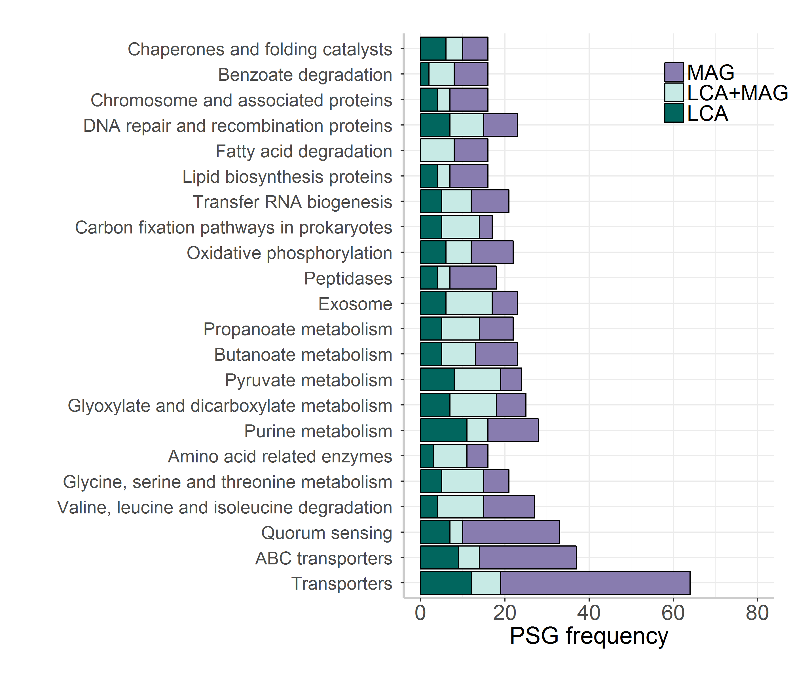
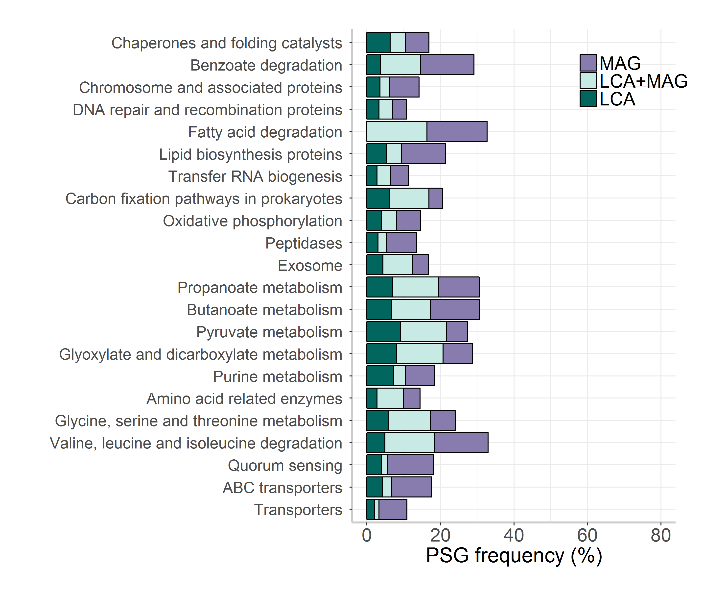
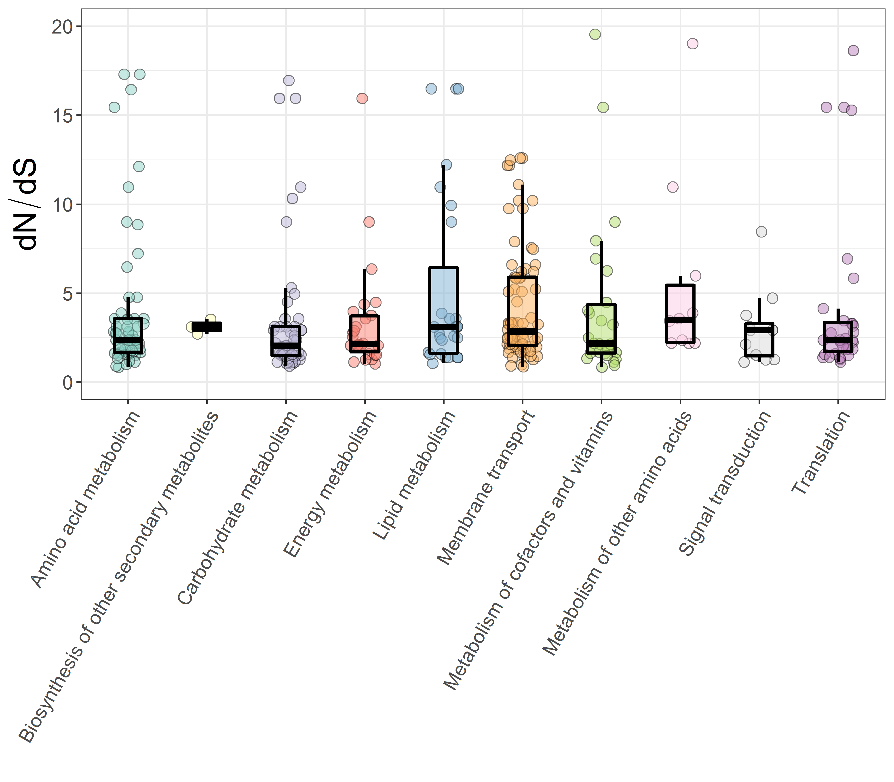

# Metagenomic analysis of secondary cooling water microbial communities
Ruben Props  
`r format(Sys.time(), '%d %B, %Y')`  


# A. 16S analysis
## Network analysis on relative abundances  

In the first analysis we utilize the raw counts. As such this network will be built using relative abundance data.

```r
# Set seed
set.seed(777)

# Import data
otus <- as.matrix(read.csv2("16S_data/OTU_table_raw.csv", fill = TRUE, header = TRUE,
                    row.names = 1))

taxa <- tax_table(as.matrix(read.csv2("16S_data/tax_table_raw.csv", fill = TRUE, header = TRUE,
                    row.names = 1))
)

phy_df <- phyloseq(otu_table(otus, taxa_are_rows = FALSE), taxa)

# filterobj <- filterTaxonMatrix(otus, minocc = 20,
#                               keepSum = TRUE, return.filtered.indices = TRUE)
# otus.f <- filterobj$mat
# taxa.f <- taxa[setdiff(1:nrow(taxa), filterobj$filtered.indices),]
# dummyTaxonomy <- colnames(tax_df); dummyTaxonomy[1] <- "Kingdom_dummy"
# taxa.f <- rbind(taxa.f, dummyTaxonomy)
# rownames(taxa.f)[nrow(taxa.f)] <- "0"
# rownames(otus.f)[nrow(otus.f)] <- "0"
# 
# # Next, we assemble a new phyloseq object with the filtered OTU and taxonomy tables.
# updatedotus <- otu_table(otus.f, taxa_are_rows = TRUE)
# updatedtaxa <- tax_table(taxa.f)
# phyloseqobj.f <- phyloseq(updatedotus, updatedtaxa)

# Prevalence filtering
phy_df_filtered <- filter_taxa(phy_df, function(x) sum(x > 30) > (0.25*length(x)), TRUE)

sp_easi <- spiec.easi(phy_df_filtered, method='mb', lambda.min.ratio=1e-2,
                           nlambda=20, icov.select.params=list(rep.num=50))
```

```
## Normalizing/clr transformation of data with pseudocount ...
```

```
## Inverse Covariance Estimation with mb ...
```

```
## Model selection with stars ...
```

```
## Done!
```

```r
ig.mb <- adj2igraph(sp_easi$refit,  vertex.attr = list(name=taxa_names(phy_df_filtered)))
vsize <- Biobase::rowMax(clr(otu_table(phy_df_filtered), 1))+15
Lineage_rel <- tax_table(phy_df_filtered)[,"Lineage"]
Lineage_rel <- factor(Lineage_rel, levels = unique(Lineage_rel))
vweights <- summary(symBeta(getOptBeta(sp_easi), mode='maxabs'))
MAGs <- c(); MAGs[taxa_names(phy_df_filtered)=="Otu00001"]  <- "Limnohabitans MAG"
MAGs[taxa_names(phy_df_filtered)=="Otu00002"]  <- "Bacteroidetes MAG1"
MAGs[taxa_names(phy_df_filtered)=="Otu00003"]  <- "Bacteroidetes MAG2"
MAGs[is.na(MAGs)] <-""

# png(file = "./Figures/Figures_network/NETWORK-REL-CX-C30-A25.png", width = 9, height = 9, res = 500, units = "in")
plot_network_custom(ig.mb, phy_df_filtered, type='taxa',
             line_weight = 2, hjust = 0.5,
             point_size = 0.1, alpha = 0.01, label_size = 3.95)+
  scale_fill_brewer(palette = "Paired")+
  scale_color_brewer(palette = "Paired")+
  geom_point(aes(size = vsize, fill = Lineage_rel), alpha = 0.5,
             colour="black", shape=21)+
  guides(size = FALSE,
    fill  = guide_legend(title = "Lineage", override.aes = list(size = 5),
                         nrow = 4),
    color = FALSE)+
  theme(legend.position="bottom", legend.text=element_text(size=12),
        text = element_text(size = 12),
        plot.margin = unit(c(1,1,1,1), "cm"))+
  scale_size(range = c(5, 15))+
  geom_label_repel(aes(label = MAGs), fontface = 'bold', color = 'black',
                   box.padding = 0.35, point.padding = 0.5,
                   segment.color = 'black',
                   size = 4,
                       # Width of the line segments.
                   segment.size = 1.5,
                   # Draw an arrow from the label to the data point.
                   arrow = arrow(length = unit(0.015, 'npc')),
                   nudge_x = -0.1,
                   nudge_y = 0.6
  )
```


```r
# dev.off()
```
## Network analysis on absolute abundances  

The second network will be built using absolute abundance data by multiplying the relative taxon abundances by the total cell density. The final obtained counts will expressed as nr. of cells measured in 50 µL samples. We also only consider the OTUs that were left after the prevalence filtering conducted in the network construction with relative abundance data.

```r
# Import cell count data
cell_counts <- read.csv("16S_data/cell_counts.csv")
cell_counts$sample_title <- as.factor(cell_counts$sample_title)
# Calculate proportions
phy_df_rel <- transform_sample_counts(phy_df, function(x) x/sum(x))

# Select samples for which corresponding counts are available
cell_counts <- cell_counts[cell_counts$sample_title %in% sample_names(phy_df_rel), ]
cell_counts <- droplevels(cell_counts)
phy_df_rel <- prune_samples(sample_names(phy_df_rel) %in% cell_counts$sample_title, phy_df_rel)

# Multiply with cell counts in 50 µL of sample
otu_table(phy_df_rel) <- otu_table(phy_df_rel) * cell_counts$Number_of_cells

# Select taxa that were selected based on prevalence in previous chunk
phy_df_abs <- prune_taxa(taxa_names(phy_df_filtered), phy_df_rel)

# Round absolute abundances to integers
otu_table(phy_df_abs) <- round(otu_table(phy_df_abs), 0)

# Construct network
sp_easi_abs <- spiec.easi(phy_df_abs, method='mb', lambda.min.ratio=1e-2,
                           nlambda=20, icov.select.params=list(rep.num=50))
```

```
## Normalizing/clr transformation of data with pseudocount ...
```

```
## Inverse Covariance Estimation with mb ...
```

```
## Model selection with stars ...
```

```
## Done!
```

```r
ig.mb_abs <- adj2igraph(sp_easi_abs$refit,  vertex.attr = list(name=taxa_names(phy_df_abs)))
vsize_abs <- Biobase::rowMax(clr(otu_table(phy_df_abs), 1))+15
Lineage_abs <- tax_table(phy_df_abs)[,"Lineage"]
Lineage_abs <- factor(Lineage_abs, levels = unique(Lineage_abs))
vweights_abs <- summary(symBeta(getOptBeta(sp_easi_abs), mode='maxabs'))
MAGs <- c(); MAGs[taxa_names(phy_df_abs)=="Otu00001"]  <- "Limnohabitans MAG"
MAGs[taxa_names(phy_df_abs)=="Otu00002"]  <- "Bacteroidetes MAG1"
MAGs[taxa_names(phy_df_abs)=="Otu00003"]  <- "Bacteroidetes MAG2"
MAGs[is.na(MAGs)] <-""

# Plot network inferred from absolute abundances
# png(file = "./Figures/Figures_network/NETWORK-ABS-CX-C30-A25.png", width = 9, height = 9, res = 500, units = "in")
plot_network_custom(ig.mb_abs, phy_df_abs, type='taxa',
             line_weight = 2, hjust = 0.5,
             point_size = 0.1, alpha = 0.01, label_size = 3.95)+
  scale_fill_brewer(palette = "Paired")+
  scale_color_brewer(palette = "Paired")+
  geom_point(aes(size = vsize_abs, fill = Lineage_abs), alpha = 0.5,
             colour="black", shape=21)+
  guides(size = FALSE,
    fill  = guide_legend(title = "Lineage", override.aes = list(size = 5),
                         nrow = 4),
    color = FALSE)+
  theme(legend.position="bottom", legend.text=element_text(size=12),
        text = element_text(size = 12),
        plot.margin = unit(c(1,1,1,1), "cm"))+
  scale_size(range = c(5, 15))+
  geom_label_repel(aes(label = MAGs), fontface = 'bold', color = 'black',
                   box.padding = 0.35, point.padding = 0.5,
                   segment.color = 'black',
                   size = 4,
                       # Width of the line segments.
                   segment.size = 1.5,
                   # Draw an arrow from the label to the data point.
                   arrow = arrow(length = unit(0.015, 'npc')),
                   nudge_x = -0.1,
                   nudge_y = 0.6
  )
```


```r
# dev.off()
```

# B. MetaG analysis

```r
# Read data
mean_coverage <- read.table("./SAMPLES-SUMMARY/bins_across_samples/mean_coverage.txt", header = TRUE)
std_coverage <- read.table("./SAMPLES-SUMMARY/bins_across_samples/std_coverage.txt", header = TRUE)
bin_size <- read.table("./SAMPLES-SUMMARY/general_bins_summary.txt", header = TRUE)[, c(1, 3, 6, 9)]
total_reads <- read.table("./sample_reads.tsv", header = TRUE)
read_length <- 300

# From wide to long format
mean_coverage_long <- gather(mean_coverage, Sample_ID, coverage, 
                             SAMPLE_16:SAMPLE_65, factor_key=TRUE)

std_coverage_long <- gather(std_coverage, Sample_ID, std_coverage, 
                            SAMPLE_16:SAMPLE_65, 
                            factor_key=TRUE)

coverage_data <- data.frame(mean_coverage_long, 
                            std_coverage = std_coverage_long[,3])

# Read and add metadata
# meta <- read.csv2("metadata.csv")
# meta$Sample_ID <- gsub(meta$Sample_ID, pattern = ".", replacement = "_", fixed = TRUE)
data_total <- left_join(coverage_data, total_reads, by = "Sample_ID")
data_total <- left_join(data_total, bin_size, by = "bins")
# data_total <- left_join(data_total, meta, by =  "Sample_ID")
data_total$bins <- plyr::revalue(data_total$bins, c("BetIa_bin"="Limnohabitans_bin", "bacIa_vizbin1"="Bacteroidetes_bin1",
                                              "bacIa_vizbin2"="Bacteroidetes_bin2"))
# Calculate relative abundance of the bins
data_total$mean_rel_abundance <- 100*(data_total$coverage*data_total$bin_size)/(read_length*data_total$Total_reads)
data_total$upper_rel_abundance <- 100*((data_total$coverage+data_total$std_coverage)*data_total$bin_size)/(read_length*data_total$Total_reads)
data_total$lower_rel_abundance <- 100*((data_total$coverage-data_total$std_coverage)*data_total$bin_size)/(read_length*data_total$Total_reads)

data_total$mean_rel_abundance_map <- 100*(data_total$coverage*data_total$bin_size)/(read_length*data_total$Mapped_reads)
data_total$upper_rel_abundance_map <- 100*((data_total$coverage+data_total$std_coverage)*data_total$bin_size)/(read_length*data_total$Mapped_reads)
data_total$lower_rel_abundance_map <- 100*((data_total$coverage-data_total$std_coverage)*data_total$bin_size)/(read_length*data_total$Mapped_reads)

# Add additional column that assigns PNCs to correct MAG
data_total$Genome_id <- factor(rep(c("Limnohabitans", "Limnohabitans", "Limnohabitans", "Bacteroidetes MAG2", "Bacteroidetes MAG1", "Bacteroidetes MAG2"), 4))

# Plot genome size for all three genomes
data_total[data_total$bins %in% c("Bacteroidetes_bin1",
                                "Bacteroidetes_bin2","Limnohabitans_bin"), ] %>% 
  ggplot(aes(x = bins, y = bin_size/(4*1e6), fill = Genome_id))+
  theme_bw()+
  geom_bar(width = 0.5, stat="identity", alpha = 0.7)+
  coord_flip()+
  scale_fill_manual(values = c(col_bac1, col_bac2, col_limno))+
  theme(axis.text.x = element_text(angle = 0, size = 16),
        axis.text.y = element_text(size = 16),
        axis.title.x = element_text(size = 18),
        legend.title = element_text("Genome bin"), legend.position = "top")+
  xlab("")+
  ylab("Genome size (Mbp)")+
  guides(fill = FALSE)+
  geom_hline(yintercept = 1, size = 2, linetype="dotted")
```


```r
# Plot irep for all 3 genomes
data_total[data_total$bins %in% c("Bacteroidetes_bin1",
                                "Bacteroidetes_bin2","Limnohabitans_bin"), ] %>% 
  ggplot(aes(x = bins, y = mean_irep/4, fill = Genome_id))+
  theme_bw()+
  geom_bar(width = 0.5, stat="identity", alpha = 0.7)+
  coord_flip()+
  scale_fill_manual(values = c(col_bac1, col_bac2, col_limno))+
  theme(axis.text.x = element_text(angle = 0, size = 16),
        axis.text.y = element_text(size = 16),
        axis.title.x = element_text(size = 18),
        legend.title = element_text(""), legend.position = "top")+
  xlab("")+
  ylab("Index of Replication (iRep)")+
  guides(fill = FALSE)+
  geom_hline(yintercept = 1.34, size = 2, linetype="dotted")
```


# 1. Phylogenetic tree
## Limnohabitans
  


## Bacteroidetes

# *2. Investigate MAG- and 16S-based abundances*
It is clear that there is significant %GC coverage bias present. The estimated relative abundances
from metagenomics do not quantitatively match with the V3-V4 16S rRNA gene amplicon data.
$$Relative\ abundance =100*(\frac{mean\ coverage * bin\ size}{read\ length*total\ sample\ reads })$$
Another option is to calculate relative to mapped number of reads:
$$Relative\ abundance =100*(\frac{mean\ coverage * bin\ size}{read\ length*total\ sample\ reads * \%mapped\ reads})$$


Import reference relative abundances from 16S data set in order to directly compare with metagenomic data set.

```r
df_16S <- read.table("relative_abundance_16S.tsv", header = TRUE)
df_16S_long <- gather(df_16S, Sample_ID, relative_abundance_16S, 
                             SAMPLE_16:SAMPLE_65, factor_key=TRUE)
```


```r
# Subset for only the three complete genomes (not PNCs).
data_total_sb <- data_total[data_total$bins %in% c("Limnohabitans_bin", "Bacteroidetes_bin1", "Bacteroidetes_bin2"),]

p_meta <- ggplot(data = data_total_sb, aes(x = bins, y = mean_rel_abundance, fill = bins))+
  geom_point(size = 4, shape = 21, alpha = 0.7)+
  scale_fill_manual(values = c(col_bac1, col_bac2, col_limno))+
  theme_bw()+
  geom_errorbar(aes(ymin=lower_rel_abundance, 
                    ymax=upper_rel_abundance, 
                    width=.1))+
  facet_grid(.~Sample_ID)+
  # ylim(0,1)+ 
  theme(axis.text=element_text(size=14), axis.title=element_text(size=20),
        title=element_text(size=20), legend.text=element_text(size=14),
        legend.background = element_rect(fill="transparent"),
        axis.text.x = element_text(angle = 45, hjust = 1),
        strip.text.x=element_text(size=18))+
  ylab("Mean relative abundance (%)")+
  ylim(-1,100)+
  ggtitle("Metagenomic - total reads")

# Corrected for mapped N° of reads
p_meta_mapped <- ggplot(data = data_total_sb, aes(x = bins, y = mean_rel_abundance_map, fill = bins))+
  geom_point(size = 4, shape = 21, alpha = 0.7)+
  scale_fill_manual(values = c(col_bac1, col_bac2, col_limno))+
  theme_bw()+
  geom_errorbar(aes(ymin=lower_rel_abundance_map, 
                    ymax=upper_rel_abundance_map, 
                    width=.1))+
  facet_grid(.~Sample_ID)+
  # ylim(0,1)+ 
  theme(axis.text=element_text(size=14), axis.title=element_text(size=20),
        title=element_text(size=20), legend.text=element_text(size=14),
        legend.background = element_rect(fill="transparent"),
        axis.text.x = element_text(angle = 45, hjust = 1),
        strip.text.x=element_text(size=18))+
  ylab("Mean relative abundance (%)")+
  ylim(-1,100)+
  ggtitle("Metagenomic - mapped reads")

p_16S <- ggplot(data = df_16S_long, aes(x = bins, y = relative_abundance_16S, fill = bins))+
  geom_point(size = 4, shape = 21, alpha = 0.7)+
  scale_fill_manual(values = c(col_bac1, col_bac2, col_limno))+
  theme_bw()+
  facet_grid(.~Sample_ID)+
  theme(axis.text=element_text(size=14), axis.title=element_text(size=20),
        title=element_text(size=20), legend.text=element_text(size=14),
        legend.background = element_rect(fill="transparent"),
        axis.text.x = element_text(angle = 45, hjust = 1),
        strip.text.x=element_text(size=18))+
  ylab("Mean relative abundance (%)")+
  ylim(-1,100)+
  ggtitle("V3-V4 16S")

grid_arrange_shared_legend(p_meta, p_meta_mapped, p_16S, ncol = 1, nrow = 3)
```


# *3. Investigate sequence characteristics within coding DNA sequences (CDS)*


```r
# First we need the files that map the gene ID to the sequence ID (linux cmd: https://github.com/rprops/MetaG_lakeMI/wiki/11.-Genome-annotation)
# These are stored in the IMG_annotation data for each genome bin

# Next, extract the %GC of each gene from the gff file
extract_gc_from_gff("./IMG_annotation/IMG_2724679690_Limnohabitans/121950.assembled.gff", outputFolder = "GC_analysis")
extract_gc_from_gff("./IMG_annotation/IMG_2724679691_Bacteroidetes_bin1/121951.assembled.gff", outputFolder = "GC_analysis")
extract_gc_from_gff("./IMG_annotation/IMG_2724679698_Bacteroidetes_bin2/121960.assembled.gff", outputFolder = "GC_analysis")

# Use these files to make dataframes mapping function (COGs/Pfams/KO) and %GC
LIMNO_gc_cog <- gc2function(seq_id_gc = "GC_analysis/seqid_GC_121950.assembled.gff.tsv", gene_id_seq_id ="./IMG_annotation/IMG_2724679690_Limnohabitans/Annotation/2724679690_gene_oid_2_seq_id.txt", 
                             functions = "./IMG_annotation/IMG_2724679690_Limnohabitans/Annotation/2724679690.cog.tab.txt", gc_thresh = 0.1, output = FALSE)
```

```
## Tue Oct 10 15:46:54 2017  --- There are 2830 genes with > 0.1 %
## Tue Oct 10 15:46:54 2017  --- This is 100 % of all genes
## Tue Oct 10 15:46:54 2017  --- The 10 genes with the highest GC% are:
##      function_id                                             function_name
## 2821     COG0405                              Gamma-glutamyltranspeptidase
## 2822     COG2755                  Lysophospholipase L1 or related esterase
## 2823     COG0642                      Signal transduction histidine kinase
## 2824     COG1514                                          2'-5' RNA ligase
## 2825     COG1767                Triphosphoribosyl-dephospho-CoA synthetase
## 2826     COG1261         Flagella basal body P-ring formation protein FlgA
## 2827     COG0665                Glycine/D-amino acid oxidase (deaminating)
## 2828     COG0810 Periplasmic protein TonB, links inner and outer membranes
## 2829     COG1040                 Predicted amidophosphoribosyltransferases
## 2830     COG1240                                 Mg-chelatase subunit ChlD
##        GC
## 2821 78.5
## 2822 78.5
## 2823 78.5
## 2824 78.5
## 2825 78.6
## 2826 78.6
## 2827 79.1
## 2828 79.5
## 2829 79.7
## 2830 80.6
```

```r
BAC1_gc_cog <- gc2function(seq_id_gc = "GC_analysis/seqid_GC_121951.assembled.gff.tsv", gene_id_seq_id ="./IMG_annotation/IMG_2724679691_Bacteroidetes_bin1/Annotation/2724679691_gene_oid_2_seq_id.txt", 
                             functions = "./IMG_annotation/IMG_2724679691_Bacteroidetes_bin1//Annotation/2724679691.cog.tab.txt", gc_thresh = 0.1, output = FALSE)
```

```
## Tue Oct 10 15:46:54 2017  --- There are 1889 genes with > 0.1 %
## Tue Oct 10 15:46:54 2017  --- This is 100 % of all genes
## Tue Oct 10 15:46:54 2017  --- The 10 genes with the highest GC% are:
##      function_id
## 1880     COG0052
## 1881     COG0183
## 1882     COG0629
## 1883     COG0509
## 1884     COG1734
## 1885     COG0636
## 1886     COG3502
## 1887     COG1765
## 1888     COG0377
## 1889     COG4104
##                                                                               function_name
## 1880                                                                   Ribosomal protein S2
## 1881                                                           Acetyl-CoA acetyltransferase
## 1882                                                    Single-stranded DNA-binding protein
## 1883                                    Glycine cleavage system H protein (lipoate-binding)
## 1884                                       RNA polymerase-binding transcription factor DksA
## 1885 FoF1-type ATP synthase, membrane subunit c/Archaeal/vacuolar-type H+-ATPase, subunit K
## 1886                                       Uncharacterized conserved protein, DUF952 family
## 1887                                                   Uncharacterized OsmC-related protein
## 1888 NADH:ubiquinone oxidoreductase 20 kD subunit (chhain B) or related Fe-S oxidoreductase
## 1889                 Zn-binding Pro-Ala-Ala-Arg (PAAR) domain, incolved in TypeVI secretion
##        GC
## 1880 51.6
## 1881 51.6
## 1882 52.0
## 1883 52.6
## 1884 52.7
## 1885 52.8
## 1886 52.9
## 1887 53.6
## 1888 53.6
## 1889 59.3
```

```r
BAC2_gc_cog <- gc2function(seq_id_gc = "GC_analysis/seqid_GC_121960.assembled.gff.tsv", gene_id_seq_id ="./IMG_annotation/IMG_2724679698_Bacteroidetes_bin2/Annotation/2724679698_gene_oid_2_seq_id.txt", 
                             functions = "./IMG_annotation/IMG_2724679698_Bacteroidetes_bin2/Annotation/2724679698.cog.tab.txt", gc_thresh = 0.1, output = FALSE)
```

```
## Tue Oct 10 15:46:54 2017  --- There are 1797 genes with > 0.1 %
## Tue Oct 10 15:46:54 2017  --- This is 100 % of all genes
## Tue Oct 10 15:46:54 2017  --- The 10 genes with the highest GC% are:
##      function_id
## 1788     COG4675
## 1789     COG0636
## 1790     COG1501
## 1791     COG0725
## 1792     COG5434
## 1793     COG2115
## 1794     COG4225
## 1795     COG3669
## 1796     COG4588
## 1797     COG3258
##                                                                               function_name
## 1788                                      Microcystin-dependent protein  (function unknown)
## 1789 FoF1-type ATP synthase, membrane subunit c/Archaeal/vacuolar-type H+-ATPase, subunit K
## 1790                                      Alpha-glucosidase, glycosyl hydrolase family GH31
## 1791                             ABC-type molybdate transport system, periplasmic component
## 1792                                                                      Polygalacturonase
## 1793                                                                       Xylose isomerase
## 1794                                                      Rhamnogalacturonyl hydrolase YesR
## 1795                                                                     Alpha-L-fucosidase
## 1796               Accessory colonization factor AcfC, contains ABC-type periplasmic domain
## 1797                                                                           Cytochrome c
##        GC
## 1788 44.5
## 1789 44.6
## 1790 44.9
## 1791 45.0
## 1792 45.1
## 1793 45.1
## 1794 45.4
## 1795 45.5
## 1796 46.6
## 1797 46.8
```

```r
LIMNO_gc_pfam <- gc2function(seq_id_gc = "GC_analysis/seqid_GC_121950.assembled.gff.tsv", gene_id_seq_id ="./IMG_annotation/IMG_2724679690_Limnohabitans/Annotation/2724679690_gene_oid_2_seq_id.txt", 
                             functions = "./IMG_annotation/IMG_2724679690_Limnohabitans/Annotation/2724679690.pfam.tab.txt", gc_thresh = 0.1, output = FALSE)
```

```
## Tue Oct 10 15:46:54 2017  --- There are 4954 genes with > 0.1 %
## Tue Oct 10 15:46:54 2017  --- This is 100 % of all genes
## Tue Oct 10 15:46:54 2017  --- The 10 genes with the highest GC% are:
##      function_id function_name   GC
## 4945   pfam13202     EF-hand_5 79.0
## 4946   pfam16537         T2SSB 79.0
## 4947   pfam01266           DAO 79.1
## 4948   pfam03544        TonB_C 79.5
## 4949   pfam00156  Pribosyltran 79.7
## 4950   pfam11142       DUF2917 79.8
## 4951   pfam13318       DUF4089 79.8
## 4952   pfam13519         VWA_2 80.6
## 4953   pfam02120      Flg_hook 80.9
## 4954   pfam03023          MVIN 81.7
```

```r
BAC1_gc_pfam <- gc2function(seq_id_gc = "GC_analysis/seqid_GC_121951.assembled.gff.tsv", gene_id_seq_id ="./IMG_annotation/IMG_2724679691_Bacteroidetes_bin1/Annotation/2724679691_gene_oid_2_seq_id.txt", 
                             functions = "./IMG_annotation/IMG_2724679691_Bacteroidetes_bin1//Annotation/2724679691.pfam.tab.txt", gc_thresh = 0.1, output = FALSE)
```

```
## Tue Oct 10 15:46:54 2017  --- There are 3929 genes with > 0.1 %
## Tue Oct 10 15:46:54 2017  --- This is 100 % of all genes
## Tue Oct 10 15:46:54 2017  --- The 10 genes with the highest GC% are:
##      function_id function_name   GC
## 3920   pfam02803    Thiolase_C 51.6
## 3921   pfam00436           SSB 52.0
## 3922   pfam00171        Aldedh 52.2
## 3923   pfam01597         GCV_H 52.6
## 3924   pfam01258  zf-dskA_traR 52.7
## 3925   pfam00137    ATP-synt_C 52.8
## 3926   pfam06108        DUF952 52.9
## 3927   pfam02566          OsmC 53.6
## 3928   pfam01058   Oxidored_q6 53.6
## 3929   pfam05488    PAAR_motif 59.3
```

```r
BAC2_gc_pfam <- gc2function(seq_id_gc = "GC_analysis/seqid_GC_121960.assembled.gff.tsv", gene_id_seq_id ="./IMG_annotation/IMG_2724679698_Bacteroidetes_bin2/Annotation/2724679698_gene_oid_2_seq_id.txt", 
                             functions = "./IMG_annotation/IMG_2724679698_Bacteroidetes_bin2/Annotation/2724679698.pfam.tab.txt", gc_thresh = 0.1, output = FALSE)
```

```
## Tue Oct 10 15:46:54 2017  --- There are 3573 genes with > 0.1 %
## Tue Oct 10 15:46:54 2017  --- This is 100 % of all genes
## Tue Oct 10 15:46:54 2017  --- The 10 genes with the highest GC% are:
##      function_id   function_name   GC
## 3564   pfam13531      SBP_bac_11 46.6
## 3565   pfam13442 Cytochrome_CBB3 46.8
## 3566   pfam12779          YXWGXW 50.0
## 3567   pfam12779          YXWGXW 50.0
## 3568   pfam01391        Collagen 50.4
## 3569   pfam01391        Collagen 50.4
## 3570   pfam01391        Collagen 50.4
## 3571   pfam01391        Collagen 50.4
## 3572   pfam01391        Collagen 50.4
## 3573   pfam01391        Collagen 50.4
```

```r
LIMNO_gc_KO <- gc2function(seq_id_gc = "GC_analysis/seqid_GC_121950.assembled.gff.tsv", gene_id_seq_id ="./IMG_annotation/IMG_2724679690_Limnohabitans/Annotation/2724679690_gene_oid_2_seq_id.txt", 
                             functions = "./IMG_annotation/IMG_2724679690_Limnohabitans/Annotation/2724679690.ko.tab.txt", gc_thresh = 0.1, output = FALSE)
```

```
## Tue Oct 10 15:46:54 2017  --- There are 2164 genes with > 0.1 %
## Tue Oct 10 15:46:54 2017  --- This is 100 % of all genes
## Tue Oct 10 15:46:54 2017  --- The 10 genes with the highest GC% are:
##                                                                                         function_id
## 2155                  two-component system, OmpR family, sensor histidine kinase QseC [EC:2.7.13.3]
## 2156                                                                  2'-5' RNA ligase [EC:6.5.1.-]
## 2157                                         triphosphoribosyl-dephospho-CoA synthase [EC:2.4.2.52]
## 2158                                              flagella basal body P-ring formation protein FlgA
## 2159                                                            general secretion pathway protein B
## 2160 tRNA 5-methylaminomethyl-2-thiouridine biosynthesis bifunctional protein [EC:2.1.1.61 1.5.-.-]
## 2161 tRNA 5-methylaminomethyl-2-thiouridine biosynthesis bifunctional protein [EC:2.1.1.61 1.5.-.-]
## 2162                                                4'-phosphopantetheinyl transferase [EC:2.7.8.-]
## 2163                                                     magnesium chelatase subunit D [EC:6.6.1.1]
## 2164                                                     flagellar hook-length control protein FliK
##      function_name   GC
## 2155   EC:2.7.13.3 78.5
## 2156    EC:6.5.1.- 78.5
## 2157   EC:2.4.2.52 78.6
## 2158               78.6
## 2159               79.0
## 2160      EC:1.5.- 79.1
## 2161   EC:2.1.1.61 79.1
## 2162    EC:2.7.8.- 79.1
## 2163    EC:6.6.1.1 80.6
## 2164               80.9
```

```r
BAC1_gc_KO <- gc2function(seq_id_gc = "GC_analysis/seqid_GC_121951.assembled.gff.tsv", gene_id_seq_id ="./IMG_annotation/IMG_2724679691_Bacteroidetes_bin1/Annotation/2724679691_gene_oid_2_seq_id.txt", 
                             functions = "./IMG_annotation/IMG_2724679691_Bacteroidetes_bin1//Annotation/2724679691.ko.tab.txt", gc_thresh = 0.1, output = FALSE)
```

```
## Tue Oct 10 15:46:54 2017  --- There are 1384 genes with > 0.1 %
## Tue Oct 10 15:46:54 2017  --- This is 100 % of all genes
## Tue Oct 10 15:46:54 2017  --- The 10 genes with the highest GC% are:
##                                             function_id function_name   GC
## 1375                  single-strand DNA-binding protein               51.3
## 1376                    threonine aldolase [EC:4.1.2.5]    EC:4.1.2.5 51.3
## 1377                large subunit ribosomal protein L32               51.3
## 1378                            uncharacterized protein               51.5
## 1379                 translation initiation factor IF-2               51.5
## 1380                 small subunit ribosomal protein S2               51.6
## 1381                  single-strand DNA-binding protein               52.0
## 1382                  glycine cleavage system H protein               52.6
## 1383            F-type H+-transporting ATPase subunit c               52.8
## 1384 NADH-quinone oxidoreductase subunit B [EC:1.6.5.3]    EC:1.6.5.3 53.6
```

```r
BAC2_gc_KO <- gc2function(seq_id_gc = "GC_analysis/seqid_GC_121960.assembled.gff.tsv", gene_id_seq_id ="./IMG_annotation/IMG_2724679698_Bacteroidetes_bin2/Annotation/2724679698_gene_oid_2_seq_id.txt", 
                             functions = "./IMG_annotation/IMG_2724679698_Bacteroidetes_bin2/Annotation/2724679698.ko.tab.txt", gc_thresh = 0.1, output = FALSE)
```

```
## Tue Oct 10 15:46:54 2017  --- There are 1342 genes with > 0.1 %
## Tue Oct 10 15:46:54 2017  --- This is 100 % of all genes
## Tue Oct 10 15:46:54 2017  --- The 10 genes with the highest GC% are:
##                                             function_id function_name   GC
## 1333                            uncharacterized protein               43.9
## 1334 NADH-quinone oxidoreductase subunit B [EC:1.6.5.3]    EC:1.6.5.3 44.3
## 1335            F-type H+-transporting ATPase subunit c               44.6
## 1336      alpha-D-xyloside xylohydrolase [EC:3.2.1.177]  EC:3.2.1.177 44.9
## 1337                      xylose isomerase [EC:5.3.1.5]    EC:5.3.1.5 45.1
## 1338                   alpha-L-fucosidase [EC:3.2.1.51]   EC:3.2.1.51 45.4
## 1339                            uncharacterized protein               45.5
## 1340                            uncharacterized protein               45.8
## 1341                 accessory colonization factor AcfC               46.6
## 1342             thiosulfate dehydrogenase [EC:1.8.2.2]    EC:1.8.2.2 46.8
```

Motivation: For COGs there exists a hierarchy allowing us to investigate whether there is a conservation of high/low %GC in certain functional gene groups. In order to do this we need to incorporate this hierarchy into the genome dataframes we have now.  


# *4. Analysis of gene length distribution*
Here we use the dataframe made in the previous section to see if there is a significant difference in the gene length of the COGs within these three consensus genomes.  

Observation: They have very small genes: on average < 500bp.


```r
# Limnohabitans MAG gene length distribution 
p_LIMNO_length <- easyGgplot2::ggplot2.histogram(data = LIMNO_gc_cog, xName = 'gene_length',
                  groupName = 'Genome', alpha = 0.5,
                  legendPosition = "top", binwidth = 0.15,
                  groupColors = col_limno,addMeanLine=TRUE, meanLineColor="black",
                  meanLineType="dashed")+ theme_bw()+ ylim(0,15)+
  labs(x = "Gene length (bp)", y = "Count")+ theme(legend.position="none")+
  ggtitle("Limnohabitans MAG")+ xlim(0,2000)

# Bacteroidetes MAG1 gene length distribution 
p_BAC1_length <- easyGgplot2::ggplot2.histogram(data = BAC1_gc_cog, xName = 'gene_length',
                  groupName = 'Genome', alpha = 0.5,
                  legendPosition = "top", binwidth = 0.15, 
                  groupColors = col_bac1,addMeanLine=TRUE, meanLineColor="black",
                  meanLineType="dashed")+ theme_bw()+ ylim(0,15)+
  labs(x = "Gene length (bp)", y = "Count")+ theme(legend.position="none")+
  ggtitle("Bacteroidetes MAG1")+ xlim(0,2000)

# Bacteroidetes MAG2 gene length distribution 
p_BAC2_length <- easyGgplot2::ggplot2.histogram(data = BAC2_gc_cog, xName = 'gene_length',
                  groupName = 'Genome', alpha = 0.5,
                  legendPosition = "top", binwidth = 0.15,
                  groupColors = col_bac2,addMeanLine=TRUE, meanLineColor="black",
                  meanLineType="dashed")+ theme_bw()+ ylim(0,15)+
  labs(x = "Gene length (bp)", y = "Count")+ theme(legend.position="none")+
  ggtitle("Bacteroidetes MAG2")+ xlim(0,2000)

grid.arrange(p_LIMNO_length, p_BAC1_length, p_BAC2_length, ncol = 3)
```


We can do the same for the Pfams.

```r
# Limnohabitans MAG gene length distribution 
p_LIMNO_length <- easyGgplot2::ggplot2.histogram(data = LIMNO_gc_pfam, xName = 'gene_length',
                  groupName = 'Genome', alpha = 0.5,
                  legendPosition = "top", binwidth = 0.15,
                  groupColors = col_limno,addMeanLine=TRUE, meanLineColor="black",
                  meanLineType="dashed")+ theme_bw()+ ylim(0,25)+
  labs(x = "Gene length (bp)", y = "Count")+ theme(legend.position="none")+
  ggtitle("Limnohabitans MAG")+ xlim(0,3000)

# Bacteroidetes MAG1 gene length distribution 
p_BAC1_length <- easyGgplot2::ggplot2.histogram(data = BAC1_gc_pfam, xName = 'gene_length',
                  groupName = 'Genome', alpha = 0.5,
                  legendPosition = "top", binwidth = 0.15, 
                  groupColors = col_bac1,addMeanLine=TRUE, meanLineColor="black",
                  meanLineType="dashed")+ theme_bw()+ ylim(0,25)+
  labs(x = "Gene length (bp)", y = "Count")+ theme(legend.position="none")+
  ggtitle("Bacteroidetes MAG1")+ xlim(0,3000)

# Bacteroidetes MAG2 gene length distribution 
p_BAC2_length <- easyGgplot2::ggplot2.histogram(data = BAC2_gc_pfam, xName = 'gene_length',
                  groupName = 'Genome', alpha = 0.5,
                  legendPosition = "top", binwidth = 0.15,
                  groupColors = col_bac2,addMeanLine=TRUE, meanLineColor="black",
                  meanLineType="dashed")+ theme_bw()+ ylim(0,25)+
  labs(x = "Gene length (bp)", y = "Count")+ theme(legend.position="none")+
  ggtitle("Bacteroidetes MAG2")+ xlim(0,3000)

grid.arrange(p_LIMNO_length, p_BAC1_length, p_BAC2_length, ncol = 3)
```


# 5. Identify unique functional genes (COG/Pfams)

```r
# Find unique functions in Limnohabitans MAG vs Bacteroidetes MAG1
unique_LIMNO_BAC1 <- dplyr::anti_join(LIMNO_gc_cog, BAC1_gc_cog, by = "cog_id")
cat("There are", paste(nrow(unique_LIMNO_BAC1)), "unique COGs in Limnohabitans MAG vs Bacteroidetes MAG1")
```

```
## There are 1178 unique COGs in Limnohabitans MAG vs Bacteroidetes MAG1
```

```r
# Find unique functions in Limnohabitans MAG vs Bacteroidetes MAG2
unique_LIMNO_BAC2 <- dplyr::anti_join(LIMNO_gc_cog, BAC2_gc_cog, by = "cog_id")
cat("There are", paste(nrow(unique_LIMNO_BAC2)), "unique COGs in Limnohabitans MAG vs Bacteroidetes MAG2")
```

```
## There are 1143 unique COGs in Limnohabitans MAG vs Bacteroidetes MAG2
```

```r
# Find unique functions in Bacteroidetes MAG1 vs Bacteroidetes MAG2
unique_BAC1_BAC2 <- dplyr::anti_join(BAC1_gc_cog, BAC2_gc_cog, by = "cog_id")
cat("There are", paste(nrow(unique_BAC1_BAC2)), "unique COGs in Bacteroidetes MAG1 vs Bacteroidetes MAG2")
```

```
## There are 153 unique COGs in Bacteroidetes MAG1 vs Bacteroidetes MAG2
```

```r
# Find unique functions in Bacteroidetes MAG1 vs Bacteroidetes MAG2
unique_BAC2_BAC1 <- dplyr::anti_join(BAC2_gc_cog, BAC1_gc_cog, by = "cog_id")
cat("There are", paste(nrow(unique_BAC2_BAC1)), "unique COGs in Bacteroidetes MAG2 vs Bacteroidetes MAG1")
```

```
## There are 143 unique COGs in Bacteroidetes MAG2 vs Bacteroidetes MAG1
```


```r
# Find unique functions in Limnohabitans MAG vs Bacteroidetes MAG1
unique_pfam_LIMNO_BAC1 <- dplyr::anti_join(LIMNO_gc_pfam, BAC1_gc_pfam, by = "pfam_id")
cat("There are", paste(nrow(unique_pfam_LIMNO_BAC1)), "unique Pfams in Limnohabitans MAG vs Bacteroidetes MAG1")
```

```
## There are 1474 unique Pfams in Limnohabitans MAG vs Bacteroidetes MAG1
```

```r
# Find unique functions in Limnohabitans MAG vs Bacteroidetes MAG2
unique_pfam_LIMNO_BAC2 <- dplyr::anti_join(LIMNO_gc_pfam, BAC2_gc_pfam, by = "pfam_id")
cat("There are", paste(nrow(unique_pfam_LIMNO_BAC2)), "unique Pfams in Limnohabitans MAG vs Bacteroidetes MAG2")
```

```
## There are 1424 unique Pfams in Limnohabitans MAG vs Bacteroidetes MAG2
```

```r
# Find unique functions in Bacteroidetes MAG1 vs Bacteroidetes MAG2
unique_pfam_BAC1_BAC2 <- dplyr::anti_join(BAC1_gc_pfam, BAC2_gc_pfam, by = "pfam_id")
cat("There are", paste(nrow(unique_pfam_BAC1_BAC2)), "unique Pfams in Bacteroidetes MAG1 vs Bacteroidetes MAG2")
```

```
## There are 285 unique Pfams in Bacteroidetes MAG1 vs Bacteroidetes MAG2
```

```r
# Find unique functions in Bacteroidetes MAG1 vs Bacteroidetes MAG2
unique_pfam_BAC2_BAC1 <- dplyr::anti_join(BAC2_gc_pfam, BAC1_gc_pfam, by = "pfam_id")
cat("There are", paste(nrow(unique_pfam_BAC2_BAC1)), "unique Pfams in Bacteroidetes MAG2 vs Bacteroidetes MAG1")
```

```
## There are 233 unique Pfams in Bacteroidetes MAG2 vs Bacteroidetes MAG1
```


# 6. COG functional categories
Get COG ID to COG functional category mapping file here: ftp://ftp.ncbi.nih.gov/pub/wolf/COGs/COG0303/cogs.csv    

The exact statistical analysis to compare genomes based on these profiles should be performed in STAMP.


```r
# Import COG mapping file
cogid_2_cogcat <- read.csv("./Mapping_files/cogid_2_cogcat.csv", sep = ",", header = FALSE, fill = TRUE,col.names = c("COG_ID", "COG_class", "function"))[, 1:2]
cogid_2_cogcat <- cogid_2_cogcat[(cogid_2_cogcat$COG_class)!="", ]
cogid_2_cogcat <- droplevels(cogid_2_cogcat)

# Read COG category file
cog_categories <- read.table("./Mapping_files/cog_categories.tsv", header = TRUE, sep = "\t")

# Merge COG metadata
cog_meta <- dplyr::left_join(cog_categories, cogid_2_cogcat, by = c("COG_class" = "COG_class"))
cog_meta <- droplevels(cog_meta)

# Merge genome information of all genome bins
merged_gc_cog <- rbind(LIMNO_gc_cog, BAC1_gc_cog, BAC2_gc_cog)
merged_gc_cog <- data.frame(merged_gc_cog, genome_id = c(rep("Limnohabitans MAG", nrow(LIMNO_gc_cog)), 
                                             rep("Bacteroidetes MAG1", nrow(BAC1_gc_cog)),
                                             rep("Bacteroidetes MAG2", nrow(BAC2_gc_cog)))
                            )

# Merge this metadata with the genome data from before
# COGs with multiple classifications are currently still NA - work on this.
merged_gc_cog <- dplyr::left_join(merged_gc_cog, cog_meta, by = c("cog_id" = "COG_ID"))
merged_gc_cog <- merged_gc_cog[!is.na(merged_gc_cog$COG_functional_category),]

# Visualize distribution across major metabolism functional COG groups per genome.
p_cog_func_group <- ggplot(data = merged_gc_cog, 
                           aes(x=COG_functional_category, fill = COG_functional_cluster))+
  geom_bar(stat="count", width=0.7, color = "black", size = 0.75)+
  theme_bw()+
  facet_grid(genome_id~.)+
  scale_fill_brewer(palette = "Accent")+
  labs(x = "Gene length (bp)", y = "Count")+ 
  theme(legend.position="bottom", axis.text.x = element_text(angle = 90, hjust = 1),
                                                   legend.text = element_text(size = 5))+
  guides(fill=guide_legend(nrow=2,byrow=TRUE))

print(p_cog_func_group)
```


```r
p_cog_func_clust <- ggplot(data = merged_gc_cog, 
                           aes(x=COG_functional_cluster, fill = COG_functional_cluster))+
  geom_bar(stat="count", width=0.7, color = "black", size = 0.75)+
  theme_bw()+
  facet_grid(genome_id~.)+
  scale_fill_brewer(palette = "Accent")+
  labs(x = "Gene length (bp)", y = "Count")+ 
  theme(legend.position="bottom",axis.text.x = element_text(angle = 90, hjust = 1),
                                                   legend.text = element_text(size = 5))+
  guides(fill=guide_legend(nrow=2,byrow=TRUE))

print(p_cog_func_clust)
```


# 7. KO pathways

* Get reference file that maps KO ids to pathways here: http://www.genome.jp/kegg-bin/get_htext?ko00001.keg (download htext).


```r
# Import data
ko_path_df <- read.table("./Mapping_files/ko00001.keg", header = FALSE, sep = ";",
                      skip = 8, quote = "", fill = TRUE, 
                      col.names = c("Level", "KO", "Function_abbrev", "Function_spec"))
ko_path_df <- ko_path_df[1:(nrow(ko_path_df)-1), ] # remove tailing "!" at the end of file

# Remove empty rows
ko_path_df <- ko_path_df[!ko_path_df$KO == "", ]

# Extract pathways from dataframe and add them as new factor column
# pathw_hier <- data.frame(Level = ko_path_df$Level[ko_path_df$Level %in% c("A","B","C")], 
#                     Name = ko_path_df$KO[ko_path_df$Level %in% c("A","B","C")]
#                     )
# pathw_hier$Name <- as.character(pathw_hier$Name)
ko_path_df <- data.frame(ko_path_df, level_A = "A", level_B = "B", level_C = "C",
                         stringsAsFactors = FALSE)
ko_path_df$KO <- as.character(ko_path_df$KO)

# Get positions where to replicate higher hierarichcal level
pos_A <- c(c(1:nrow(ko_path_df))[ko_path_df$Level %in% "A"], nrow(ko_path_df)+1)
pos_B <- c(c(1:nrow(ko_path_df))[ko_path_df$Level %in% "B"], nrow(ko_path_df)+1)
pos_C <- c(c(1:nrow(ko_path_df))[ko_path_df$Level %in% "C"], nrow(ko_path_df)+1)


for(i in 1:(length(pos_A)-1)){
  ko_path_df$level_A[pos_A[i]:(pos_A[i+1]-1)] <- ko_path_df$KO[pos_A[i]]
}

for(i in 1:(length(pos_B)-1)){
  ko_path_df$level_B[pos_B[i]:(pos_B[i+1]-1)] <- ko_path_df$KO[pos_B[i]]
}

for(i in 1:(length(pos_C)-1)){
  ko_path_df$level_C[pos_C[i]:(pos_C[i+1]-1)] <- ko_path_df$KO[pos_C[i]]
}

# Remove all rows with level A, B, C - and level column
ko_path_df <- ko_path_df[!ko_path_df$Level %in% c("A", "B", "C"), ]
ko_path_df$level_A <- gsub(ko_path_df$level_A, pattern = "<b>|</b>", replacement = "")
ko_path_df$level_B <- gsub(ko_path_df$level_B, pattern = "<b>|</b>", replacement = "")
ko_path_df <- ko_path_df[, -1]

# Annotate merged ko file
merged_gc_ko <- rbind(LIMNO_gc_KO, BAC1_gc_KO, BAC2_gc_KO)
merged_gc_ko <- data.frame(merged_gc_ko, 
                           genome_id = c(rep("Limnohabitans MAG", nrow(LIMNO_gc_KO)),
                                         rep("Bacteroidetes MAG1", nrow(BAC1_gc_KO)),
                                         rep("Bacteroidetes MAG2", nrow(BAC2_gc_KO)))
                            )
merged_gc_ko$ko_id <- gsub(merged_gc_ko$ko_id, pattern = "KO:", replacement = "")
merged_gc_ko <- dplyr::left_join(merged_gc_ko, ko_path_df[, c(1, 4:6)], by = c("ko_id" = "KO"))

# Fill up NA slots with "Unknown" pathway
merged_gc_ko$level_A[is.na(merged_gc_ko$level_A)] <- "Unknown"
merged_gc_ko$level_B[is.na(merged_gc_ko$level_B)] <- "Unknown"
merged_gc_ko$level_C[is.na(merged_gc_ko$level_C)] <- "Unknown"
```

# 8.  Synonymous Codon Usage Bias analysis using CodonO

* Get CodonO for linux here: http://sysbio.cvm.msstate.edu/software/CodonO/download

* Run `CU.linux input.genes.fna`  
* Output from CodonO:  
  inputfile.ok  ---- the SCUO units for each input sequence based on its order  
	inputfile.fik ---- the composition ratio of the i-th amino acid in the k-th sequence  
	inputfile.hijk ---- the frequency of the j-th degenerate codon for amino acid i in each sequence  

* This output was not sufficient to perform any analysis. Therefore I used the web browser to calculate the synonymous codon bias in the genes of the three genomes.

** Codon bias is proportional to mRNA production! (Wan et al 2004)  

** However, strong correlation between SCUO and %GC has been reported, thereby
confounding possible "biological" effects.. Beware..


```r
# Import and format data for Limnohabitans MAG
SCUO_LIMNO <- read.table("./IMG_annotation/IMG_2724679690_Limnohabitans/Annotation/2724679690.genes.fna.codonO.output",
                         sep = ",", blank.lines.skip = TRUE, allowEscapes = FALSE, skipNul = TRUE
                         )
SCUO_LIMNO$V1 <- gsub(SCUO_LIMNO$V1, pattern = "\t", replacement = "")
Gene_LIMNO <- do.call(rbind, strsplit(SCUO_LIMNO$V1[grep("Ga0*", SCUO_LIMNO$V1)], " "))[,2]
SCUO_LIMNO$V1 <- gsub(SCUO_LIMNO$V1, pattern = " ", replacement = "")
SCUO_LIMNO <- data.frame(GC = SCUO_LIMNO$V1[grep(x = SCUO_LIMNO$V1, pattern = "GC*.*=")], 
                         SCUO = rep(SCUO_LIMNO$V1[grep(x = SCUO_LIMNO$V1, pattern = "SCUO*")], each = 4),
                         Gene = rep(Gene_LIMNO, each = 4)
)
SCUO_LIMNO$GC <- as.numeric(gsub(SCUO_LIMNO$GC, pattern = ".*=", replacement = ""))
SCUO_LIMNO$SCUO <- as.numeric(gsub(SCUO_LIMNO$SCUO, pattern = ".*=", replacement = ""))

# Import and format data for Bacteroidetes MAG1
SCUO_BAC1 <- read.table("./IMG_annotation/IMG_2724679691_Bacteroidetes_bin1/Annotation/2724679691.genes.fna.codonO.output",
                         sep = ",", blank.lines.skip = TRUE, allowEscapes = FALSE, skipNul = TRUE)
SCUO_BAC1$V1 <- gsub(SCUO_BAC1$V1, pattern = "\t", replacement = "")
Gene_BAC1 <- do.call(rbind, strsplit(SCUO_BAC1$V1[grep("Ga0*", SCUO_BAC1$V1)], " "))[,2]
SCUO_BAC1$V1 <- gsub(SCUO_BAC1$V1, pattern = " ", replacement = "")
SCUO_BAC1 <- data.frame(GC = SCUO_BAC1$V1[grep(x = SCUO_BAC1$V1, pattern = "GC*.*=")], 
                         SCUO = rep(SCUO_BAC1$V1[grep(x = SCUO_BAC1$V1, pattern = "SCUO*")], each = 4),
                         Gene = rep(Gene_BAC1, each = 4)
)
SCUO_BAC1$GC <- as.numeric(gsub(SCUO_BAC1$GC, pattern = ".*=", replacement = ""))
SCUO_BAC1$SCUO <- as.numeric(gsub(SCUO_BAC1$SCUO, pattern = ".*=", replacement = ""))


# Import and format data for Bacteroidetes MAG2
SCUO_BAC2 <- read.table("./IMG_annotation/IMG_2724679698_Bacteroidetes_bin2/Annotation/2724679698.genes.fna.codonO.output",
                         sep = ",", blank.lines.skip = TRUE, allowEscapes = FALSE, skipNul = TRUE)
SCUO_BAC2$V1 <- gsub(SCUO_BAC2$V1, pattern = "\t", replacement = "")
Gene_BAC2 <- do.call(rbind, strsplit(SCUO_BAC2$V1[grep("Ga0*", SCUO_BAC2$V1)], " "))[,2]
SCUO_BAC2$V1 <- gsub(SCUO_BAC2$V1, pattern = " ", replacement = "")
SCUO_BAC2 <- data.frame(GC = SCUO_BAC2$V1[grep(x = SCUO_BAC2$V1, pattern = "GC*.*=")], 
                         SCUO = rep(SCUO_BAC2$V1[grep(x = SCUO_BAC2$V1, pattern = "SCUO*")], each = 4),
                         Gene = rep(Gene_BAC2, each = 4)
)
SCUO_BAC2$GC <- as.numeric(gsub(SCUO_BAC2$GC, pattern = ".*=", replacement = ""))
SCUO_BAC2$SCUO <- as.numeric(gsub(SCUO_BAC2$SCUO, pattern = ".*=", replacement = ""))

# Merge data to one dataframe
SCUO_merged_gen <- data.frame(rbind(SCUO_LIMNO, SCUO_BAC1, SCUO_BAC2),
           Genome_ID = c(rep("Limnohabitans MAG", nrow(SCUO_LIMNO)), rep("Bacteroidetes MAG1", nrow(SCUO_BAC1)), 
           rep("Bacteroidetes MAG2", nrow(SCUO_BAC2))),
            GCx = rep(c("GC_mean", "GC1", "GC2", "GC3"), 
                     (nrow(SCUO_LIMNO) + nrow(SCUO_BAC1) + nrow(SCUO_BAC2))/4
            )
)

# Merge codon bias data with KO pathway annotation
SCUO_merged <- dplyr::left_join(SCUO_merged_gen, merged_gc_ko[, c(1:2,4 ,14:21)], by = c("Gene" = "contig_geneID"))
          
# Visualize differences in codon bias
p_SCUO.1 <- ggplot(data = SCUO_merged, aes (x = 100*GC, y = SCUO, fill = Genome_ID))+
  geom_point(size = 4, shape = 21, alpha = 0.7)+
  scale_fill_manual(values = c(col_bac1, col_bac2, col_limno))+
  theme_bw()+
  facet_wrap(~GCx, ncol = 2)+
  theme(axis.text=element_text(size=14), axis.title=element_text(size=20),
        title=element_text(size=20), legend.text=element_text(size=14),
        legend.background = element_rect(fill="transparent"),
        axis.text.x = element_text(angle = 0, hjust = 1),
        strip.text.x=element_text(size=18))+
  ylab("SCUO")+
  xlab("%GC")+
  ylim(0,1)

print(p_SCUO.1)
```


```r
# Subset to genes for which ko annotation is available
SCUO_merged_sb <- SCUO_merged[!is.na(SCUO_merged$level_A), ]
SCUO_merged_sb <- SCUO_merged_sb[SCUO_merged_sb$GCx == "GC_mean", ]
# Look at pathways enriched in high %GC
# SCUO_merged_sb[]


SCUO_merged_gen_gcmean <- SCUO_merged_gen %>% dplyr::filter(GCx == "GC_mean")

p_SCUO.2 <- ggplot(data = SCUO_merged_gen_gcmean, aes (x = Genome_ID, y = SCUO))+
  geom_jitter(size = 3, alpha = 0.3, shape = 21, aes(fill = Genome_ID))+
  geom_boxplot(alpha=0, size =1.5, color = "darkorange")+
  # scale_fill_brewer(palette = "Accent")+
  scale_fill_manual(values = c(col_bac1, col_bac2, col_limno))+
  theme_bw()+
  # facet_wrap(Genome_ID~GCx)+
  theme(axis.text=element_text(size=14), axis.title=element_text(size=20),
        title=element_text(size=20), legend.text=element_text(size=14),
        legend.background = element_rect(fill="transparent"),
        axis.text.x = element_text(angle = 45, hjust = 1),
        strip.text.x=element_text(size=18))+
  ylab("Codon bias - SCUO")+
  xlab("")+
  ylim(0,1)+ 
  guides(fill=FALSE)+ 
  scale_x_discrete(labels=c("Bacteroidetes MAG1" = paste("Bacteroidetes MAG1 (n=",table(SCUO_merged_gen_gcmean$Genome_ID)[1],")", sep = ""),
                            "Bacteroidetes MAG2" = paste("Bacteroidetes MAG2 (n=",table(SCUO_merged_gen_gcmean$Genome_ID)[2],")", sep = ""),
                            "Limnohabitans MAG" = paste("Limnohabitans MAG (n=",table(SCUO_merged_gen_gcmean$Genome_ID)[3],")", sep = ""))
  )
# 
print(p_SCUO.2)
```


```r
tmp <- SCUO_merged_sb$genome_id
tmp2 <- cbind(SCUO_merged_sb$ko_id, 
      c(rep(col_limno, table(tmp)[3]), rep(col_bac1, table(tmp)[1]), rep(col_bac2, table(tmp)[2]))
)

write.table(tmp2, file = "All_KO.tsv", quote = FALSE,
            col.names = FALSE, row.names = FALSE)
```

# 9.  PosiGene analysis for identifying genes under positive selection in the Limnohabitans MAG

Phylogenetic tree used in PosiGene analysis. Red branch indicates the genome for which PSG were tested.
 


```r
# Import results_short file
data_posi <- read.table("./posigene_analysis/result_tables/Limnohabitans_MAG_results_short.tsv", header = TRUE, fill = TRUE)
data_posi$Gene <- as.character(data_posi$Gene)

# Import mapping file to link gene IDs from PosiGene to 
# those used by the IMG annotation (both are in headers from .genes.fna)
map_posi <- read.table("./Mapping_files/posiG_mapping.tsv")
colnames(map_posi) <- c("posi_geneID", "IMG_geneID")
map_posi$posi_geneID <- as.character(map_posi$posi_geneID)

# Filter out the genes that are under positive selection
# Taking threshold of adjusted p.value of 0.05 and FDR < 0.05
data_posi <- data_posi %>% filter(P.Value < 0.05 & 
                                    FDR < 0.05)
# Report summary
cat(paste("There are ", nrow(data_posi), " genes under positive selection in this MAG (P<0.05). This is ",round(100*nrow(data_posi)/nrow(map_posi),1), "% of all genes",  sep = "")
)
```

```
## There are 292 genes under positive selection in this MAG (P<0.05). This is 7.6% of all genes
```

```r
# Merge this data with the functional annotation (e.g. KO) of these genes
data_posi <- left_join(data_posi, map_posi, by = c("Gene" = "posi_geneID"))
data_posi_KO <- left_join(data_posi, merged_gc_ko, by = c("IMG_geneID" = "contig_geneID"))

# Optional: write tabel for quick view in iPath v2
# write.table(file = "KO_posiG.tsv", unique(data_posi_KO$ko_id), quote = FALSE,
            # row.names = FALSE, col.names = FALSE)
cat("Genes under positive selection with KO annotation")
```

```
## Genes under positive selection with KO annotation
```

```r
data_posi_KO[, c(1:6, 9:12, 20:29)]
```

<div data-pagedtable="false">
  <script data-pagedtable-source type="application/json">
{"columns":[{"label":["Gene"],"name":[1],"type":["chr"],"align":["left"]},{"label":["Transcript"],"name":[2],"type":["dbl"],"align":["right"]},{"label":["FDR"],"name":[3],"type":["dbl"],"align":["right"]},{"label":["P.Value"],"name":[4],"type":["dbl"],"align":["right"]},{"label":["Number_of_species_included"],"name":[5],"type":["int"],"align":["right"]},{"label":["Number_of_Sites_under_positive_Selection"],"name":[6],"type":["int"],"align":["right"]},{"label":["IMG_geneID"],"name":[7],"type":["chr"],"align":["left"]},{"label":["contig"],"name":[8],"type":["chr"],"align":["left"]},{"label":["GC"],"name":[9],"type":["dbl"],"align":["right"]},{"label":["Genome"],"name":[10],"type":["chr"],"align":["left"]},{"label":["evalue"],"name":[11],"type":["dbl"],"align":["right"]},{"label":["bit_score"],"name":[12],"type":["dbl"],"align":["right"]},{"label":["ko_id"],"name":[13],"type":["chr"],"align":["left"]},{"label":["ko_name"],"name":[14],"type":["chr"],"align":["left"]},{"label":["EC"],"name":[15],"type":["chr"],"align":["left"]},{"label":["img_ko_flag"],"name":[16],"type":["chr"],"align":["left"]},{"label":["genome_id"],"name":[17],"type":["fctr"],"align":["left"]},{"label":["level_A"],"name":[18],"type":["chr"],"align":["left"]},{"label":["level_B"],"name":[19],"type":["chr"],"align":["left"]},{"label":["level_C"],"name":[20],"type":["chr"],"align":["left"]}],"data":[{"1":"2727791807","2":"2727791807","3":"8.828326e-12","4":"9.659e-15","5":"8","6":"80","7":"Ga0182879_103120","8":"Ga0182879_1031","9":"0.717","10":"121950.assembled.gff","11":"0.0e+00","12":"3740","13":"K03701","14":"excinuclease ABC subunit A","15":"","16":"Yes","17":"Limnohabitans MAG","18":"Genetic Information Processing","19":"Replication and repair","20":"03420 Nucleotide excision repair [PATH:ko03420]"},{"1":"2727791696","2":"2727791696","3":"3.342955e-09","4":"7.315e-12","5":"9","6":"50","7":"Ga0182879_102968","8":"NA","9":"NA","10":"NA","11":"NA","12":"NA","13":"NA","14":"NA","15":"NA","16":"NA","17":"NA","18":"NA","19":"NA","20":"NA"},{"1":"2727791060","2":"2727791060","3":"4.672825e-07","4":"1.919e-09","5":"9","6":"46","7":"Ga0182879_101375","8":"Ga0182879_1013","9":"0.691","10":"121950.assembled.gff","11":"0.0e+00","12":"658","13":"K07119","14":"uncharacterized protein","15":"","16":"Yes","17":"Limnohabitans MAG","18":"Unknown","19":"Unknown","20":"Unknown"},{"1":"2727792390","2":"2727792390","3":"4.672825e-07","4":"2.045e-09","5":"9","6":"53","7":"Ga0182879_1047175","8":"Ga0182879_1047","9":"0.710","10":"121950.assembled.gff","11":"0.0e+00","12":"1470","13":"K01890","14":"phenylalanyl-tRNA synthetase beta chain [EC:6.1.1.20]","15":"EC:6.1.1.20","16":"Yes","17":"Limnohabitans MAG","18":"Genetic Information Processing","19":"Translation","20":"00970 Aminoacyl-tRNA biosynthesis [PATH:ko00970]"},{"1":"2727793320","2":"2727793320","3":"5.445612e-07","4":"2.979e-09","5":"9","6":"97","7":"Ga0182879_106722","8":"Ga0182879_1067","9":"0.694","10":"121950.assembled.gff","11":"0.0e+00","12":"1390","13":"K01638","14":"malate synthase [EC:2.3.3.9]","15":"EC:2.3.3.9","16":"Yes","17":"Limnohabitans MAG","18":"Metabolism","19":"Overview","20":"01200 Carbon metabolism [PATH:ko01200]"},{"1":"2727793320","2":"2727793320","3":"5.445612e-07","4":"2.979e-09","5":"9","6":"97","7":"Ga0182879_106722","8":"Ga0182879_1067","9":"0.694","10":"121950.assembled.gff","11":"0.0e+00","12":"1390","13":"K01638","14":"malate synthase [EC:2.3.3.9]","15":"EC:2.3.3.9","16":"Yes","17":"Limnohabitans MAG","18":"Metabolism","19":"Carbohydrate metabolism","20":"00620 Pyruvate metabolism [PATH:ko00620]"},{"1":"2727793320","2":"2727793320","3":"5.445612e-07","4":"2.979e-09","5":"9","6":"97","7":"Ga0182879_106722","8":"Ga0182879_1067","9":"0.694","10":"121950.assembled.gff","11":"0.0e+00","12":"1390","13":"K01638","14":"malate synthase [EC:2.3.3.9]","15":"EC:2.3.3.9","16":"Yes","17":"Limnohabitans MAG","18":"Metabolism","19":"Carbohydrate metabolism","20":"00630 Glyoxylate and dicarboxylate metabolism [PATH:ko00630]"},{"1":"2727792732","2":"2727792732","3":"5.816087e-07","4":"3.818e-09","5":"9","6":"39","7":"Ga0182879_105613","8":"Ga0182879_1056","9":"0.717","10":"121950.assembled.gff","11":"0.0e+00","12":"2300","13":"K01469","14":"5-oxoprolinase (ATP-hydrolysing) [EC:3.5.2.9]","15":"EC:3.5.2.9","16":"Yes","17":"Limnohabitans MAG","18":"Metabolism","19":"Metabolism of other amino acids","20":"00480 Glutathione metabolism [PATH:ko00480]"},{"1":"2727793877","2":"2727793877","3":"7.399483e-07","4":"5.667e-09","5":"8","6":"46","7":"Ga0182879_10895","8":"Ga0182879_1089","9":"0.686","10":"121950.assembled.gff","11":"0.0e+00","12":"1900","13":"K03296","14":"hydrophobic/amphiphilic exporter-1 (mainly G- bacteria), HAE1 family","15":"","16":"Yes","17":"Limnohabitans MAG","18":"Unknown","19":"Unknown","20":"Unknown"},{"1":"2727794010","2":"2727794010","3":"1.064924e-06","4":"9.321e-09","5":"9","6":"42","7":"Ga0182879_109242","8":"Ga0182879_1092","9":"0.657","10":"121950.assembled.gff","11":"0.0e+00","12":"1430","13":"K00031","14":"isocitrate dehydrogenase [EC:1.1.1.42]","15":"EC:1.1.1.42","16":"Yes","17":"Limnohabitans MAG","18":"Metabolism","19":"Overview","20":"01200 Carbon metabolism [PATH:ko01200]"},{"1":"2727794010","2":"2727794010","3":"1.064924e-06","4":"9.321e-09","5":"9","6":"42","7":"Ga0182879_109242","8":"Ga0182879_1092","9":"0.657","10":"121950.assembled.gff","11":"0.0e+00","12":"1430","13":"K00031","14":"isocitrate dehydrogenase [EC:1.1.1.42]","15":"EC:1.1.1.42","16":"Yes","17":"Limnohabitans MAG","18":"Metabolism","19":"Overview","20":"01210 2-Oxocarboxylic acid metabolism [PATH:ko01210]"},{"1":"2727794010","2":"2727794010","3":"1.064924e-06","4":"9.321e-09","5":"9","6":"42","7":"Ga0182879_109242","8":"Ga0182879_1092","9":"0.657","10":"121950.assembled.gff","11":"0.0e+00","12":"1430","13":"K00031","14":"isocitrate dehydrogenase [EC:1.1.1.42]","15":"EC:1.1.1.42","16":"Yes","17":"Limnohabitans MAG","18":"Metabolism","19":"Overview","20":"01230 Biosynthesis of amino acids [PATH:ko01230]"},{"1":"2727794010","2":"2727794010","3":"1.064924e-06","4":"9.321e-09","5":"9","6":"42","7":"Ga0182879_109242","8":"Ga0182879_1092","9":"0.657","10":"121950.assembled.gff","11":"0.0e+00","12":"1430","13":"K00031","14":"isocitrate dehydrogenase [EC:1.1.1.42]","15":"EC:1.1.1.42","16":"Yes","17":"Limnohabitans MAG","18":"Metabolism","19":"Carbohydrate metabolism","20":"00020 Citrate cycle (TCA cycle) [PATH:ko00020]"},{"1":"2727794010","2":"2727794010","3":"1.064924e-06","4":"9.321e-09","5":"9","6":"42","7":"Ga0182879_109242","8":"Ga0182879_1092","9":"0.657","10":"121950.assembled.gff","11":"0.0e+00","12":"1430","13":"K00031","14":"isocitrate dehydrogenase [EC:1.1.1.42]","15":"EC:1.1.1.42","16":"Yes","17":"Limnohabitans MAG","18":"Metabolism","19":"Energy metabolism","20":"00720 Carbon fixation pathways in prokaryotes [PATH:ko00720]"},{"1":"2727794010","2":"2727794010","3":"1.064924e-06","4":"9.321e-09","5":"9","6":"42","7":"Ga0182879_109242","8":"Ga0182879_1092","9":"0.657","10":"121950.assembled.gff","11":"0.0e+00","12":"1430","13":"K00031","14":"isocitrate dehydrogenase [EC:1.1.1.42]","15":"EC:1.1.1.42","16":"Yes","17":"Limnohabitans MAG","18":"Metabolism","19":"Metabolism of other amino acids","20":"00480 Glutathione metabolism [PATH:ko00480]"},{"1":"2727794010","2":"2727794010","3":"1.064924e-06","4":"9.321e-09","5":"9","6":"42","7":"Ga0182879_109242","8":"Ga0182879_1092","9":"0.657","10":"121950.assembled.gff","11":"0.0e+00","12":"1430","13":"K00031","14":"isocitrate dehydrogenase [EC:1.1.1.42]","15":"EC:1.1.1.42","16":"Yes","17":"Limnohabitans MAG","18":"Cellular Processes","19":"Transport and catabolism","20":"04146 Peroxisome [PATH:ko04146]"},{"1":"2727792853","2":"2727792853","3":"1.147578e-06","4":"1.130e-08","5":"9","6":"41","7":"Ga0182879_105894","8":"Ga0182879_1058","9":"0.679","10":"121950.assembled.gff","11":"0.0e+00","12":"2290","13":"K02337","14":"DNA polymerase III subunit alpha [EC:2.7.7.7]","15":"EC:2.7.7.7","16":"Yes","17":"Limnohabitans MAG","18":"Metabolism","19":"Nucleotide metabolism","20":"00230 Purine metabolism [PATH:ko00230]"},{"1":"2727792853","2":"2727792853","3":"1.147578e-06","4":"1.130e-08","5":"9","6":"41","7":"Ga0182879_105894","8":"Ga0182879_1058","9":"0.679","10":"121950.assembled.gff","11":"0.0e+00","12":"2290","13":"K02337","14":"DNA polymerase III subunit alpha [EC:2.7.7.7]","15":"EC:2.7.7.7","16":"Yes","17":"Limnohabitans MAG","18":"Metabolism","19":"Nucleotide metabolism","20":"00240 Pyrimidine metabolism [PATH:ko00240]"},{"1":"2727792853","2":"2727792853","3":"1.147578e-06","4":"1.130e-08","5":"9","6":"41","7":"Ga0182879_105894","8":"Ga0182879_1058","9":"0.679","10":"121950.assembled.gff","11":"0.0e+00","12":"2290","13":"K02337","14":"DNA polymerase III subunit alpha [EC:2.7.7.7]","15":"EC:2.7.7.7","16":"Yes","17":"Limnohabitans MAG","18":"Genetic Information Processing","19":"Replication and repair","20":"03030 DNA replication [PATH:ko03030]"},{"1":"2727792853","2":"2727792853","3":"1.147578e-06","4":"1.130e-08","5":"9","6":"41","7":"Ga0182879_105894","8":"Ga0182879_1058","9":"0.679","10":"121950.assembled.gff","11":"0.0e+00","12":"2290","13":"K02337","14":"DNA polymerase III subunit alpha [EC:2.7.7.7]","15":"EC:2.7.7.7","16":"Yes","17":"Limnohabitans MAG","18":"Genetic Information Processing","19":"Replication and repair","20":"03430 Mismatch repair [PATH:ko03430]"},{"1":"2727792853","2":"2727792853","3":"1.147578e-06","4":"1.130e-08","5":"9","6":"41","7":"Ga0182879_105894","8":"Ga0182879_1058","9":"0.679","10":"121950.assembled.gff","11":"0.0e+00","12":"2290","13":"K02337","14":"DNA polymerase III subunit alpha [EC:2.7.7.7]","15":"EC:2.7.7.7","16":"Yes","17":"Limnohabitans MAG","18":"Genetic Information Processing","19":"Replication and repair","20":"03440 Homologous recombination [PATH:ko03440]"},{"1":"2727791108","2":"2727791108","3":"2.103114e-06","4":"2.301e-08","5":"9","6":"59","7":"Ga0182879_101435","8":"Ga0182879_1014","9":"0.667","10":"121950.assembled.gff","11":"0.0e+00","12":"1200","13":"K00257","14":"","15":"","16":"Yes","17":"Limnohabitans MAG","18":"Unknown","19":"Unknown","20":"Unknown"},{"1":"2727792455","2":"2727792455","3":"2.334024e-06","4":"2.809e-08","5":"9","6":"43","7":"Ga0182879_104916","8":"Ga0182879_1049","9":"0.700","10":"121950.assembled.gff","11":"0.0e+00","12":"1730","13":"K01256","14":"aminopeptidase N [EC:3.4.11.2]","15":"EC:3.4.11.2","16":"Yes","17":"Limnohabitans MAG","18":"Metabolism","19":"Metabolism of other amino acids","20":"00480 Glutathione metabolism [PATH:ko00480]"},{"1":"2727792011","2":"2727792011","3":"2.524925e-06","4":"3.315e-08","5":"9","6":"26","7":"Ga0182879_103922","8":"Ga0182879_1039","9":"0.699","10":"121950.assembled.gff","11":"0.0e+00","12":"1180","13":"K00257","14":"","15":"","16":"Yes","17":"Limnohabitans MAG","18":"Unknown","19":"Unknown","20":"Unknown"},{"1":"2727792505","2":"2727792505","3":"4.522894e-06","4":"6.433e-08","5":"9","6":"38","7":"Ga0182879_105012","8":"Ga0182879_1050","9":"0.719","10":"121950.assembled.gff","11":"0.0e+00","12":"804","13":"K11473","14":"glycolate oxidase iron-sulfur subunit","15":"","16":"Yes","17":"Limnohabitans MAG","18":"Metabolism","19":"Carbohydrate metabolism","20":"00630 Glyoxylate and dicarboxylate metabolism [PATH:ko00630]"},{"1":"2727791064","2":"2727791064","3":"4.816127e-06","4":"7.377e-08","5":"9","6":"27","7":"Ga0182879_101379","8":"Ga0182879_1013","9":"0.707","10":"121950.assembled.gff","11":"0.0e+00","12":"1160","13":"K00248","14":"butyryl-CoA dehydrogenase [EC:1.3.8.1]","15":"EC:1.3.8.1","16":"Yes","17":"Limnohabitans MAG","18":"Metabolism","19":"Overview","20":"01200 Carbon metabolism [PATH:ko01200]"},{"1":"2727791064","2":"2727791064","3":"4.816127e-06","4":"7.377e-08","5":"9","6":"27","7":"Ga0182879_101379","8":"Ga0182879_1013","9":"0.707","10":"121950.assembled.gff","11":"0.0e+00","12":"1160","13":"K00248","14":"butyryl-CoA dehydrogenase [EC:1.3.8.1]","15":"EC:1.3.8.1","16":"Yes","17":"Limnohabitans MAG","18":"Metabolism","19":"Overview","20":"01212 Fatty acid metabolism [PATH:ko01212]"},{"1":"2727791064","2":"2727791064","3":"4.816127e-06","4":"7.377e-08","5":"9","6":"27","7":"Ga0182879_101379","8":"Ga0182879_1013","9":"0.707","10":"121950.assembled.gff","11":"0.0e+00","12":"1160","13":"K00248","14":"butyryl-CoA dehydrogenase [EC:1.3.8.1]","15":"EC:1.3.8.1","16":"Yes","17":"Limnohabitans MAG","18":"Metabolism","19":"Carbohydrate metabolism","20":"00650 Butanoate metabolism [PATH:ko00650]"},{"1":"2727791064","2":"2727791064","3":"4.816127e-06","4":"7.377e-08","5":"9","6":"27","7":"Ga0182879_101379","8":"Ga0182879_1013","9":"0.707","10":"121950.assembled.gff","11":"0.0e+00","12":"1160","13":"K00248","14":"butyryl-CoA dehydrogenase [EC:1.3.8.1]","15":"EC:1.3.8.1","16":"Yes","17":"Limnohabitans MAG","18":"Metabolism","19":"Lipid metabolism","20":"00071 Fatty acid degradation [PATH:ko00071]"},{"1":"2727791064","2":"2727791064","3":"4.816127e-06","4":"7.377e-08","5":"9","6":"27","7":"Ga0182879_101379","8":"Ga0182879_1013","9":"0.707","10":"121950.assembled.gff","11":"0.0e+00","12":"1160","13":"K00248","14":"butyryl-CoA dehydrogenase [EC:1.3.8.1]","15":"EC:1.3.8.1","16":"Yes","17":"Limnohabitans MAG","18":"Metabolism","19":"Amino acid metabolism","20":"00280 Valine, leucine and isoleucine degradation [PATH:ko00280]"},{"1":"2727792514","2":"2727792514","3":"4.998361e-06","4":"8.203e-08","5":"9","6":"47","7":"Ga0182879_105021","8":"Ga0182879_1050","9":"0.678","10":"121950.assembled.gff","11":"0.0e+00","12":"1730","13":"K00548","14":"5-methyltetrahydrofolate--homocysteine methyltransferase [EC:2.1.1.13]","15":"EC:2.1.1.13","16":"Yes","17":"Limnohabitans MAG","18":"Metabolism","19":"Overview","20":"01230 Biosynthesis of amino acids [PATH:ko01230]"},{"1":"2727792514","2":"2727792514","3":"4.998361e-06","4":"8.203e-08","5":"9","6":"47","7":"Ga0182879_105021","8":"Ga0182879_1050","9":"0.678","10":"121950.assembled.gff","11":"0.0e+00","12":"1730","13":"K00548","14":"5-methyltetrahydrofolate--homocysteine methyltransferase [EC:2.1.1.13]","15":"EC:2.1.1.13","16":"Yes","17":"Limnohabitans MAG","18":"Metabolism","19":"Amino acid metabolism","20":"00270 Cysteine and methionine metabolism [PATH:ko00270]"},{"1":"2727792514","2":"2727792514","3":"4.998361e-06","4":"8.203e-08","5":"9","6":"47","7":"Ga0182879_105021","8":"Ga0182879_1050","9":"0.678","10":"121950.assembled.gff","11":"0.0e+00","12":"1730","13":"K00548","14":"5-methyltetrahydrofolate--homocysteine methyltransferase [EC:2.1.1.13]","15":"EC:2.1.1.13","16":"Yes","17":"Limnohabitans MAG","18":"Metabolism","19":"Metabolism of other amino acids","20":"00450 Selenocompound metabolism [PATH:ko00450]"},{"1":"2727792514","2":"2727792514","3":"4.998361e-06","4":"8.203e-08","5":"9","6":"47","7":"Ga0182879_105021","8":"Ga0182879_1050","9":"0.678","10":"121950.assembled.gff","11":"0.0e+00","12":"1730","13":"K00548","14":"5-methyltetrahydrofolate--homocysteine methyltransferase [EC:2.1.1.13]","15":"EC:2.1.1.13","16":"Yes","17":"Limnohabitans MAG","18":"Metabolism","19":"Metabolism of cofactors and vitamins","20":"00670 One carbon pool by folate [PATH:ko00670]"},{"1":"2727791984","2":"2727791984","3":"5.144106e-06","4":"9.005e-08","5":"8","6":"41","7":"Ga0182879_10383","8":"Ga0182879_1038","9":"0.710","10":"121950.assembled.gff","11":"0.0e+00","12":"1700","13":"K01595","14":"phosphoenolpyruvate carboxylase [EC:4.1.1.31]","15":"EC:4.1.1.31","16":"Yes","17":"Limnohabitans MAG","18":"Metabolism","19":"Overview","20":"01200 Carbon metabolism [PATH:ko01200]"},{"1":"2727791984","2":"2727791984","3":"5.144106e-06","4":"9.005e-08","5":"8","6":"41","7":"Ga0182879_10383","8":"Ga0182879_1038","9":"0.710","10":"121950.assembled.gff","11":"0.0e+00","12":"1700","13":"K01595","14":"phosphoenolpyruvate carboxylase [EC:4.1.1.31]","15":"EC:4.1.1.31","16":"Yes","17":"Limnohabitans MAG","18":"Metabolism","19":"Carbohydrate metabolism","20":"00620 Pyruvate metabolism [PATH:ko00620]"},{"1":"2727791984","2":"2727791984","3":"5.144106e-06","4":"9.005e-08","5":"8","6":"41","7":"Ga0182879_10383","8":"Ga0182879_1038","9":"0.710","10":"121950.assembled.gff","11":"0.0e+00","12":"1700","13":"K01595","14":"phosphoenolpyruvate carboxylase [EC:4.1.1.31]","15":"EC:4.1.1.31","16":"Yes","17":"Limnohabitans MAG","18":"Metabolism","19":"Energy metabolism","20":"00710 Carbon fixation in photosynthetic organisms [PATH:ko00710]"},{"1":"2727791984","2":"2727791984","3":"5.144106e-06","4":"9.005e-08","5":"8","6":"41","7":"Ga0182879_10383","8":"Ga0182879_1038","9":"0.710","10":"121950.assembled.gff","11":"0.0e+00","12":"1700","13":"K01595","14":"phosphoenolpyruvate carboxylase [EC:4.1.1.31]","15":"EC:4.1.1.31","16":"Yes","17":"Limnohabitans MAG","18":"Metabolism","19":"Energy metabolism","20":"00720 Carbon fixation pathways in prokaryotes [PATH:ko00720]"},{"1":"2727791984","2":"2727791984","3":"5.144106e-06","4":"9.005e-08","5":"8","6":"41","7":"Ga0182879_10383","8":"Ga0182879_1038","9":"0.710","10":"121950.assembled.gff","11":"0.0e+00","12":"1700","13":"K01595","14":"phosphoenolpyruvate carboxylase [EC:4.1.1.31]","15":"EC:4.1.1.31","16":"Yes","17":"Limnohabitans MAG","18":"Metabolism","19":"Energy metabolism","20":"00680 Methane metabolism [PATH:ko00680]"},{"1":"2727791342","2":"2727791342","3":"6.096918e-06","4":"1.134e-07","5":"9","6":"79","7":"Ga0182879_10173","8":"Ga0182879_1017","9":"0.708","10":"121950.assembled.gff","11":"0.0e+00","12":"1850","13":"K03701","14":"excinuclease ABC subunit A","15":"","16":"Yes","17":"Limnohabitans MAG","18":"Genetic Information Processing","19":"Replication and repair","20":"03420 Nucleotide excision repair [PATH:ko03420]"},{"1":"2727792340","2":"2727792340","3":"9.731695e-06","4":"1.931e-07","5":"9","6":"16","7":"Ga0182879_1047125","8":"Ga0182879_1047","9":"0.660","10":"121950.assembled.gff","11":"0.0e+00","12":"842","13":"K04487","14":"cysteine desulfurase [EC:2.8.1.7]","15":"EC:2.8.1.7","16":"Yes","17":"Limnohabitans MAG","18":"Metabolism","19":"Metabolism of cofactors and vitamins","20":"00730 Thiamine metabolism [PATH:ko00730]"},{"1":"2727792340","2":"2727792340","3":"9.731695e-06","4":"1.931e-07","5":"9","6":"16","7":"Ga0182879_1047125","8":"Ga0182879_1047","9":"0.660","10":"121950.assembled.gff","11":"0.0e+00","12":"842","13":"K04487","14":"cysteine desulfurase [EC:2.8.1.7]","15":"EC:2.8.1.7","16":"Yes","17":"Limnohabitans MAG","18":"Genetic Information Processing","19":"Folding, sorting and degradation","20":"04122 Sulfur relay system [PATH:ko04122]"},{"1":"2727793059","2":"2727793059","3":"9.731695e-06","4":"2.023e-07","5":"9","6":"52","7":"Ga0182879_106259","8":"Ga0182879_1062","9":"0.674","10":"121950.assembled.gff","11":"0.0e+00","12":"3180","13":"K00284","14":"glutamate synthase (ferredoxin) [EC:1.4.7.1]","15":"EC:1.4.7.1","16":"Yes","17":"Limnohabitans MAG","18":"Metabolism","19":"Carbohydrate metabolism","20":"00630 Glyoxylate and dicarboxylate metabolism [PATH:ko00630]"},{"1":"2727793059","2":"2727793059","3":"9.731695e-06","4":"2.023e-07","5":"9","6":"52","7":"Ga0182879_106259","8":"Ga0182879_1062","9":"0.674","10":"121950.assembled.gff","11":"0.0e+00","12":"3180","13":"K00284","14":"glutamate synthase (ferredoxin) [EC:1.4.7.1]","15":"EC:1.4.7.1","16":"Yes","17":"Limnohabitans MAG","18":"Metabolism","19":"Energy metabolism","20":"00910 Nitrogen metabolism [PATH:ko00910]"},{"1":"2727793059","2":"2727793059","3":"9.731695e-06","4":"2.023e-07","5":"9","6":"52","7":"Ga0182879_106259","8":"Ga0182879_1062","9":"0.674","10":"121950.assembled.gff","11":"0.0e+00","12":"3290","13":"K00265","14":"glutamate synthase (NADPH/NADH) large chain [EC:1.4.1.13 1.4.1.14]","15":"EC:1.4.1.13","16":"Yes","17":"Limnohabitans MAG","18":"Metabolism","19":"Overview","20":"01230 Biosynthesis of amino acids [PATH:ko01230]"},{"1":"2727793059","2":"2727793059","3":"9.731695e-06","4":"2.023e-07","5":"9","6":"52","7":"Ga0182879_106259","8":"Ga0182879_1062","9":"0.674","10":"121950.assembled.gff","11":"0.0e+00","12":"3290","13":"K00265","14":"glutamate synthase (NADPH/NADH) large chain [EC:1.4.1.13 1.4.1.14]","15":"EC:1.4.1.13","16":"Yes","17":"Limnohabitans MAG","18":"Metabolism","19":"Energy metabolism","20":"00910 Nitrogen metabolism [PATH:ko00910]"},{"1":"2727793059","2":"2727793059","3":"9.731695e-06","4":"2.023e-07","5":"9","6":"52","7":"Ga0182879_106259","8":"Ga0182879_1062","9":"0.674","10":"121950.assembled.gff","11":"0.0e+00","12":"3290","13":"K00265","14":"glutamate synthase (NADPH/NADH) large chain [EC:1.4.1.13 1.4.1.14]","15":"EC:1.4.1.13","16":"Yes","17":"Limnohabitans MAG","18":"Metabolism","19":"Amino acid metabolism","20":"00250 Alanine, aspartate and glutamate metabolism [PATH:ko00250]"},{"1":"2727793059","2":"2727793059","3":"9.731695e-06","4":"2.023e-07","5":"9","6":"52","7":"Ga0182879_106259","8":"Ga0182879_1062","9":"0.674","10":"121950.assembled.gff","11":"0.0e+00","12":"3290","13":"K00265","14":"glutamate synthase (NADPH/NADH) large chain [EC:1.4.1.13 1.4.1.14]","15":"EC:1.4.1.14","16":"Yes","17":"Limnohabitans MAG","18":"Metabolism","19":"Overview","20":"01230 Biosynthesis of amino acids [PATH:ko01230]"},{"1":"2727793059","2":"2727793059","3":"9.731695e-06","4":"2.023e-07","5":"9","6":"52","7":"Ga0182879_106259","8":"Ga0182879_1062","9":"0.674","10":"121950.assembled.gff","11":"0.0e+00","12":"3290","13":"K00265","14":"glutamate synthase (NADPH/NADH) large chain [EC:1.4.1.13 1.4.1.14]","15":"EC:1.4.1.14","16":"Yes","17":"Limnohabitans MAG","18":"Metabolism","19":"Energy metabolism","20":"00910 Nitrogen metabolism [PATH:ko00910]"},{"1":"2727793059","2":"2727793059","3":"9.731695e-06","4":"2.023e-07","5":"9","6":"52","7":"Ga0182879_106259","8":"Ga0182879_1062","9":"0.674","10":"121950.assembled.gff","11":"0.0e+00","12":"3290","13":"K00265","14":"glutamate synthase (NADPH/NADH) large chain [EC:1.4.1.13 1.4.1.14]","15":"EC:1.4.1.14","16":"Yes","17":"Limnohabitans MAG","18":"Metabolism","19":"Amino acid metabolism","20":"00250 Alanine, aspartate and glutamate metabolism [PATH:ko00250]"},{"1":"2727793556","2":"2727793556","3":"1.489820e-05","4":"3.260e-07","5":"9","6":"59","7":"Ga0182879_107410","8":"Ga0182879_1074","9":"0.720","10":"121950.assembled.gff","11":"0.0e+00","12":"2380","13":"K01952","14":"phosphoribosylformylglycinamidine synthase [EC:6.3.5.3]","15":"EC:6.3.5.3","16":"Yes","17":"Limnohabitans MAG","18":"Metabolism","19":"Nucleotide metabolism","20":"00230 Purine metabolism [PATH:ko00230]"},{"1":"2727791401","2":"2727791401","3":"1.697132e-05","4":"3.943e-07","5":"9","6":"54","7":"Ga0182879_10225","8":"Ga0182879_1022","9":"0.684","10":"121950.assembled.gff","11":"0.0e+00","12":"1050","13":"K00140","14":"malonate-semialdehyde dehydrogenase (acetylating) / methylmalonate-semialdehyde dehydrogenase [EC:1.2.1.18 1.2.1.27]","15":"EC:1.2.1.18","16":"Yes","17":"Limnohabitans MAG","18":"Metabolism","19":"Overview","20":"01200 Carbon metabolism [PATH:ko01200]"},{"1":"2727791401","2":"2727791401","3":"1.697132e-05","4":"3.943e-07","5":"9","6":"54","7":"Ga0182879_10225","8":"Ga0182879_1022","9":"0.684","10":"121950.assembled.gff","11":"0.0e+00","12":"1050","13":"K00140","14":"malonate-semialdehyde dehydrogenase (acetylating) / methylmalonate-semialdehyde dehydrogenase [EC:1.2.1.18 1.2.1.27]","15":"EC:1.2.1.18","16":"Yes","17":"Limnohabitans MAG","18":"Metabolism","19":"Carbohydrate metabolism","20":"00640 Propanoate metabolism [PATH:ko00640]"},{"1":"2727791401","2":"2727791401","3":"1.697132e-05","4":"3.943e-07","5":"9","6":"54","7":"Ga0182879_10225","8":"Ga0182879_1022","9":"0.684","10":"121950.assembled.gff","11":"0.0e+00","12":"1050","13":"K00140","14":"malonate-semialdehyde dehydrogenase (acetylating) / methylmalonate-semialdehyde dehydrogenase [EC:1.2.1.18 1.2.1.27]","15":"EC:1.2.1.18","16":"Yes","17":"Limnohabitans MAG","18":"Metabolism","19":"Carbohydrate metabolism","20":"00562 Inositol phosphate metabolism [PATH:ko00562]"},{"1":"2727791401","2":"2727791401","3":"1.697132e-05","4":"3.943e-07","5":"9","6":"54","7":"Ga0182879_10225","8":"Ga0182879_1022","9":"0.684","10":"121950.assembled.gff","11":"0.0e+00","12":"1050","13":"K00140","14":"malonate-semialdehyde dehydrogenase (acetylating) / methylmalonate-semialdehyde dehydrogenase [EC:1.2.1.18 1.2.1.27]","15":"EC:1.2.1.18","16":"Yes","17":"Limnohabitans MAG","18":"Metabolism","19":"Amino acid metabolism","20":"00280 Valine, leucine and isoleucine degradation [PATH:ko00280]"},{"1":"2727791401","2":"2727791401","3":"1.697132e-05","4":"3.943e-07","5":"9","6":"54","7":"Ga0182879_10225","8":"Ga0182879_1022","9":"0.684","10":"121950.assembled.gff","11":"0.0e+00","12":"1050","13":"K00140","14":"malonate-semialdehyde dehydrogenase (acetylating) / methylmalonate-semialdehyde dehydrogenase [EC:1.2.1.18 1.2.1.27]","15":"EC:1.2.1.18","16":"Yes","17":"Limnohabitans MAG","18":"Metabolism","19":"Metabolism of other amino acids","20":"00410 beta-Alanine metabolism [PATH:ko00410]"},{"1":"2727791401","2":"2727791401","3":"1.697132e-05","4":"3.943e-07","5":"9","6":"54","7":"Ga0182879_10225","8":"Ga0182879_1022","9":"0.684","10":"121950.assembled.gff","11":"0.0e+00","12":"1050","13":"K00140","14":"malonate-semialdehyde dehydrogenase (acetylating) / methylmalonate-semialdehyde dehydrogenase [EC:1.2.1.18 1.2.1.27]","15":"EC:1.2.1.27","16":"Yes","17":"Limnohabitans MAG","18":"Metabolism","19":"Overview","20":"01200 Carbon metabolism [PATH:ko01200]"},{"1":"2727791401","2":"2727791401","3":"1.697132e-05","4":"3.943e-07","5":"9","6":"54","7":"Ga0182879_10225","8":"Ga0182879_1022","9":"0.684","10":"121950.assembled.gff","11":"0.0e+00","12":"1050","13":"K00140","14":"malonate-semialdehyde dehydrogenase (acetylating) / methylmalonate-semialdehyde dehydrogenase [EC:1.2.1.18 1.2.1.27]","15":"EC:1.2.1.27","16":"Yes","17":"Limnohabitans MAG","18":"Metabolism","19":"Carbohydrate metabolism","20":"00640 Propanoate metabolism [PATH:ko00640]"},{"1":"2727791401","2":"2727791401","3":"1.697132e-05","4":"3.943e-07","5":"9","6":"54","7":"Ga0182879_10225","8":"Ga0182879_1022","9":"0.684","10":"121950.assembled.gff","11":"0.0e+00","12":"1050","13":"K00140","14":"malonate-semialdehyde dehydrogenase (acetylating) / methylmalonate-semialdehyde dehydrogenase [EC:1.2.1.18 1.2.1.27]","15":"EC:1.2.1.27","16":"Yes","17":"Limnohabitans MAG","18":"Metabolism","19":"Carbohydrate metabolism","20":"00562 Inositol phosphate metabolism [PATH:ko00562]"},{"1":"2727791401","2":"2727791401","3":"1.697132e-05","4":"3.943e-07","5":"9","6":"54","7":"Ga0182879_10225","8":"Ga0182879_1022","9":"0.684","10":"121950.assembled.gff","11":"0.0e+00","12":"1050","13":"K00140","14":"malonate-semialdehyde dehydrogenase (acetylating) / methylmalonate-semialdehyde dehydrogenase [EC:1.2.1.18 1.2.1.27]","15":"EC:1.2.1.27","16":"Yes","17":"Limnohabitans MAG","18":"Metabolism","19":"Amino acid metabolism","20":"00280 Valine, leucine and isoleucine degradation [PATH:ko00280]"},{"1":"2727791401","2":"2727791401","3":"1.697132e-05","4":"3.943e-07","5":"9","6":"54","7":"Ga0182879_10225","8":"Ga0182879_1022","9":"0.684","10":"121950.assembled.gff","11":"0.0e+00","12":"1050","13":"K00140","14":"malonate-semialdehyde dehydrogenase (acetylating) / methylmalonate-semialdehyde dehydrogenase [EC:1.2.1.18 1.2.1.27]","15":"EC:1.2.1.27","16":"Yes","17":"Limnohabitans MAG","18":"Metabolism","19":"Metabolism of other amino acids","20":"00410 beta-Alanine metabolism [PATH:ko00410]"},{"1":"2727794451","2":"2727794451","3":"1.697132e-05","4":"4.085e-07","5":"8","6":"49","7":"Ga0182879_11045","8":"Ga0182879_1104","9":"0.708","10":"121950.assembled.gff","11":"0.0e+00","12":"1840","13":"K00281","14":"glycine dehydrogenase [EC:1.4.4.2]","15":"EC:1.4.4.2","16":"Yes","17":"Limnohabitans MAG","18":"Metabolism","19":"Overview","20":"01200 Carbon metabolism [PATH:ko01200]"},{"1":"2727794451","2":"2727794451","3":"1.697132e-05","4":"4.085e-07","5":"8","6":"49","7":"Ga0182879_11045","8":"Ga0182879_1104","9":"0.708","10":"121950.assembled.gff","11":"0.0e+00","12":"1840","13":"K00281","14":"glycine dehydrogenase [EC:1.4.4.2]","15":"EC:1.4.4.2","16":"Yes","17":"Limnohabitans MAG","18":"Metabolism","19":"Carbohydrate metabolism","20":"00630 Glyoxylate and dicarboxylate metabolism [PATH:ko00630]"},{"1":"2727794451","2":"2727794451","3":"1.697132e-05","4":"4.085e-07","5":"8","6":"49","7":"Ga0182879_11045","8":"Ga0182879_1104","9":"0.708","10":"121950.assembled.gff","11":"0.0e+00","12":"1840","13":"K00281","14":"glycine dehydrogenase [EC:1.4.4.2]","15":"EC:1.4.4.2","16":"Yes","17":"Limnohabitans MAG","18":"Metabolism","19":"Amino acid metabolism","20":"00260 Glycine, serine and threonine metabolism [PATH:ko00260]"},{"1":"2727792721","2":"2727792721","3":"1.704411e-05","4":"4.289e-07","5":"9","6":"21","7":"Ga0182879_10562","8":"Ga0182879_1056","9":"0.672","10":"121950.assembled.gff","11":"0.0e+00","12":"1830","13":"K02469","14":"DNA gyrase subunit A [EC:5.99.1.3]","15":"EC:5.99.1.3","16":"Yes","17":"Limnohabitans MAG","18":"Unknown","19":"Unknown","20":"Unknown"},{"1":"2727794167","2":"2727794167","3":"1.946439e-05","4":"5.111e-07","5":"9","6":"39","7":"Ga0182879_10974","8":"Ga0182879_1097","9":"0.691","10":"121950.assembled.gff","11":"0.0e+00","12":"1730","13":"K01872","14":"alanyl-tRNA synthetase [EC:6.1.1.7]","15":"EC:6.1.1.7","16":"Yes","17":"Limnohabitans MAG","18":"Genetic Information Processing","19":"Translation","20":"00970 Aminoacyl-tRNA biosynthesis [PATH:ko00970]"},{"1":"2727791937","2":"2727791937","3":"2.319001e-05","4":"6.343e-07","5":"9","6":"25","7":"Ga0182879_103640","8":"Ga0182879_1036","9":"0.700","10":"121950.assembled.gff","11":"0.0e+00","12":"1860","13":"K00123","14":"formate dehydrogenase major subunit [EC:1.2.1.2]","15":"EC:1.2.1.2","16":"Yes","17":"Limnohabitans MAG","18":"Metabolism","19":"Overview","20":"01200 Carbon metabolism [PATH:ko01200]"},{"1":"2727791937","2":"2727791937","3":"2.319001e-05","4":"6.343e-07","5":"9","6":"25","7":"Ga0182879_103640","8":"Ga0182879_1036","9":"0.700","10":"121950.assembled.gff","11":"0.0e+00","12":"1860","13":"K00123","14":"formate dehydrogenase major subunit [EC:1.2.1.2]","15":"EC:1.2.1.2","16":"Yes","17":"Limnohabitans MAG","18":"Metabolism","19":"Carbohydrate metabolism","20":"00630 Glyoxylate and dicarboxylate metabolism [PATH:ko00630]"},{"1":"2727791937","2":"2727791937","3":"2.319001e-05","4":"6.343e-07","5":"9","6":"25","7":"Ga0182879_103640","8":"Ga0182879_1036","9":"0.700","10":"121950.assembled.gff","11":"0.0e+00","12":"1860","13":"K00123","14":"formate dehydrogenase major subunit [EC:1.2.1.2]","15":"EC:1.2.1.2","16":"Yes","17":"Limnohabitans MAG","18":"Metabolism","19":"Energy metabolism","20":"00680 Methane metabolism [PATH:ko00680]"},{"1":"2727792599","2":"2727792599","3":"2.589667e-05","4":"7.399e-07","5":"9","6":"21","7":"Ga0182879_105185","8":"Ga0182879_1051","9":"0.693","10":"121950.assembled.gff","11":"0.0e+00","12":"762","13":"K00818","14":"acetylornithine aminotransferase [EC:2.6.1.11]","15":"EC:2.6.1.11","16":"Yes","17":"Limnohabitans MAG","18":"Metabolism","19":"Overview","20":"01210 2-Oxocarboxylic acid metabolism [PATH:ko01210]"},{"1":"2727792599","2":"2727792599","3":"2.589667e-05","4":"7.399e-07","5":"9","6":"21","7":"Ga0182879_105185","8":"Ga0182879_1051","9":"0.693","10":"121950.assembled.gff","11":"0.0e+00","12":"762","13":"K00818","14":"acetylornithine aminotransferase [EC:2.6.1.11]","15":"EC:2.6.1.11","16":"Yes","17":"Limnohabitans MAG","18":"Metabolism","19":"Overview","20":"01230 Biosynthesis of amino acids [PATH:ko01230]"},{"1":"2727792599","2":"2727792599","3":"2.589667e-05","4":"7.399e-07","5":"9","6":"21","7":"Ga0182879_105185","8":"Ga0182879_1051","9":"0.693","10":"121950.assembled.gff","11":"0.0e+00","12":"762","13":"K00818","14":"acetylornithine aminotransferase [EC:2.6.1.11]","15":"EC:2.6.1.11","16":"Yes","17":"Limnohabitans MAG","18":"Metabolism","19":"Amino acid metabolism","20":"00220 Arginine biosynthesis [PATH:ko00220]"},{"1":"2727793389","2":"2727793389","3":"2.589667e-05","4":"7.650e-07","5":"9","6":"17","7":"Ga0182879_106834","8":"Ga0182879_1068","9":"0.703","10":"121950.assembled.gff","11":"0.0e+00","12":"845","13":"K01845","14":"glutamate-1-semialdehyde 2,1-aminomutase [EC:5.4.3.8]","15":"EC:5.4.3.8","16":"Yes","17":"Limnohabitans MAG","18":"Metabolism","19":"Metabolism of cofactors and vitamins","20":"00860 Porphyrin and chlorophyll metabolism [PATH:ko00860]"},{"1":"2727791684","2":"2727791684","3":"2.890851e-05","4":"8.856e-07","5":"8","6":"96","7":"Ga0182879_102956","8":"Ga0182879_1029","9":"0.689","10":"121950.assembled.gff","11":"0.0e+00","12":"1750","13":"K01873","14":"valyl-tRNA synthetase [EC:6.1.1.9]","15":"EC:6.1.1.9","16":"Yes","17":"Limnohabitans MAG","18":"Genetic Information Processing","19":"Translation","20":"00970 Aminoacyl-tRNA biosynthesis [PATH:ko00970]"},{"1":"2727791994","2":"2727791994","3":"3.084277e-05","4":"9.786e-07","5":"7","6":"51","7":"Ga0182879_10395","8":"NA","9":"NA","10":"NA","11":"NA","12":"NA","13":"NA","14":"NA","15":"NA","16":"NA","17":"NA","18":"NA","19":"NA","20":"NA"},{"1":"2727792343","2":"2727792343","3":"3.345240e-05","4":"1.098e-06","5":"9","6":"40","7":"Ga0182879_1047128","8":"Ga0182879_1047","9":"0.662","10":"121950.assembled.gff","11":"0.0e+00","12":"767","13":"K00832","14":"aromatic-amino-acid transaminase [EC:2.6.1.57]","15":"EC:2.6.1.57","16":"Yes","17":"Limnohabitans MAG","18":"Metabolism","19":"Overview","20":"01230 Biosynthesis of amino acids [PATH:ko01230]"},{"1":"2727792343","2":"2727792343","3":"3.345240e-05","4":"1.098e-06","5":"9","6":"40","7":"Ga0182879_1047128","8":"Ga0182879_1047","9":"0.662","10":"121950.assembled.gff","11":"0.0e+00","12":"767","13":"K00832","14":"aromatic-amino-acid transaminase [EC:2.6.1.57]","15":"EC:2.6.1.57","16":"Yes","17":"Limnohabitans MAG","18":"Metabolism","19":"Amino acid metabolism","20":"00270 Cysteine and methionine metabolism [PATH:ko00270]"},{"1":"2727792343","2":"2727792343","3":"3.345240e-05","4":"1.098e-06","5":"9","6":"40","7":"Ga0182879_1047128","8":"Ga0182879_1047","9":"0.662","10":"121950.assembled.gff","11":"0.0e+00","12":"767","13":"K00832","14":"aromatic-amino-acid transaminase [EC:2.6.1.57]","15":"EC:2.6.1.57","16":"Yes","17":"Limnohabitans MAG","18":"Metabolism","19":"Amino acid metabolism","20":"00350 Tyrosine metabolism [PATH:ko00350]"},{"1":"2727792343","2":"2727792343","3":"3.345240e-05","4":"1.098e-06","5":"9","6":"40","7":"Ga0182879_1047128","8":"Ga0182879_1047","9":"0.662","10":"121950.assembled.gff","11":"0.0e+00","12":"767","13":"K00832","14":"aromatic-amino-acid transaminase [EC:2.6.1.57]","15":"EC:2.6.1.57","16":"Yes","17":"Limnohabitans MAG","18":"Metabolism","19":"Amino acid metabolism","20":"00360 Phenylalanine metabolism [PATH:ko00360]"},{"1":"2727792343","2":"2727792343","3":"3.345240e-05","4":"1.098e-06","5":"9","6":"40","7":"Ga0182879_1047128","8":"Ga0182879_1047","9":"0.662","10":"121950.assembled.gff","11":"0.0e+00","12":"767","13":"K00832","14":"aromatic-amino-acid transaminase [EC:2.6.1.57]","15":"EC:2.6.1.57","16":"Yes","17":"Limnohabitans MAG","18":"Metabolism","19":"Amino acid metabolism","20":"00400 Phenylalanine, tyrosine and tryptophan biosynthesis [PATH:ko00400]"},{"1":"2727792343","2":"2727792343","3":"3.345240e-05","4":"1.098e-06","5":"9","6":"40","7":"Ga0182879_1047128","8":"Ga0182879_1047","9":"0.662","10":"121950.assembled.gff","11":"0.0e+00","12":"767","13":"K00832","14":"aromatic-amino-acid transaminase [EC:2.6.1.57]","15":"EC:2.6.1.57","16":"Yes","17":"Limnohabitans MAG","18":"Metabolism","19":"Biosynthesis of other secondary metabolites","20":"00950 Isoquinoline alkaloid biosynthesis [PATH:ko00950]"},{"1":"2727792343","2":"2727792343","3":"3.345240e-05","4":"1.098e-06","5":"9","6":"40","7":"Ga0182879_1047128","8":"Ga0182879_1047","9":"0.662","10":"121950.assembled.gff","11":"0.0e+00","12":"767","13":"K00832","14":"aromatic-amino-acid transaminase [EC:2.6.1.57]","15":"EC:2.6.1.57","16":"Yes","17":"Limnohabitans MAG","18":"Metabolism","19":"Biosynthesis of other secondary metabolites","20":"00960 Tropane, piperidine and pyridine alkaloid biosynthesis [PATH:ko00960]"},{"1":"2727792343","2":"2727792343","3":"3.345240e-05","4":"1.098e-06","5":"9","6":"40","7":"Ga0182879_1047128","8":"Ga0182879_1047","9":"0.662","10":"121950.assembled.gff","11":"0.0e+00","12":"767","13":"K00832","14":"aromatic-amino-acid transaminase [EC:2.6.1.57]","15":"EC:2.6.1.57","16":"Yes","17":"Limnohabitans MAG","18":"Metabolism","19":"Biosynthesis of other secondary metabolites","20":"00401 Novobiocin biosynthesis [PATH:ko00401]"},{"1":"2727792903","2":"2727792903","3":"3.747400e-05","4":"1.271e-06","5":"9","6":"19","7":"Ga0182879_106137","8":"Ga0182879_1061","9":"0.702","10":"121950.assembled.gff","11":"0.0e+00","12":"696","13":"K11753","14":"riboflavin kinase / FMN adenylyltransferase [EC:2.7.1.26 2.7.7.2]","15":"EC:2.7.1.26","16":"Yes","17":"Limnohabitans MAG","18":"Metabolism","19":"Metabolism of cofactors and vitamins","20":"00740 Riboflavin metabolism [PATH:ko00740]"},{"1":"2727792903","2":"2727792903","3":"3.747400e-05","4":"1.271e-06","5":"9","6":"19","7":"Ga0182879_106137","8":"Ga0182879_1061","9":"0.702","10":"121950.assembled.gff","11":"0.0e+00","12":"696","13":"K11753","14":"riboflavin kinase / FMN adenylyltransferase [EC:2.7.1.26 2.7.7.2]","15":"EC:2.7.7.2","16":"Yes","17":"Limnohabitans MAG","18":"Metabolism","19":"Metabolism of cofactors and vitamins","20":"00740 Riboflavin metabolism [PATH:ko00740]"},{"1":"2727793624","2":"2727793624","3":"3.753112e-05","4":"1.314e-06","5":"9","6":"26","7":"Ga0182879_10771","8":"Ga0182879_1077","9":"0.702","10":"121950.assembled.gff","11":"0.0e+00","12":"952","13":"K00102","14":"D-lactate dehydrogenase (cytochrome) [EC:1.1.2.4]","15":"EC:1.1.2.4","16":"Yes","17":"Limnohabitans MAG","18":"Metabolism","19":"Carbohydrate metabolism","20":"00620 Pyruvate metabolism [PATH:ko00620]"},{"1":"2727791831","2":"2727791831","3":"5.204261e-05","4":"1.879e-06","5":"9","6":"42","7":"Ga0182879_103145","8":"Ga0182879_1031","9":"0.667","10":"121950.assembled.gff","11":"0.0e+00","12":"800","13":"K01866","14":"tyrosyl-tRNA synthetase [EC:6.1.1.1]","15":"EC:6.1.1.1","16":"Yes","17":"Limnohabitans MAG","18":"Genetic Information Processing","19":"Translation","20":"00970 Aminoacyl-tRNA biosynthesis [PATH:ko00970]"},{"1":"2727791792","2":"2727791792","3":"5.255500e-05","4":"1.955e-06","5":"9","6":"40","7":"Ga0182879_10315","8":"Ga0182879_1031","9":"0.731","10":"121950.assembled.gff","11":"0.0e+00","12":"1130","13":"K01968","14":"3-methylcrotonyl-CoA carboxylase alpha subunit [EC:6.4.1.4]","15":"EC:6.4.1.4","16":"Yes","17":"Limnohabitans MAG","18":"Metabolism","19":"Amino acid metabolism","20":"00280 Valine, leucine and isoleucine degradation [PATH:ko00280]"},{"1":"2727791861","2":"2727791861","3":"5.319480e-05","4":"2.037e-06","5":"9","6":"29","7":"Ga0182879_103175","8":"Ga0182879_1031","9":"0.701","10":"121950.assembled.gff","11":"0.0e+00","12":"1220","13":"K00820","14":"glucosamine--fructose-6-phosphate aminotransferase (isomerizing) [EC:2.6.1.16]","15":"EC:2.6.1.16","16":"Yes","17":"Limnohabitans MAG","18":"Metabolism","19":"Carbohydrate metabolism","20":"00520 Amino sugar and nucleotide sugar metabolism [PATH:ko00520]"},{"1":"2727791861","2":"2727791861","3":"5.319480e-05","4":"2.037e-06","5":"9","6":"29","7":"Ga0182879_103175","8":"Ga0182879_1031","9":"0.701","10":"121950.assembled.gff","11":"0.0e+00","12":"1220","13":"K00820","14":"glucosamine--fructose-6-phosphate aminotransferase (isomerizing) [EC:2.6.1.16]","15":"EC:2.6.1.16","16":"Yes","17":"Limnohabitans MAG","18":"Metabolism","19":"Amino acid metabolism","20":"00250 Alanine, aspartate and glutamate metabolism [PATH:ko00250]"},{"1":"2727791861","2":"2727791861","3":"5.319480e-05","4":"2.037e-06","5":"9","6":"29","7":"Ga0182879_103175","8":"Ga0182879_1031","9":"0.701","10":"121950.assembled.gff","11":"0.0e+00","12":"1220","13":"K00820","14":"glucosamine--fructose-6-phosphate aminotransferase (isomerizing) [EC:2.6.1.16]","15":"EC:2.6.1.16","16":"Yes","17":"Limnohabitans MAG","18":"Human Diseases","19":"Endocrine and metabolic diseases","20":"04931 Insulin resistance [PATH:ko04931]"},{"1":"2727793669","2":"2727793669","3":"5.623639e-05","4":"2.215e-06","5":"9","6":"58","7":"Ga0182879_10811","8":"Ga0182879_1081","9":"0.673","10":"121950.assembled.gff","11":"0.0e+00","12":"1220","13":"K04079","14":"molecular chaperone HtpG","15":"","16":"Yes","17":"Limnohabitans MAG","18":"Genetic Information Processing","19":"Folding, sorting and degradation","20":"04141 Protein processing in endoplasmic reticulum [PATH:ko04141]"},{"1":"2727793669","2":"2727793669","3":"5.623639e-05","4":"2.215e-06","5":"9","6":"58","7":"Ga0182879_10811","8":"Ga0182879_1081","9":"0.673","10":"121950.assembled.gff","11":"0.0e+00","12":"1220","13":"K04079","14":"molecular chaperone HtpG","15":"","16":"Yes","17":"Limnohabitans MAG","18":"Environmental Information Processing","19":"Signal transduction","20":"04151 PI3K-Akt signaling pathway [PATH:ko04151]"},{"1":"2727793669","2":"2727793669","3":"5.623639e-05","4":"2.215e-06","5":"9","6":"58","7":"Ga0182879_10811","8":"Ga0182879_1081","9":"0.673","10":"121950.assembled.gff","11":"0.0e+00","12":"1220","13":"K04079","14":"molecular chaperone HtpG","15":"","16":"Yes","17":"Limnohabitans MAG","18":"Cellular Processes","19":"Cell growth and death","20":"04217 Necroptosis [PATH:ko04217]"},{"1":"2727793669","2":"2727793669","3":"5.623639e-05","4":"2.215e-06","5":"9","6":"58","7":"Ga0182879_10811","8":"Ga0182879_1081","9":"0.673","10":"121950.assembled.gff","11":"0.0e+00","12":"1220","13":"K04079","14":"molecular chaperone HtpG","15":"","16":"Yes","17":"Limnohabitans MAG","18":"Organismal Systems","19":"Immune system","20":"04621 NOD-like receptor signaling pathway [PATH:ko04621]"},{"1":"2727793669","2":"2727793669","3":"5.623639e-05","4":"2.215e-06","5":"9","6":"58","7":"Ga0182879_10811","8":"Ga0182879_1081","9":"0.673","10":"121950.assembled.gff","11":"0.0e+00","12":"1220","13":"K04079","14":"molecular chaperone HtpG","15":"","16":"Yes","17":"Limnohabitans MAG","18":"Organismal Systems","19":"Immune system","20":"04612 Antigen processing and presentation [PATH:ko04612]"},{"1":"2727793669","2":"2727793669","3":"5.623639e-05","4":"2.215e-06","5":"9","6":"58","7":"Ga0182879_10811","8":"Ga0182879_1081","9":"0.673","10":"121950.assembled.gff","11":"0.0e+00","12":"1220","13":"K04079","14":"molecular chaperone HtpG","15":"","16":"Yes","17":"Limnohabitans MAG","18":"Organismal Systems","19":"Immune system","20":"04659 Th17 cell differentiation [PATH:ko04659]"},{"1":"2727793669","2":"2727793669","3":"5.623639e-05","4":"2.215e-06","5":"9","6":"58","7":"Ga0182879_10811","8":"Ga0182879_1081","9":"0.673","10":"121950.assembled.gff","11":"0.0e+00","12":"1220","13":"K04079","14":"molecular chaperone HtpG","15":"","16":"Yes","17":"Limnohabitans MAG","18":"Organismal Systems","19":"Immune system","20":"04657 IL-17 signaling pathway [PATH:ko04657]"},{"1":"2727793669","2":"2727793669","3":"5.623639e-05","4":"2.215e-06","5":"9","6":"58","7":"Ga0182879_10811","8":"Ga0182879_1081","9":"0.673","10":"121950.assembled.gff","11":"0.0e+00","12":"1220","13":"K04079","14":"molecular chaperone HtpG","15":"","16":"Yes","17":"Limnohabitans MAG","18":"Organismal Systems","19":"Endocrine system","20":"04915 Estrogen signaling pathway [PATH:ko04915]"},{"1":"2727793669","2":"2727793669","3":"5.623639e-05","4":"2.215e-06","5":"9","6":"58","7":"Ga0182879_10811","8":"Ga0182879_1081","9":"0.673","10":"121950.assembled.gff","11":"0.0e+00","12":"1220","13":"K04079","14":"molecular chaperone HtpG","15":"","16":"Yes","17":"Limnohabitans MAG","18":"Organismal Systems","19":"Endocrine system","20":"04914 Progesterone-mediated oocyte maturation [PATH:ko04914]"},{"1":"2727793669","2":"2727793669","3":"5.623639e-05","4":"2.215e-06","5":"9","6":"58","7":"Ga0182879_10811","8":"Ga0182879_1081","9":"0.673","10":"121950.assembled.gff","11":"0.0e+00","12":"1220","13":"K04079","14":"molecular chaperone HtpG","15":"","16":"Yes","17":"Limnohabitans MAG","18":"Organismal Systems","19":"Environmental adaptation","20":"04626 Plant-pathogen interaction [PATH:ko04626]"},{"1":"2727793669","2":"2727793669","3":"5.623639e-05","4":"2.215e-06","5":"9","6":"58","7":"Ga0182879_10811","8":"Ga0182879_1081","9":"0.673","10":"121950.assembled.gff","11":"0.0e+00","12":"1220","13":"K04079","14":"molecular chaperone HtpG","15":"","16":"Yes","17":"Limnohabitans MAG","18":"Human Diseases","19":"Cancers","20":"05200 Pathways in cancer [PATH:ko05200]"},{"1":"2727793669","2":"2727793669","3":"5.623639e-05","4":"2.215e-06","5":"9","6":"58","7":"Ga0182879_10811","8":"Ga0182879_1081","9":"0.673","10":"121950.assembled.gff","11":"0.0e+00","12":"1220","13":"K04079","14":"molecular chaperone HtpG","15":"","16":"Yes","17":"Limnohabitans MAG","18":"Human Diseases","19":"Cancers","20":"05215 Prostate cancer [PATH:ko05215]"},{"1":"2727793669","2":"2727793669","3":"5.623639e-05","4":"2.215e-06","5":"9","6":"58","7":"Ga0182879_10811","8":"Ga0182879_1081","9":"0.673","10":"121950.assembled.gff","11":"0.0e+00","12":"1220","13":"K04079","14":"molecular chaperone HtpG","15":"","16":"Yes","17":"Limnohabitans MAG","18":"Human Diseases","19":"Cardiovascular diseases","20":"05418 Fluid shear stress and atherosclerosis [PATH:ko05418]"},{"1":"2727792167","2":"2727792167","3":"6.099097e-05","4":"2.469e-06","5":"9","6":"22","7":"Ga0182879_104325","8":"Ga0182879_1043","9":"0.715","10":"121950.assembled.gff","11":"0.0e+00","12":"885","13":"K02454","14":"general secretion pathway protein E","15":"","16":"Yes","17":"Limnohabitans MAG","18":"Environmental Information Processing","19":"Membrane transport","20":"03070 Bacterial secretion system [PATH:ko03070]"},{"1":"2727792167","2":"2727792167","3":"6.099097e-05","4":"2.469e-06","5":"9","6":"22","7":"Ga0182879_104325","8":"Ga0182879_1043","9":"0.715","10":"121950.assembled.gff","11":"0.0e+00","12":"885","13":"K02454","14":"general secretion pathway protein E","15":"","16":"Yes","17":"Limnohabitans MAG","18":"Cellular Processes","19":"Cellular community - prokaryotes","20":"05111 Biofilm formation - Vibrio cholerae [PATH:ko05111]"},{"1":"2727793041","2":"2727793041","3":"6.244063e-05","4":"2.596e-06","5":"8","6":"40","7":"Ga0182879_106241","8":"Ga0182879_1062","9":"0.720","10":"121950.assembled.gff","11":"0.0e+00","12":"764","13":"K01586","14":"diaminopimelate decarboxylase [EC:4.1.1.20]","15":"EC:4.1.1.20","16":"Yes","17":"Limnohabitans MAG","18":"Metabolism","19":"Overview","20":"01230 Biosynthesis of amino acids [PATH:ko01230]"},{"1":"2727793041","2":"2727793041","3":"6.244063e-05","4":"2.596e-06","5":"8","6":"40","7":"Ga0182879_106241","8":"Ga0182879_1062","9":"0.720","10":"121950.assembled.gff","11":"0.0e+00","12":"764","13":"K01586","14":"diaminopimelate decarboxylase [EC:4.1.1.20]","15":"EC:4.1.1.20","16":"Yes","17":"Limnohabitans MAG","18":"Metabolism","19":"Amino acid metabolism","20":"00300 Lysine biosynthesis [PATH:ko00300]"},{"1":"2727792902","2":"2727792902","3":"6.262072e-05","4":"2.672e-06","5":"9","6":"76","7":"Ga0182879_106136","8":"Ga0182879_1061","9":"0.685","10":"121950.assembled.gff","11":"0.0e+00","12":"1820","13":"K01870","14":"isoleucyl-tRNA synthetase [EC:6.1.1.5]","15":"EC:6.1.1.5","16":"Yes","17":"Limnohabitans MAG","18":"Genetic Information Processing","19":"Translation","20":"00970 Aminoacyl-tRNA biosynthesis [PATH:ko00970]"},{"1":"2727793611","2":"2727793611","3":"7.026375e-05","4":"3.075e-06","5":"9","6":"11","7":"Ga0182879_107628","8":"Ga0182879_1076","9":"0.655","10":"121950.assembled.gff","11":"0.0e+00","12":"940","13":"K02313","14":"chromosomal replication initiator protein","15":"","16":"Yes","17":"Limnohabitans MAG","18":"Environmental Information Processing","19":"Signal transduction","20":"02020 Two-component system [PATH:ko02020]"},{"1":"2727793611","2":"2727793611","3":"7.026375e-05","4":"3.075e-06","5":"9","6":"11","7":"Ga0182879_107628","8":"Ga0182879_1076","9":"0.655","10":"121950.assembled.gff","11":"0.0e+00","12":"940","13":"K02313","14":"chromosomal replication initiator protein","15":"","16":"Yes","17":"Limnohabitans MAG","18":"Cellular Processes","19":"Cell growth and death","20":"04112 Cell cycle - Caulobacter [PATH:ko04112]"},{"1":"2727793350","2":"2727793350","3":"8.440010e-05","4":"3.786e-06","5":"9","6":"20","7":"Ga0182879_106752","8":"Ga0182879_1067","9":"0.698","10":"121950.assembled.gff","11":"0.0e+00","12":"487","13":"K01609","14":"indole-3-glycerol phosphate synthase [EC:4.1.1.48]","15":"EC:4.1.1.48","16":"Yes","17":"Limnohabitans MAG","18":"Metabolism","19":"Overview","20":"01230 Biosynthesis of amino acids [PATH:ko01230]"},{"1":"2727793350","2":"2727793350","3":"8.440010e-05","4":"3.786e-06","5":"9","6":"20","7":"Ga0182879_106752","8":"Ga0182879_1067","9":"0.698","10":"121950.assembled.gff","11":"0.0e+00","12":"487","13":"K01609","14":"indole-3-glycerol phosphate synthase [EC:4.1.1.48]","15":"EC:4.1.1.48","16":"Yes","17":"Limnohabitans MAG","18":"Metabolism","19":"Amino acid metabolism","20":"00400 Phenylalanine, tyrosine and tryptophan biosynthesis [PATH:ko00400]"},{"1":"2727791608","2":"2727791608","3":"8.980050e-05","4":"4.225e-06","5":"9","6":"28","7":"Ga0182879_102857","8":"Ga0182879_1028","9":"0.652","10":"121950.assembled.gff","11":"0.0e+00","12":"1330","13":"K00341","14":"NADH-quinone oxidoreductase subunit L [EC:1.6.5.3]","15":"EC:1.6.5.3","16":"Yes","17":"Limnohabitans MAG","18":"Metabolism","19":"Energy metabolism","20":"00190 Oxidative phosphorylation [PATH:ko00190]"},{"1":"2727791658","2":"2727791658","3":"8.980050e-05","4":"4.257e-06","5":"7","6":"95","7":"Ga0182879_102930","8":"Ga0182879_1029","9":"0.706","10":"121950.assembled.gff","11":"0.0e+00","12":"1350","13":"K00179","14":"indolepyruvate ferredoxin oxidoreductase, alpha subunit [EC:1.2.7.8]","15":"EC:1.2.7.8","16":"Yes","17":"Limnohabitans MAG","18":"Unknown","19":"Unknown","20":"Unknown"},{"1":"2727792615","2":"2727792615","3":"8.980050e-05","4":"4.323e-06","5":"9","6":"59","7":"Ga0182879_1051101","8":"Ga0182879_1051","9":"0.672","10":"121950.assembled.gff","11":"0.0e+00","12":"1820","13":"K01682","14":"aconitate hydratase 2 / 2-methylisocitrate dehydratase [EC:4.2.1.3 4.2.1.99]","15":"EC:4.2.1.3","16":"Yes","17":"Limnohabitans MAG","18":"Metabolism","19":"Overview","20":"01200 Carbon metabolism [PATH:ko01200]"},{"1":"2727792615","2":"2727792615","3":"8.980050e-05","4":"4.323e-06","5":"9","6":"59","7":"Ga0182879_1051101","8":"Ga0182879_1051","9":"0.672","10":"121950.assembled.gff","11":"0.0e+00","12":"1820","13":"K01682","14":"aconitate hydratase 2 / 2-methylisocitrate dehydratase [EC:4.2.1.3 4.2.1.99]","15":"EC:4.2.1.3","16":"Yes","17":"Limnohabitans MAG","18":"Metabolism","19":"Overview","20":"01210 2-Oxocarboxylic acid metabolism [PATH:ko01210]"},{"1":"2727792615","2":"2727792615","3":"8.980050e-05","4":"4.323e-06","5":"9","6":"59","7":"Ga0182879_1051101","8":"Ga0182879_1051","9":"0.672","10":"121950.assembled.gff","11":"0.0e+00","12":"1820","13":"K01682","14":"aconitate hydratase 2 / 2-methylisocitrate dehydratase [EC:4.2.1.3 4.2.1.99]","15":"EC:4.2.1.3","16":"Yes","17":"Limnohabitans MAG","18":"Metabolism","19":"Overview","20":"01230 Biosynthesis of amino acids [PATH:ko01230]"},{"1":"2727792615","2":"2727792615","3":"8.980050e-05","4":"4.323e-06","5":"9","6":"59","7":"Ga0182879_1051101","8":"Ga0182879_1051","9":"0.672","10":"121950.assembled.gff","11":"0.0e+00","12":"1820","13":"K01682","14":"aconitate hydratase 2 / 2-methylisocitrate dehydratase [EC:4.2.1.3 4.2.1.99]","15":"EC:4.2.1.3","16":"Yes","17":"Limnohabitans MAG","18":"Metabolism","19":"Carbohydrate metabolism","20":"00020 Citrate cycle (TCA cycle) [PATH:ko00020]"},{"1":"2727792615","2":"2727792615","3":"8.980050e-05","4":"4.323e-06","5":"9","6":"59","7":"Ga0182879_1051101","8":"Ga0182879_1051","9":"0.672","10":"121950.assembled.gff","11":"0.0e+00","12":"1820","13":"K01682","14":"aconitate hydratase 2 / 2-methylisocitrate dehydratase [EC:4.2.1.3 4.2.1.99]","15":"EC:4.2.1.3","16":"Yes","17":"Limnohabitans MAG","18":"Metabolism","19":"Carbohydrate metabolism","20":"00630 Glyoxylate and dicarboxylate metabolism [PATH:ko00630]"},{"1":"2727792615","2":"2727792615","3":"8.980050e-05","4":"4.323e-06","5":"9","6":"59","7":"Ga0182879_1051101","8":"Ga0182879_1051","9":"0.672","10":"121950.assembled.gff","11":"0.0e+00","12":"1820","13":"K01682","14":"aconitate hydratase 2 / 2-methylisocitrate dehydratase [EC:4.2.1.3 4.2.1.99]","15":"EC:4.2.1.3","16":"Yes","17":"Limnohabitans MAG","18":"Metabolism","19":"Carbohydrate metabolism","20":"00640 Propanoate metabolism [PATH:ko00640]"},{"1":"2727792615","2":"2727792615","3":"8.980050e-05","4":"4.323e-06","5":"9","6":"59","7":"Ga0182879_1051101","8":"Ga0182879_1051","9":"0.672","10":"121950.assembled.gff","11":"0.0e+00","12":"1820","13":"K01682","14":"aconitate hydratase 2 / 2-methylisocitrate dehydratase [EC:4.2.1.3 4.2.1.99]","15":"EC:4.2.1.3","16":"Yes","17":"Limnohabitans MAG","18":"Metabolism","19":"Energy metabolism","20":"00720 Carbon fixation pathways in prokaryotes [PATH:ko00720]"},{"1":"2727792615","2":"2727792615","3":"8.980050e-05","4":"4.323e-06","5":"9","6":"59","7":"Ga0182879_1051101","8":"Ga0182879_1051","9":"0.672","10":"121950.assembled.gff","11":"0.0e+00","12":"1820","13":"K01682","14":"aconitate hydratase 2 / 2-methylisocitrate dehydratase [EC:4.2.1.3 4.2.1.99]","15":"EC:4.2.1.99","16":"Yes","17":"Limnohabitans MAG","18":"Metabolism","19":"Overview","20":"01200 Carbon metabolism [PATH:ko01200]"},{"1":"2727792615","2":"2727792615","3":"8.980050e-05","4":"4.323e-06","5":"9","6":"59","7":"Ga0182879_1051101","8":"Ga0182879_1051","9":"0.672","10":"121950.assembled.gff","11":"0.0e+00","12":"1820","13":"K01682","14":"aconitate hydratase 2 / 2-methylisocitrate dehydratase [EC:4.2.1.3 4.2.1.99]","15":"EC:4.2.1.99","16":"Yes","17":"Limnohabitans MAG","18":"Metabolism","19":"Overview","20":"01210 2-Oxocarboxylic acid metabolism [PATH:ko01210]"},{"1":"2727792615","2":"2727792615","3":"8.980050e-05","4":"4.323e-06","5":"9","6":"59","7":"Ga0182879_1051101","8":"Ga0182879_1051","9":"0.672","10":"121950.assembled.gff","11":"0.0e+00","12":"1820","13":"K01682","14":"aconitate hydratase 2 / 2-methylisocitrate dehydratase [EC:4.2.1.3 4.2.1.99]","15":"EC:4.2.1.99","16":"Yes","17":"Limnohabitans MAG","18":"Metabolism","19":"Overview","20":"01230 Biosynthesis of amino acids [PATH:ko01230]"},{"1":"2727792615","2":"2727792615","3":"8.980050e-05","4":"4.323e-06","5":"9","6":"59","7":"Ga0182879_1051101","8":"Ga0182879_1051","9":"0.672","10":"121950.assembled.gff","11":"0.0e+00","12":"1820","13":"K01682","14":"aconitate hydratase 2 / 2-methylisocitrate dehydratase [EC:4.2.1.3 4.2.1.99]","15":"EC:4.2.1.99","16":"Yes","17":"Limnohabitans MAG","18":"Metabolism","19":"Carbohydrate metabolism","20":"00020 Citrate cycle (TCA cycle) [PATH:ko00020]"},{"1":"2727792615","2":"2727792615","3":"8.980050e-05","4":"4.323e-06","5":"9","6":"59","7":"Ga0182879_1051101","8":"Ga0182879_1051","9":"0.672","10":"121950.assembled.gff","11":"0.0e+00","12":"1820","13":"K01682","14":"aconitate hydratase 2 / 2-methylisocitrate dehydratase [EC:4.2.1.3 4.2.1.99]","15":"EC:4.2.1.99","16":"Yes","17":"Limnohabitans MAG","18":"Metabolism","19":"Carbohydrate metabolism","20":"00630 Glyoxylate and dicarboxylate metabolism [PATH:ko00630]"},{"1":"2727792615","2":"2727792615","3":"8.980050e-05","4":"4.323e-06","5":"9","6":"59","7":"Ga0182879_1051101","8":"Ga0182879_1051","9":"0.672","10":"121950.assembled.gff","11":"0.0e+00","12":"1820","13":"K01682","14":"aconitate hydratase 2 / 2-methylisocitrate dehydratase [EC:4.2.1.3 4.2.1.99]","15":"EC:4.2.1.99","16":"Yes","17":"Limnohabitans MAG","18":"Metabolism","19":"Carbohydrate metabolism","20":"00640 Propanoate metabolism [PATH:ko00640]"},{"1":"2727792615","2":"2727792615","3":"8.980050e-05","4":"4.323e-06","5":"9","6":"59","7":"Ga0182879_1051101","8":"Ga0182879_1051","9":"0.672","10":"121950.assembled.gff","11":"0.0e+00","12":"1820","13":"K01682","14":"aconitate hydratase 2 / 2-methylisocitrate dehydratase [EC:4.2.1.3 4.2.1.99]","15":"EC:4.2.1.99","16":"Yes","17":"Limnohabitans MAG","18":"Metabolism","19":"Energy metabolism","20":"00720 Carbon fixation pathways in prokaryotes [PATH:ko00720]"},{"1":"2727791675","2":"2727791675","3":"8.989698e-05","4":"4.426e-06","5":"9","6":"30","7":"Ga0182879_102947","8":"Ga0182879_1029","9":"0.735","10":"121950.assembled.gff","11":"0.0e+00","12":"1070","13":"K07462","14":"single-stranded-DNA-specific exonuclease [EC:3.1.-.-]","15":"EC:3.1.-","16":"Yes","17":"Limnohabitans MAG","18":"Genetic Information Processing","19":"Replication and repair","20":"03410 Base excision repair [PATH:ko03410]"},{"1":"2727791675","2":"2727791675","3":"8.989698e-05","4":"4.426e-06","5":"9","6":"30","7":"Ga0182879_102947","8":"Ga0182879_1029","9":"0.735","10":"121950.assembled.gff","11":"0.0e+00","12":"1070","13":"K07462","14":"single-stranded-DNA-specific exonuclease [EC:3.1.-.-]","15":"EC:3.1.-","16":"Yes","17":"Limnohabitans MAG","18":"Genetic Information Processing","19":"Replication and repair","20":"03430 Mismatch repair [PATH:ko03430]"},{"1":"2727791675","2":"2727791675","3":"8.989698e-05","4":"4.426e-06","5":"9","6":"30","7":"Ga0182879_102947","8":"Ga0182879_1029","9":"0.735","10":"121950.assembled.gff","11":"0.0e+00","12":"1070","13":"K07462","14":"single-stranded-DNA-specific exonuclease [EC:3.1.-.-]","15":"EC:3.1.-","16":"Yes","17":"Limnohabitans MAG","18":"Genetic Information Processing","19":"Replication and repair","20":"03440 Homologous recombination [PATH:ko03440]"},{"1":"2727792068","2":"2727792068","3":"1.073553e-04","4":"5.403e-06","5":"9","6":"78","7":"Ga0182879_10411","8":"Ga0182879_1041","9":"0.690","10":"121950.assembled.gff","11":"0.0e+00","12":"1860","13":"K03169","14":"DNA topoisomerase III [EC:5.99.1.2]","15":"EC:5.99.1.2","16":"Yes","17":"Limnohabitans MAG","18":"Unknown","19":"Unknown","20":"Unknown"},{"1":"2727791258","2":"2727791258","3":"1.360146e-04","4":"7.095e-06","5":"9","6":"56","7":"Ga0182879_101617","8":"Ga0182879_1016","9":"0.722","10":"121950.assembled.gff","11":"0.0e+00","12":"770","13":"K00956","14":"sulfate adenylyltransferase subunit 1 [EC:2.7.7.4]","15":"EC:2.7.7.4","16":"Yes","17":"Limnohabitans MAG","18":"Metabolism","19":"Energy metabolism","20":"00920 Sulfur metabolism [PATH:ko00920]"},{"1":"2727791258","2":"2727791258","3":"1.360146e-04","4":"7.095e-06","5":"9","6":"56","7":"Ga0182879_101617","8":"Ga0182879_1016","9":"0.722","10":"121950.assembled.gff","11":"0.0e+00","12":"770","13":"K00956","14":"sulfate adenylyltransferase subunit 1 [EC:2.7.7.4]","15":"EC:2.7.7.4","16":"Yes","17":"Limnohabitans MAG","18":"Metabolism","19":"Nucleotide metabolism","20":"00230 Purine metabolism [PATH:ko00230]"},{"1":"2727791258","2":"2727791258","3":"1.360146e-04","4":"7.095e-06","5":"9","6":"56","7":"Ga0182879_101617","8":"Ga0182879_1016","9":"0.722","10":"121950.assembled.gff","11":"0.0e+00","12":"770","13":"K00956","14":"sulfate adenylyltransferase subunit 1 [EC:2.7.7.4]","15":"EC:2.7.7.4","16":"Yes","17":"Limnohabitans MAG","18":"Metabolism","19":"Metabolism of other amino acids","20":"00450 Selenocompound metabolism [PATH:ko00450]"},{"1":"2727791258","2":"2727791258","3":"1.360146e-04","4":"7.095e-06","5":"9","6":"56","7":"Ga0182879_101617","8":"Ga0182879_1016","9":"0.722","10":"121950.assembled.gff","11":"0.0e+00","12":"770","13":"K00956","14":"sulfate adenylyltransferase subunit 1 [EC:2.7.7.4]","15":"EC:2.7.7.4","16":"Yes","17":"Limnohabitans MAG","18":"Metabolism","19":"Biosynthesis of other secondary metabolites","20":"00261 Monobactam biosynthesis [PATH:ko00261]"},{"1":"2727793072","2":"2727793072","3":"1.360146e-04","4":"7.143e-06","5":"9","6":"25","7":"Ga0182879_106272","8":"Ga0182879_1062","9":"0.730","10":"121950.assembled.gff","11":"0.0e+00","12":"845","13":"K00013","14":"histidinol dehydrogenase [EC:1.1.1.23]","15":"EC:1.1.1.23","16":"Yes","17":"Limnohabitans MAG","18":"Metabolism","19":"Overview","20":"01230 Biosynthesis of amino acids [PATH:ko01230]"},{"1":"2727793072","2":"2727793072","3":"1.360146e-04","4":"7.143e-06","5":"9","6":"25","7":"Ga0182879_106272","8":"Ga0182879_1062","9":"0.730","10":"121950.assembled.gff","11":"0.0e+00","12":"845","13":"K00013","14":"histidinol dehydrogenase [EC:1.1.1.23]","15":"EC:1.1.1.23","16":"Yes","17":"Limnohabitans MAG","18":"Metabolism","19":"Amino acid metabolism","20":"00340 Histidine metabolism [PATH:ko00340]"},{"1":"2727790961","2":"2727790961","3":"1.638858e-04","4":"8.786e-06","5":"6","6":"15","7":"Ga0182879_101268","8":"Ga0182879_1012","9":"0.701","10":"121950.assembled.gff","11":"0.0e+00","12":"1440","13":"K15987","14":"K(+)-stimulated pyrophosphate-energized sodium pump [EC:3.6.1.1]","15":"EC:3.6.1.1","16":"Yes","17":"Limnohabitans MAG","18":"Metabolism","19":"Energy metabolism","20":"00190 Oxidative phosphorylation [PATH:ko00190]"},{"1":"2727791493","2":"2727791493","3":"2.034564e-04","4":"1.113e-05","5":"9","6":"23","7":"Ga0182879_102518","8":"Ga0182879_1025","9":"0.716","10":"121950.assembled.gff","11":"0.0e+00","12":"722","13":"K14652","14":"3,4-dihydroxy 2-butanone 4-phosphate synthase / GTP cyclohydrolase II [EC:4.1.99.12 3.5.4.25]","15":"EC:3.5.4.25","16":"Yes","17":"Limnohabitans MAG","18":"Metabolism","19":"Metabolism of cofactors and vitamins","20":"00740 Riboflavin metabolism [PATH:ko00740]"},{"1":"2727791493","2":"2727791493","3":"2.034564e-04","4":"1.113e-05","5":"9","6":"23","7":"Ga0182879_102518","8":"Ga0182879_1025","9":"0.716","10":"121950.assembled.gff","11":"0.0e+00","12":"722","13":"K14652","14":"3,4-dihydroxy 2-butanone 4-phosphate synthase / GTP cyclohydrolase II [EC:4.1.99.12 3.5.4.25]","15":"EC:3.5.4.25","16":"Yes","17":"Limnohabitans MAG","18":"Metabolism","19":"Metabolism of cofactors and vitamins","20":"00790 Folate biosynthesis [PATH:ko00790]"},{"1":"2727791493","2":"2727791493","3":"2.034564e-04","4":"1.113e-05","5":"9","6":"23","7":"Ga0182879_102518","8":"Ga0182879_1025","9":"0.716","10":"121950.assembled.gff","11":"0.0e+00","12":"722","13":"K14652","14":"3,4-dihydroxy 2-butanone 4-phosphate synthase / GTP cyclohydrolase II [EC:4.1.99.12 3.5.4.25]","15":"EC:4.1.99.12","16":"Yes","17":"Limnohabitans MAG","18":"Metabolism","19":"Metabolism of cofactors and vitamins","20":"00740 Riboflavin metabolism [PATH:ko00740]"},{"1":"2727791493","2":"2727791493","3":"2.034564e-04","4":"1.113e-05","5":"9","6":"23","7":"Ga0182879_102518","8":"Ga0182879_1025","9":"0.716","10":"121950.assembled.gff","11":"0.0e+00","12":"722","13":"K14652","14":"3,4-dihydroxy 2-butanone 4-phosphate synthase / GTP cyclohydrolase II [EC:4.1.99.12 3.5.4.25]","15":"EC:4.1.99.12","16":"Yes","17":"Limnohabitans MAG","18":"Metabolism","19":"Metabolism of cofactors and vitamins","20":"00790 Folate biosynthesis [PATH:ko00790]"},{"1":"2727792018","2":"2727792018","3":"2.220482e-04","4":"1.239e-05","5":"9","6":"20","7":"Ga0182879_103929","8":"Ga0182879_1039","9":"0.654","10":"121950.assembled.gff","11":"0.0e+00","12":"1330","13":"K04043","14":"molecular chaperone DnaK","15":"","16":"Yes","17":"Limnohabitans MAG","18":"Genetic Information Processing","19":"Folding, sorting and degradation","20":"03018 RNA degradation [PATH:ko03018]"},{"1":"2727792018","2":"2727792018","3":"2.220482e-04","4":"1.239e-05","5":"9","6":"20","7":"Ga0182879_103929","8":"Ga0182879_1039","9":"0.654","10":"121950.assembled.gff","11":"0.0e+00","12":"1330","13":"K04043","14":"molecular chaperone DnaK","15":"","16":"Yes","17":"Limnohabitans MAG","18":"Organismal Systems","19":"Aging","20":"04212 Longevity regulating pathway - worm [PATH:ko04212]"},{"1":"2727792018","2":"2727792018","3":"2.220482e-04","4":"1.239e-05","5":"9","6":"20","7":"Ga0182879_103929","8":"Ga0182879_1039","9":"0.654","10":"121950.assembled.gff","11":"0.0e+00","12":"1330","13":"K04043","14":"molecular chaperone DnaK","15":"","16":"Yes","17":"Limnohabitans MAG","18":"Human Diseases","19":"Infectious diseases","20":"05152 Tuberculosis [PATH:ko05152]"},{"1":"2727794316","2":"2727794316","3":"2.638528e-04","4":"1.518e-05","5":"9","6":"14","7":"Ga0182879_110011","8":"Ga0182879_1100","9":"0.667","10":"121950.assembled.gff","11":"0.0e+00","12":"553","13":"K03438","14":"16S rRNA (cytosine1402-N4)-methyltransferase [EC:2.1.1.199]","15":"EC:2.1.1.199","16":"Yes","17":"Limnohabitans MAG","18":"Unknown","19":"Unknown","20":"Unknown"},{"1":"2727794168","2":"2727794168","3":"2.638528e-04","4":"1.530e-05","5":"9","6":"16","7":"Ga0182879_10975","8":"Ga0182879_1097","9":"0.690","10":"121950.assembled.gff","11":"0.0e+00","12":"1000","13":"K00135","14":"succinate-semialdehyde dehydrogenase / glutarate-semialdehyde dehydrogenase [EC:1.2.1.16 1.2.1.79 1.2.1.20]","15":"EC:1.2.1.16","16":"Yes","17":"Limnohabitans MAG","18":"Metabolism","19":"Carbohydrate metabolism","20":"00650 Butanoate metabolism [PATH:ko00650]"},{"1":"2727794168","2":"2727794168","3":"2.638528e-04","4":"1.530e-05","5":"9","6":"16","7":"Ga0182879_10975","8":"Ga0182879_1097","9":"0.690","10":"121950.assembled.gff","11":"0.0e+00","12":"1000","13":"K00135","14":"succinate-semialdehyde dehydrogenase / glutarate-semialdehyde dehydrogenase [EC:1.2.1.16 1.2.1.79 1.2.1.20]","15":"EC:1.2.1.16","16":"Yes","17":"Limnohabitans MAG","18":"Metabolism","19":"Amino acid metabolism","20":"00250 Alanine, aspartate and glutamate metabolism [PATH:ko00250]"},{"1":"2727794168","2":"2727794168","3":"2.638528e-04","4":"1.530e-05","5":"9","6":"16","7":"Ga0182879_10975","8":"Ga0182879_1097","9":"0.690","10":"121950.assembled.gff","11":"0.0e+00","12":"1000","13":"K00135","14":"succinate-semialdehyde dehydrogenase / glutarate-semialdehyde dehydrogenase [EC:1.2.1.16 1.2.1.79 1.2.1.20]","15":"EC:1.2.1.16","16":"Yes","17":"Limnohabitans MAG","18":"Metabolism","19":"Amino acid metabolism","20":"00310 Lysine degradation [PATH:ko00310]"},{"1":"2727794168","2":"2727794168","3":"2.638528e-04","4":"1.530e-05","5":"9","6":"16","7":"Ga0182879_10975","8":"Ga0182879_1097","9":"0.690","10":"121950.assembled.gff","11":"0.0e+00","12":"1000","13":"K00135","14":"succinate-semialdehyde dehydrogenase / glutarate-semialdehyde dehydrogenase [EC:1.2.1.16 1.2.1.79 1.2.1.20]","15":"EC:1.2.1.16","16":"Yes","17":"Limnohabitans MAG","18":"Metabolism","19":"Amino acid metabolism","20":"00350 Tyrosine metabolism [PATH:ko00350]"},{"1":"2727794168","2":"2727794168","3":"2.638528e-04","4":"1.530e-05","5":"9","6":"16","7":"Ga0182879_10975","8":"Ga0182879_1097","9":"0.690","10":"121950.assembled.gff","11":"0.0e+00","12":"1000","13":"K00135","14":"succinate-semialdehyde dehydrogenase / glutarate-semialdehyde dehydrogenase [EC:1.2.1.16 1.2.1.79 1.2.1.20]","15":"EC:1.2.1.16","16":"Yes","17":"Limnohabitans MAG","18":"Metabolism","19":"Metabolism of cofactors and vitamins","20":"00760 Nicotinate and nicotinamide metabolism [PATH:ko00760]"},{"1":"2727794168","2":"2727794168","3":"2.638528e-04","4":"1.530e-05","5":"9","6":"16","7":"Ga0182879_10975","8":"Ga0182879_1097","9":"0.690","10":"121950.assembled.gff","11":"0.0e+00","12":"1000","13":"K00135","14":"succinate-semialdehyde dehydrogenase / glutarate-semialdehyde dehydrogenase [EC:1.2.1.16 1.2.1.79 1.2.1.20]","15":"EC:1.2.1.20","16":"Yes","17":"Limnohabitans MAG","18":"Metabolism","19":"Carbohydrate metabolism","20":"00650 Butanoate metabolism [PATH:ko00650]"},{"1":"2727794168","2":"2727794168","3":"2.638528e-04","4":"1.530e-05","5":"9","6":"16","7":"Ga0182879_10975","8":"Ga0182879_1097","9":"0.690","10":"121950.assembled.gff","11":"0.0e+00","12":"1000","13":"K00135","14":"succinate-semialdehyde dehydrogenase / glutarate-semialdehyde dehydrogenase [EC:1.2.1.16 1.2.1.79 1.2.1.20]","15":"EC:1.2.1.20","16":"Yes","17":"Limnohabitans MAG","18":"Metabolism","19":"Amino acid metabolism","20":"00250 Alanine, aspartate and glutamate metabolism [PATH:ko00250]"},{"1":"2727794168","2":"2727794168","3":"2.638528e-04","4":"1.530e-05","5":"9","6":"16","7":"Ga0182879_10975","8":"Ga0182879_1097","9":"0.690","10":"121950.assembled.gff","11":"0.0e+00","12":"1000","13":"K00135","14":"succinate-semialdehyde dehydrogenase / glutarate-semialdehyde dehydrogenase [EC:1.2.1.16 1.2.1.79 1.2.1.20]","15":"EC:1.2.1.20","16":"Yes","17":"Limnohabitans MAG","18":"Metabolism","19":"Amino acid metabolism","20":"00310 Lysine degradation [PATH:ko00310]"},{"1":"2727794168","2":"2727794168","3":"2.638528e-04","4":"1.530e-05","5":"9","6":"16","7":"Ga0182879_10975","8":"Ga0182879_1097","9":"0.690","10":"121950.assembled.gff","11":"0.0e+00","12":"1000","13":"K00135","14":"succinate-semialdehyde dehydrogenase / glutarate-semialdehyde dehydrogenase [EC:1.2.1.16 1.2.1.79 1.2.1.20]","15":"EC:1.2.1.20","16":"Yes","17":"Limnohabitans MAG","18":"Metabolism","19":"Amino acid metabolism","20":"00350 Tyrosine metabolism [PATH:ko00350]"},{"1":"2727794168","2":"2727794168","3":"2.638528e-04","4":"1.530e-05","5":"9","6":"16","7":"Ga0182879_10975","8":"Ga0182879_1097","9":"0.690","10":"121950.assembled.gff","11":"0.0e+00","12":"1000","13":"K00135","14":"succinate-semialdehyde dehydrogenase / glutarate-semialdehyde dehydrogenase [EC:1.2.1.16 1.2.1.79 1.2.1.20]","15":"EC:1.2.1.20","16":"Yes","17":"Limnohabitans MAG","18":"Metabolism","19":"Metabolism of cofactors and vitamins","20":"00760 Nicotinate and nicotinamide metabolism [PATH:ko00760]"},{"1":"2727794168","2":"2727794168","3":"2.638528e-04","4":"1.530e-05","5":"9","6":"16","7":"Ga0182879_10975","8":"Ga0182879_1097","9":"0.690","10":"121950.assembled.gff","11":"0.0e+00","12":"1000","13":"K00135","14":"succinate-semialdehyde dehydrogenase / glutarate-semialdehyde dehydrogenase [EC:1.2.1.16 1.2.1.79 1.2.1.20]","15":"EC:1.2.1.79","16":"Yes","17":"Limnohabitans MAG","18":"Metabolism","19":"Carbohydrate metabolism","20":"00650 Butanoate metabolism [PATH:ko00650]"},{"1":"2727794168","2":"2727794168","3":"2.638528e-04","4":"1.530e-05","5":"9","6":"16","7":"Ga0182879_10975","8":"Ga0182879_1097","9":"0.690","10":"121950.assembled.gff","11":"0.0e+00","12":"1000","13":"K00135","14":"succinate-semialdehyde dehydrogenase / glutarate-semialdehyde dehydrogenase [EC:1.2.1.16 1.2.1.79 1.2.1.20]","15":"EC:1.2.1.79","16":"Yes","17":"Limnohabitans MAG","18":"Metabolism","19":"Amino acid metabolism","20":"00250 Alanine, aspartate and glutamate metabolism [PATH:ko00250]"},{"1":"2727794168","2":"2727794168","3":"2.638528e-04","4":"1.530e-05","5":"9","6":"16","7":"Ga0182879_10975","8":"Ga0182879_1097","9":"0.690","10":"121950.assembled.gff","11":"0.0e+00","12":"1000","13":"K00135","14":"succinate-semialdehyde dehydrogenase / glutarate-semialdehyde dehydrogenase [EC:1.2.1.16 1.2.1.79 1.2.1.20]","15":"EC:1.2.1.79","16":"Yes","17":"Limnohabitans MAG","18":"Metabolism","19":"Amino acid metabolism","20":"00310 Lysine degradation [PATH:ko00310]"},{"1":"2727794168","2":"2727794168","3":"2.638528e-04","4":"1.530e-05","5":"9","6":"16","7":"Ga0182879_10975","8":"Ga0182879_1097","9":"0.690","10":"121950.assembled.gff","11":"0.0e+00","12":"1000","13":"K00135","14":"succinate-semialdehyde dehydrogenase / glutarate-semialdehyde dehydrogenase [EC:1.2.1.16 1.2.1.79 1.2.1.20]","15":"EC:1.2.1.79","16":"Yes","17":"Limnohabitans MAG","18":"Metabolism","19":"Amino acid metabolism","20":"00350 Tyrosine metabolism [PATH:ko00350]"},{"1":"2727794168","2":"2727794168","3":"2.638528e-04","4":"1.530e-05","5":"9","6":"16","7":"Ga0182879_10975","8":"Ga0182879_1097","9":"0.690","10":"121950.assembled.gff","11":"0.0e+00","12":"1000","13":"K00135","14":"succinate-semialdehyde dehydrogenase / glutarate-semialdehyde dehydrogenase [EC:1.2.1.16 1.2.1.79 1.2.1.20]","15":"EC:1.2.1.79","16":"Yes","17":"Limnohabitans MAG","18":"Metabolism","19":"Metabolism of cofactors and vitamins","20":"00760 Nicotinate and nicotinamide metabolism [PATH:ko00760]"},{"1":"2727790936","2":"2727790936","3":"2.731844e-04","4":"1.614e-05","5":"9","6":"14","7":"Ga0182879_101243","8":"Ga0182879_1012","9":"0.643","10":"121950.assembled.gff","11":"0.0e+00","12":"921","13":"K03628","14":"transcription termination factor Rho","15":"","16":"Yes","17":"Limnohabitans MAG","18":"Genetic Information Processing","19":"Folding, sorting and degradation","20":"03018 RNA degradation [PATH:ko03018]"},{"1":"2727792834","2":"2727792834","3":"2.933109e-04","4":"1.765e-05","5":"9","6":"13","7":"Ga0182879_105875","8":"Ga0182879_1058","9":"0.674","10":"121950.assembled.gff","11":"0.0e+00","12":"1080","13":"K01676","14":"fumarate hydratase, class I [EC:4.2.1.2]","15":"EC:4.2.1.2","16":"Yes","17":"Limnohabitans MAG","18":"Metabolism","19":"Overview","20":"01200 Carbon metabolism [PATH:ko01200]"},{"1":"2727792834","2":"2727792834","3":"2.933109e-04","4":"1.765e-05","5":"9","6":"13","7":"Ga0182879_105875","8":"Ga0182879_1058","9":"0.674","10":"121950.assembled.gff","11":"0.0e+00","12":"1080","13":"K01676","14":"fumarate hydratase, class I [EC:4.2.1.2]","15":"EC:4.2.1.2","16":"Yes","17":"Limnohabitans MAG","18":"Metabolism","19":"Carbohydrate metabolism","20":"00020 Citrate cycle (TCA cycle) [PATH:ko00020]"},{"1":"2727792834","2":"2727792834","3":"2.933109e-04","4":"1.765e-05","5":"9","6":"13","7":"Ga0182879_105875","8":"Ga0182879_1058","9":"0.674","10":"121950.assembled.gff","11":"0.0e+00","12":"1080","13":"K01676","14":"fumarate hydratase, class I [EC:4.2.1.2]","15":"EC:4.2.1.2","16":"Yes","17":"Limnohabitans MAG","18":"Metabolism","19":"Carbohydrate metabolism","20":"00620 Pyruvate metabolism [PATH:ko00620]"},{"1":"2727792834","2":"2727792834","3":"2.933109e-04","4":"1.765e-05","5":"9","6":"13","7":"Ga0182879_105875","8":"Ga0182879_1058","9":"0.674","10":"121950.assembled.gff","11":"0.0e+00","12":"1080","13":"K01676","14":"fumarate hydratase, class I [EC:4.2.1.2]","15":"EC:4.2.1.2","16":"Yes","17":"Limnohabitans MAG","18":"Metabolism","19":"Energy metabolism","20":"00720 Carbon fixation pathways in prokaryotes [PATH:ko00720]"},{"1":"2727792460","2":"2727792460","3":"3.241436e-04","4":"1.986e-05","5":"9","6":"43","7":"Ga0182879_104921","8":"NA","9":"NA","10":"NA","11":"NA","12":"NA","13":"NA","14":"NA","15":"NA","16":"NA","17":"NA","18":"NA","19":"NA","20":"NA"},{"1":"2727793729","2":"2727793729","3":"3.327281e-04","4":"2.075e-05","5":"9","6":"27","7":"Ga0182879_108258","8":"Ga0182879_1082","9":"0.692","10":"121950.assembled.gff","11":"0.0e+00","12":"1260","13":"K03656","14":"ATP-dependent DNA helicase Rep [EC:3.6.4.12]","15":"EC:3.6.4.12","16":"Yes","17":"Limnohabitans MAG","18":"Unknown","19":"Unknown","20":"Unknown"},{"1":"2727793295","2":"2727793295","3":"3.355010e-04","4":"2.129e-05","5":"9","6":"17","7":"Ga0182879_106619","8":"Ga0182879_1066","9":"0.689","10":"121950.assembled.gff","11":"0.0e+00","12":"753","13":"K00641","14":"homoserine O-acetyltransferase [EC:2.3.1.31]","15":"EC:2.3.1.31","16":"Yes","17":"Limnohabitans MAG","18":"Metabolism","19":"Amino acid metabolism","20":"00270 Cysteine and methionine metabolism [PATH:ko00270]"},{"1":"2727793309","2":"2727793309","3":"3.528040e-04","4":"2.310e-05","5":"9","6":"56","7":"Ga0182879_106711","8":"Ga0182879_1067","9":"0.678","10":"121950.assembled.gff","11":"0.0e+00","12":"1780","13":"K01869","14":"leucyl-tRNA synthetase [EC:6.1.1.4]","15":"EC:6.1.1.4","16":"Yes","17":"Limnohabitans MAG","18":"Genetic Information Processing","19":"Translation","20":"00970 Aminoacyl-tRNA biosynthesis [PATH:ko00970]"},{"1":"2727793694","2":"2727793694","3":"3.528040e-04","4":"2.316e-05","5":"9","6":"13","7":"Ga0182879_108223","8":"Ga0182879_1082","9":"0.681","10":"121950.assembled.gff","11":"0.0e+00","12":"680","13":"K03644","14":"lipoic acid synthetase [EC:2.8.1.8]","15":"EC:2.8.1.8","16":"Yes","17":"Limnohabitans MAG","18":"Metabolism","19":"Metabolism of cofactors and vitamins","20":"00785 Lipoic acid metabolism [PATH:ko00785]"},{"1":"2727793429","2":"2727793429","3":"3.710545e-04","4":"2.480e-05","5":"9","6":"58","7":"Ga0182879_10706","8":"Ga0182879_1070","9":"0.700","10":"121950.assembled.gff","11":"0.0e+00","12":"1030","13":"K00681","14":"gamma-glutamyltranspeptidase / glutathione hydrolase [EC:2.3.2.2 3.4.19.13]","15":"EC:2.3.2.2","16":"Yes","17":"Limnohabitans MAG","18":"Metabolism","19":"Metabolism of other amino acids","20":"00430 Taurine and hypotaurine metabolism [PATH:ko00430]"},{"1":"2727793429","2":"2727793429","3":"3.710545e-04","4":"2.480e-05","5":"9","6":"58","7":"Ga0182879_10706","8":"Ga0182879_1070","9":"0.700","10":"121950.assembled.gff","11":"0.0e+00","12":"1030","13":"K00681","14":"gamma-glutamyltranspeptidase / glutathione hydrolase [EC:2.3.2.2 3.4.19.13]","15":"EC:2.3.2.2","16":"Yes","17":"Limnohabitans MAG","18":"Metabolism","19":"Metabolism of other amino acids","20":"00460 Cyanoamino acid metabolism [PATH:ko00460]"},{"1":"2727793429","2":"2727793429","3":"3.710545e-04","4":"2.480e-05","5":"9","6":"58","7":"Ga0182879_10706","8":"Ga0182879_1070","9":"0.700","10":"121950.assembled.gff","11":"0.0e+00","12":"1030","13":"K00681","14":"gamma-glutamyltranspeptidase / glutathione hydrolase [EC:2.3.2.2 3.4.19.13]","15":"EC:2.3.2.2","16":"Yes","17":"Limnohabitans MAG","18":"Metabolism","19":"Metabolism of other amino acids","20":"00480 Glutathione metabolism [PATH:ko00480]"},{"1":"2727793429","2":"2727793429","3":"3.710545e-04","4":"2.480e-05","5":"9","6":"58","7":"Ga0182879_10706","8":"Ga0182879_1070","9":"0.700","10":"121950.assembled.gff","11":"0.0e+00","12":"1030","13":"K00681","14":"gamma-glutamyltranspeptidase / glutathione hydrolase [EC:2.3.2.2 3.4.19.13]","15":"EC:3.4.19.13","16":"Yes","17":"Limnohabitans MAG","18":"Metabolism","19":"Metabolism of other amino acids","20":"00430 Taurine and hypotaurine metabolism [PATH:ko00430]"},{"1":"2727793429","2":"2727793429","3":"3.710545e-04","4":"2.480e-05","5":"9","6":"58","7":"Ga0182879_10706","8":"Ga0182879_1070","9":"0.700","10":"121950.assembled.gff","11":"0.0e+00","12":"1030","13":"K00681","14":"gamma-glutamyltranspeptidase / glutathione hydrolase [EC:2.3.2.2 3.4.19.13]","15":"EC:3.4.19.13","16":"Yes","17":"Limnohabitans MAG","18":"Metabolism","19":"Metabolism of other amino acids","20":"00460 Cyanoamino acid metabolism [PATH:ko00460]"},{"1":"2727793429","2":"2727793429","3":"3.710545e-04","4":"2.480e-05","5":"9","6":"58","7":"Ga0182879_10706","8":"Ga0182879_1070","9":"0.700","10":"121950.assembled.gff","11":"0.0e+00","12":"1030","13":"K00681","14":"gamma-glutamyltranspeptidase / glutathione hydrolase [EC:2.3.2.2 3.4.19.13]","15":"EC:3.4.19.13","16":"Yes","17":"Limnohabitans MAG","18":"Metabolism","19":"Metabolism of other amino acids","20":"00480 Glutathione metabolism [PATH:ko00480]"},{"1":"2727792500","2":"2727792500","3":"3.710545e-04","4":"2.517e-05","5":"8","6":"36","7":"Ga0182879_10507","8":"Ga0182879_1050","9":"0.741","10":"121950.assembled.gff","11":"0.0e+00","12":"693","13":"K01775","14":"alanine racemase [EC:5.1.1.1]","15":"EC:5.1.1.1","16":"Yes","17":"Limnohabitans MAG","18":"Metabolism","19":"Metabolism of other amino acids","20":"00473 D-Alanine metabolism [PATH:ko00473]"},{"1":"2727792500","2":"2727792500","3":"3.710545e-04","4":"2.517e-05","5":"8","6":"36","7":"Ga0182879_10507","8":"Ga0182879_1050","9":"0.741","10":"121950.assembled.gff","11":"0.0e+00","12":"693","13":"K01775","14":"alanine racemase [EC:5.1.1.1]","15":"EC:5.1.1.1","16":"Yes","17":"Limnohabitans MAG","18":"Human Diseases","19":"Drug resistance","20":"01502 Vancomycin resistance [PATH:ko01502]"},{"1":"2727791066","2":"2727791066","3":"3.982429e-04","4":"2.745e-05","5":"9","6":"37","7":"Ga0182879_101381","8":"Ga0182879_1013","9":"0.669","10":"121950.assembled.gff","11":"0.0e+00","12":"1360","13":"K07516","14":"3-hydroxyacyl-CoA dehydrogenase [EC:1.1.1.35]","15":"EC:1.1.1.35","16":"Yes","17":"Limnohabitans MAG","18":"Metabolism","19":"Overview","20":"01200 Carbon metabolism [PATH:ko01200]"},{"1":"2727791066","2":"2727791066","3":"3.982429e-04","4":"2.745e-05","5":"9","6":"37","7":"Ga0182879_101381","8":"Ga0182879_1013","9":"0.669","10":"121950.assembled.gff","11":"0.0e+00","12":"1360","13":"K07516","14":"3-hydroxyacyl-CoA dehydrogenase [EC:1.1.1.35]","15":"EC:1.1.1.35","16":"Yes","17":"Limnohabitans MAG","18":"Metabolism","19":"Overview","20":"01212 Fatty acid metabolism [PATH:ko01212]"},{"1":"2727791066","2":"2727791066","3":"3.982429e-04","4":"2.745e-05","5":"9","6":"37","7":"Ga0182879_101381","8":"Ga0182879_1013","9":"0.669","10":"121950.assembled.gff","11":"0.0e+00","12":"1360","13":"K07516","14":"3-hydroxyacyl-CoA dehydrogenase [EC:1.1.1.35]","15":"EC:1.1.1.35","16":"Yes","17":"Limnohabitans MAG","18":"Metabolism","19":"Carbohydrate metabolism","20":"00650 Butanoate metabolism [PATH:ko00650]"},{"1":"2727791066","2":"2727791066","3":"3.982429e-04","4":"2.745e-05","5":"9","6":"37","7":"Ga0182879_101381","8":"Ga0182879_1013","9":"0.669","10":"121950.assembled.gff","11":"0.0e+00","12":"1360","13":"K07516","14":"3-hydroxyacyl-CoA dehydrogenase [EC:1.1.1.35]","15":"EC:1.1.1.35","16":"Yes","17":"Limnohabitans MAG","18":"Metabolism","19":"Lipid metabolism","20":"00071 Fatty acid degradation [PATH:ko00071]"},{"1":"2727791066","2":"2727791066","3":"3.982429e-04","4":"2.745e-05","5":"9","6":"37","7":"Ga0182879_101381","8":"Ga0182879_1013","9":"0.669","10":"121950.assembled.gff","11":"0.0e+00","12":"1360","13":"K07516","14":"3-hydroxyacyl-CoA dehydrogenase [EC:1.1.1.35]","15":"EC:1.1.1.35","16":"Yes","17":"Limnohabitans MAG","18":"Metabolism","19":"Xenobiotics biodegradation and metabolism","20":"00362 Benzoate degradation [PATH:ko00362]"},{"1":"2727793285","2":"2727793285","3":"5.161244e-04","4":"3.614e-05","5":"9","6":"17","7":"Ga0182879_10669","8":"NA","9":"NA","10":"NA","11":"NA","12":"NA","13":"NA","14":"NA","15":"NA","16":"NA","17":"NA","18":"NA","19":"NA","20":"NA"},{"1":"2727792287","2":"2727792287","3":"5.499233e-04","4":"3.951e-05","5":"9","6":"17","7":"Ga0182879_104772","8":"Ga0182879_1047","9":"0.681","10":"121950.assembled.gff","11":"0.0e+00","12":"754","13":"K06941","14":"23S rRNA (adenine2503-C2)-methyltransferase [EC:2.1.1.192]","15":"EC:2.1.1.192","16":"Yes","17":"Limnohabitans MAG","18":"Unknown","19":"Unknown","20":"Unknown"},{"1":"2727792725","2":"2727792725","3":"5.499233e-04","4":"3.971e-05","5":"9","6":"13","7":"Ga0182879_10566","8":"Ga0182879_1056","9":"0.640","10":"121950.assembled.gff","11":"0.0e+00","12":"1180","13":"K02945","14":"small subunit ribosomal protein S1","15":"","16":"Yes","17":"Limnohabitans MAG","18":"Genetic Information Processing","19":"Translation","20":"03010 Ribosome [PATH:ko03010]"},{"1":"2727791920","2":"2727791920","3":"5.748651e-04","4":"4.214e-05","5":"9","6":"28","7":"Ga0182879_103623","8":"Ga0182879_1036","9":"0.685","10":"121950.assembled.gff","11":"0.0e+00","12":"614","13":"K03527","14":"4-hydroxy-3-methylbut-2-enyl diphosphate reductase [EC:1.17.1.2]","15":"EC:1.17.1.2","16":"Yes","17":"Limnohabitans MAG","18":"Metabolism","19":"Metabolism of terpenoids and polyketides","20":"00900 Terpenoid backbone biosynthesis [PATH:ko00900]"},{"1":"2727793230","2":"2727793230","3":"6.545853e-04","4":"4.870e-05","5":"9","6":"27","7":"Ga0182879_10659","8":"Ga0182879_1065","9":"0.679","10":"121950.assembled.gff","11":"0.0e+00","12":"2240","13":"K11942","14":"methylmalonyl-CoA mutase [EC:5.4.99.2]","15":"EC:5.4.99.2","16":"Yes","17":"Limnohabitans MAG","18":"Unknown","19":"Unknown","20":"Unknown"},{"1":"2727794134","2":"2727794134","3":"6.713264e-04","4":"5.068e-05","5":"8","6":"34","7":"Ga0182879_109610","8":"Ga0182879_1096","9":"0.697","10":"121950.assembled.gff","11":"0.0e+00","12":"1490","13":"K03657","14":"DNA helicase II / ATP-dependent DNA helicase PcrA [EC:3.6.4.12]","15":"EC:3.6.4.12","16":"Yes","17":"Limnohabitans MAG","18":"Genetic Information Processing","19":"Replication and repair","20":"03420 Nucleotide excision repair [PATH:ko03420]"},{"1":"2727794134","2":"2727794134","3":"6.713264e-04","4":"5.068e-05","5":"8","6":"34","7":"Ga0182879_109610","8":"Ga0182879_1096","9":"0.697","10":"121950.assembled.gff","11":"0.0e+00","12":"1490","13":"K03657","14":"DNA helicase II / ATP-dependent DNA helicase PcrA [EC:3.6.4.12]","15":"EC:3.6.4.12","16":"Yes","17":"Limnohabitans MAG","18":"Genetic Information Processing","19":"Replication and repair","20":"03430 Mismatch repair [PATH:ko03430]"},{"1":"2727793721","2":"2727793721","3":"7.156620e-04","4":"5.481e-05","5":"9","6":"9","7":"Ga0182879_108250","8":"Ga0182879_1082","9":"0.671","10":"121950.assembled.gff","11":"0.0e+00","12":"762","13":"K03569","14":"rod shape-determining protein MreB and related proteins","15":"","16":"Yes","17":"Limnohabitans MAG","18":"Unknown","19":"Unknown","20":"Unknown"},{"1":"2727793392","2":"2727793392","3":"7.584948e-04","4":"5.997e-05","5":"9","6":"36","7":"Ga0182879_106837","8":"Ga0182879_1068","9":"0.710","10":"121950.assembled.gff","11":"0.0e+00","12":"637","13":"K05540","14":"tRNA-dihydrouridine synthase B [EC:1.-.-.-]","15":"EC:1.-","16":"Yes","17":"Limnohabitans MAG","18":"Unknown","19":"Unknown","20":"Unknown"},{"1":"2727793723","2":"2727793723","3":"7.584948e-04","4":"6.047e-05","5":"9","6":"35","7":"Ga0182879_108252","8":"Ga0182879_1082","9":"0.727","10":"121950.assembled.gff","11":"0.0e+00","12":"935","13":"K02433","14":"aspartyl-tRNA(Asn)/glutamyl-tRNA(Gln) amidotransferase subunit A [EC:6.3.5.6 6.3.5.7]","15":"EC:6.3.5.6","16":"Yes","17":"Limnohabitans MAG","18":"Genetic Information Processing","19":"Translation","20":"00970 Aminoacyl-tRNA biosynthesis [PATH:ko00970]"},{"1":"2727793723","2":"2727793723","3":"7.584948e-04","4":"6.047e-05","5":"9","6":"35","7":"Ga0182879_108252","8":"Ga0182879_1082","9":"0.727","10":"121950.assembled.gff","11":"0.0e+00","12":"935","13":"K02433","14":"aspartyl-tRNA(Asn)/glutamyl-tRNA(Gln) amidotransferase subunit A [EC:6.3.5.6 6.3.5.7]","15":"EC:6.3.5.7","16":"Yes","17":"Limnohabitans MAG","18":"Genetic Information Processing","19":"Translation","20":"00970 Aminoacyl-tRNA biosynthesis [PATH:ko00970]"},{"1":"2727794122","2":"2727794122","3":"7.584948e-04","4":"6.058e-05","5":"9","6":"27","7":"Ga0182879_10951","8":"Ga0182879_1095","9":"0.669","10":"121950.assembled.gff","11":"0.0e+00","12":"1250","13":"K01876","14":"aspartyl-tRNA synthetase [EC:6.1.1.12]","15":"EC:6.1.1.12","16":"Yes","17":"Limnohabitans MAG","18":"Genetic Information Processing","19":"Translation","20":"00970 Aminoacyl-tRNA biosynthesis [PATH:ko00970]"},{"1":"2727791563","2":"2727791563","3":"7.681305e-04","4":"6.219e-05","5":"9","6":"19","7":"Ga0182879_102812","8":"Ga0182879_1028","9":"0.681","10":"121950.assembled.gff","11":"0.0e+00","12":"895","13":"K01689","14":"enolase [EC:4.2.1.11]","15":"EC:4.2.1.11","16":"Yes","17":"Limnohabitans MAG","18":"Metabolism","19":"Overview","20":"01200 Carbon metabolism [PATH:ko01200]"},{"1":"2727791563","2":"2727791563","3":"7.681305e-04","4":"6.219e-05","5":"9","6":"19","7":"Ga0182879_102812","8":"Ga0182879_1028","9":"0.681","10":"121950.assembled.gff","11":"0.0e+00","12":"895","13":"K01689","14":"enolase [EC:4.2.1.11]","15":"EC:4.2.1.11","16":"Yes","17":"Limnohabitans MAG","18":"Metabolism","19":"Overview","20":"01230 Biosynthesis of amino acids [PATH:ko01230]"},{"1":"2727791563","2":"2727791563","3":"7.681305e-04","4":"6.219e-05","5":"9","6":"19","7":"Ga0182879_102812","8":"Ga0182879_1028","9":"0.681","10":"121950.assembled.gff","11":"0.0e+00","12":"895","13":"K01689","14":"enolase [EC:4.2.1.11]","15":"EC:4.2.1.11","16":"Yes","17":"Limnohabitans MAG","18":"Metabolism","19":"Carbohydrate metabolism","20":"00010 Glycolysis / Gluconeogenesis [PATH:ko00010]"},{"1":"2727791563","2":"2727791563","3":"7.681305e-04","4":"6.219e-05","5":"9","6":"19","7":"Ga0182879_102812","8":"Ga0182879_1028","9":"0.681","10":"121950.assembled.gff","11":"0.0e+00","12":"895","13":"K01689","14":"enolase [EC:4.2.1.11]","15":"EC:4.2.1.11","16":"Yes","17":"Limnohabitans MAG","18":"Metabolism","19":"Energy metabolism","20":"00680 Methane metabolism [PATH:ko00680]"},{"1":"2727791563","2":"2727791563","3":"7.681305e-04","4":"6.219e-05","5":"9","6":"19","7":"Ga0182879_102812","8":"Ga0182879_1028","9":"0.681","10":"121950.assembled.gff","11":"0.0e+00","12":"895","13":"K01689","14":"enolase [EC:4.2.1.11]","15":"EC:4.2.1.11","16":"Yes","17":"Limnohabitans MAG","18":"Genetic Information Processing","19":"Folding, sorting and degradation","20":"03018 RNA degradation [PATH:ko03018]"},{"1":"2727791563","2":"2727791563","3":"7.681305e-04","4":"6.219e-05","5":"9","6":"19","7":"Ga0182879_102812","8":"Ga0182879_1028","9":"0.681","10":"121950.assembled.gff","11":"0.0e+00","12":"895","13":"K01689","14":"enolase [EC:4.2.1.11]","15":"EC:4.2.1.11","16":"Yes","17":"Limnohabitans MAG","18":"Environmental Information Processing","19":"Signal transduction","20":"04066 HIF-1 signaling pathway [PATH:ko04066]"},{"1":"2727793459","2":"2727793459","3":"8.630597e-04","4":"7.082e-05","5":"9","6":"16","7":"Ga0182879_107036","8":"Ga0182879_1070","9":"0.693","10":"121950.assembled.gff","11":"0.0e+00","12":"943","13":"K14441","14":"ribosomal protein S12 methylthiotransferase [EC:2.8.4.4]","15":"EC:2.8.4.4","16":"Yes","17":"Limnohabitans MAG","18":"Unknown","19":"Unknown","20":"Unknown"},{"1":"2727792907","2":"2727792907","3":"8.744334e-04","4":"7.271e-05","5":"9","6":"32","7":"Ga0182879_106141","8":"Ga0182879_1061","9":"0.692","10":"121950.assembled.gff","11":"0.0e+00","12":"671","13":"K00257","14":"","15":"","16":"Yes","17":"Limnohabitans MAG","18":"Unknown","19":"Unknown","20":"Unknown"},{"1":"2727791884","2":"2727791884","3":"8.913844e-04","4":"7.570e-05","5":"9","6":"19","7":"Ga0182879_103415","8":"Ga0182879_1034","9":"0.675","10":"121950.assembled.gff","11":"0.0e+00","12":"991","13":"K04567","14":"lysyl-tRNA synthetase, class II [EC:6.1.1.6]","15":"EC:6.1.1.6","16":"Yes","17":"Limnohabitans MAG","18":"Genetic Information Processing","19":"Translation","20":"00970 Aminoacyl-tRNA biosynthesis [PATH:ko00970]"},{"1":"2727793854","2":"2727793854","3":"8.913844e-04","4":"7.607e-05","5":"9","6":"20","7":"Ga0182879_108717","8":"Ga0182879_1087","9":"0.696","10":"121950.assembled.gff","11":"0.0e+00","12":"945","13":"K00151","14":"5-carboxymethyl-2-hydroxymuconic-semialdehyde dehydrogenase [EC:1.2.1.60]","15":"EC:1.2.1.60","16":"Yes","17":"Limnohabitans MAG","18":"Metabolism","19":"Overview","20":"01220 Degradation of aromatic compounds [PATH:ko01220]"},{"1":"2727793854","2":"2727793854","3":"8.913844e-04","4":"7.607e-05","5":"9","6":"20","7":"Ga0182879_108717","8":"Ga0182879_1087","9":"0.696","10":"121950.assembled.gff","11":"0.0e+00","12":"945","13":"K00151","14":"5-carboxymethyl-2-hydroxymuconic-semialdehyde dehydrogenase [EC:1.2.1.60]","15":"EC:1.2.1.60","16":"Yes","17":"Limnohabitans MAG","18":"Metabolism","19":"Amino acid metabolism","20":"00350 Tyrosine metabolism [PATH:ko00350]"},{"1":"2727791145","2":"2727791145","3":"8.958357e-04","4":"7.743e-05","5":"9","6":"18","7":"Ga0182879_101472","8":"Ga0182879_1014","9":"0.699","10":"121950.assembled.gff","11":"0.0e+00","12":"686","13":"K01465","14":"dihydroorotase [EC:3.5.2.3]","15":"EC:3.5.2.3","16":"Yes","17":"Limnohabitans MAG","18":"Metabolism","19":"Nucleotide metabolism","20":"00240 Pyrimidine metabolism [PATH:ko00240]"},{"1":"2727791736","2":"2727791736","3":"8.997945e-04","4":"7.892e-05","5":"8","6":"21","7":"Ga0182879_103033","8":"Ga0182879_1030","9":"0.666","10":"121950.assembled.gff","11":"0.0e+00","12":"951","13":"K00822","14":"beta-alanine--pyruvate transaminase [EC:2.6.1.18]","15":"EC:2.6.1.18","16":"Yes","17":"Limnohabitans MAG","18":"Metabolism","19":"Carbohydrate metabolism","20":"00640 Propanoate metabolism [PATH:ko00640]"},{"1":"2727791736","2":"2727791736","3":"8.997945e-04","4":"7.892e-05","5":"8","6":"21","7":"Ga0182879_103033","8":"Ga0182879_1030","9":"0.666","10":"121950.assembled.gff","11":"0.0e+00","12":"951","13":"K00822","14":"beta-alanine--pyruvate transaminase [EC:2.6.1.18]","15":"EC:2.6.1.18","16":"Yes","17":"Limnohabitans MAG","18":"Metabolism","19":"Amino acid metabolism","20":"00280 Valine, leucine and isoleucine degradation [PATH:ko00280]"},{"1":"2727791736","2":"2727791736","3":"8.997945e-04","4":"7.892e-05","5":"8","6":"21","7":"Ga0182879_103033","8":"Ga0182879_1030","9":"0.666","10":"121950.assembled.gff","11":"0.0e+00","12":"951","13":"K00822","14":"beta-alanine--pyruvate transaminase [EC:2.6.1.18]","15":"EC:2.6.1.18","16":"Yes","17":"Limnohabitans MAG","18":"Metabolism","19":"Metabolism of other amino acids","20":"00410 beta-Alanine metabolism [PATH:ko00410]"},{"1":"2727792227","2":"2727792227","3":"8.997945e-04","4":"8.024e-05","5":"9","6":"47","7":"Ga0182879_104712","8":"Ga0182879_1047","9":"0.721","10":"121950.assembled.gff","11":"0.0e+00","12":"2370","13":"K03578","14":"ATP-dependent helicase HrpA [EC:3.6.4.13]","15":"EC:3.6.4.13","16":"Yes","17":"Limnohabitans MAG","18":"Unknown","19":"Unknown","20":"Unknown"},{"1":"2727792659","2":"2727792659","3":"8.997945e-04","4":"8.082e-05","5":"9","6":"49","7":"Ga0182879_105218","8":"Ga0182879_1052","9":"0.719","10":"121950.assembled.gff","11":"0.0e+00","12":"1020","13":"K01685","14":"altronate hydrolase [EC:4.2.1.7]","15":"EC:4.2.1.7","16":"Yes","17":"Limnohabitans MAG","18":"Metabolism","19":"Carbohydrate metabolism","20":"00040 Pentose and glucuronate interconversions [PATH:ko00040]"},{"1":"2727792822","2":"2727792822","3":"8.997945e-04","4":"8.171e-05","5":"9","6":"27","7":"Ga0182879_105863","8":"NA","9":"NA","10":"NA","11":"NA","12":"NA","13":"NA","14":"NA","15":"NA","16":"NA","17":"NA","18":"NA","19":"NA","20":"NA"},{"1":"2727793274","2":"2727793274","3":"9.008340e-04","4":"8.279e-05","5":"9","6":"38","7":"Ga0182879_106553","8":"Ga0182879_1065","9":"0.698","10":"121950.assembled.gff","11":"0.0e+00","12":"875","13":"K01755","14":"argininosuccinate lyase [EC:4.3.2.1]","15":"EC:4.3.2.1","16":"Yes","17":"Limnohabitans MAG","18":"Metabolism","19":"Overview","20":"01230 Biosynthesis of amino acids [PATH:ko01230]"},{"1":"2727793274","2":"2727793274","3":"9.008340e-04","4":"8.279e-05","5":"9","6":"38","7":"Ga0182879_106553","8":"Ga0182879_1065","9":"0.698","10":"121950.assembled.gff","11":"0.0e+00","12":"875","13":"K01755","14":"argininosuccinate lyase [EC:4.3.2.1]","15":"EC:4.3.2.1","16":"Yes","17":"Limnohabitans MAG","18":"Metabolism","19":"Amino acid metabolism","20":"00250 Alanine, aspartate and glutamate metabolism [PATH:ko00250]"},{"1":"2727793274","2":"2727793274","3":"9.008340e-04","4":"8.279e-05","5":"9","6":"38","7":"Ga0182879_106553","8":"Ga0182879_1065","9":"0.698","10":"121950.assembled.gff","11":"0.0e+00","12":"875","13":"K01755","14":"argininosuccinate lyase [EC:4.3.2.1]","15":"EC:4.3.2.1","16":"Yes","17":"Limnohabitans MAG","18":"Metabolism","19":"Amino acid metabolism","20":"00220 Arginine biosynthesis [PATH:ko00220]"},{"1":"2727790672","2":"2727790672","3":"9.061207e-04","4":"8.456e-05","5":"9","6":"25","7":"Ga0182879_10016","8":"Ga0182879_1001","9":"0.667","10":"121950.assembled.gff","11":"0.0e+00","12":"723","13":"K06942","14":"ribosome-binding ATPase","15":"","16":"Yes","17":"Limnohabitans MAG","18":"Unknown","19":"Unknown","20":"Unknown"},{"1":"2727792355","2":"2727792355","3":"9.061207e-04","4":"8.590e-05","5":"9","6":"11","7":"Ga0182879_1047140","8":"Ga0182879_1047","9":"0.683","10":"121950.assembled.gff","11":"0.0e+00","12":"847","13":"K00252","14":"glutaryl-CoA dehydrogenase [EC:1.3.8.6]","15":"EC:1.3.8.6","16":"Yes","17":"Limnohabitans MAG","18":"Metabolism","19":"Lipid metabolism","20":"00071 Fatty acid degradation [PATH:ko00071]"},{"1":"2727792355","2":"2727792355","3":"9.061207e-04","4":"8.590e-05","5":"9","6":"11","7":"Ga0182879_1047140","8":"Ga0182879_1047","9":"0.683","10":"121950.assembled.gff","11":"0.0e+00","12":"847","13":"K00252","14":"glutaryl-CoA dehydrogenase [EC:1.3.8.6]","15":"EC:1.3.8.6","16":"Yes","17":"Limnohabitans MAG","18":"Metabolism","19":"Amino acid metabolism","20":"00310 Lysine degradation [PATH:ko00310]"},{"1":"2727792355","2":"2727792355","3":"9.061207e-04","4":"8.590e-05","5":"9","6":"11","7":"Ga0182879_1047140","8":"Ga0182879_1047","9":"0.683","10":"121950.assembled.gff","11":"0.0e+00","12":"847","13":"K00252","14":"glutaryl-CoA dehydrogenase [EC:1.3.8.6]","15":"EC:1.3.8.6","16":"Yes","17":"Limnohabitans MAG","18":"Metabolism","19":"Amino acid metabolism","20":"00380 Tryptophan metabolism [PATH:ko00380]"},{"1":"2727792355","2":"2727792355","3":"9.061207e-04","4":"8.590e-05","5":"9","6":"11","7":"Ga0182879_1047140","8":"Ga0182879_1047","9":"0.683","10":"121950.assembled.gff","11":"0.0e+00","12":"847","13":"K00252","14":"glutaryl-CoA dehydrogenase [EC:1.3.8.6]","15":"EC:1.3.8.6","16":"Yes","17":"Limnohabitans MAG","18":"Metabolism","19":"Xenobiotics biodegradation and metabolism","20":"00362 Benzoate degradation [PATH:ko00362]"},{"1":"2727792712","2":"2727792712","3":"9.061207e-04","4":"8.625e-05","5":"9","6":"9","7":"Ga0182879_105515","8":"Ga0182879_1055","9":"0.660","10":"121950.assembled.gff","11":"0.0e+00","12":"661","13":"K00948","14":"ribose-phosphate pyrophosphokinase [EC:2.7.6.1]","15":"EC:2.7.6.1","16":"Yes","17":"Limnohabitans MAG","18":"Metabolism","19":"Overview","20":"01200 Carbon metabolism [PATH:ko01200]"},{"1":"2727792712","2":"2727792712","3":"9.061207e-04","4":"8.625e-05","5":"9","6":"9","7":"Ga0182879_105515","8":"Ga0182879_1055","9":"0.660","10":"121950.assembled.gff","11":"0.0e+00","12":"661","13":"K00948","14":"ribose-phosphate pyrophosphokinase [EC:2.7.6.1]","15":"EC:2.7.6.1","16":"Yes","17":"Limnohabitans MAG","18":"Metabolism","19":"Overview","20":"01230 Biosynthesis of amino acids [PATH:ko01230]"},{"1":"2727792712","2":"2727792712","3":"9.061207e-04","4":"8.625e-05","5":"9","6":"9","7":"Ga0182879_105515","8":"Ga0182879_1055","9":"0.660","10":"121950.assembled.gff","11":"0.0e+00","12":"661","13":"K00948","14":"ribose-phosphate pyrophosphokinase [EC:2.7.6.1]","15":"EC:2.7.6.1","16":"Yes","17":"Limnohabitans MAG","18":"Metabolism","19":"Carbohydrate metabolism","20":"00030 Pentose phosphate pathway [PATH:ko00030]"},{"1":"2727792712","2":"2727792712","3":"9.061207e-04","4":"8.625e-05","5":"9","6":"9","7":"Ga0182879_105515","8":"Ga0182879_1055","9":"0.660","10":"121950.assembled.gff","11":"0.0e+00","12":"661","13":"K00948","14":"ribose-phosphate pyrophosphokinase [EC:2.7.6.1]","15":"EC:2.7.6.1","16":"Yes","17":"Limnohabitans MAG","18":"Metabolism","19":"Nucleotide metabolism","20":"00230 Purine metabolism [PATH:ko00230]"},{"1":"2727792336","2":"2727792336","3":"9.308259e-04","4":"8.962e-05","5":"9","6":"31","7":"Ga0182879_1047121","8":"Ga0182879_1047","9":"0.714","10":"121950.assembled.gff","11":"0.0e+00","12":"1120","13":"K04044","14":"molecular chaperone HscA","15":"","16":"Yes","17":"Limnohabitans MAG","18":"Unknown","19":"Unknown","20":"Unknown"},{"1":"2727792644","2":"2727792644","3":"9.484034e-04","4":"9.235e-05","5":"9","6":"77","7":"Ga0182879_10523","8":"Ga0182879_1052","9":"0.695","10":"121950.assembled.gff","11":"0.0e+00","12":"1070","13":"K15513","14":"benzoyl-CoA-dihydrodiol lyase [EC:4.1.2.44]","15":"EC:4.1.2.44","16":"Yes","17":"Limnohabitans MAG","18":"Unknown","19":"Unknown","20":"Unknown"},{"1":"2727792076","2":"2727792076","3":"9.551300e-04","4":"9.405e-05","5":"9","6":"28","7":"Ga0182879_10419","8":"Ga0182879_1041","9":"0.698","10":"121950.assembled.gff","11":"0.0e+00","12":"1320","13":"K00615","14":"transketolase [EC:2.2.1.1]","15":"EC:2.2.1.1","16":"Yes","17":"Limnohabitans MAG","18":"Metabolism","19":"Overview","20":"01200 Carbon metabolism [PATH:ko01200]"},{"1":"2727792076","2":"2727792076","3":"9.551300e-04","4":"9.405e-05","5":"9","6":"28","7":"Ga0182879_10419","8":"Ga0182879_1041","9":"0.698","10":"121950.assembled.gff","11":"0.0e+00","12":"1320","13":"K00615","14":"transketolase [EC:2.2.1.1]","15":"EC:2.2.1.1","16":"Yes","17":"Limnohabitans MAG","18":"Metabolism","19":"Overview","20":"01230 Biosynthesis of amino acids [PATH:ko01230]"},{"1":"2727792076","2":"2727792076","3":"9.551300e-04","4":"9.405e-05","5":"9","6":"28","7":"Ga0182879_10419","8":"Ga0182879_1041","9":"0.698","10":"121950.assembled.gff","11":"0.0e+00","12":"1320","13":"K00615","14":"transketolase [EC:2.2.1.1]","15":"EC:2.2.1.1","16":"Yes","17":"Limnohabitans MAG","18":"Metabolism","19":"Carbohydrate metabolism","20":"00030 Pentose phosphate pathway [PATH:ko00030]"},{"1":"2727792076","2":"2727792076","3":"9.551300e-04","4":"9.405e-05","5":"9","6":"28","7":"Ga0182879_10419","8":"Ga0182879_1041","9":"0.698","10":"121950.assembled.gff","11":"0.0e+00","12":"1320","13":"K00615","14":"transketolase [EC:2.2.1.1]","15":"EC:2.2.1.1","16":"Yes","17":"Limnohabitans MAG","18":"Metabolism","19":"Energy metabolism","20":"00710 Carbon fixation in photosynthetic organisms [PATH:ko00710]"},{"1":"2727792076","2":"2727792076","3":"9.551300e-04","4":"9.405e-05","5":"9","6":"28","7":"Ga0182879_10419","8":"Ga0182879_1041","9":"0.698","10":"121950.assembled.gff","11":"0.0e+00","12":"1320","13":"K00615","14":"transketolase [EC:2.2.1.1]","15":"EC:2.2.1.1","16":"Yes","17":"Limnohabitans MAG","18":"Metabolism","19":"Metabolism of terpenoids and polyketides","20":"01051 Biosynthesis of ansamycins [PATH:ko01051]"},{"1":"2727790774","2":"2727790774","3":"1.032519e-03","4":"1.028e-04","5":"9","6":"39","7":"Ga0182879_100823","8":"Ga0182879_1008","9":"0.715","10":"121950.assembled.gff","11":"0.0e+00","12":"807","13":"K00626","14":"acetyl-CoA C-acetyltransferase [EC:2.3.1.9]","15":"EC:2.3.1.9","16":"Yes","17":"Limnohabitans MAG","18":"Metabolism","19":"Overview","20":"01200 Carbon metabolism [PATH:ko01200]"},{"1":"2727790774","2":"2727790774","3":"1.032519e-03","4":"1.028e-04","5":"9","6":"39","7":"Ga0182879_100823","8":"Ga0182879_1008","9":"0.715","10":"121950.assembled.gff","11":"0.0e+00","12":"807","13":"K00626","14":"acetyl-CoA C-acetyltransferase [EC:2.3.1.9]","15":"EC:2.3.1.9","16":"Yes","17":"Limnohabitans MAG","18":"Metabolism","19":"Overview","20":"01212 Fatty acid metabolism [PATH:ko01212]"},{"1":"2727790774","2":"2727790774","3":"1.032519e-03","4":"1.028e-04","5":"9","6":"39","7":"Ga0182879_100823","8":"Ga0182879_1008","9":"0.715","10":"121950.assembled.gff","11":"0.0e+00","12":"807","13":"K00626","14":"acetyl-CoA C-acetyltransferase [EC:2.3.1.9]","15":"EC:2.3.1.9","16":"Yes","17":"Limnohabitans MAG","18":"Metabolism","19":"Carbohydrate metabolism","20":"00620 Pyruvate metabolism [PATH:ko00620]"},{"1":"2727790774","2":"2727790774","3":"1.032519e-03","4":"1.028e-04","5":"9","6":"39","7":"Ga0182879_100823","8":"Ga0182879_1008","9":"0.715","10":"121950.assembled.gff","11":"0.0e+00","12":"807","13":"K00626","14":"acetyl-CoA C-acetyltransferase [EC:2.3.1.9]","15":"EC:2.3.1.9","16":"Yes","17":"Limnohabitans MAG","18":"Metabolism","19":"Carbohydrate metabolism","20":"00630 Glyoxylate and dicarboxylate metabolism [PATH:ko00630]"},{"1":"2727790774","2":"2727790774","3":"1.032519e-03","4":"1.028e-04","5":"9","6":"39","7":"Ga0182879_100823","8":"Ga0182879_1008","9":"0.715","10":"121950.assembled.gff","11":"0.0e+00","12":"807","13":"K00626","14":"acetyl-CoA C-acetyltransferase [EC:2.3.1.9]","15":"EC:2.3.1.9","16":"Yes","17":"Limnohabitans MAG","18":"Metabolism","19":"Carbohydrate metabolism","20":"00640 Propanoate metabolism [PATH:ko00640]"},{"1":"2727790774","2":"2727790774","3":"1.032519e-03","4":"1.028e-04","5":"9","6":"39","7":"Ga0182879_100823","8":"Ga0182879_1008","9":"0.715","10":"121950.assembled.gff","11":"0.0e+00","12":"807","13":"K00626","14":"acetyl-CoA C-acetyltransferase [EC:2.3.1.9]","15":"EC:2.3.1.9","16":"Yes","17":"Limnohabitans MAG","18":"Metabolism","19":"Carbohydrate metabolism","20":"00650 Butanoate metabolism [PATH:ko00650]"},{"1":"2727790774","2":"2727790774","3":"1.032519e-03","4":"1.028e-04","5":"9","6":"39","7":"Ga0182879_100823","8":"Ga0182879_1008","9":"0.715","10":"121950.assembled.gff","11":"0.0e+00","12":"807","13":"K00626","14":"acetyl-CoA C-acetyltransferase [EC:2.3.1.9]","15":"EC:2.3.1.9","16":"Yes","17":"Limnohabitans MAG","18":"Metabolism","19":"Energy metabolism","20":"00720 Carbon fixation pathways in prokaryotes [PATH:ko00720]"},{"1":"2727790774","2":"2727790774","3":"1.032519e-03","4":"1.028e-04","5":"9","6":"39","7":"Ga0182879_100823","8":"Ga0182879_1008","9":"0.715","10":"121950.assembled.gff","11":"0.0e+00","12":"807","13":"K00626","14":"acetyl-CoA C-acetyltransferase [EC:2.3.1.9]","15":"EC:2.3.1.9","16":"Yes","17":"Limnohabitans MAG","18":"Metabolism","19":"Lipid metabolism","20":"00071 Fatty acid degradation [PATH:ko00071]"},{"1":"2727790774","2":"2727790774","3":"1.032519e-03","4":"1.028e-04","5":"9","6":"39","7":"Ga0182879_100823","8":"Ga0182879_1008","9":"0.715","10":"121950.assembled.gff","11":"0.0e+00","12":"807","13":"K00626","14":"acetyl-CoA C-acetyltransferase [EC:2.3.1.9]","15":"EC:2.3.1.9","16":"Yes","17":"Limnohabitans MAG","18":"Metabolism","19":"Lipid metabolism","20":"00072 Synthesis and degradation of ketone bodies [PATH:ko00072]"},{"1":"2727790774","2":"2727790774","3":"1.032519e-03","4":"1.028e-04","5":"9","6":"39","7":"Ga0182879_100823","8":"Ga0182879_1008","9":"0.715","10":"121950.assembled.gff","11":"0.0e+00","12":"807","13":"K00626","14":"acetyl-CoA C-acetyltransferase [EC:2.3.1.9]","15":"EC:2.3.1.9","16":"Yes","17":"Limnohabitans MAG","18":"Metabolism","19":"Amino acid metabolism","20":"00280 Valine, leucine and isoleucine degradation [PATH:ko00280]"},{"1":"2727790774","2":"2727790774","3":"1.032519e-03","4":"1.028e-04","5":"9","6":"39","7":"Ga0182879_100823","8":"Ga0182879_1008","9":"0.715","10":"121950.assembled.gff","11":"0.0e+00","12":"807","13":"K00626","14":"acetyl-CoA C-acetyltransferase [EC:2.3.1.9]","15":"EC:2.3.1.9","16":"Yes","17":"Limnohabitans MAG","18":"Metabolism","19":"Amino acid metabolism","20":"00310 Lysine degradation [PATH:ko00310]"},{"1":"2727790774","2":"2727790774","3":"1.032519e-03","4":"1.028e-04","5":"9","6":"39","7":"Ga0182879_100823","8":"Ga0182879_1008","9":"0.715","10":"121950.assembled.gff","11":"0.0e+00","12":"807","13":"K00626","14":"acetyl-CoA C-acetyltransferase [EC:2.3.1.9]","15":"EC:2.3.1.9","16":"Yes","17":"Limnohabitans MAG","18":"Metabolism","19":"Amino acid metabolism","20":"00380 Tryptophan metabolism [PATH:ko00380]"},{"1":"2727790774","2":"2727790774","3":"1.032519e-03","4":"1.028e-04","5":"9","6":"39","7":"Ga0182879_100823","8":"Ga0182879_1008","9":"0.715","10":"121950.assembled.gff","11":"0.0e+00","12":"807","13":"K00626","14":"acetyl-CoA C-acetyltransferase [EC:2.3.1.9]","15":"EC:2.3.1.9","16":"Yes","17":"Limnohabitans MAG","18":"Metabolism","19":"Metabolism of terpenoids and polyketides","20":"00900 Terpenoid backbone biosynthesis [PATH:ko00900]"},{"1":"2727790774","2":"2727790774","3":"1.032519e-03","4":"1.028e-04","5":"9","6":"39","7":"Ga0182879_100823","8":"Ga0182879_1008","9":"0.715","10":"121950.assembled.gff","11":"0.0e+00","12":"807","13":"K00626","14":"acetyl-CoA C-acetyltransferase [EC:2.3.1.9]","15":"EC:2.3.1.9","16":"Yes","17":"Limnohabitans MAG","18":"Metabolism","19":"Xenobiotics biodegradation and metabolism","20":"00362 Benzoate degradation [PATH:ko00362]"},{"1":"2727790774","2":"2727790774","3":"1.032519e-03","4":"1.028e-04","5":"9","6":"39","7":"Ga0182879_100823","8":"Ga0182879_1008","9":"0.715","10":"121950.assembled.gff","11":"0.0e+00","12":"807","13":"K00626","14":"acetyl-CoA C-acetyltransferase [EC:2.3.1.9]","15":"EC:2.3.1.9","16":"Yes","17":"Limnohabitans MAG","18":"Environmental Information Processing","19":"Signal transduction","20":"02020 Two-component system [PATH:ko02020]"},{"1":"2727792432","2":"2727792432","3":"1.133559e-03","4":"1.141e-04","5":"8","6":"34","7":"Ga0182879_10483","8":"Ga0182879_1048","9":"0.705","10":"121950.assembled.gff","11":"0.0e+00","12":"907","13":"K00666","14":"fatty-acyl-CoA synthase [EC:6.2.1.-]","15":"EC:6.2.1.-","16":"Yes","17":"Limnohabitans MAG","18":"Unknown","19":"Unknown","20":"Unknown"},{"1":"2727792191","2":"2727792191","3":"1.157733e-03","4":"1.178e-04","5":"8","6":"41","7":"Ga0182879_10463","8":"Ga0182879_1046","9":"0.653","10":"121950.assembled.gff","11":"0.0e+00","12":"722","13":"K02275","14":"cytochrome c oxidase subunit II [EC:1.9.3.1]","15":"EC:1.9.3.1","16":"Yes","17":"Limnohabitans MAG","18":"Metabolism","19":"Energy metabolism","20":"00190 Oxidative phosphorylation [PATH:ko00190]"},{"1":"2727791704","2":"2727791704","3":"1.163446e-03","4":"1.204e-04","5":"9","6":"23","7":"Ga0182879_10301","8":"Ga0182879_1030","9":"0.710","10":"121950.assembled.gff","11":"0.0e+00","12":"773","13":"K00927","14":"phosphoglycerate kinase [EC:2.7.2.3]","15":"EC:2.7.2.3","16":"Yes","17":"Limnohabitans MAG","18":"Metabolism","19":"Overview","20":"01200 Carbon metabolism [PATH:ko01200]"},{"1":"2727791704","2":"2727791704","3":"1.163446e-03","4":"1.204e-04","5":"9","6":"23","7":"Ga0182879_10301","8":"Ga0182879_1030","9":"0.710","10":"121950.assembled.gff","11":"0.0e+00","12":"773","13":"K00927","14":"phosphoglycerate kinase [EC:2.7.2.3]","15":"EC:2.7.2.3","16":"Yes","17":"Limnohabitans MAG","18":"Metabolism","19":"Overview","20":"01230 Biosynthesis of amino acids [PATH:ko01230]"},{"1":"2727791704","2":"2727791704","3":"1.163446e-03","4":"1.204e-04","5":"9","6":"23","7":"Ga0182879_10301","8":"Ga0182879_1030","9":"0.710","10":"121950.assembled.gff","11":"0.0e+00","12":"773","13":"K00927","14":"phosphoglycerate kinase [EC:2.7.2.3]","15":"EC:2.7.2.3","16":"Yes","17":"Limnohabitans MAG","18":"Metabolism","19":"Carbohydrate metabolism","20":"00010 Glycolysis / Gluconeogenesis [PATH:ko00010]"},{"1":"2727791704","2":"2727791704","3":"1.163446e-03","4":"1.204e-04","5":"9","6":"23","7":"Ga0182879_10301","8":"Ga0182879_1030","9":"0.710","10":"121950.assembled.gff","11":"0.0e+00","12":"773","13":"K00927","14":"phosphoglycerate kinase [EC:2.7.2.3]","15":"EC:2.7.2.3","16":"Yes","17":"Limnohabitans MAG","18":"Metabolism","19":"Energy metabolism","20":"00710 Carbon fixation in photosynthetic organisms [PATH:ko00710]"},{"1":"2727791943","2":"2727791943","3":"1.163446e-03","4":"1.212e-04","5":"5","6":"32","7":"Ga0182879_10373","8":"Ga0182879_1037","9":"0.690","10":"121950.assembled.gff","11":"0.0e+00","12":"1240","13":"K01897","14":"long-chain acyl-CoA synthetase [EC:6.2.1.3]","15":"EC:6.2.1.3","16":"Yes","17":"Limnohabitans MAG","18":"Metabolism","19":"Overview","20":"01212 Fatty acid metabolism [PATH:ko01212]"},{"1":"2727791943","2":"2727791943","3":"1.163446e-03","4":"1.212e-04","5":"5","6":"32","7":"Ga0182879_10373","8":"Ga0182879_1037","9":"0.690","10":"121950.assembled.gff","11":"0.0e+00","12":"1240","13":"K01897","14":"long-chain acyl-CoA synthetase [EC:6.2.1.3]","15":"EC:6.2.1.3","16":"Yes","17":"Limnohabitans MAG","18":"Metabolism","19":"Lipid metabolism","20":"00061 Fatty acid biosynthesis [PATH:ko00061]"},{"1":"2727791943","2":"2727791943","3":"1.163446e-03","4":"1.212e-04","5":"5","6":"32","7":"Ga0182879_10373","8":"Ga0182879_1037","9":"0.690","10":"121950.assembled.gff","11":"0.0e+00","12":"1240","13":"K01897","14":"long-chain acyl-CoA synthetase [EC:6.2.1.3]","15":"EC:6.2.1.3","16":"Yes","17":"Limnohabitans MAG","18":"Metabolism","19":"Lipid metabolism","20":"00071 Fatty acid degradation [PATH:ko00071]"},{"1":"2727791943","2":"2727791943","3":"1.163446e-03","4":"1.212e-04","5":"5","6":"32","7":"Ga0182879_10373","8":"Ga0182879_1037","9":"0.690","10":"121950.assembled.gff","11":"0.0e+00","12":"1240","13":"K01897","14":"long-chain acyl-CoA synthetase [EC:6.2.1.3]","15":"EC:6.2.1.3","16":"Yes","17":"Limnohabitans MAG","18":"Cellular Processes","19":"Transport and catabolism","20":"04146 Peroxisome [PATH:ko04146]"},{"1":"2727791943","2":"2727791943","3":"1.163446e-03","4":"1.212e-04","5":"5","6":"32","7":"Ga0182879_10373","8":"Ga0182879_1037","9":"0.690","10":"121950.assembled.gff","11":"0.0e+00","12":"1240","13":"K01897","14":"long-chain acyl-CoA synthetase [EC:6.2.1.3]","15":"EC:6.2.1.3","16":"Yes","17":"Limnohabitans MAG","18":"Cellular Processes","19":"Cell growth and death","20":"04216 Ferroptosis [PATH:ko04216]"},{"1":"2727791943","2":"2727791943","3":"1.163446e-03","4":"1.212e-04","5":"5","6":"32","7":"Ga0182879_10373","8":"Ga0182879_1037","9":"0.690","10":"121950.assembled.gff","11":"0.0e+00","12":"1240","13":"K01897","14":"long-chain acyl-CoA synthetase [EC:6.2.1.3]","15":"EC:6.2.1.3","16":"Yes","17":"Limnohabitans MAG","18":"Cellular Processes","19":"Cellular community - prokaryotes","20":"02024 Quorum sensing [PATH:ko02024]"},{"1":"2727791943","2":"2727791943","3":"1.163446e-03","4":"1.212e-04","5":"5","6":"32","7":"Ga0182879_10373","8":"Ga0182879_1037","9":"0.690","10":"121950.assembled.gff","11":"0.0e+00","12":"1240","13":"K01897","14":"long-chain acyl-CoA synthetase [EC:6.2.1.3]","15":"EC:6.2.1.3","16":"Yes","17":"Limnohabitans MAG","18":"Organismal Systems","19":"Endocrine system","20":"04920 Adipocytokine signaling pathway [PATH:ko04920]"},{"1":"2727791943","2":"2727791943","3":"1.163446e-03","4":"1.212e-04","5":"5","6":"32","7":"Ga0182879_10373","8":"Ga0182879_1037","9":"0.690","10":"121950.assembled.gff","11":"0.0e+00","12":"1240","13":"K01897","14":"long-chain acyl-CoA synthetase [EC:6.2.1.3]","15":"EC:6.2.1.3","16":"Yes","17":"Limnohabitans MAG","18":"Organismal Systems","19":"Endocrine system","20":"03320 PPAR signaling pathway [PATH:ko03320]"},{"1":"2727791809","2":"2727791809","3":"1.163446e-03","4":"1.222e-04","5":"9","6":"21","7":"Ga0182879_103122","8":"Ga0182879_1031","9":"0.687","10":"121950.assembled.gff","11":"0.0e+00","12":"1120","13":"K02837","14":"peptide chain release factor 3","15":"","16":"Yes","17":"Limnohabitans MAG","18":"Unknown","19":"Unknown","20":"Unknown"},{"1":"2727792280","2":"2727792280","3":"1.192863e-03","4":"1.272e-04","5":"9","6":"22","7":"Ga0182879_104765","8":"Ga0182879_1047","9":"0.681","10":"121950.assembled.gff","11":"0.0e+00","12":"896","13":"K03977","14":"GTPase","15":"","16":"Yes","17":"Limnohabitans MAG","18":"Unknown","19":"Unknown","20":"Unknown"},{"1":"2727791147","2":"2727791147","3":"1.192863e-03","4":"1.279e-04","5":"9","6":"19","7":"Ga0182879_101474","8":"Ga0182879_1014","9":"0.688","10":"121950.assembled.gff","11":"0.0e+00","12":"552","13":"K03799","14":"heat shock protein HtpX [EC:3.4.24.-]","15":"EC:3.4.24.-","16":"Yes","17":"Limnohabitans MAG","18":"Unknown","19":"Unknown","20":"Unknown"},{"1":"2727791053","2":"2727791053","3":"1.195586e-03","4":"1.295e-04","5":"9","6":"33","7":"Ga0182879_101368","8":"Ga0182879_1013","9":"0.705","10":"121950.assembled.gff","11":"0.0e+00","12":"1520","13":"K06959","14":"protein Tex","15":"","16":"Yes","17":"Limnohabitans MAG","18":"Unknown","19":"Unknown","20":"Unknown"},{"1":"2727792300","2":"2727792300","3":"1.212634e-03","4":"1.337e-04","5":"9","6":"26","7":"Ga0182879_104785","8":"Ga0182879_1047","9":"0.663","10":"121950.assembled.gff","11":"0.0e+00","12":"1990","13":"K00164","14":"2-oxoglutarate dehydrogenase E1 component [EC:1.2.4.2]","15":"EC:1.2.4.2","16":"Yes","17":"Limnohabitans MAG","18":"Metabolism","19":"Overview","20":"01200 Carbon metabolism [PATH:ko01200]"},{"1":"2727792300","2":"2727792300","3":"1.212634e-03","4":"1.337e-04","5":"9","6":"26","7":"Ga0182879_104785","8":"Ga0182879_1047","9":"0.663","10":"121950.assembled.gff","11":"0.0e+00","12":"1990","13":"K00164","14":"2-oxoglutarate dehydrogenase E1 component [EC:1.2.4.2]","15":"EC:1.2.4.2","16":"Yes","17":"Limnohabitans MAG","18":"Metabolism","19":"Carbohydrate metabolism","20":"00020 Citrate cycle (TCA cycle) [PATH:ko00020]"},{"1":"2727792300","2":"2727792300","3":"1.212634e-03","4":"1.337e-04","5":"9","6":"26","7":"Ga0182879_104785","8":"Ga0182879_1047","9":"0.663","10":"121950.assembled.gff","11":"0.0e+00","12":"1990","13":"K00164","14":"2-oxoglutarate dehydrogenase E1 component [EC:1.2.4.2]","15":"EC:1.2.4.2","16":"Yes","17":"Limnohabitans MAG","18":"Metabolism","19":"Amino acid metabolism","20":"00310 Lysine degradation [PATH:ko00310]"},{"1":"2727792300","2":"2727792300","3":"1.212634e-03","4":"1.337e-04","5":"9","6":"26","7":"Ga0182879_104785","8":"Ga0182879_1047","9":"0.663","10":"121950.assembled.gff","11":"0.0e+00","12":"1990","13":"K00164","14":"2-oxoglutarate dehydrogenase E1 component [EC:1.2.4.2]","15":"EC:1.2.4.2","16":"Yes","17":"Limnohabitans MAG","18":"Metabolism","19":"Amino acid metabolism","20":"00380 Tryptophan metabolism [PATH:ko00380]"},{"1":"2727792284","2":"2727792284","3":"1.212634e-03","4":"1.340e-04","5":"9","6":"21","7":"Ga0182879_104769","8":"Ga0182879_1047","9":"0.692","10":"121950.assembled.gff","11":"0.0e+00","12":"847","13":"K03526","14":"(E)-4-hydroxy-3-methylbut-2-enyl-diphosphate synthase [EC:1.17.7.1 1.17.7.3]","15":"EC:1.17.7.1","16":"Yes","17":"Limnohabitans MAG","18":"Metabolism","19":"Metabolism of terpenoids and polyketides","20":"00900 Terpenoid backbone biosynthesis [PATH:ko00900]"},{"1":"2727792284","2":"2727792284","3":"1.212634e-03","4":"1.340e-04","5":"9","6":"21","7":"Ga0182879_104769","8":"Ga0182879_1047","9":"0.692","10":"121950.assembled.gff","11":"0.0e+00","12":"847","13":"K03526","14":"(E)-4-hydroxy-3-methylbut-2-enyl-diphosphate synthase [EC:1.17.7.1 1.17.7.3]","15":"EC:1.17.7.3","16":"Yes","17":"Limnohabitans MAG","18":"Metabolism","19":"Metabolism of terpenoids and polyketides","20":"00900 Terpenoid backbone biosynthesis [PATH:ko00900]"},{"1":"2727791423","2":"2727791423","3":"1.214186e-03","4":"1.355e-04","5":"9","6":"21","7":"Ga0182879_102227","8":"Ga0182879_1022","9":"0.643","10":"121950.assembled.gff","11":"0.0e+00","12":"1510","13":"K02355","14":"elongation factor G","15":"","16":"Yes","17":"Limnohabitans MAG","18":"Unknown","19":"Unknown","20":"Unknown"},{"1":"2727791645","2":"2727791645","3":"1.237893e-03","4":"1.395e-04","5":"8","6":"22","7":"Ga0182879_102917","8":"Ga0182879_1029","9":"0.755","10":"121950.assembled.gff","11":"0.0e+00","12":"783","13":"K00050","14":"hydroxypyruvate reductase [EC:1.1.1.81]","15":"EC:1.1.1.81","16":"Yes","17":"Limnohabitans MAG","18":"Metabolism","19":"Carbohydrate metabolism","20":"00630 Glyoxylate and dicarboxylate metabolism [PATH:ko00630]"},{"1":"2727791645","2":"2727791645","3":"1.237893e-03","4":"1.395e-04","5":"8","6":"22","7":"Ga0182879_102917","8":"Ga0182879_1029","9":"0.755","10":"121950.assembled.gff","11":"0.0e+00","12":"783","13":"K00050","14":"hydroxypyruvate reductase [EC:1.1.1.81]","15":"EC:1.1.1.81","16":"Yes","17":"Limnohabitans MAG","18":"Metabolism","19":"Amino acid metabolism","20":"00260 Glycine, serine and threonine metabolism [PATH:ko00260]"},{"1":"2727793654","2":"2727793654","3":"1.238294e-03","4":"1.409e-04","5":"8","6":"14","7":"Ga0182879_107920","8":"Ga0182879_1079","9":"0.703","10":"121950.assembled.gff","11":"0.0e+00","12":"669","13":"K02031","14":"peptide/nickel transport system ATP-binding protein","15":"","16":"Yes","17":"Limnohabitans MAG","18":"Cellular Processes","19":"Cellular community - prokaryotes","20":"02024 Quorum sensing [PATH:ko02024]"},{"1":"2727791894","2":"2727791894","3":"1.277859e-03","4":"1.468e-04","5":"9","6":"12","7":"Ga0182879_103510","8":"Ga0182879_1035","9":"0.652","10":"121950.assembled.gff","11":"0.0e+00","12":"608","13":"K03074","14":"preprotein translocase subunit SecF","15":"","16":"Yes","17":"Limnohabitans MAG","18":"Genetic Information Processing","19":"Folding, sorting and degradation","20":"03060 Protein export [PATH:ko03060]"},{"1":"2727791894","2":"2727791894","3":"1.277859e-03","4":"1.468e-04","5":"9","6":"12","7":"Ga0182879_103510","8":"Ga0182879_1035","9":"0.652","10":"121950.assembled.gff","11":"0.0e+00","12":"608","13":"K03074","14":"preprotein translocase subunit SecF","15":"","16":"Yes","17":"Limnohabitans MAG","18":"Environmental Information Processing","19":"Membrane transport","20":"03070 Bacterial secretion system [PATH:ko03070]"},{"1":"2727792310","2":"2727792310","3":"1.294258e-03","4":"1.501e-04","5":"7","6":"40","7":"Ga0182879_104795","8":"Ga0182879_1047","9":"0.697","10":"121950.assembled.gff","11":"0.0e+00","12":"980","13":"K00627","14":"pyruvate dehydrogenase E2 component (dihydrolipoamide acetyltransferase) [EC:2.3.1.12]","15":"EC:2.3.1.12","16":"Yes","17":"Limnohabitans MAG","18":"Metabolism","19":"Overview","20":"01200 Carbon metabolism [PATH:ko01200]"},{"1":"2727792310","2":"2727792310","3":"1.294258e-03","4":"1.501e-04","5":"7","6":"40","7":"Ga0182879_104795","8":"Ga0182879_1047","9":"0.697","10":"121950.assembled.gff","11":"0.0e+00","12":"980","13":"K00627","14":"pyruvate dehydrogenase E2 component (dihydrolipoamide acetyltransferase) [EC:2.3.1.12]","15":"EC:2.3.1.12","16":"Yes","17":"Limnohabitans MAG","18":"Metabolism","19":"Carbohydrate metabolism","20":"00010 Glycolysis / Gluconeogenesis [PATH:ko00010]"},{"1":"2727792310","2":"2727792310","3":"1.294258e-03","4":"1.501e-04","5":"7","6":"40","7":"Ga0182879_104795","8":"Ga0182879_1047","9":"0.697","10":"121950.assembled.gff","11":"0.0e+00","12":"980","13":"K00627","14":"pyruvate dehydrogenase E2 component (dihydrolipoamide acetyltransferase) [EC:2.3.1.12]","15":"EC:2.3.1.12","16":"Yes","17":"Limnohabitans MAG","18":"Metabolism","19":"Carbohydrate metabolism","20":"00020 Citrate cycle (TCA cycle) [PATH:ko00020]"},{"1":"2727792310","2":"2727792310","3":"1.294258e-03","4":"1.501e-04","5":"7","6":"40","7":"Ga0182879_104795","8":"Ga0182879_1047","9":"0.697","10":"121950.assembled.gff","11":"0.0e+00","12":"980","13":"K00627","14":"pyruvate dehydrogenase E2 component (dihydrolipoamide acetyltransferase) [EC:2.3.1.12]","15":"EC:2.3.1.12","16":"Yes","17":"Limnohabitans MAG","18":"Metabolism","19":"Carbohydrate metabolism","20":"00620 Pyruvate metabolism [PATH:ko00620]"},{"1":"2727790801","2":"2727790801","3":"1.359152e-03","4":"1.596e-04","5":"9","6":"23","7":"Ga0182879_100918","8":"Ga0182879_1009","9":"0.677","10":"121950.assembled.gff","11":"0.0e+00","12":"928","13":"K01756","14":"adenylosuccinate lyase [EC:4.3.2.2]","15":"EC:4.3.2.2","16":"Yes","17":"Limnohabitans MAG","18":"Metabolism","19":"Nucleotide metabolism","20":"00230 Purine metabolism [PATH:ko00230]"},{"1":"2727790801","2":"2727790801","3":"1.359152e-03","4":"1.596e-04","5":"9","6":"23","7":"Ga0182879_100918","8":"Ga0182879_1009","9":"0.677","10":"121950.assembled.gff","11":"0.0e+00","12":"928","13":"K01756","14":"adenylosuccinate lyase [EC:4.3.2.2]","15":"EC:4.3.2.2","16":"Yes","17":"Limnohabitans MAG","18":"Metabolism","19":"Amino acid metabolism","20":"00250 Alanine, aspartate and glutamate metabolism [PATH:ko00250]"},{"1":"2727791550","2":"2727791550","3":"1.359152e-03","4":"1.606e-04","5":"9","6":"24","7":"Ga0182879_102723","8":"Ga0182879_1027","9":"0.725","10":"121950.assembled.gff","11":"0.0e+00","12":"1150","13":"K03654","14":"ATP-dependent DNA helicase RecQ [EC:3.6.4.12]","15":"EC:3.6.4.12","16":"Yes","17":"Limnohabitans MAG","18":"Genetic Information Processing","19":"Folding, sorting and degradation","20":"03018 RNA degradation [PATH:ko03018]"},{"1":"2727791961","2":"2727791961","3":"1.359575e-03","4":"1.624e-04","5":"9","6":"25","7":"Ga0182879_103721","8":"Ga0182879_1037","9":"0.679","10":"121950.assembled.gff","11":"0.0e+00","12":"878","13":"K06168","14":"tRNA-2-methylthio-N6-dimethylallyladenosine synthase [EC:2.8.4.3]","15":"EC:2.8.4.3","16":"Yes","17":"Limnohabitans MAG","18":"Unknown","19":"Unknown","20":"Unknown"},{"1":"2727793099","2":"2727793099","3":"1.359575e-03","4":"1.641e-04","5":"9","6":"34","7":"Ga0182879_106299","8":"Ga0182879_1062","9":"0.676","10":"121950.assembled.gff","11":"0.0e+00","12":"1810","13":"K03070","14":"preprotein translocase subunit SecA","15":"","16":"Yes","17":"Limnohabitans MAG","18":"Genetic Information Processing","19":"Folding, sorting and degradation","20":"03060 Protein export [PATH:ko03060]"},{"1":"2727793099","2":"2727793099","3":"1.359575e-03","4":"1.641e-04","5":"9","6":"34","7":"Ga0182879_106299","8":"Ga0182879_1062","9":"0.676","10":"121950.assembled.gff","11":"0.0e+00","12":"1810","13":"K03070","14":"preprotein translocase subunit SecA","15":"","16":"Yes","17":"Limnohabitans MAG","18":"Environmental Information Processing","19":"Membrane transport","20":"03070 Bacterial secretion system [PATH:ko03070]"},{"1":"2727793099","2":"2727793099","3":"1.359575e-03","4":"1.641e-04","5":"9","6":"34","7":"Ga0182879_106299","8":"Ga0182879_1062","9":"0.676","10":"121950.assembled.gff","11":"0.0e+00","12":"1810","13":"K03070","14":"preprotein translocase subunit SecA","15":"","16":"Yes","17":"Limnohabitans MAG","18":"Cellular Processes","19":"Cellular community - prokaryotes","20":"02024 Quorum sensing [PATH:ko02024]"},{"1":"2727791916","2":"2727791916","3":"1.359575e-03","4":"1.657e-04","5":"9","6":"19","7":"Ga0182879_103619","8":"Ga0182879_1036","9":"0.694","10":"121950.assembled.gff","11":"0.0e+00","12":"801","13":"K01875","14":"seryl-tRNA synthetase [EC:6.1.1.11]","15":"EC:6.1.1.11","16":"Yes","17":"Limnohabitans MAG","18":"Genetic Information Processing","19":"Translation","20":"00970 Aminoacyl-tRNA biosynthesis [PATH:ko00970]"},{"1":"2727792688","2":"2727792688","3":"1.359575e-03","4":"1.666e-04","5":"9","6":"8","7":"Ga0182879_105411","8":"Ga0182879_1054","9":"0.654","10":"121950.assembled.gff","11":"0.0e+00","12":"795","13":"K01903","14":"succinyl-CoA synthetase beta subunit [EC:6.2.1.5]","15":"EC:6.2.1.5","16":"Yes","17":"Limnohabitans MAG","18":"Metabolism","19":"Overview","20":"01200 Carbon metabolism [PATH:ko01200]"},{"1":"2727792688","2":"2727792688","3":"1.359575e-03","4":"1.666e-04","5":"9","6":"8","7":"Ga0182879_105411","8":"Ga0182879_1054","9":"0.654","10":"121950.assembled.gff","11":"0.0e+00","12":"795","13":"K01903","14":"succinyl-CoA synthetase beta subunit [EC:6.2.1.5]","15":"EC:6.2.1.5","16":"Yes","17":"Limnohabitans MAG","18":"Metabolism","19":"Carbohydrate metabolism","20":"00020 Citrate cycle (TCA cycle) [PATH:ko00020]"},{"1":"2727792688","2":"2727792688","3":"1.359575e-03","4":"1.666e-04","5":"9","6":"8","7":"Ga0182879_105411","8":"Ga0182879_1054","9":"0.654","10":"121950.assembled.gff","11":"0.0e+00","12":"795","13":"K01903","14":"succinyl-CoA synthetase beta subunit [EC:6.2.1.5]","15":"EC:6.2.1.5","16":"Yes","17":"Limnohabitans MAG","18":"Metabolism","19":"Carbohydrate metabolism","20":"00640 Propanoate metabolism [PATH:ko00640]"},{"1":"2727792688","2":"2727792688","3":"1.359575e-03","4":"1.666e-04","5":"9","6":"8","7":"Ga0182879_105411","8":"Ga0182879_1054","9":"0.654","10":"121950.assembled.gff","11":"0.0e+00","12":"795","13":"K01903","14":"succinyl-CoA synthetase beta subunit [EC:6.2.1.5]","15":"EC:6.2.1.5","16":"Yes","17":"Limnohabitans MAG","18":"Metabolism","19":"Carbohydrate metabolism","20":"00660 C5-Branched dibasic acid metabolism [PATH:ko00660]"},{"1":"2727792688","2":"2727792688","3":"1.359575e-03","4":"1.666e-04","5":"9","6":"8","7":"Ga0182879_105411","8":"Ga0182879_1054","9":"0.654","10":"121950.assembled.gff","11":"0.0e+00","12":"795","13":"K01903","14":"succinyl-CoA synthetase beta subunit [EC:6.2.1.5]","15":"EC:6.2.1.5","16":"Yes","17":"Limnohabitans MAG","18":"Metabolism","19":"Energy metabolism","20":"00720 Carbon fixation pathways in prokaryotes [PATH:ko00720]"},{"1":"2727791702","2":"2727791702","3":"1.367765e-03","4":"1.691e-04","5":"9","6":"21","7":"Ga0182879_102974","8":"Ga0182879_1029","9":"0.692","10":"121950.assembled.gff","11":"0.0e+00","12":"963","13":"K03688","14":"ubiquinone biosynthesis protein","15":"","16":"Yes","17":"Limnohabitans MAG","18":"Unknown","19":"Unknown","20":"Unknown"},{"1":"2727791096","2":"2727791096","3":"1.369424e-03","4":"1.715e-04","5":"9","6":"17","7":"Ga0182879_101423","8":"Ga0182879_1014","9":"0.708","10":"121950.assembled.gff","11":"0.0e+00","12":"465","13":"K00989","14":"ribonuclease PH [EC:2.7.7.56]","15":"EC:2.7.7.56","16":"Yes","17":"Limnohabitans MAG","18":"Unknown","19":"Unknown","20":"Unknown"},{"1":"2727791545","2":"2727791545","3":"1.369424e-03","4":"1.728e-04","5":"9","6":"55","7":"Ga0182879_102718","8":"Ga0182879_1027","9":"0.679","10":"121950.assembled.gff","11":"0.0e+00","12":"1300","13":"K01596","14":"phosphoenolpyruvate carboxykinase (GTP) [EC:4.1.1.32]","15":"EC:4.1.1.32","16":"Yes","17":"Limnohabitans MAG","18":"Metabolism","19":"Carbohydrate metabolism","20":"00010 Glycolysis / Gluconeogenesis [PATH:ko00010]"},{"1":"2727791545","2":"2727791545","3":"1.369424e-03","4":"1.728e-04","5":"9","6":"55","7":"Ga0182879_102718","8":"Ga0182879_1027","9":"0.679","10":"121950.assembled.gff","11":"0.0e+00","12":"1300","13":"K01596","14":"phosphoenolpyruvate carboxykinase (GTP) [EC:4.1.1.32]","15":"EC:4.1.1.32","16":"Yes","17":"Limnohabitans MAG","18":"Metabolism","19":"Carbohydrate metabolism","20":"00020 Citrate cycle (TCA cycle) [PATH:ko00020]"},{"1":"2727791545","2":"2727791545","3":"1.369424e-03","4":"1.728e-04","5":"9","6":"55","7":"Ga0182879_102718","8":"Ga0182879_1027","9":"0.679","10":"121950.assembled.gff","11":"0.0e+00","12":"1300","13":"K01596","14":"phosphoenolpyruvate carboxykinase (GTP) [EC:4.1.1.32]","15":"EC:4.1.1.32","16":"Yes","17":"Limnohabitans MAG","18":"Metabolism","19":"Carbohydrate metabolism","20":"00620 Pyruvate metabolism [PATH:ko00620]"},{"1":"2727791545","2":"2727791545","3":"1.369424e-03","4":"1.728e-04","5":"9","6":"55","7":"Ga0182879_102718","8":"Ga0182879_1027","9":"0.679","10":"121950.assembled.gff","11":"0.0e+00","12":"1300","13":"K01596","14":"phosphoenolpyruvate carboxykinase (GTP) [EC:4.1.1.32]","15":"EC:4.1.1.32","16":"Yes","17":"Limnohabitans MAG","18":"Environmental Information Processing","19":"Signal transduction","20":"04068 FoxO signaling pathway [PATH:ko04068]"},{"1":"2727791545","2":"2727791545","3":"1.369424e-03","4":"1.728e-04","5":"9","6":"55","7":"Ga0182879_102718","8":"Ga0182879_1027","9":"0.679","10":"121950.assembled.gff","11":"0.0e+00","12":"1300","13":"K01596","14":"phosphoenolpyruvate carboxykinase (GTP) [EC:4.1.1.32]","15":"EC:4.1.1.32","16":"Yes","17":"Limnohabitans MAG","18":"Environmental Information Processing","19":"Signal transduction","20":"04151 PI3K-Akt signaling pathway [PATH:ko04151]"},{"1":"2727791545","2":"2727791545","3":"1.369424e-03","4":"1.728e-04","5":"9","6":"55","7":"Ga0182879_102718","8":"Ga0182879_1027","9":"0.679","10":"121950.assembled.gff","11":"0.0e+00","12":"1300","13":"K01596","14":"phosphoenolpyruvate carboxykinase (GTP) [EC:4.1.1.32]","15":"EC:4.1.1.32","16":"Yes","17":"Limnohabitans MAG","18":"Environmental Information Processing","19":"Signal transduction","20":"04152 AMPK signaling pathway [PATH:ko04152]"},{"1":"2727791545","2":"2727791545","3":"1.369424e-03","4":"1.728e-04","5":"9","6":"55","7":"Ga0182879_102718","8":"Ga0182879_1027","9":"0.679","10":"121950.assembled.gff","11":"0.0e+00","12":"1300","13":"K01596","14":"phosphoenolpyruvate carboxykinase (GTP) [EC:4.1.1.32]","15":"EC:4.1.1.32","16":"Yes","17":"Limnohabitans MAG","18":"Organismal Systems","19":"Endocrine system","20":"04910 Insulin signaling pathway [PATH:ko04910]"},{"1":"2727791545","2":"2727791545","3":"1.369424e-03","4":"1.728e-04","5":"9","6":"55","7":"Ga0182879_102718","8":"Ga0182879_1027","9":"0.679","10":"121950.assembled.gff","11":"0.0e+00","12":"1300","13":"K01596","14":"phosphoenolpyruvate carboxykinase (GTP) [EC:4.1.1.32]","15":"EC:4.1.1.32","16":"Yes","17":"Limnohabitans MAG","18":"Organismal Systems","19":"Endocrine system","20":"04922 Glucagon signaling pathway [PATH:ko04922]"},{"1":"2727791545","2":"2727791545","3":"1.369424e-03","4":"1.728e-04","5":"9","6":"55","7":"Ga0182879_102718","8":"Ga0182879_1027","9":"0.679","10":"121950.assembled.gff","11":"0.0e+00","12":"1300","13":"K01596","14":"phosphoenolpyruvate carboxykinase (GTP) [EC:4.1.1.32]","15":"EC:4.1.1.32","16":"Yes","17":"Limnohabitans MAG","18":"Organismal Systems","19":"Endocrine system","20":"04920 Adipocytokine signaling pathway [PATH:ko04920]"},{"1":"2727791545","2":"2727791545","3":"1.369424e-03","4":"1.728e-04","5":"9","6":"55","7":"Ga0182879_102718","8":"Ga0182879_1027","9":"0.679","10":"121950.assembled.gff","11":"0.0e+00","12":"1300","13":"K01596","14":"phosphoenolpyruvate carboxykinase (GTP) [EC:4.1.1.32]","15":"EC:4.1.1.32","16":"Yes","17":"Limnohabitans MAG","18":"Organismal Systems","19":"Endocrine system","20":"03320 PPAR signaling pathway [PATH:ko03320]"},{"1":"2727791545","2":"2727791545","3":"1.369424e-03","4":"1.728e-04","5":"9","6":"55","7":"Ga0182879_102718","8":"Ga0182879_1027","9":"0.679","10":"121950.assembled.gff","11":"0.0e+00","12":"1300","13":"K01596","14":"phosphoenolpyruvate carboxykinase (GTP) [EC:4.1.1.32]","15":"EC:4.1.1.32","16":"Yes","17":"Limnohabitans MAG","18":"Organismal Systems","19":"Excretory system","20":"04964 Proximal tubule bicarbonate reclamation [PATH:ko04964]"},{"1":"2727791545","2":"2727791545","3":"1.369424e-03","4":"1.728e-04","5":"9","6":"55","7":"Ga0182879_102718","8":"Ga0182879_1027","9":"0.679","10":"121950.assembled.gff","11":"0.0e+00","12":"1300","13":"K01596","14":"phosphoenolpyruvate carboxykinase (GTP) [EC:4.1.1.32]","15":"EC:4.1.1.32","16":"Yes","17":"Limnohabitans MAG","18":"Human Diseases","19":"Endocrine and metabolic diseases","20":"04931 Insulin resistance [PATH:ko04931]"},{"1":"2727793314","2":"2727793314","3":"1.369424e-03","4":"1.738e-04","5":"9","6":"23","7":"Ga0182879_106716","8":"Ga0182879_1067","9":"0.708","10":"121950.assembled.gff","11":"0.0e+00","12":"786","13":"K00147","14":"glutamate-5-semialdehyde dehydrogenase [EC:1.2.1.41]","15":"EC:1.2.1.41","16":"Yes","17":"Limnohabitans MAG","18":"Metabolism","19":"Overview","20":"01230 Biosynthesis of amino acids [PATH:ko01230]"},{"1":"2727793314","2":"2727793314","3":"1.369424e-03","4":"1.738e-04","5":"9","6":"23","7":"Ga0182879_106716","8":"Ga0182879_1067","9":"0.708","10":"121950.assembled.gff","11":"0.0e+00","12":"786","13":"K00147","14":"glutamate-5-semialdehyde dehydrogenase [EC:1.2.1.41]","15":"EC:1.2.1.41","16":"Yes","17":"Limnohabitans MAG","18":"Metabolism","19":"Amino acid metabolism","20":"00330 Arginine and proline metabolism [PATH:ko00330]"},{"1":"2727793314","2":"2727793314","3":"1.369424e-03","4":"1.738e-04","5":"9","6":"23","7":"Ga0182879_106716","8":"Ga0182879_1067","9":"0.708","10":"121950.assembled.gff","11":"0.0e+00","12":"786","13":"K00147","14":"glutamate-5-semialdehyde dehydrogenase [EC:1.2.1.41]","15":"EC:1.2.1.41","16":"Yes","17":"Limnohabitans MAG","18":"Metabolism","19":"Biosynthesis of other secondary metabolites","20":"00332 Carbapenem biosynthesis [PATH:ko00332]"},{"1":"2727792619","2":"2727792619","3":"1.410939e-03","4":"1.814e-04","5":"9","6":"14","7":"Ga0182879_1051105","8":"Ga0182879_1051","9":"0.672","10":"121950.assembled.gff","11":"0.0e+00","12":"686","13":"K00024","14":"malate dehydrogenase [EC:1.1.1.37]","15":"EC:1.1.1.37","16":"Yes","17":"Limnohabitans MAG","18":"Metabolism","19":"Overview","20":"01200 Carbon metabolism [PATH:ko01200]"},{"1":"2727792619","2":"2727792619","3":"1.410939e-03","4":"1.814e-04","5":"9","6":"14","7":"Ga0182879_1051105","8":"Ga0182879_1051","9":"0.672","10":"121950.assembled.gff","11":"0.0e+00","12":"686","13":"K00024","14":"malate dehydrogenase [EC:1.1.1.37]","15":"EC:1.1.1.37","16":"Yes","17":"Limnohabitans MAG","18":"Metabolism","19":"Carbohydrate metabolism","20":"00020 Citrate cycle (TCA cycle) [PATH:ko00020]"},{"1":"2727792619","2":"2727792619","3":"1.410939e-03","4":"1.814e-04","5":"9","6":"14","7":"Ga0182879_1051105","8":"Ga0182879_1051","9":"0.672","10":"121950.assembled.gff","11":"0.0e+00","12":"686","13":"K00024","14":"malate dehydrogenase [EC:1.1.1.37]","15":"EC:1.1.1.37","16":"Yes","17":"Limnohabitans MAG","18":"Metabolism","19":"Carbohydrate metabolism","20":"00620 Pyruvate metabolism [PATH:ko00620]"},{"1":"2727792619","2":"2727792619","3":"1.410939e-03","4":"1.814e-04","5":"9","6":"14","7":"Ga0182879_1051105","8":"Ga0182879_1051","9":"0.672","10":"121950.assembled.gff","11":"0.0e+00","12":"686","13":"K00024","14":"malate dehydrogenase [EC:1.1.1.37]","15":"EC:1.1.1.37","16":"Yes","17":"Limnohabitans MAG","18":"Metabolism","19":"Carbohydrate metabolism","20":"00630 Glyoxylate and dicarboxylate metabolism [PATH:ko00630]"},{"1":"2727792619","2":"2727792619","3":"1.410939e-03","4":"1.814e-04","5":"9","6":"14","7":"Ga0182879_1051105","8":"Ga0182879_1051","9":"0.672","10":"121950.assembled.gff","11":"0.0e+00","12":"686","13":"K00024","14":"malate dehydrogenase [EC:1.1.1.37]","15":"EC:1.1.1.37","16":"Yes","17":"Limnohabitans MAG","18":"Metabolism","19":"Energy metabolism","20":"00710 Carbon fixation in photosynthetic organisms [PATH:ko00710]"},{"1":"2727792619","2":"2727792619","3":"1.410939e-03","4":"1.814e-04","5":"9","6":"14","7":"Ga0182879_1051105","8":"Ga0182879_1051","9":"0.672","10":"121950.assembled.gff","11":"0.0e+00","12":"686","13":"K00024","14":"malate dehydrogenase [EC:1.1.1.37]","15":"EC:1.1.1.37","16":"Yes","17":"Limnohabitans MAG","18":"Metabolism","19":"Energy metabolism","20":"00720 Carbon fixation pathways in prokaryotes [PATH:ko00720]"},{"1":"2727792619","2":"2727792619","3":"1.410939e-03","4":"1.814e-04","5":"9","6":"14","7":"Ga0182879_1051105","8":"Ga0182879_1051","9":"0.672","10":"121950.assembled.gff","11":"0.0e+00","12":"686","13":"K00024","14":"malate dehydrogenase [EC:1.1.1.37]","15":"EC:1.1.1.37","16":"Yes","17":"Limnohabitans MAG","18":"Metabolism","19":"Energy metabolism","20":"00680 Methane metabolism [PATH:ko00680]"},{"1":"2727792619","2":"2727792619","3":"1.410939e-03","4":"1.814e-04","5":"9","6":"14","7":"Ga0182879_1051105","8":"Ga0182879_1051","9":"0.672","10":"121950.assembled.gff","11":"0.0e+00","12":"686","13":"K00024","14":"malate dehydrogenase [EC:1.1.1.37]","15":"EC:1.1.1.37","16":"Yes","17":"Limnohabitans MAG","18":"Metabolism","19":"Amino acid metabolism","20":"00270 Cysteine and methionine metabolism [PATH:ko00270]"},{"1":"2727792266","2":"2727792266","3":"1.410939e-03","4":"1.836e-04","5":"9","6":"24","7":"Ga0182879_104751","8":"Ga0182879_1047","9":"0.717","10":"121950.assembled.gff","11":"0.0e+00","12":"479","13":"K03218","14":"23S rRNA (guanosine2251-2'-O)-methyltransferase [EC:2.1.1.185]","15":"EC:2.1.1.185","16":"Yes","17":"Limnohabitans MAG","18":"Unknown","19":"Unknown","20":"Unknown"},{"1":"2727792396","2":"2727792396","3":"1.410939e-03","4":"1.837e-04","5":"9","6":"31","7":"Ga0182879_1047181","8":"Ga0182879_1047","9":"0.667","10":"121950.assembled.gff","11":"0.0e+00","12":"1330","13":"K01868","14":"threonyl-tRNA synthetase [EC:6.1.1.3]","15":"EC:6.1.1.3","16":"Yes","17":"Limnohabitans MAG","18":"Genetic Information Processing","19":"Translation","20":"00970 Aminoacyl-tRNA biosynthesis [PATH:ko00970]"},{"1":"2727792479","2":"2727792479","3":"1.437265e-03","4":"1.887e-04","5":"9","6":"13","7":"Ga0182879_104940","8":"Ga0182879_1049","9":"0.678","10":"121950.assembled.gff","11":"0.0e+00","12":"895","13":"K01940","14":"argininosuccinate synthase [EC:6.3.4.5]","15":"EC:6.3.4.5","16":"Yes","17":"Limnohabitans MAG","18":"Metabolism","19":"Overview","20":"01230 Biosynthesis of amino acids [PATH:ko01230]"},{"1":"2727792479","2":"2727792479","3":"1.437265e-03","4":"1.887e-04","5":"9","6":"13","7":"Ga0182879_104940","8":"Ga0182879_1049","9":"0.678","10":"121950.assembled.gff","11":"0.0e+00","12":"895","13":"K01940","14":"argininosuccinate synthase [EC:6.3.4.5]","15":"EC:6.3.4.5","16":"Yes","17":"Limnohabitans MAG","18":"Metabolism","19":"Amino acid metabolism","20":"00250 Alanine, aspartate and glutamate metabolism [PATH:ko00250]"},{"1":"2727792479","2":"2727792479","3":"1.437265e-03","4":"1.887e-04","5":"9","6":"13","7":"Ga0182879_104940","8":"Ga0182879_1049","9":"0.678","10":"121950.assembled.gff","11":"0.0e+00","12":"895","13":"K01940","14":"argininosuccinate synthase [EC:6.3.4.5]","15":"EC:6.3.4.5","16":"Yes","17":"Limnohabitans MAG","18":"Metabolism","19":"Amino acid metabolism","20":"00220 Arginine biosynthesis [PATH:ko00220]"},{"1":"2727792479","2":"2727792479","3":"1.437265e-03","4":"1.887e-04","5":"9","6":"13","7":"Ga0182879_104940","8":"Ga0182879_1049","9":"0.678","10":"121950.assembled.gff","11":"0.0e+00","12":"895","13":"K01940","14":"argininosuccinate synthase [EC:6.3.4.5]","15":"EC:6.3.4.5","16":"Yes","17":"Limnohabitans MAG","18":"Human Diseases","19":"Cardiovascular diseases","20":"05418 Fluid shear stress and atherosclerosis [PATH:ko05418]"},{"1":"2727792246","2":"2727792246","3":"1.479774e-03","4":"1.959e-04","5":"9","6":"26","7":"Ga0182879_104731","8":"NA","9":"NA","10":"NA","11":"NA","12":"NA","13":"NA","14":"NA","15":"NA","16":"NA","17":"NA","18":"NA","19":"NA","20":"NA"},{"1":"2727793345","2":"2727793345","3":"1.522334e-03","4":"2.032e-04","5":"9","6":"21","7":"Ga0182879_106747","8":"Ga0182879_1067","9":"0.685","10":"121950.assembled.gff","11":"0.0e+00","12":"1010","13":"K01657","14":"anthranilate synthase component I [EC:4.1.3.27]","15":"EC:4.1.3.27","16":"Yes","17":"Limnohabitans MAG","18":"Metabolism","19":"Overview","20":"01230 Biosynthesis of amino acids [PATH:ko01230]"},{"1":"2727793345","2":"2727793345","3":"1.522334e-03","4":"2.032e-04","5":"9","6":"21","7":"Ga0182879_106747","8":"Ga0182879_1067","9":"0.685","10":"121950.assembled.gff","11":"0.0e+00","12":"1010","13":"K01657","14":"anthranilate synthase component I [EC:4.1.3.27]","15":"EC:4.1.3.27","16":"Yes","17":"Limnohabitans MAG","18":"Metabolism","19":"Amino acid metabolism","20":"00400 Phenylalanine, tyrosine and tryptophan biosynthesis [PATH:ko00400]"},{"1":"2727793345","2":"2727793345","3":"1.522334e-03","4":"2.032e-04","5":"9","6":"21","7":"Ga0182879_106747","8":"Ga0182879_1067","9":"0.685","10":"121950.assembled.gff","11":"0.0e+00","12":"1010","13":"K01657","14":"anthranilate synthase component I [EC:4.1.3.27]","15":"EC:4.1.3.27","16":"Yes","17":"Limnohabitans MAG","18":"Metabolism","19":"Biosynthesis of other secondary metabolites","20":"00405 Phenazine biosynthesis [PATH:ko00405]"},{"1":"2727793345","2":"2727793345","3":"1.522334e-03","4":"2.032e-04","5":"9","6":"21","7":"Ga0182879_106747","8":"Ga0182879_1067","9":"0.685","10":"121950.assembled.gff","11":"0.0e+00","12":"1010","13":"K01657","14":"anthranilate synthase component I [EC:4.1.3.27]","15":"EC:4.1.3.27","16":"Yes","17":"Limnohabitans MAG","18":"Cellular Processes","19":"Cellular community - prokaryotes","20":"02024 Quorum sensing [PATH:ko02024]"},{"1":"2727793345","2":"2727793345","3":"1.522334e-03","4":"2.032e-04","5":"9","6":"21","7":"Ga0182879_106747","8":"Ga0182879_1067","9":"0.685","10":"121950.assembled.gff","11":"0.0e+00","12":"1010","13":"K01657","14":"anthranilate synthase component I [EC:4.1.3.27]","15":"EC:4.1.3.27","16":"Yes","17":"Limnohabitans MAG","18":"Cellular Processes","19":"Cellular community - prokaryotes","20":"02025 Biofilm formation - Pseudomonas aeruginosa [PATH:ko02025]"},{"1":"2727792600","2":"2727792600","3":"1.569405e-03","4":"2.112e-04","5":"9","6":"10","7":"Ga0182879_105186","8":"NA","9":"NA","10":"NA","11":"NA","12":"NA","13":"NA","14":"NA","15":"NA","16":"NA","17":"NA","18":"NA","19":"NA","20":"NA"},{"1":"2727791611","2":"2727791611","3":"1.586969e-03","4":"2.153e-04","5":"9","6":"12","7":"Ga0182879_102860","8":"Ga0182879_1028","9":"0.651","10":"121950.assembled.gff","11":"1.4e-115","12":"369","13":"K00338","14":"NADH-quinone oxidoreductase subunit I [EC:1.6.5.3]","15":"EC:1.6.5.3","16":"Yes","17":"Limnohabitans MAG","18":"Metabolism","19":"Energy metabolism","20":"00190 Oxidative phosphorylation [PATH:ko00190]"},{"1":"2727793496","2":"2727793496","3":"1.653243e-03","4":"2.261e-04","5":"9","6":"20","7":"Ga0182879_10723","8":"Ga0182879_1072","9":"0.666","10":"121950.assembled.gff","11":"0.0e+00","12":"1100","13":"K06020","14":"sulfate-transporting ATPase [EC:3.6.3.25]","15":"EC:3.6.3.25","16":"Yes","17":"Limnohabitans MAG","18":"Unknown","19":"Unknown","20":"Unknown"},{"1":"2727792350","2":"2727792350","3":"1.697737e-03","4":"2.359e-04","5":"9","6":"39","7":"Ga0182879_1047135","8":"Ga0182879_1047","9":"0.673","10":"121950.assembled.gff","11":"0.0e+00","12":"1340","13":"K01965","14":"propionyl-CoA carboxylase alpha chain [EC:6.4.1.3]","15":"EC:6.4.1.3","16":"Yes","17":"Limnohabitans MAG","18":"Metabolism","19":"Overview","20":"01200 Carbon metabolism [PATH:ko01200]"},{"1":"2727792350","2":"2727792350","3":"1.697737e-03","4":"2.359e-04","5":"9","6":"39","7":"Ga0182879_1047135","8":"Ga0182879_1047","9":"0.673","10":"121950.assembled.gff","11":"0.0e+00","12":"1340","13":"K01965","14":"propionyl-CoA carboxylase alpha chain [EC:6.4.1.3]","15":"EC:6.4.1.3","16":"Yes","17":"Limnohabitans MAG","18":"Metabolism","19":"Carbohydrate metabolism","20":"00630 Glyoxylate and dicarboxylate metabolism [PATH:ko00630]"},{"1":"2727792350","2":"2727792350","3":"1.697737e-03","4":"2.359e-04","5":"9","6":"39","7":"Ga0182879_1047135","8":"Ga0182879_1047","9":"0.673","10":"121950.assembled.gff","11":"0.0e+00","12":"1340","13":"K01965","14":"propionyl-CoA carboxylase alpha chain [EC:6.4.1.3]","15":"EC:6.4.1.3","16":"Yes","17":"Limnohabitans MAG","18":"Metabolism","19":"Carbohydrate metabolism","20":"00640 Propanoate metabolism [PATH:ko00640]"},{"1":"2727792350","2":"2727792350","3":"1.697737e-03","4":"2.359e-04","5":"9","6":"39","7":"Ga0182879_1047135","8":"Ga0182879_1047","9":"0.673","10":"121950.assembled.gff","11":"0.0e+00","12":"1340","13":"K01965","14":"propionyl-CoA carboxylase alpha chain [EC:6.4.1.3]","15":"EC:6.4.1.3","16":"Yes","17":"Limnohabitans MAG","18":"Metabolism","19":"Amino acid metabolism","20":"00280 Valine, leucine and isoleucine degradation [PATH:ko00280]"},{"1":"2727791820","2":"2727791820","3":"1.697737e-03","4":"2.359e-04","5":"9","6":"21","7":"Ga0182879_103134","8":"Ga0182879_1031","9":"0.689","10":"121950.assembled.gff","11":"0.0e+00","12":"697","13":"K02609","14":"ring-1,2-phenylacetyl-CoA epoxidase subunit PaaA [EC:1.14.13.149]","15":"EC:1.14.13.149","16":"Yes","17":"Limnohabitans MAG","18":"Metabolism","19":"Amino acid metabolism","20":"00360 Phenylalanine metabolism [PATH:ko00360]"},{"1":"2727792655","2":"2727792655","3":"1.699469e-03","4":"2.380e-04","5":"9","6":"38","7":"Ga0182879_105214","8":"NA","9":"NA","10":"NA","11":"NA","12":"NA","13":"NA","14":"NA","15":"NA","16":"NA","17":"NA","18":"NA","19":"NA","20":"NA"},{"1":"2727793316","2":"2727793316","3":"1.796825e-03","4":"2.536e-04","5":"9","6":"35","7":"Ga0182879_106718","8":"Ga0182879_1067","9":"0.666","10":"121950.assembled.gff","11":"0.0e+00","12":"1190","13":"K03549","14":"KUP system potassium uptake protein","15":"","16":"Yes","17":"Limnohabitans MAG","18":"Unknown","19":"Unknown","20":"Unknown"},{"1":"2727792811","2":"2727792811","3":"1.817454e-03","4":"2.585e-04","5":"7","6":"29","7":"Ga0182879_105852","8":"Ga0182879_1058","9":"0.657","10":"121950.assembled.gff","11":"0.0e+00","12":"745","13":"K01999","14":"branched-chain amino acid transport system substrate-binding protein","15":"","16":"Yes","17":"Limnohabitans MAG","18":"Environmental Information Processing","19":"Membrane transport","20":"02010 ABC transporters [PATH:ko02010]"},{"1":"2727792811","2":"2727792811","3":"1.817454e-03","4":"2.585e-04","5":"7","6":"29","7":"Ga0182879_105852","8":"Ga0182879_1058","9":"0.657","10":"121950.assembled.gff","11":"0.0e+00","12":"745","13":"K01999","14":"branched-chain amino acid transport system substrate-binding protein","15":"","16":"Yes","17":"Limnohabitans MAG","18":"Cellular Processes","19":"Cellular community - prokaryotes","20":"02024 Quorum sensing [PATH:ko02024]"},{"1":"2727790741","2":"2727790741","3":"1.944518e-03","4":"2.787e-04","5":"9","6":"23","7":"Ga0182879_10074","8":"Ga0182879_1007","9":"0.687","10":"121950.assembled.gff","11":"0.0e+00","12":"1020","13":"K01754","14":"threonine dehydratase [EC:4.3.1.19]","15":"EC:4.3.1.19","16":"Yes","17":"Limnohabitans MAG","18":"Metabolism","19":"Overview","20":"01200 Carbon metabolism [PATH:ko01200]"},{"1":"2727790741","2":"2727790741","3":"1.944518e-03","4":"2.787e-04","5":"9","6":"23","7":"Ga0182879_10074","8":"Ga0182879_1007","9":"0.687","10":"121950.assembled.gff","11":"0.0e+00","12":"1020","13":"K01754","14":"threonine dehydratase [EC:4.3.1.19]","15":"EC:4.3.1.19","16":"Yes","17":"Limnohabitans MAG","18":"Metabolism","19":"Overview","20":"01230 Biosynthesis of amino acids [PATH:ko01230]"},{"1":"2727790741","2":"2727790741","3":"1.944518e-03","4":"2.787e-04","5":"9","6":"23","7":"Ga0182879_10074","8":"Ga0182879_1007","9":"0.687","10":"121950.assembled.gff","11":"0.0e+00","12":"1020","13":"K01754","14":"threonine dehydratase [EC:4.3.1.19]","15":"EC:4.3.1.19","16":"Yes","17":"Limnohabitans MAG","18":"Metabolism","19":"Amino acid metabolism","20":"00260 Glycine, serine and threonine metabolism [PATH:ko00260]"},{"1":"2727790741","2":"2727790741","3":"1.944518e-03","4":"2.787e-04","5":"9","6":"23","7":"Ga0182879_10074","8":"Ga0182879_1007","9":"0.687","10":"121950.assembled.gff","11":"0.0e+00","12":"1020","13":"K01754","14":"threonine dehydratase [EC:4.3.1.19]","15":"EC:4.3.1.19","16":"Yes","17":"Limnohabitans MAG","18":"Metabolism","19":"Amino acid metabolism","20":"00290 Valine, leucine and isoleucine biosynthesis [PATH:ko00290]"},{"1":"2727790763","2":"2727790763","3":"1.990720e-03","4":"2.875e-04","5":"9","6":"44","7":"Ga0182879_100812","8":"Ga0182879_1008","9":"0.724","10":"121950.assembled.gff","11":"0.0e+00","12":"1200","13":"K01879","14":"glycyl-tRNA synthetase beta chain [EC:6.1.1.14]","15":"EC:6.1.1.14","16":"Yes","17":"Limnohabitans MAG","18":"Genetic Information Processing","19":"Translation","20":"00970 Aminoacyl-tRNA biosynthesis [PATH:ko00970]"},{"1":"2727793609","2":"2727793609","3":"2.106323e-03","4":"3.065e-04","5":"9","6":"40","7":"Ga0182879_107626","8":"Ga0182879_1076","9":"0.664","10":"121950.assembled.gff","11":"0.0e+00","12":"1730","13":"K02470","14":"DNA gyrase subunit B [EC:5.99.1.3]","15":"EC:5.99.1.3","16":"Yes","17":"Limnohabitans MAG","18":"Unknown","19":"Unknown","20":"Unknown"},{"1":"2727791607","2":"2727791607","3":"2.184051e-03","4":"3.202e-04","5":"9","6":"24","7":"Ga0182879_102856","8":"Ga0182879_1028","9":"0.653","10":"121950.assembled.gff","11":"0.0e+00","12":"1000","13":"K00342","14":"NADH-quinone oxidoreductase subunit M [EC:1.6.5.3]","15":"EC:1.6.5.3","16":"Yes","17":"Limnohabitans MAG","18":"Metabolism","19":"Energy metabolism","20":"00190 Oxidative phosphorylation [PATH:ko00190]"},{"1":"2727792642","2":"2727792642","3":"2.461030e-03","4":"3.635e-04","5":"9","6":"51","7":"Ga0182879_10521","8":"Ga0182879_1052","9":"0.686","10":"121950.assembled.gff","11":"0.0e+00","12":"796","13":"K15511","14":"benzoyl-CoA 2,3-epoxidase component A [EC:1.14.13.208]","15":"EC:1.14.13.208","16":"Yes","17":"Limnohabitans MAG","18":"Unknown","19":"Unknown","20":"Unknown"},{"1":"2727791756","2":"2727791756","3":"2.461079e-03","4":"3.662e-04","5":"9","6":"24","7":"Ga0182879_103053","8":"Ga0182879_1030","9":"0.686","10":"121950.assembled.gff","11":"0.0e+00","12":"807","13":"K00773","14":"queuine tRNA-ribosyltransferase [EC:2.4.2.29]","15":"EC:2.4.2.29","16":"Yes","17":"Limnohabitans MAG","18":"Unknown","19":"Unknown","20":"Unknown"},{"1":"2727792315","2":"2727792315","3":"2.594559e-03","4":"3.889e-04","5":"9","6":"26","7":"Ga0182879_1047100","8":"Ga0182879_1047","9":"0.697","10":"121950.assembled.gff","11":"0.0e+00","12":"1330","13":"K01414","14":"oligopeptidase A [EC:3.4.24.70]","15":"EC:3.4.24.70","16":"Yes","17":"Limnohabitans MAG","18":"Unknown","19":"Unknown","20":"Unknown"},{"1":"2727793851","2":"2727793851","3":"2.742000e-03","4":"4.140e-04","5":"9","6":"16","7":"Ga0182879_108714","8":"Ga0182879_1087","9":"0.732","10":"121950.assembled.gff","11":"0.0e+00","12":"927","13":"K04485","14":"DNA repair protein RadA/Sms","15":"","16":"Yes","17":"Limnohabitans MAG","18":"Unknown","19":"Unknown","20":"Unknown"},{"1":"2727790707","2":"2727790707","3":"3.028694e-03","4":"4.606e-04","5":"9","6":"27","7":"Ga0182879_100412","8":"Ga0182879_1004","9":"0.687","10":"121950.assembled.gff","11":"0.0e+00","12":"1040","13":"K01897","14":"long-chain acyl-CoA synthetase [EC:6.2.1.3]","15":"EC:6.2.1.3","16":"Yes","17":"Limnohabitans MAG","18":"Metabolism","19":"Overview","20":"01212 Fatty acid metabolism [PATH:ko01212]"},{"1":"2727790707","2":"2727790707","3":"3.028694e-03","4":"4.606e-04","5":"9","6":"27","7":"Ga0182879_100412","8":"Ga0182879_1004","9":"0.687","10":"121950.assembled.gff","11":"0.0e+00","12":"1040","13":"K01897","14":"long-chain acyl-CoA synthetase [EC:6.2.1.3]","15":"EC:6.2.1.3","16":"Yes","17":"Limnohabitans MAG","18":"Metabolism","19":"Lipid metabolism","20":"00061 Fatty acid biosynthesis [PATH:ko00061]"},{"1":"2727790707","2":"2727790707","3":"3.028694e-03","4":"4.606e-04","5":"9","6":"27","7":"Ga0182879_100412","8":"Ga0182879_1004","9":"0.687","10":"121950.assembled.gff","11":"0.0e+00","12":"1040","13":"K01897","14":"long-chain acyl-CoA synthetase [EC:6.2.1.3]","15":"EC:6.2.1.3","16":"Yes","17":"Limnohabitans MAG","18":"Metabolism","19":"Lipid metabolism","20":"00071 Fatty acid degradation [PATH:ko00071]"},{"1":"2727790707","2":"2727790707","3":"3.028694e-03","4":"4.606e-04","5":"9","6":"27","7":"Ga0182879_100412","8":"Ga0182879_1004","9":"0.687","10":"121950.assembled.gff","11":"0.0e+00","12":"1040","13":"K01897","14":"long-chain acyl-CoA synthetase [EC:6.2.1.3]","15":"EC:6.2.1.3","16":"Yes","17":"Limnohabitans MAG","18":"Cellular Processes","19":"Transport and catabolism","20":"04146 Peroxisome [PATH:ko04146]"},{"1":"2727790707","2":"2727790707","3":"3.028694e-03","4":"4.606e-04","5":"9","6":"27","7":"Ga0182879_100412","8":"Ga0182879_1004","9":"0.687","10":"121950.assembled.gff","11":"0.0e+00","12":"1040","13":"K01897","14":"long-chain acyl-CoA synthetase [EC:6.2.1.3]","15":"EC:6.2.1.3","16":"Yes","17":"Limnohabitans MAG","18":"Cellular Processes","19":"Cell growth and death","20":"04216 Ferroptosis [PATH:ko04216]"},{"1":"2727790707","2":"2727790707","3":"3.028694e-03","4":"4.606e-04","5":"9","6":"27","7":"Ga0182879_100412","8":"Ga0182879_1004","9":"0.687","10":"121950.assembled.gff","11":"0.0e+00","12":"1040","13":"K01897","14":"long-chain acyl-CoA synthetase [EC:6.2.1.3]","15":"EC:6.2.1.3","16":"Yes","17":"Limnohabitans MAG","18":"Cellular Processes","19":"Cellular community - prokaryotes","20":"02024 Quorum sensing [PATH:ko02024]"},{"1":"2727790707","2":"2727790707","3":"3.028694e-03","4":"4.606e-04","5":"9","6":"27","7":"Ga0182879_100412","8":"Ga0182879_1004","9":"0.687","10":"121950.assembled.gff","11":"0.0e+00","12":"1040","13":"K01897","14":"long-chain acyl-CoA synthetase [EC:6.2.1.3]","15":"EC:6.2.1.3","16":"Yes","17":"Limnohabitans MAG","18":"Organismal Systems","19":"Endocrine system","20":"04920 Adipocytokine signaling pathway [PATH:ko04920]"},{"1":"2727790707","2":"2727790707","3":"3.028694e-03","4":"4.606e-04","5":"9","6":"27","7":"Ga0182879_100412","8":"Ga0182879_1004","9":"0.687","10":"121950.assembled.gff","11":"0.0e+00","12":"1040","13":"K01897","14":"long-chain acyl-CoA synthetase [EC:6.2.1.3]","15":"EC:6.2.1.3","16":"Yes","17":"Limnohabitans MAG","18":"Organismal Systems","19":"Endocrine system","20":"03320 PPAR signaling pathway [PATH:ko03320]"},{"1":"2727794471","2":"2727794471","3":"3.062553e-03","4":"4.691e-04","5":"9","6":"11","7":"Ga0182879_110425","8":"Ga0182879_1104","9":"0.639","10":"121950.assembled.gff","11":"0.0e+00","12":"1070","13":"K01915","14":"glutamine synthetase [EC:6.3.1.2]","15":"EC:6.3.1.2","16":"Yes","17":"Limnohabitans MAG","18":"Metabolism","19":"Overview","20":"01230 Biosynthesis of amino acids [PATH:ko01230]"},{"1":"2727794471","2":"2727794471","3":"3.062553e-03","4":"4.691e-04","5":"9","6":"11","7":"Ga0182879_110425","8":"Ga0182879_1104","9":"0.639","10":"121950.assembled.gff","11":"0.0e+00","12":"1070","13":"K01915","14":"glutamine synthetase [EC:6.3.1.2]","15":"EC:6.3.1.2","16":"Yes","17":"Limnohabitans MAG","18":"Metabolism","19":"Carbohydrate metabolism","20":"00630 Glyoxylate and dicarboxylate metabolism [PATH:ko00630]"},{"1":"2727794471","2":"2727794471","3":"3.062553e-03","4":"4.691e-04","5":"9","6":"11","7":"Ga0182879_110425","8":"Ga0182879_1104","9":"0.639","10":"121950.assembled.gff","11":"0.0e+00","12":"1070","13":"K01915","14":"glutamine synthetase [EC:6.3.1.2]","15":"EC:6.3.1.2","16":"Yes","17":"Limnohabitans MAG","18":"Metabolism","19":"Energy metabolism","20":"00910 Nitrogen metabolism [PATH:ko00910]"},{"1":"2727794471","2":"2727794471","3":"3.062553e-03","4":"4.691e-04","5":"9","6":"11","7":"Ga0182879_110425","8":"Ga0182879_1104","9":"0.639","10":"121950.assembled.gff","11":"0.0e+00","12":"1070","13":"K01915","14":"glutamine synthetase [EC:6.3.1.2]","15":"EC:6.3.1.2","16":"Yes","17":"Limnohabitans MAG","18":"Metabolism","19":"Amino acid metabolism","20":"00250 Alanine, aspartate and glutamate metabolism [PATH:ko00250]"},{"1":"2727794471","2":"2727794471","3":"3.062553e-03","4":"4.691e-04","5":"9","6":"11","7":"Ga0182879_110425","8":"Ga0182879_1104","9":"0.639","10":"121950.assembled.gff","11":"0.0e+00","12":"1070","13":"K01915","14":"glutamine synthetase [EC:6.3.1.2]","15":"EC:6.3.1.2","16":"Yes","17":"Limnohabitans MAG","18":"Metabolism","19":"Amino acid metabolism","20":"00220 Arginine biosynthesis [PATH:ko00220]"},{"1":"2727794471","2":"2727794471","3":"3.062553e-03","4":"4.691e-04","5":"9","6":"11","7":"Ga0182879_110425","8":"Ga0182879_1104","9":"0.639","10":"121950.assembled.gff","11":"0.0e+00","12":"1070","13":"K01915","14":"glutamine synthetase [EC:6.3.1.2]","15":"EC:6.3.1.2","16":"Yes","17":"Limnohabitans MAG","18":"Environmental Information Processing","19":"Signal transduction","20":"02020 Two-component system [PATH:ko02020]"},{"1":"2727794471","2":"2727794471","3":"3.062553e-03","4":"4.691e-04","5":"9","6":"11","7":"Ga0182879_110425","8":"Ga0182879_1104","9":"0.639","10":"121950.assembled.gff","11":"0.0e+00","12":"1070","13":"K01915","14":"glutamine synthetase [EC:6.3.1.2]","15":"EC:6.3.1.2","16":"Yes","17":"Limnohabitans MAG","18":"Cellular Processes","19":"Cell growth and death","20":"04217 Necroptosis [PATH:ko04217]"},{"1":"2727794471","2":"2727794471","3":"3.062553e-03","4":"4.691e-04","5":"9","6":"11","7":"Ga0182879_110425","8":"Ga0182879_1104","9":"0.639","10":"121950.assembled.gff","11":"0.0e+00","12":"1070","13":"K01915","14":"glutamine synthetase [EC:6.3.1.2]","15":"EC:6.3.1.2","16":"Yes","17":"Limnohabitans MAG","18":"Organismal Systems","19":"Nervous system","20":"04724 Glutamatergic synapse [PATH:ko04724]"},{"1":"2727794471","2":"2727794471","3":"3.062553e-03","4":"4.691e-04","5":"9","6":"11","7":"Ga0182879_110425","8":"Ga0182879_1104","9":"0.639","10":"121950.assembled.gff","11":"0.0e+00","12":"1070","13":"K01915","14":"glutamine synthetase [EC:6.3.1.2]","15":"EC:6.3.1.2","16":"Yes","17":"Limnohabitans MAG","18":"Organismal Systems","19":"Nervous system","20":"04727 GABAergic synapse [PATH:ko04727]"},{"1":"2727793448","2":"2727793448","3":"3.331887e-03","4":"5.140e-04","5":"9","6":"27","7":"Ga0182879_107025","8":"Ga0182879_1070","9":"0.702","10":"121950.assembled.gff","11":"0.0e+00","12":"2310","13":"K03723","14":"transcription-repair coupling factor (superfamily II helicase) [EC:3.6.4.-]","15":"EC:3.6.4.-","16":"Yes","17":"Limnohabitans MAG","18":"Genetic Information Processing","19":"Replication and repair","20":"03420 Nucleotide excision repair [PATH:ko03420]"},{"1":"2727791400","2":"2727791400","3":"3.432006e-03","4":"5.332e-04","5":"9","6":"28","7":"Ga0182879_10224","8":"Ga0182879_1022","9":"0.708","10":"121950.assembled.gff","11":"0.0e+00","12":"1090","13":"K00108","14":"choline dehydrogenase [EC:1.1.99.1]","15":"EC:1.1.99.1","16":"Yes","17":"Limnohabitans MAG","18":"Metabolism","19":"Amino acid metabolism","20":"00260 Glycine, serine and threonine metabolism [PATH:ko00260]"},{"1":"2727791663","2":"2727791663","3":"3.433572e-03","4":"5.372e-04","5":"9","6":"25","7":"Ga0182879_102935","8":"Ga0182879_1029","9":"0.719","10":"121950.assembled.gff","11":"0.0e+00","12":"894","13":"K02056","14":"simple sugar transport system ATP-binding protein [EC:3.6.3.17]","15":"EC:3.6.3.17","16":"Yes","17":"Limnohabitans MAG","18":"Unknown","19":"Unknown","20":"Unknown"},{"1":"2727792802","2":"2727792802","3":"3.664886e-03","4":"5.774e-04","5":"9","6":"19","7":"Ga0182879_105843","8":"Ga0182879_1058","9":"0.662","10":"121950.assembled.gff","11":"0.0e+00","12":"832","13":"K00928","14":"aspartate kinase [EC:2.7.2.4]","15":"EC:2.7.2.4","16":"Yes","17":"Limnohabitans MAG","18":"Metabolism","19":"Overview","20":"01210 2-Oxocarboxylic acid metabolism [PATH:ko01210]"},{"1":"2727792802","2":"2727792802","3":"3.664886e-03","4":"5.774e-04","5":"9","6":"19","7":"Ga0182879_105843","8":"Ga0182879_1058","9":"0.662","10":"121950.assembled.gff","11":"0.0e+00","12":"832","13":"K00928","14":"aspartate kinase [EC:2.7.2.4]","15":"EC:2.7.2.4","16":"Yes","17":"Limnohabitans MAG","18":"Metabolism","19":"Overview","20":"01230 Biosynthesis of amino acids [PATH:ko01230]"},{"1":"2727792802","2":"2727792802","3":"3.664886e-03","4":"5.774e-04","5":"9","6":"19","7":"Ga0182879_105843","8":"Ga0182879_1058","9":"0.662","10":"121950.assembled.gff","11":"0.0e+00","12":"832","13":"K00928","14":"aspartate kinase [EC:2.7.2.4]","15":"EC:2.7.2.4","16":"Yes","17":"Limnohabitans MAG","18":"Metabolism","19":"Amino acid metabolism","20":"00260 Glycine, serine and threonine metabolism [PATH:ko00260]"},{"1":"2727792802","2":"2727792802","3":"3.664886e-03","4":"5.774e-04","5":"9","6":"19","7":"Ga0182879_105843","8":"Ga0182879_1058","9":"0.662","10":"121950.assembled.gff","11":"0.0e+00","12":"832","13":"K00928","14":"aspartate kinase [EC:2.7.2.4]","15":"EC:2.7.2.4","16":"Yes","17":"Limnohabitans MAG","18":"Metabolism","19":"Amino acid metabolism","20":"00270 Cysteine and methionine metabolism [PATH:ko00270]"},{"1":"2727792802","2":"2727792802","3":"3.664886e-03","4":"5.774e-04","5":"9","6":"19","7":"Ga0182879_105843","8":"Ga0182879_1058","9":"0.662","10":"121950.assembled.gff","11":"0.0e+00","12":"832","13":"K00928","14":"aspartate kinase [EC:2.7.2.4]","15":"EC:2.7.2.4","16":"Yes","17":"Limnohabitans MAG","18":"Metabolism","19":"Amino acid metabolism","20":"00300 Lysine biosynthesis [PATH:ko00300]"},{"1":"2727792802","2":"2727792802","3":"3.664886e-03","4":"5.774e-04","5":"9","6":"19","7":"Ga0182879_105843","8":"Ga0182879_1058","9":"0.662","10":"121950.assembled.gff","11":"0.0e+00","12":"832","13":"K00928","14":"aspartate kinase [EC:2.7.2.4]","15":"EC:2.7.2.4","16":"Yes","17":"Limnohabitans MAG","18":"Metabolism","19":"Biosynthesis of other secondary metabolites","20":"00261 Monobactam biosynthesis [PATH:ko00261]"},{"1":"2727790995","2":"2727790995","3":"3.693054e-03","4":"5.945e-04","5":"8","6":"11","7":"Ga0182879_101310","8":"NA","9":"NA","10":"NA","11":"NA","12":"NA","13":"NA","14":"NA","15":"NA","16":"NA","17":"NA","18":"NA","19":"NA","20":"NA"},{"1":"2727791115","2":"2727791115","3":"3.693054e-03","4":"5.965e-04","5":"9","6":"16","7":"Ga0182879_101442","8":"NA","9":"NA","10":"NA","11":"NA","12":"NA","13":"NA","14":"NA","15":"NA","16":"NA","17":"NA","18":"NA","19":"NA","20":"NA"},{"1":"2727794018","2":"2727794018","3":"3.693054e-03","4":"5.968e-04","5":"9","6":"10","7":"Ga0182879_109250","8":"Ga0182879_1092","9":"0.716","10":"121950.assembled.gff","11":"0.0e+00","12":"807","13":"K00626","14":"acetyl-CoA C-acetyltransferase [EC:2.3.1.9]","15":"EC:2.3.1.9","16":"Yes","17":"Limnohabitans MAG","18":"Metabolism","19":"Overview","20":"01200 Carbon metabolism [PATH:ko01200]"},{"1":"2727794018","2":"2727794018","3":"3.693054e-03","4":"5.968e-04","5":"9","6":"10","7":"Ga0182879_109250","8":"Ga0182879_1092","9":"0.716","10":"121950.assembled.gff","11":"0.0e+00","12":"807","13":"K00626","14":"acetyl-CoA C-acetyltransferase [EC:2.3.1.9]","15":"EC:2.3.1.9","16":"Yes","17":"Limnohabitans MAG","18":"Metabolism","19":"Overview","20":"01212 Fatty acid metabolism [PATH:ko01212]"},{"1":"2727794018","2":"2727794018","3":"3.693054e-03","4":"5.968e-04","5":"9","6":"10","7":"Ga0182879_109250","8":"Ga0182879_1092","9":"0.716","10":"121950.assembled.gff","11":"0.0e+00","12":"807","13":"K00626","14":"acetyl-CoA C-acetyltransferase [EC:2.3.1.9]","15":"EC:2.3.1.9","16":"Yes","17":"Limnohabitans MAG","18":"Metabolism","19":"Carbohydrate metabolism","20":"00620 Pyruvate metabolism [PATH:ko00620]"},{"1":"2727794018","2":"2727794018","3":"3.693054e-03","4":"5.968e-04","5":"9","6":"10","7":"Ga0182879_109250","8":"Ga0182879_1092","9":"0.716","10":"121950.assembled.gff","11":"0.0e+00","12":"807","13":"K00626","14":"acetyl-CoA C-acetyltransferase [EC:2.3.1.9]","15":"EC:2.3.1.9","16":"Yes","17":"Limnohabitans MAG","18":"Metabolism","19":"Carbohydrate metabolism","20":"00630 Glyoxylate and dicarboxylate metabolism [PATH:ko00630]"},{"1":"2727794018","2":"2727794018","3":"3.693054e-03","4":"5.968e-04","5":"9","6":"10","7":"Ga0182879_109250","8":"Ga0182879_1092","9":"0.716","10":"121950.assembled.gff","11":"0.0e+00","12":"807","13":"K00626","14":"acetyl-CoA C-acetyltransferase [EC:2.3.1.9]","15":"EC:2.3.1.9","16":"Yes","17":"Limnohabitans MAG","18":"Metabolism","19":"Carbohydrate metabolism","20":"00640 Propanoate metabolism [PATH:ko00640]"},{"1":"2727794018","2":"2727794018","3":"3.693054e-03","4":"5.968e-04","5":"9","6":"10","7":"Ga0182879_109250","8":"Ga0182879_1092","9":"0.716","10":"121950.assembled.gff","11":"0.0e+00","12":"807","13":"K00626","14":"acetyl-CoA C-acetyltransferase [EC:2.3.1.9]","15":"EC:2.3.1.9","16":"Yes","17":"Limnohabitans MAG","18":"Metabolism","19":"Carbohydrate metabolism","20":"00650 Butanoate metabolism [PATH:ko00650]"},{"1":"2727794018","2":"2727794018","3":"3.693054e-03","4":"5.968e-04","5":"9","6":"10","7":"Ga0182879_109250","8":"Ga0182879_1092","9":"0.716","10":"121950.assembled.gff","11":"0.0e+00","12":"807","13":"K00626","14":"acetyl-CoA C-acetyltransferase [EC:2.3.1.9]","15":"EC:2.3.1.9","16":"Yes","17":"Limnohabitans MAG","18":"Metabolism","19":"Energy metabolism","20":"00720 Carbon fixation pathways in prokaryotes [PATH:ko00720]"},{"1":"2727794018","2":"2727794018","3":"3.693054e-03","4":"5.968e-04","5":"9","6":"10","7":"Ga0182879_109250","8":"Ga0182879_1092","9":"0.716","10":"121950.assembled.gff","11":"0.0e+00","12":"807","13":"K00626","14":"acetyl-CoA C-acetyltransferase [EC:2.3.1.9]","15":"EC:2.3.1.9","16":"Yes","17":"Limnohabitans MAG","18":"Metabolism","19":"Lipid metabolism","20":"00071 Fatty acid degradation [PATH:ko00071]"},{"1":"2727794018","2":"2727794018","3":"3.693054e-03","4":"5.968e-04","5":"9","6":"10","7":"Ga0182879_109250","8":"Ga0182879_1092","9":"0.716","10":"121950.assembled.gff","11":"0.0e+00","12":"807","13":"K00626","14":"acetyl-CoA C-acetyltransferase [EC:2.3.1.9]","15":"EC:2.3.1.9","16":"Yes","17":"Limnohabitans MAG","18":"Metabolism","19":"Lipid metabolism","20":"00072 Synthesis and degradation of ketone bodies [PATH:ko00072]"},{"1":"2727794018","2":"2727794018","3":"3.693054e-03","4":"5.968e-04","5":"9","6":"10","7":"Ga0182879_109250","8":"Ga0182879_1092","9":"0.716","10":"121950.assembled.gff","11":"0.0e+00","12":"807","13":"K00626","14":"acetyl-CoA C-acetyltransferase [EC:2.3.1.9]","15":"EC:2.3.1.9","16":"Yes","17":"Limnohabitans MAG","18":"Metabolism","19":"Amino acid metabolism","20":"00280 Valine, leucine and isoleucine degradation [PATH:ko00280]"},{"1":"2727794018","2":"2727794018","3":"3.693054e-03","4":"5.968e-04","5":"9","6":"10","7":"Ga0182879_109250","8":"Ga0182879_1092","9":"0.716","10":"121950.assembled.gff","11":"0.0e+00","12":"807","13":"K00626","14":"acetyl-CoA C-acetyltransferase [EC:2.3.1.9]","15":"EC:2.3.1.9","16":"Yes","17":"Limnohabitans MAG","18":"Metabolism","19":"Amino acid metabolism","20":"00310 Lysine degradation [PATH:ko00310]"},{"1":"2727794018","2":"2727794018","3":"3.693054e-03","4":"5.968e-04","5":"9","6":"10","7":"Ga0182879_109250","8":"Ga0182879_1092","9":"0.716","10":"121950.assembled.gff","11":"0.0e+00","12":"807","13":"K00626","14":"acetyl-CoA C-acetyltransferase [EC:2.3.1.9]","15":"EC:2.3.1.9","16":"Yes","17":"Limnohabitans MAG","18":"Metabolism","19":"Amino acid metabolism","20":"00380 Tryptophan metabolism [PATH:ko00380]"},{"1":"2727794018","2":"2727794018","3":"3.693054e-03","4":"5.968e-04","5":"9","6":"10","7":"Ga0182879_109250","8":"Ga0182879_1092","9":"0.716","10":"121950.assembled.gff","11":"0.0e+00","12":"807","13":"K00626","14":"acetyl-CoA C-acetyltransferase [EC:2.3.1.9]","15":"EC:2.3.1.9","16":"Yes","17":"Limnohabitans MAG","18":"Metabolism","19":"Metabolism of terpenoids and polyketides","20":"00900 Terpenoid backbone biosynthesis [PATH:ko00900]"},{"1":"2727794018","2":"2727794018","3":"3.693054e-03","4":"5.968e-04","5":"9","6":"10","7":"Ga0182879_109250","8":"Ga0182879_1092","9":"0.716","10":"121950.assembled.gff","11":"0.0e+00","12":"807","13":"K00626","14":"acetyl-CoA C-acetyltransferase [EC:2.3.1.9]","15":"EC:2.3.1.9","16":"Yes","17":"Limnohabitans MAG","18":"Metabolism","19":"Xenobiotics biodegradation and metabolism","20":"00362 Benzoate degradation [PATH:ko00362]"},{"1":"2727794018","2":"2727794018","3":"3.693054e-03","4":"5.968e-04","5":"9","6":"10","7":"Ga0182879_109250","8":"Ga0182879_1092","9":"0.716","10":"121950.assembled.gff","11":"0.0e+00","12":"807","13":"K00626","14":"acetyl-CoA C-acetyltransferase [EC:2.3.1.9]","15":"EC:2.3.1.9","16":"Yes","17":"Limnohabitans MAG","18":"Environmental Information Processing","19":"Signal transduction","20":"02020 Two-component system [PATH:ko02020]"},{"1":"2727791264","2":"2727791264","3":"3.693054e-03","4":"5.980e-04","5":"9","6":"27","7":"Ga0182879_101623","8":"Ga0182879_1016","9":"0.696","10":"121950.assembled.gff","11":"0.0e+00","12":"828","13":"K02495","14":"oxygen-independent coproporphyrinogen III oxidase [EC:1.3.99.22]","15":"EC:1.3.99.22","16":"Yes","17":"Limnohabitans MAG","18":"Metabolism","19":"Metabolism of cofactors and vitamins","20":"00860 Porphyrin and chlorophyll metabolism [PATH:ko00860]"},{"1":"2727792669","2":"2727792669","3":"3.735745e-03","4":"6.090e-04","5":"9","6":"29","7":"Ga0182879_10539","8":"Ga0182879_1053","9":"0.662","10":"121950.assembled.gff","11":"0.0e+00","12":"2930","13":"K03043","14":"DNA-directed RNA polymerase subunit beta [EC:2.7.7.6]","15":"EC:2.7.7.6","16":"Yes","17":"Limnohabitans MAG","18":"Metabolism","19":"Nucleotide metabolism","20":"00230 Purine metabolism [PATH:ko00230]"},{"1":"2727792669","2":"2727792669","3":"3.735745e-03","4":"6.090e-04","5":"9","6":"29","7":"Ga0182879_10539","8":"Ga0182879_1053","9":"0.662","10":"121950.assembled.gff","11":"0.0e+00","12":"2930","13":"K03043","14":"DNA-directed RNA polymerase subunit beta [EC:2.7.7.6]","15":"EC:2.7.7.6","16":"Yes","17":"Limnohabitans MAG","18":"Metabolism","19":"Nucleotide metabolism","20":"00240 Pyrimidine metabolism [PATH:ko00240]"},{"1":"2727792669","2":"2727792669","3":"3.735745e-03","4":"6.090e-04","5":"9","6":"29","7":"Ga0182879_10539","8":"Ga0182879_1053","9":"0.662","10":"121950.assembled.gff","11":"0.0e+00","12":"2930","13":"K03043","14":"DNA-directed RNA polymerase subunit beta [EC:2.7.7.6]","15":"EC:2.7.7.6","16":"Yes","17":"Limnohabitans MAG","18":"Genetic Information Processing","19":"Transcription","20":"03020 RNA polymerase [PATH:ko03020]"},{"1":"2727791666","2":"2727791666","3":"3.790053e-03","4":"6.220e-04","5":"9","6":"40","7":"Ga0182879_102938","8":"Ga0182879_1029","9":"0.660","10":"121950.assembled.gff","11":"0.0e+00","12":"719","13":"K02058","14":"simple sugar transport system substrate-binding protein","15":"","16":"Yes","17":"Limnohabitans MAG","18":"Unknown","19":"Unknown","20":"Unknown"},{"1":"2727793428","2":"2727793428","3":"4.385384e-03","4":"7.245e-04","5":"9","6":"25","7":"Ga0182879_10705","8":"Ga0182879_1070","9":"0.698","10":"121950.assembled.gff","11":"5.2e-125","12":"400","13":"K10773","14":"endonuclease III [EC:4.2.99.18]","15":"EC:4.2.99.18","16":"Yes","17":"Limnohabitans MAG","18":"Genetic Information Processing","19":"Replication and repair","20":"03410 Base excision repair [PATH:ko03410]"},{"1":"2727791883","2":"2727791883","3":"4.495812e-03","4":"7.514e-04","5":"9","6":"26","7":"Ga0182879_103414","8":"Ga0182879_1034","9":"0.705","10":"121950.assembled.gff","11":"0.0e+00","12":"770","13":"K00626","14":"acetyl-CoA C-acetyltransferase [EC:2.3.1.9]","15":"EC:2.3.1.9","16":"Yes","17":"Limnohabitans MAG","18":"Metabolism","19":"Overview","20":"01200 Carbon metabolism [PATH:ko01200]"},{"1":"2727791883","2":"2727791883","3":"4.495812e-03","4":"7.514e-04","5":"9","6":"26","7":"Ga0182879_103414","8":"Ga0182879_1034","9":"0.705","10":"121950.assembled.gff","11":"0.0e+00","12":"770","13":"K00626","14":"acetyl-CoA C-acetyltransferase [EC:2.3.1.9]","15":"EC:2.3.1.9","16":"Yes","17":"Limnohabitans MAG","18":"Metabolism","19":"Overview","20":"01212 Fatty acid metabolism [PATH:ko01212]"},{"1":"2727791883","2":"2727791883","3":"4.495812e-03","4":"7.514e-04","5":"9","6":"26","7":"Ga0182879_103414","8":"Ga0182879_1034","9":"0.705","10":"121950.assembled.gff","11":"0.0e+00","12":"770","13":"K00626","14":"acetyl-CoA C-acetyltransferase [EC:2.3.1.9]","15":"EC:2.3.1.9","16":"Yes","17":"Limnohabitans MAG","18":"Metabolism","19":"Carbohydrate metabolism","20":"00620 Pyruvate metabolism [PATH:ko00620]"},{"1":"2727791883","2":"2727791883","3":"4.495812e-03","4":"7.514e-04","5":"9","6":"26","7":"Ga0182879_103414","8":"Ga0182879_1034","9":"0.705","10":"121950.assembled.gff","11":"0.0e+00","12":"770","13":"K00626","14":"acetyl-CoA C-acetyltransferase [EC:2.3.1.9]","15":"EC:2.3.1.9","16":"Yes","17":"Limnohabitans MAG","18":"Metabolism","19":"Carbohydrate metabolism","20":"00630 Glyoxylate and dicarboxylate metabolism [PATH:ko00630]"},{"1":"2727791883","2":"2727791883","3":"4.495812e-03","4":"7.514e-04","5":"9","6":"26","7":"Ga0182879_103414","8":"Ga0182879_1034","9":"0.705","10":"121950.assembled.gff","11":"0.0e+00","12":"770","13":"K00626","14":"acetyl-CoA C-acetyltransferase [EC:2.3.1.9]","15":"EC:2.3.1.9","16":"Yes","17":"Limnohabitans MAG","18":"Metabolism","19":"Carbohydrate metabolism","20":"00640 Propanoate metabolism [PATH:ko00640]"},{"1":"2727791883","2":"2727791883","3":"4.495812e-03","4":"7.514e-04","5":"9","6":"26","7":"Ga0182879_103414","8":"Ga0182879_1034","9":"0.705","10":"121950.assembled.gff","11":"0.0e+00","12":"770","13":"K00626","14":"acetyl-CoA C-acetyltransferase [EC:2.3.1.9]","15":"EC:2.3.1.9","16":"Yes","17":"Limnohabitans MAG","18":"Metabolism","19":"Carbohydrate metabolism","20":"00650 Butanoate metabolism [PATH:ko00650]"},{"1":"2727791883","2":"2727791883","3":"4.495812e-03","4":"7.514e-04","5":"9","6":"26","7":"Ga0182879_103414","8":"Ga0182879_1034","9":"0.705","10":"121950.assembled.gff","11":"0.0e+00","12":"770","13":"K00626","14":"acetyl-CoA C-acetyltransferase [EC:2.3.1.9]","15":"EC:2.3.1.9","16":"Yes","17":"Limnohabitans MAG","18":"Metabolism","19":"Energy metabolism","20":"00720 Carbon fixation pathways in prokaryotes [PATH:ko00720]"},{"1":"2727791883","2":"2727791883","3":"4.495812e-03","4":"7.514e-04","5":"9","6":"26","7":"Ga0182879_103414","8":"Ga0182879_1034","9":"0.705","10":"121950.assembled.gff","11":"0.0e+00","12":"770","13":"K00626","14":"acetyl-CoA C-acetyltransferase [EC:2.3.1.9]","15":"EC:2.3.1.9","16":"Yes","17":"Limnohabitans MAG","18":"Metabolism","19":"Lipid metabolism","20":"00071 Fatty acid degradation [PATH:ko00071]"},{"1":"2727791883","2":"2727791883","3":"4.495812e-03","4":"7.514e-04","5":"9","6":"26","7":"Ga0182879_103414","8":"Ga0182879_1034","9":"0.705","10":"121950.assembled.gff","11":"0.0e+00","12":"770","13":"K00626","14":"acetyl-CoA C-acetyltransferase [EC:2.3.1.9]","15":"EC:2.3.1.9","16":"Yes","17":"Limnohabitans MAG","18":"Metabolism","19":"Lipid metabolism","20":"00072 Synthesis and degradation of ketone bodies [PATH:ko00072]"},{"1":"2727791883","2":"2727791883","3":"4.495812e-03","4":"7.514e-04","5":"9","6":"26","7":"Ga0182879_103414","8":"Ga0182879_1034","9":"0.705","10":"121950.assembled.gff","11":"0.0e+00","12":"770","13":"K00626","14":"acetyl-CoA C-acetyltransferase [EC:2.3.1.9]","15":"EC:2.3.1.9","16":"Yes","17":"Limnohabitans MAG","18":"Metabolism","19":"Amino acid metabolism","20":"00280 Valine, leucine and isoleucine degradation [PATH:ko00280]"},{"1":"2727791883","2":"2727791883","3":"4.495812e-03","4":"7.514e-04","5":"9","6":"26","7":"Ga0182879_103414","8":"Ga0182879_1034","9":"0.705","10":"121950.assembled.gff","11":"0.0e+00","12":"770","13":"K00626","14":"acetyl-CoA C-acetyltransferase [EC:2.3.1.9]","15":"EC:2.3.1.9","16":"Yes","17":"Limnohabitans MAG","18":"Metabolism","19":"Amino acid metabolism","20":"00310 Lysine degradation [PATH:ko00310]"},{"1":"2727791883","2":"2727791883","3":"4.495812e-03","4":"7.514e-04","5":"9","6":"26","7":"Ga0182879_103414","8":"Ga0182879_1034","9":"0.705","10":"121950.assembled.gff","11":"0.0e+00","12":"770","13":"K00626","14":"acetyl-CoA C-acetyltransferase [EC:2.3.1.9]","15":"EC:2.3.1.9","16":"Yes","17":"Limnohabitans MAG","18":"Metabolism","19":"Amino acid metabolism","20":"00380 Tryptophan metabolism [PATH:ko00380]"},{"1":"2727791883","2":"2727791883","3":"4.495812e-03","4":"7.514e-04","5":"9","6":"26","7":"Ga0182879_103414","8":"Ga0182879_1034","9":"0.705","10":"121950.assembled.gff","11":"0.0e+00","12":"770","13":"K00626","14":"acetyl-CoA C-acetyltransferase [EC:2.3.1.9]","15":"EC:2.3.1.9","16":"Yes","17":"Limnohabitans MAG","18":"Metabolism","19":"Metabolism of terpenoids and polyketides","20":"00900 Terpenoid backbone biosynthesis [PATH:ko00900]"},{"1":"2727791883","2":"2727791883","3":"4.495812e-03","4":"7.514e-04","5":"9","6":"26","7":"Ga0182879_103414","8":"Ga0182879_1034","9":"0.705","10":"121950.assembled.gff","11":"0.0e+00","12":"770","13":"K00626","14":"acetyl-CoA C-acetyltransferase [EC:2.3.1.9]","15":"EC:2.3.1.9","16":"Yes","17":"Limnohabitans MAG","18":"Metabolism","19":"Xenobiotics biodegradation and metabolism","20":"00362 Benzoate degradation [PATH:ko00362]"},{"1":"2727791883","2":"2727791883","3":"4.495812e-03","4":"7.514e-04","5":"9","6":"26","7":"Ga0182879_103414","8":"Ga0182879_1034","9":"0.705","10":"121950.assembled.gff","11":"0.0e+00","12":"770","13":"K00626","14":"acetyl-CoA C-acetyltransferase [EC:2.3.1.9]","15":"EC:2.3.1.9","16":"Yes","17":"Limnohabitans MAG","18":"Environmental Information Processing","19":"Signal transduction","20":"02020 Two-component system [PATH:ko02020]"},{"1":"2727791706","2":"2727791706","3":"4.495812e-03","4":"7.540e-04","5":"9","6":"4","7":"Ga0182879_10303","8":"Ga0182879_1030","9":"0.657","10":"121950.assembled.gff","11":"0.0e+00","12":"747","13":"K01624","14":"fructose-bisphosphate aldolase, class II [EC:4.1.2.13]","15":"EC:4.1.2.13","16":"Yes","17":"Limnohabitans MAG","18":"Metabolism","19":"Overview","20":"01200 Carbon metabolism [PATH:ko01200]"},{"1":"2727791706","2":"2727791706","3":"4.495812e-03","4":"7.540e-04","5":"9","6":"4","7":"Ga0182879_10303","8":"Ga0182879_1030","9":"0.657","10":"121950.assembled.gff","11":"0.0e+00","12":"747","13":"K01624","14":"fructose-bisphosphate aldolase, class II [EC:4.1.2.13]","15":"EC:4.1.2.13","16":"Yes","17":"Limnohabitans MAG","18":"Metabolism","19":"Overview","20":"01230 Biosynthesis of amino acids [PATH:ko01230]"},{"1":"2727791706","2":"2727791706","3":"4.495812e-03","4":"7.540e-04","5":"9","6":"4","7":"Ga0182879_10303","8":"Ga0182879_1030","9":"0.657","10":"121950.assembled.gff","11":"0.0e+00","12":"747","13":"K01624","14":"fructose-bisphosphate aldolase, class II [EC:4.1.2.13]","15":"EC:4.1.2.13","16":"Yes","17":"Limnohabitans MAG","18":"Metabolism","19":"Carbohydrate metabolism","20":"00010 Glycolysis / Gluconeogenesis [PATH:ko00010]"},{"1":"2727791706","2":"2727791706","3":"4.495812e-03","4":"7.540e-04","5":"9","6":"4","7":"Ga0182879_10303","8":"Ga0182879_1030","9":"0.657","10":"121950.assembled.gff","11":"0.0e+00","12":"747","13":"K01624","14":"fructose-bisphosphate aldolase, class II [EC:4.1.2.13]","15":"EC:4.1.2.13","16":"Yes","17":"Limnohabitans MAG","18":"Metabolism","19":"Carbohydrate metabolism","20":"00030 Pentose phosphate pathway [PATH:ko00030]"},{"1":"2727791706","2":"2727791706","3":"4.495812e-03","4":"7.540e-04","5":"9","6":"4","7":"Ga0182879_10303","8":"Ga0182879_1030","9":"0.657","10":"121950.assembled.gff","11":"0.0e+00","12":"747","13":"K01624","14":"fructose-bisphosphate aldolase, class II [EC:4.1.2.13]","15":"EC:4.1.2.13","16":"Yes","17":"Limnohabitans MAG","18":"Metabolism","19":"Carbohydrate metabolism","20":"00051 Fructose and mannose metabolism [PATH:ko00051]"},{"1":"2727791706","2":"2727791706","3":"4.495812e-03","4":"7.540e-04","5":"9","6":"4","7":"Ga0182879_10303","8":"Ga0182879_1030","9":"0.657","10":"121950.assembled.gff","11":"0.0e+00","12":"747","13":"K01624","14":"fructose-bisphosphate aldolase, class II [EC:4.1.2.13]","15":"EC:4.1.2.13","16":"Yes","17":"Limnohabitans MAG","18":"Metabolism","19":"Energy metabolism","20":"00710 Carbon fixation in photosynthetic organisms [PATH:ko00710]"},{"1":"2727791706","2":"2727791706","3":"4.495812e-03","4":"7.540e-04","5":"9","6":"4","7":"Ga0182879_10303","8":"Ga0182879_1030","9":"0.657","10":"121950.assembled.gff","11":"0.0e+00","12":"747","13":"K01624","14":"fructose-bisphosphate aldolase, class II [EC:4.1.2.13]","15":"EC:4.1.2.13","16":"Yes","17":"Limnohabitans MAG","18":"Metabolism","19":"Energy metabolism","20":"00680 Methane metabolism [PATH:ko00680]"},{"1":"2727792668","2":"2727792668","3":"4.495812e-03","4":"7.575e-04","5":"9","6":"23","7":"Ga0182879_10538","8":"Ga0182879_1053","9":"0.661","10":"121950.assembled.gff","11":"0.0e+00","12":"2910","13":"K03046","14":"DNA-directed RNA polymerase subunit beta' [EC:2.7.7.6]","15":"EC:2.7.7.6","16":"Yes","17":"Limnohabitans MAG","18":"Metabolism","19":"Nucleotide metabolism","20":"00230 Purine metabolism [PATH:ko00230]"},{"1":"2727792668","2":"2727792668","3":"4.495812e-03","4":"7.575e-04","5":"9","6":"23","7":"Ga0182879_10538","8":"Ga0182879_1053","9":"0.661","10":"121950.assembled.gff","11":"0.0e+00","12":"2910","13":"K03046","14":"DNA-directed RNA polymerase subunit beta' [EC:2.7.7.6]","15":"EC:2.7.7.6","16":"Yes","17":"Limnohabitans MAG","18":"Metabolism","19":"Nucleotide metabolism","20":"00240 Pyrimidine metabolism [PATH:ko00240]"},{"1":"2727792668","2":"2727792668","3":"4.495812e-03","4":"7.575e-04","5":"9","6":"23","7":"Ga0182879_10538","8":"Ga0182879_1053","9":"0.661","10":"121950.assembled.gff","11":"0.0e+00","12":"2910","13":"K03046","14":"DNA-directed RNA polymerase subunit beta' [EC:2.7.7.6]","15":"EC:2.7.7.6","16":"Yes","17":"Limnohabitans MAG","18":"Genetic Information Processing","19":"Transcription","20":"03020 RNA polymerase [PATH:ko03020]"},{"1":"2727794348","2":"2727794348","3":"4.579374e-03","4":"7.775e-04","5":"9","6":"17","7":"Ga0182879_110043","8":"Ga0182879_1100","9":"0.728","10":"121950.assembled.gff","11":"0.0e+00","12":"876","13":"K02558","14":"UDP-N-acetylmuramate: L-alanyl-gamma-D-glutamyl-meso-diaminopimelate ligase [EC:6.3.2.-]","15":"EC:6.3.2.-","16":"Yes","17":"Limnohabitans MAG","18":"Unknown","19":"Unknown","20":"Unknown"},{"1":"2727792627","2":"2727792627","3":"4.579374e-03","4":"7.816e-04","5":"9","6":"10","7":"Ga0182879_1051113","8":"Ga0182879_1051","9":"0.691","10":"121950.assembled.gff","11":"0.0e+00","12":"996","13":"K01703","14":"3-isopropylmalate/(R)-2-methylmalate dehydratase large subunit [EC:4.2.1.33 4.2.1.35]","15":"EC:4.2.1.33","16":"Yes","17":"Limnohabitans MAG","18":"Metabolism","19":"Overview","20":"01210 2-Oxocarboxylic acid metabolism [PATH:ko01210]"},{"1":"2727792627","2":"2727792627","3":"4.579374e-03","4":"7.816e-04","5":"9","6":"10","7":"Ga0182879_1051113","8":"Ga0182879_1051","9":"0.691","10":"121950.assembled.gff","11":"0.0e+00","12":"996","13":"K01703","14":"3-isopropylmalate/(R)-2-methylmalate dehydratase large subunit [EC:4.2.1.33 4.2.1.35]","15":"EC:4.2.1.33","16":"Yes","17":"Limnohabitans MAG","18":"Metabolism","19":"Overview","20":"01230 Biosynthesis of amino acids [PATH:ko01230]"},{"1":"2727792627","2":"2727792627","3":"4.579374e-03","4":"7.816e-04","5":"9","6":"10","7":"Ga0182879_1051113","8":"Ga0182879_1051","9":"0.691","10":"121950.assembled.gff","11":"0.0e+00","12":"996","13":"K01703","14":"3-isopropylmalate/(R)-2-methylmalate dehydratase large subunit [EC:4.2.1.33 4.2.1.35]","15":"EC:4.2.1.33","16":"Yes","17":"Limnohabitans MAG","18":"Metabolism","19":"Carbohydrate metabolism","20":"00660 C5-Branched dibasic acid metabolism [PATH:ko00660]"},{"1":"2727792627","2":"2727792627","3":"4.579374e-03","4":"7.816e-04","5":"9","6":"10","7":"Ga0182879_1051113","8":"Ga0182879_1051","9":"0.691","10":"121950.assembled.gff","11":"0.0e+00","12":"996","13":"K01703","14":"3-isopropylmalate/(R)-2-methylmalate dehydratase large subunit [EC:4.2.1.33 4.2.1.35]","15":"EC:4.2.1.33","16":"Yes","17":"Limnohabitans MAG","18":"Metabolism","19":"Amino acid metabolism","20":"00290 Valine, leucine and isoleucine biosynthesis [PATH:ko00290]"},{"1":"2727792627","2":"2727792627","3":"4.579374e-03","4":"7.816e-04","5":"9","6":"10","7":"Ga0182879_1051113","8":"Ga0182879_1051","9":"0.691","10":"121950.assembled.gff","11":"0.0e+00","12":"996","13":"K01703","14":"3-isopropylmalate/(R)-2-methylmalate dehydratase large subunit [EC:4.2.1.33 4.2.1.35]","15":"EC:4.2.1.33","16":"Yes","17":"Limnohabitans MAG","18":"Metabolism","19":"Biosynthesis of other secondary metabolites","20":"00966 Glucosinolate biosynthesis [PATH:ko00966]"},{"1":"2727792627","2":"2727792627","3":"4.579374e-03","4":"7.816e-04","5":"9","6":"10","7":"Ga0182879_1051113","8":"Ga0182879_1051","9":"0.691","10":"121950.assembled.gff","11":"0.0e+00","12":"996","13":"K01703","14":"3-isopropylmalate/(R)-2-methylmalate dehydratase large subunit [EC:4.2.1.33 4.2.1.35]","15":"EC:4.2.1.35","16":"Yes","17":"Limnohabitans MAG","18":"Metabolism","19":"Overview","20":"01210 2-Oxocarboxylic acid metabolism [PATH:ko01210]"},{"1":"2727792627","2":"2727792627","3":"4.579374e-03","4":"7.816e-04","5":"9","6":"10","7":"Ga0182879_1051113","8":"Ga0182879_1051","9":"0.691","10":"121950.assembled.gff","11":"0.0e+00","12":"996","13":"K01703","14":"3-isopropylmalate/(R)-2-methylmalate dehydratase large subunit [EC:4.2.1.33 4.2.1.35]","15":"EC:4.2.1.35","16":"Yes","17":"Limnohabitans MAG","18":"Metabolism","19":"Overview","20":"01230 Biosynthesis of amino acids [PATH:ko01230]"},{"1":"2727792627","2":"2727792627","3":"4.579374e-03","4":"7.816e-04","5":"9","6":"10","7":"Ga0182879_1051113","8":"Ga0182879_1051","9":"0.691","10":"121950.assembled.gff","11":"0.0e+00","12":"996","13":"K01703","14":"3-isopropylmalate/(R)-2-methylmalate dehydratase large subunit [EC:4.2.1.33 4.2.1.35]","15":"EC:4.2.1.35","16":"Yes","17":"Limnohabitans MAG","18":"Metabolism","19":"Carbohydrate metabolism","20":"00660 C5-Branched dibasic acid metabolism [PATH:ko00660]"},{"1":"2727792627","2":"2727792627","3":"4.579374e-03","4":"7.816e-04","5":"9","6":"10","7":"Ga0182879_1051113","8":"Ga0182879_1051","9":"0.691","10":"121950.assembled.gff","11":"0.0e+00","12":"996","13":"K01703","14":"3-isopropylmalate/(R)-2-methylmalate dehydratase large subunit [EC:4.2.1.33 4.2.1.35]","15":"EC:4.2.1.35","16":"Yes","17":"Limnohabitans MAG","18":"Metabolism","19":"Amino acid metabolism","20":"00290 Valine, leucine and isoleucine biosynthesis [PATH:ko00290]"},{"1":"2727792627","2":"2727792627","3":"4.579374e-03","4":"7.816e-04","5":"9","6":"10","7":"Ga0182879_1051113","8":"Ga0182879_1051","9":"0.691","10":"121950.assembled.gff","11":"0.0e+00","12":"996","13":"K01703","14":"3-isopropylmalate/(R)-2-methylmalate dehydratase large subunit [EC:4.2.1.33 4.2.1.35]","15":"EC:4.2.1.35","16":"Yes","17":"Limnohabitans MAG","18":"Metabolism","19":"Biosynthesis of other secondary metabolites","20":"00966 Glucosinolate biosynthesis [PATH:ko00966]"},{"1":"2727790827","2":"2727790827","3":"4.960475e-03","4":"8.535e-04","5":"9","6":"17","7":"Ga0182879_101013","8":"Ga0182879_1010","9":"0.700","10":"121950.assembled.gff","11":"0.0e+00","12":"1180","13":"K01428","14":"urease subunit alpha [EC:3.5.1.5]","15":"EC:3.5.1.5","16":"Yes","17":"Limnohabitans MAG","18":"Metabolism","19":"Nucleotide metabolism","20":"00230 Purine metabolism [PATH:ko00230]"},{"1":"2727790827","2":"2727790827","3":"4.960475e-03","4":"8.535e-04","5":"9","6":"17","7":"Ga0182879_101013","8":"Ga0182879_1010","9":"0.700","10":"121950.assembled.gff","11":"0.0e+00","12":"1180","13":"K01428","14":"urease subunit alpha [EC:3.5.1.5]","15":"EC:3.5.1.5","16":"Yes","17":"Limnohabitans MAG","18":"Metabolism","19":"Amino acid metabolism","20":"00220 Arginine biosynthesis [PATH:ko00220]"},{"1":"2727790827","2":"2727790827","3":"4.960475e-03","4":"8.535e-04","5":"9","6":"17","7":"Ga0182879_101013","8":"Ga0182879_1010","9":"0.700","10":"121950.assembled.gff","11":"0.0e+00","12":"1180","13":"K01428","14":"urease subunit alpha [EC:3.5.1.5]","15":"EC:3.5.1.5","16":"Yes","17":"Limnohabitans MAG","18":"Metabolism","19":"Xenobiotics biodegradation and metabolism","20":"00791 Atrazine degradation [PATH:ko00791]"},{"1":"2727790827","2":"2727790827","3":"4.960475e-03","4":"8.535e-04","5":"9","6":"17","7":"Ga0182879_101013","8":"Ga0182879_1010","9":"0.700","10":"121950.assembled.gff","11":"0.0e+00","12":"1180","13":"K01428","14":"urease subunit alpha [EC:3.5.1.5]","15":"EC:3.5.1.5","16":"Yes","17":"Limnohabitans MAG","18":"Human Diseases","19":"Infectious diseases","20":"05120 Epithelial cell signaling in Helicobacter pylori infection [PATH:ko05120]"},{"1":"2727790974","2":"2727790974","3":"4.960475e-03","4":"8.575e-04","5":"9","6":"10","7":"Ga0182879_101281","8":"Ga0182879_1012","9":"0.653","10":"121950.assembled.gff","11":"0.0e+00","12":"751","13":"K00053","14":"ketol-acid reductoisomerase [EC:1.1.1.86]","15":"EC:1.1.1.86","16":"Yes","17":"Limnohabitans MAG","18":"Metabolism","19":"Overview","20":"01210 2-Oxocarboxylic acid metabolism [PATH:ko01210]"},{"1":"2727790974","2":"2727790974","3":"4.960475e-03","4":"8.575e-04","5":"9","6":"10","7":"Ga0182879_101281","8":"Ga0182879_1012","9":"0.653","10":"121950.assembled.gff","11":"0.0e+00","12":"751","13":"K00053","14":"ketol-acid reductoisomerase [EC:1.1.1.86]","15":"EC:1.1.1.86","16":"Yes","17":"Limnohabitans MAG","18":"Metabolism","19":"Overview","20":"01230 Biosynthesis of amino acids [PATH:ko01230]"},{"1":"2727790974","2":"2727790974","3":"4.960475e-03","4":"8.575e-04","5":"9","6":"10","7":"Ga0182879_101281","8":"Ga0182879_1012","9":"0.653","10":"121950.assembled.gff","11":"0.0e+00","12":"751","13":"K00053","14":"ketol-acid reductoisomerase [EC:1.1.1.86]","15":"EC:1.1.1.86","16":"Yes","17":"Limnohabitans MAG","18":"Metabolism","19":"Amino acid metabolism","20":"00290 Valine, leucine and isoleucine biosynthesis [PATH:ko00290]"},{"1":"2727790974","2":"2727790974","3":"4.960475e-03","4":"8.575e-04","5":"9","6":"10","7":"Ga0182879_101281","8":"Ga0182879_1012","9":"0.653","10":"121950.assembled.gff","11":"0.0e+00","12":"751","13":"K00053","14":"ketol-acid reductoisomerase [EC:1.1.1.86]","15":"EC:1.1.1.86","16":"Yes","17":"Limnohabitans MAG","18":"Metabolism","19":"Metabolism of cofactors and vitamins","20":"00770 Pantothenate and CoA biosynthesis [PATH:ko00770]"},{"1":"2727792490","2":"2727792490","3":"4.983887e-03","4":"8.670e-04","5":"7","6":"21","7":"Ga0182879_104951","8":"Ga0182879_1049","9":"0.678","10":"121950.assembled.gff","11":"0.0e+00","12":"888","13":"K01885","14":"glutamyl-tRNA synthetase [EC:6.1.1.17]","15":"EC:6.1.1.17","16":"Yes","17":"Limnohabitans MAG","18":"Metabolism","19":"Metabolism of cofactors and vitamins","20":"00860 Porphyrin and chlorophyll metabolism [PATH:ko00860]"},{"1":"2727792490","2":"2727792490","3":"4.983887e-03","4":"8.670e-04","5":"7","6":"21","7":"Ga0182879_104951","8":"Ga0182879_1049","9":"0.678","10":"121950.assembled.gff","11":"0.0e+00","12":"888","13":"K01885","14":"glutamyl-tRNA synthetase [EC:6.1.1.17]","15":"EC:6.1.1.17","16":"Yes","17":"Limnohabitans MAG","18":"Genetic Information Processing","19":"Translation","20":"00970 Aminoacyl-tRNA biosynthesis [PATH:ko00970]"},{"1":"2727791814","2":"2727791814","3":"5.119543e-03","4":"8.962e-04","5":"9","6":"23","7":"Ga0182879_103128","8":"Ga0182879_1031","9":"0.720","10":"121950.assembled.gff","11":"0.0e+00","12":"528","13":"K00297","14":"methylenetetrahydrofolate reductase (NADPH) [EC:1.5.1.20]","15":"EC:1.5.1.20","16":"Yes","17":"Limnohabitans MAG","18":"Metabolism","19":"Overview","20":"01200 Carbon metabolism [PATH:ko01200]"},{"1":"2727791814","2":"2727791814","3":"5.119543e-03","4":"8.962e-04","5":"9","6":"23","7":"Ga0182879_103128","8":"Ga0182879_1031","9":"0.720","10":"121950.assembled.gff","11":"0.0e+00","12":"528","13":"K00297","14":"methylenetetrahydrofolate reductase (NADPH) [EC:1.5.1.20]","15":"EC:1.5.1.20","16":"Yes","17":"Limnohabitans MAG","18":"Metabolism","19":"Energy metabolism","20":"00720 Carbon fixation pathways in prokaryotes [PATH:ko00720]"},{"1":"2727791814","2":"2727791814","3":"5.119543e-03","4":"8.962e-04","5":"9","6":"23","7":"Ga0182879_103128","8":"Ga0182879_1031","9":"0.720","10":"121950.assembled.gff","11":"0.0e+00","12":"528","13":"K00297","14":"methylenetetrahydrofolate reductase (NADPH) [EC:1.5.1.20]","15":"EC:1.5.1.20","16":"Yes","17":"Limnohabitans MAG","18":"Metabolism","19":"Metabolism of cofactors and vitamins","20":"00670 One carbon pool by folate [PATH:ko00670]"},{"1":"2727791814","2":"2727791814","3":"5.119543e-03","4":"8.962e-04","5":"9","6":"23","7":"Ga0182879_103128","8":"Ga0182879_1031","9":"0.720","10":"121950.assembled.gff","11":"0.0e+00","12":"528","13":"K00297","14":"methylenetetrahydrofolate reductase (NADPH) [EC:1.5.1.20]","15":"EC:1.5.1.20","16":"Yes","17":"Limnohabitans MAG","18":"Human Diseases","19":"Drug resistance","20":"01523 Antifolate resistance [PATH:ko01523]"},{"1":"2727791305","2":"2727791305","3":"5.227966e-03","4":"9.209e-04","5":"8","6":"23","7":"Ga0182879_101664","8":"Ga0182879_1016","9":"0.721","10":"121950.assembled.gff","11":"0.0e+00","12":"869","13":"K03215","14":"23S rRNA (uracil1939-C5)-methyltransferase [EC:2.1.1.190]","15":"EC:2.1.1.190","16":"Yes","17":"Limnohabitans MAG","18":"Unknown","19":"Unknown","20":"Unknown"},{"1":"2727792640","2":"2727792640","3":"5.337309e-03","4":"9.460e-04","5":"9","6":"43","7":"Ga0182879_1051126","8":"Ga0182879_1051","9":"0.712","10":"121950.assembled.gff","11":"0.0e+00","12":"483","13":"K01695","14":"tryptophan synthase alpha chain [EC:4.2.1.20]","15":"EC:4.2.1.20","16":"Yes","17":"Limnohabitans MAG","18":"Metabolism","19":"Overview","20":"01230 Biosynthesis of amino acids [PATH:ko01230]"},{"1":"2727792640","2":"2727792640","3":"5.337309e-03","4":"9.460e-04","5":"9","6":"43","7":"Ga0182879_1051126","8":"Ga0182879_1051","9":"0.712","10":"121950.assembled.gff","11":"0.0e+00","12":"483","13":"K01695","14":"tryptophan synthase alpha chain [EC:4.2.1.20]","15":"EC:4.2.1.20","16":"Yes","17":"Limnohabitans MAG","18":"Metabolism","19":"Amino acid metabolism","20":"00260 Glycine, serine and threonine metabolism [PATH:ko00260]"},{"1":"2727792640","2":"2727792640","3":"5.337309e-03","4":"9.460e-04","5":"9","6":"43","7":"Ga0182879_1051126","8":"Ga0182879_1051","9":"0.712","10":"121950.assembled.gff","11":"0.0e+00","12":"483","13":"K01695","14":"tryptophan synthase alpha chain [EC:4.2.1.20]","15":"EC:4.2.1.20","16":"Yes","17":"Limnohabitans MAG","18":"Metabolism","19":"Amino acid metabolism","20":"00400 Phenylalanine, tyrosine and tryptophan biosynthesis [PATH:ko00400]"},{"1":"2727791482","2":"2727791482","3":"5.380264e-03","4":"9.595e-04","5":"9","6":"15","7":"Ga0182879_10257","8":"Ga0182879_1025","9":"0.676","10":"121950.assembled.gff","11":"0.0e+00","12":"850","13":"K00600","14":"glycine hydroxymethyltransferase [EC:2.1.2.1]","15":"EC:2.1.2.1","16":"Yes","17":"Limnohabitans MAG","18":"Metabolism","19":"Overview","20":"01200 Carbon metabolism [PATH:ko01200]"},{"1":"2727791482","2":"2727791482","3":"5.380264e-03","4":"9.595e-04","5":"9","6":"15","7":"Ga0182879_10257","8":"Ga0182879_1025","9":"0.676","10":"121950.assembled.gff","11":"0.0e+00","12":"850","13":"K00600","14":"glycine hydroxymethyltransferase [EC:2.1.2.1]","15":"EC:2.1.2.1","16":"Yes","17":"Limnohabitans MAG","18":"Metabolism","19":"Overview","20":"01230 Biosynthesis of amino acids [PATH:ko01230]"},{"1":"2727791482","2":"2727791482","3":"5.380264e-03","4":"9.595e-04","5":"9","6":"15","7":"Ga0182879_10257","8":"Ga0182879_1025","9":"0.676","10":"121950.assembled.gff","11":"0.0e+00","12":"850","13":"K00600","14":"glycine hydroxymethyltransferase [EC:2.1.2.1]","15":"EC:2.1.2.1","16":"Yes","17":"Limnohabitans MAG","18":"Metabolism","19":"Carbohydrate metabolism","20":"00630 Glyoxylate and dicarboxylate metabolism [PATH:ko00630]"},{"1":"2727791482","2":"2727791482","3":"5.380264e-03","4":"9.595e-04","5":"9","6":"15","7":"Ga0182879_10257","8":"Ga0182879_1025","9":"0.676","10":"121950.assembled.gff","11":"0.0e+00","12":"850","13":"K00600","14":"glycine hydroxymethyltransferase [EC:2.1.2.1]","15":"EC:2.1.2.1","16":"Yes","17":"Limnohabitans MAG","18":"Metabolism","19":"Energy metabolism","20":"00680 Methane metabolism [PATH:ko00680]"},{"1":"2727791482","2":"2727791482","3":"5.380264e-03","4":"9.595e-04","5":"9","6":"15","7":"Ga0182879_10257","8":"Ga0182879_1025","9":"0.676","10":"121950.assembled.gff","11":"0.0e+00","12":"850","13":"K00600","14":"glycine hydroxymethyltransferase [EC:2.1.2.1]","15":"EC:2.1.2.1","16":"Yes","17":"Limnohabitans MAG","18":"Metabolism","19":"Amino acid metabolism","20":"00260 Glycine, serine and threonine metabolism [PATH:ko00260]"},{"1":"2727791482","2":"2727791482","3":"5.380264e-03","4":"9.595e-04","5":"9","6":"15","7":"Ga0182879_10257","8":"Ga0182879_1025","9":"0.676","10":"121950.assembled.gff","11":"0.0e+00","12":"850","13":"K00600","14":"glycine hydroxymethyltransferase [EC:2.1.2.1]","15":"EC:2.1.2.1","16":"Yes","17":"Limnohabitans MAG","18":"Metabolism","19":"Metabolism of other amino acids","20":"00460 Cyanoamino acid metabolism [PATH:ko00460]"},{"1":"2727791482","2":"2727791482","3":"5.380264e-03","4":"9.595e-04","5":"9","6":"15","7":"Ga0182879_10257","8":"Ga0182879_1025","9":"0.676","10":"121950.assembled.gff","11":"0.0e+00","12":"850","13":"K00600","14":"glycine hydroxymethyltransferase [EC:2.1.2.1]","15":"EC:2.1.2.1","16":"Yes","17":"Limnohabitans MAG","18":"Metabolism","19":"Metabolism of cofactors and vitamins","20":"00670 One carbon pool by folate [PATH:ko00670]"},{"1":"2727791482","2":"2727791482","3":"5.380264e-03","4":"9.595e-04","5":"9","6":"15","7":"Ga0182879_10257","8":"Ga0182879_1025","9":"0.676","10":"121950.assembled.gff","11":"0.0e+00","12":"850","13":"K00600","14":"glycine hydroxymethyltransferase [EC:2.1.2.1]","15":"EC:2.1.2.1","16":"Yes","17":"Limnohabitans MAG","18":"Human Diseases","19":"Drug resistance","20":"01523 Antifolate resistance [PATH:ko01523]"},{"1":"2727793313","2":"2727793313","3":"5.634476e-03","4":"1.011e-03","5":"9","6":"16","7":"Ga0182879_106715","8":"Ga0182879_1067","9":"0.724","10":"121950.assembled.gff","11":"0.0e+00","12":"630","13":"K02340","14":"DNA polymerase III subunit delta [EC:2.7.7.7]","15":"EC:2.7.7.7","16":"Yes","17":"Limnohabitans MAG","18":"Metabolism","19":"Nucleotide metabolism","20":"00230 Purine metabolism [PATH:ko00230]"},{"1":"2727793313","2":"2727793313","3":"5.634476e-03","4":"1.011e-03","5":"9","6":"16","7":"Ga0182879_106715","8":"Ga0182879_1067","9":"0.724","10":"121950.assembled.gff","11":"0.0e+00","12":"630","13":"K02340","14":"DNA polymerase III subunit delta [EC:2.7.7.7]","15":"EC:2.7.7.7","16":"Yes","17":"Limnohabitans MAG","18":"Metabolism","19":"Nucleotide metabolism","20":"00240 Pyrimidine metabolism [PATH:ko00240]"},{"1":"2727793313","2":"2727793313","3":"5.634476e-03","4":"1.011e-03","5":"9","6":"16","7":"Ga0182879_106715","8":"Ga0182879_1067","9":"0.724","10":"121950.assembled.gff","11":"0.0e+00","12":"630","13":"K02340","14":"DNA polymerase III subunit delta [EC:2.7.7.7]","15":"EC:2.7.7.7","16":"Yes","17":"Limnohabitans MAG","18":"Genetic Information Processing","19":"Replication and repair","20":"03030 DNA replication [PATH:ko03030]"},{"1":"2727793313","2":"2727793313","3":"5.634476e-03","4":"1.011e-03","5":"9","6":"16","7":"Ga0182879_106715","8":"Ga0182879_1067","9":"0.724","10":"121950.assembled.gff","11":"0.0e+00","12":"630","13":"K02340","14":"DNA polymerase III subunit delta [EC:2.7.7.7]","15":"EC:2.7.7.7","16":"Yes","17":"Limnohabitans MAG","18":"Genetic Information Processing","19":"Replication and repair","20":"03430 Mismatch repair [PATH:ko03430]"},{"1":"2727793313","2":"2727793313","3":"5.634476e-03","4":"1.011e-03","5":"9","6":"16","7":"Ga0182879_106715","8":"Ga0182879_1067","9":"0.724","10":"121950.assembled.gff","11":"0.0e+00","12":"630","13":"K02340","14":"DNA polymerase III subunit delta [EC:2.7.7.7]","15":"EC:2.7.7.7","16":"Yes","17":"Limnohabitans MAG","18":"Genetic Information Processing","19":"Replication and repair","20":"03440 Homologous recombination [PATH:ko03440]"},{"1":"2727794206","2":"2727794206","3":"6.636194e-03","4":"1.198e-03","5":"9","6":"34","7":"Ga0182879_109743","8":"Ga0182879_1097","9":"0.679","10":"121950.assembled.gff","11":"0.0e+00","12":"1120","13":"K00311","14":"electron-transferring-flavoprotein dehydrogenase [EC:1.5.5.1]","15":"EC:1.5.5.1","16":"Yes","17":"Limnohabitans MAG","18":"Unknown","19":"Unknown","20":"Unknown"},{"1":"2727794132","2":"2727794132","3":"6.656783e-03","4":"1.209e-03","5":"9","6":"13","7":"Ga0182879_10968","8":"Ga0182879_1096","9":"0.657","10":"121950.assembled.gff","11":"0.0e+00","12":"694","13":"K00364","14":"GMP reductase [EC:1.7.1.7]","15":"EC:1.7.1.7","16":"Yes","17":"Limnohabitans MAG","18":"Metabolism","19":"Nucleotide metabolism","20":"00230 Purine metabolism [PATH:ko00230]"},{"1":"2727790830","2":"2727790830","3":"6.890575e-03","4":"1.259e-03","5":"9","6":"11","7":"Ga0182879_101016","8":"Ga0182879_1010","9":"0.679","10":"121950.assembled.gff","11":"0.0e+00","12":"433","13":"K03189","14":"urease accessory protein","15":"","16":"Yes","17":"Limnohabitans MAG","18":"Unknown","19":"Unknown","20":"Unknown"},{"1":"2727792426","2":"2727792426","3":"6.947488e-03","4":"1.277e-03","5":"9","6":"16","7":"Ga0182879_1047211","8":"Ga0182879_1047","9":"0.691","10":"121950.assembled.gff","11":"0.0e+00","12":"838","13":"K00003","14":"homoserine dehydrogenase [EC:1.1.1.3]","15":"EC:1.1.1.3","16":"Yes","17":"Limnohabitans MAG","18":"Metabolism","19":"Overview","20":"01230 Biosynthesis of amino acids [PATH:ko01230]"},{"1":"2727792426","2":"2727792426","3":"6.947488e-03","4":"1.277e-03","5":"9","6":"16","7":"Ga0182879_1047211","8":"Ga0182879_1047","9":"0.691","10":"121950.assembled.gff","11":"0.0e+00","12":"838","13":"K00003","14":"homoserine dehydrogenase [EC:1.1.1.3]","15":"EC:1.1.1.3","16":"Yes","17":"Limnohabitans MAG","18":"Metabolism","19":"Amino acid metabolism","20":"00260 Glycine, serine and threonine metabolism [PATH:ko00260]"},{"1":"2727792426","2":"2727792426","3":"6.947488e-03","4":"1.277e-03","5":"9","6":"16","7":"Ga0182879_1047211","8":"Ga0182879_1047","9":"0.691","10":"121950.assembled.gff","11":"0.0e+00","12":"838","13":"K00003","14":"homoserine dehydrogenase [EC:1.1.1.3]","15":"EC:1.1.1.3","16":"Yes","17":"Limnohabitans MAG","18":"Metabolism","19":"Amino acid metabolism","20":"00270 Cysteine and methionine metabolism [PATH:ko00270]"},{"1":"2727792426","2":"2727792426","3":"6.947488e-03","4":"1.277e-03","5":"9","6":"16","7":"Ga0182879_1047211","8":"Ga0182879_1047","9":"0.691","10":"121950.assembled.gff","11":"0.0e+00","12":"838","13":"K00003","14":"homoserine dehydrogenase [EC:1.1.1.3]","15":"EC:1.1.1.3","16":"Yes","17":"Limnohabitans MAG","18":"Metabolism","19":"Amino acid metabolism","20":"00300 Lysine biosynthesis [PATH:ko00300]"},{"1":"2727794318","2":"2727794318","3":"7.014544e-03","4":"1.297e-03","5":"9","6":"46","7":"Ga0182879_110013","8":"Ga0182879_1100","9":"0.696","10":"121950.assembled.gff","11":"0.0e+00","12":"1020","13":"K03587","14":"cell division protein FtsI (penicillin-binding protein 3)","15":"","16":"Yes","17":"Limnohabitans MAG","18":"Metabolism","19":"Glycan biosynthesis and metabolism","20":"00550 Peptidoglycan biosynthesis [PATH:ko00550]"},{"1":"2727794318","2":"2727794318","3":"7.014544e-03","4":"1.297e-03","5":"9","6":"46","7":"Ga0182879_110013","8":"Ga0182879_1100","9":"0.696","10":"121950.assembled.gff","11":"0.0e+00","12":"1020","13":"K03587","14":"cell division protein FtsI (penicillin-binding protein 3)","15":"","16":"Yes","17":"Limnohabitans MAG","18":"Human Diseases","19":"Drug resistance","20":"01501 beta-Lactam resistance [PATH:ko01501]"},{"1":"2727792345","2":"2727792345","3":"7.048553e-03","4":"1.311e-03","5":"4","6":"25","7":"Ga0182879_1047130","8":"Ga0182879_1047","9":"0.672","10":"121950.assembled.gff","11":"0.0e+00","12":"884","13":"K05973","14":"poly(3-hydroxybutyrate) depolymerase [EC:3.1.1.75]","15":"EC:3.1.1.75","16":"Yes","17":"Limnohabitans MAG","18":"Metabolism","19":"Carbohydrate metabolism","20":"00650 Butanoate metabolism [PATH:ko00650]"},{"1":"2727790775","2":"2727790775","3":"7.205099e-03","4":"1.348e-03","5":"9","6":"12","7":"Ga0182879_100824","8":"Ga0182879_1008","9":"0.714","10":"121950.assembled.gff","11":"0.0e+00","12":"784","13":"K00257","14":"","15":"","16":"Yes","17":"Limnohabitans MAG","18":"Unknown","19":"Unknown","20":"Unknown"},{"1":"2727793254","2":"2727793254","3":"7.253547e-03","4":"1.365e-03","5":"9","6":"25","7":"Ga0182879_106533","8":"Ga0182879_1065","9":"0.698","10":"121950.assembled.gff","11":"0.0e+00","12":"1170","13":"K01881","14":"prolyl-tRNA synthetase [EC:6.1.1.15]","15":"EC:6.1.1.15","16":"Yes","17":"Limnohabitans MAG","18":"Genetic Information Processing","19":"Translation","20":"00970 Aminoacyl-tRNA biosynthesis [PATH:ko00970]"},{"1":"2727790976","2":"2727790976","3":"7.264724e-03","4":"1.376e-03","5":"9","6":"15","7":"Ga0182879_101283","8":"Ga0182879_1012","9":"0.659","10":"121950.assembled.gff","11":"0.0e+00","12":"985","13":"K01649","14":"2-isopropylmalate synthase [EC:2.3.3.13]","15":"EC:2.3.3.13","16":"Yes","17":"Limnohabitans MAG","18":"Metabolism","19":"Overview","20":"01210 2-Oxocarboxylic acid metabolism [PATH:ko01210]"},{"1":"2727790976","2":"2727790976","3":"7.264724e-03","4":"1.376e-03","5":"9","6":"15","7":"Ga0182879_101283","8":"Ga0182879_1012","9":"0.659","10":"121950.assembled.gff","11":"0.0e+00","12":"985","13":"K01649","14":"2-isopropylmalate synthase [EC:2.3.3.13]","15":"EC:2.3.3.13","16":"Yes","17":"Limnohabitans MAG","18":"Metabolism","19":"Overview","20":"01230 Biosynthesis of amino acids [PATH:ko01230]"},{"1":"2727790976","2":"2727790976","3":"7.264724e-03","4":"1.376e-03","5":"9","6":"15","7":"Ga0182879_101283","8":"Ga0182879_1012","9":"0.659","10":"121950.assembled.gff","11":"0.0e+00","12":"985","13":"K01649","14":"2-isopropylmalate synthase [EC:2.3.3.13]","15":"EC:2.3.3.13","16":"Yes","17":"Limnohabitans MAG","18":"Metabolism","19":"Carbohydrate metabolism","20":"00620 Pyruvate metabolism [PATH:ko00620]"},{"1":"2727790976","2":"2727790976","3":"7.264724e-03","4":"1.376e-03","5":"9","6":"15","7":"Ga0182879_101283","8":"Ga0182879_1012","9":"0.659","10":"121950.assembled.gff","11":"0.0e+00","12":"985","13":"K01649","14":"2-isopropylmalate synthase [EC:2.3.3.13]","15":"EC:2.3.3.13","16":"Yes","17":"Limnohabitans MAG","18":"Metabolism","19":"Amino acid metabolism","20":"00290 Valine, leucine and isoleucine biosynthesis [PATH:ko00290]"},{"1":"2727791758","2":"2727791758","3":"7.264724e-03","4":"1.383e-03","5":"9","6":"64","7":"Ga0182879_103055","8":"Ga0182879_1030","9":"0.722","10":"121950.assembled.gff","11":"0.0e+00","12":"1240","13":"K03655","14":"ATP-dependent DNA helicase RecG [EC:3.6.4.12]","15":"EC:3.6.4.12","16":"Yes","17":"Limnohabitans MAG","18":"Genetic Information Processing","19":"Replication and repair","20":"03440 Homologous recombination [PATH:ko03440]"},{"1":"2727793262","2":"2727793262","3":"7.458240e-03","4":"1.428e-03","5":"9","6":"11","7":"Ga0182879_106541","8":"Ga0182879_1065","9":"0.604","10":"121950.assembled.gff","11":"2.0e-70","12":"234","13":"K07390","14":"monothiol glutaredoxin","15":"","16":"Yes","17":"Limnohabitans MAG","18":"Unknown","19":"Unknown","20":"Unknown"},{"1":"2727793889","2":"2727793889","3":"7.571659e-03","4":"1.458e-03","5":"9","6":"36","7":"Ga0182879_108917","8":"Ga0182879_1089","9":"0.733","10":"121950.assembled.gff","11":"0.0e+00","12":"1050","13":"K01690","14":"phosphogluconate dehydratase [EC:4.2.1.12]","15":"EC:4.2.1.12","16":"Yes","17":"Limnohabitans MAG","18":"Metabolism","19":"Overview","20":"01200 Carbon metabolism [PATH:ko01200]"},{"1":"2727793889","2":"2727793889","3":"7.571659e-03","4":"1.458e-03","5":"9","6":"36","7":"Ga0182879_108917","8":"Ga0182879_1089","9":"0.733","10":"121950.assembled.gff","11":"0.0e+00","12":"1050","13":"K01690","14":"phosphogluconate dehydratase [EC:4.2.1.12]","15":"EC:4.2.1.12","16":"Yes","17":"Limnohabitans MAG","18":"Metabolism","19":"Carbohydrate metabolism","20":"00030 Pentose phosphate pathway [PATH:ko00030]"},{"1":"2727793984","2":"2727793984","3":"7.781765e-03","4":"1.510e-03","5":"5","6":"33","7":"Ga0182879_109216","8":"Ga0182879_1092","9":"0.689","10":"121950.assembled.gff","11":"0.0e+00","12":"1630","13":"K03520","14":"carbon-monoxide dehydrogenase large subunit [EC:1.2.99.2]","15":"EC:1.2.99.2","16":"Yes","17":"Limnohabitans MAG","18":"Unknown","19":"Unknown","20":"Unknown"},{"1":"2727791560","2":"2727791560","3":"7.781765e-03","4":"1.516e-03","5":"9","6":"13","7":"Ga0182879_10289","8":"Ga0182879_1028","9":"0.670","10":"121950.assembled.gff","11":"0.0e+00","12":"1140","13":"K01937","14":"CTP synthase [EC:6.3.4.2]","15":"EC:6.3.4.2","16":"Yes","17":"Limnohabitans MAG","18":"Metabolism","19":"Nucleotide metabolism","20":"00240 Pyrimidine metabolism [PATH:ko00240]"},{"1":"2727791088","2":"2727791088","3":"7.781765e-03","4":"1.524e-03","5":"8","6":"28","7":"Ga0182879_101415","8":"Ga0182879_1014","9":"0.698","10":"121950.assembled.gff","11":"0.0e+00","12":"1470","13":"K00951","14":"GTP pyrophosphokinase [EC:2.7.6.5]","15":"EC:2.7.6.5","16":"Yes","17":"Limnohabitans MAG","18":"Metabolism","19":"Nucleotide metabolism","20":"00230 Purine metabolism [PATH:ko00230]"},{"1":"2727791415","2":"2727791415","3":"8.043200e-03","4":"1.584e-03","5":"9","6":"13","7":"Ga0182879_102219","8":"Ga0182879_1022","9":"0.681","10":"121950.assembled.gff","11":"0.0e+00","12":"677","13":"K01698","14":"porphobilinogen synthase [EC:4.2.1.24]","15":"EC:4.2.1.24","16":"Yes","17":"Limnohabitans MAG","18":"Metabolism","19":"Metabolism of cofactors and vitamins","20":"00860 Porphyrin and chlorophyll metabolism [PATH:ko00860]"},{"1":"2727791616","2":"2727791616","3":"8.050231e-03","4":"1.598e-03","5":"9","6":"14","7":"Ga0182879_102865","8":"Ga0182879_1028","9":"0.656","10":"121950.assembled.gff","11":"0.0e+00","12":"922","13":"K00333","14":"NADH-quinone oxidoreductase subunit D [EC:1.6.5.3]","15":"EC:1.6.5.3","16":"Yes","17":"Limnohabitans MAG","18":"Metabolism","19":"Energy metabolism","20":"00190 Oxidative phosphorylation [PATH:ko00190]"},{"1":"2727791980","2":"2727791980","3":"8.050231e-03","4":"1.603e-03","5":"9","6":"19","7":"Ga0182879_103740","8":"Ga0182879_1037","9":"0.688","10":"121950.assembled.gff","11":"0.0e+00","12":"852","13":"K01912","14":"phenylacetate-CoA ligase [EC:6.2.1.30]","15":"EC:6.2.1.30","16":"Yes","17":"Limnohabitans MAG","18":"Metabolism","19":"Amino acid metabolism","20":"00360 Phenylalanine metabolism [PATH:ko00360]"},{"1":"2727791980","2":"2727791980","3":"8.050231e-03","4":"1.603e-03","5":"9","6":"19","7":"Ga0182879_103740","8":"Ga0182879_1037","9":"0.688","10":"121950.assembled.gff","11":"0.0e+00","12":"852","13":"K01912","14":"phenylacetate-CoA ligase [EC:6.2.1.30]","15":"EC:6.2.1.30","16":"Yes","17":"Limnohabitans MAG","18":"Cellular Processes","19":"Cellular community - prokaryotes","20":"05111 Biofilm formation - Vibrio cholerae [PATH:ko05111]"},{"1":"2727794057","2":"2727794057","3":"8.405803e-03","4":"1.683e-03","5":"7","6":"41","7":"Ga0182879_109327","8":"Ga0182879_1093","9":"0.694","10":"121950.assembled.gff","11":"0.0e+00","12":"565","13":"K00228","14":"coproporphyrinogen III oxidase [EC:1.3.3.3]","15":"EC:1.3.3.3","16":"Yes","17":"Limnohabitans MAG","18":"Metabolism","19":"Metabolism of cofactors and vitamins","20":"00860 Porphyrin and chlorophyll metabolism [PATH:ko00860]"},{"1":"2727791050","2":"2727791050","3":"8.444565e-03","4":"1.700e-03","5":"9","6":"39","7":"Ga0182879_101365","8":"Ga0182879_1013","9":"0.718","10":"121950.assembled.gff","11":"0.0e+00","12":"717","13":"K00100","14":"","15":"","16":"Yes","17":"Limnohabitans MAG","18":"Metabolism","19":"Carbohydrate metabolism","20":"00650 Butanoate metabolism [PATH:ko00650]"},{"1":"2727792656","2":"2727792656","3":"8.487849e-03","4":"1.718e-03","5":"9","6":"24","7":"Ga0182879_105215","8":"Ga0182879_1052","9":"0.714","10":"121950.assembled.gff","11":"0.0e+00","12":"465","13":"K00059","14":"3-oxoacyl-[acyl-carrier protein] reductase [EC:1.1.1.100]","15":"EC:1.1.1.100","16":"Yes","17":"Limnohabitans MAG","18":"Metabolism","19":"Overview","20":"01212 Fatty acid metabolism [PATH:ko01212]"},{"1":"2727792656","2":"2727792656","3":"8.487849e-03","4":"1.718e-03","5":"9","6":"24","7":"Ga0182879_105215","8":"Ga0182879_1052","9":"0.714","10":"121950.assembled.gff","11":"0.0e+00","12":"465","13":"K00059","14":"3-oxoacyl-[acyl-carrier protein] reductase [EC:1.1.1.100]","15":"EC:1.1.1.100","16":"Yes","17":"Limnohabitans MAG","18":"Metabolism","19":"Lipid metabolism","20":"00061 Fatty acid biosynthesis [PATH:ko00061]"},{"1":"2727792656","2":"2727792656","3":"8.487849e-03","4":"1.718e-03","5":"9","6":"24","7":"Ga0182879_105215","8":"Ga0182879_1052","9":"0.714","10":"121950.assembled.gff","11":"0.0e+00","12":"465","13":"K00059","14":"3-oxoacyl-[acyl-carrier protein] reductase [EC:1.1.1.100]","15":"EC:1.1.1.100","16":"Yes","17":"Limnohabitans MAG","18":"Metabolism","19":"Lipid metabolism","20":"01040 Biosynthesis of unsaturated fatty acids [PATH:ko01040]"},{"1":"2727792656","2":"2727792656","3":"8.487849e-03","4":"1.718e-03","5":"9","6":"24","7":"Ga0182879_105215","8":"Ga0182879_1052","9":"0.714","10":"121950.assembled.gff","11":"0.0e+00","12":"465","13":"K00059","14":"3-oxoacyl-[acyl-carrier protein] reductase [EC:1.1.1.100]","15":"EC:1.1.1.100","16":"Yes","17":"Limnohabitans MAG","18":"Metabolism","19":"Metabolism of cofactors and vitamins","20":"00780 Biotin metabolism [PATH:ko00780]"},{"1":"2727792656","2":"2727792656","3":"8.487849e-03","4":"1.718e-03","5":"9","6":"24","7":"Ga0182879_105215","8":"Ga0182879_1052","9":"0.714","10":"121950.assembled.gff","11":"0.0e+00","12":"465","13":"K00059","14":"3-oxoacyl-[acyl-carrier protein] reductase [EC:1.1.1.100]","15":"EC:1.1.1.100","16":"Yes","17":"Limnohabitans MAG","18":"Metabolism","19":"Biosynthesis of other secondary metabolites","20":"00333 Prodigiosin biosyntheses [PATH:ko00333]"},{"1":"2727793324","2":"2727793324","3":"8.589634e-03","4":"1.748e-03","5":"9","6":"18","7":"Ga0182879_106726","8":"Ga0182879_1067","9":"0.694","10":"121950.assembled.gff","11":"0.0e+00","12":"1100","13":"K01887","14":"arginyl-tRNA synthetase [EC:6.1.1.19]","15":"EC:6.1.1.19","16":"Yes","17":"Limnohabitans MAG","18":"Genetic Information Processing","19":"Translation","20":"00970 Aminoacyl-tRNA biosynthesis [PATH:ko00970]"},{"1":"2727793462","2":"2727793462","3":"8.661005e-03","4":"1.772e-03","5":"9","6":"14","7":"Ga0182879_107039","8":"Ga0182879_1070","9":"0.694","10":"121950.assembled.gff","11":"0.0e+00","12":"1460","13":"K12573","14":"ribonuclease R [EC:3.1.-.-]","15":"EC:3.1.-","16":"Yes","17":"Limnohabitans MAG","18":"Genetic Information Processing","19":"Folding, sorting and degradation","20":"03018 RNA degradation [PATH:ko03018]"},{"1":"2727791921","2":"2727791921","3":"8.858021e-03","4":"1.822e-03","5":"8","6":"9","7":"Ga0182879_103624","8":"Ga0182879_1036","9":"0.701","10":"121950.assembled.gff","11":"9.4e-86","12":"282","13":"K03774","14":"FKBP-type peptidyl-prolyl cis-trans isomerase SlpA [EC:5.2.1.8]","15":"EC:5.2.1.8","16":"Yes","17":"Limnohabitans MAG","18":"Unknown","19":"Unknown","20":"Unknown"},{"1":"2727792351","2":"2727792351","3":"8.932053e-03","4":"1.847e-03","5":"9","6":"8","7":"Ga0182879_1047136","8":"Ga0182879_1047","9":"0.658","10":"121950.assembled.gff","11":"0.0e+00","12":"1110","13":"K01966","14":"propionyl-CoA carboxylase beta chain [EC:6.4.1.3]","15":"EC:6.4.1.3","16":"Yes","17":"Limnohabitans MAG","18":"Metabolism","19":"Overview","20":"01200 Carbon metabolism [PATH:ko01200]"},{"1":"2727792351","2":"2727792351","3":"8.932053e-03","4":"1.847e-03","5":"9","6":"8","7":"Ga0182879_1047136","8":"Ga0182879_1047","9":"0.658","10":"121950.assembled.gff","11":"0.0e+00","12":"1110","13":"K01966","14":"propionyl-CoA carboxylase beta chain [EC:6.4.1.3]","15":"EC:6.4.1.3","16":"Yes","17":"Limnohabitans MAG","18":"Metabolism","19":"Carbohydrate metabolism","20":"00630 Glyoxylate and dicarboxylate metabolism [PATH:ko00630]"},{"1":"2727792351","2":"2727792351","3":"8.932053e-03","4":"1.847e-03","5":"9","6":"8","7":"Ga0182879_1047136","8":"Ga0182879_1047","9":"0.658","10":"121950.assembled.gff","11":"0.0e+00","12":"1110","13":"K01966","14":"propionyl-CoA carboxylase beta chain [EC:6.4.1.3]","15":"EC:6.4.1.3","16":"Yes","17":"Limnohabitans MAG","18":"Metabolism","19":"Carbohydrate metabolism","20":"00640 Propanoate metabolism [PATH:ko00640]"},{"1":"2727792351","2":"2727792351","3":"8.932053e-03","4":"1.847e-03","5":"9","6":"8","7":"Ga0182879_1047136","8":"Ga0182879_1047","9":"0.658","10":"121950.assembled.gff","11":"0.0e+00","12":"1110","13":"K01966","14":"propionyl-CoA carboxylase beta chain [EC:6.4.1.3]","15":"EC:6.4.1.3","16":"Yes","17":"Limnohabitans MAG","18":"Metabolism","19":"Amino acid metabolism","20":"00280 Valine, leucine and isoleucine degradation [PATH:ko00280]"},{"1":"2727793147","2":"2727793147","3":"9.168863e-03","4":"1.906e-03","5":"9","6":"12","7":"Ga0182879_106315","8":"Ga0182879_1063","9":"0.708","10":"121950.assembled.gff","11":"0.0e+00","12":"566","13":"K00042","14":"2-hydroxy-3-oxopropionate reductase [EC:1.1.1.60]","15":"EC:1.1.1.60","16":"Yes","17":"Limnohabitans MAG","18":"Metabolism","19":"Carbohydrate metabolism","20":"00630 Glyoxylate and dicarboxylate metabolism [PATH:ko00630]"},{"1":"2727793147","2":"2727793147","3":"9.168863e-03","4":"1.906e-03","5":"9","6":"12","7":"Ga0182879_106315","8":"Ga0182879_1063","9":"0.708","10":"121950.assembled.gff","11":"0.0e+00","12":"595","13":"K00020","14":"3-hydroxyisobutyrate dehydrogenase [EC:1.1.1.31]","15":"EC:1.1.1.31","16":"Yes","17":"Limnohabitans MAG","18":"Metabolism","19":"Amino acid metabolism","20":"00280 Valine, leucine and isoleucine degradation [PATH:ko00280]"},{"1":"2727792403","2":"2727792403","3":"9.254848e-03","4":"1.934e-03","5":"9","6":"19","7":"Ga0182879_1047188","8":"Ga0182879_1047","9":"0.723","10":"121950.assembled.gff","11":"0.0e+00","12":"1050","13":"K01652","14":"acetolactate synthase I/II/III large subunit [EC:2.2.1.6]","15":"EC:2.2.1.6","16":"Yes","17":"Limnohabitans MAG","18":"Metabolism","19":"Overview","20":"01210 2-Oxocarboxylic acid metabolism [PATH:ko01210]"},{"1":"2727792403","2":"2727792403","3":"9.254848e-03","4":"1.934e-03","5":"9","6":"19","7":"Ga0182879_1047188","8":"Ga0182879_1047","9":"0.723","10":"121950.assembled.gff","11":"0.0e+00","12":"1050","13":"K01652","14":"acetolactate synthase I/II/III large subunit [EC:2.2.1.6]","15":"EC:2.2.1.6","16":"Yes","17":"Limnohabitans MAG","18":"Metabolism","19":"Overview","20":"01230 Biosynthesis of amino acids [PATH:ko01230]"},{"1":"2727792403","2":"2727792403","3":"9.254848e-03","4":"1.934e-03","5":"9","6":"19","7":"Ga0182879_1047188","8":"Ga0182879_1047","9":"0.723","10":"121950.assembled.gff","11":"0.0e+00","12":"1050","13":"K01652","14":"acetolactate synthase I/II/III large subunit [EC:2.2.1.6]","15":"EC:2.2.1.6","16":"Yes","17":"Limnohabitans MAG","18":"Metabolism","19":"Carbohydrate metabolism","20":"00650 Butanoate metabolism [PATH:ko00650]"},{"1":"2727792403","2":"2727792403","3":"9.254848e-03","4":"1.934e-03","5":"9","6":"19","7":"Ga0182879_1047188","8":"Ga0182879_1047","9":"0.723","10":"121950.assembled.gff","11":"0.0e+00","12":"1050","13":"K01652","14":"acetolactate synthase I/II/III large subunit [EC:2.2.1.6]","15":"EC:2.2.1.6","16":"Yes","17":"Limnohabitans MAG","18":"Metabolism","19":"Carbohydrate metabolism","20":"00660 C5-Branched dibasic acid metabolism [PATH:ko00660]"},{"1":"2727792403","2":"2727792403","3":"9.254848e-03","4":"1.934e-03","5":"9","6":"19","7":"Ga0182879_1047188","8":"Ga0182879_1047","9":"0.723","10":"121950.assembled.gff","11":"0.0e+00","12":"1050","13":"K01652","14":"acetolactate synthase I/II/III large subunit [EC:2.2.1.6]","15":"EC:2.2.1.6","16":"Yes","17":"Limnohabitans MAG","18":"Metabolism","19":"Amino acid metabolism","20":"00290 Valine, leucine and isoleucine biosynthesis [PATH:ko00290]"},{"1":"2727792403","2":"2727792403","3":"9.254848e-03","4":"1.934e-03","5":"9","6":"19","7":"Ga0182879_1047188","8":"Ga0182879_1047","9":"0.723","10":"121950.assembled.gff","11":"0.0e+00","12":"1050","13":"K01652","14":"acetolactate synthase I/II/III large subunit [EC:2.2.1.6]","15":"EC:2.2.1.6","16":"Yes","17":"Limnohabitans MAG","18":"Metabolism","19":"Metabolism of cofactors and vitamins","20":"00770 Pantothenate and CoA biosynthesis [PATH:ko00770]"},{"1":"2727792313","2":"2727792313","3":"9.806458e-03","4":"2.060e-03","5":"9","6":"6","7":"Ga0182879_104798","8":"NA","9":"NA","10":"NA","11":"NA","12":"NA","13":"NA","14":"NA","15":"NA","16":"NA","17":"NA","18":"NA","19":"NA","20":"NA"},{"1":"2727794321","2":"2727794321","3":"1.016292e-02","4":"2.146e-03","5":"9","6":"11","7":"Ga0182879_110016","8":"Ga0182879_1100","9":"0.660","10":"121950.assembled.gff","11":"0.0e+00","12":"810","13":"K01000","14":"phospho-N-acetylmuramoyl-pentapeptide-transferase [EC:2.7.8.13]","15":"EC:2.7.8.13","16":"Yes","17":"Limnohabitans MAG","18":"Metabolism","19":"Glycan biosynthesis and metabolism","20":"00550 Peptidoglycan biosynthesis [PATH:ko00550]"},{"1":"2727794321","2":"2727794321","3":"1.016292e-02","4":"2.146e-03","5":"9","6":"11","7":"Ga0182879_110016","8":"Ga0182879_1100","9":"0.660","10":"121950.assembled.gff","11":"0.0e+00","12":"810","13":"K01000","14":"phospho-N-acetylmuramoyl-pentapeptide-transferase [EC:2.7.8.13]","15":"EC:2.7.8.13","16":"Yes","17":"Limnohabitans MAG","18":"Human Diseases","19":"Drug resistance","20":"01502 Vancomycin resistance [PATH:ko01502]"},{"1":"2727791931","2":"2727791931","3":"1.067590e-02","4":"2.266e-03","5":"9","6":"34","7":"Ga0182879_103634","8":"Ga0182879_1036","9":"0.674","10":"121950.assembled.gff","11":"0.0e+00","12":"2010","13":"K00123","14":"formate dehydrogenase major subunit [EC:1.2.1.2]","15":"EC:1.2.1.2","16":"Yes","17":"Limnohabitans MAG","18":"Metabolism","19":"Overview","20":"01200 Carbon metabolism [PATH:ko01200]"},{"1":"2727791931","2":"2727791931","3":"1.067590e-02","4":"2.266e-03","5":"9","6":"34","7":"Ga0182879_103634","8":"Ga0182879_1036","9":"0.674","10":"121950.assembled.gff","11":"0.0e+00","12":"2010","13":"K00123","14":"formate dehydrogenase major subunit [EC:1.2.1.2]","15":"EC:1.2.1.2","16":"Yes","17":"Limnohabitans MAG","18":"Metabolism","19":"Carbohydrate metabolism","20":"00630 Glyoxylate and dicarboxylate metabolism [PATH:ko00630]"},{"1":"2727791931","2":"2727791931","3":"1.067590e-02","4":"2.266e-03","5":"9","6":"34","7":"Ga0182879_103634","8":"Ga0182879_1036","9":"0.674","10":"121950.assembled.gff","11":"0.0e+00","12":"2010","13":"K00123","14":"formate dehydrogenase major subunit [EC:1.2.1.2]","15":"EC:1.2.1.2","16":"Yes","17":"Limnohabitans MAG","18":"Metabolism","19":"Energy metabolism","20":"00680 Methane metabolism [PATH:ko00680]"},{"1":"2727791502","2":"2727791502","3":"1.120236e-02","4":"2.390e-03","5":"8","6":"18","7":"Ga0182879_10262","8":"Ga0182879_1026","9":"0.678","10":"121950.assembled.gff","11":"0.0e+00","12":"453","13":"K00568","14":"2-polyprenyl-6-hydroxyphenyl methylase / 3-demethylubiquinone-9 3-methyltransferase [EC:2.1.1.222 2.1.1.64]","15":"EC:2.1.1.222","16":"Yes","17":"Limnohabitans MAG","18":"Metabolism","19":"Metabolism of cofactors and vitamins","20":"00130 Ubiquinone and other terpenoid-quinone biosynthesis [PATH:ko00130]"},{"1":"2727791502","2":"2727791502","3":"1.120236e-02","4":"2.390e-03","5":"8","6":"18","7":"Ga0182879_10262","8":"Ga0182879_1026","9":"0.678","10":"121950.assembled.gff","11":"0.0e+00","12":"453","13":"K00568","14":"2-polyprenyl-6-hydroxyphenyl methylase / 3-demethylubiquinone-9 3-methyltransferase [EC:2.1.1.222 2.1.1.64]","15":"EC:2.1.1.64","16":"Yes","17":"Limnohabitans MAG","18":"Metabolism","19":"Metabolism of cofactors and vitamins","20":"00130 Ubiquinone and other terpenoid-quinone biosynthesis [PATH:ko00130]"},{"1":"2727793294","2":"2727793294","3":"1.139948e-02","4":"2.455e-03","5":"9","6":"16","7":"Ga0182879_106618","8":"NA","9":"NA","10":"NA","11":"NA","12":"NA","13":"NA","14":"NA","15":"NA","16":"NA","17":"NA","18":"NA","19":"NA","20":"NA"},{"1":"2727792495","2":"2727792495","3":"1.139948e-02","4":"2.457e-03","5":"9","6":"33","7":"Ga0182879_10502","8":"Ga0182879_1050","9":"0.707","10":"121950.assembled.gff","11":"0.0e+00","12":"495","13":"K02509","14":"2-oxo-hept-3-ene-1,7-dioate hydratase [EC:4.2.1.-]","15":"EC:4.2.1.-","16":"Yes","17":"Limnohabitans MAG","18":"Metabolism","19":"Amino acid metabolism","20":"00350 Tyrosine metabolism [PATH:ko00350]"},{"1":"2727792724","2":"2727792724","3":"1.261597e-02","4":"2.733e-03","5":"9","6":"42","7":"Ga0182879_10565","8":"Ga0182879_1056","9":"0.720","10":"121950.assembled.gff","11":"0.0e+00","12":"1170","13":"K00800","14":"3-phosphoshikimate 1-carboxyvinyltransferase [EC:2.5.1.19]","15":"EC:2.5.1.19","16":"Yes","17":"Limnohabitans MAG","18":"Metabolism","19":"Overview","20":"01230 Biosynthesis of amino acids [PATH:ko01230]"},{"1":"2727792724","2":"2727792724","3":"1.261597e-02","4":"2.733e-03","5":"9","6":"42","7":"Ga0182879_10565","8":"Ga0182879_1056","9":"0.720","10":"121950.assembled.gff","11":"0.0e+00","12":"1170","13":"K00800","14":"3-phosphoshikimate 1-carboxyvinyltransferase [EC:2.5.1.19]","15":"EC:2.5.1.19","16":"Yes","17":"Limnohabitans MAG","18":"Metabolism","19":"Amino acid metabolism","20":"00400 Phenylalanine, tyrosine and tryptophan biosynthesis [PATH:ko00400]"},{"1":"2727794458","2":"2727794458","3":"1.280978e-02","4":"2.789e-03","5":"9","6":"15","7":"Ga0182879_110412","8":"Ga0182879_1104","9":"0.698","10":"121950.assembled.gff","11":"0.0e+00","12":"893","13":"K01740","14":"O-acetylhomoserine (thiol)-lyase [EC:2.5.1.49]","15":"EC:2.5.1.49","16":"Yes","17":"Limnohabitans MAG","18":"Metabolism","19":"Amino acid metabolism","20":"00270 Cysteine and methionine metabolism [PATH:ko00270]"},{"1":"2727792530","2":"2727792530","3":"1.295138e-02","4":"2.834e-03","5":"9","6":"24","7":"Ga0182879_105116","8":"Ga0182879_1051","9":"0.705","10":"121950.assembled.gff","11":"0.0e+00","12":"913","13":"K03592","14":"PmbA protein","15":"","16":"Yes","17":"Limnohabitans MAG","18":"Unknown","19":"Unknown","20":"Unknown"},{"1":"2727792629","2":"2727792629","3":"1.313250e-02","4":"2.888e-03","5":"9","6":"11","7":"Ga0182879_1051115","8":"Ga0182879_1051","9":"0.677","10":"121950.assembled.gff","11":"0.0e+00","12":"454","13":"K01704","14":"3-isopropylmalate/(R)-2-methylmalate dehydratase small subunit [EC:4.2.1.33 4.2.1.35]","15":"EC:4.2.1.33","16":"Yes","17":"Limnohabitans MAG","18":"Metabolism","19":"Overview","20":"01210 2-Oxocarboxylic acid metabolism [PATH:ko01210]"},{"1":"2727792629","2":"2727792629","3":"1.313250e-02","4":"2.888e-03","5":"9","6":"11","7":"Ga0182879_1051115","8":"Ga0182879_1051","9":"0.677","10":"121950.assembled.gff","11":"0.0e+00","12":"454","13":"K01704","14":"3-isopropylmalate/(R)-2-methylmalate dehydratase small subunit [EC:4.2.1.33 4.2.1.35]","15":"EC:4.2.1.33","16":"Yes","17":"Limnohabitans MAG","18":"Metabolism","19":"Overview","20":"01230 Biosynthesis of amino acids [PATH:ko01230]"},{"1":"2727792629","2":"2727792629","3":"1.313250e-02","4":"2.888e-03","5":"9","6":"11","7":"Ga0182879_1051115","8":"Ga0182879_1051","9":"0.677","10":"121950.assembled.gff","11":"0.0e+00","12":"454","13":"K01704","14":"3-isopropylmalate/(R)-2-methylmalate dehydratase small subunit [EC:4.2.1.33 4.2.1.35]","15":"EC:4.2.1.33","16":"Yes","17":"Limnohabitans MAG","18":"Metabolism","19":"Carbohydrate metabolism","20":"00660 C5-Branched dibasic acid metabolism [PATH:ko00660]"},{"1":"2727792629","2":"2727792629","3":"1.313250e-02","4":"2.888e-03","5":"9","6":"11","7":"Ga0182879_1051115","8":"Ga0182879_1051","9":"0.677","10":"121950.assembled.gff","11":"0.0e+00","12":"454","13":"K01704","14":"3-isopropylmalate/(R)-2-methylmalate dehydratase small subunit [EC:4.2.1.33 4.2.1.35]","15":"EC:4.2.1.33","16":"Yes","17":"Limnohabitans MAG","18":"Metabolism","19":"Amino acid metabolism","20":"00290 Valine, leucine and isoleucine biosynthesis [PATH:ko00290]"},{"1":"2727792629","2":"2727792629","3":"1.313250e-02","4":"2.888e-03","5":"9","6":"11","7":"Ga0182879_1051115","8":"Ga0182879_1051","9":"0.677","10":"121950.assembled.gff","11":"0.0e+00","12":"454","13":"K01704","14":"3-isopropylmalate/(R)-2-methylmalate dehydratase small subunit [EC:4.2.1.33 4.2.1.35]","15":"EC:4.2.1.35","16":"Yes","17":"Limnohabitans MAG","18":"Metabolism","19":"Overview","20":"01210 2-Oxocarboxylic acid metabolism [PATH:ko01210]"},{"1":"2727792629","2":"2727792629","3":"1.313250e-02","4":"2.888e-03","5":"9","6":"11","7":"Ga0182879_1051115","8":"Ga0182879_1051","9":"0.677","10":"121950.assembled.gff","11":"0.0e+00","12":"454","13":"K01704","14":"3-isopropylmalate/(R)-2-methylmalate dehydratase small subunit [EC:4.2.1.33 4.2.1.35]","15":"EC:4.2.1.35","16":"Yes","17":"Limnohabitans MAG","18":"Metabolism","19":"Overview","20":"01230 Biosynthesis of amino acids [PATH:ko01230]"},{"1":"2727792629","2":"2727792629","3":"1.313250e-02","4":"2.888e-03","5":"9","6":"11","7":"Ga0182879_1051115","8":"Ga0182879_1051","9":"0.677","10":"121950.assembled.gff","11":"0.0e+00","12":"454","13":"K01704","14":"3-isopropylmalate/(R)-2-methylmalate dehydratase small subunit [EC:4.2.1.33 4.2.1.35]","15":"EC:4.2.1.35","16":"Yes","17":"Limnohabitans MAG","18":"Metabolism","19":"Carbohydrate metabolism","20":"00660 C5-Branched dibasic acid metabolism [PATH:ko00660]"},{"1":"2727792629","2":"2727792629","3":"1.313250e-02","4":"2.888e-03","5":"9","6":"11","7":"Ga0182879_1051115","8":"Ga0182879_1051","9":"0.677","10":"121950.assembled.gff","11":"0.0e+00","12":"454","13":"K01704","14":"3-isopropylmalate/(R)-2-methylmalate dehydratase small subunit [EC:4.2.1.33 4.2.1.35]","15":"EC:4.2.1.35","16":"Yes","17":"Limnohabitans MAG","18":"Metabolism","19":"Amino acid metabolism","20":"00290 Valine, leucine and isoleucine biosynthesis [PATH:ko00290]"},{"1":"2727794449","2":"2727794449","3":"1.319870e-02","4":"2.917e-03","5":"7","6":"20","7":"Ga0182879_11043","8":"Ga0182879_1104","9":"0.719","10":"121950.assembled.gff","11":"0.0e+00","12":"695","13":"K00605","14":"aminomethyltransferase [EC:2.1.2.10]","15":"EC:2.1.2.10","16":"Yes","17":"Limnohabitans MAG","18":"Metabolism","19":"Overview","20":"01200 Carbon metabolism [PATH:ko01200]"},{"1":"2727794449","2":"2727794449","3":"1.319870e-02","4":"2.917e-03","5":"7","6":"20","7":"Ga0182879_11043","8":"Ga0182879_1104","9":"0.719","10":"121950.assembled.gff","11":"0.0e+00","12":"695","13":"K00605","14":"aminomethyltransferase [EC:2.1.2.10]","15":"EC:2.1.2.10","16":"Yes","17":"Limnohabitans MAG","18":"Metabolism","19":"Carbohydrate metabolism","20":"00630 Glyoxylate and dicarboxylate metabolism [PATH:ko00630]"},{"1":"2727794449","2":"2727794449","3":"1.319870e-02","4":"2.917e-03","5":"7","6":"20","7":"Ga0182879_11043","8":"Ga0182879_1104","9":"0.719","10":"121950.assembled.gff","11":"0.0e+00","12":"695","13":"K00605","14":"aminomethyltransferase [EC:2.1.2.10]","15":"EC:2.1.2.10","16":"Yes","17":"Limnohabitans MAG","18":"Metabolism","19":"Amino acid metabolism","20":"00260 Glycine, serine and threonine metabolism [PATH:ko00260]"},{"1":"2727794449","2":"2727794449","3":"1.319870e-02","4":"2.917e-03","5":"7","6":"20","7":"Ga0182879_11043","8":"Ga0182879_1104","9":"0.719","10":"121950.assembled.gff","11":"0.0e+00","12":"695","13":"K00605","14":"aminomethyltransferase [EC:2.1.2.10]","15":"EC:2.1.2.10","16":"Yes","17":"Limnohabitans MAG","18":"Metabolism","19":"Metabolism of cofactors and vitamins","20":"00670 One carbon pool by folate [PATH:ko00670]"},{"1":"2727790917","2":"2727790917","3":"1.414224e-02","4":"3.141e-03","5":"9","6":"11","7":"Ga0182879_101224","8":"Ga0182879_1012","9":"0.655","10":"121950.assembled.gff","11":"0.0e+00","12":"1380","13":"K03798","14":"cell division protease FtsH [EC:3.4.24.-]","15":"EC:3.4.24.-","16":"Yes","17":"Limnohabitans MAG","18":"Unknown","19":"Unknown","20":"Unknown"},{"1":"2727793454","2":"2727793454","3":"1.439102e-02","4":"3.212e-03","5":"9","6":"13","7":"Ga0182879_107031","8":"Ga0182879_1070","9":"0.676","10":"121950.assembled.gff","11":"0.0e+00","12":"510","13":"K00019","14":"3-hydroxybutyrate dehydrogenase [EC:1.1.1.30]","15":"EC:1.1.1.30","16":"Yes","17":"Limnohabitans MAG","18":"Metabolism","19":"Carbohydrate metabolism","20":"00650 Butanoate metabolism [PATH:ko00650]"},{"1":"2727793454","2":"2727793454","3":"1.439102e-02","4":"3.212e-03","5":"9","6":"13","7":"Ga0182879_107031","8":"Ga0182879_1070","9":"0.676","10":"121950.assembled.gff","11":"0.0e+00","12":"510","13":"K00019","14":"3-hydroxybutyrate dehydrogenase [EC:1.1.1.30]","15":"EC:1.1.1.30","16":"Yes","17":"Limnohabitans MAG","18":"Metabolism","19":"Lipid metabolism","20":"00072 Synthesis and degradation of ketone bodies [PATH:ko00072]"},{"1":"2727793580","2":"2727793580","3":"1.453037e-02","4":"3.259e-03","5":"9","6":"22","7":"Ga0182879_10755","8":"Ga0182879_1075","9":"0.711","10":"121950.assembled.gff","11":"0.0e+00","12":"895","13":"K01840","14":"phosphomannomutase [EC:5.4.2.8]","15":"EC:5.4.2.8","16":"Yes","17":"Limnohabitans MAG","18":"Metabolism","19":"Carbohydrate metabolism","20":"00051 Fructose and mannose metabolism [PATH:ko00051]"},{"1":"2727793580","2":"2727793580","3":"1.453037e-02","4":"3.259e-03","5":"9","6":"22","7":"Ga0182879_10755","8":"Ga0182879_1075","9":"0.711","10":"121950.assembled.gff","11":"0.0e+00","12":"895","13":"K01840","14":"phosphomannomutase [EC:5.4.2.8]","15":"EC:5.4.2.8","16":"Yes","17":"Limnohabitans MAG","18":"Metabolism","19":"Carbohydrate metabolism","20":"00520 Amino sugar and nucleotide sugar metabolism [PATH:ko00520]"},{"1":"2727793409","2":"2727793409","3":"1.518305e-02","4":"3.422e-03","5":"9","6":"39","7":"Ga0182879_106910","8":"Ga0182879_1069","9":"0.688","10":"121950.assembled.gff","11":"0.0e+00","12":"828","13":"K09458","14":"3-oxoacyl-[acyl-carrier-protein] synthase II [EC:2.3.1.179]","15":"EC:2.3.1.179","16":"Yes","17":"Limnohabitans MAG","18":"Metabolism","19":"Overview","20":"01212 Fatty acid metabolism [PATH:ko01212]"},{"1":"2727793409","2":"2727793409","3":"1.518305e-02","4":"3.422e-03","5":"9","6":"39","7":"Ga0182879_106910","8":"Ga0182879_1069","9":"0.688","10":"121950.assembled.gff","11":"0.0e+00","12":"828","13":"K09458","14":"3-oxoacyl-[acyl-carrier-protein] synthase II [EC:2.3.1.179]","15":"EC:2.3.1.179","16":"Yes","17":"Limnohabitans MAG","18":"Metabolism","19":"Lipid metabolism","20":"00061 Fatty acid biosynthesis [PATH:ko00061]"},{"1":"2727793409","2":"2727793409","3":"1.518305e-02","4":"3.422e-03","5":"9","6":"39","7":"Ga0182879_106910","8":"Ga0182879_1069","9":"0.688","10":"121950.assembled.gff","11":"0.0e+00","12":"828","13":"K09458","14":"3-oxoacyl-[acyl-carrier-protein] synthase II [EC:2.3.1.179]","15":"EC:2.3.1.179","16":"Yes","17":"Limnohabitans MAG","18":"Metabolism","19":"Metabolism of cofactors and vitamins","20":"00780 Biotin metabolism [PATH:ko00780]"},{"1":"2727792118","2":"2727792118","3":"1.527435e-02","4":"3.470e-03","5":"9","6":"10","7":"Ga0182879_104220","8":"Ga0182879_1042","9":"0.707","10":"121950.assembled.gff","11":"0.0e+00","12":"501","13":"K01834","14":"2,3-bisphosphoglycerate-dependent phosphoglycerate mutase [EC:5.4.2.11]","15":"EC:5.4.2.11","16":"Yes","17":"Limnohabitans MAG","18":"Metabolism","19":"Overview","20":"01200 Carbon metabolism [PATH:ko01200]"},{"1":"2727792118","2":"2727792118","3":"1.527435e-02","4":"3.470e-03","5":"9","6":"10","7":"Ga0182879_104220","8":"Ga0182879_1042","9":"0.707","10":"121950.assembled.gff","11":"0.0e+00","12":"501","13":"K01834","14":"2,3-bisphosphoglycerate-dependent phosphoglycerate mutase [EC:5.4.2.11]","15":"EC:5.4.2.11","16":"Yes","17":"Limnohabitans MAG","18":"Metabolism","19":"Overview","20":"01230 Biosynthesis of amino acids [PATH:ko01230]"},{"1":"2727792118","2":"2727792118","3":"1.527435e-02","4":"3.470e-03","5":"9","6":"10","7":"Ga0182879_104220","8":"Ga0182879_1042","9":"0.707","10":"121950.assembled.gff","11":"0.0e+00","12":"501","13":"K01834","14":"2,3-bisphosphoglycerate-dependent phosphoglycerate mutase [EC:5.4.2.11]","15":"EC:5.4.2.11","16":"Yes","17":"Limnohabitans MAG","18":"Metabolism","19":"Carbohydrate metabolism","20":"00010 Glycolysis / Gluconeogenesis [PATH:ko00010]"},{"1":"2727792118","2":"2727792118","3":"1.527435e-02","4":"3.470e-03","5":"9","6":"10","7":"Ga0182879_104220","8":"Ga0182879_1042","9":"0.707","10":"121950.assembled.gff","11":"0.0e+00","12":"501","13":"K01834","14":"2,3-bisphosphoglycerate-dependent phosphoglycerate mutase [EC:5.4.2.11]","15":"EC:5.4.2.11","16":"Yes","17":"Limnohabitans MAG","18":"Metabolism","19":"Energy metabolism","20":"00680 Methane metabolism [PATH:ko00680]"},{"1":"2727792118","2":"2727792118","3":"1.527435e-02","4":"3.470e-03","5":"9","6":"10","7":"Ga0182879_104220","8":"Ga0182879_1042","9":"0.707","10":"121950.assembled.gff","11":"0.0e+00","12":"501","13":"K01834","14":"2,3-bisphosphoglycerate-dependent phosphoglycerate mutase [EC:5.4.2.11]","15":"EC:5.4.2.11","16":"Yes","17":"Limnohabitans MAG","18":"Metabolism","19":"Amino acid metabolism","20":"00260 Glycine, serine and threonine metabolism [PATH:ko00260]"},{"1":"2727792118","2":"2727792118","3":"1.527435e-02","4":"3.470e-03","5":"9","6":"10","7":"Ga0182879_104220","8":"Ga0182879_1042","9":"0.707","10":"121950.assembled.gff","11":"0.0e+00","12":"501","13":"K01834","14":"2,3-bisphosphoglycerate-dependent phosphoglycerate mutase [EC:5.4.2.11]","15":"EC:5.4.2.11","16":"Yes","17":"Limnohabitans MAG","18":"Organismal Systems","19":"Endocrine system","20":"04922 Glucagon signaling pathway [PATH:ko04922]"},{"1":"2727792118","2":"2727792118","3":"1.527435e-02","4":"3.470e-03","5":"9","6":"10","7":"Ga0182879_104220","8":"Ga0182879_1042","9":"0.707","10":"121950.assembled.gff","11":"0.0e+00","12":"501","13":"K01834","14":"2,3-bisphosphoglycerate-dependent phosphoglycerate mutase [EC:5.4.2.11]","15":"EC:5.4.2.11","16":"Yes","17":"Limnohabitans MAG","18":"Human Diseases","19":"Cancers","20":"05230 Central carbon metabolism in cancer [PATH:ko05230]"},{"1":"2727793446","2":"2727793446","3":"1.527435e-02","4":"3.476e-03","5":"9","6":"10","7":"Ga0182879_107023","8":"Ga0182879_1070","9":"0.693","10":"121950.assembled.gff","11":"0.0e+00","12":"433","13":"K01079","14":"phosphoserine phosphatase [EC:3.1.3.3]","15":"EC:3.1.3.3","16":"Yes","17":"Limnohabitans MAG","18":"Metabolism","19":"Overview","20":"01200 Carbon metabolism [PATH:ko01200]"},{"1":"2727793446","2":"2727793446","3":"1.527435e-02","4":"3.476e-03","5":"9","6":"10","7":"Ga0182879_107023","8":"Ga0182879_1070","9":"0.693","10":"121950.assembled.gff","11":"0.0e+00","12":"433","13":"K01079","14":"phosphoserine phosphatase [EC:3.1.3.3]","15":"EC:3.1.3.3","16":"Yes","17":"Limnohabitans MAG","18":"Metabolism","19":"Overview","20":"01230 Biosynthesis of amino acids [PATH:ko01230]"},{"1":"2727793446","2":"2727793446","3":"1.527435e-02","4":"3.476e-03","5":"9","6":"10","7":"Ga0182879_107023","8":"Ga0182879_1070","9":"0.693","10":"121950.assembled.gff","11":"0.0e+00","12":"433","13":"K01079","14":"phosphoserine phosphatase [EC:3.1.3.3]","15":"EC:3.1.3.3","16":"Yes","17":"Limnohabitans MAG","18":"Metabolism","19":"Energy metabolism","20":"00680 Methane metabolism [PATH:ko00680]"},{"1":"2727793446","2":"2727793446","3":"1.527435e-02","4":"3.476e-03","5":"9","6":"10","7":"Ga0182879_107023","8":"Ga0182879_1070","9":"0.693","10":"121950.assembled.gff","11":"0.0e+00","12":"433","13":"K01079","14":"phosphoserine phosphatase [EC:3.1.3.3]","15":"EC:3.1.3.3","16":"Yes","17":"Limnohabitans MAG","18":"Metabolism","19":"Amino acid metabolism","20":"00260 Glycine, serine and threonine metabolism [PATH:ko00260]"},{"1":"2727792236","2":"2727792236","3":"1.542484e-02","4":"3.528e-03","5":"7","6":"23","7":"Ga0182879_104721","8":"Ga0182879_1047","9":"0.693","10":"121950.assembled.gff","11":"0.0e+00","12":"707","13":"K00481","14":"p-hydroxybenzoate 3-monooxygenase [EC:1.14.13.2]","15":"EC:1.14.13.2","16":"Yes","17":"Limnohabitans MAG","18":"Metabolism","19":"Overview","20":"01220 Degradation of aromatic compounds [PATH:ko01220]"},{"1":"2727792236","2":"2727792236","3":"1.542484e-02","4":"3.528e-03","5":"7","6":"23","7":"Ga0182879_104721","8":"Ga0182879_1047","9":"0.693","10":"121950.assembled.gff","11":"0.0e+00","12":"707","13":"K00481","14":"p-hydroxybenzoate 3-monooxygenase [EC:1.14.13.2]","15":"EC:1.14.13.2","16":"Yes","17":"Limnohabitans MAG","18":"Metabolism","19":"Xenobiotics biodegradation and metabolism","20":"00362 Benzoate degradation [PATH:ko00362]"},{"1":"2727793070","2":"2727793070","3":"1.542484e-02","4":"3.544e-03","5":"9","6":"19","7":"Ga0182879_106270","8":"Ga0182879_1062","9":"0.711","10":"121950.assembled.gff","11":"0.0e+00","12":"803","13":"K00790","14":"UDP-N-acetylglucosamine 1-carboxyvinyltransferase [EC:2.5.1.7]","15":"EC:2.5.1.7","16":"Yes","17":"Limnohabitans MAG","18":"Metabolism","19":"Carbohydrate metabolism","20":"00520 Amino sugar and nucleotide sugar metabolism [PATH:ko00520]"},{"1":"2727793070","2":"2727793070","3":"1.542484e-02","4":"3.544e-03","5":"9","6":"19","7":"Ga0182879_106270","8":"Ga0182879_1062","9":"0.711","10":"121950.assembled.gff","11":"0.0e+00","12":"803","13":"K00790","14":"UDP-N-acetylglucosamine 1-carboxyvinyltransferase [EC:2.5.1.7]","15":"EC:2.5.1.7","16":"Yes","17":"Limnohabitans MAG","18":"Metabolism","19":"Glycan biosynthesis and metabolism","20":"00550 Peptidoglycan biosynthesis [PATH:ko00550]"},{"1":"2727793501","2":"2727793501","3":"1.548602e-02","4":"3.575e-03","5":"9","6":"14","7":"Ga0182879_10728","8":"Ga0182879_1072","9":"0.690","10":"121950.assembled.gff","11":"0.0e+00","12":"1230","13":"K01687","14":"dihydroxy-acid dehydratase [EC:4.2.1.9]","15":"EC:4.2.1.9","16":"Yes","17":"Limnohabitans MAG","18":"Metabolism","19":"Overview","20":"01210 2-Oxocarboxylic acid metabolism [PATH:ko01210]"},{"1":"2727793501","2":"2727793501","3":"1.548602e-02","4":"3.575e-03","5":"9","6":"14","7":"Ga0182879_10728","8":"Ga0182879_1072","9":"0.690","10":"121950.assembled.gff","11":"0.0e+00","12":"1230","13":"K01687","14":"dihydroxy-acid dehydratase [EC:4.2.1.9]","15":"EC:4.2.1.9","16":"Yes","17":"Limnohabitans MAG","18":"Metabolism","19":"Overview","20":"01230 Biosynthesis of amino acids [PATH:ko01230]"},{"1":"2727793501","2":"2727793501","3":"1.548602e-02","4":"3.575e-03","5":"9","6":"14","7":"Ga0182879_10728","8":"Ga0182879_1072","9":"0.690","10":"121950.assembled.gff","11":"0.0e+00","12":"1230","13":"K01687","14":"dihydroxy-acid dehydratase [EC:4.2.1.9]","15":"EC:4.2.1.9","16":"Yes","17":"Limnohabitans MAG","18":"Metabolism","19":"Amino acid metabolism","20":"00290 Valine, leucine and isoleucine biosynthesis [PATH:ko00290]"},{"1":"2727793501","2":"2727793501","3":"1.548602e-02","4":"3.575e-03","5":"9","6":"14","7":"Ga0182879_10728","8":"Ga0182879_1072","9":"0.690","10":"121950.assembled.gff","11":"0.0e+00","12":"1230","13":"K01687","14":"dihydroxy-acid dehydratase [EC:4.2.1.9]","15":"EC:4.2.1.9","16":"Yes","17":"Limnohabitans MAG","18":"Metabolism","19":"Metabolism of cofactors and vitamins","20":"00770 Pantothenate and CoA biosynthesis [PATH:ko00770]"},{"1":"2727790972","2":"2727790972","3":"1.609847e-02","4":"3.734e-03","5":"9","6":"12","7":"Ga0182879_101279","8":"Ga0182879_1012","9":"0.664","10":"121950.assembled.gff","11":"0.0e+00","12":"1250","13":"K01652","14":"acetolactate synthase I/II/III large subunit [EC:2.2.1.6]","15":"EC:2.2.1.6","16":"Yes","17":"Limnohabitans MAG","18":"Metabolism","19":"Overview","20":"01210 2-Oxocarboxylic acid metabolism [PATH:ko01210]"},{"1":"2727790972","2":"2727790972","3":"1.609847e-02","4":"3.734e-03","5":"9","6":"12","7":"Ga0182879_101279","8":"Ga0182879_1012","9":"0.664","10":"121950.assembled.gff","11":"0.0e+00","12":"1250","13":"K01652","14":"acetolactate synthase I/II/III large subunit [EC:2.2.1.6]","15":"EC:2.2.1.6","16":"Yes","17":"Limnohabitans MAG","18":"Metabolism","19":"Overview","20":"01230 Biosynthesis of amino acids [PATH:ko01230]"},{"1":"2727790972","2":"2727790972","3":"1.609847e-02","4":"3.734e-03","5":"9","6":"12","7":"Ga0182879_101279","8":"Ga0182879_1012","9":"0.664","10":"121950.assembled.gff","11":"0.0e+00","12":"1250","13":"K01652","14":"acetolactate synthase I/II/III large subunit [EC:2.2.1.6]","15":"EC:2.2.1.6","16":"Yes","17":"Limnohabitans MAG","18":"Metabolism","19":"Carbohydrate metabolism","20":"00650 Butanoate metabolism [PATH:ko00650]"},{"1":"2727790972","2":"2727790972","3":"1.609847e-02","4":"3.734e-03","5":"9","6":"12","7":"Ga0182879_101279","8":"Ga0182879_1012","9":"0.664","10":"121950.assembled.gff","11":"0.0e+00","12":"1250","13":"K01652","14":"acetolactate synthase I/II/III large subunit [EC:2.2.1.6]","15":"EC:2.2.1.6","16":"Yes","17":"Limnohabitans MAG","18":"Metabolism","19":"Carbohydrate metabolism","20":"00660 C5-Branched dibasic acid metabolism [PATH:ko00660]"},{"1":"2727790972","2":"2727790972","3":"1.609847e-02","4":"3.734e-03","5":"9","6":"12","7":"Ga0182879_101279","8":"Ga0182879_1012","9":"0.664","10":"121950.assembled.gff","11":"0.0e+00","12":"1250","13":"K01652","14":"acetolactate synthase I/II/III large subunit [EC:2.2.1.6]","15":"EC:2.2.1.6","16":"Yes","17":"Limnohabitans MAG","18":"Metabolism","19":"Amino acid metabolism","20":"00290 Valine, leucine and isoleucine biosynthesis [PATH:ko00290]"},{"1":"2727790972","2":"2727790972","3":"1.609847e-02","4":"3.734e-03","5":"9","6":"12","7":"Ga0182879_101279","8":"Ga0182879_1012","9":"0.664","10":"121950.assembled.gff","11":"0.0e+00","12":"1250","13":"K01652","14":"acetolactate synthase I/II/III large subunit [EC:2.2.1.6]","15":"EC:2.2.1.6","16":"Yes","17":"Limnohabitans MAG","18":"Metabolism","19":"Metabolism of cofactors and vitamins","20":"00770 Pantothenate and CoA biosynthesis [PATH:ko00770]"},{"1":"2727792416","2":"2727792416","3":"1.679958e-02","4":"3.915e-03","5":"9","6":"21","7":"Ga0182879_1047201","8":"Ga0182879_1047","9":"0.681","10":"121950.assembled.gff","11":"0.0e+00","12":"1740","13":"K03695","14":"ATP-dependent Clp protease ATP-binding subunit ClpB","15":"","16":"Yes","17":"Limnohabitans MAG","18":"Organismal Systems","19":"Aging","20":"04213 Longevity regulating pathway - multiple species [PATH:ko04213]"},{"1":"2727794203","2":"2727794203","3":"1.686629e-02","4":"3.949e-03","5":"9","6":"7","7":"Ga0182879_109740","8":"NA","9":"NA","10":"NA","11":"NA","12":"NA","13":"NA","14":"NA","15":"NA","16":"NA","17":"NA","18":"NA","19":"NA","20":"NA"},{"1":"2727791492","2":"2727791492","3":"1.710668e-02","4":"4.024e-03","5":"9","6":"11","7":"Ga0182879_102517","8":"Ga0182879_1025","9":"0.695","10":"121950.assembled.gff","11":"4.4e-107","12":"349","13":"K00793","14":"riboflavin synthase [EC:2.5.1.9]","15":"EC:2.5.1.9","16":"Yes","17":"Limnohabitans MAG","18":"Metabolism","19":"Metabolism of cofactors and vitamins","20":"00740 Riboflavin metabolism [PATH:ko00740]"},{"1":"2727793265","2":"2727793265","3":"1.710788e-02","4":"4.043e-03","5":"9","6":"43","7":"Ga0182879_106544","8":"Ga0182879_1065","9":"0.719","10":"121950.assembled.gff","11":"0.0e+00","12":"788","13":"K02492","14":"glutamyl-tRNA reductase [EC:1.2.1.70]","15":"EC:1.2.1.70","16":"Yes","17":"Limnohabitans MAG","18":"Metabolism","19":"Metabolism of cofactors and vitamins","20":"00860 Porphyrin and chlorophyll metabolism [PATH:ko00860]"},{"1":"2727794090","2":"2727794090","3":"1.718152e-02","4":"4.087e-03","5":"9","6":"23","7":"Ga0182879_109360","8":"NA","9":"NA","10":"NA","11":"NA","12":"NA","13":"NA","14":"NA","15":"NA","16":"NA","17":"NA","18":"NA","19":"NA","20":"NA"},{"1":"2727792342","2":"2727792342","3":"1.718152e-02","4":"4.098e-03","5":"9","6":"26","7":"Ga0182879_1047127","8":"Ga0182879_1047","9":"0.664","10":"121950.assembled.gff","11":"0.0e+00","12":"1430","13":"K03702","14":"excinuclease ABC subunit B","15":"","16":"Yes","17":"Limnohabitans MAG","18":"Genetic Information Processing","19":"Replication and repair","20":"03420 Nucleotide excision repair [PATH:ko03420]"},{"1":"2727793610","2":"2727793610","3":"1.744947e-02","4":"4.181e-03","5":"9","6":"15","7":"Ga0182879_107627","8":"Ga0182879_1076","9":"0.647","10":"121950.assembled.gff","11":"0.0e+00","12":"729","13":"K02338","14":"DNA polymerase III subunit beta [EC:2.7.7.7]","15":"EC:2.7.7.7","16":"Yes","17":"Limnohabitans MAG","18":"Metabolism","19":"Nucleotide metabolism","20":"00230 Purine metabolism [PATH:ko00230]"},{"1":"2727793610","2":"2727793610","3":"1.744947e-02","4":"4.181e-03","5":"9","6":"15","7":"Ga0182879_107627","8":"Ga0182879_1076","9":"0.647","10":"121950.assembled.gff","11":"0.0e+00","12":"729","13":"K02338","14":"DNA polymerase III subunit beta [EC:2.7.7.7]","15":"EC:2.7.7.7","16":"Yes","17":"Limnohabitans MAG","18":"Metabolism","19":"Nucleotide metabolism","20":"00240 Pyrimidine metabolism [PATH:ko00240]"},{"1":"2727793610","2":"2727793610","3":"1.744947e-02","4":"4.181e-03","5":"9","6":"15","7":"Ga0182879_107627","8":"Ga0182879_1076","9":"0.647","10":"121950.assembled.gff","11":"0.0e+00","12":"729","13":"K02338","14":"DNA polymerase III subunit beta [EC:2.7.7.7]","15":"EC:2.7.7.7","16":"Yes","17":"Limnohabitans MAG","18":"Genetic Information Processing","19":"Replication and repair","20":"03030 DNA replication [PATH:ko03030]"},{"1":"2727793610","2":"2727793610","3":"1.744947e-02","4":"4.181e-03","5":"9","6":"15","7":"Ga0182879_107627","8":"Ga0182879_1076","9":"0.647","10":"121950.assembled.gff","11":"0.0e+00","12":"729","13":"K02338","14":"DNA polymerase III subunit beta [EC:2.7.7.7]","15":"EC:2.7.7.7","16":"Yes","17":"Limnohabitans MAG","18":"Genetic Information Processing","19":"Replication and repair","20":"03430 Mismatch repair [PATH:ko03430]"},{"1":"2727793610","2":"2727793610","3":"1.744947e-02","4":"4.181e-03","5":"9","6":"15","7":"Ga0182879_107627","8":"Ga0182879_1076","9":"0.647","10":"121950.assembled.gff","11":"0.0e+00","12":"729","13":"K02338","14":"DNA polymerase III subunit beta [EC:2.7.7.7]","15":"EC:2.7.7.7","16":"Yes","17":"Limnohabitans MAG","18":"Genetic Information Processing","19":"Replication and repair","20":"03440 Homologous recombination [PATH:ko03440]"},{"1":"2727793806","2":"2727793806","3":"1.750310e-02","4":"4.213e-03","5":"9","6":"14","7":"Ga0182879_108531","8":"Ga0182879_1085","9":"0.671","10":"121950.assembled.gff","11":"0.0e+00","12":"634","13":"K10219","14":"2-hydroxy-4-carboxymuconate semialdehyde hemiacetal dehydrogenase [EC:1.1.1.312]","15":"EC:1.1.1.312","16":"Yes","17":"Limnohabitans MAG","18":"Metabolism","19":"Overview","20":"01220 Degradation of aromatic compounds [PATH:ko01220]"},{"1":"2727793806","2":"2727793806","3":"1.750310e-02","4":"4.213e-03","5":"9","6":"14","7":"Ga0182879_108531","8":"Ga0182879_1085","9":"0.671","10":"121950.assembled.gff","11":"0.0e+00","12":"634","13":"K10219","14":"2-hydroxy-4-carboxymuconate semialdehyde hemiacetal dehydrogenase [EC:1.1.1.312]","15":"EC:1.1.1.312","16":"Yes","17":"Limnohabitans MAG","18":"Metabolism","19":"Amino acid metabolism","20":"00350 Tyrosine metabolism [PATH:ko00350]"},{"1":"2727793806","2":"2727793806","3":"1.750310e-02","4":"4.213e-03","5":"9","6":"14","7":"Ga0182879_108531","8":"Ga0182879_1085","9":"0.671","10":"121950.assembled.gff","11":"0.0e+00","12":"634","13":"K10219","14":"2-hydroxy-4-carboxymuconate semialdehyde hemiacetal dehydrogenase [EC:1.1.1.312]","15":"EC:1.1.1.312","16":"Yes","17":"Limnohabitans MAG","18":"Metabolism","19":"Xenobiotics biodegradation and metabolism","20":"00362 Benzoate degradation [PATH:ko00362]"},{"1":"2727793806","2":"2727793806","3":"1.750310e-02","4":"4.213e-03","5":"9","6":"14","7":"Ga0182879_108531","8":"Ga0182879_1085","9":"0.671","10":"121950.assembled.gff","11":"0.0e+00","12":"634","13":"K10219","14":"2-hydroxy-4-carboxymuconate semialdehyde hemiacetal dehydrogenase [EC:1.1.1.312]","15":"EC:1.1.1.312","16":"Yes","17":"Limnohabitans MAG","18":"Metabolism","19":"Xenobiotics biodegradation and metabolism","20":"00627 Aminobenzoate degradation [PATH:ko00627]"},{"1":"2727791144","2":"2727791144","3":"1.772995e-02","4":"4.287e-03","5":"5","6":"6","7":"Ga0182879_101471","8":"Ga0182879_1014","9":"0.652","10":"121950.assembled.gff","11":"0.0e+00","12":"517","13":"K10004","14":"glutamate/aspartate transport system ATP-binding protein [EC:3.6.3.-]","15":"EC:3.6.3.-","16":"Yes","17":"Limnohabitans MAG","18":"Environmental Information Processing","19":"Membrane transport","20":"02010 ABC transporters [PATH:ko02010]"},{"1":"2727791144","2":"2727791144","3":"1.772995e-02","4":"4.287e-03","5":"5","6":"6","7":"Ga0182879_101471","8":"Ga0182879_1014","9":"0.652","10":"121950.assembled.gff","11":"0.0e+00","12":"517","13":"K10004","14":"glutamate/aspartate transport system ATP-binding protein [EC:3.6.3.-]","15":"EC:3.6.3.-","16":"Yes","17":"Limnohabitans MAG","18":"Environmental Information Processing","19":"Signal transduction","20":"02020 Two-component system [PATH:ko02020]"},{"1":"2727791665","2":"2727791665","3":"1.789711e-02","4":"4.347e-03","5":"9","6":"10","7":"Ga0182879_102937","8":"Ga0182879_1029","9":"0.708","10":"121950.assembled.gff","11":"0.0e+00","12":"600","13":"K02057","14":"simple sugar transport system permease protein","15":"","16":"Yes","17":"Limnohabitans MAG","18":"Unknown","19":"Unknown","20":"Unknown"},{"1":"2727791938","2":"2727791938","3":"1.804228e-02","4":"4.402e-03","5":"7","6":"7","7":"Ga0182879_103641","8":"Ga0182879_1036","9":"0.721","10":"121950.assembled.gff","11":"0.0e+00","12":"1030","13":"K00122","14":"formate dehydrogenase [EC:1.2.1.2]","15":"EC:1.2.1.2","16":"Yes","17":"Limnohabitans MAG","18":"Metabolism","19":"Overview","20":"01200 Carbon metabolism [PATH:ko01200]"},{"1":"2727791938","2":"2727791938","3":"1.804228e-02","4":"4.402e-03","5":"7","6":"7","7":"Ga0182879_103641","8":"Ga0182879_1036","9":"0.721","10":"121950.assembled.gff","11":"0.0e+00","12":"1030","13":"K00122","14":"formate dehydrogenase [EC:1.2.1.2]","15":"EC:1.2.1.2","16":"Yes","17":"Limnohabitans MAG","18":"Metabolism","19":"Carbohydrate metabolism","20":"00630 Glyoxylate and dicarboxylate metabolism [PATH:ko00630]"},{"1":"2727791938","2":"2727791938","3":"1.804228e-02","4":"4.402e-03","5":"7","6":"7","7":"Ga0182879_103641","8":"Ga0182879_1036","9":"0.721","10":"121950.assembled.gff","11":"0.0e+00","12":"1030","13":"K00122","14":"formate dehydrogenase [EC:1.2.1.2]","15":"EC:1.2.1.2","16":"Yes","17":"Limnohabitans MAG","18":"Metabolism","19":"Energy metabolism","20":"00680 Methane metabolism [PATH:ko00680]"},{"1":"2727793003","2":"2727793003","3":"1.821879e-02","4":"4.465e-03","5":"9","6":"16","7":"Ga0182879_10623","8":"Ga0182879_1062","9":"0.730","10":"121950.assembled.gff","11":"0.0e+00","12":"550","13":"K00020","14":"3-hydroxyisobutyrate dehydrogenase [EC:1.1.1.31]","15":"EC:1.1.1.31","16":"Yes","17":"Limnohabitans MAG","18":"Metabolism","19":"Amino acid metabolism","20":"00280 Valine, leucine and isoleucine degradation [PATH:ko00280]"},{"1":"2727794359","2":"2727794359","3":"1.869028e-02","4":"4.601e-03","5":"9","6":"25","7":"Ga0182879_11013","8":"Ga0182879_1101","9":"0.712","10":"121950.assembled.gff","11":"0.0e+00","12":"1230","13":"K01662","14":"1-deoxy-D-xylulose-5-phosphate synthase [EC:2.2.1.7]","15":"EC:2.2.1.7","16":"Yes","17":"Limnohabitans MAG","18":"Metabolism","19":"Metabolism of cofactors and vitamins","20":"00730 Thiamine metabolism [PATH:ko00730]"},{"1":"2727794359","2":"2727794359","3":"1.869028e-02","4":"4.601e-03","5":"9","6":"25","7":"Ga0182879_11013","8":"Ga0182879_1101","9":"0.712","10":"121950.assembled.gff","11":"0.0e+00","12":"1230","13":"K01662","14":"1-deoxy-D-xylulose-5-phosphate synthase [EC:2.2.1.7]","15":"EC:2.2.1.7","16":"Yes","17":"Limnohabitans MAG","18":"Metabolism","19":"Metabolism of terpenoids and polyketides","20":"00900 Terpenoid backbone biosynthesis [PATH:ko00900]"},{"1":"2727791008","2":"2727791008","3":"1.891090e-02","4":"4.676e-03","5":"9","6":"15","7":"Ga0182879_101323","8":"Ga0182879_1013","9":"0.690","10":"121950.assembled.gff","11":"0.0e+00","12":"1810","13":"K02519","14":"translation initiation factor IF-2","15":"","16":"Yes","17":"Limnohabitans MAG","18":"Unknown","19":"Unknown","20":"Unknown"},{"1":"2727791812","2":"2727791812","3":"1.895241e-02","4":"4.707e-03","5":"9","6":"9","7":"Ga0182879_103126","8":"Ga0182879_1031","9":"0.652","10":"121950.assembled.gff","11":"0.0e+00","12":"969","13":"K01251","14":"adenosylhomocysteinase [EC:3.3.1.1]","15":"EC:3.3.1.1","16":"Yes","17":"Limnohabitans MAG","18":"Metabolism","19":"Amino acid metabolism","20":"00270 Cysteine and methionine metabolism [PATH:ko00270]"},{"1":"2727792137","2":"2727792137","3":"1.902563e-02","4":"4.746e-03","5":"9","6":"11","7":"Ga0182879_104239","8":"Ga0182879_1042","9":"0.652","10":"121950.assembled.gff","11":"0.0e+00","12":"492","13":"K01495","14":"GTP cyclohydrolase I [EC:3.5.4.16]","15":"EC:3.5.4.16","16":"Yes","17":"Limnohabitans MAG","18":"Metabolism","19":"Metabolism of cofactors and vitamins","20":"00790 Folate biosynthesis [PATH:ko00790]"},{"1":"2727793687","2":"2727793687","3":"1.963703e-02","4":"4.920e-03","5":"9","6":"13","7":"Ga0182879_108216","8":"NA","9":"NA","10":"NA","11":"NA","12":"NA","13":"NA","14":"NA","15":"NA","16":"NA","17":"NA","18":"NA","19":"NA","20":"NA"},{"1":"2727793724","2":"2727793724","3":"2.049744e-02","4":"5.158e-03","5":"9","6":"9","7":"Ga0182879_108253","8":"Ga0182879_1082","9":"0.683","10":"121950.assembled.gff","11":"0.0e+00","12":"950","13":"K02434","14":"aspartyl-tRNA(Asn)/glutamyl-tRNA(Gln) amidotransferase subunit B [EC:6.3.5.6 6.3.5.7]","15":"EC:6.3.5.6","16":"Yes","17":"Limnohabitans MAG","18":"Genetic Information Processing","19":"Translation","20":"00970 Aminoacyl-tRNA biosynthesis [PATH:ko00970]"},{"1":"2727793724","2":"2727793724","3":"2.049744e-02","4":"5.158e-03","5":"9","6":"9","7":"Ga0182879_108253","8":"Ga0182879_1082","9":"0.683","10":"121950.assembled.gff","11":"0.0e+00","12":"950","13":"K02434","14":"aspartyl-tRNA(Asn)/glutamyl-tRNA(Gln) amidotransferase subunit B [EC:6.3.5.6 6.3.5.7]","15":"EC:6.3.5.7","16":"Yes","17":"Limnohabitans MAG","18":"Genetic Information Processing","19":"Translation","20":"00970 Aminoacyl-tRNA biosynthesis [PATH:ko00970]"},{"1":"2727791872","2":"2727791872","3":"2.053928e-02","4":"5.191e-03","5":"9","6":"10","7":"Ga0182879_10343","8":"Ga0182879_1034","9":"0.693","10":"121950.assembled.gff","11":"0.0e+00","12":"605","13":"K01714","14":"4-hydroxy-tetrahydrodipicolinate synthase [EC:4.3.3.7]","15":"EC:4.3.3.7","16":"Yes","17":"Limnohabitans MAG","18":"Metabolism","19":"Overview","20":"01230 Biosynthesis of amino acids [PATH:ko01230]"},{"1":"2727791872","2":"2727791872","3":"2.053928e-02","4":"5.191e-03","5":"9","6":"10","7":"Ga0182879_10343","8":"Ga0182879_1034","9":"0.693","10":"121950.assembled.gff","11":"0.0e+00","12":"605","13":"K01714","14":"4-hydroxy-tetrahydrodipicolinate synthase [EC:4.3.3.7]","15":"EC:4.3.3.7","16":"Yes","17":"Limnohabitans MAG","18":"Metabolism","19":"Amino acid metabolism","20":"00300 Lysine biosynthesis [PATH:ko00300]"},{"1":"2727791872","2":"2727791872","3":"2.053928e-02","4":"5.191e-03","5":"9","6":"10","7":"Ga0182879_10343","8":"Ga0182879_1034","9":"0.693","10":"121950.assembled.gff","11":"0.0e+00","12":"605","13":"K01714","14":"4-hydroxy-tetrahydrodipicolinate synthase [EC:4.3.3.7]","15":"EC:4.3.3.7","16":"Yes","17":"Limnohabitans MAG","18":"Metabolism","19":"Biosynthesis of other secondary metabolites","20":"00261 Monobactam biosynthesis [PATH:ko00261]"},{"1":"2727793653","2":"2727793653","3":"2.113231e-02","4":"5.364e-03","5":"8","6":"26","7":"Ga0182879_107919","8":"Ga0182879_1079","9":"0.720","10":"121950.assembled.gff","11":"0.0e+00","12":"644","13":"K02032","14":"peptide/nickel transport system ATP-binding protein","15":"","16":"Yes","17":"Limnohabitans MAG","18":"Cellular Processes","19":"Cellular community - prokaryotes","20":"02024 Quorum sensing [PATH:ko02024]"},{"1":"2727793273","2":"2727793273","3":"2.135936e-02","4":"5.445e-03","5":"9","6":"1","7":"Ga0182879_106552","8":"Ga0182879_1065","9":"0.678","10":"121950.assembled.gff","11":"0.0e+00","12":"749","13":"K00101","14":"L-lactate dehydrogenase (cytochrome) [EC:1.1.2.3]","15":"EC:1.1.2.3","16":"Yes","17":"Limnohabitans MAG","18":"Metabolism","19":"Carbohydrate metabolism","20":"00620 Pyruvate metabolism [PATH:ko00620]"},{"1":"2727792232","2":"2727792232","3":"2.179929e-02","4":"5.581e-03","5":"8","6":"5","7":"Ga0182879_104717","8":"Ga0182879_1047","9":"0.684","10":"121950.assembled.gff","11":"0.0e+00","12":"600","13":"K02047","14":"sulfate transport system permease protein","15":"","16":"Yes","17":"Limnohabitans MAG","18":"Metabolism","19":"Energy metabolism","20":"00920 Sulfur metabolism [PATH:ko00920]"},{"1":"2727792232","2":"2727792232","3":"2.179929e-02","4":"5.581e-03","5":"8","6":"5","7":"Ga0182879_104717","8":"Ga0182879_1047","9":"0.684","10":"121950.assembled.gff","11":"0.0e+00","12":"600","13":"K02047","14":"sulfate transport system permease protein","15":"","16":"Yes","17":"Limnohabitans MAG","18":"Environmental Information Processing","19":"Membrane transport","20":"02010 ABC transporters [PATH:ko02010]"},{"1":"2727792276","2":"2727792276","3":"2.201768e-02","4":"5.661e-03","5":"9","6":"11","7":"Ga0182879_104761","8":"Ga0182879_1047","9":"0.671","10":"121950.assembled.gff","11":"0.0e+00","12":"588","13":"K04087","14":"membrane protease subunit HflC [EC:3.4.-.-]","15":"EC:3.4.-","16":"Yes","17":"Limnohabitans MAG","18":"Unknown","19":"Unknown","20":"Unknown"},{"1":"2727793092","2":"2727793092","3":"2.243560e-02","4":"5.793e-03","5":"9","6":"13","7":"Ga0182879_106292","8":"Ga0182879_1062","9":"0.649","10":"121950.assembled.gff","11":"0.0e+00","12":"931","13":"K00412","14":"ubiquinol-cytochrome c reductase cytochrome b subunit","15":"","16":"Yes","17":"Limnohabitans MAG","18":"Metabolism","19":"Energy metabolism","20":"00190 Oxidative phosphorylation [PATH:ko00190]"},{"1":"2727793092","2":"2727793092","3":"2.243560e-02","4":"5.793e-03","5":"9","6":"13","7":"Ga0182879_106292","8":"Ga0182879_1062","9":"0.649","10":"121950.assembled.gff","11":"0.0e+00","12":"931","13":"K00412","14":"ubiquinol-cytochrome c reductase cytochrome b subunit","15":"","16":"Yes","17":"Limnohabitans MAG","18":"Environmental Information Processing","19":"Signal transduction","20":"02020 Two-component system [PATH:ko02020]"},{"1":"2727793092","2":"2727793092","3":"2.243560e-02","4":"5.793e-03","5":"9","6":"13","7":"Ga0182879_106292","8":"Ga0182879_1062","9":"0.649","10":"121950.assembled.gff","11":"0.0e+00","12":"931","13":"K00412","14":"ubiquinol-cytochrome c reductase cytochrome b subunit","15":"","16":"Yes","17":"Limnohabitans MAG","18":"Organismal Systems","19":"Circulatory system","20":"04260 Cardiac muscle contraction [PATH:ko04260]"},{"1":"2727793092","2":"2727793092","3":"2.243560e-02","4":"5.793e-03","5":"9","6":"13","7":"Ga0182879_106292","8":"Ga0182879_1062","9":"0.649","10":"121950.assembled.gff","11":"0.0e+00","12":"931","13":"K00412","14":"ubiquinol-cytochrome c reductase cytochrome b subunit","15":"","16":"Yes","17":"Limnohabitans MAG","18":"Human Diseases","19":"Neurodegenerative diseases","20":"05010 Alzheimer's disease [PATH:ko05010]"},{"1":"2727793092","2":"2727793092","3":"2.243560e-02","4":"5.793e-03","5":"9","6":"13","7":"Ga0182879_106292","8":"Ga0182879_1062","9":"0.649","10":"121950.assembled.gff","11":"0.0e+00","12":"931","13":"K00412","14":"ubiquinol-cytochrome c reductase cytochrome b subunit","15":"","16":"Yes","17":"Limnohabitans MAG","18":"Human Diseases","19":"Neurodegenerative diseases","20":"05012 Parkinson's disease [PATH:ko05012]"},{"1":"2727793092","2":"2727793092","3":"2.243560e-02","4":"5.793e-03","5":"9","6":"13","7":"Ga0182879_106292","8":"Ga0182879_1062","9":"0.649","10":"121950.assembled.gff","11":"0.0e+00","12":"931","13":"K00412","14":"ubiquinol-cytochrome c reductase cytochrome b subunit","15":"","16":"Yes","17":"Limnohabitans MAG","18":"Human Diseases","19":"Neurodegenerative diseases","20":"05016 Huntington's disease [PATH:ko05016]"},{"1":"2727793092","2":"2727793092","3":"2.243560e-02","4":"5.793e-03","5":"9","6":"13","7":"Ga0182879_106292","8":"Ga0182879_1062","9":"0.649","10":"121950.assembled.gff","11":"0.0e+00","12":"931","13":"K00412","14":"ubiquinol-cytochrome c reductase cytochrome b subunit","15":"","16":"Yes","17":"Limnohabitans MAG","18":"Human Diseases","19":"Endocrine and metabolic diseases","20":"04932 Non-alcoholic fatty liver disease (NAFLD) [PATH:ko04932]"},{"1":"2727792119","2":"2727792119","3":"2.261769e-02","4":"5.892e-03","5":"9","6":"53","7":"Ga0182879_104221","8":"Ga0182879_1042","9":"0.673","10":"121950.assembled.gff","11":"0.0e+00","12":"899","13":"K03797","14":"carboxyl-terminal processing protease [EC:3.4.21.102]","15":"EC:3.4.21.102","16":"Yes","17":"Limnohabitans MAG","18":"Unknown","19":"Unknown","20":"Unknown"},{"1":"2727792106","2":"2727792106","3":"2.261769e-02","4":"5.901e-03","5":"9","6":"12","7":"Ga0182879_10428","8":"Ga0182879_1042","9":"0.690","10":"121950.assembled.gff","11":"0.0e+00","12":"544","13":"K05896","14":"segregation and condensation protein A","15":"","16":"Yes","17":"Limnohabitans MAG","18":"Unknown","19":"Unknown","20":"Unknown"},{"1":"2727793560","2":"2727793560","3":"2.261769e-02","4":"5.919e-03","5":"9","6":"20","7":"Ga0182879_107414","8":"Ga0182879_1074","9":"0.721","10":"121950.assembled.gff","11":"0.0e+00","12":"1260","13":"K01972","14":"DNA ligase (NAD+) [EC:6.5.1.2]","15":"EC:6.5.1.2","16":"Yes","17":"Limnohabitans MAG","18":"Genetic Information Processing","19":"Replication and repair","20":"03030 DNA replication [PATH:ko03030]"},{"1":"2727793560","2":"2727793560","3":"2.261769e-02","4":"5.919e-03","5":"9","6":"20","7":"Ga0182879_107414","8":"Ga0182879_1074","9":"0.721","10":"121950.assembled.gff","11":"0.0e+00","12":"1260","13":"K01972","14":"DNA ligase (NAD+) [EC:6.5.1.2]","15":"EC:6.5.1.2","16":"Yes","17":"Limnohabitans MAG","18":"Genetic Information Processing","19":"Replication and repair","20":"03410 Base excision repair [PATH:ko03410]"},{"1":"2727793560","2":"2727793560","3":"2.261769e-02","4":"5.919e-03","5":"9","6":"20","7":"Ga0182879_107414","8":"Ga0182879_1074","9":"0.721","10":"121950.assembled.gff","11":"0.0e+00","12":"1260","13":"K01972","14":"DNA ligase (NAD+) [EC:6.5.1.2]","15":"EC:6.5.1.2","16":"Yes","17":"Limnohabitans MAG","18":"Genetic Information Processing","19":"Replication and repair","20":"03420 Nucleotide excision repair [PATH:ko03420]"},{"1":"2727793560","2":"2727793560","3":"2.261769e-02","4":"5.919e-03","5":"9","6":"20","7":"Ga0182879_107414","8":"Ga0182879_1074","9":"0.721","10":"121950.assembled.gff","11":"0.0e+00","12":"1260","13":"K01972","14":"DNA ligase (NAD+) [EC:6.5.1.2]","15":"EC:6.5.1.2","16":"Yes","17":"Limnohabitans MAG","18":"Genetic Information Processing","19":"Replication and repair","20":"03430 Mismatch repair [PATH:ko03430]"},{"1":"2727791835","2":"2727791835","3":"2.261769e-02","4":"5.939e-03","5":"9","6":"14","7":"Ga0182879_103149","8":"Ga0182879_1031","9":"0.693","10":"121950.assembled.gff","11":"0.0e+00","12":"611","13":"K06217","14":"phosphate starvation-inducible protein PhoH and related proteins","15":"","16":"Yes","17":"Limnohabitans MAG","18":"Unknown","19":"Unknown","20":"Unknown"},{"1":"2727793512","2":"2727793512","3":"2.266796e-02","4":"5.977e-03","5":"8","6":"11","7":"Ga0182879_107219","8":"Ga0182879_1072","9":"0.672","10":"121950.assembled.gff","11":"1.0e-76","12":"253","13":"K01759","14":"lactoylglutathione lyase [EC:4.4.1.5]","15":"EC:4.4.1.5","16":"Yes","17":"Limnohabitans MAG","18":"Metabolism","19":"Carbohydrate metabolism","20":"00620 Pyruvate metabolism [PATH:ko00620]"},{"1":"2727791041","2":"2727791041","3":"2.287644e-02","4":"6.057e-03","5":"8","6":"21","7":"Ga0182879_101356","8":"Ga0182879_1013","9":"0.703","10":"121950.assembled.gff","11":"0.0e+00","12":"518","13":"K03424","14":"TatD DNase family protein [EC:3.1.21.-]","15":"EC:3.1.21.-","16":"Yes","17":"Limnohabitans MAG","18":"Unknown","19":"Unknown","20":"Unknown"},{"1":"2727791606","2":"2727791606","3":"2.481660e-02","4":"6.610e-03","5":"9","6":"29","7":"Ga0182879_102855","8":"Ga0182879_1028","9":"0.669","10":"121950.assembled.gff","11":"0.0e+00","12":"882","13":"K00343","14":"NADH-quinone oxidoreductase subunit N [EC:1.6.5.3]","15":"EC:1.6.5.3","16":"Yes","17":"Limnohabitans MAG","18":"Metabolism","19":"Energy metabolism","20":"00190 Oxidative phosphorylation [PATH:ko00190]"},{"1":"2727791551","2":"2727791551","3":"2.481660e-02","4":"6.625e-03","5":"9","6":"18","7":"Ga0182879_102724","8":"Ga0182879_1027","9":"0.708","10":"121950.assembled.gff","11":"0.0e+00","12":"675","13":"K00548","14":"5-methyltetrahydrofolate--homocysteine methyltransferase [EC:2.1.1.13]","15":"EC:2.1.1.13","16":"Yes","17":"Limnohabitans MAG","18":"Metabolism","19":"Overview","20":"01230 Biosynthesis of amino acids [PATH:ko01230]"},{"1":"2727791551","2":"2727791551","3":"2.481660e-02","4":"6.625e-03","5":"9","6":"18","7":"Ga0182879_102724","8":"Ga0182879_1027","9":"0.708","10":"121950.assembled.gff","11":"0.0e+00","12":"675","13":"K00548","14":"5-methyltetrahydrofolate--homocysteine methyltransferase [EC:2.1.1.13]","15":"EC:2.1.1.13","16":"Yes","17":"Limnohabitans MAG","18":"Metabolism","19":"Amino acid metabolism","20":"00270 Cysteine and methionine metabolism [PATH:ko00270]"},{"1":"2727791551","2":"2727791551","3":"2.481660e-02","4":"6.625e-03","5":"9","6":"18","7":"Ga0182879_102724","8":"Ga0182879_1027","9":"0.708","10":"121950.assembled.gff","11":"0.0e+00","12":"675","13":"K00548","14":"5-methyltetrahydrofolate--homocysteine methyltransferase [EC:2.1.1.13]","15":"EC:2.1.1.13","16":"Yes","17":"Limnohabitans MAG","18":"Metabolism","19":"Metabolism of other amino acids","20":"00450 Selenocompound metabolism [PATH:ko00450]"},{"1":"2727791551","2":"2727791551","3":"2.481660e-02","4":"6.625e-03","5":"9","6":"18","7":"Ga0182879_102724","8":"Ga0182879_1027","9":"0.708","10":"121950.assembled.gff","11":"0.0e+00","12":"675","13":"K00548","14":"5-methyltetrahydrofolate--homocysteine methyltransferase [EC:2.1.1.13]","15":"EC:2.1.1.13","16":"Yes","17":"Limnohabitans MAG","18":"Metabolism","19":"Metabolism of cofactors and vitamins","20":"00670 One carbon pool by folate [PATH:ko00670]"},{"1":"2727792838","2":"2727792838","3":"2.502495e-02","4":"6.708e-03","5":"9","6":"65","7":"Ga0182879_105879","8":"Ga0182879_1058","9":"0.676","10":"121950.assembled.gff","11":"0.0e+00","12":"1400","13":"K01895","14":"acetyl-CoA synthetase [EC:6.2.1.1]","15":"EC:6.2.1.1","16":"Yes","17":"Limnohabitans MAG","18":"Metabolism","19":"Overview","20":"01200 Carbon metabolism [PATH:ko01200]"},{"1":"2727792838","2":"2727792838","3":"2.502495e-02","4":"6.708e-03","5":"9","6":"65","7":"Ga0182879_105879","8":"Ga0182879_1058","9":"0.676","10":"121950.assembled.gff","11":"0.0e+00","12":"1400","13":"K01895","14":"acetyl-CoA synthetase [EC:6.2.1.1]","15":"EC:6.2.1.1","16":"Yes","17":"Limnohabitans MAG","18":"Metabolism","19":"Carbohydrate metabolism","20":"00010 Glycolysis / Gluconeogenesis [PATH:ko00010]"},{"1":"2727792838","2":"2727792838","3":"2.502495e-02","4":"6.708e-03","5":"9","6":"65","7":"Ga0182879_105879","8":"Ga0182879_1058","9":"0.676","10":"121950.assembled.gff","11":"0.0e+00","12":"1400","13":"K01895","14":"acetyl-CoA synthetase [EC:6.2.1.1]","15":"EC:6.2.1.1","16":"Yes","17":"Limnohabitans MAG","18":"Metabolism","19":"Carbohydrate metabolism","20":"00620 Pyruvate metabolism [PATH:ko00620]"},{"1":"2727792838","2":"2727792838","3":"2.502495e-02","4":"6.708e-03","5":"9","6":"65","7":"Ga0182879_105879","8":"Ga0182879_1058","9":"0.676","10":"121950.assembled.gff","11":"0.0e+00","12":"1400","13":"K01895","14":"acetyl-CoA synthetase [EC:6.2.1.1]","15":"EC:6.2.1.1","16":"Yes","17":"Limnohabitans MAG","18":"Metabolism","19":"Carbohydrate metabolism","20":"00640 Propanoate metabolism [PATH:ko00640]"},{"1":"2727792838","2":"2727792838","3":"2.502495e-02","4":"6.708e-03","5":"9","6":"65","7":"Ga0182879_105879","8":"Ga0182879_1058","9":"0.676","10":"121950.assembled.gff","11":"0.0e+00","12":"1400","13":"K01895","14":"acetyl-CoA synthetase [EC:6.2.1.1]","15":"EC:6.2.1.1","16":"Yes","17":"Limnohabitans MAG","18":"Metabolism","19":"Energy metabolism","20":"00720 Carbon fixation pathways in prokaryotes [PATH:ko00720]"},{"1":"2727792838","2":"2727792838","3":"2.502495e-02","4":"6.708e-03","5":"9","6":"65","7":"Ga0182879_105879","8":"Ga0182879_1058","9":"0.676","10":"121950.assembled.gff","11":"0.0e+00","12":"1400","13":"K01895","14":"acetyl-CoA synthetase [EC:6.2.1.1]","15":"EC:6.2.1.1","16":"Yes","17":"Limnohabitans MAG","18":"Metabolism","19":"Energy metabolism","20":"00680 Methane metabolism [PATH:ko00680]"},{"1":"2727792075","2":"2727792075","3":"2.522417e-02","4":"6.789e-03","5":"9","6":"9","7":"Ga0182879_10418","8":"Ga0182879_1041","9":"0.653","10":"121950.assembled.gff","11":"0.0e+00","12":"709","13":"K00134","14":"glyceraldehyde 3-phosphate dehydrogenase [EC:1.2.1.12]","15":"EC:1.2.1.12","16":"Yes","17":"Limnohabitans MAG","18":"Metabolism","19":"Overview","20":"01200 Carbon metabolism [PATH:ko01200]"},{"1":"2727792075","2":"2727792075","3":"2.522417e-02","4":"6.789e-03","5":"9","6":"9","7":"Ga0182879_10418","8":"Ga0182879_1041","9":"0.653","10":"121950.assembled.gff","11":"0.0e+00","12":"709","13":"K00134","14":"glyceraldehyde 3-phosphate dehydrogenase [EC:1.2.1.12]","15":"EC:1.2.1.12","16":"Yes","17":"Limnohabitans MAG","18":"Metabolism","19":"Overview","20":"01230 Biosynthesis of amino acids [PATH:ko01230]"},{"1":"2727792075","2":"2727792075","3":"2.522417e-02","4":"6.789e-03","5":"9","6":"9","7":"Ga0182879_10418","8":"Ga0182879_1041","9":"0.653","10":"121950.assembled.gff","11":"0.0e+00","12":"709","13":"K00134","14":"glyceraldehyde 3-phosphate dehydrogenase [EC:1.2.1.12]","15":"EC:1.2.1.12","16":"Yes","17":"Limnohabitans MAG","18":"Metabolism","19":"Carbohydrate metabolism","20":"00010 Glycolysis / Gluconeogenesis [PATH:ko00010]"},{"1":"2727792075","2":"2727792075","3":"2.522417e-02","4":"6.789e-03","5":"9","6":"9","7":"Ga0182879_10418","8":"Ga0182879_1041","9":"0.653","10":"121950.assembled.gff","11":"0.0e+00","12":"709","13":"K00134","14":"glyceraldehyde 3-phosphate dehydrogenase [EC:1.2.1.12]","15":"EC:1.2.1.12","16":"Yes","17":"Limnohabitans MAG","18":"Metabolism","19":"Energy metabolism","20":"00710 Carbon fixation in photosynthetic organisms [PATH:ko00710]"},{"1":"2727792075","2":"2727792075","3":"2.522417e-02","4":"6.789e-03","5":"9","6":"9","7":"Ga0182879_10418","8":"Ga0182879_1041","9":"0.653","10":"121950.assembled.gff","11":"0.0e+00","12":"709","13":"K00134","14":"glyceraldehyde 3-phosphate dehydrogenase [EC:1.2.1.12]","15":"EC:1.2.1.12","16":"Yes","17":"Limnohabitans MAG","18":"Environmental Information Processing","19":"Signal transduction","20":"04066 HIF-1 signaling pathway [PATH:ko04066]"},{"1":"2727792075","2":"2727792075","3":"2.522417e-02","4":"6.789e-03","5":"9","6":"9","7":"Ga0182879_10418","8":"Ga0182879_1041","9":"0.653","10":"121950.assembled.gff","11":"0.0e+00","12":"709","13":"K00134","14":"glyceraldehyde 3-phosphate dehydrogenase [EC:1.2.1.12]","15":"EC:1.2.1.12","16":"Yes","17":"Limnohabitans MAG","18":"Human Diseases","19":"Neurodegenerative diseases","20":"05010 Alzheimer's disease [PATH:ko05010]"},{"1":"2727791446","2":"2727791446","3":"2.542984e-02","4":"6.877e-03","5":"8","6":"13","7":"Ga0182879_102323","8":"Ga0182879_1023","9":"0.709","10":"121950.assembled.gff","11":"0.0e+00","12":"738","13":"K07258","14":"D-alanyl-D-alanine carboxypeptidase (penicillin-binding protein 5/6) [EC:3.4.16.4]","15":"EC:3.4.16.4","16":"Yes","17":"Limnohabitans MAG","18":"Metabolism","19":"Glycan biosynthesis and metabolism","20":"00550 Peptidoglycan biosynthesis [PATH:ko00550]"},{"1":"2727794088","2":"2727794088","3":"2.542984e-02","4":"6.900e-03","5":"9","6":"24","7":"Ga0182879_109358","8":"Ga0182879_1093","9":"0.707","10":"121950.assembled.gff","11":"0.0e+00","12":"934","13":"K00074","14":"3-hydroxybutyryl-CoA dehydrogenase [EC:1.1.1.157]","15":"EC:1.1.1.157","16":"Yes","17":"Limnohabitans MAG","18":"Metabolism","19":"Carbohydrate metabolism","20":"00650 Butanoate metabolism [PATH:ko00650]"},{"1":"2727794088","2":"2727794088","3":"2.542984e-02","4":"6.900e-03","5":"9","6":"24","7":"Ga0182879_109358","8":"Ga0182879_1093","9":"0.707","10":"121950.assembled.gff","11":"0.0e+00","12":"934","13":"K00074","14":"3-hydroxybutyryl-CoA dehydrogenase [EC:1.1.1.157]","15":"EC:1.1.1.157","16":"Yes","17":"Limnohabitans MAG","18":"Metabolism","19":"Amino acid metabolism","20":"00360 Phenylalanine metabolism [PATH:ko00360]"},{"1":"2727794088","2":"2727794088","3":"2.542984e-02","4":"6.900e-03","5":"9","6":"24","7":"Ga0182879_109358","8":"Ga0182879_1093","9":"0.707","10":"121950.assembled.gff","11":"0.0e+00","12":"934","13":"K00074","14":"3-hydroxybutyryl-CoA dehydrogenase [EC:1.1.1.157]","15":"EC:1.1.1.157","16":"Yes","17":"Limnohabitans MAG","18":"Metabolism","19":"Xenobiotics biodegradation and metabolism","20":"00362 Benzoate degradation [PATH:ko00362]"},{"1":"2727793349","2":"2727793349","3":"2.572414e-02","4":"7.008e-03","5":"9","6":"12","7":"Ga0182879_106751","8":"Ga0182879_1067","9":"0.701","10":"121950.assembled.gff","11":"0.0e+00","12":"651","13":"K00766","14":"anthranilate phosphoribosyltransferase [EC:2.4.2.18]","15":"EC:2.4.2.18","16":"Yes","17":"Limnohabitans MAG","18":"Metabolism","19":"Overview","20":"01230 Biosynthesis of amino acids [PATH:ko01230]"},{"1":"2727793349","2":"2727793349","3":"2.572414e-02","4":"7.008e-03","5":"9","6":"12","7":"Ga0182879_106751","8":"Ga0182879_1067","9":"0.701","10":"121950.assembled.gff","11":"0.0e+00","12":"651","13":"K00766","14":"anthranilate phosphoribosyltransferase [EC:2.4.2.18]","15":"EC:2.4.2.18","16":"Yes","17":"Limnohabitans MAG","18":"Metabolism","19":"Amino acid metabolism","20":"00400 Phenylalanine, tyrosine and tryptophan biosynthesis [PATH:ko00400]"},{"1":"2727793067","2":"2727793067","3":"2.614406e-02","4":"7.151e-03","5":"9","6":"10","7":"Ga0182879_106267","8":"Ga0182879_1062","9":"0.700","10":"121950.assembled.gff","11":"0.0e+00","12":"569","13":"K01990","14":"ABC-2 type transport system ATP-binding protein","15":"","16":"Yes","17":"Limnohabitans MAG","18":"Unknown","19":"Unknown","20":"Unknown"},{"1":"2727793572","2":"2727793572","3":"2.664745e-02","4":"7.329e-03","5":"6","6":"26","7":"Ga0182879_107426","8":"Ga0182879_1074","9":"0.702","10":"121950.assembled.gff","11":"0.0e+00","12":"1090","13":"K06158","14":"ATP-binding cassette, subfamily F, member 3","15":"","16":"Yes","17":"Limnohabitans MAG","18":"Unknown","19":"Unknown","20":"Unknown"},{"1":"2727791007","2":"2727791007","3":"2.664745e-02","4":"7.347e-03","5":"9","6":"12","7":"Ga0182879_101322","8":"Ga0182879_1013","9":"0.662","10":"121950.assembled.gff","11":"0.0e+00","12":"998","13":"K02600","14":"N utilization substance protein A","15":"","16":"Yes","17":"Limnohabitans MAG","18":"Unknown","19":"Unknown","20":"Unknown"},{"1":"2727793432","2":"2727793432","3":"2.709486e-02","4":"7.500e-03","5":"9","6":"42","7":"Ga0182879_10709","8":"NA","9":"NA","10":"NA","11":"NA","12":"NA","13":"NA","14":"NA","15":"NA","16":"NA","17":"NA","18":"NA","19":"NA","20":"NA"},{"1":"2727793081","2":"2727793081","3":"2.808571e-02","4":"7.805e-03","5":"8","6":"16","7":"Ga0182879_106281","8":"Ga0182879_1062","9":"0.720","10":"121950.assembled.gff","11":"3.6e-63","12":"216","13":"K01523","14":"phosphoribosyl-ATP pyrophosphohydrolase [EC:3.6.1.31]","15":"EC:3.6.1.31","16":"Yes","17":"Limnohabitans MAG","18":"Metabolism","19":"Overview","20":"01230 Biosynthesis of amino acids [PATH:ko01230]"},{"1":"2727793081","2":"2727793081","3":"2.808571e-02","4":"7.805e-03","5":"8","6":"16","7":"Ga0182879_106281","8":"Ga0182879_1062","9":"0.720","10":"121950.assembled.gff","11":"3.6e-63","12":"216","13":"K01523","14":"phosphoribosyl-ATP pyrophosphohydrolase [EC:3.6.1.31]","15":"EC:3.6.1.31","16":"Yes","17":"Limnohabitans MAG","18":"Metabolism","19":"Amino acid metabolism","20":"00340 Histidine metabolism [PATH:ko00340]"},{"1":"2727793412","2":"2727793412","3":"2.877129e-02","4":"8.027e-03","5":"9","6":"17","7":"Ga0182879_106913","8":"Ga0182879_1069","9":"0.733","10":"121950.assembled.gff","11":"0.0e+00","12":"554","13":"K00645","14":"[acyl-carrier-protein] S-malonyltransferase [EC:2.3.1.39]","15":"EC:2.3.1.39","16":"Yes","17":"Limnohabitans MAG","18":"Metabolism","19":"Overview","20":"01212 Fatty acid metabolism [PATH:ko01212]"},{"1":"2727793412","2":"2727793412","3":"2.877129e-02","4":"8.027e-03","5":"9","6":"17","7":"Ga0182879_106913","8":"Ga0182879_1069","9":"0.733","10":"121950.assembled.gff","11":"0.0e+00","12":"554","13":"K00645","14":"[acyl-carrier-protein] S-malonyltransferase [EC:2.3.1.39]","15":"EC:2.3.1.39","16":"Yes","17":"Limnohabitans MAG","18":"Metabolism","19":"Lipid metabolism","20":"00061 Fatty acid biosynthesis [PATH:ko00061]"},{"1":"2727793412","2":"2727793412","3":"2.877129e-02","4":"8.027e-03","5":"9","6":"17","7":"Ga0182879_106913","8":"Ga0182879_1069","9":"0.733","10":"121950.assembled.gff","11":"0.0e+00","12":"554","13":"K00645","14":"[acyl-carrier-protein] S-malonyltransferase [EC:2.3.1.39]","15":"EC:2.3.1.39","16":"Yes","17":"Limnohabitans MAG","18":"Metabolism","19":"Biosynthesis of other secondary metabolites","20":"00333 Prodigiosin biosyntheses [PATH:ko00333]"},{"1":"2727791018","2":"2727791018","3":"2.945151e-02","4":"8.249e-03","5":"9","6":"11","7":"Ga0182879_101333","8":"Ga0182879_1013","9":"0.683","10":"121950.assembled.gff","11":"0.0e+00","12":"1010","13":"K00088","14":"IMP dehydrogenase [EC:1.1.1.205]","15":"EC:1.1.1.205","16":"Yes","17":"Limnohabitans MAG","18":"Metabolism","19":"Nucleotide metabolism","20":"00230 Purine metabolism [PATH:ko00230]"},{"1":"2727791018","2":"2727791018","3":"2.945151e-02","4":"8.249e-03","5":"9","6":"11","7":"Ga0182879_101333","8":"Ga0182879_1013","9":"0.683","10":"121950.assembled.gff","11":"0.0e+00","12":"1010","13":"K00088","14":"IMP dehydrogenase [EC:1.1.1.205]","15":"EC:1.1.1.205","16":"Yes","17":"Limnohabitans MAG","18":"Metabolism","19":"Xenobiotics biodegradation and metabolism","20":"00983 Drug metabolism - other enzymes [PATH:ko00983]"},{"1":"2727790897","2":"2727790897","3":"2.946139e-02","4":"8.284e-03","5":"9","6":"9","7":"Ga0182879_10124","8":"Ga0182879_1012","9":"0.640","10":"121950.assembled.gff","11":"2.4e-119","12":"381","13":"K02838","14":"ribosome recycling factor","15":"","16":"Yes","17":"Limnohabitans MAG","18":"Unknown","19":"Unknown","20":"Unknown"},{"1":"2727794199","2":"2727794199","3":"3.002437e-02","4":"8.505e-03","5":"9","6":"6","7":"Ga0182879_109736","8":"Ga0182879_1097","9":"0.681","10":"121950.assembled.gff","11":"0.0e+00","12":"487","13":"K01028","14":"3-oxoacid CoA-transferase subunit A [EC:2.8.3.5]","15":"EC:2.8.3.5","16":"Yes","17":"Limnohabitans MAG","18":"Metabolism","19":"Carbohydrate metabolism","20":"00650 Butanoate metabolism [PATH:ko00650]"},{"1":"2727794199","2":"2727794199","3":"3.002437e-02","4":"8.505e-03","5":"9","6":"6","7":"Ga0182879_109736","8":"Ga0182879_1097","9":"0.681","10":"121950.assembled.gff","11":"0.0e+00","12":"487","13":"K01028","14":"3-oxoacid CoA-transferase subunit A [EC:2.8.3.5]","15":"EC:2.8.3.5","16":"Yes","17":"Limnohabitans MAG","18":"Metabolism","19":"Lipid metabolism","20":"00072 Synthesis and degradation of ketone bodies [PATH:ko00072]"},{"1":"2727794199","2":"2727794199","3":"3.002437e-02","4":"8.505e-03","5":"9","6":"6","7":"Ga0182879_109736","8":"Ga0182879_1097","9":"0.681","10":"121950.assembled.gff","11":"0.0e+00","12":"487","13":"K01028","14":"3-oxoacid CoA-transferase subunit A [EC:2.8.3.5]","15":"EC:2.8.3.5","16":"Yes","17":"Limnohabitans MAG","18":"Metabolism","19":"Amino acid metabolism","20":"00280 Valine, leucine and isoleucine degradation [PATH:ko00280]"},{"1":"2727792825","2":"2727792825","3":"3.002437e-02","4":"8.508e-03","5":"9","6":"9","7":"Ga0182879_105866","8":"Ga0182879_1058","9":"0.663","10":"121950.assembled.gff","11":"1.7e-123","12":"393","13":"K01358","14":"ATP-dependent Clp protease, protease subunit [EC:3.4.21.92]","15":"EC:3.4.21.92","16":"Yes","17":"Limnohabitans MAG","18":"Cellular Processes","19":"Cell growth and death","20":"04112 Cell cycle - Caulobacter [PATH:ko04112]"},{"1":"2727792825","2":"2727792825","3":"3.002437e-02","4":"8.508e-03","5":"9","6":"9","7":"Ga0182879_105866","8":"Ga0182879_1058","9":"0.663","10":"121950.assembled.gff","11":"1.7e-123","12":"393","13":"K01358","14":"ATP-dependent Clp protease, protease subunit [EC:3.4.21.92]","15":"EC:3.4.21.92","16":"Yes","17":"Limnohabitans MAG","18":"Organismal Systems","19":"Aging","20":"04212 Longevity regulating pathway - worm [PATH:ko04212]"},{"1":"2727792228","2":"2727792228","3":"3.069226e-02","4":"8.766e-03","5":"9","6":"10","7":"Ga0182879_104713","8":"Ga0182879_1047","9":"0.678","10":"121950.assembled.gff","11":"0.0e+00","12":"948","13":"K14682","14":"amino-acid N-acetyltransferase [EC:2.3.1.1]","15":"EC:2.3.1.1","16":"Yes","17":"Limnohabitans MAG","18":"Metabolism","19":"Overview","20":"01210 2-Oxocarboxylic acid metabolism [PATH:ko01210]"},{"1":"2727792228","2":"2727792228","3":"3.069226e-02","4":"8.766e-03","5":"9","6":"10","7":"Ga0182879_104713","8":"Ga0182879_1047","9":"0.678","10":"121950.assembled.gff","11":"0.0e+00","12":"948","13":"K14682","14":"amino-acid N-acetyltransferase [EC:2.3.1.1]","15":"EC:2.3.1.1","16":"Yes","17":"Limnohabitans MAG","18":"Metabolism","19":"Overview","20":"01230 Biosynthesis of amino acids [PATH:ko01230]"},{"1":"2727792228","2":"2727792228","3":"3.069226e-02","4":"8.766e-03","5":"9","6":"10","7":"Ga0182879_104713","8":"Ga0182879_1047","9":"0.678","10":"121950.assembled.gff","11":"0.0e+00","12":"948","13":"K14682","14":"amino-acid N-acetyltransferase [EC:2.3.1.1]","15":"EC:2.3.1.1","16":"Yes","17":"Limnohabitans MAG","18":"Metabolism","19":"Amino acid metabolism","20":"00220 Arginine biosynthesis [PATH:ko00220]"},{"1":"2727793185","2":"2727793185","3":"3.069226e-02","4":"8.768e-03","5":"9","6":"14","7":"Ga0182879_10649","8":"NA","9":"NA","10":"NA","11":"NA","12":"NA","13":"NA","14":"NA","15":"NA","16":"NA","17":"NA","18":"NA","19":"NA","20":"NA"},{"1":"2727793946","2":"2727793946","3":"3.069226e-02","4":"8.798e-03","5":"5","6":"16","7":"Ga0182879_109144","8":"NA","9":"NA","10":"NA","11":"NA","12":"NA","13":"NA","14":"NA","15":"NA","16":"NA","17":"NA","18":"NA","19":"NA","20":"NA"},{"1":"2727792201","2":"2727792201","3":"3.078755e-02","4":"8.859e-03","5":"9","6":"11","7":"Ga0182879_104613","8":"Ga0182879_1046","9":"0.699","10":"121950.assembled.gff","11":"0.0e+00","12":"595","13":"K02301","14":"protoheme IX farnesyltransferase [EC:2.5.1.-]","15":"EC:2.5.1.-","16":"Yes","17":"Limnohabitans MAG","18":"Metabolism","19":"Energy metabolism","20":"00190 Oxidative phosphorylation [PATH:ko00190]"},{"1":"2727792201","2":"2727792201","3":"3.078755e-02","4":"8.859e-03","5":"9","6":"11","7":"Ga0182879_104613","8":"Ga0182879_1046","9":"0.699","10":"121950.assembled.gff","11":"0.0e+00","12":"595","13":"K02301","14":"protoheme IX farnesyltransferase [EC:2.5.1.-]","15":"EC:2.5.1.-","16":"Yes","17":"Limnohabitans MAG","18":"Metabolism","19":"Metabolism of cofactors and vitamins","20":"00860 Porphyrin and chlorophyll metabolism [PATH:ko00860]"},{"1":"2727791613","2":"2727791613","3":"3.079903e-02","4":"8.896e-03","5":"9","6":"34","7":"Ga0182879_102862","8":"Ga0182879_1028","9":"0.703","10":"121950.assembled.gff","11":"0.0e+00","12":"1330","13":"K00336","14":"NADH-quinone oxidoreductase subunit G [EC:1.6.5.3]","15":"EC:1.6.5.3","16":"Yes","17":"Limnohabitans MAG","18":"Metabolism","19":"Energy metabolism","20":"00190 Oxidative phosphorylation [PATH:ko00190]"},{"1":"2727791247","2":"2727791247","3":"3.109325e-02","4":"9.015e-03","5":"9","6":"13","7":"Ga0182879_10166","8":"Ga0182879_1016","9":"0.691","10":"121950.assembled.gff","11":"0.0e+00","12":"795","13":"K01999","14":"branched-chain amino acid transport system substrate-binding protein","15":"","16":"Yes","17":"Limnohabitans MAG","18":"Environmental Information Processing","19":"Membrane transport","20":"02010 ABC transporters [PATH:ko02010]"},{"1":"2727791247","2":"2727791247","3":"3.109325e-02","4":"9.015e-03","5":"9","6":"13","7":"Ga0182879_10166","8":"Ga0182879_1016","9":"0.691","10":"121950.assembled.gff","11":"0.0e+00","12":"795","13":"K01999","14":"branched-chain amino acid transport system substrate-binding protein","15":"","16":"Yes","17":"Limnohabitans MAG","18":"Cellular Processes","19":"Cellular community - prokaryotes","20":"02024 Quorum sensing [PATH:ko02024]"},{"1":"2727792922","2":"2727792922","3":"3.153987e-02","4":"9.179e-03","5":"9","6":"8","7":"Ga0182879_106156","8":"Ga0182879_1061","9":"0.675","10":"121950.assembled.gff","11":"0.0e+00","12":"483","13":"K01996","14":"branched-chain amino acid transport system ATP-binding protein","15":"","16":"Yes","17":"Limnohabitans MAG","18":"Environmental Information Processing","19":"Membrane transport","20":"02010 ABC transporters [PATH:ko02010]"},{"1":"2727792922","2":"2727792922","3":"3.153987e-02","4":"9.179e-03","5":"9","6":"8","7":"Ga0182879_106156","8":"Ga0182879_1061","9":"0.675","10":"121950.assembled.gff","11":"0.0e+00","12":"483","13":"K01996","14":"branched-chain amino acid transport system ATP-binding protein","15":"","16":"Yes","17":"Limnohabitans MAG","18":"Cellular Processes","19":"Cellular community - prokaryotes","20":"02024 Quorum sensing [PATH:ko02024]"},{"1":"2727793885","2":"2727793885","3":"3.224332e-02","4":"9.419e-03","5":"9","6":"10","7":"Ga0182879_108913","8":"Ga0182879_1089","9":"0.710","10":"121950.assembled.gff","11":"0.0e+00","12":"429","13":"K00275","14":"pyridoxamine 5'-phosphate oxidase [EC:1.4.3.5]","15":"EC:1.4.3.5","16":"Yes","17":"Limnohabitans MAG","18":"Metabolism","19":"Metabolism of cofactors and vitamins","20":"00750 Vitamin B6 metabolism [PATH:ko00750]"},{"1":"2727793317","2":"2727793317","3":"3.279146e-02","4":"9.615e-03","5":"8","6":"19","7":"Ga0182879_106719","8":"Ga0182879_1067","9":"0.701","10":"121950.assembled.gff","11":"0.0e+00","12":"585","13":"K01920","14":"glutathione synthase [EC:6.3.2.3]","15":"EC:6.3.2.3","16":"Yes","17":"Limnohabitans MAG","18":"Metabolism","19":"Amino acid metabolism","20":"00270 Cysteine and methionine metabolism [PATH:ko00270]"},{"1":"2727793317","2":"2727793317","3":"3.279146e-02","4":"9.615e-03","5":"8","6":"19","7":"Ga0182879_106719","8":"Ga0182879_1067","9":"0.701","10":"121950.assembled.gff","11":"0.0e+00","12":"585","13":"K01920","14":"glutathione synthase [EC:6.3.2.3]","15":"EC:6.3.2.3","16":"Yes","17":"Limnohabitans MAG","18":"Metabolism","19":"Metabolism of other amino acids","20":"00480 Glutathione metabolism [PATH:ko00480]"},{"1":"2727793805","2":"2727793805","3":"3.372286e-02","4":"9.925e-03","5":"9","6":"17","7":"Ga0182879_108530","8":"Ga0182879_1085","9":"0.671","10":"121950.assembled.gff","11":"0.0e+00","12":"574","13":"K04101","14":"protocatechuate 4,5-dioxygenase, beta chain [EC:1.13.11.8]","15":"EC:1.13.11.8","16":"Yes","17":"Limnohabitans MAG","18":"Metabolism","19":"Xenobiotics biodegradation and metabolism","20":"00362 Benzoate degradation [PATH:ko00362]"},{"1":"2727793805","2":"2727793805","3":"3.372286e-02","4":"9.925e-03","5":"9","6":"17","7":"Ga0182879_108530","8":"Ga0182879_1085","9":"0.671","10":"121950.assembled.gff","11":"0.0e+00","12":"574","13":"K04101","14":"protocatechuate 4,5-dioxygenase, beta chain [EC:1.13.11.8]","15":"EC:1.13.11.8","16":"Yes","17":"Limnohabitans MAG","18":"Metabolism","19":"Xenobiotics biodegradation and metabolism","20":"00627 Aminobenzoate degradation [PATH:ko00627]"},{"1":"2727793805","2":"2727793805","3":"3.372286e-02","4":"9.925e-03","5":"9","6":"17","7":"Ga0182879_108530","8":"Ga0182879_1085","9":"0.671","10":"121950.assembled.gff","11":"0.0e+00","12":"574","13":"K04101","14":"protocatechuate 4,5-dioxygenase, beta chain [EC:1.13.11.8]","15":"EC:1.13.11.8","16":"Yes","17":"Limnohabitans MAG","18":"Metabolism","19":"Xenobiotics biodegradation and metabolism","20":"00624 Polycyclic aromatic hydrocarbon degradation [PATH:ko00624]"},{"1":"2727793585","2":"2727793585","3":"3.391956e-02","4":"1.002e-02","5":"9","6":"15","7":"Ga0182879_10762","8":"Ga0182879_1076","9":"0.680","10":"121950.assembled.gff","11":"0.0e+00","12":"1310","13":"K03495","14":"tRNA uridine 5-carboxymethylaminomethyl modification enzyme","15":"","16":"Yes","17":"Limnohabitans MAG","18":"Unknown","19":"Unknown","20":"Unknown"},{"1":"2727793093","2":"2727793093","3":"3.585692e-02","4":"1.067e-02","5":"9","6":"14","7":"Ga0182879_106293","8":"Ga0182879_1062","9":"0.647","10":"121950.assembled.gff","11":"0.0e+00","12":"471","13":"K00413","14":"ubiquinol-cytochrome c reductase cytochrome c1 subunit","15":"","16":"Yes","17":"Limnohabitans MAG","18":"Metabolism","19":"Energy metabolism","20":"00190 Oxidative phosphorylation [PATH:ko00190]"},{"1":"2727793093","2":"2727793093","3":"3.585692e-02","4":"1.067e-02","5":"9","6":"14","7":"Ga0182879_106293","8":"Ga0182879_1062","9":"0.647","10":"121950.assembled.gff","11":"0.0e+00","12":"471","13":"K00413","14":"ubiquinol-cytochrome c reductase cytochrome c1 subunit","15":"","16":"Yes","17":"Limnohabitans MAG","18":"Environmental Information Processing","19":"Signal transduction","20":"02020 Two-component system [PATH:ko02020]"},{"1":"2727793093","2":"2727793093","3":"3.585692e-02","4":"1.067e-02","5":"9","6":"14","7":"Ga0182879_106293","8":"Ga0182879_1062","9":"0.647","10":"121950.assembled.gff","11":"0.0e+00","12":"471","13":"K00413","14":"ubiquinol-cytochrome c reductase cytochrome c1 subunit","15":"","16":"Yes","17":"Limnohabitans MAG","18":"Organismal Systems","19":"Circulatory system","20":"04260 Cardiac muscle contraction [PATH:ko04260]"},{"1":"2727793093","2":"2727793093","3":"3.585692e-02","4":"1.067e-02","5":"9","6":"14","7":"Ga0182879_106293","8":"Ga0182879_1062","9":"0.647","10":"121950.assembled.gff","11":"0.0e+00","12":"471","13":"K00413","14":"ubiquinol-cytochrome c reductase cytochrome c1 subunit","15":"","16":"Yes","17":"Limnohabitans MAG","18":"Human Diseases","19":"Neurodegenerative diseases","20":"05010 Alzheimer's disease [PATH:ko05010]"},{"1":"2727793093","2":"2727793093","3":"3.585692e-02","4":"1.067e-02","5":"9","6":"14","7":"Ga0182879_106293","8":"Ga0182879_1062","9":"0.647","10":"121950.assembled.gff","11":"0.0e+00","12":"471","13":"K00413","14":"ubiquinol-cytochrome c reductase cytochrome c1 subunit","15":"","16":"Yes","17":"Limnohabitans MAG","18":"Human Diseases","19":"Neurodegenerative diseases","20":"05012 Parkinson's disease [PATH:ko05012]"},{"1":"2727793093","2":"2727793093","3":"3.585692e-02","4":"1.067e-02","5":"9","6":"14","7":"Ga0182879_106293","8":"Ga0182879_1062","9":"0.647","10":"121950.assembled.gff","11":"0.0e+00","12":"471","13":"K00413","14":"ubiquinol-cytochrome c reductase cytochrome c1 subunit","15":"","16":"Yes","17":"Limnohabitans MAG","18":"Human Diseases","19":"Neurodegenerative diseases","20":"05016 Huntington's disease [PATH:ko05016]"},{"1":"2727793093","2":"2727793093","3":"3.585692e-02","4":"1.067e-02","5":"9","6":"14","7":"Ga0182879_106293","8":"Ga0182879_1062","9":"0.647","10":"121950.assembled.gff","11":"0.0e+00","12":"471","13":"K00413","14":"ubiquinol-cytochrome c reductase cytochrome c1 subunit","15":"","16":"Yes","17":"Limnohabitans MAG","18":"Human Diseases","19":"Endocrine and metabolic diseases","20":"04932 Non-alcoholic fatty liver disease (NAFLD) [PATH:ko04932]"},{"1":"2727792845","2":"2727792845","3":"3.585692e-02","4":"1.068e-02","5":"9","6":"25","7":"Ga0182879_105886","8":"Ga0182879_1058","9":"0.675","10":"121950.assembled.gff","11":"0.0e+00","12":"941","13":"K18661","14":"malonyl-CoA/methylmalonyl-CoA synthetase [EC:6.2.1.-]","15":"EC:6.2.1.-","16":"Yes","17":"Limnohabitans MAG","18":"Metabolism","19":"Amino acid metabolism","20":"00280 Valine, leucine and isoleucine degradation [PATH:ko00280]"},{"1":"2727791853","2":"2727791853","3":"3.585692e-02","4":"1.071e-02","5":"9","6":"11","7":"Ga0182879_103167","8":"NA","9":"NA","10":"NA","11":"NA","12":"NA","13":"NA","14":"NA","15":"NA","16":"NA","17":"NA","18":"NA","19":"NA","20":"NA"},{"1":"2727790794","2":"2727790794","3":"3.666007e-02","4":"1.099e-02","5":"9","6":"12","7":"Ga0182879_100911","8":"Ga0182879_1009","9":"0.715","10":"121950.assembled.gff","11":"1.2e-83","12":"277","13":"K03637","14":"cyclic pyranopterin phosphate synthase [EC:4.1.99.18]","15":"EC:4.1.99.18","16":"Yes","17":"Limnohabitans MAG","18":"Metabolism","19":"Metabolism of cofactors and vitamins","20":"00790 Folate biosynthesis [PATH:ko00790]"},{"1":"2727790794","2":"2727790794","3":"3.666007e-02","4":"1.099e-02","5":"9","6":"12","7":"Ga0182879_100911","8":"Ga0182879_1009","9":"0.715","10":"121950.assembled.gff","11":"1.2e-83","12":"277","13":"K03637","14":"cyclic pyranopterin phosphate synthase [EC:4.1.99.18]","15":"EC:4.1.99.18","16":"Yes","17":"Limnohabitans MAG","18":"Genetic Information Processing","19":"Folding, sorting and degradation","20":"04122 Sulfur relay system [PATH:ko04122]"},{"1":"2727790725","2":"2727790725","3":"3.838800e-02","4":"1.155e-02","5":"9","6":"13","7":"Ga0182879_10061","8":"Ga0182879_1006","9":"0.675","10":"121950.assembled.gff","11":"0.0e+00","12":"700","13":"K00499","14":"choline monooxygenase [EC:1.14.15.7]","15":"EC:1.14.15.7","16":"Yes","17":"Limnohabitans MAG","18":"Metabolism","19":"Amino acid metabolism","20":"00260 Glycine, serine and threonine metabolism [PATH:ko00260]"},{"1":"2727792685","2":"2727792685","3":"3.970601e-02","4":"1.199e-02","5":"9","6":"6","7":"Ga0182879_10548","8":"Ga0182879_1054","9":"0.674","10":"121950.assembled.gff","11":"0.0e+00","12":"704","13":"K03553","14":"recombination protein RecA","15":"","16":"Yes","17":"Limnohabitans MAG","18":"Genetic Information Processing","19":"Replication and repair","20":"03440 Homologous recombination [PATH:ko03440]"},{"1":"2727791251","2":"2727791251","3":"4.065155e-02","4":"1.232e-02","5":"9","6":"3","7":"Ga0182879_101610","8":"NA","9":"NA","10":"NA","11":"NA","12":"NA","13":"NA","14":"NA","15":"NA","16":"NA","17":"NA","18":"NA","19":"NA","20":"NA"},{"1":"2727793848","2":"2727793848","3":"4.152453e-02","4":"1.263e-02","5":"9","6":"3","7":"Ga0182879_108711","8":"Ga0182879_1087","9":"0.655","10":"121950.assembled.gff","11":"0.0e+00","12":"679","13":"K00826","14":"branched-chain amino acid aminotransferase [EC:2.6.1.42]","15":"EC:2.6.1.42","16":"Yes","17":"Limnohabitans MAG","18":"Metabolism","19":"Overview","20":"01210 2-Oxocarboxylic acid metabolism [PATH:ko01210]"},{"1":"2727793848","2":"2727793848","3":"4.152453e-02","4":"1.263e-02","5":"9","6":"3","7":"Ga0182879_108711","8":"Ga0182879_1087","9":"0.655","10":"121950.assembled.gff","11":"0.0e+00","12":"679","13":"K00826","14":"branched-chain amino acid aminotransferase [EC:2.6.1.42]","15":"EC:2.6.1.42","16":"Yes","17":"Limnohabitans MAG","18":"Metabolism","19":"Overview","20":"01230 Biosynthesis of amino acids [PATH:ko01230]"},{"1":"2727793848","2":"2727793848","3":"4.152453e-02","4":"1.263e-02","5":"9","6":"3","7":"Ga0182879_108711","8":"Ga0182879_1087","9":"0.655","10":"121950.assembled.gff","11":"0.0e+00","12":"679","13":"K00826","14":"branched-chain amino acid aminotransferase [EC:2.6.1.42]","15":"EC:2.6.1.42","16":"Yes","17":"Limnohabitans MAG","18":"Metabolism","19":"Amino acid metabolism","20":"00270 Cysteine and methionine metabolism [PATH:ko00270]"},{"1":"2727793848","2":"2727793848","3":"4.152453e-02","4":"1.263e-02","5":"9","6":"3","7":"Ga0182879_108711","8":"Ga0182879_1087","9":"0.655","10":"121950.assembled.gff","11":"0.0e+00","12":"679","13":"K00826","14":"branched-chain amino acid aminotransferase [EC:2.6.1.42]","15":"EC:2.6.1.42","16":"Yes","17":"Limnohabitans MAG","18":"Metabolism","19":"Amino acid metabolism","20":"00280 Valine, leucine and isoleucine degradation [PATH:ko00280]"},{"1":"2727793848","2":"2727793848","3":"4.152453e-02","4":"1.263e-02","5":"9","6":"3","7":"Ga0182879_108711","8":"Ga0182879_1087","9":"0.655","10":"121950.assembled.gff","11":"0.0e+00","12":"679","13":"K00826","14":"branched-chain amino acid aminotransferase [EC:2.6.1.42]","15":"EC:2.6.1.42","16":"Yes","17":"Limnohabitans MAG","18":"Metabolism","19":"Amino acid metabolism","20":"00290 Valine, leucine and isoleucine biosynthesis [PATH:ko00290]"},{"1":"2727793848","2":"2727793848","3":"4.152453e-02","4":"1.263e-02","5":"9","6":"3","7":"Ga0182879_108711","8":"Ga0182879_1087","9":"0.655","10":"121950.assembled.gff","11":"0.0e+00","12":"679","13":"K00826","14":"branched-chain amino acid aminotransferase [EC:2.6.1.42]","15":"EC:2.6.1.42","16":"Yes","17":"Limnohabitans MAG","18":"Metabolism","19":"Metabolism of cofactors and vitamins","20":"00770 Pantothenate and CoA biosynthesis [PATH:ko00770]"},{"1":"2727791990","2":"2727791990","3":"4.268609e-02","4":"1.303e-02","5":"9","6":"7","7":"Ga0182879_10391","8":"NA","9":"NA","10":"NA","11":"NA","12":"NA","13":"NA","14":"NA","15":"NA","16":"NA","17":"NA","18":"NA","19":"NA","20":"NA"},{"1":"2727792621","2":"2727792621","3":"4.332555e-02","4":"1.329e-02","5":"7","6":"15","7":"Ga0182879_1051107","8":"Ga0182879_1051","9":"0.646","10":"121950.assembled.gff","11":"8.0e-79","12":"261","13":"K00241","14":"succinate dehydrogenase / fumarate reductase, cytochrome b subunit","15":"","16":"Yes","17":"Limnohabitans MAG","18":"Metabolism","19":"Overview","20":"01200 Carbon metabolism [PATH:ko01200]"},{"1":"2727792621","2":"2727792621","3":"4.332555e-02","4":"1.329e-02","5":"7","6":"15","7":"Ga0182879_1051107","8":"Ga0182879_1051","9":"0.646","10":"121950.assembled.gff","11":"8.0e-79","12":"261","13":"K00241","14":"succinate dehydrogenase / fumarate reductase, cytochrome b subunit","15":"","16":"Yes","17":"Limnohabitans MAG","18":"Metabolism","19":"Carbohydrate metabolism","20":"00020 Citrate cycle (TCA cycle) [PATH:ko00020]"},{"1":"2727792621","2":"2727792621","3":"4.332555e-02","4":"1.329e-02","5":"7","6":"15","7":"Ga0182879_1051107","8":"Ga0182879_1051","9":"0.646","10":"121950.assembled.gff","11":"8.0e-79","12":"261","13":"K00241","14":"succinate dehydrogenase / fumarate reductase, cytochrome b subunit","15":"","16":"Yes","17":"Limnohabitans MAG","18":"Metabolism","19":"Carbohydrate metabolism","20":"00650 Butanoate metabolism [PATH:ko00650]"},{"1":"2727792621","2":"2727792621","3":"4.332555e-02","4":"1.329e-02","5":"7","6":"15","7":"Ga0182879_1051107","8":"Ga0182879_1051","9":"0.646","10":"121950.assembled.gff","11":"8.0e-79","12":"261","13":"K00241","14":"succinate dehydrogenase / fumarate reductase, cytochrome b subunit","15":"","16":"Yes","17":"Limnohabitans MAG","18":"Metabolism","19":"Energy metabolism","20":"00190 Oxidative phosphorylation [PATH:ko00190]"},{"1":"2727792621","2":"2727792621","3":"4.332555e-02","4":"1.329e-02","5":"7","6":"15","7":"Ga0182879_1051107","8":"Ga0182879_1051","9":"0.646","10":"121950.assembled.gff","11":"8.0e-79","12":"261","13":"K00241","14":"succinate dehydrogenase / fumarate reductase, cytochrome b subunit","15":"","16":"Yes","17":"Limnohabitans MAG","18":"Metabolism","19":"Energy metabolism","20":"00720 Carbon fixation pathways in prokaryotes [PATH:ko00720]"},{"1":"2727792587","2":"2727792587","3":"4.332555e-02","4":"1.332e-02","5":"8","6":"14","7":"Ga0182879_105173","8":"Ga0182879_1051","9":"0.724","10":"121950.assembled.gff","11":"0.0e+00","12":"946","13":"K00970","14":"poly(A) polymerase [EC:2.7.7.19]","15":"EC:2.7.7.19","16":"Yes","17":"Limnohabitans MAG","18":"Genetic Information Processing","19":"Folding, sorting and degradation","20":"03018 RNA degradation [PATH:ko03018]"},{"1":"2727790910","2":"2727790910","3":"4.420908e-02","4":"1.364e-02","5":"9","6":"20","7":"Ga0182879_101217","8":"Ga0182879_1012","9":"0.676","10":"121950.assembled.gff","11":"0.0e+00","12":"746","13":"K01956","14":"carbamoyl-phosphate synthase small subunit [EC:6.3.5.5]","15":"EC:6.3.5.5","16":"Yes","17":"Limnohabitans MAG","18":"Metabolism","19":"Nucleotide metabolism","20":"00240 Pyrimidine metabolism [PATH:ko00240]"},{"1":"2727790910","2":"2727790910","3":"4.420908e-02","4":"1.364e-02","5":"9","6":"20","7":"Ga0182879_101217","8":"Ga0182879_1012","9":"0.676","10":"121950.assembled.gff","11":"0.0e+00","12":"746","13":"K01956","14":"carbamoyl-phosphate synthase small subunit [EC:6.3.5.5]","15":"EC:6.3.5.5","16":"Yes","17":"Limnohabitans MAG","18":"Metabolism","19":"Amino acid metabolism","20":"00250 Alanine, aspartate and glutamate metabolism [PATH:ko00250]"},{"1":"2727793667","2":"2727793667","3":"4.637823e-02","4":"1.436e-02","5":"9","6":"8","7":"Ga0182879_10808","8":"Ga0182879_1080","9":"0.704","10":"121950.assembled.gff","11":"3.4e-77","12":"254","13":"K03772","14":"FKBP-type peptidyl-prolyl cis-trans isomerase FkpA [EC:5.2.1.8]","15":"EC:5.2.1.8","16":"Yes","17":"Limnohabitans MAG","18":"Unknown","19":"Unknown","20":"Unknown"},{"1":"2727792918","2":"2727792918","3":"4.800905e-02","4":"1.497e-02","5":"9","6":"14","7":"Ga0182879_106152","8":"Ga0182879_1061","9":"0.722","10":"121950.assembled.gff","11":"0.0e+00","12":"821","13":"K07478","14":"putative ATPase","15":"","16":"Yes","17":"Limnohabitans MAG","18":"Unknown","19":"Unknown","20":"Unknown"},{"1":"2727792370","2":"2727792370","3":"4.800905e-02","4":"1.497e-02","5":"8","6":"52","7":"Ga0182879_1047155","8":"Ga0182879_1047","9":"0.671","10":"121950.assembled.gff","11":"0.0e+00","12":"1070","13":"K03821","14":"polyhydroxyalkanoate synthase [EC:2.3.1.-]","15":"EC:2.3.1.-","16":"Yes","17":"Limnohabitans MAG","18":"Metabolism","19":"Carbohydrate metabolism","20":"00650 Butanoate metabolism [PATH:ko00650]"},{"1":"2727791769","2":"2727791769","3":"4.875728e-02","4":"1.530e-02","5":"9","6":"6","7":"Ga0182879_103066","8":"Ga0182879_1030","9":"0.640","10":"121950.assembled.gff","11":"1.2e-112","12":"361","13":"K02933","14":"large subunit ribosomal protein L6","15":"","16":"Yes","17":"Limnohabitans MAG","18":"Genetic Information Processing","19":"Translation","20":"03010 Ribosome [PATH:ko03010]"},{"1":"2727792472","2":"2727792472","3":"4.875728e-02","4":"1.531e-02","5":"9","6":"14","7":"Ga0182879_104933","8":"Ga0182879_1049","9":"0.710","10":"121950.assembled.gff","11":"0.0e+00","12":"685","13":"K00075","14":"UDP-N-acetylmuramate dehydrogenase [EC:1.3.1.98]","15":"EC:1.3.1.98","16":"Yes","17":"Limnohabitans MAG","18":"Metabolism","19":"Carbohydrate metabolism","20":"00520 Amino sugar and nucleotide sugar metabolism [PATH:ko00520]"},{"1":"2727792472","2":"2727792472","3":"4.875728e-02","4":"1.531e-02","5":"9","6":"14","7":"Ga0182879_104933","8":"Ga0182879_1049","9":"0.710","10":"121950.assembled.gff","11":"0.0e+00","12":"685","13":"K00075","14":"UDP-N-acetylmuramate dehydrogenase [EC:1.3.1.98]","15":"EC:1.3.1.98","16":"Yes","17":"Limnohabitans MAG","18":"Metabolism","19":"Glycan biosynthesis and metabolism","20":"00550 Peptidoglycan biosynthesis [PATH:ko00550]"},{"1":"2727791559","2":"2727791559","3":"4.970269e-02","4":"1.570e-02","5":"9","6":"15","7":"Ga0182879_10288","8":"Ga0182879_1028","9":"0.733","10":"121950.assembled.gff","11":"0.0e+00","12":"741","13":"K13038","14":"phosphopantothenoylcysteine decarboxylase / phosphopantothenate--cysteine ligase [EC:4.1.1.36 6.3.2.5]","15":"EC:4.1.1.36","16":"Yes","17":"Limnohabitans MAG","18":"Metabolism","19":"Metabolism of cofactors and vitamins","20":"00770 Pantothenate and CoA biosynthesis [PATH:ko00770]"},{"1":"2727791559","2":"2727791559","3":"4.970269e-02","4":"1.570e-02","5":"9","6":"15","7":"Ga0182879_10288","8":"Ga0182879_1028","9":"0.733","10":"121950.assembled.gff","11":"0.0e+00","12":"741","13":"K13038","14":"phosphopantothenoylcysteine decarboxylase / phosphopantothenate--cysteine ligase [EC:4.1.1.36 6.3.2.5]","15":"EC:6.3.2.5","16":"Yes","17":"Limnohabitans MAG","18":"Metabolism","19":"Metabolism of cofactors and vitamins","20":"00770 Pantothenate and CoA biosynthesis [PATH:ko00770]"},{"1":"2727793153","2":"2727793153","3":"4.970269e-02","4":"1.576e-02","5":"7","6":"20","7":"Ga0182879_106321","8":"Ga0182879_1063","9":"0.713","10":"121950.assembled.gff","11":"0.0e+00","12":"704","13":"K01599","14":"uroporphyrinogen decarboxylase [EC:4.1.1.37]","15":"EC:4.1.1.37","16":"Yes","17":"Limnohabitans MAG","18":"Metabolism","19":"Metabolism of cofactors and vitamins","20":"00860 Porphyrin and chlorophyll metabolism [PATH:ko00860]"},{"1":"2727791311","2":"2727791311","3":"4.970269e-02","4":"1.577e-02","5":"9","6":"13","7":"Ga0182879_101670","8":"Ga0182879_1016","9":"0.706","10":"121950.assembled.gff","11":"0.0e+00","12":"651","13":"K00344","14":"NADPH2:quinone reductase [EC:1.6.5.5]","15":"EC:1.6.5.5","16":"Yes","17":"Limnohabitans MAG","18":"Unknown","19":"Unknown","20":"Unknown"},{"1":"2727791779","2":"2727791779","3":"4.983178e-02","4":"1.589e-02","5":"9","6":"5","7":"Ga0182879_103076","8":"Ga0182879_1030","9":"0.644","10":"121950.assembled.gff","11":"0.0e+00","12":"441","13":"K02986","14":"small subunit ribosomal protein S4","15":"","16":"Yes","17":"Limnohabitans MAG","18":"Genetic Information Processing","19":"Translation","20":"03010 Ribosome [PATH:ko03010]"},{"1":"2727792641","2":"2727792641","3":"4.983178e-02","4":"1.592e-02","5":"9","6":"5","7":"Ga0182879_1051127","8":"Ga0182879_1051","9":"0.677","10":"121950.assembled.gff","11":"0.0e+00","12":"624","13":"K01963","14":"acetyl-CoA carboxylase carboxyl transferase subunit beta [EC:6.4.1.2]","15":"EC:6.4.1.2","16":"Yes","17":"Limnohabitans MAG","18":"Metabolism","19":"Overview","20":"01200 Carbon metabolism [PATH:ko01200]"},{"1":"2727792641","2":"2727792641","3":"4.983178e-02","4":"1.592e-02","5":"9","6":"5","7":"Ga0182879_1051127","8":"Ga0182879_1051","9":"0.677","10":"121950.assembled.gff","11":"0.0e+00","12":"624","13":"K01963","14":"acetyl-CoA carboxylase carboxyl transferase subunit beta [EC:6.4.1.2]","15":"EC:6.4.1.2","16":"Yes","17":"Limnohabitans MAG","18":"Metabolism","19":"Overview","20":"01212 Fatty acid metabolism [PATH:ko01212]"},{"1":"2727792641","2":"2727792641","3":"4.983178e-02","4":"1.592e-02","5":"9","6":"5","7":"Ga0182879_1051127","8":"Ga0182879_1051","9":"0.677","10":"121950.assembled.gff","11":"0.0e+00","12":"624","13":"K01963","14":"acetyl-CoA carboxylase carboxyl transferase subunit beta [EC:6.4.1.2]","15":"EC:6.4.1.2","16":"Yes","17":"Limnohabitans MAG","18":"Metabolism","19":"Carbohydrate metabolism","20":"00620 Pyruvate metabolism [PATH:ko00620]"},{"1":"2727792641","2":"2727792641","3":"4.983178e-02","4":"1.592e-02","5":"9","6":"5","7":"Ga0182879_1051127","8":"Ga0182879_1051","9":"0.677","10":"121950.assembled.gff","11":"0.0e+00","12":"624","13":"K01963","14":"acetyl-CoA carboxylase carboxyl transferase subunit beta [EC:6.4.1.2]","15":"EC:6.4.1.2","16":"Yes","17":"Limnohabitans MAG","18":"Metabolism","19":"Carbohydrate metabolism","20":"00640 Propanoate metabolism [PATH:ko00640]"},{"1":"2727792641","2":"2727792641","3":"4.983178e-02","4":"1.592e-02","5":"9","6":"5","7":"Ga0182879_1051127","8":"Ga0182879_1051","9":"0.677","10":"121950.assembled.gff","11":"0.0e+00","12":"624","13":"K01963","14":"acetyl-CoA carboxylase carboxyl transferase subunit beta [EC:6.4.1.2]","15":"EC:6.4.1.2","16":"Yes","17":"Limnohabitans MAG","18":"Metabolism","19":"Energy metabolism","20":"00720 Carbon fixation pathways in prokaryotes [PATH:ko00720]"},{"1":"2727792641","2":"2727792641","3":"4.983178e-02","4":"1.592e-02","5":"9","6":"5","7":"Ga0182879_1051127","8":"Ga0182879_1051","9":"0.677","10":"121950.assembled.gff","11":"0.0e+00","12":"624","13":"K01963","14":"acetyl-CoA carboxylase carboxyl transferase subunit beta [EC:6.4.1.2]","15":"EC:6.4.1.2","16":"Yes","17":"Limnohabitans MAG","18":"Metabolism","19":"Lipid metabolism","20":"00061 Fatty acid biosynthesis [PATH:ko00061]"}],"options":{"columns":{"min":{},"max":[10]},"rows":{"min":[10],"max":[10]},"pages":{}}}
  </script>
</div>

```r
# Focus on C-metabolism
data_posi_KO[data_posi_KO$ko_id %in% data_posi_KO$ko_id[data_posi_KO$level_B == "Carbohydrate metabolism"], ] %>% 
 ggplot(aes(x = ko_id, fill = level_C))+
  geom_bar(stat="count", width=0.7, color = "black", size = 0.75)+
  theme_bw()+
  # facet_wrap(~level_B, ncol = 2)+
  scale_fill_brewer(palette = "Paired")+
  labs(x = "", y = "Count")+ 
  theme(legend.position="bottom", axis.text.x = element_text(angle = 60, hjust = 1),
                                                   legend.text = element_text(size = 5))+
  guides(fill=guide_legend(nrow=6,byrow=TRUE))
```


```r
# Focus on energy metabolism
data_posi_KO %>% dplyr::filter(level_B == "Energy metabolism") %>% 
 ggplot(aes(x = ko_id, fill = level_C))+
  geom_bar(stat="count", width=0.7, color = "black", size = 0.75)+
  theme_bw()+
  # facet_wrap(~level_B, ncol = 2)+
  scale_fill_brewer(palette = "Paired")+
  labs(x = "", y = "Count")+ 
  theme(legend.position="bottom", axis.text.x = element_text(angle = 60, hjust = 1),
                                                   legend.text = element_text(size = 5))+
  guides(fill=guide_legend(nrow=6,byrow=TRUE))
```


```r
# Focus on translation
data_posi_KO %>% dplyr::filter(level_B == "Translation") %>% 
 ggplot(aes(x = ko_id, fill = level_C))+
  geom_bar(stat="count", width=0.7, color = "black", size = 0.75)+
  theme_bw()+
  # facet_wrap(~level_B, ncol = 2)+
  scale_fill_brewer(palette = "Paired")+
  labs(x = "", y = "Count")+ 
  theme(legend.position="bottom", axis.text.x = element_text(angle = 60, hjust = 1),
                                                   legend.text = element_text(size = 5))+
  guides(fill=guide_legend(nrow=6,byrow=TRUE))
```



```r
# Focus on secondary metabolite production
data_posi_KO %>% dplyr::filter(level_B == "Metabolism of cofactors and vitamins") %>% 
 ggplot(aes(x = ko_id, fill = level_C))+
  geom_bar(stat="count", width=0.7, color = "black", size = 0.75)+
  theme_bw()+
  # facet_wrap(~level_B, ncol = 2)+
  scale_fill_brewer(palette = "Paired")+
  labs(x = "", y = "Count")+ 
  theme(legend.position="bottom", axis.text.x = element_text(angle = 60, hjust = 1),
                                                   legend.text = element_text(size = 5))+
  guides(fill=guide_legend(nrow=6,byrow=TRUE))
```



```r
# Count number of unique genes involved in biosynthesis
```


```r
# Correlate genes under positive selection with their GC content
data_SCUO_posi <- SCUO_merged_gen_gcmean %>% filter(Genome_ID == "Limnohabitans MAG")
data_SCUO_posi <- droplevels(data_SCUO_posi)
data_SCUO_posi$posi_select <- data_SCUO_posi$Gene %in% data_posi$IMG_geneID
data_SCUO_posi$posi_select <- factor(data_SCUO_posi$posi_select, levels = c("FALSE", "TRUE"))

# Evaluate correlation between codon bias and selection pressure
p_SCUO_posi <- ggplot(data = data_SCUO_posi, aes (x = GC, y = SCUO))+
  geom_point(shape = 21, size = 3, fill = adjustcolor(col_limno, 0.1))+
  geom_point(shape = 21, size = 4, fill = "red",
             data = subset(data_SCUO_posi, posi_select == TRUE))+
  # geom_boxplot(alpha=0, size =1.5, color = "darkorange")+
  # scale_fill_brewer(palette = "Accent")+
  # scale_fill_manual(values = c(adjustcolor(col_limno, 0.1),  "darkorange"))+
  # scale_size_manual(values = c(2.5,4))+
  theme_bw()+
  # facet_wrap(Genome_ID~GCx)+
  theme(axis.text=element_text(size=14), axis.title=element_text(size=20),
        title=element_text(size=20), legend.text=element_text(size=14),
        legend.background = element_rect(fill="transparent"),
        axis.text.x = element_text(angle = 45, hjust = 1),
        strip.text.x=element_text(size=18))+
  ylab("Codon bias - SCUO")+ 
  xlab("%GC")+
  ylim(0,1)+ 
  guides(fill=FALSE, size = FALSE)

p_SCUO_posi
```



```r
p_SCUO_posi2 <- ggplot(data = data_SCUO_posi, aes (x = posi_select, y = SCUO,
                                                   fill = posi_select))+
  # geom_jitter(shape = 21, aes(fill = posi_select, size = posi_select), width = 0.2)+
  geom_jitter(shape = 21, size = 3, width = 0.2, alpha = 0.5)+
  geom_boxplot(alpha=0.5, size =1.5, color = "black", width = 0.4)+
  # scale_fill_brewer(palette = "Accent")+
  scale_fill_manual(values = adjustcolor(c("blue", "red"), 0.5))+
  # scale_size_manual(values = c(2.5,4))+
  theme_bw()+
  # facet_wrap(Genome_ID~GCx)+
  theme(axis.text=element_text(size=14), axis.title=element_text(size=20),
        title=element_text(size=20), legend.text=element_text(size=14),
        legend.background = element_rect(fill="transparent"),
        axis.text.x = element_text(angle = 45, hjust = 1),
        strip.text.x=element_text(size=18))+
  ylab("Codon bias - SCUO")+ 
  xlab("")+
  ylim(0,1)+ 
  guides(size = FALSE)

p_SCUO_posi2
```


